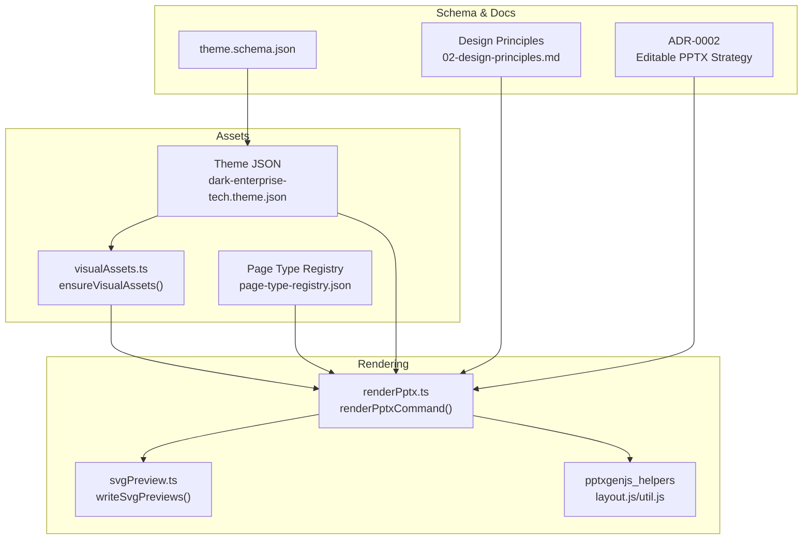
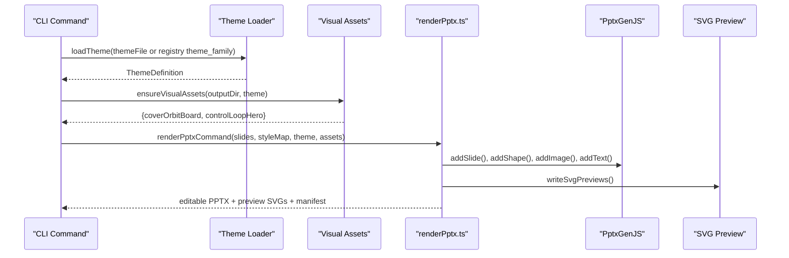
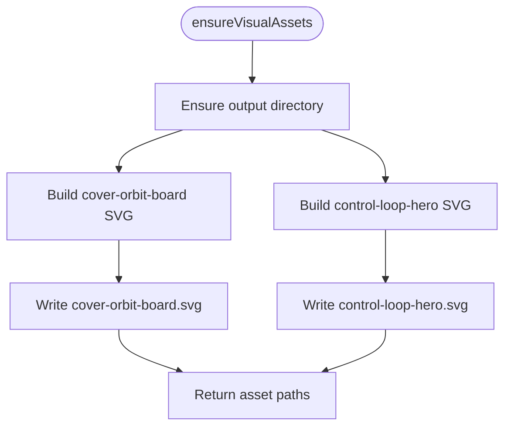
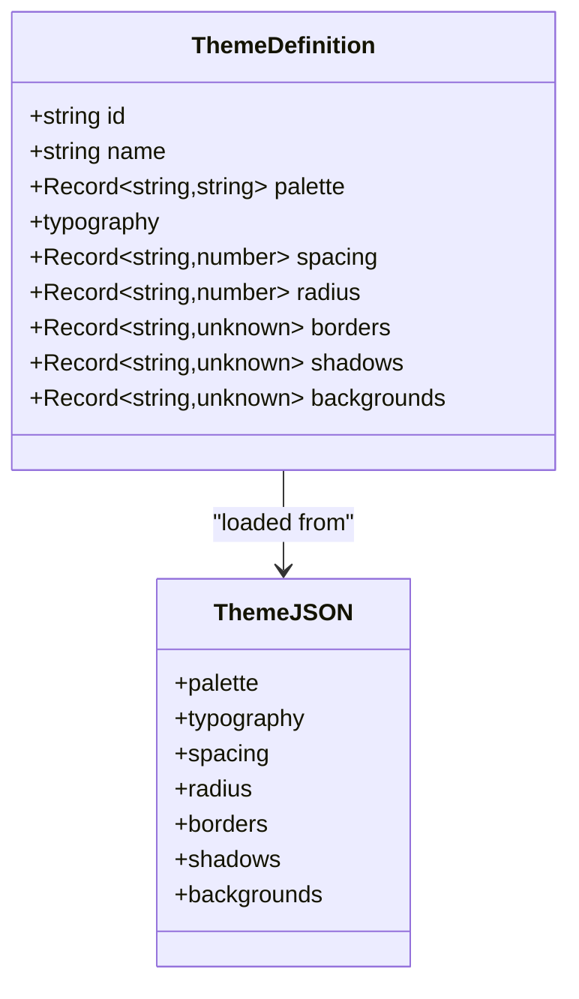
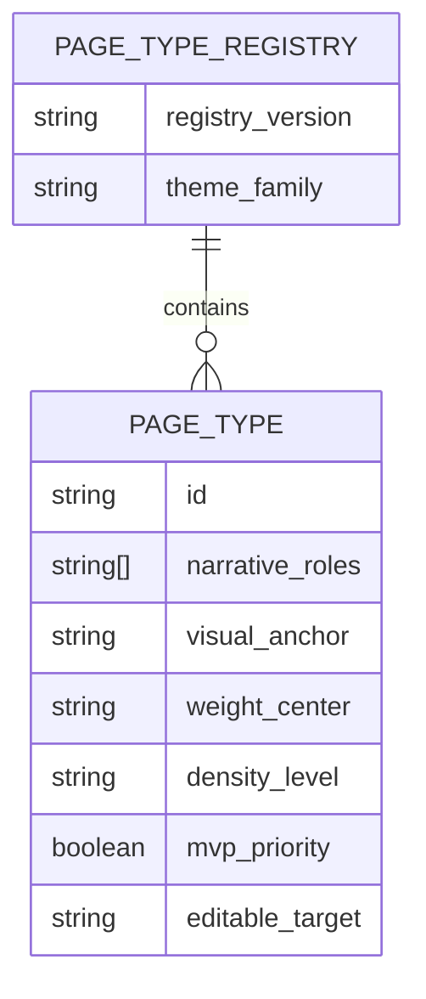
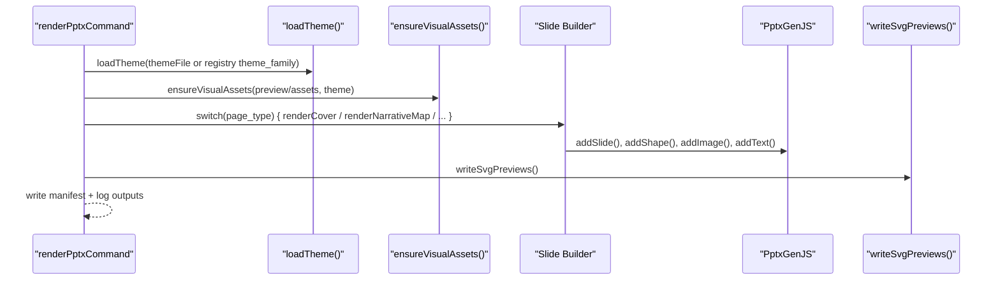
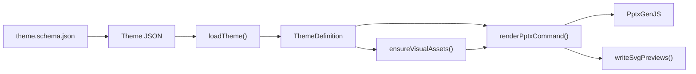

# Assets and Resources

<cite>
**Referenced Files in This Document**
- [README.md](file://README.md)
- [package.json](file://package.json)
- [02-design-principles.md](file://02-design-principles.md)
- [src/lib/render/visualAssets.ts](file://src/lib/render/visualAssets.ts)
- [src/commands/renderPptx.ts](file://src/commands/renderPptx.ts)
- [src/lib/render/svgPreview.ts](file://src/lib/render/svgPreview.ts)
- [src/lib/style/loadTheme.ts](file://src/lib/style/loadTheme.ts)
- [style/themes/dark-enterprise-tech.theme.json](file://style/themes/dark-enterprise-tech.theme.json)
- [style/patterns/page-type-registry.json](file://style/patterns/page-type-registry.json)
- [schemas/theme.schema.json](file://schemas/theme.schema.json)
- [docs/decisions/ADR-0002-editable-pptx-strategy.md](file://docs/decisions/ADR-0002-editable-pptx-strategy.md)
</cite>

## Table of Contents
1. [Introduction](#introduction)
2. [Project Structure](#project-structure)
3. [Core Components](#core-components)
4. [Architecture Overview](#architecture-overview)
5. [Detailed Component Analysis](#detailed-component-analysis)
6. [Dependency Analysis](#dependency-analysis)
7. [Performance Considerations](#performance-considerations)
8. [Troubleshooting Guide](#troubleshooting-guide)
9. [Conclusion](#conclusion)
10. [Appendices](#appendices)

## Introduction
This document describes the assets and resources used by the Enterprise PPT System’s visual components and generated outputs. It explains the UI primitives library, background assets, illustration collections, and icon systems, and documents asset management strategies, optimization techniques, and integration patterns with the rendering pipeline. It also covers practical examples of asset usage, customization options, quality standards, lifecycle management, version control, and distribution strategies tailored for enterprise presentation systems.

## Project Structure
The assets ecosystem centers around:
- Theme-driven visual primitives and SVG-based hero assets
- Page-type-driven composition and rendering
- Dual-path rendering: editable PPTX and SVG previews
- Schema-driven theme validation and registry-based page-type metadata

**Diagram sources**
- [src/lib/render/visualAssets.ts:1-122](file://src/lib/render/visualAssets.ts#L1-L122)
- [src/commands/renderPptx.ts:83-187](file://src/commands/renderPptx.ts#L83-L187)
- [src/lib/render/svgPreview.ts:81-112](file://src/lib/render/svgPreview.ts#L81-L112)
- [style/themes/dark-enterprise-tech.theme.json:1-55](file://style/themes/dark-enterprise-tech.theme.json#L1-L55)
- [style/patterns/page-type-registry.json:1-115](file://style/patterns/page-type-registry.json#L1-L115)
- [schemas/theme.schema.json:1-57](file://schemas/theme.schema.json#L1-L57)
- [02-design-principles.md:1-44](file://02-design-principles.md#L1-L44)
- [docs/decisions/ADR-0002-editable-pptx-strategy.md:1-28](file://docs/decisions/ADR-0002-editable-pptx-strategy.md#L1-L28)

**Section sources**
- [README.md:1-38](file://README.md#L1-L38)
- [package.json:1-24](file://package.json#L1-L24)

## Core Components
- Theme system defines palette, typography, spacing, radius, borders, shadows, and backgrounds. It is loaded via a typed interface and consumed by both visual assets and rendering logic.
- Visual assets generator produces reusable SVGs (e.g., cover orbit board, control loop hero) and writes them to disk for later embedding in slides.
- Rendering command orchestrates theme loading, asset generation, slide-by-slide composition, and preview generation. It integrates with PptxGenJS for editable PPTX and with helper utilities for layout and shadows.
- Page-type registry maps slide IDs to narrative roles, visual anchors, density, and editable targets, enabling consistent asset usage per page type.
- Preview pipeline generates SVGs for quick review and iteration prior to full PPTX export.

**Section sources**
- [src/lib/style/loadTheme.ts:1-28](file://src/lib/style/loadTheme.ts#L1-L28)
- [style/themes/dark-enterprise-tech.theme.json:1-55](file://style/themes/dark-enterprise-tech.theme.json#L1-L55)
- [src/lib/render/visualAssets.ts:1-122](file://src/lib/render/visualAssets.ts#L1-L122)
- [src/commands/renderPptx.ts:83-187](file://src/commands/renderPptx.ts#L83-L187)
- [style/patterns/page-type-registry.json:1-115](file://style/patterns/page-type-registry.json#L1-L115)
- [src/lib/render/svgPreview.ts:81-112](file://src/lib/render/svgPreview.ts#L81-L112)

## Architecture Overview
The asset pipeline connects theme definitions to page-type-driven rendering, producing both editable PPTX and SVG previews. Visual assets are generated once per theme and reused across slides.

**Diagram sources**
- [src/commands/renderPptx.ts:83-187](file://src/commands/renderPptx.ts#L83-L187)
- [src/lib/render/visualAssets.ts:11-24](file://src/lib/render/visualAssets.ts#L11-L24)
- [src/lib/style/loadTheme.ts:22-28](file://src/lib/style/loadTheme.ts#L22-L28)
- [src/lib/render/svgPreview.ts:81-112](file://src/lib/render/svgPreview.ts#L81-L112)

## Detailed Component Analysis

### Visual Assets Library
- Purpose: Generate and persist SVG-based visual primitives for repeated use across slides.
- Inputs: ThemeDefinition (palette, typography).
- Outputs: Paths to generated SVGs (e.g., cover-orbit-board.svg, control-loop-hero.svg).
- Implementation highlights:
  - Ensures output directory exists.
  - Writes two SVGs: one for cover orbit and one for control loop hero.
  - Uses theme palette and typography family in SVG definitions.
- Integration:
  - Called during render pipeline to produce assets under the preview directory.
  - Embedded as images in specific page types (e.g., cover_orbit, bottleneck_shift).

**Diagram sources**
- [src/lib/render/visualAssets.ts:11-24](file://src/lib/render/visualAssets.ts#L11-L24)

**Section sources**
- [src/lib/render/visualAssets.ts:1-122](file://src/lib/render/visualAssets.ts#L1-L122)
- [src/commands/renderPptx.ts:109-109](file://src/commands/renderPptx.ts#L109-L109)

### Theme System and Design Tokens
- ThemeDefinition provides strongly-typed access to palette, typography, spacing, radius, borders, shadows, and backgrounds.
- Theme JSON enforces schema compliance and centralizes brand and design tokens.
- Typography family is used consistently across both SVGs and PPTX text.

**Diagram sources**
- [src/lib/style/loadTheme.ts:4-20](file://src/lib/style/loadTheme.ts#L4-L20)
- [style/themes/dark-enterprise-tech.theme.json:1-55](file://style/themes/dark-enterprise-tech.theme.json#L1-L55)
- [schemas/theme.schema.json:1-57](file://schemas/theme.schema.json#L1-L57)

**Section sources**
- [src/lib/style/loadTheme.ts:1-28](file://src/lib/style/loadTheme.ts#L1-L28)
- [style/themes/dark-enterprise-tech.theme.json:1-55](file://style/themes/dark-enterprise-tech.theme.json#L1-L55)
- [schemas/theme.schema.json:1-57](file://schemas/theme.schema.json#L1-L57)

### Page-Type Registry and Asset Mapping
- The registry associates each page type with narrative roles, visual anchors, density, MVP priority, and editable target.
- Visual anchors guide how assets (e.g., hero visuals) are placed and sized on slides.
- Editable targets indicate whether native shapes/text or hybrid native+SVG are preferred.

**Diagram sources**
- [style/patterns/page-type-registry.json:1-115](file://style/patterns/page-type-registry.json#L1-L115)

**Section sources**
- [style/patterns/page-type-registry.json:1-115](file://style/patterns/page-type-registry.json#L1-L115)

### Rendering Pipeline and Asset Integration
- The render command:
  - Loads slides and style map.
  - Loads theme (from explicit file or registry theme_family).
  - Generates visual assets under preview assets directory.
  - Renders slides using PptxGenJS, applying theme tokens and embedding SVG assets where appropriate.
  - Produces editable PPTX, SVG previews, and a render manifest.
- Helper utilities enforce layout quality and safe shadow application.

**Diagram sources**
- [src/commands/renderPptx.ts:83-187](file://src/commands/renderPptx.ts#L83-L187)
- [src/lib/render/visualAssets.ts:11-24](file://src/lib/render/visualAssets.ts#L11-L24)
- [src/lib/render/svgPreview.ts:81-112](file://src/lib/render/svgPreview.ts#L81-L112)

**Section sources**
- [src/commands/renderPptx.ts:83-187](file://src/commands/renderPptx.ts#L83-L187)
- [docs/decisions/ADR-0002-editable-pptx-strategy.md:1-28](file://docs/decisions/ADR-0002-editable-pptx-strategy.md#L1-L28)

### Practical Examples of Asset Usage
- Cover Orbit Slide:
  - Uses the cover-orbit-board asset as a hero image within a rounded rectangle frame.
  - Applies theme palette for fills, strokes, and text.
  - Adjusts hero frame sizing depending on image usage mode.
- Bottleneck Shift Slide:
  - Embeds the control-loop-hero asset as a contextual hero.
  - Complements with support cards and decision cues aligned to theme tokens.
- Narrative Map and Summary Slides:
  - Use theme-consistent cards, pill labels, and typography for readability and brand coherence.

These examples demonstrate how page types select and position assets while preserving theme fidelity.

**Section sources**
- [src/commands/renderPptx.ts:246-363](file://src/commands/renderPptx.ts#L246-L363)
- [src/commands/renderPptx.ts:438-540](file://src/commands/renderPptx.ts#L438-L540)
- [src/commands/renderPptx.ts:542-645](file://src/commands/renderPptx.ts#L542-L645)

### Customization Options and Quality Standards
- Customization:
  - Change theme JSON to alter palette, typography, and spacing.
  - Modify page-type registry to adjust visual anchors and editable targets.
  - Tune asset generation parameters (e.g., sizes, gradients) in visual assets builder.
- Quality standards:
  - Maintain consistent visual centering and page weight per design principles.
  - Prefer native PPTX objects for editability; use SVG insertion as a temporary bridge.
  - Ensure previews and delivery share contracts to avoid divergence.

**Section sources**
- [02-design-principles.md:17-29](file://02-design-principles.md#L17-L29)
- [docs/decisions/ADR-0002-editable-pptx-strategy.md:14-27](file://docs/decisions/ADR-0002-editable-pptx-strategy.md#L14-L27)

## Dependency Analysis
Key dependencies and relationships:
- ThemeDefinition depends on theme JSON and schema validation.
- Visual assets depend on ThemeDefinition for color and font tokens.
- Rendering command depends on theme loader, visual assets generator, and helper utilities.
- Preview pipeline depends on rendering logic to produce SVGs for review.

**Diagram sources**
- [src/lib/style/loadTheme.ts:22-28](file://src/lib/style/loadTheme.ts#L22-L28)
- [src/lib/render/visualAssets.ts:11-24](file://src/lib/render/visualAssets.ts#L11-L24)
- [src/commands/renderPptx.ts:83-187](file://src/commands/renderPptx.ts#L83-L187)
- [src/lib/render/svgPreview.ts:81-112](file://src/lib/render/svgPreview.ts#L81-L112)
- [schemas/theme.schema.json:1-57](file://schemas/theme.schema.json#L1-L57)

**Section sources**
- [src/lib/style/loadTheme.ts:1-28](file://src/lib/style/loadTheme.ts#L1-L28)
- [src/lib/render/visualAssets.ts:1-122](file://src/lib/render/visualAssets.ts#L1-L122)
- [src/commands/renderPptx.ts:83-187](file://src/commands/renderPptx.ts#L83-L187)
- [schemas/theme.schema.json:1-57](file://schemas/theme.schema.json#L1-L57)

## Performance Considerations
- Keep asset generation idempotent and scoped to theme changes to minimize rebuild overhead.
- Prefer vector assets (SVG) for scalability and consistent quality across resolutions.
- Use helper utilities for shadows and layout warnings to reduce manual tuning and errors.
- Separate preview and delivery outputs to optimize for speed during iteration and fidelity for final delivery.

[No sources needed since this section provides general guidance]

## Troubleshooting Guide
- Missing required arguments:
  - Ensure both slides and style map paths are provided to the render command.
- Theme mismatch:
  - Verify theme JSON conforms to schema and matches registry theme_family.
- Asset path issues:
  - Confirm ensureVisualAssets writes files to the expected preview assets directory.
- Layout warnings:
  - Review overlaps and out-of-bounds elements flagged by helper utilities.
- Editable delivery:
  - Confirm editable PPTX is produced and previews are accessible via index.html.

**Section sources**
- [src/commands/renderPptx.ts:94-99](file://src/commands/renderPptx.ts#L94-L99)
- [src/commands/renderPptx.ts:111-113](file://src/commands/renderPptx.ts#L111-L113)
- [src/commands/renderPptx.ts:157-158](file://src/commands/renderPptx.ts#L157-L158)
- [docs/decisions/ADR-0002-editable-pptx-strategy.md:24-27](file://docs/decisions/ADR-0002-editable-pptx-strategy.md#L24-L27)

## Conclusion
The Enterprise PPT System’s assets and resources are designed around a theme-driven, schema-validated foundation that enables consistent, editable, and scalable presentation outputs. Visual assets are generated once per theme and embedded strategically across page types, while the rendering pipeline ensures both preview and delivery paths remain synchronized. By adhering to design principles and leveraging helper utilities, teams can maintain quality, traceability, and enterprise-grade editability across decks.

[No sources needed since this section summarizes without analyzing specific files]

## Appendices

### Best Practices for Asset Creation, Optimization, and Maintenance
- Centralize design tokens in theme JSON and validate with schema.
- Use page-type registry to standardize visual anchors and editable targets.
- Generate SVG assets programmatically from theme tokens for consistency.
- Keep preview and delivery outputs decoupled but contractually aligned.
- Version and distribute assets alongside theme updates and page-type changes.
- Enforce layout and shadow helpers to reduce manual errors and improve reproducibility.

[No sources needed since this section provides general guidance]