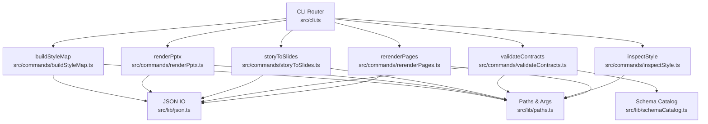
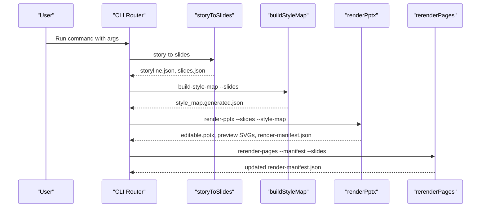
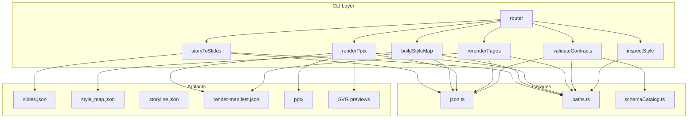
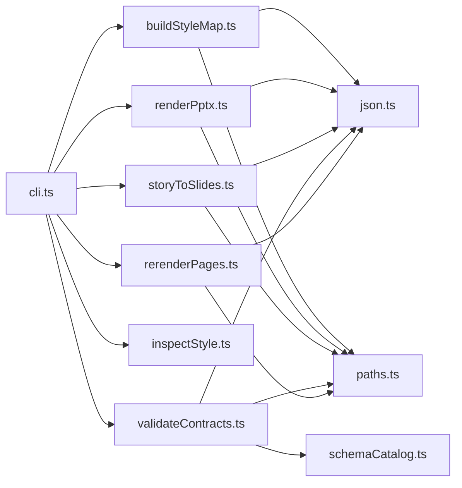

# CLI Commands

<cite>
**Referenced Files in This Document**
- [cli.ts](file://src/cli.ts)
- [buildStyleMap.ts](file://src/commands/buildStyleMap.ts)
- [renderPptx.ts](file://src/commands/renderPptx.ts)
- [storyToSlides.ts](file://src/commands/storyToSlides.ts)
- [validateContracts.ts](file://src/commands/validateContracts.ts)
- [inspectStyle.ts](file://src/commands/inspectStyle.ts)
- [rerenderPages.ts](file://src/commands/rerenderPages.ts)
- [paths.ts](file://src/lib/paths.ts)
- [json.ts](file://src/lib/json.ts)
- [schemaCatalog.ts](file://src/lib/schemaCatalog.ts)
- [package.json](file://package.json)
- [slides_output.schema.json](file://schemas/slides_output.schema.json)
- [storyline_output.schema.json](file://schemas/storyline_output.schema.json)
- [pattern_card.example.json](file://examples/pattern_card.example.json)
</cite>

## Table of Contents
1. [Introduction](#introduction)
2. [Project Structure](#project-structure)
3. [Core Components](#core-components)
4. [Architecture Overview](#architecture-overview)
5. [Detailed Component Analysis](#detailed-component-analysis)
6. [Dependency Analysis](#dependency-analysis)
7. [Performance Considerations](#performance-considerations)
8. [Troubleshooting Guide](#troubleshooting-guide)
9. [Conclusion](#conclusion)
10. [Appendices](#appendices)

## Introduction
This document provides comprehensive CLI command documentation for the Enterprise PPT System. It focuses on the central command router and six core commands: buildStyleMap, renderPptx, storyToSlides, validateContracts, inspectStyle, and rerenderPages. For each command, you will find purpose, required arguments, optional parameters, expected input/output formats, typical usage patterns, error handling, validation behaviors, and integration with other system components. Practical examples show command combinations for complete workflows and incremental updates, along with troubleshooting guidance and an explanation of how commands fit into the overall pipeline architecture.

## Project Structure
The CLI is implemented as a single entry point that dispatches to individual command handlers. Each command reads and writes JSON artifacts, integrates with style/theme registries, and coordinates with external rendering libraries for PPTX generation and SVG previews.

**Diagram sources**
- [cli.ts:1-57](file://src/cli.ts#L1-L57)
- [buildStyleMap.ts:1-110](file://src/commands/buildStyleMap.ts#L1-L110)
- [renderPptx.ts:1-801](file://src/commands/renderPptx.ts#L1-L801)
- [storyToSlides.ts:1-166](file://src/commands/storyToSlides.ts#L1-L166)
- [validateContracts.ts:1-100](file://src/commands/validateContracts.ts#L1-L100)
- [inspectStyle.ts:1-14](file://src/commands/inspectStyle.ts#L1-L14)
- [rerenderPages.ts:1-40](file://src/commands/rerenderPages.ts#L1-L40)
- [json.ts:1-14](file://src/lib/json.ts#L1-L14)
- [paths.ts:1-20](file://src/lib/paths.ts#L1-L20)
- [schemaCatalog.ts:1-24](file://src/lib/schemaCatalog.ts#L1-L24)

**Section sources**
- [cli.ts:1-57](file://src/cli.ts#L1-L57)
- [package.json:6-12](file://package.json#L6-L12)

## Core Components
- Central CLI router: parses argv, dispatches to named command handlers, prints help, and handles uncaught errors.
- Command handlers: implement specific workflows for building style maps, rendering PPTX, scaffolding storylines/slides, validating contracts, inspecting style metadata, and marking pages for rerender.
- Shared libraries: JSON file I/O, argument parsing, repository path resolution, and schema catalog loading.

Key responsibilities:
- Argument parsing and validation per command.
- Artifact discovery and writing to conventional output locations.
- Integration with style/theme registries and rendering helpers.
- Manifest updates for rerender requests.

**Section sources**
- [cli.ts:19-56](file://src/cli.ts#L19-L56)
- [paths.ts:13-19](file://src/lib/paths.ts#L13-L19)
- [json.ts:4-13](file://src/lib/json.ts#L4-L13)

## Architecture Overview
The CLI orchestrates a layered pipeline:
- Judgment layer: story construction and page-type selection.
- Execution layer: schema validation, preview rendering, PPTX export, and QA.
- Editable delivery: native PPT objects via PptxGenJS.

**Diagram sources**
- [cli.ts:19-56](file://src/cli.ts#L19-L56)
- [storyToSlides.ts:12-165](file://src/commands/storyToSlides.ts#L12-L165)
- [buildStyleMap.ts:50-109](file://src/commands/buildStyleMap.ts#L50-L109)
- [renderPptx.ts:83-187](file://src/commands/renderPptx.ts#L83-L187)
- [rerenderPages.ts:15-39](file://src/commands/rerenderPages.ts#L15-L39)

## Detailed Component Analysis

### Command: build-style-map
Purpose:
- Build a style map from slides output by enriching each slide with page type, visual anchors, component bindings, and learned pattern metadata.

Required arguments:
- --slides <path>: Path to slides output JSON.

Optional parameters:
- --out <path>: Output path for the style map JSON. Defaults to a conventional location under style outputs.
- --theme <id>: Explicit theme ID override.

Expected input format:
- Slides output JSON with deck_title, optional theme_hint, and an array of slides containing identifiers, optional page_type/page_type_hint, notes, and layout_hints.

Expected output format:
- Style map JSON with theme_family and slides array. Each slide includes slide_id, page_type, visual_anchor, weight_center, density_level, component_bindings, editable_target, and optional learned_pattern with pattern metadata.

Processing logic:
- Loads slides output and registry.
- Resolves theme from explicit flag, theme_hint, or registry default.
- For each slide, validates page type presence, resolves registry entry, selects best pattern card, computes component bindings, and constructs style entries.
- Writes style map JSON.

Error handling:
- Throws if --slides is missing.
- Throws if a slide lacks page_type or page_type_hint.
- Throws if a page type is unknown in registry.

Typical usage:
- After storyToSlides produces slides.json, run build-style-map to produce style_map.generated.json.

Integration:
- Uses registry loader and theme loader; writes JSON via shared library.

**Section sources**
- [buildStyleMap.ts:50-109](file://src/commands/buildStyleMap.ts#L50-L109)
- [paths.ts:9-19](file://src/lib/paths.ts#L9-L19)
- [json.ts:4-13](file://src/lib/json.ts#L4-L13)

### Command: render-pptx
Purpose:
- Render an editable PPTX deck from slides and a style map, including SVG previews and a render manifest.

Required arguments:
- --slides <path>: Path to slides output JSON.
- --style-map <path>: Path to style map JSON.

Optional parameters:
- --theme-file <path>: Override theme file for rendering.
- --out-manifest <path>: Output path for render manifest JSON.
- --out-pptx <path>: Output path for the PPTX file.
- --out-preview-dir <path>: Output directory for SVG previews.

Expected input formats:
- Slides output JSON and style map JSON.
- Theme loaded from style map theme_family or explicit theme file.

Expected output formats:
- PPTX file (editable).
- SVG preview directory with index.html.
- Render manifest JSON with deck_id, version, generated_at, outputs, and slide_artifacts.

Processing logic:
- Validates slide counts match between inputs.
- Initializes PptxGenJS presentation with theme and metadata.
- Iterates slides, adds frame/header, and renders per page_type using specialized renderers.
- Writes PPTX, SVG previews, and manifest.

Error handling:
- Throws if required arguments are missing.
- Throws if slide count mismatch or missing style entries.
- Throws on validation failures from layout helpers.

Typical usage:
- After buildStyleMap, run render-pptx to generate PPTX and previews.

Integration:
- Uses PptxGenJS, layout helpers, and visual assets; writes JSON and files.

**Section sources**
- [renderPptx.ts:83-187](file://src/commands/renderPptx.ts#L83-L187)
- [json.ts:4-13](file://src/lib/json.ts#L4-L13)

### Command: story-to-slides
Purpose:
- Scaffold a storyline and slides JSON from research output, producing a minimal narrative structure and slide deck.

Required arguments:
- --research <path>: Path to research output JSON.

Optional parameters:
- --out-storyline <path>: Output path for storyline JSON.
- --out-slides <path>: Output path for slides JSON.

Expected input format:
- Research output JSON with topic, audience, objective, optional interpretations, and facts.

Expected output formats:
- Storyline JSON with deck_title, audience, and narrative structure.
- Slides JSON with deck_title, theme_hint, and a small set of slides covering intro, chapter, and summary.

Processing logic:
- Selects primary and secondary statements from research.
- Builds a fixed narrative with three chapters and four slides.
- Writes both outputs.

Error handling:
- Throws if --research is missing.

Typical usage:
- Start a new deck by converting research to slides and storyline.

Integration:
- Uses shared JSON I/O and repository paths.

**Section sources**
- [storyToSlides.ts:12-165](file://src/commands/storyToSlides.ts#L12-L165)
- [json.ts:4-13](file://src/lib/json.ts#L4-L13)

### Command: validate-contracts
Purpose:
- Validate representative examples against all registered JSON schemas using AJV.

Behavior:
- Loads schema catalog from schemas/.
- Registers each schema with AJV.
- Iterates curated example files and validates each against its schema.
- Reports first validation failure with detailed messages.

Expected input formats:
- Example JSON files aligned to schema IDs.

Expected output formats:
- No artifacts written; logs success or throws on failure.

Processing logic:
- Builds AJV instance with strict settings.
- Adds all schemas from catalog.
- For each example, loads JSON and runs validator; collects errors.

Error handling:
- Throws if a validator is missing for a schema ID.
- Throws if any example fails validation with a combined error message.

Typical usage:
- Run as part of CI or pre-commit to ensure schema compliance.

Integration:
- Uses schema catalog loader and JSON I/O.

**Section sources**
- [validateContracts.ts:7-99](file://src/commands/validateContracts.ts#L7-L99)
- [schemaCatalog.ts:12-23](file://src/lib/schemaCatalog.ts#L12-L23)
- [json.ts:4-13](file://src/lib/json.ts#L4-L13)

### Command: inspect-style
Purpose:
- Inspect style metadata: theme, total page types, and MVP-priority page types.

Behavior:
- Loads page type registry and theme.
- Prints theme name/id, total page types, and MVP page type IDs.

Expected input formats:
- Registry and theme files discovered from registry.

Expected output formats:
- Console log output.

Processing logic:
- Reads registry and theme.
- Filters page types by MVP priority and prints counts and IDs.

Typical usage:
- Verify style configuration before rendering.

Integration:
- Uses registry and theme loaders.

**Section sources**
- [inspectStyle.ts:4-13](file://src/commands/inspectStyle.ts#L4-L13)

### Command: rerender-pages
Purpose:
- Mark specific slides in a render manifest for rerender by toggling their rerendered flag.

Required arguments:
- --manifest <path>: Path to render manifest JSON.
- --slides <id1,id2,...>: Comma-separated slide IDs.

Optional parameters:
- None.

Expected input format:
- Render manifest JSON with slide_artifacts array.

Expected output format:
- Updated render manifest JSON with slide_artifacts updated.

Processing logic:
- Parses slide IDs from --slides.
- Loads manifest, updates rerendered flags for matching slide_ids, refreshes generated_at.
- Writes updated manifest.

Error handling:
- Throws if required arguments are missing or if no slide IDs are provided.

Typical usage:
- After editing slides or style, mark affected slides to regenerate previews/PPTX.

Integration:
- Uses JSON I/O and path utilities.

**Section sources**
- [rerenderPages.ts:15-39](file://src/commands/rerenderPages.ts#L15-L39)
- [json.ts:4-13](file://src/lib/json.ts#L4-L13)

## Architecture Overview
The CLI routes to commands that operate on JSON artifacts and style registries. The render pipeline integrates with PptxGenJS and helper modules to produce editable PPTX and SVG previews. Validation ensures schema compliance across the system.

**Diagram sources**
- [cli.ts:10-17](file://src/cli.ts#L10-L17)
- [buildStyleMap.ts:50-109](file://src/commands/buildStyleMap.ts#L50-L109)
- [renderPptx.ts:83-187](file://src/commands/renderPptx.ts#L83-L187)
- [storyToSlides.ts:12-165](file://src/commands/storyToSlides.ts#L12-L165)
- [validateContracts.ts:7-99](file://src/commands/validateContracts.ts#L7-L99)
- [inspectStyle.ts:4-13](file://src/commands/inspectStyle.ts#L4-L13)
- [rerenderPages.ts:15-39](file://src/commands/rerenderPages.ts#L15-L39)
- [json.ts:4-13](file://src/lib/json.ts#L4-L13)
- [paths.ts:9-19](file://src/lib/paths.ts#L9-L19)
- [schemaCatalog.ts:12-23](file://src/lib/schemaCatalog.ts#L12-L23)

## Detailed Component Analysis

### Command Router and Help
- Routes to command handlers by name.
- Prints help when invoked without arguments or with help flags.
- Handles unknown commands and exits with non-zero code.

**Section sources**
- [cli.ts:19-56](file://src/cli.ts#L19-L56)

### Argument Parsing Utility
- Extracts the value for a given flag from argv.
- Returns undefined if flag is absent or dangling.

**Section sources**
- [paths.ts:13-19](file://src/lib/paths.ts#L13-L19)

### JSON I/O Utility
- Loads JSON from file with UTF-8 decoding.
- Writes JSON with pretty-print formatting and trailing newline.

**Section sources**
- [json.ts:4-13](file://src/lib/json.ts#L4-L13)

### Schema Catalog
- Discovers schema files in schemas/ and loads them into an id/schema map.

**Section sources**
- [schemaCatalog.ts:12-23](file://src/lib/schemaCatalog.ts#L12-L23)

### Data Model References
- Slides output schema defines deck_title, optional theme_hint, and slides array with page_type hints and layout hints.
- Storyline output schema defines narrative structure with chapters and slides.
- Pattern card example demonstrates learned pattern metadata used during style mapping.

**Section sources**
- [slides_output.schema.json:1-53](file://schemas/slides_output.schema.json#L1-L53)
- [storyline_output.schema.json:1-49](file://schemas/storyline_output.schema.json#L1-L49)
- [pattern_card.example.json:1-54](file://examples/pattern_card.example.json#L1-L54)

## Dependency Analysis
- Commands depend on shared JSON and path utilities.
- buildStyleMap and renderPptx depend on style/theme registries.
- renderPptx depends on PptxGenJS and helper modules for layout warnings and shadows.
- validateContracts depends on AJV and schema catalog.
- rerenderPages depends on JSON I/O and paths.

**Diagram sources**
- [cli.ts:1-57](file://src/cli.ts#L1-L57)
- [buildStyleMap.ts:1-110](file://src/commands/buildStyleMap.ts#L1-L110)
- [renderPptx.ts:1-801](file://src/commands/renderPptx.ts#L1-L801)
- [storyToSlides.ts:1-166](file://src/commands/storyToSlides.ts#L1-L166)
- [validateContracts.ts:1-100](file://src/commands/validateContracts.ts#L1-L100)
- [inspectStyle.ts:1-14](file://src/commands/inspectStyle.ts#L1-L14)
- [rerenderPages.ts:1-40](file://src/commands/rerenderPages.ts#L1-L40)
- [json.ts:1-14](file://src/lib/json.ts#L1-L14)
- [paths.ts:1-20](file://src/lib/paths.ts#L1-L20)
- [schemaCatalog.ts:1-24](file://src/lib/schemaCatalog.ts#L1-L24)

**Section sources**
- [cli.ts:1-57](file://src/cli.ts#L1-L57)

## Performance Considerations
- Rendering PPTX iterates slides and performs layout checks; keep slide counts reasonable for initial iterations.
- SVG preview generation writes many files; ensure adequate disk space and permissions.
- Schema validation loads and registers all schemas; avoid frequent invocations in tight loops.
- Style map computation uses asynchronous pattern lookup per slide; cache results externally if reusing the same inputs.

## Troubleshooting Guide
Common issues and resolutions:
- Missing required arguments:
  - build-style-map requires --slides; render-pptx requires --slides and --style-map; rerender-pages requires --manifest and --slides.
  - Fix: Provide all required flags with valid paths.
- Unknown page type:
  - build-style-map throws if a slide’s page_type is not found in the registry.
  - Fix: Ensure page_type or page_type_hint matches registry entries.
- Slide count mismatch:
  - render-pptx throws if slides and style map lengths differ.
  - Fix: Re-run build-style-map after updating slides.
- No slide IDs provided:
  - rerender-pages throws if --slides is empty or invalid.
  - Fix: Provide comma-separated slide IDs.
- Validation failures:
  - validate-contracts throws with detailed AJV errors.
  - Fix: Align example data to schema definitions; consult schema files and examples.
- PPTX output conflicts:
  - render-pptx appends a timestamped suffix if the target exists.
  - Fix: Use --out-pptx to specify a unique path or remove existing file.

**Section sources**
- [buildStyleMap.ts:52-74](file://src/commands/buildStyleMap.ts#L52-L74)
- [renderPptx.ts:97-113](file://src/commands/renderPptx.ts#L97-L113)
- [rerenderPages.ts:19-26](file://src/commands/rerenderPages.ts#L19-L26)
- [validateContracts.ts:85-96](file://src/commands/validateContracts.ts#L85-L96)
- [renderPptx.ts:791-800](file://src/commands/renderPptx.ts#L791-L800)

## Conclusion
The CLI provides a focused set of commands that implement a clear pipeline: story scaffolding, style mapping, rendering, validation, inspection, and incremental rerendering. By adhering to the documented inputs/outputs and argument requirements, teams can reliably produce editable decks while maintaining schema-driven contracts and style consistency.

## Appendices

### Command Reference Summary
- build-style-map
  - Purpose: Build style map from slides output.
  - Required: --slides <path>.
  - Optional: --out <path>, --theme <id>.
  - Outputs: style_map.generated.json.
- render-pptx
  - Purpose: Render editable PPTX and previews.
  - Required: --slides <path>, --style-map <path>.
  - Optional: --theme-file <path>, --out-manifest <path>, --out-pptx <path>, --out-preview-dir <path>.
  - Outputs: PPTX, SVG previews, render-manifest.json.
- story-to-slides
  - Purpose: Scaffold storyline and slides from research.
  - Required: --research <path>.
  - Optional: --out-storyline <path>, --out-slides <path>.
  - Outputs: storyline.generated.json, slides.generated.json.
- validate-contracts
  - Purpose: Validate examples against schemas.
  - Required: none.
  - Optional: none.
  - Outputs: console logs; throws on failure.
- inspect-style
  - Purpose: Inspect theme and page types.
  - Required: none.
  - Optional: none.
  - Outputs: console logs.
- rerender-pages
  - Purpose: Mark slides for rerender in manifest.
  - Required: --manifest <path>, --slides <id1,id2>.
  - Optional: none.
  - Outputs: updated render-manifest.json.

### Typical Workflows and Examples
- Complete workflow:
  - tsx src/cli.ts story-to-slides --research <path>
  - tsx src/cli.ts build-style-map --slides <slides.json>
  - tsx src/cli.ts render-pptx --slides <slides.json> --style-map <style_map.json>
- Incremental update:
  - Edit slides.json or style assets.
  - tsx src/cli.ts rerender-pages --manifest <render-manifest.json> --slides <id1,id2>
  - tsx src/cli.ts render-pptx --slides <slides.json> --style-map <style_map.json>

**Section sources**
- [cli.ts:39-50](file://src/cli.ts#L39-L50)
- [package.json:7-12](file://package.json#L7-L12)