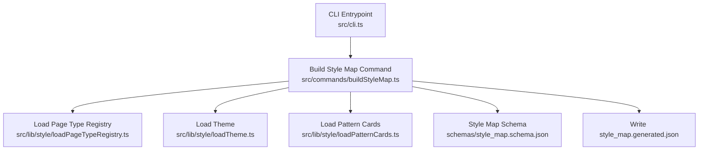
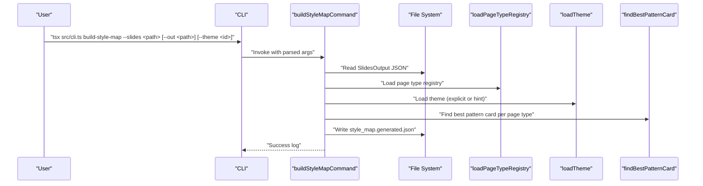
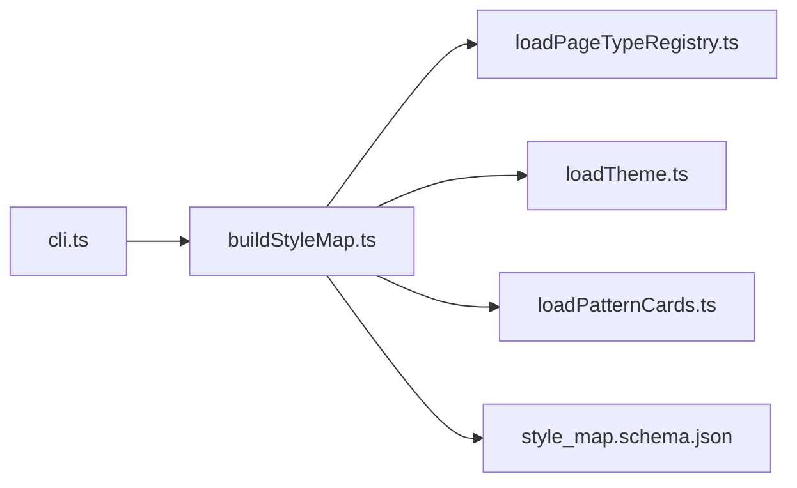

# Build-Style-Map Command

<cite>
**Referenced Files in This Document**
- [buildStyleMap.ts](file://src/commands/buildStyleMap.ts)
- [cli.ts](file://src/cli.ts)
- [loadPageTypeRegistry.ts](file://src/lib/style/loadPageTypeRegistry.ts)
- [loadPatternCards.ts](file://src/lib/style/loadPatternCards.ts)
- [loadTheme.ts](file://src/lib/style/loadTheme.ts)
- [style_map.schema.json](file://schemas/style_map.schema.json)
- [page-type-registry.json](file://style/patterns/page-type-registry.json)
- [dark-enterprise-tech.theme.json](file://style/themes/dark-enterprise-tech.theme.json)
- [template.pattern-card.json](file://style/patterns/template.pattern-card.json)
- [bottleneck_shift.openclaw-seed.pattern.json](file://style/patterns/bottleneck_shift.openclaw-seed.pattern.json)
</cite>

## Table of Contents
1. [Introduction](#introduction)
2. [Project Structure](#project-structure)
3. [Core Components](#core-components)
4. [Architecture Overview](#architecture-overview)
5. [Detailed Component Analysis](#detailed-component-analysis)
6. [Dependency Analysis](#dependency-analysis)
7. [Performance Considerations](#performance-considerations)
8. [Troubleshooting Guide](#troubleshooting-guide)
9. [Conclusion](#conclusion)

## Introduction
The build-style-map CLI command transforms validated slide content into a style map that drives the rendering pipeline. It consumes validated slides output, resolves page types, selects pattern cards, merges theme definitions, and writes a normalized style map artifact. This document explains the command’s parameters, processing logic, and the style resolution process, and provides examples and troubleshooting guidance.

## Project Structure
The build-style-map command is part of the CLI entrypoint and integrates with style-loading utilities and schemas.

**Diagram sources**
- [cli.ts:10-17](file://src/cli.ts#L10-L17)
- [buildStyleMap.ts:50-109](file://src/commands/buildStyleMap.ts#L50-L109)
- [loadPageTypeRegistry.ts:18-20](file://src/lib/style/loadPageTypeRegistry.ts#L18-L20)
- [loadTheme.ts:22-28](file://src/lib/style/loadTheme.ts#L22-L28)
- [loadPatternCards.ts:29-48](file://src/lib/style/loadPatternCards.ts#L29-L48)
- [style_map.schema.json:1-70](file://schemas/style_map.schema.json#L1-L70)

**Section sources**
- [cli.ts:10-17](file://src/cli.ts#L10-L17)
- [buildStyleMap.ts:50-109](file://src/commands/buildStyleMap.ts#L50-L109)

## Core Components
- Command definition and invocation:
  - Registered under the name build-style-map in the CLI.
  - Accepts arguments: --slides, --out, and --theme.
- Input data model:
  - SlidesOutput defines the validated slide content consumed by the command.
- Output data model:
  - StyleMap defines the normalized style map written to disk.
- Supporting utilities:
  - Page type registry loader.
  - Theme loader.
  - Pattern card loader and best-match resolver.

Key behaviors:
- Validates presence of --slides.
- Loads SlidesOutput and page type registry.
- Resolves theme via explicit --theme, fallback to SlidesOutput.theme_hint, or registry default.
- For each slide, validates page_type or page_type_hint, resolves registry entry, finds best pattern card, and constructs style map entries.
- Writes the style map to --out or a default path.

**Section sources**
- [buildStyleMap.ts:50-109](file://src/commands/buildStyleMap.ts#L50-L109)
- [cli.ts:39-50](file://src/cli.ts#L39-L50)
- [loadPageTypeRegistry.ts:18-20](file://src/lib/style/loadPageTypeRegistry.ts#L18-L20)
- [loadTheme.ts:22-28](file://src/lib/style/loadTheme.ts#L22-L28)
- [loadPatternCards.ts:39-48](file://src/lib/style/loadPatternCards.ts#L39-L48)
- [style_map.schema.json:1-70](file://schemas/style_map.schema.json#L1-L70)

## Architecture Overview
The build-style-map command orchestrates data loading, page type resolution, pattern matching, and output writing.

**Diagram sources**
- [cli.ts:19-37](file://src/cli.ts#L19-L37)
- [buildStyleMap.ts:50-109](file://src/commands/buildStyleMap.ts#L50-L109)
- [loadPageTypeRegistry.ts:18-20](file://src/lib/style/loadPageTypeRegistry.ts#L18-L20)
- [loadTheme.ts:22-28](file://src/lib/style/loadTheme.ts#L22-L28)
- [loadPatternCards.ts:39-48](file://src/lib/style/loadPatternCards.ts#L39-L48)

## Detailed Component Analysis

### Command Parameters and Invocation
- --slides <path>: Required input path to validated slides JSON.
- --out <path>: Optional output path for the style map. Defaults to style/outputs/style_map.generated.json.
- --theme <id>: Optional theme identifier or path. If omitted, falls back to SlidesOutput.theme_hint or the registry’s theme_family.

Help text and registration:
- The CLI registers the build-style-map command and prints usage help that includes the command signature.

**Section sources**
- [buildStyleMap.ts:50-58](file://src/commands/buildStyleMap.ts#L50-L58)
- [cli.ts:39-50](file://src/cli.ts#L39-L50)

### Slides Input Model
The command expects a SlidesOutput object containing:
- deck_title
- theme_hint
- slides array with:
  - id
  - page_type or page_type_hint
  - notes.visual_anchor
  - layout_hints.weight_center and density_level

Validation:
- page_type or page_type_hint must be present for each slide.
- Unknown page types cause an error.

**Section sources**
- [buildStyleMap.ts:7-22](file://src/commands/buildStyleMap.ts#L7-L22)
- [buildStyleMap.ts:66-74](file://src/commands/buildStyleMap.ts#L66-L74)

### Page Type Registry and Assignment
- The registry provides default values for each page type: visual_anchor, weight_center, density_level, editable_target, and narrative roles.
- The command builds an in-memory map keyed by page_type id for O(1) lookup.
- If a slide lacks page_type, the command throws an error.

**Section sources**
- [loadPageTypeRegistry.ts:4-16](file://src/lib/style/loadPageTypeRegistry.ts#L4-L16)
- [page-type-registry.json:1-115](file://style/patterns/page-type-registry.json#L1-L115)
- [buildStyleMap.ts:63-74](file://src/commands/buildStyleMap.ts#L63-L74)

### Pattern Matching Algorithm
- For each page type, the command loads all pattern cards and filters by page_type.
- If multiple candidates exist, it prefers cards containing "openclaw_seed" in the id; otherwise, it selects the first candidate.
- The best pattern contributes:
  - visual_anchor, weight_center, layout_rules, alignment_rules, highlight_grammar, image_usage, component_recipe, editable_target
  - These inform style resolution and component bindings.

**Section sources**
- [loadPatternCards.ts:29-48](file://src/lib/style/loadPatternCards.ts#L29-L48)
- [buildStyleMap.ts:75-98](file://src/commands/buildStyleMap.ts#L75-L98)

### Theme Selection and Resolution
- The theme is resolved in order:
  1) Explicit --theme argument (supports either a theme id or a direct .json path)
  2) SlidesOutput.theme_hint
  3) Registry theme_family
- The theme id is stored in the style map as theme_family.

**Section sources**
- [buildStyleMap.ts:61](file://src/commands/buildStyleMap.ts#L61)
- [loadTheme.ts:22-28](file://src/lib/style/loadTheme.ts#L22-L28)
- [dark-enterprise-tech.theme.json:1-55](file://style/themes/dark-enterprise-tech.theme.json#L1-L55)

### Style Resolution Process
For each slide, the command computes:
- slide_id: from input
- page_type: resolved from input
- visual_anchor: pattern visual_anchor, else input notes.visual_anchor, else registry visual_anchor
- weight_center: pattern weight_center, else input layout_hints.weight_center, else registry weight_center
- density_level: input layout_hints.density_level, else registry density_level
- component_bindings: registry visual_anchor plus pattern.component_recipe (deduplicated)
- editable_target: pattern editable_target, else registry editable_target
- learned_pattern: optional, populated when a pattern matches

Finally, the style map is written to the output path.

**Section sources**
- [buildStyleMap.ts:79-105](file://src/commands/buildStyleMap.ts#L79-L105)

### Output Artifact and Validation
The style map adheres to the style_map.schema.json, ensuring:
- theme_family
- slides array with required fields per slide
- Optional learned_pattern with nested fields for pattern metadata and image usage

**Section sources**
- [style_map.schema.json:1-70](file://schemas/style_map.schema.json#L1-L70)
- [buildStyleMap.ts:102-109](file://src/commands/buildStyleMap.ts#L102-L109)

### Examples of Style Map Generation

- Example: Cover Orbit with Dark Enterprise Tech theme
  - Page type: cover_orbit
  - Registry defaults: visual_anchor, weight_center, density_level medium, editable_target
  - Pattern card: template.pattern-card.json provides layout_rules, alignment_rules, highlight_grammar, component_recipe, and image_usage
  - Output: style_map with slide-level overrides resolved from pattern and registry

- Example: Bottleneck Shift with Dark Enterprise Tech theme
  - Page type: bottleneck_shift
  - Pattern card: bottleneck_shift.openclaw-seed.pattern.json supplies rules and component_recipe
  - Output: slide-level style map reflecting pattern-driven composition and component bindings

These examples illustrate how page types, patterns, and themes combine to produce a style map suitable for rendering.

**Section sources**
- [page-type-registry.json:4-115](file://style/patterns/page-type-registry.json#L4-L115)
- [template.pattern-card.json:1-46](file://style/patterns/template.pattern-card.json#L1-L46)
- [bottleneck_shift.openclaw-seed.pattern.json:1-46](file://style/patterns/bottleneck_shift.openclaw-seed.pattern.json#L1-L46)
- [dark-enterprise-tech.theme.json:1-55](file://style/themes/dark-enterprise-tech.theme.json#L1-L55)

## Dependency Analysis
The build-style-map command depends on:
- CLI registration and argument parsing
- SlidesOutput JSON input
- Page type registry for defaults
- Theme definition for visual identity
- Pattern cards for composition rules and component recipes
- Style map schema for validation

**Diagram sources**
- [buildStyleMap.ts:1-5](file://src/commands/buildStyleMap.ts#L1-L5)
- [cli.ts:10-17](file://src/cli.ts#L10-L17)
- [loadPageTypeRegistry.ts:1-3](file://src/lib/style/loadPageTypeRegistry.ts#L1-L3)
- [loadTheme.ts:1-3](file://src/lib/style/loadTheme.ts#L1-L3)
- [loadPatternCards.ts:1-6](file://src/lib/style/loadPatternCards.ts#L1-L6)
- [style_map.schema.json:1-70](file://schemas/style_map.schema.json#L1-L70)

**Section sources**
- [buildStyleMap.ts:1-5](file://src/commands/buildStyleMap.ts#L1-L5)
- [cli.ts:10-17](file://src/cli.ts#L10-L17)

## Performance Considerations
- Loading and filtering pattern cards is linear in the number of pattern files; ensure the pattern directory remains reasonably sized.
- The command performs per-slide asynchronous work; consider batching or parallelization if scaling to very large decks.
- I/O bound operations dominate; caching or preloading registries and themes can reduce startup overhead.

## Troubleshooting Guide
Common issues and resolutions:

- Missing required argument --slides
  - Symptom: Error indicating missing --slides.
  - Fix: Provide a valid path to the validated slides JSON.

- Slide missing page_type or page_type_hint
  - Symptom: Error stating a slide is missing page_type or page_type_hint.
  - Fix: Ensure each slide includes page_type or page_type_hint in the input.

- Unknown page type
  - Symptom: Error indicating an unknown page type for a slide.
  - Fix: Verify the page type exists in the registry and matches the input.

- Theme resolution failures
  - Symptom: Failure to load theme when using --theme with an invalid id or path.
  - Fix: Use a valid theme id present in style/themes or pass a direct .json path.

- Pattern conflicts or ambiguity
  - Symptom: Unexpected pattern choice when multiple candidates exist for a page type.
  - Fix: Prefer a pattern id containing "openclaw_seed" to influence selection, or rename to control precedence.

- Output validation errors
  - Symptom: Validation failures against style_map.schema.json.
  - Fix: Ensure all required fields are present and types match the schema.

**Section sources**
- [buildStyleMap.ts:52-54](file://src/commands/buildStyleMap.ts#L52-L54)
- [buildStyleMap.ts:66-74](file://src/commands/buildStyleMap.ts#L66-L74)
- [buildStyleMap.ts:61](file://src/commands/buildStyleMap.ts#L61)
- [loadTheme.ts:22-28](file://src/lib/style/loadTheme.ts#L22-L28)
- [loadPatternCards.ts:46-47](file://src/lib/style/loadPatternCards.ts#L46-L47)
- [style_map.schema.json:1-70](file://schemas/style_map.schema.json#L1-L70)

## Conclusion
The build-style-map command is the bridge between validated slide content and the rendering pipeline. By resolving page types, selecting optimal pattern cards, and merging theme definitions, it produces a structured style map that captures visual anchors, layout weights, density levels, component bindings, and editable targets. Understanding its parameters, resolution logic, and validation schema ensures reliable and predictable rendering outcomes.