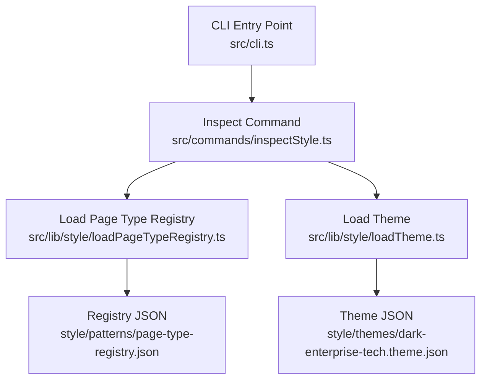
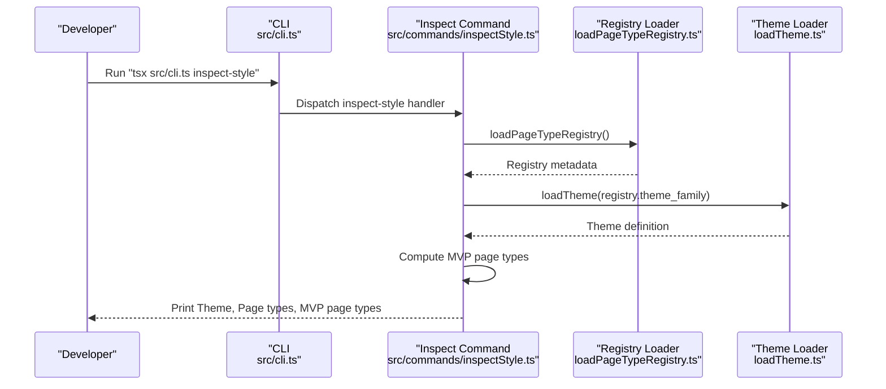
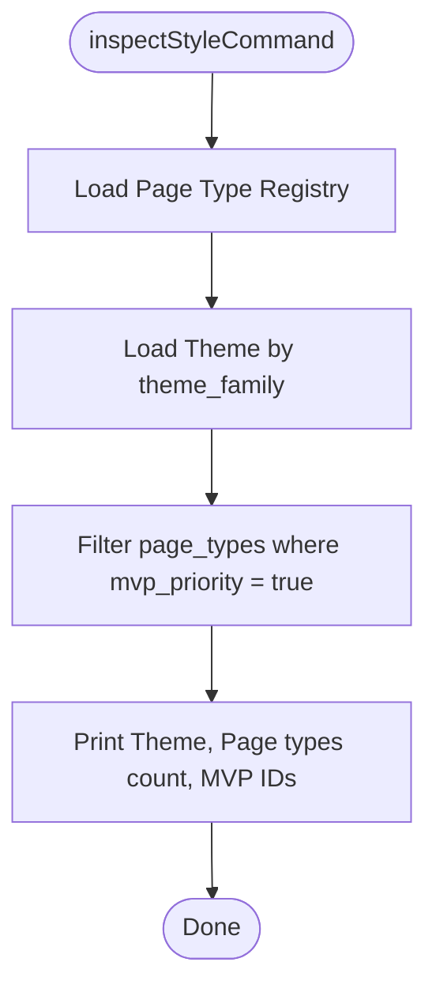
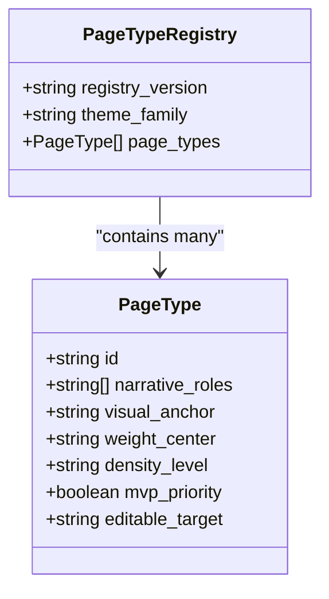
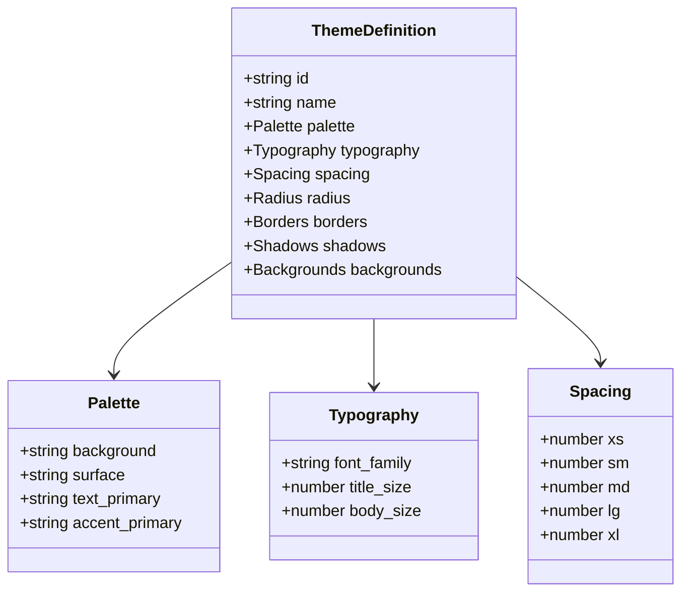
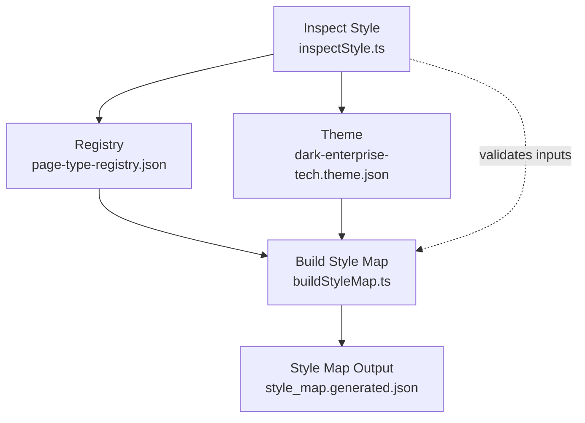
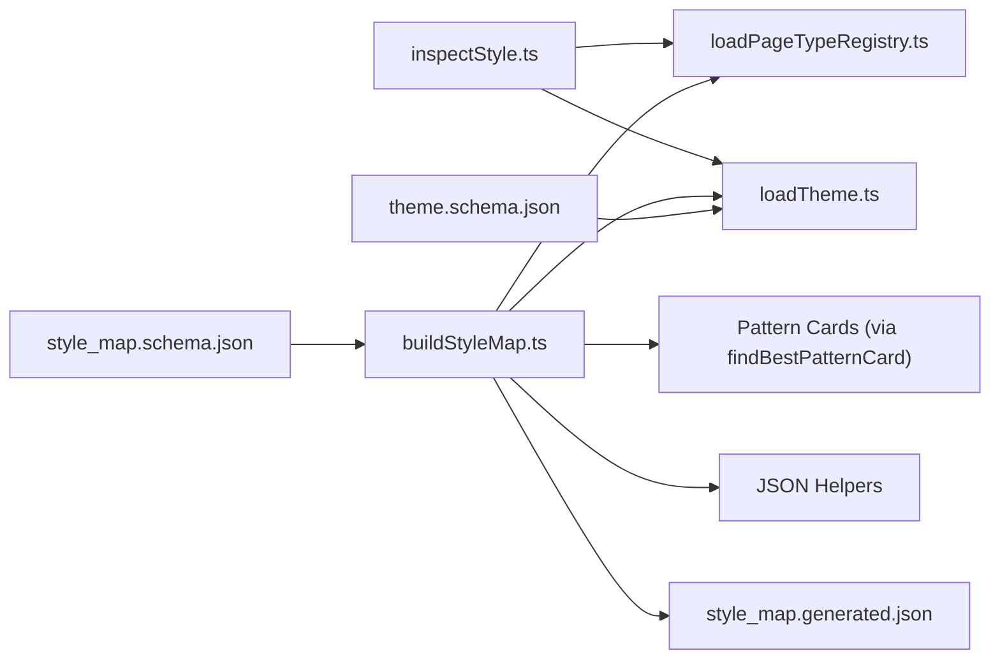

# inspect-style Command

<cite>
**Referenced Files in This Document**
- [inspectStyle.ts](file://src/commands/inspectStyle.ts)
- [cli.ts](file://src/cli.ts)
- [loadPageTypeRegistry.ts](file://src/lib/style/loadPageTypeRegistry.ts)
- [loadTheme.ts](file://src/lib/style/loadTheme.ts)
- [page-type-registry.json](file://style/patterns/page-type-registry.json)
- [dark-enterprise-tech.theme.json](file://style/themes/dark-enterprise-tech.theme.json)
- [style_map.generated.json](file://style/outputs/style_map.generated.json)
- [buildStyleMap.ts](file://src/commands/buildStyleMap.ts)
- [style_map.schema.json](file://schemas/style_map.schema.json)
- [theme.schema.json](file://schemas/theme.schema.json)
</cite>

## Table of Contents
1. [Introduction](#introduction)
2. [Project Structure](#project-structure)
3. [Core Components](#core-components)
4. [Architecture Overview](#architecture-overview)
5. [Detailed Component Analysis](#detailed-component-analysis)
6. [Dependency Analysis](#dependency-analysis)
7. [Performance Considerations](#performance-considerations)
8. [Troubleshooting Guide](#troubleshooting-guide)
9. [Conclusion](#conclusion)

## Introduction
The inspect-style command provides a quick, human-readable snapshot of the style system's current state. It prints the active theme identity and the set of page types registered in the system, along with a filtered subset marked as MVP priority. This inspection output helps developers and designers quickly validate that the correct theme family is loaded and that the expected page types are present, serving as a foundation for debugging style-related issues and maintaining the style system over time.

## Project Structure
The inspect-style command integrates with the CLI and relies on two core style subsystems:
- Page Type Registry: Defines available page types, their roles, anchors, weights, density levels, and editability targets.
- Theme: Provides the active theme definition, including palette, typography, spacing, and other design tokens.

**Diagram sources**
- [cli.ts:19-37](file://src/cli.ts#L19-L37)
- [inspectStyle.ts:4-13](file://src/commands/inspectStyle.ts#L4-L13)
- [loadPageTypeRegistry.ts:18-20](file://src/lib/style/loadPageTypeRegistry.ts#L18-L20)
- [loadTheme.ts:22-28](file://src/lib/style/loadTheme.ts#L22-L28)
- [page-type-registry.json:1-115](file://style/patterns/page-type-registry.json#L1-L115)
- [dark-enterprise-tech.theme.json:1-55](file://style/themes/dark-enterprise-tech.theme.json#L1-L55)

**Section sources**
- [cli.ts:10-17](file://src/cli.ts#L10-L17)
- [inspectStyle.ts:1-14](file://src/commands/inspectStyle.ts#L1-L14)
- [loadPageTypeRegistry.ts:1-21](file://src/lib/style/loadPageTypeRegistry.ts#L1-L21)
- [loadTheme.ts:1-29](file://src/lib/style/loadTheme.ts#L1-L29)

## Core Components
- CLI integration: Registers the inspect-style command and routes invocations to the command handler.
- Inspect command: Loads the page type registry and theme, computes MVP page types, and logs a concise summary.
- Page type registry loader: Reads the registry JSON and exposes typed metadata for page types.
- Theme loader: Resolves either a theme file path or a theme ID to load the active theme definition.

Key responsibilities:
- Validate theme family selection and availability.
- Enumerate page types and highlight those prioritized for MVP.
- Serve as a lightweight diagnostic tool during development and maintenance.

**Section sources**
- [cli.ts:10-17](file://src/cli.ts#L10-L17)
- [inspectStyle.ts:4-13](file://src/commands/inspectStyle.ts#L4-L13)
- [loadPageTypeRegistry.ts:18-20](file://src/lib/style/loadPageTypeRegistry.ts#L18-L20)
- [loadTheme.ts:22-28](file://src/lib/style/loadTheme.ts#L22-L28)

## Architecture Overview
The inspect-style command participates in the broader style pipeline by validating foundational inputs before rendering or mapping. It complements the build-style-map command, which consumes the same registry and theme to produce a style map used downstream for rendering.

**Diagram sources**
- [cli.ts:19-37](file://src/cli.ts#L19-L37)
- [inspectStyle.ts:4-13](file://src/commands/inspectStyle.ts#L4-L13)
- [loadPageTypeRegistry.ts:18-20](file://src/lib/style/loadPageTypeRegistry.ts#L18-L20)
- [loadTheme.ts:22-28](file://src/lib/style/loadTheme.ts#L22-L28)

## Detailed Component Analysis

### inspect-style Command
The inspect-style command orchestrates a minimal inspection:
- Loads the page type registry.
- Loads the theme using the registry's theme family.
- Filters page types by MVP priority and prints:
  - Theme name and ID.
  - Total number of page types.
  - Comma-separated list of MVP page type IDs.

**Diagram sources**
- [inspectStyle.ts:4-13](file://src/commands/inspectStyle.ts#L4-L13)
- [loadPageTypeRegistry.ts:18-20](file://src/lib/style/loadPageTypeRegistry.ts#L18-L20)
- [loadTheme.ts:22-28](file://src/lib/style/loadTheme.ts#L22-L28)

**Section sources**
- [inspectStyle.ts:4-13](file://src/commands/inspectStyle.ts#L4-L13)

### Page Type Registry
The registry defines the canonical set of page types and their characteristics:
- Identifiers and narrative roles.
- Visual anchors and weight centers.
- Density levels and editable target modes.
- MVP priority flags.

**Diagram sources**
- [loadPageTypeRegistry.ts:4-16](file://src/lib/style/loadPageTypeRegistry.ts#L4-L16)
- [page-type-registry.json:1-115](file://style/patterns/page-type-registry.json#L1-L115)

**Section sources**
- [loadPageTypeRegistry.ts:1-21](file://src/lib/style/loadPageTypeRegistry.ts#L1-L21)
- [page-type-registry.json:1-115](file://style/patterns/page-type-registry.json#L1-L115)

### Theme Definition
The theme provides design tokens consumed by rendering and mapping:
- Identity (id, name).
- Palette, typography, spacing, radius, borders, shadows, and backgrounds.

**Diagram sources**
- [loadTheme.ts:4-20](file://src/lib/style/loadTheme.ts#L4-L20)
- [dark-enterprise-tech.theme.json:1-55](file://style/themes/dark-enterprise-tech.theme.json#L1-L55)

**Section sources**
- [loadTheme.ts:1-29](file://src/lib/style/loadTheme.ts#L1-L29)
- [dark-enterprise-tech.theme.json:1-55](file://style/themes/dark-enterprise-tech.theme.json#L1-L55)

### Relationship to Build-Style-Map Pipeline
The inspect-style command validates inputs that build-style-map uses to produce a style map:
- Both rely on the page type registry to resolve page types and their attributes.
- Both rely on the theme to establish the design system context.
- The resulting style map (produced by build-style-map) contains detailed per-slide mappings, learned patterns, and component bindings.

**Diagram sources**
- [buildStyleMap.ts:50-109](file://src/commands/buildStyleMap.ts#L50-L109)
- [inspectStyle.ts:4-13](file://src/commands/inspectStyle.ts#L4-L13)
- [page-type-registry.json:1-115](file://style/patterns/page-type-registry.json#L1-L115)
- [dark-enterprise-tech.theme.json:1-55](file://style/themes/dark-enterprise-tech.theme.json#L1-L55)
- [style_map.generated.json:1-142](file://style/outputs/style_map.generated.json#L1-L142)

**Section sources**
- [buildStyleMap.ts:50-109](file://src/commands/buildStyleMap.ts#L50-L109)
- [inspectStyle.ts:4-13](file://src/commands/inspectStyle.ts#L4-L13)

## Dependency Analysis
- The inspect-style command depends on:
  - Page type registry loader for page type metadata.
  - Theme loader for the active theme definition.
- The build-style-map command also depends on:
  - Pattern card loading utilities (referenced via imports).
  - JSON file helpers for reading/writing artifacts.
- The style map output schema validates the structure of the generated style map.

**Diagram sources**
- [inspectStyle.ts:1-2](file://src/commands/inspectStyle.ts#L1-L2)
- [loadPageTypeRegistry.ts:1-2](file://src/lib/style/loadPageTypeRegistry.ts#L1-L2)
- [loadTheme.ts:1-2](file://src/lib/style/loadTheme.ts#L1-L2)
- [buildStyleMap.ts:1-5](file://src/commands/buildStyleMap.ts#L1-L5)
- [style_map.generated.json:1-142](file://style/outputs/style_map.generated.json#L1-L142)
- [style_map.schema.json:1-70](file://schemas/style_map.schema.json#L1-L70)
- [theme.schema.json:1-58](file://schemas/theme.schema.json#L1-L58)

**Section sources**
- [inspectStyle.ts:1-2](file://src/commands/inspectStyle.ts#L1-L2)
- [buildStyleMap.ts:1-5](file://src/commands/buildStyleMap.ts#L1-L5)
- [style_map.schema.json:1-70](file://schemas/style_map.schema.json#L1-L70)
- [theme.schema.json:1-58](file://schemas/theme.schema.json#L1-L58)

## Performance Considerations
- The inspect-style command performs minimal work: loading two JSON files and filtering a small array. Execution is effectively instantaneous.
- For large registries or frequent inspections, consider caching the loaded registry and theme in memory to avoid repeated disk I/O.

## Troubleshooting Guide
Common scenarios and resolutions:
- Unknown command: Ensure you are invoking the CLI with the correct command name and that the handler is registered.
  - Verify command registration and help output.
- Missing theme family: Confirm that the page type registry specifies a valid theme family and that the corresponding theme file exists.
- Unexpected page type counts: Validate the registry JSON for completeness and correctness.
- Style map mismatches: After inspection, run the build-style-map command to regenerate the style map and compare against the expected schema.

Operational checks:
- Confirm that the CLI entry point dispatches inspect-style to the correct handler.
- Confirm that the registry loader resolves the intended registry file path.
- Confirm that the theme loader resolves the intended theme file path or ID.

**Section sources**
- [cli.ts:19-37](file://src/cli.ts#L19-L37)
- [loadPageTypeRegistry.ts:18-20](file://src/lib/style/loadPageTypeRegistry.ts#L18-L20)
- [loadTheme.ts:22-28](file://src/lib/style/loadTheme.ts#L22-L28)

## Conclusion
The inspect-style command offers a focused lens into the style system’s current state by summarizing the active theme and page type inventory, with special attention to MVP priorities. By integrating with the CLI and relying on the registry and theme loaders, it provides a reliable diagnostic tool for development and maintenance. Together with the build-style-map pipeline and its associated schemas, it ensures that style system changes remain observable, verifiable, and reproducible.