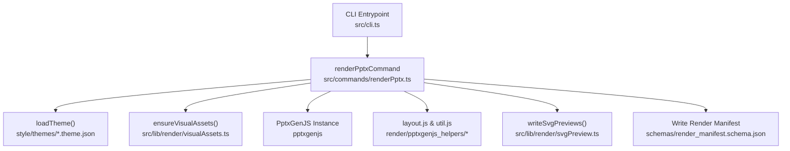
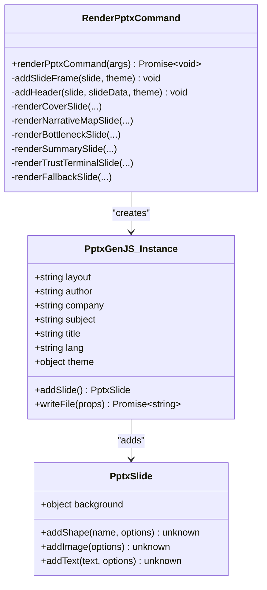
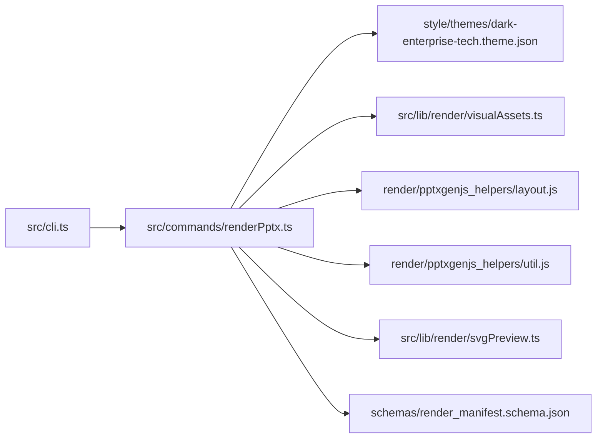

# render-pptx Command

<cite>
**Referenced Files in This Document**
- [renderPptx.ts](file://src/commands/renderPptx.ts)
- [cli.ts](file://src/cli.ts)
- [layout.js](file://render/pptxgenjs_helpers/layout.js)
- [util.js](file://render/pptxgenjs_helpers/util.js)
- [visualAssets.ts](file://src/lib/render/visualAssets.ts)
- [svgPreview.ts](file://src/lib/render/svgPreview.ts)
- [render_manifest.schema.json](file://schemas/render_manifest.schema.json)
- [dark-enterprise-tech.theme.json](file://style/themes/dark-enterprise-tech.theme.json)
- [style_map.generated.json](file://style/outputs/style_map.generated.json)
- [template.pattern-card.json](file://style/patterns/template.pattern-card.json)
- [README.md](file://README.md)
</cite>

## Table of Contents
1. [Introduction](#introduction)
2. [Project Structure](#project-structure)
3. [Core Components](#core-components)
4. [Architecture Overview](#architecture-overview)
5. [Detailed Component Analysis](#detailed-component-analysis)
6. [Dependency Analysis](#dependency-analysis)
7. [Performance Considerations](#performance-considerations)
8. [Troubleshooting Guide](#troubleshooting-guide)
9. [Conclusion](#conclusion)
10. [Appendices](#appendices)

## Introduction
The render-pptx CLI command generates editable PowerPoint presentations from structured slide content and a style map. It integrates with PptxGenJS to produce native PPTX objects, applies theme-driven styling, validates layout correctness, and produces an SVG preview gallery and a render manifest for traceability. The command supports optional theme customization and outputs both the editable PPTX and a preview directory containing SVG slide previews and an HTML index.

## Project Structure
The render-pptx command is part of a modular CLI that orchestrates rendering, preview generation, and manifest creation. The command consumes:
- Slides JSON (produced by earlier stages)
- Style map JSON (defines page types, learned patterns, and editable targets)
- Optional theme file or theme family from the style map
- Visual assets (SVGs built from theme)
- PptxGenJS runtime for editable PPTX generation



**Diagram sources**
- [cli.ts:19-56](file://src/cli.ts#L19-L56)
- [renderPptx.ts:83-190](file://src/commands/renderPptx.ts#L83-L190)
- [visualAssets.ts:11-24](file://src/lib/render/visualAssets.ts#L11-L24)
- [svgPreview.ts:28-67](file://src/lib/render/svgPreview.ts#L28-L67)
- [layout.js:23-232](file://render/pptxgenjs_helpers/layout.js#L23-L232)
- [util.js:5-20](file://render/pptxgenjs_helpers/util.js#L5-L20)
- [render_manifest.schema.json:1-38](file://schemas/render_manifest.schema.json#L1-L38)

**Section sources**
- [README.md:29-37](file://README.md#L29-L37)
- [cli.ts:19-56](file://src/cli.ts#L19-L56)

## Core Components
- CLI registration and help: The CLI registers render-pptx and prints usage help.
- renderPptxCommand: Orchestrates loading inputs, applying theme, building slides, validating layout, writing PPTX, previews, and manifest.
- PptxGenJS integration: Creates slides, adds shapes/text/images, sets global theme and metadata.
- Layout helpers: Detect overlaps and out-of-bounds elements to maintain quality.
- Visual assets: Generates SVGs for hero visuals from theme.
- SVG previews: Produces a grid of SVG slide previews and an HTML index.
- Render manifest: Captures outputs and slide artifacts for traceability.

**Section sources**
- [cli.ts:10-17](file://src/cli.ts#L10-L17)
- [cli.ts:39-50](file://src/cli.ts#L39-L50)
- [renderPptx.ts:83-190](file://src/commands/renderPptx.ts#L83-L190)
- [layout.js:23-232](file://render/pptxgenjs_helpers/layout.js#L23-L232)
- [util.js:5-20](file://render/pptxgenjs_helpers/util.js#L5-L20)
- [visualAssets.ts:11-24](file://src/lib/render/visualAssets.ts#L11-L24)
- [svgPreview.ts:28-67](file://src/lib/render/svgPreview.ts#L28-L67)
- [render_manifest.schema.json:1-38](file://schemas/render_manifest.schema.json#L1-L38)

## Architecture Overview
The render-pptx pipeline follows a deterministic flow:
- Parse CLI arguments and resolve default paths
- Load slides and style map, validate counts
- Resolve theme (explicit or from style map)
- Generate visual assets (SVGs) for hero imagery
- Initialize PptxGenJS with theme and metadata
- Iterate slides, add frame/header, render per page type, apply quality checks
- Write PPTX, SVG previews, and render manifest

```mermaid
sequenceDiagram
participant User as "User"
participant CLI as "CLI (src/cli.ts)"
participant Cmd as "renderPptxCommand (src/commands/renderPptx.ts)"
participant Theme as "Theme Loader"
participant Assets as "Visual Assets Builder"
participant Pptx as "PptxGenJS"
participant Helpers as "Layout Helpers"
participant Previews as "SVG Preview Writer"
participant Manifest as "Render Manifest"
User->>CLI : Run "tsx src/cli.ts render-pptx ..."
CLI->>Cmd : Dispatch with args
Cmd->>Cmd : Parse args (--slides, --style-map, --theme-file, --out-manifest, --out-pptx, --out-preview-dir)
Cmd->>Cmd : Load slides.json and style_map.json
Cmd->>Theme : loadTheme(themeFile or styleMap.theme_family)
Cmd->>Assets : ensureVisualAssets(previewDir/assets, theme)
Cmd->>Pptx : new PptxGenJS(); configure layout/theme/metadata
loop For each slide
Cmd->>Pptx : addSlide()
Cmd->>Pptx : addSlideFrame(), addHeader()
Cmd->>Pptx : render*Slide() based on page_type
Cmd->>Helpers : warnIfSlideHasOverlaps(), warnIfSlideElementsOutOfBounds()
end
Cmd->>Pptx : writeFile(out-pptx-path)
Cmd->>Previews : writeSvgPreviews(slides, styleBySlideId, theme, previewDir)
Cmd->>Manifest : writeJsonFile(render-manifest.json)
Cmd-->>CLI : Log outputs
CLI-->>User : Done
```

**Diagram sources**
- [cli.ts:19-56](file://src/cli.ts#L19-L56)
- [renderPptx.ts:94-169](file://src/commands/renderPptx.ts#L94-L169)
- [layout.js:23-232](file://render/pptxgenjs_helpers/layout.js#L23-L232)
- [svgPreview.ts:28-67](file://src/lib/render/svgPreview.ts#L28-L67)

## Detailed Component Analysis

### CLI Registration and Help
- Registers render-pptx under the "render-pptx" command key.
- Prints usage including the render-pptx signature with required and optional flags.

**Section sources**
- [cli.ts:10-17](file://src/cli.ts#L10-L17)
- [cli.ts:39-50](file://src/cli.ts#L39-L50)

### renderPptxCommand: Arguments and Inputs
- Required:
  - --slides <path>: Path to slides JSON (deck_title and slides[])
  - --style-map <path>: Path to style map JSON (theme_family and slides[])
- Optional:
  - --theme-file <path>: Overrides theme family from style map
  - --out-manifest <path>: Output path for render manifest (defaults to output/delivery/render-manifest.json)
  - --out-pptx <path>: Output PPTX path (defaults to output/delivery/mvp-preview-deck.pptx)
  - --out-preview-dir <path>: Preview directory (defaults to output/preview)
- Validation:
  - Throws if required arguments are missing
  - Validates slide count matches between slides and style map

**Section sources**
- [renderPptx.ts:94-113](file://src/commands/renderPptx.ts#L94-L113)
- [cli.ts:47](file://src/cli.ts#L47)

### Theme Application and Visual Assets
- Theme resolution:
  - Uses explicit --theme-file if provided
  - Otherwise uses style_map.theme_family
- Visual assets:
  - Ensures previewDir/assets exists
  - Writes cover-orbit board and control-loop hero SVGs derived from theme palette and typography

**Section sources**
- [renderPptx.ts:108-109](file://src/commands/renderPptx.ts#L108-L109)
- [visualAssets.ts:11-24](file://src/lib/render/visualAssets.ts#L11-L24)
- [dark-enterprise-tech.theme.json:1-55](file://style/themes/dark-enterprise-tech.theme.json#L1-L55)

### PptxGenJS Integration and Editable Output Strategy
- Initializes PptxGenJS with:
  - Layout: LAYOUT_WIDE
  - Metadata: author, company, subject, title, lang
  - Theme: head/body fonts and language from theme
- Adds a slide frame and header for each slide
- Renders per page type:
  - cover_orbit, narrative_map, bottleneck_shift, chapter_summary_signal, trust_terminal
  - Fallback for unknown page types
- Quality checks:
  - Overlap detection and out-of-bounds warnings
- Writes PPTX to resolved path (auto-stamped if existing)



**Diagram sources**
- [renderPptx.ts:62-78](file://src/commands/renderPptx.ts#L62-L78)
- [renderPptx.ts:115-126](file://src/commands/renderPptx.ts#L115-L126)

**Section sources**
- [renderPptx.ts:115-169](file://src/commands/renderPptx.ts#L115-L169)
- [layout.js:23-232](file://render/pptxgenjs_helpers/layout.js#L23-L232)

### Page Type Rendering and Learned Patterns
- Each page type consumes learned pattern metadata from the style map to:
  - Enforce layout_rules and alignment_rules
  - Apply highlight_grammar for color accents
  - Select image_usage modes (hero, contextual, texture, none)
- Examples:
  - Cover orbit: hero visual frame, claim card, orbit circles, story points
  - Narrative map: dominant left card, stacked right cards, decision cue band
  - Bottleneck shift: oversized statement, grounding visual, support cards
  - Chapter summary signal: dominant summary block, implication panel, decision cue
  - Trust terminal: terminal window frame, header controls, security indicators, governance labels
  - Fallback: neutral card with claim text

**Section sources**
- [renderPptx.ts:249-366](file://src/commands/renderPptx.ts#L249-L366)
- [renderPptx.ts:368-464](file://src/commands/renderPptx.ts#L368-L464)
- [renderPptx.ts:466-568](file://src/commands/renderPptx.ts#L466-L568)
- [renderPptx.ts:570-695](file://src/commands/renderPptx.ts#L570-L695)
- [renderPptx.ts:697-863](file://src/commands/renderPptx.ts#L697-L863)
- [renderPptx.ts:865-886](file://src/commands/renderPptx.ts#L865-L886)
- [style_map.generated.json:18-44](file://style/outputs/style_map.generated.json#L18-L44)
- [template.pattern-card.json:9-28](file://style/patterns/template.pattern-card.json#L9-L28)

### SVG Previews and Editable Strategy
- SVG previews:
  - Writes individual slide SVGs and an index.html grid
  - Uses theme palette and typography for consistent visuals
- Editable strategy:
  - Native PPTX objects (shapes, text, images) remain editable in PowerPoint
  - Hero visuals are embedded as SVGs and also rendered as images on slides for robustness

**Section sources**
- [svgPreview.ts:28-67](file://src/lib/render/svgPreview.ts#L28-L67)
- [visualAssets.ts:11-24](file://src/lib/render/visualAssets.ts#L11-L24)

### Render Manifest Generation
- Outputs include:
  - editable_pptx
  - preview_svg_dir
  - preview_html
- slide_artifacts includes slide_id and rerendered flags
- Schema enforces required fields and output keys

**Section sources**
- [renderPptx.ts:171-186](file://src/commands/renderPptx.ts#L171-L186)
- [render_manifest.schema.json:1-38](file://schemas/render_manifest.schema.json#L1-L38)

### Quality Assurance and Layout Checks
- Overlap detection:
  - Warns on severe text overlaps and suggests horizontal/vertical adjustments
  - Optionally ignores lines and decorative shapes
- Out-of-bounds detection:
  - Warns when elements exceed slide dimensions
- Slide dimension inference:
  - Reads slide layout from PptxGenJS internals and converts EMU if needed

**Section sources**
- [layout.js:23-232](file://render/pptxgenjs_helpers/layout.js#L23-L232)
- [layout.js:575-633](file://render/pptxgenjs_helpers/layout.js#L575-L633)
- [layout.js:429-460](file://render/pptxgenjs_helpers/layout.js#L429-L460)

## Dependency Analysis
- renderPptxCommand depends on:
  - CLI registration for dispatch
  - Theme loader for palette and typography
  - Visual assets builder for hero SVGs
  - PptxGenJS for slide construction and PPTX write
  - Layout helpers for QA checks
  - SVG preview writer for deliverables
  - Render manifest schema for validation



**Diagram sources**
- [cli.ts:19-56](file://src/cli.ts#L19-L56)
- [renderPptx.ts:83-190](file://src/commands/renderPptx.ts#L83-L190)
- [dark-enterprise-tech.theme.json:1-55](file://style/themes/dark-enterprise-tech.theme.json#L1-L55)
- [visualAssets.ts:11-24](file://src/lib/render/visualAssets.ts#L11-L24)
- [layout.js:23-232](file://render/pptxgenjs_helpers/layout.js#L23-L232)
- [util.js:5-20](file://render/pptxgenjs_helpers/util.js#L5-L20)
- [svgPreview.ts:28-67](file://src/lib/render/svgPreview.ts#L28-L67)
- [render_manifest.schema.json:1-38](file://schemas/render_manifest.schema.json#L1-L38)

**Section sources**
- [renderPptx.ts:83-190](file://src/commands/renderPptx.ts#L83-L190)

## Performance Considerations
- Minimize repeated theme loads by resolving once per run.
- Batch writes: write PPTX and manifests after slide iteration to reduce I/O overhead.
- Asset reuse: ensure visual assets are generated once and reused across slides.
- Large presentations:
  - Consider splitting decks into smaller batches if memory pressure occurs.
  - Prefer native shapes and minimal image usage for large decks to reduce rendering cost.
- Preview generation:
  - SVG previews are lightweight and useful for quick reviews; disable if not needed in CI.

## Troubleshooting Guide
Common issues and resolutions:
- Missing required arguments:
  - Ensure both --slides and --style-map are provided.
- Slide count mismatch:
  - Verify slides and style map contain the same number of entries.
- Overlapping text or shapes:
  - Review layout rules and alignment rules from learned patterns; adjust positions or reduce overlap.
- Elements outside slide bounds:
  - Re-position elements to fit within slide width/height.
- Existing PPTX path:
  - If the target file exists, the command auto-appends a timestamped suffix; confirm the written path.

**Section sources**
- [renderPptx.ts:97-113](file://src/commands/renderPptx.ts#L97-L113)
- [layout.js:23-232](file://render/pptxgenjs_helpers/layout.js#L23-L232)
- [layout.js:575-633](file://render/pptxgenjs_helpers/layout.js#L575-L633)
- [renderPptx.ts:1009-1018](file://src/commands/renderPptx.ts#L1009-L1018)

## Conclusion
The render-pptx command provides a robust, theme-driven pipeline to produce editable PowerPoint decks from structured content and style maps. It leverages PptxGenJS for native editability, ensures layout quality via built-in checks, and delivers previews and a render manifest for traceability. By following the learned patterns and guidelines, teams can consistently generate high-quality, enterprise-ready presentations.

## Appendices

### Command Reference
- Name: render-pptx
- Purpose: Generate editable PPTX from slides and style map, with theme customization and preview generation
- Required flags:
  - --slides <path>
  - --style-map <path>
- Optional flags:
  - --theme-file <path>
  - --out-manifest <path>
  - --out-pptx <path>
  - --out-preview-dir <path>

**Section sources**
- [cli.ts:47](file://src/cli.ts#L47)

### Example Slide Configurations and Themes
- Theme: Dark Enterprise Tech
  - Palette and typography define surface/background/accent colors and font family
- Style map:
  - Defines theme_family and per-slide page_type, learned_pattern, and editable_target
- Pattern card:
  - Documents layout_rules, alignment_rules, highlight_grammar, and image_usage guidance

**Section sources**
- [dark-enterprise-tech.theme.json:1-55](file://style/themes/dark-enterprise-tech.theme.json#L1-L55)
- [style_map.generated.json:18-44](file://style/outputs/style_map.generated.json#L18-L44)
- [template.pattern-card.json:9-28](file://style/patterns/template.pattern-card.json#L9-L28)