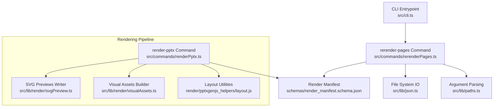
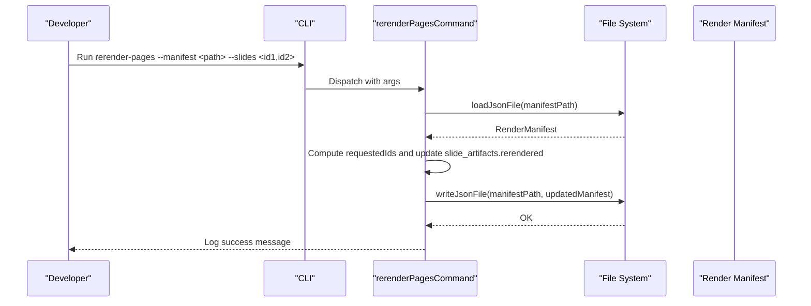
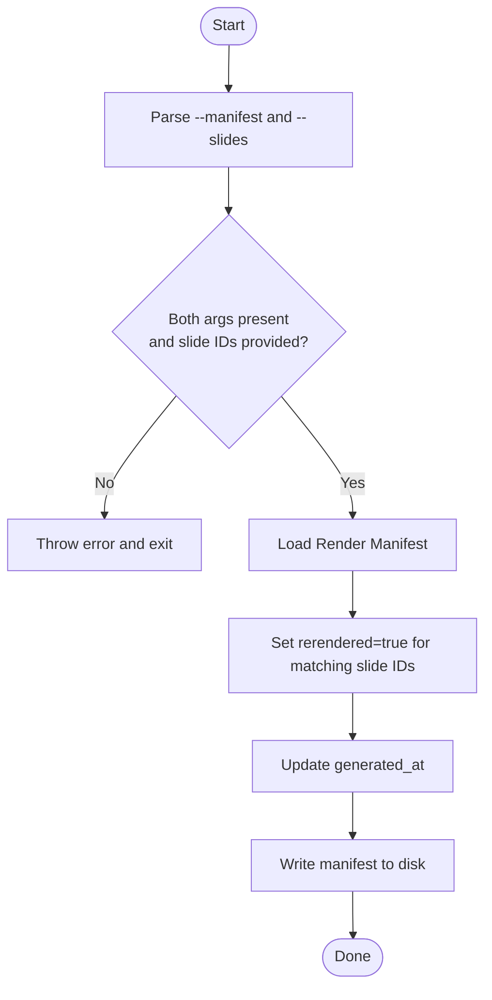
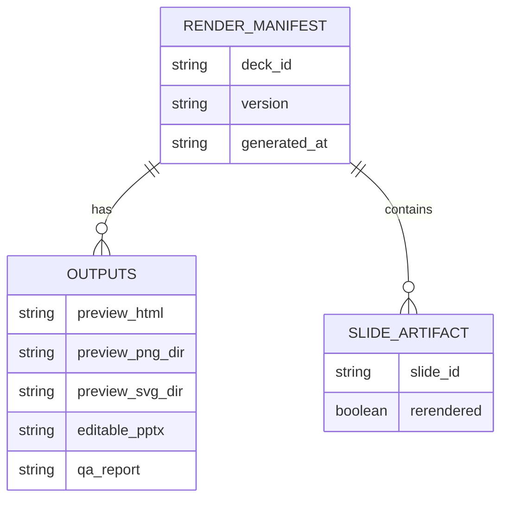
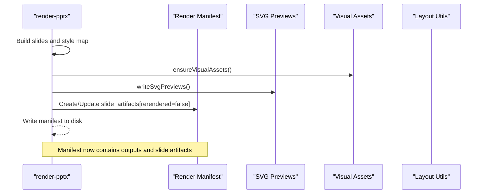
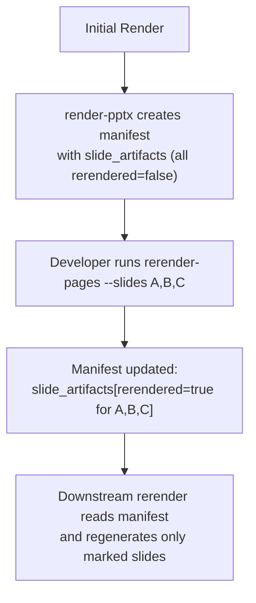
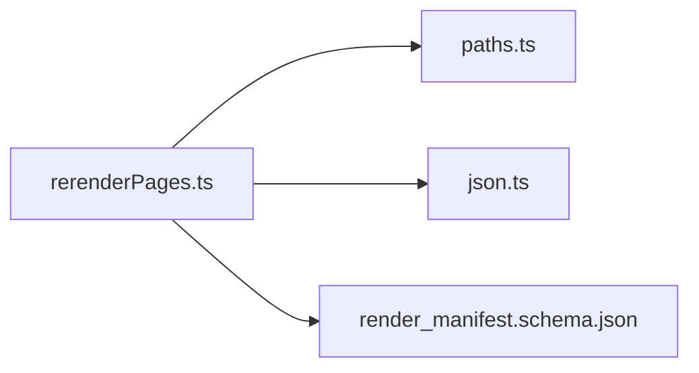

# rerender-pages Command

<cite>
**Referenced Files in This Document**
- [rerenderPages.ts](file://src/commands/rerenderPages.ts)
- [cli.ts](file://src/cli.ts)
- [renderPptx.ts](file://src/commands/renderPptx.ts)
- [render_manifest.schema.json](file://schemas/render_manifest.schema.json)
- [json.ts](file://src/lib/json.ts)
- [paths.ts](file://src/lib/paths.ts)
- [svgPreview.ts](file://src/lib/render/svgPreview.ts)
- [visualAssets.ts](file://src/lib/render/visualAssets.ts)
- [layout.js](file://render/pptxgenjs_helpers/layout.js)
- [fast-track-mvp.md](file://docs/workflows/fast-track-mvp.md)
- [ADR-0001-layered-pipeline.md](file://docs/decisions/ADR-0001-layered-pipeline.md)
- [README.md](file://README.md)
</cite>

## Table of Contents
1. [Introduction](#introduction)
2. [Project Structure](#project-structure)
3. [Core Components](#core-components)
4. [Architecture Overview](#architecture-overview)
5. [Detailed Component Analysis](#detailed-component-analysis)
6. [Dependency Analysis](#dependency-analysis)
7. [Performance Considerations](#performance-considerations)
8. [Troubleshooting Guide](#troubleshooting-guide)
9. [Conclusion](#conclusion)
10. [Appendices](#appendices)

## Introduction
The rerender-pages command enables incremental updates to an existing presentation by marking specific slides for re-rendering. Instead of regenerating the entire deck, you can target individual slides identified by their slide IDs. This supports iterative design reviews and rapid prototyping workflows where only parts of the deck change frequently.

The command reads a render manifest, updates per-slide flags indicating which slides should be rerendered, and writes the manifest back to disk. This signals downstream rendering processes to regenerate only the flagged slides.

## Project Structure
The rerender-pages command is part of a layered pipeline that separates concerns across research, story, style, rendering, and QA. The CLI exposes the rerender-pages command alongside others such as render-pptx and story-to-slides. Render manifests track outputs and per-slide metadata, including a flag that marks whether a slide should be rerendered.

**Diagram sources**
- [cli.ts:19-56](file://src/cli.ts#L19-L56)
- [rerenderPages.ts:15-39](file://src/commands/rerenderPages.ts#L15-L39)
- [renderPptx.ts:83-190](file://src/commands/renderPptx.ts#L83-L190)
- [json.ts:4-13](file://src/lib/json.ts#L4-L13)
- [paths.ts:13-19](file://src/lib/paths.ts#L13-L19)
- [render_manifest.schema.json:1-38](file://schemas/render_manifest.schema.json#L1-L38)
- [svgPreview.ts:28-43](file://src/lib/render/svgPreview.ts#L28-L43)
- [visualAssets.ts:11-24](file://src/lib/render/visualAssets.ts#L11-L24)
- [layout.js:64-321](file://render/pptxgenjs_helpers/layout.js#L64-L321)

**Section sources**
- [README.md:17-38](file://README.md#L17-L38)
- [cli.ts:19-56](file://src/cli.ts#L19-L56)
- [fast-track-mvp.md:35-44](file://docs/workflows/fast-track-mvp.md#L35-L44)

## Core Components
- rerender-pages command: Parses CLI arguments, loads the render manifest, updates per-slide rerender flags, and writes the manifest back to disk.
- CLI dispatcher: Registers and routes commands, including rerender-pages.
- Render manifest schema: Defines the structure of the manifest, including outputs and slide artifacts with a rerendered flag.
- File system helpers: Load and write JSON with automatic directory creation.
- Argument parsing: Extracts flag values from the CLI arguments.

Key responsibilities:
- Validate required arguments (--manifest and --slides).
- Parse comma-separated slide IDs into a set for efficient lookup.
- Update slide_artifacts entries to mark matching slides as rerendered.
- Refresh the generated_at timestamp to indicate a change.
- Persist the updated manifest.

**Section sources**
- [rerenderPages.ts:15-39](file://src/commands/rerenderPages.ts#L15-L39)
- [cli.ts:10-17](file://src/cli.ts#L10-L17)
- [render_manifest.schema.json:23-35](file://schemas/render_manifest.schema.json#L23-L35)
- [json.ts:4-13](file://src/lib/json.ts#L4-L13)
- [paths.ts:13-19](file://src/lib/paths.ts#L13-L19)

## Architecture Overview
The rerender-pages command participates in a layered pipeline:
- Research: Structured inputs and outputs.
- Story: Converts research into storyline and slides.
- Style: Binds slides to page types and produces a style map.
- Render: Produces editable PPTX and preview outputs, writing a render manifest.
- QA: Validates outputs.

rerender-pages operates on the render manifest produced by render-pptx. By updating the rerendered flag in slide_artifacts, it instructs downstream processes to regenerate only those slides.

**Diagram sources**
- [cli.ts:19-37](file://src/cli.ts#L19-L37)
- [rerenderPages.ts:15-39](file://src/commands/rerenderPages.ts#L15-L39)
- [json.ts:4-13](file://src/lib/json.ts#L4-L13)

## Detailed Component Analysis

### rerender-pages Command
The command performs the following steps:
- Parse --manifest and --slides arguments.
- Validate presence of both arguments and that at least one slide ID is provided.
- Load the render manifest from disk.
- Iterate slide_artifacts and set rerendered to true for any slide whose slide_id matches one of the requested IDs.
- Update generated_at to the current timestamp.
- Write the manifest back to disk.

**Diagram sources**
- [rerenderPages.ts:15-39](file://src/commands/rerenderPages.ts#L15-L39)
- [json.ts:4-13](file://src/lib/json.ts#L4-L13)

**Section sources**
- [rerenderPages.ts:15-39](file://src/commands/rerenderPages.ts#L15-L39)

### CLI Registration and Help
The CLI registers rerender-pages and prints help text that documents its usage, including required flags.

- Registered command name: rerender-pages
- Help text includes the expected flags and their purpose.

**Section sources**
- [cli.ts:10-17](file://src/cli.ts#L10-L17)
- [cli.ts:39-50](file://src/cli.ts#L39-L50)

### Render Manifest Schema
The render manifest defines:
- Top-level fields: deck_id, version, generated_at, outputs.
- Outputs: keys for editable PPTX, preview HTML, preview PNG/SVG directories, and QA report.
- slide_artifacts: array of objects with slide_id and optional rerendered flag.

This schema underpins how rerender-pages marks slides for re-rendering.

**Section sources**
- [render_manifest.schema.json:1-38](file://schemas/render_manifest.schema.json#L1-L38)

### Relationship Between Render Manifest and Page-Level Updates
- slide_artifacts holds per-slide metadata.
- The rerendered flag indicates whether a slide should be regenerated.
- render-pptx writes slide_artifacts with rerendered=false for all slides initially.
- rerender-pages toggles rerendered to true for specified slide IDs.

**Diagram sources**
- [render_manifest.schema.json:8-35](file://schemas/render_manifest.schema.json#L8-L35)

**Section sources**
- [render_manifest.schema.json:8-35](file://schemas/render_manifest.schema.json#L8-L35)

### Rendering Pipeline Integration
While rerender-pages itself only updates the manifest, the rendering pipeline consumes the manifest to drive incremental rendering:
- render-pptx builds the manifest and writes outputs.
- SVG previews and visual assets are prepared during rendering.
- Layout utilities enforce alignment and detect overlaps or out-of-bounds elements.

**Diagram sources**
- [renderPptx.ts:106-186](file://src/commands/renderPptx.ts#L106-L186)
- [svgPreview.ts:28-43](file://src/lib/render/svgPreview.ts#L28-L43)
- [visualAssets.ts:11-24](file://src/lib/render/visualAssets.ts#L11-L24)
- [layout.js:64-321](file://render/pptxgenjs_helpers/layout.js#L64-L321)

**Section sources**
- [renderPptx.ts:106-186](file://src/commands/renderPptx.ts#L106-L186)
- [svgPreview.ts:28-43](file://src/lib/render/svgPreview.ts#L28-L43)
- [visualAssets.ts:11-24](file://src/lib/render/visualAssets.ts#L11-L24)
- [layout.js:64-321](file://render/pptxgenjs_helpers/layout.js#L64-L321)

### Incremental Rendering Workflow
rerender-pages enables incremental rendering by:
- Accepting a list of slide IDs to update.
- Marking those slides in the manifest as needing rerender.
- Triggering downstream processes to regenerate only flagged slides.

**Diagram sources**
- [renderPptx.ts:171-184](file://src/commands/renderPptx.ts#L171-L184)
- [rerenderPages.ts:28-35](file://src/commands/rerenderPages.ts#L28-L35)

**Section sources**
- [renderPptx.ts:171-184](file://src/commands/renderPptx.ts#L171-L184)
- [rerenderPages.ts:28-35](file://src/commands/rerenderPages.ts#L28-L35)

### Examples and Use Cases
- Partial page updates: Update slide IDs 001 and 005 by running rerender-pages with those IDs.
- Incremental rendering scenarios:
  - After a style tweak, rerender only slides that were affected by the change.
  - During iterative design reviews, quickly regenerate slides that reviewers asked to adjust.
- Rapid prototyping workflows:
  - Iterate on a subset of slides while keeping the rest unchanged.
  - Keep the manifest current so downstream QA and preview steps operate on the latest state.

These scenarios align with the layered pipeline and the editable-PPTX-first strategy.

**Section sources**
- [fast-track-mvp.md:35-44](file://docs/workflows/fast-track-mvp.md#L35-L44)
- [ADR-0001-layered-pipeline.md:9-22](file://docs/decisions/ADR-0001-layered-pipeline.md#L9-L22)

## Dependency Analysis
rerender-pages depends on:
- Argument parsing to extract --manifest and --slides.
- JSON file helpers to load and write the manifest.
- The render manifest schema to validate structure and fields.

**Diagram sources**
- [rerenderPages.ts:15-39](file://src/commands/rerenderPages.ts#L15-L39)
- [paths.ts:13-19](file://src/lib/paths.ts#L13-L19)
- [json.ts:4-13](file://src/lib/json.ts#L4-L13)
- [render_manifest.schema.json:1-38](file://schemas/render_manifest.schema.json#L1-L38)

**Section sources**
- [rerenderPages.ts:15-39](file://src/commands/rerenderPages.ts#L15-L39)
- [paths.ts:13-19](file://src/lib/paths.ts#L13-L19)
- [json.ts:4-13](file://src/lib/json.ts#L4-L13)
- [render_manifest.schema.json:1-38](file://schemas/render_manifest.schema.json#L1-L38)

## Performance Considerations
- rerender-pages is lightweight: it only reads, updates, and writes the manifest.
- Using a Set for requested slide IDs ensures O(1) lookups during flag updates.
- Refreshing generated_at helps downstream processes detect changes without scanning entire outputs.

[No sources needed since this section provides general guidance]

## Troubleshooting Guide
Common issues and resolutions:
- Missing required arguments:
  - Symptom: Error thrown when either --manifest or --slides is omitted.
  - Resolution: Provide both flags with a valid manifest path and comma-separated slide IDs.
- No slide IDs provided:
  - Symptom: Error when --slides contains no IDs after trimming/filtering.
  - Resolution: Ensure at least one slide ID is included.
- Manifest not found or unreadable:
  - Symptom: Failure when loading the manifest JSON.
  - Resolution: Verify the path exists and is readable; ensure it matches the render manifest schema.
- Downstream rerender not triggered:
  - Symptom: Outputs unchanged after rerender-pages.
  - Resolution: Confirm that downstream processes read the updated generated_at and slide_artifacts flags.

**Section sources**
- [rerenderPages.ts:19-26](file://src/commands/rerenderPages.ts#L19-L26)
- [rerenderPages.ts:28-35](file://src/commands/rerenderPages.ts#L28-L35)

## Conclusion
The rerender-pages command is a focused tool for enabling incremental updates to presentations. By marking specific slides in the render manifest, it allows targeted regeneration without rebuilding the entire deck. Combined with the layered pipeline and editable-PPTX-first strategy, it supports efficient design reviews and rapid prototyping workflows.

[No sources needed since this section summarizes without analyzing specific files]

## Appendices

### Command Reference
- Name: rerender-pages
- Purpose: Mark specific slides for re-rendering by updating the render manifest.
- Flags:
  - --manifest <path>: Path to the render manifest JSON file.
  - --slides <id1,id2,...>: Comma-separated list of slide IDs to rerender.

**Section sources**
- [cli.ts:39-50](file://src/cli.ts#L39-L50)
- [rerenderPages.ts:15-21](file://src/commands/rerenderPages.ts#L15-L21)