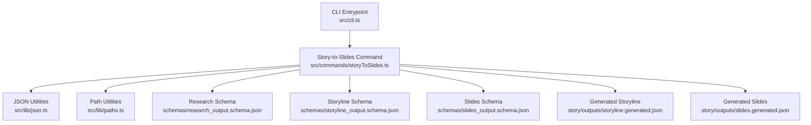
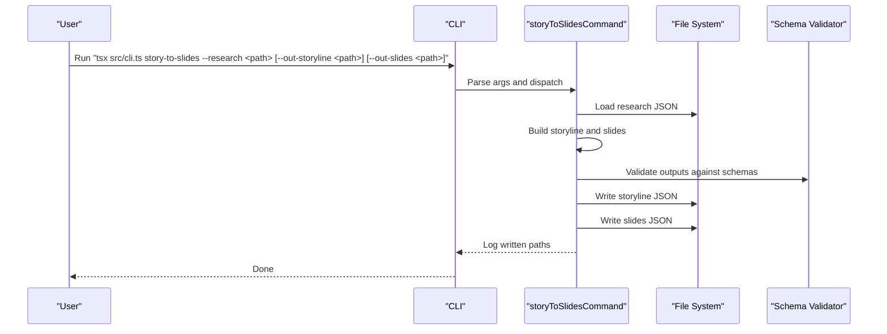
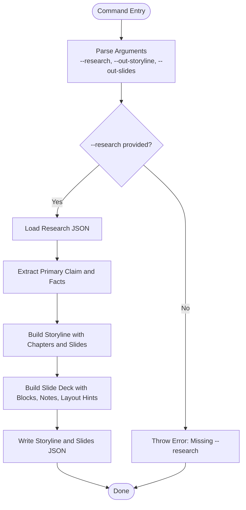
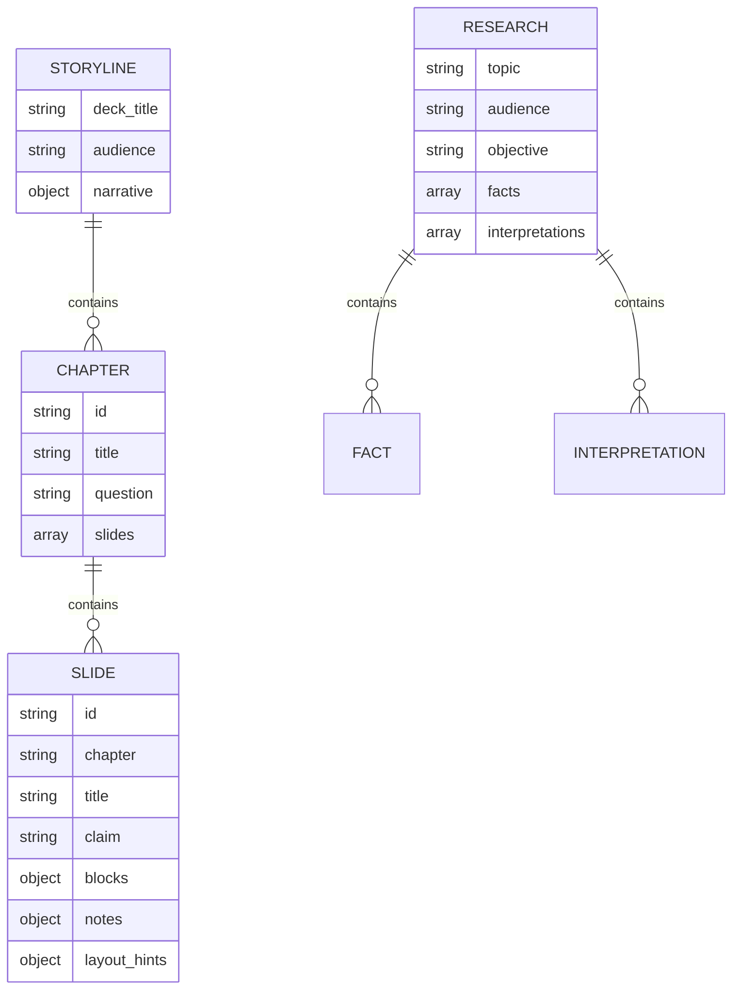
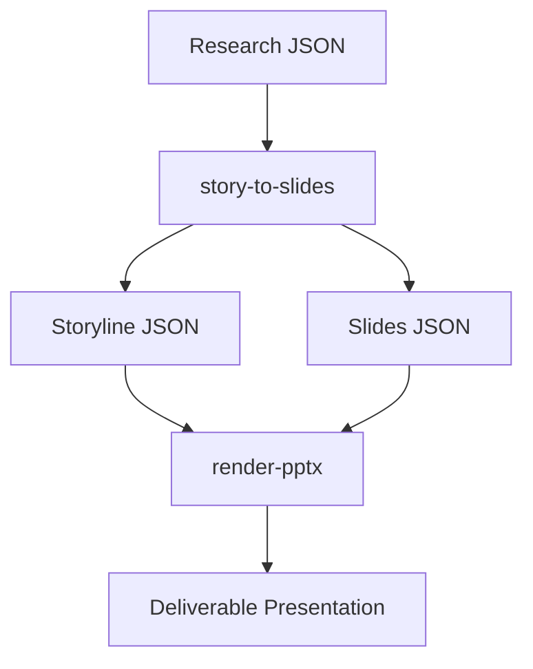
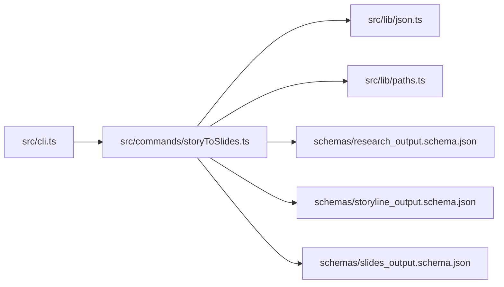

# Story-to-Slides Command

<cite>
**Referenced Files in This Document**
- [storyToSlides.ts](file://src/commands/storyToSlides.ts)
- [cli.ts](file://src/cli.ts)
- [json.ts](file://src/lib/json.ts)
- [paths.ts](file://src/lib/paths.ts)
- [research_output.schema.json](file://schemas/research_output.schema.json)
- [storyline_output.schema.json](file://schemas/storyline_output.schema.json)
- [slides_output.schema.json](file://schemas/slides_output.schema.json)
- [research_output.example.json](file://schemas/research_output.example.json)
- [storyline_output.example.json](file://schemas/storyline_output.example.json)
- [slides_output.example.json](file://schemas/slides_output.example.json)
- [storyline.generated.json](file://story/outputs/storyline.generated.json)
- [slides.generated.json](file://story/outputs/slides.generated.json)
- [package.json](file://package.json)
</cite>

## Table of Contents
1. [Introduction](#introduction)
2. [Project Structure](#project-structure)
3. [Core Components](#core-components)
4. [Architecture Overview](#architecture-overview)
5. [Detailed Component Analysis](#detailed-component-analysis)
6. [Dependency Analysis](#dependency-analysis)
7. [Performance Considerations](#performance-considerations)
8. [Troubleshooting Guide](#troubleshooting-guide)
9. [Conclusion](#conclusion)
10. [Appendices](#appendices)

## Introduction
The story-to-slides CLI command transforms structured research into a narrative storyline and a set of slide designs that preserve the intended narrative flow. It reads a research JSON file, constructs a storyline with predefined chapters and slides, and generates a companion slide deck with page type hints, layout hints, and notes to guide subsequent rendering. The command supports configurable input and output paths and integrates with the broader presentation pipeline.

## Project Structure
The story-to-slides command resides under the commands layer and is wired into the CLI. Supporting libraries handle JSON I/O and path resolution. Schemas define the contract for research, storyline, and slides outputs. Example files demonstrate expected shapes and content.

**Diagram sources**
- [cli.ts:19-37](file://src/cli.ts#L19-L37)
- [storyToSlides.ts:12-166](file://src/commands/storyToSlides.ts#L12-L166)
- [json.ts:4-13](file://src/lib/json.ts#L4-L13)
- [paths.ts:9-19](file://src/lib/paths.ts#L9-L19)
- [research_output.schema.json:1-88](file://schemas/research_output.schema.json#L1-L88)
- [storyline_output.schema.json:1-49](file://schemas/storyline_output.schema.json#L1-L49)
- [slides_output.schema.json:1-53](file://schemas/slides_output.schema.json#L1-L53)

**Section sources**
- [cli.ts:19-50](file://src/cli.ts#L19-L50)
- [storyToSlides.ts:12-166](file://src/commands/storyToSlides.ts#L12-L166)
- [json.ts:4-13](file://src/lib/json.ts#L4-L13)
- [paths.ts:9-19](file://src/lib/paths.ts#L9-L19)

## Core Components
- CLI command registration and help text expose the story-to-slides command with supported flags.
- The story-to-slides command:
  - Parses required and optional arguments.
  - Loads research JSON.
  - Builds a narrative storyline with chapters and slides.
  - Builds a slide deck with page type hints, layout hints, and notes.
  - Writes both outputs to disk.

Key parameters:
- --research <path>: Required. Path to the research JSON file.
- --out-storyline <path>: Optional. Output path for the generated storyline JSON. Defaults to a repository-relative path.
- --out-slides <path>: Optional. Output path for the generated slides JSON. Defaults to a repository-relative path.

Behavior highlights:
- Uses the first interpretation or first fact as the primary strategic claim.
- Provides fallbacks for missing facts and interpretations.
- Preserves narrative structure across chapters and slides.

**Section sources**
- [cli.ts:39-50](file://src/cli.ts#L39-L50)
- [storyToSlides.ts:12-166](file://src/commands/storyToSlides.ts#L12-L166)

## Architecture Overview
The story-to-slides command orchestrates a deterministic transformation from research to narrative and slide scaffolds. It relies on JSON I/O utilities and path helpers, validates against schemas, and writes outputs that feed downstream rendering.

**Diagram sources**
- [cli.ts:19-37](file://src/cli.ts#L19-L37)
- [storyToSlides.ts:12-166](file://src/commands/storyToSlides.ts#L12-L166)
- [json.ts:4-13](file://src/lib/json.ts#L4-L13)
- [research_output.schema.json:1-88](file://schemas/research_output.schema.json#L1-L88)
- [storyline_output.schema.json:1-49](file://schemas/storyline_output.schema.json#L1-L49)
- [slides_output.schema.json:1-53](file://schemas/slides_output.schema.json#L1-L53)

## Detailed Component Analysis

### Story-to-Slides Command Implementation
The command performs the following steps:
- Argument parsing: Ensures --research is present; resolves optional output paths with defaults.
- Research loading: Reads and parses the research JSON file.
- Storyline construction: Creates a narrative with three chapters: Deck Logic, Strategic Framing, and Executive Summary. Each chapter contains curated slides with page type hints.
- Slides construction: Generates a slide deck with cover, agenda, strategic framing, and summary slides, each annotated with blocks, notes, and layout hints.
- Output writing: Serializes and writes both outputs to disk.

**Diagram sources**
- [storyToSlides.ts:12-166](file://src/commands/storyToSlides.ts#L12-L166)

**Section sources**
- [storyToSlides.ts:12-166](file://src/commands/storyToSlides.ts#L12-L166)

### Data Contracts and Validation
The command’s outputs conform to strict JSON schemas:
- Research input schema defines required fields such as topic, audience, objective, facts, and optional interpretations.
- Storyline output schema defines deck metadata, narrative core question, chapters, and slides.
- Slides output schema defines deck metadata, theme hint, and slide-level blocks, notes, and layout hints.

**Diagram sources**
- [research_output.schema.json:1-88](file://schemas/research_output.schema.json#L1-L88)
- [storyline_output.schema.json:1-49](file://schemas/storyline_output.schema.json#L1-L49)
- [slides_output.schema.json:1-53](file://schemas/slides_output.schema.json#L1-L53)

**Section sources**
- [research_output.schema.json:1-88](file://schemas/research_output.schema.json#L1-L88)
- [storyline_output.schema.json:1-49](file://schemas/storyline_output.schema.json#L1-L49)
- [slides_output.schema.json:1-53](file://schemas/slides_output.schema.json#L1-L53)

### Example Transformations
- Research input example demonstrates the shape of topic, audience, objective, facts, interpretations, risks, industry constraints, open questions, and sources.
- Generated storyline example shows a three-chapter narrative with curated slide claims and page type hints.
- Generated slides example shows a themed slide deck with blocks, notes, and layout hints.

These examples illustrate how the command preserves narrative intent while structuring content for renderability.

**Section sources**
- [research_output.example.json:1-45](file://schemas/research_output.example.json#L1-L45)
- [storyline_output.example.json:1-23](file://schemas/storyline_output.example.json#L1-L23)
- [slides_output.example.json:1-31](file://schemas/slides_output.example.json#L1-L31)
- [storyline.generated.json:1-55](file://story/outputs/storyline.generated.json#L1-L55)
- [slides.generated.json:1-123](file://story/outputs/slides.generated.json#L1-L123)

### Integration with the Story Construction System
The generated outputs serve as the foundation for the next stages:
- The storyline provides the narrative backbone for chapter sequencing and slide claims.
- The slides deck provides page type hints, layout hints, and notes that inform rendering and styling.
- Downstream commands (e.g., render-pptx) consume these outputs to produce deliverable presentations.

**Diagram sources**
- [cli.ts:10-17](file://src/cli.ts#L10-L17)
- [storyToSlides.ts:161-164](file://src/commands/storyToSlides.ts#L161-L164)

**Section sources**
- [cli.ts:10-17](file://src/cli.ts#L10-L17)
- [storyToSlides.ts:161-164](file://src/commands/storyToSlides.ts#L161-L164)

## Dependency Analysis
The story-to-slides command depends on:
- CLI routing for command invocation.
- JSON utilities for file I/O.
- Path utilities for argument parsing and default output locations.
- Schemas for validation of inputs and outputs.

**Diagram sources**
- [cli.ts:19-37](file://src/cli.ts#L19-L37)
- [storyToSlides.ts:12-166](file://src/commands/storyToSlides.ts#L12-L166)
- [json.ts:4-13](file://src/lib/json.ts#L4-L13)
- [paths.ts:9-19](file://src/lib/paths.ts#L9-L19)
- [research_output.schema.json:1-88](file://schemas/research_output.schema.json#L1-L88)
- [storyline_output.schema.json:1-49](file://schemas/storyline_output.schema.json#L1-L49)
- [slides_output.schema.json:1-53](file://schemas/slides_output.schema.json#L1-L53)

**Section sources**
- [cli.ts:19-37](file://src/cli.ts#L19-L37)
- [storyToSlides.ts:12-166](file://src/commands/storyToSlides.ts#L12-L166)
- [json.ts:4-13](file://src/lib/json.ts#L4-L13)
- [paths.ts:9-19](file://src/lib/paths.ts#L9-L19)

## Performance Considerations
- The command performs synchronous file reads/writes and JSON parsing; it is lightweight and suitable for local development.
- For large research datasets, consider validating inputs early and minimizing repeated I/O by batching operations if extending the command.
- Using default output paths avoids extra argument parsing overhead and reduces risk of invalid paths.

## Troubleshooting Guide
Common issues and resolutions:
- Missing --research argument: The command throws an error requiring a valid research path. Provide the path to the research JSON file.
- Invalid research JSON: Ensure the file matches the research schema. Validate fields such as topic, audience, objective, and facts.
- Output path errors: If specifying custom output paths, ensure parent directories exist or allow the command to create them automatically.
- Unexpected claim fallbacks: If interpretations or facts are missing, the command uses fallback text. Populate research with sufficient facts and interpretations for richer storytelling.

**Section sources**
- [storyToSlides.ts:14-25](file://src/commands/storyToSlides.ts#L14-L25)
- [research_output.schema.json:1-88](file://schemas/research_output.schema.json#L1-L88)

## Conclusion
The story-to-slides command provides a deterministic bridge from structured research to a narrative storyline and a slide scaffold. By preserving narrative flow and embedding page type hints and layout cues, it enables consistent, repeatable rendering into deliverable presentations. Its integration with the CLI and schemas ensures predictable behavior and easy extensibility.

## Appendices

### Command Reference
- Name: story-to-slides
- Purpose: Convert structured research into a narrative storyline and slide deck.
- Required argument:
  - --research <path>: Path to the research JSON file.
- Optional arguments:
  - --out-storyline <path>: Output path for the generated storyline JSON.
  - --out-slides <path>: Output path for the generated slides JSON.

**Section sources**
- [cli.ts:39-50](file://src/cli.ts#L39-L50)
- [storyToSlides.ts:12-19](file://src/commands/storyToSlides.ts#L12-L19)

### Example Workflows
- Local script usage via package.json scripts:
  - Use the pipeline script to run the story-to-slides command as part of a larger workflow.
- Typical pipeline:
  - Run story-to-slides to generate storyline and slides.
  - Use render-pptx to convert the slides into a presentation.

**Section sources**
- [package.json:6-12](file://package.json#L6-L12)