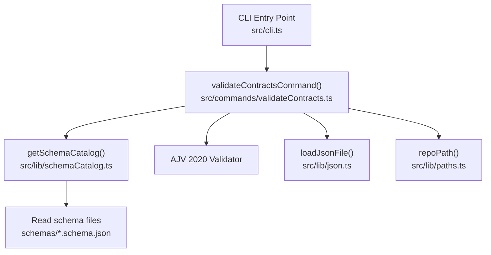
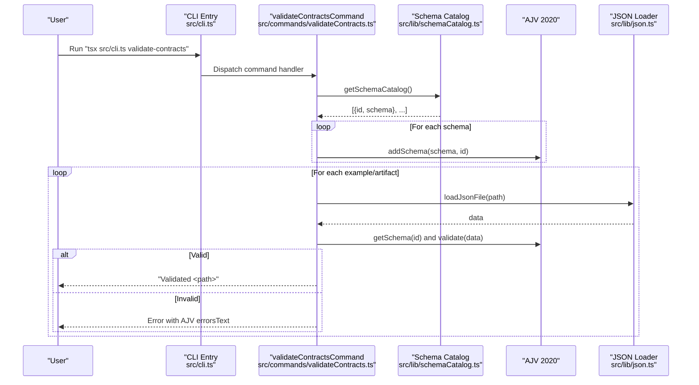
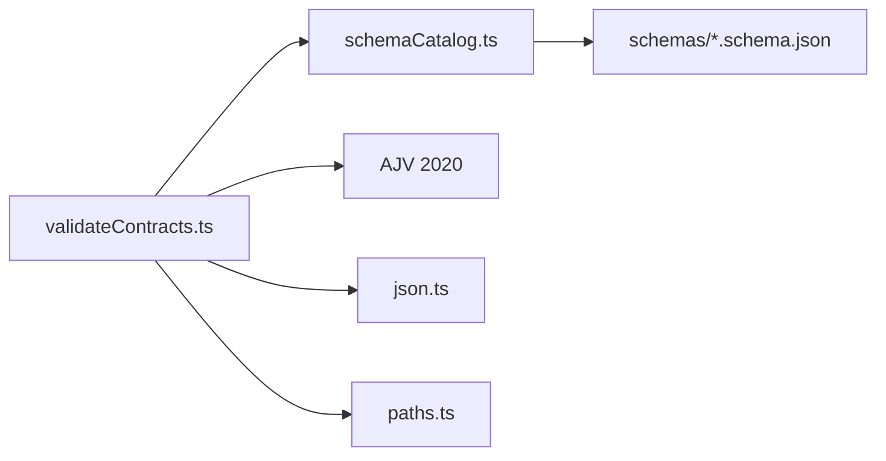

# validate-contracts Command

<cite>
**Referenced Files in This Document**
- [validateContracts.ts](file://src/commands/validateContracts.ts)
- [schemaCatalog.ts](file://src/lib/schemaCatalog.ts)
- [json.ts](file://src/lib/json.ts)
- [paths.ts](file://src/lib/paths.ts)
- [cli.ts](file://src/cli.ts)
- [research_output.schema.json](file://schemas/research_output.schema.json)
- [slides_output.schema.json](file://schemas/slides_output.schema.json)
- [storyline_output.schema.json](file://schemas/storyline_output.schema.json)
- [reference_slide_extraction.schema.json](file://schemas/reference_slide_extraction.schema.json)
- [pattern_card.schema.json](file://schemas/pattern_card.schema.json)
- [research_output.example.json](file://schemas/research_output.example.json)
- [slides_output.example.json](file://schemas/slides_output.example.json)
- [storyline_output.example.json](file://schemas/storyline_output.example.json)
- [reference_slide_extraction.example.json](file://examples/reference_slide_extraction.example.json)
- [pattern_card.example.json](file://examples/pattern_card.example.json)
- [openclaw-executive--seed-04--narrative-map.json](file://style/reference_extractions/openclaw-executive--seed-04--narrative-map.json)
- [openclaw-executive--seed-05--trust-terminal.json](file://style/reference_extractions/openclaw-executive--seed-05--trust-terminal.json)
- [openclaw-executive--seed-06--layered-architecture-stack.json](file://style/reference_extractions/openclaw-executive--seed-06--layered-architecture-stack.json)
- [template.pattern-card.json](file://style/patterns/template.pattern-card.json)
- [openclaw-executive--seed--cover_orbit.pattern.json](file://style/patterns/openclaw-executive--seed--cover_orbit.pattern.json)
- [openclaw-executive--seed--layered_architecture_stack.pattern.json](file://style/patterns/openclaw-executive--seed--layered_architecture_stack.pattern.json)
</cite>

## Update Summary
**Changes Made**
- Updated validation coverage section to include three new reference extraction template validations
- Updated pattern card validation section to reflect new naming convention
- Enhanced example artifacts section with new seed template files
- Updated validation examples to show the expanded validation scope

## Table of Contents
1. [Introduction](#introduction)
2. [Project Structure](#project-structure)
3. [Core Components](#core-components)
4. [Architecture Overview](#architecture-overview)
5. [Detailed Component Analysis](#detailed-component-analysis)
6. [Dependency Analysis](#dependency-analysis)
7. [Performance Considerations](#performance-considerations)
8. [Troubleshooting Guide](#troubleshooting-guide)
9. [Conclusion](#conclusion)

## Introduction
The validate-contracts CLI command is the first step in the pipeline to ensure data integrity before processing. It validates representative example outputs and curated artifacts against their JSON Schemas using a robust schema catalog and AJV 2020 validator. By validating contracts (outputs and artifacts) early, the system prevents downstream pipeline stages from encountering malformed or inconsistent data, reducing rework and improving reliability.

Purpose:
- Verify that example outputs and curated artifacts conform to their published schemas.
- Provide immediate, actionable feedback when validation fails.
- Integrate seamlessly with the schema catalog system to maintain a single source of truth for validation rules.

## Project Structure
The validate-contracts command is implemented as a CLI subcommand and relies on shared libraries for schema discovery, JSON loading, and path resolution.

**Diagram sources**
- [cli.ts:1-57](file://src/cli.ts#L1-L57)
- [validateContracts.ts:1-124](file://src/commands/validateContracts.ts#L1-L124)
- [schemaCatalog.ts:1-24](file://src/lib/schemaCatalog.ts#L1-L24)
- [json.ts:1-14](file://src/lib/json.ts#L1-L14)
- [paths.ts:1-20](file://src/lib/paths.ts#L1-L20)

**Section sources**
- [cli.ts:1-57](file://src/cli.ts#L1-L57)
- [validateContracts.ts:1-124](file://src/commands/validateContracts.ts#L1-L124)
- [schemaCatalog.ts:1-24](file://src/lib/schemaCatalog.ts#L1-L24)
- [json.ts:1-14](file://src/lib/json.ts#L1-L14)
- [paths.ts:1-20](file://src/lib/paths.ts#L1-L20)

## Core Components
- CLI registration and help:
  - The command is registered under the name validate-contracts and invoked via the CLI entry point.
  - Help text lists available commands, including validate-contracts.

- Validation orchestration:
  - Initializes an AJV 2020 instance configured to report all validation errors.
  - Builds a schema catalog from the schemas directory and registers each schema with AJV using its filename as the ID.
  - Iterates over a curated list of example and artifact files, loads each as JSON, and validates it against the corresponding schema.

- Schema catalog:
  - Reads all files ending with .schema.json from the schemas directory.
  - Returns a list of entries containing the schema ID and parsed schema object.

- JSON loading and path utilities:
  - Provides a safe JSON loader for example and artifact files.
  - Resolves absolute paths from the repository root using repoPath.

- Error reporting:
  - On failure, throws an error that includes the file path and a human-readable summary of AJV errors.

**Section sources**
- [cli.ts:10-17](file://src/cli.ts#L10-L17)
- [cli.ts:39-50](file://src/cli.ts#L39-L50)
- [validateContracts.ts:7-24](file://src/commands/validateContracts.ts#L7-L24)
- [validateContracts.ts:109-123](file://src/commands/validateContracts.ts#L109-L123)
- [schemaCatalog.ts:12-23](file://src/lib/schemaCatalog.ts#L12-L23)
- [json.ts:4-7](file://src/lib/json.ts#L4-L7)
- [paths.ts:9-11](file://src/lib/paths.ts#L9-L11)

## Architecture Overview
The validate-contracts command follows a straightforward pipeline: discover schemas, register them with AJV, and validate curated examples and artifacts. The flow ensures that all contracts are checked consistently and that any schema mismatches are surfaced immediately.

**Diagram sources**
- [cli.ts:19-37](file://src/cli.ts#L19-L37)
- [validateContracts.ts:22-24](file://src/commands/validateContracts.ts#L22-L24)
- [validateContracts.ts:109-123](file://src/commands/validateContracts.ts#L109-L123)
- [schemaCatalog.ts:12-23](file://src/lib/schemaCatalog.ts#L12-L23)
- [json.ts:4-7](file://src/lib/json.ts#L4-L7)

## Detailed Component Analysis

### validate-contracts Command
Responsibilities:
- Initialize AJV 2020 with all-errors mode enabled.
- Build the schema catalog and register schemas with AJV.
- Iterate over a curated set of example and artifact files.
- Load each file as JSON and validate against the matching schema.
- Report success per file or fail with a consolidated error message.

Key behaviors:
- Schema registration uses the schema filename as the ID, aligning with the validate() calls that reference the same ID.
- Error reporting leverages AJV's errorsText to produce a readable summary of validation failures.

Integration points:
- Uses getSchemaCatalog to enumerate schemas.
- Uses loadJsonFile to parse example and artifact JSON.
- Uses repoPath to resolve filesystem paths.

Validation coverage:
- Research outputs: validates research_output.schema.json against research_output.example.json.
- Storyline outputs: validates storyline_output.schema.json against storyline_output.example.json.
- Slides outputs: validates slides_output.schema.json against slides_output.example.json.
- Reference slide extractions: validates reference_slide_extraction.schema.json against multiple curated examples including new seed templates.
- Pattern cards: validates pattern_card.schema.json against curated pattern artifacts with updated naming conventions.
- Benchmark gallery: validates benchmark_gallery.schema.json against a curated gallery artifact.

**Updated** Enhanced validation coverage now includes three new reference extraction template validations and updated pattern card naming conventions.

**Section sources**
- [validateContracts.ts:7-24](file://src/commands/validateContracts.ts#L7-L24)
- [validateContracts.ts:26-107](file://src/commands/validateContracts.ts#L26-L107)
- [validateContracts.ts:109-123](file://src/commands/validateContracts.ts#L109-L123)

### Schema Catalog System
Responsibilities:
- Enumerate all .schema.json files in the schemas directory.
- Parse each schema into an object and return a typed list of entries with id and schema.

Design notes:
- Filters filenames by extension to avoid accidental inclusion of example files.
- Uses asynchronous file system operations to avoid blocking the event loop.

**Section sources**
- [schemaCatalog.ts:12-23](file://src/lib/schemaCatalog.ts#L12-L23)

### JSON Loading Utility
Responsibilities:
- Safely read and parse UTF-8 JSON files.
- Provide a consistent interface for loading example and artifact data.

**Section sources**
- [json.ts:4-7](file://src/lib/json.ts#L4-L7)

### Path Utilities
Responsibilities:
- Resolve absolute repository paths from relative segments.
- Support flexible path construction for examples, schemas, and style artifacts.

**Section sources**
- [paths.ts:9-11](file://src/lib/paths.ts#L9-L11)

### CLI Registration
Responsibilities:
- Register validate-contracts as a command handler.
- Print help text listing available commands.

**Section sources**
- [cli.ts:10-17](file://src/cli.ts#L10-L17)
- [cli.ts:39-50](file://src/cli.ts#L39-L50)

### Example Artifacts and Their Schemas
The command validates the following contracts:

- Research Output
  - Schema: research_output.schema.json
  - Example: research_output.example.json
  - Purpose: Validates structured research outputs including facts, interpretations, risks, industry constraints, open questions, and sources.

- Storyline Output
  - Schema: storyline_output.schema.json
  - Example: storyline_output.example.json
  - Purpose: Validates narrative structure including deck title, audience, and chapters with slides.

- Slides Output
  - Schema: slides_output.schema.json
  - Example: slides_output.example.json
  - Purpose: Validates slide deck structure including deck title, theme hints, and slide blocks.

- Reference Slide Extraction
  - Schema: reference_slide_extraction.schema.json
  - Examples: reference_slide_extraction.example.json and multiple curated reference slide artifacts including new seed templates.
  - Purpose: Validates detailed extraction metadata including source, narrative role, page type candidate, composition, components, and reuse notes.

**Updated** Enhanced with three new reference extraction template validations:
- openclaw-executive--seed-04--narrative-map.json: Validates narrative map agenda page patterns
- openclaw-executive--seed-05--trust-terminal.json: Validates trust terminal page patterns  
- openclaw-executive--seed-06--layered-architecture-stack.json: Validates layered architecture stack patterns

- Pattern Card
  - Schema: pattern_card.schema.json
  - Examples: curated pattern artifacts in style/patterns with updated naming conventions.
  - Purpose: Validates reusable slide pattern structures.

**Updated** Enhanced pattern card validation with new naming convention:
- template.pattern-card.json: Template pattern card structure
- openclaw-executive--seed--cover_orbit.pattern.json: Updated naming convention for cover orbit patterns
- openclaw-executive--seed--layered_architecture_stack.pattern.json: Updated naming convention for architecture patterns

- Benchmark Gallery
  - Schema: benchmark_gallery.schema.json
  - Example: benchmark-gallery.json in style/reference_extractions.
  - Purpose: Validates curated benchmark references.

**Section sources**
- [research_output.schema.json:1-88](file://schemas/research_output.schema.json#L1-L88)
- [storyline_output.schema.json:1-49](file://schemas/storyline_output.schema.json#L1-L49)
- [slides_output.schema.json:1-53](file://schemas/slides_output.schema.json#L1-L53)
- [reference_slide_extraction.schema.json:1-103](file://schemas/reference_slide_extraction.schema.json#L1-L103)
- [pattern_card.schema.json](file://schemas/pattern_card.schema.json)
- [research_output.example.json:1-45](file://schemas/research_output.example.json#L1-L45)
- [storyline_output.example.json:1-23](file://schemas/storyline_output.example.json#L1-L23)
- [slides_output.example.json:1-31](file://schemas/slides_output.example.json#L1-L31)
- [reference_slide_extraction.example.json:1-64](file://examples/reference_slide_extraction.example.json#L1-L64)
- [pattern_card.example.json:1-54](file://examples/pattern_card.example.json#L1-L54)
- [openclaw-executive--seed-04--narrative-map.json:1-72](file://style/reference_extractions/openclaw-executive--seed-04--narrative-map.json#L1-L72)
- [openclaw-executive--seed-05--trust-terminal.json:1-72](file://style/reference_extractions/openclaw-executive--seed-05--trust-terminal.json#L1-L72)
- [openclaw-executive--seed-06--layered-architecture-stack.json:1-72](file://style/reference_extractions/openclaw-executive--seed-06--layered-architecture-stack.json#L1-L72)
- [template.pattern-card.json:1-46](file://style/patterns/template.pattern-card.json#L1-L46)
- [openclaw-executive--seed--cover_orbit.pattern.json:1-46](file://style/patterns/openclaw-executive--seed--cover_orbit.pattern.json#L1-L46)
- [openclaw-executive--seed--layered_architecture_stack.pattern.json:1-55](file://style/patterns/openclaw-executive--seed--layered_architecture_stack.pattern.json#L1-L55)

## Dependency Analysis
The validate-contracts command depends on:
- Schema catalog for discovering and loading schemas.
- AJV 2020 for performing validation.
- JSON loader for parsing example and artifact files.
- Path utilities for resolving file locations.

**Diagram sources**
- [validateContracts.ts:1-5](file://src/commands/validateContracts.ts#L1-L5)
- [schemaCatalog.ts:1-24](file://src/lib/schemaCatalog.ts#L1-L24)
- [json.ts:1-14](file://src/lib/json.ts#L1-L14)
- [paths.ts:1-20](file://src/lib/paths.ts#L1-L20)

**Section sources**
- [validateContracts.ts:1-5](file://src/commands/validateContracts.ts#L1-L5)
- [schemaCatalog.ts:1-24](file://src/lib/schemaCatalog.ts#L1-L24)

## Performance Considerations
- All validations are synchronous and performed sequentially for clarity and deterministic error reporting.
- The schema catalog reads and parses all .schema.json files once and caches them in memory during validation runs.
- Using allErrors mode ensures comprehensive feedback but may increase processing time for large or deeply nested schemas.
- For large-scale validation, consider parallelizing example validations while preserving order of reporting.

## Troubleshooting Guide
Common validation failures and corrective actions:

- Missing validator for schema ID
  - Symptom: An error indicates a missing validator for a given schema ID.
  - Cause: The schema file is not present in the schemas directory or was not included in the catalog.
  - Action: Ensure the schema file exists and ends with .schema.json in the schemas directory.

- Validation failed for a file
  - Symptom: An error is thrown indicating validation failure for a specific file path.
  - Cause: The file does not match the schema definition (missing required fields, wrong types, disallowed properties, etc.).
  - Action: Review the error summary and compare the file content with the corresponding schema definition. Fix missing required fields, correct types, or remove disallowed properties.

- Type mismatch
  - Symptom: Errors indicate type mismatches (e.g., string vs number, array vs object).
  - Action: Adjust the field types in the file to match the schema.

- Missing required properties
  - Symptom: Errors indicate missing required fields.
  - Action: Add the required fields to the file as defined in the schema.

- Disallowed additional properties
  - Symptom: Errors indicate properties not permitted by the schema.
  - Action: Remove extra fields not defined in the schema.

- Array item constraints
  - Symptom: Errors indicate arrays with insufficient items or invalid item types.
  - Action: Ensure arrays meet minimum length requirements and that each item conforms to the specified type.

- Enum violations
  - Symptom: Errors indicate values not in the allowed enumeration.
  - Action: Change the value to one of the allowed options as defined in the schema.

Feedback and correction workflow:
- The command prints a "Validated <path>" message for each successful file.
- On failure, it throws an error that includes the file path and a consolidated error summary. Use this information to locate and fix issues in the file, then re-run the command.

**Section sources**
- [validateContracts.ts:111-120](file://src/commands/validateContracts.ts#L111-L120)

## Conclusion
The validate-contracts command establishes a reliable checkpoint for data integrity by validating curated examples and artifacts against their schemas. Its integration with the schema catalog and AJV 2020 ensures consistent, comprehensive validation with clear error reporting. The recent enhancements expand validation coverage to include new reference extraction template validations and updated pattern card naming conventions, further strengthening the system's data integrity pipeline. By catching schema violations early, it improves the reliability of downstream pipeline stages and reduces the cost of fixing data issues later in the process.