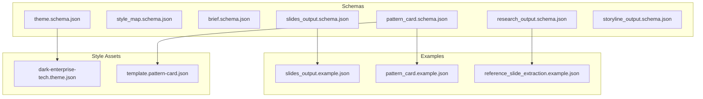
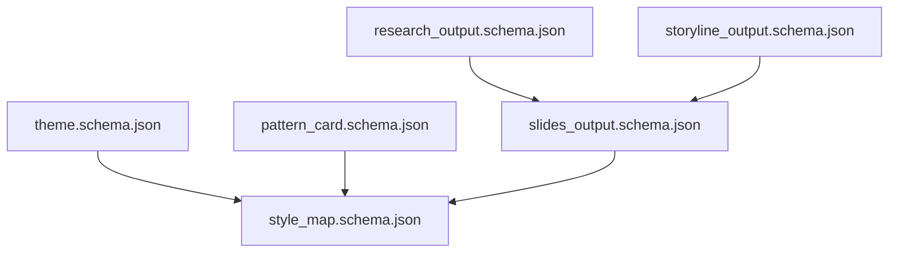
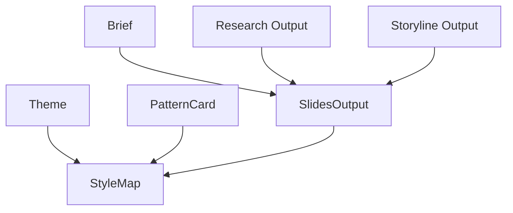

# Core Schemas

<cite>
**Referenced Files in This Document**
- [slides_output.schema.json](file://schemas/slides_output.schema.json)
- [slides_output.example.json](file://schemas/slides_output.example.json)
- [style_map.schema.json](file://schemas/style_map.schema.json)
- [brief.schema.json](file://schemas/brief.schema.json)
- [theme.schema.json](file://schemas/theme.schema.json)
- [dark-enterprise-tech.theme.json](file://style/themes/dark-enterprise-tech.theme.json)
- [pattern_card.schema.json](file://schemas/pattern_card.schema.json)
- [pattern_card.example.json](file://examples/pattern_card.example.json)
- [template.pattern-card.json](file://style/patterns/template.pattern-card.json)
- [reference_slide_extraction.schema.json](file://schemas/reference_slide_extraction.schema.json)
- [reference_slide_extraction.example.json](file://examples/reference_slide_extraction.example.json)
- [research_output.schema.json](file://schemas/research_output.schema.json)
- [storyline_output.schema.json](file://schemas/storyline_output.schema.json)
- [README.md](file://README.md)
</cite>

## Table of Contents
1. [Introduction](#introduction)
2. [Project Structure](#project-structure)
3. [Core Components](#core-components)
4. [Architecture Overview](#architecture-overview)
5. [Detailed Component Analysis](#detailed-component-analysis)
6. [Dependency Analysis](#dependency-analysis)
7. [Performance Considerations](#performance-considerations)
8. [Troubleshooting Guide](#troubleshooting-guide)
9. [Conclusion](#conclusion)
10. [Appendices](#appendices)

## Introduction
This document defines the core JSON Schema contracts that underpin the Enterprise PPT System’s data models and design system. It focuses on:
- SlidesOutput: Slide content structure, blocks, and metadata
- StyleMap: Visual design instructions and page-type mappings
- Brief: Project specifications and requirements
- Theme: Design system configuration and color schemes
- PatternCard: Reusable design patterns and component definitions

These schemas establish validation rules, data types, and business constraints to ensure consistent, predictable generation and rendering of presentation decks.

## Project Structure
The core schemas live under the schemas directory and are complemented by example files and style assets:
- schemas: JSON Schema definitions and example outputs
- examples: Representative JSON instances for schemas
- style: Themes and pattern cards used to populate StyleMap and inform rendering
- research and story: Related schemas that feed into SlidesOutput and PatternCard

**Diagram sources**
- [slides_output.schema.json](file://schemas/slides_output.schema.json)
- [style_map.schema.json](file://schemas/style_map.schema.json)
- [brief.schema.json](file://schemas/brief.schema.json)
- [theme.schema.json](file://schemas/theme.schema.json)
- [pattern_card.schema.json](file://schemas/pattern_card.schema.json)
- [research_output.schema.json](file://schemas/research_output.schema.json)
- [storyline_output.schema.json](file://schemas/storyline_output.schema.json)
- [slides_output.example.json](file://schemas/slides_output.example.json)
- [pattern_card.example.json](file://examples/pattern_card.example.json)
- [reference_slide_extraction.example.json](file://examples/reference_slide_extraction.example.json)
- [dark-enterprise-tech.theme.json](file://style/themes/dark-enterprise-tech.theme.json)
- [template.pattern-card.json](file://style/patterns/template.pattern-card.json)

**Section sources**
- [README.md](file://README.md)

## Core Components
This section summarizes the purpose, required fields, and constraints for each core schema.

- SlidesOutput
  - Purpose: Defines the top-level deck metadata and the ordered collection of slides.
  - Required fields: deck_title, slides
  - Constraints: slides array must be non-empty; each slide requires id, chapter, title, claim, and blocks.

- StyleMap
  - Purpose: Maps slide identifiers to page types, visual anchors, weight centers, density levels, and optional learned patterns.
  - Required fields: theme_family, slides
  - Constraints: slides array must be non-empty; each entry requires slide_id, page_type, visual_anchor, weight_center, editable_target.

- Brief
  - Purpose: Captures project topic, audience, industry, objective, constraints, and optional preferences.
  - Required fields: topic, audience, industry, objective, constraints
  - Constraints: constraints is a non-empty array of strings.

- Theme
  - Purpose: Encapsulates a design system with palette, typography, spacing, radius, borders, shadows, and backgrounds.
  - Required fields: id, name, palette, typography, spacing, backgrounds
  - Constraints: palette and typography define required sub-properties; spacing, radius, borders, shadows, backgrounds accept additional properties.

- PatternCard
  - Purpose: Encapsulates reusable slide design patterns with narrative roles, visual anchors, layout and alignment rules, image usage, highlight grammar, component recipe, editable targets, anti-patterns, and reuse notes.
  - Required fields: id, page_type, source_references, narrative_roles, visual_anchor, weight_center, layout_rules, alignment_rules, anti_patterns
  - Constraints: source_references and layout_rules/alignment_rules/anti_patterns are non-empty arrays; editable_target is an enumerated value; image_usage.mode is an enumerated value.

**Section sources**
- [slides_output.schema.json](file://schemas/slides_output.schema.json)
- [style_map.schema.json](file://schemas/style_map.schema.json)
- [brief.schema.json](file://schemas/brief.schema.json)
- [theme.schema.json](file://schemas/theme.schema.json)
- [pattern_card.schema.json](file://schemas/pattern_card.schema.json)

## Architecture Overview
The core schemas coordinate across three layers:
- Research and Story: Produce structured outputs consumed by rendering.
- Style: Provides Theme and PatternCard definitions that guide StyleMap composition.
- Render: Consumes SlidesOutput and StyleMap to produce deliverable presentations.

**Diagram sources**
- [research_output.schema.json](file://schemas/research_output.schema.json)
- [storyline_output.schema.json](file://schemas/storyline_output.schema.json)
- [theme.schema.json](file://schemas/theme.schema.json)
- [pattern_card.schema.json](file://schemas/pattern_card.schema.json)
- [slides_output.schema.json](file://schemas/slides_output.schema.json)
- [style_map.schema.json](file://schemas/style_map.schema.json)

## Detailed Component Analysis

### SlidesOutput Schema
SlidesOutput defines the canonical slide deck representation. Each slide aggregates narrative and layout metadata, and a blocks object that organizes content areas.

Key fields and constraints:
- deck_title: string, required
- theme_hint: string, optional
- slides: array, minItems 1, items are objects with:
  - id: string, required, minLength 1
  - chapter: string, required, minLength 1
  - page_type: string, optional
  - page_type_hint: string, optional
  - title: string, required, minLength 1
  - subtitle: string, optional
  - claim: string, required, minLength 1
  - blocks: object, required
  - notes: object, optional with:
    - audience_tone: string
    - visual_anchor: string
    - must_emphasize: array of string, each minLength 1
  - layout_hints: object, optional with:
    - weight_center: string
    - density_level: string
    - avoid_symmetry: boolean

Validation rules:
- Top-level: additionalProperties false; required properties deck_title and slides
- Slide-level: additionalProperties false; required properties id, chapter, title, claim, blocks
- Notes and layout_hints allow additional properties for extensibility

Practical usage patterns:
- Use blocks to group related content areas (e.g., story_points, signal_bars)
- Populate notes to guide presenter tone and emphasis
- Use layout_hints to encode density and symmetry preferences

Example reference:
- [slides_output.example.json](file://schemas/slides_output.example.json)

**Section sources**
- [slides_output.schema.json](file://schemas/slides_output.schema.json)
- [slides_output.example.json](file://schemas/slides_output.example.json)

### StyleMap Schema
StyleMap maps each slide to a page type and a set of visual design instructions. It optionally embeds a learned pattern with layout and alignment rules, highlight grammar, and image usage guidance.

Key fields and constraints:
- theme_family: string, required, minLength 1
- slides: array, minItems 1, items are objects with:
  - slide_id: string, required, minLength 1
  - page_type: string, required, minLength 1
  - visual_anchor: string, required, minLength 1
  - weight_center: string, required, minLength 1
  - density_level: enum ["low", "medium", "high"], optional
  - editable_target: string, required, minLength 1
  - component_bindings: array of string, optional
  - learned_pattern: object, optional with:
    - pattern_id: string, required, minLength 1
    - source_references: array of string, required, each minLength 1
    - layout_rules: array of string, required, each minLength 1
    - alignment_rules: array of string, required, each minLength 1
    - highlight_grammar: array of string, optional
    - image_usage: object, optional with:
      - required: boolean
      - mode: enum ["hero", "contextual", "texture", "none"]
      - placement_guidance: string, optional

Validation rules:
- Top-level: additionalProperties false; required properties theme_family and slides
- Slide-level: additionalProperties false; required properties slide_id, page_type, visual_anchor, weight_center, editable_target
- Learned pattern enforces required sub-properties when present

Practical usage patterns:
- Use learned_pattern to standardize layout and alignment rules across similar slides
- Use density_level to communicate visual density intent
- Use component_bindings to link reusable components

Example reference:
- [reference_slide_extraction.example.json](file://examples/reference_slide_extraction.example.json)

**Section sources**
- [style_map.schema.json](file://schemas/style_map.schema.json)
- [reference_slide_extraction.schema.json](file://schemas/reference_slide_extraction.schema.json)
- [reference_slide_extraction.example.json](file://examples/reference_slide_extraction.example.json)

### Brief Schema
Brief captures the essential project specifications and constraints that drive content creation and design choices.

Key fields and constraints:
- topic: string, required, minLength 1
- audience: string, required, minLength 1
- industry: string, required, minLength 1
- objective: string, required, minLength 1
- time_horizon: string, optional
- constraints: array of string, required, each minLength 1
- preferred_tone: string, optional
- reference_decks: array of string, optional

Validation rules:
- Top-level: additionalProperties false; required properties topic, audience, industry, objective, constraints

Practical usage patterns:
- Use constraints to encode non-functional requirements (e.g., timebox, platform limitations)
- Use reference_decks to seed inspiration and ensure brand alignment

**Section sources**
- [brief.schema.json](file://schemas/brief.schema.json)

### Theme Schema
Theme defines a complete design system including palette, typography, spacing, radius, borders, shadows, and backgrounds.

Key fields and constraints:
- id: string, required, minLength 1
- name: string, required, minLength 1
- palette: object, required with:
  - background: string, required, minLength 1
  - surface: string, required, minLength 1
  - text_primary: string, required, minLength 1
  - accent_primary: string, required, minLength 1
- typography: object, required with:
  - font_family: string, required, minLength 1
  - title_size: number
  - body_size: number
- spacing: object, additionalProperties numeric values
- radius: object, additionalProperties numeric values
- borders: object, additionalProperties
- shadows: object, additionalProperties
- backgrounds: object, additionalProperties

Validation rules:
- Top-level: additionalProperties false; required properties id, name, palette, typography, spacing, backgrounds

Practical usage patterns:
- Use Theme to configure rendering engines and maintain visual consistency
- Extend spacing, radius, borders, shadows, and backgrounds for granular control

Example reference:
- [dark-enterprise-tech.theme.json](file://style/themes/dark-enterprise-tech.theme.json)

**Section sources**
- [theme.schema.json](file://schemas/theme.schema.json)
- [dark-enterprise-tech.theme.json](file://style/themes/dark-enterprise-tech.theme.json)

### PatternCard Schema
PatternCard codifies reusable slide designs with narrative roles, visual anchors, layout and alignment rules, highlight grammar, component recipes, editable targets, anti-patterns, and reuse notes.

Key fields and constraints:
- id: string, required, minLength 1
- page_type: string, required, minLength 1
- source_references: array of string, required, minItems 1, each minLength 1
- narrative_roles: array of string, optional
- topic_fit: array of string, optional
- visual_anchor: string, required, minLength 1
- weight_center: string, required, minLength 1
- layout_rules: array of string, required, each minLength 1
- alignment_rules: array of string, required, each minLength 1
- image_usage: object, optional with:
  - required: boolean
  - mode: enum ["hero", "contextual", "texture", "none"]
  - placement_guidance: string, optional
- highlight_grammar: array of string, optional
- component_recipe: array of string, optional
- editable_target: enum ["native_shapes_plus_text", "hybrid_native_plus_svg", "native_only"]
- anti_patterns: array of string, required, each minLength 1
- reuse_notes: array of string, optional

Validation rules:
- Top-level: additionalProperties false; required properties id, page_type, source_references, narrative_roles, visual_anchor, weight_center, layout_rules, alignment_rules, anti_patterns

Practical usage patterns:
- Use layout_rules and alignment_rules to enforce consistent composition
- Use image_usage to specify whether imagery is required and how it should be placed
- Use editable_target to guide rendering technology choices

Example references:
- [pattern_card.example.json](file://examples/pattern_card.example.json)
- [template.pattern-card.json](file://style/patterns/template.pattern-card.json)

**Section sources**
- [pattern_card.schema.json](file://schemas/pattern_card.schema.json)
- [pattern_card.example.json](file://examples/pattern_card.example.json)
- [template.pattern-card.json](file://style/patterns/template.pattern-card.json)

## Dependency Analysis
The schemas depend on each other through data flow and design system integration.

**Diagram sources**
- [brief.schema.json](file://schemas/brief.schema.json)
- [research_output.schema.json](file://schemas/research_output.schema.json)
- [storyline_output.schema.json](file://schemas/storyline_output.schema.json)
- [theme.schema.json](file://schemas/theme.schema.json)
- [pattern_card.schema.json](file://schemas/pattern_card.schema.json)
- [slides_output.schema.json](file://schemas/slides_output.schema.json)
- [style_map.schema.json](file://schemas/style_map.schema.json)

**Section sources**
- [brief.schema.json](file://schemas/brief.schema.json)
- [research_output.schema.json](file://schemas/research_output.schema.json)
- [storyline_output.schema.json](file://schemas/storyline_output.schema.json)
- [theme.schema.json](file://schemas/theme.schema.json)
- [pattern_card.schema.json](file://schemas/pattern_card.schema.json)
- [slides_output.schema.json](file://schemas/slides_output.schema.json)
- [style_map.schema.json](file://schemas/style_map.schema.json)

## Performance Considerations
- Keep arrays minimal and bounded where possible (e.g., constraints, anti_patterns) to reduce validation overhead.
- Prefer enums for categorical fields (e.g., density_level, image_usage.mode, editable_target) to simplify validation and improve readability.
- Use additionalProperties sparingly; when used, constrain shapes to limit downstream processing costs.
- Store reusable patterns (PatternCard) centrally to minimize duplication and enable efficient lookup during rendering.

## Troubleshooting Guide
Common validation issues and resolutions:
- Missing required fields
  - SlidesOutput: Ensure deck_title and slides are present; each slide must include id, chapter, title, claim, and blocks.
  - StyleMap: Ensure theme_family and slides are present; each slide must include slide_id, page_type, visual_anchor, weight_center, editable_target.
  - Brief: Ensure topic, audience, industry, objective, and constraints are present.
  - Theme: Ensure id, name, palette, typography, spacing, and backgrounds are present.
  - PatternCard: Ensure id, page_type, source_references, narrative_roles, visual_anchor, weight_center, layout_rules, alignment_rules, and anti_patterns are present.
- Type mismatches
  - Ensure strings meet minLength constraints; ensure numbers are numeric where required.
  - Ensure enums match allowed values (e.g., density_level, image_usage.mode, editable_target).
- Unexpected properties
  - Set additionalProperties false at top-level objects to catch typos early.
- Extensibility
  - Notes and layout_hints in SlidesOutput, and learned_pattern.image_usage in StyleMap, allow additional properties; keep keys explicit and documented.

**Section sources**
- [slides_output.schema.json](file://schemas/slides_output.schema.json)
- [style_map.schema.json](file://schemas/style_map.schema.json)
- [brief.schema.json](file://schemas/brief.schema.json)
- [theme.schema.json](file://schemas/theme.schema.json)
- [pattern_card.schema.json](file://schemas/pattern_card.schema.json)

## Conclusion
The core schemas establish a robust contract for slide content, visual design mapping, project briefs, design systems, and reusable patterns. By enforcing strict validation rules and clear data structures, they enable reliable rendering, consistent design, and scalable content authoring across the Enterprise PPT System.

## Appendices

### Appendix A: Example Instances
- SlidesOutput example
  - [slides_output.example.json](file://schemas/slides_output.example.json)
- PatternCard example
  - [pattern_card.example.json](file://examples/pattern_card.example.json)
  - [template.pattern-card.json](file://style/patterns/template.pattern-card.json)
- Reference slide extraction example
  - [reference_slide_extraction.example.json](file://examples/reference_slide_extraction.example.json)

**Section sources**
- [slides_output.example.json](file://schemas/slides_output.example.json)
- [pattern_card.example.json](file://examples/pattern_card.example.json)
- [template.pattern-card.json](file://style/patterns/template.pattern-card.json)
- [reference_slide_extraction.example.json](file://examples/reference_slide_extraction.example.json)