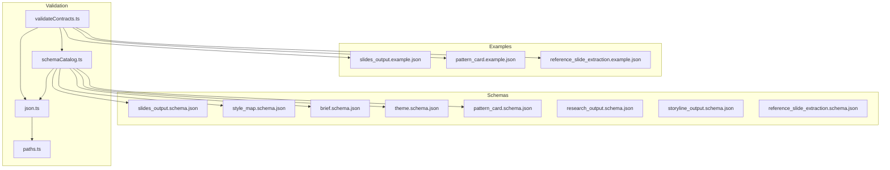
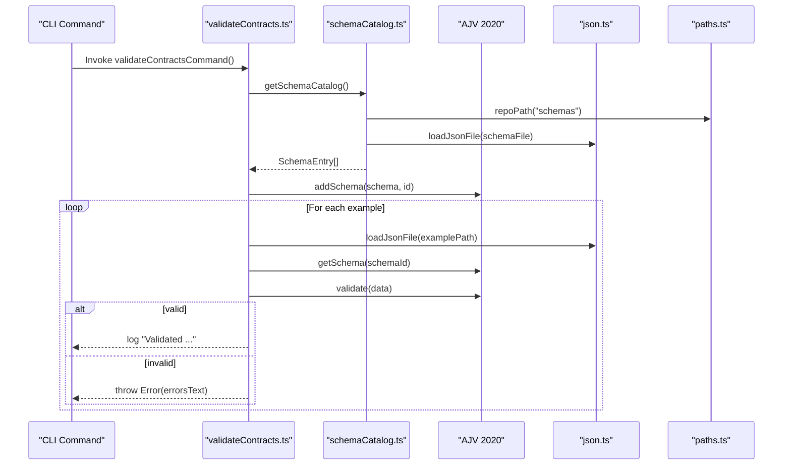
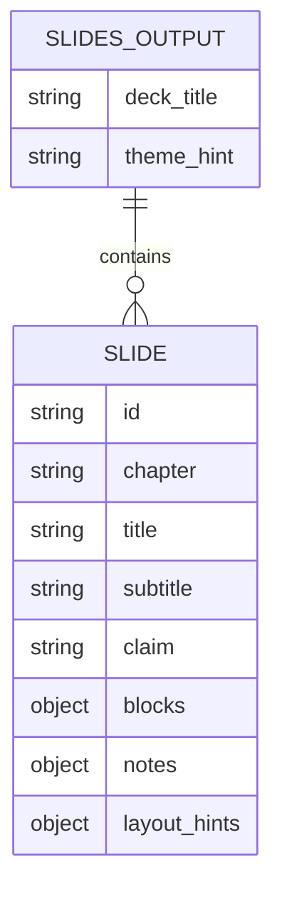
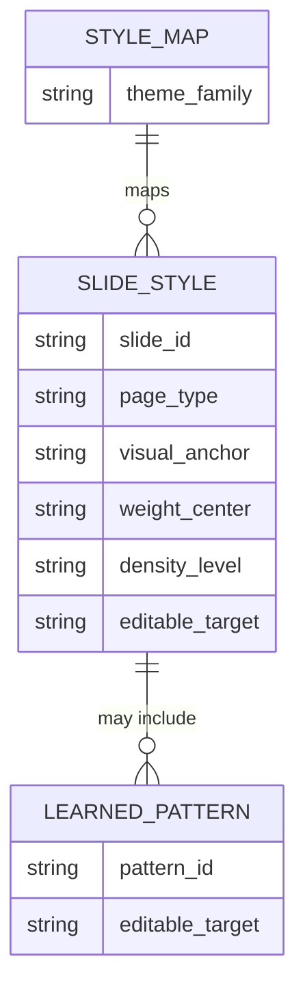
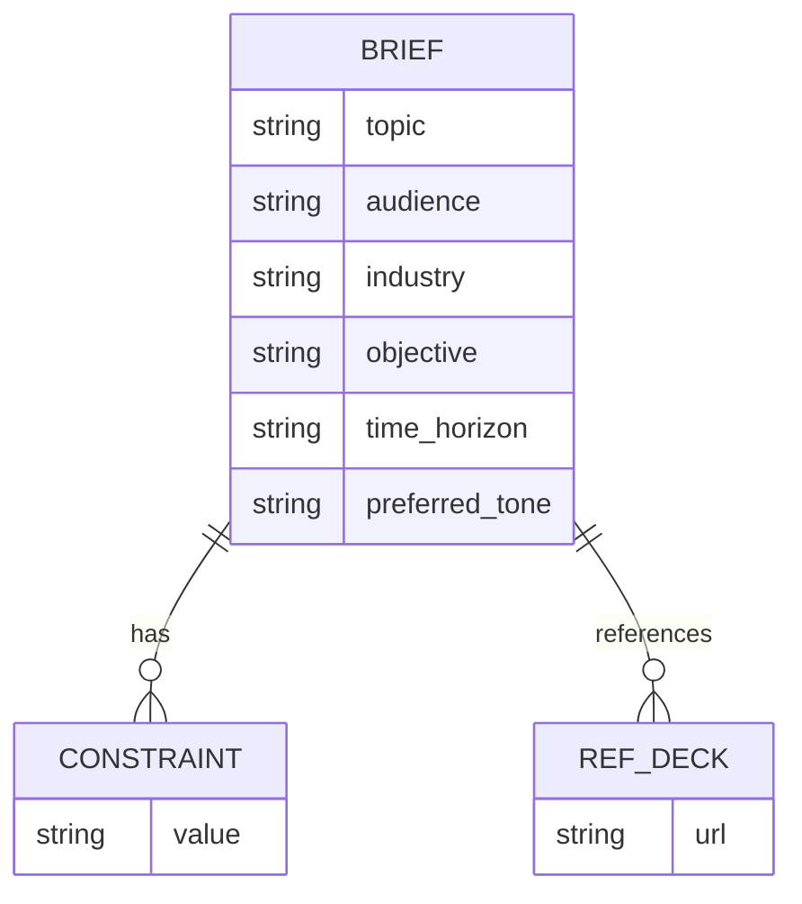
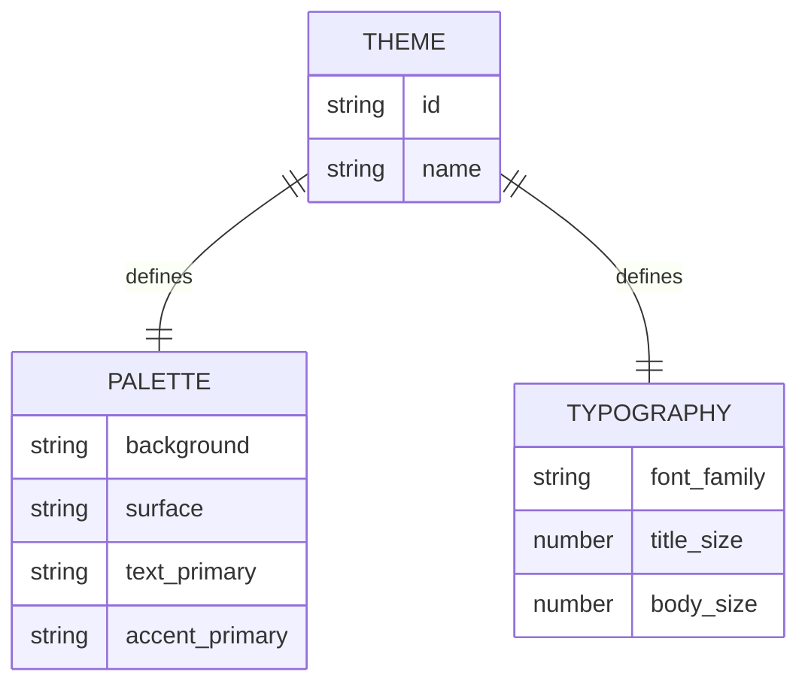
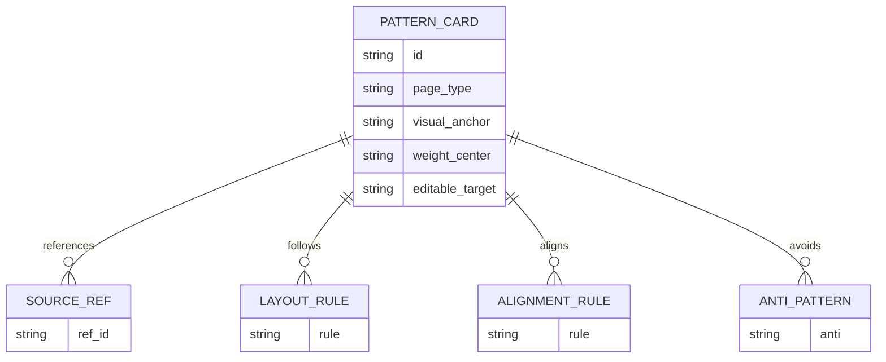
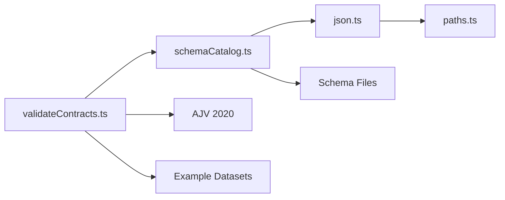
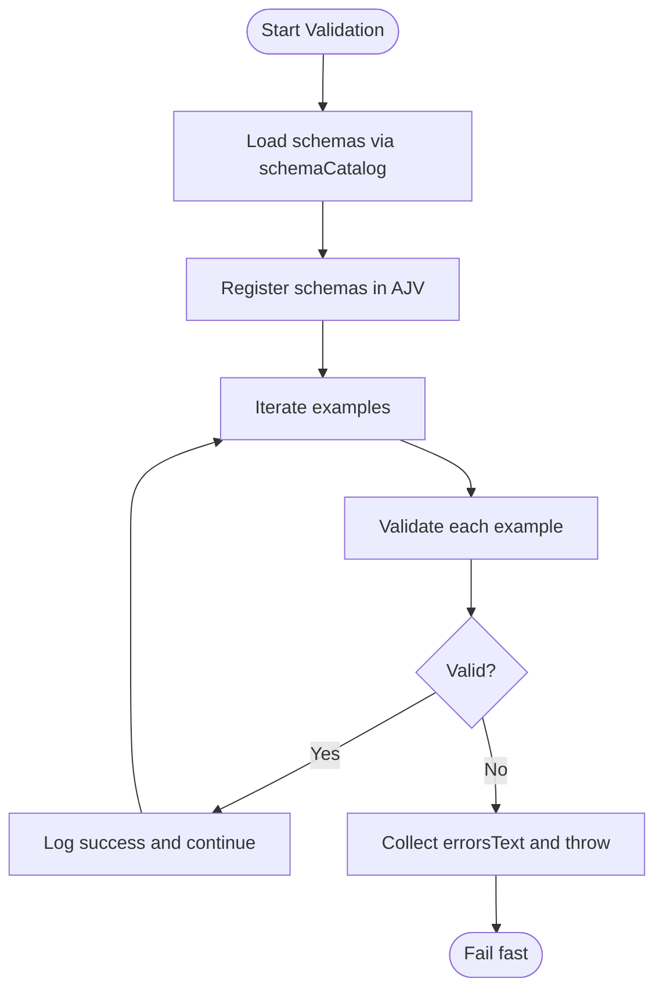

# Data Models and Schemas

<cite>
**Referenced Files in This Document**
- [slides_output.schema.json](file://schemas/slides_output.schema.json)
- [slides_output.example.json](file://schemas/slides_output.example.json)
- [style_map.schema.json](file://schemas/style_map.schema.json)
- [brief.schema.json](file://schemas/brief.schema.json)
- [theme.schema.json](file://schemas/theme.schema.json)
- [pattern_card.schema.json](file://schemas/pattern_card.schema.json)
- [pattern_card.example.json](file://examples/pattern_card.example.json)
- [validateContracts.ts](file://src/commands/validateContracts.ts)
- [schemaCatalog.ts](file://src/lib/schemaCatalog.ts)
- [json.ts](file://src/lib/json.ts)
- [paths.ts](file://src/lib/paths.ts)
- [research_output.schema.json](file://schemas/research_output.schema.json)
- [storyline_output.schema.json](file://schemas/storyline_output.schema.json)
- [reference_slide_extraction.schema.json](file://schemas/reference_slide_extraction.schema.json)
- [reference_slide_extraction.example.json](file://examples/reference_slide_extraction.example.json)
</cite>

## Table of Contents
1. [Introduction](#introduction)
2. [Project Structure](#project-structure)
3. [Core Components](#core-components)
4. [Architecture Overview](#architecture-overview)
5. [Detailed Component Analysis](#detailed-component-analysis)
6. [Dependency Analysis](#dependency-analysis)
7. [Performance Considerations](#performance-considerations)
8. [Troubleshooting Guide](#troubleshooting-guide)
9. [Conclusion](#conclusion)
10. [Appendices](#appendices)

## Introduction
This document defines the core JSON Schema data models for the Enterprise PPT System. It focuses on five primary contracts:
- SlidesOutput: Slide deck content structure for rendering
- StyleMap: Visual design and layout instructions per slide
- Brief: Project specification and constraints
- Theme: Design system configuration
- PatternCard: Reusable design patterns for page composition

It documents entity relationships, field definitions, validation rules, business constraints, validation flows, error reporting, schema evolution strategies, and integration with the rendering pipeline. It also covers data lifecycle, versioning considerations, and backward compatibility.

## Project Structure
The data contracts live under schemas/ and are complemented by example instances and validation tooling under src/.

**Diagram sources**
- [validateContracts.ts:1-100](file://src/commands/validateContracts.ts#L1-L100)
- [schemaCatalog.ts:1-24](file://src/lib/schemaCatalog.ts#L1-L24)
- [json.ts:1-14](file://src/lib/json.ts#L1-L14)
- [paths.ts:1-20](file://src/lib/paths.ts#L1-L20)
- [slides_output.schema.json:1-53](file://schemas/slides_output.schema.json#L1-L53)
- [style_map.schema.json:1-70](file://schemas/style_map.schema.json#L1-L70)
- [brief.schema.json:1-25](file://schemas/brief.schema.json#L1-L25)
- [theme.schema.json:1-58](file://schemas/theme.schema.json#L1-L58)
- [pattern_card.schema.json:1-75](file://schemas/pattern_card.schema.json#L1-L75)
- [slides_output.example.json:1-31](file://schemas/slides_output.example.json#L1-L31)
- [pattern_card.example.json:1-54](file://examples/pattern_card.example.json#L1-L54)
- [reference_slide_extraction.example.json:1-64](file://examples/reference_slide_extraction.example.json#L1-L64)

**Section sources**
- [validateContracts.ts:1-100](file://src/commands/validateContracts.ts#L1-L100)
- [schemaCatalog.ts:1-24](file://src/lib/schemaCatalog.ts#L1-L24)
- [json.ts:1-14](file://src/lib/json.ts#L1-L14)
- [paths.ts:1-20](file://src/lib/paths.ts#L1-L20)

## Core Components
This section introduces the five core data models and their roles in the system.

- SlidesOutput
  - Purpose: Defines the slide deck’s top-level metadata and the array of slides, each containing structured blocks and optional notes and layout hints.
  - Key fields: deck_title, theme_hint, slides[]. Required fields per slide include id, chapter, title, claim, and blocks.
  - Validation rules: Non-empty strings for identifiers; arrays with minimum counts where applicable; nested objects with controlled property sets.

- StyleMap
  - Purpose: Maps each slide to a page type, visual anchor, weight center, density level, editable target, and optionally learned pattern details.
  - Key fields: theme_family, slides[]. Each slide entry requires slide_id, page_type, visual_anchor, weight_center, editable_target; density_level is constrained to a fixed set.
  - Learned pattern: Optional block with pattern_id, source_references, layout_rules, alignment_rules, highlight_grammar, image_usage, and editable_target.

- Brief
  - Purpose: Captures the project’s topic, audience, industry, objective, constraints, preferred tone, and reference decks.
  - Key fields: topic, audience, industry, objective, constraints (non-empty array), optional time_horizon and preferred_tone, and reference_decks.
  - Validation rules: All required fields are non-empty strings; arrays enforce minItems > 0.

- Theme
  - Purpose: Encapsulates a design system with palette, typography, spacing, radius, borders, shadows, and backgrounds.
  - Key fields: id, name, palette (with required keys), typography (with required keys), and optional numeric maps for spacing/radius and free-form extensions for borders/shadows/backgrounds.
  - Validation rules: Required sections must be present; numeric values enforced where specified.

- PatternCard
  - Purpose: Encapsulates reusable page composition patterns with narrative roles, visual anchors, layout and alignment rules, image usage policy, highlight grammar, component recipe, editable target mode, anti-patterns, and reuse notes.
  - Key fields: id, page_type, source_references (non-empty), narrative_roles, topic_fit, visual_anchor, weight_center, layout_rules, alignment_rules, image_usage, highlight_grammar, component_recipe, editable_target (enum), anti_patterns, reuse_notes.
  - Validation rules: Enumerations and minItem constraints ensure consistent pattern definitions.

**Section sources**
- [slides_output.schema.json:1-53](file://schemas/slides_output.schema.json#L1-L53)
- [style_map.schema.json:1-70](file://schemas/style_map.schema.json#L1-L70)
- [brief.schema.json:1-25](file://schemas/brief.schema.json#L1-L25)
- [theme.schema.json:1-58](file://schemas/theme.schema.json#L1-L58)
- [pattern_card.schema.json:1-75](file://schemas/pattern_card.schema.json#L1-L75)

## Architecture Overview
The validation pipeline loads all schema definitions, registers them with a JSON Schema validator, and validates example datasets. This ensures contract compliance across the rendering pipeline.

**Diagram sources**
- [validateContracts.ts:1-100](file://src/commands/validateContracts.ts#L1-L100)
- [schemaCatalog.ts:1-24](file://src/lib/schemaCatalog.ts#L1-L24)
- [json.ts:1-14](file://src/lib/json.ts#L1-L14)
- [paths.ts:1-20](file://src/lib/paths.ts#L1-L20)

## Detailed Component Analysis

### SlidesOutput Model
- Purpose: Top-level deck definition and slide collection for rendering.
- Core fields and constraints:
  - deck_title: string, required, minLength 1
  - theme_hint: string, optional
  - slides: array, minItems 1, items are objects with:
    - id, chapter, title, claim: required strings, minLength 1
    - page_type, page_type_hint: optional strings
    - subtitle: optional string
    - blocks: object (arbitrary content structure)
    - notes: object with:
      - audience_tone: string
      - visual_anchor: string
      - must_emphasize: array of strings, minLength 1 each
    - layout_hints: object with:
      - weight_center: string
      - density_level: string
      - avoid_symmetry: boolean
- Business constraints:
  - Every slide must define a unique id and a meaningful claim.
  - Blocks must be present; rendering logic expects a structured content container.
  - Notes and layout hints are optional but recommended for style mapping and layout generation.
- Example reference: [slides_output.example.json:1-31](file://schemas/slides_output.example.json#L1-L31)

**Diagram sources**
- [slides_output.schema.json:1-53](file://schemas/slides_output.schema.json#L1-L53)
- [slides_output.example.json:1-31](file://schemas/slides_output.example.json#L1-L31)

**Section sources**
- [slides_output.schema.json:1-53](file://schemas/slides_output.schema.json#L1-L53)
- [slides_output.example.json:1-31](file://schemas/slides_output.example.json#L1-L31)

### StyleMap Model
- Purpose: Provides visual design and layout instructions per slide, including optional learned pattern details.
- Core fields and constraints:
  - theme_family: string, required, minLength 1
  - slides: array, minItems 1, items are objects with:
    - slide_id, page_type, visual_anchor, weight_center, editable_target: required strings, minLength 1
    - density_level: enum ["low", "medium", "high"]
    - component_bindings: array of strings, optional
    - learned_pattern: object with:
      - pattern_id, source_references, layout_rules, alignment_rules: required arrays of strings, minLength 1 each
      - highlight_grammar: array of strings, optional
      - image_usage: object with:
        - required: boolean
        - mode: enum ["hero", "contextual", "texture", "none"]
        - placement_guidance: string, optional
      - editable_target: string, optional
- Business constraints:
  - Every slide must specify a page type, visual anchor, and weight center.
  - Density level must be one of the enumerated values.
  - Learned pattern is optional; when present, it must satisfy internal required fields.
- Example reference: [style_map.generated.json](file://style/outputs/style_map.generated.json) (referenced in style/outputs)

**Diagram sources**
- [style_map.schema.json:1-70](file://schemas/style_map.schema.json#L1-L70)

**Section sources**
- [style_map.schema.json:1-70](file://schemas/style_map.schema.json#L1-L70)

### Brief Model
- Purpose: Captures the project specification and constraints for the presentation.
- Core fields and constraints:
  - topic, audience, industry, objective: required strings, minLength 1
  - time_horizon: optional string
  - constraints: array of strings, minItems 1
  - preferred_tone: optional string
  - reference_decks: array of strings, optional
- Business constraints:
  - Constraints must be non-empty when provided.
  - Reference decks are optional; if present, each must be a non-empty string.

**Diagram sources**
- [brief.schema.json:1-25](file://schemas/brief.schema.json#L1-L25)

**Section sources**
- [brief.schema.json:1-25](file://schemas/brief.schema.json#L1-L25)

### Theme Model
- Purpose: Defines a design system with palette, typography, spacing, radius, borders, shadows, and backgrounds.
- Core fields and constraints:
  - id, name: required strings, minLength 1
  - palette: required object with keys background, surface, text_primary, accent_primary; additional properties allowed
  - typography: required object with font_family, title_size, body_size; additional properties allowed
  - spacing, radius: objects with numeric values; additional properties allowed
  - borders, shadows, backgrounds: objects with additional properties allowed
- Business constraints:
  - Required subsections must be present.
  - Numeric values are expected for spacing and radius entries.

**Diagram sources**
- [theme.schema.json:1-58](file://schemas/theme.schema.json#L1-L58)

**Section sources**
- [theme.schema.json:1-58](file://schemas/theme.schema.json#L1-L58)

### PatternCard Model
- Purpose: Encapsulates reusable page composition patterns for consistent rendering.
- Core fields and constraints:
  - id, page_type, visual_anchor, weight_center: required strings, minLength 1
  - source_references: array of strings, minItems 1
  - narrative_roles, topic_fit: arrays of strings, optional
  - layout_rules, alignment_rules: arrays of strings, minLength 1 each
  - image_usage: object with required boolean and mode enum ["hero", "contextual", "texture", "none"], optional placement_guidance
  - highlight_grammar: array of strings, optional
  - component_recipe: array of strings, optional
  - editable_target: enum ["native_shapes_plus_text", "hybrid_native_plus_svg", "native_only"]
  - anti_patterns: array of strings, minItems 1
  - reuse_notes: array of strings, optional
- Business constraints:
  - Required arrays must be non-empty.
  - Enumerations restrict allowable values for density and editable targets.
  - Image usage enforces policy via required and mode fields.

**Diagram sources**
- [pattern_card.schema.json:1-75](file://schemas/pattern_card.schema.json#L1-L75)

**Section sources**
- [pattern_card.schema.json:1-75](file://schemas/pattern_card.schema.json#L1-L75)
- [pattern_card.example.json:1-54](file://examples/pattern_card.example.json#L1-L54)

## Dependency Analysis
The validation command orchestrates loading schemas and validating examples. The schema catalog enumerates all schema files and loads them into the validator. JSON helpers provide file I/O utilities. Paths utility resolves repository-relative paths.

**Diagram sources**
- [validateContracts.ts:1-100](file://src/commands/validateContracts.ts#L1-L100)
- [schemaCatalog.ts:1-24](file://src/lib/schemaCatalog.ts#L1-L24)
- [json.ts:1-14](file://src/lib/json.ts#L1-L14)
- [paths.ts:1-20](file://src/lib/paths.ts#L1-L20)

**Section sources**
- [validateContracts.ts:1-100](file://src/commands/validateContracts.ts#L1-L100)
- [schemaCatalog.ts:1-24](file://src/lib/schemaCatalog.ts#L1-L24)
- [json.ts:1-14](file://src/lib/json.ts#L1-L14)
- [paths.ts:1-20](file://src/lib/paths.ts#L1-L20)

## Performance Considerations
- Validation performance: Loading and registering all schemas once minimizes overhead during batch validation.
- File I/O: Using buffered reads and avoiding redundant parsing reduces latency.
- Schema size: Keep schemas concise; use enums and minimal required fields to reduce validation cost.
- Caching: Reuse AJV instance and preloaded schemas across runs for repeated validations.

## Troubleshooting Guide
- Validation failures:
  - The validation command throws an error with a concatenated error report when any example fails validation. Inspect the thrown error message for specific failures.
  - Ensure all required fields are present and arrays meet minItems constraints.
- Missing validators:
  - If a schema ID is not found in the validator registry, the command throws an error indicating a missing validator. Verify the schema ID matches the $id in the schema file.
- Path resolution:
  - The validation command uses repository-relative paths. Confirm example file locations and schema IDs align with the catalog.

**Diagram sources**
- [validateContracts.ts:1-100](file://src/commands/validateContracts.ts#L1-L100)

**Section sources**
- [validateContracts.ts:1-100](file://src/commands/validateContracts.ts#L1-L100)

## Conclusion
These JSON Schema definitions establish strong contracts for the Enterprise PPT System. They enable reliable rendering by enforcing consistent data structures, guide style mapping through explicit layout and pattern fields, and support design system adherence via Theme. The validation pipeline ensures ongoing compliance, while enumerations and required fields maintain robustness. Evolving schemas should preserve backward compatibility by adding optional fields and extending enums rather than removing or altering required properties.

## Appendices

### Additional Schemas Used in Validation
- ResearchOutput: Defines research synthesis with facts, interpretations, risks, industry constraints, open questions, and sources.
- StorylineOutput: Defines narrative structure with deck_title, audience, and chapters of slides.
- ReferenceSlideExtraction: Defines extracted reference slide metadata, components, and reuse notes.

These schemas are validated alongside the core contracts to ensure end-to-end data integrity across the pipeline.

**Section sources**
- [research_output.schema.json:1-88](file://schemas/research_output.schema.json#L1-L88)
- [storyline_output.schema.json:1-49](file://schemas/storyline_output.schema.json#L1-L49)
- [reference_slide_extraction.schema.json](file://schemas/reference_slide_extraction.schema.json)
- [reference_slide_extraction.example.json:1-64](file://examples/reference_slide_extraction.example.json#L1-L64)