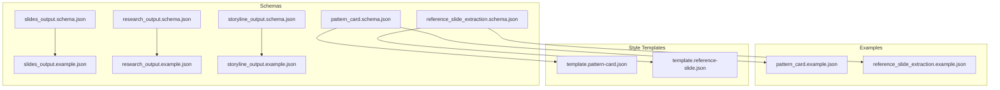
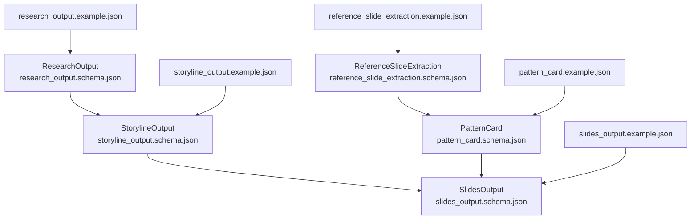
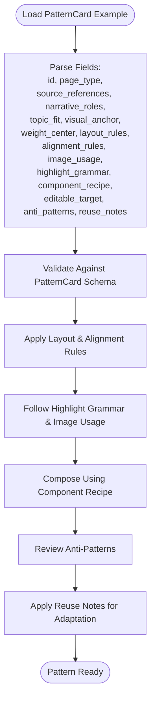
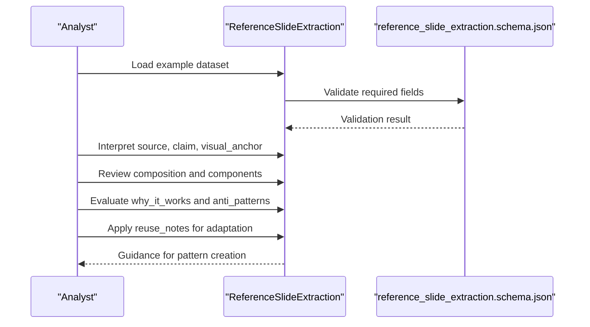
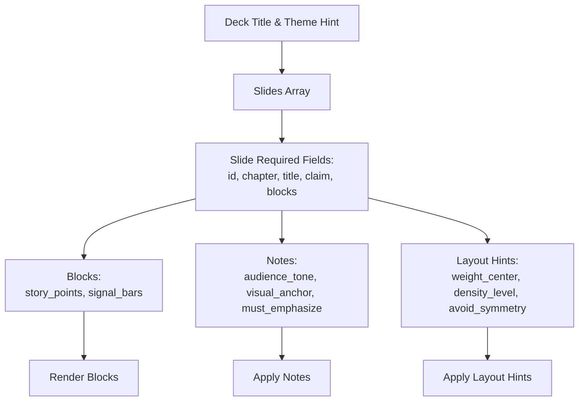
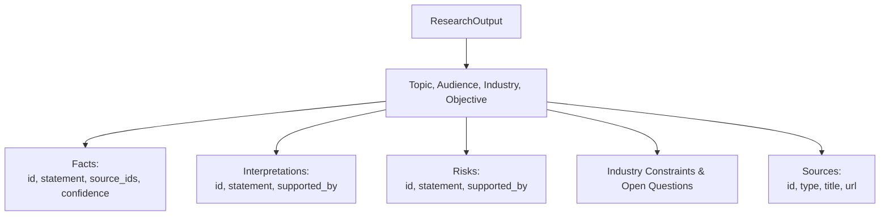
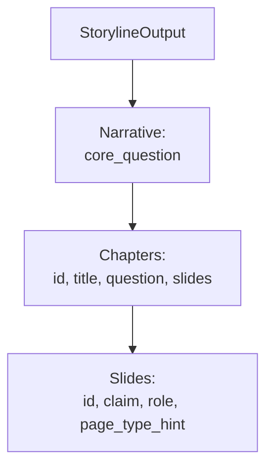
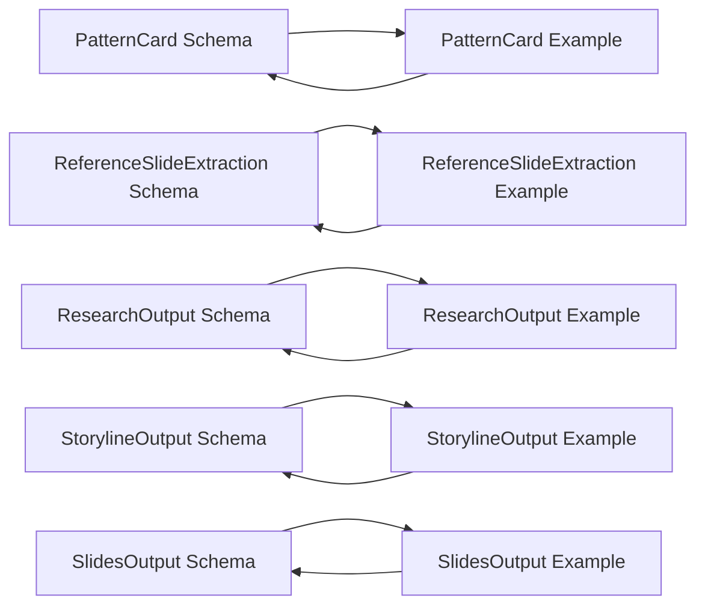

# Example Structures

<cite>
**Referenced Files in This Document**
- [README.md](file://README.md)
- [pattern_card.schema.json](file://schemas/pattern_card.schema.json)
- [reference_slide_extraction.schema.json](file://schemas/reference_slide_extraction.schema.json)
- [slides_output.schema.json](file://schemas/slides_output.schema.json)
- [research_output.schema.json](file://schemas/research_output.schema.json)
- [storyline_output.schema.json](file://schemas/storyline_output.schema.json)
- [pattern_card.example.json](file://examples/pattern_card.example.json)
- [reference_slide_extraction.example.json](file://examples/reference_slide_extraction.example.json)
- [slides_output.example.json](file://schemas/slides_output.example.json)
- [research_output.example.json](file://schemas/research_output.example.json)
- [storyline_output.example.json](file://schemas/storyline_output.example.json)
- [template.pattern-card.json](file://style/patterns/template.pattern-card.json)
- [template.reference-slide.json](file://style/reference_extractions/template.reference-slide.json)
</cite>

## Table of Contents
1. [Introduction](#introduction)
2. [Project Structure](#project-structure)
3. [Core Components](#core-components)
4. [Architecture Overview](#architecture-overview)
5. [Detailed Component Analysis](#detailed-component-analysis)
6. [Dependency Analysis](#dependency-analysis)
7. [Performance Considerations](#performance-considerations)
8. [Troubleshooting Guide](#troubleshooting-guide)
9. [Conclusion](#conclusion)
10. [Appendices](#appendices)

## Introduction
This document presents practical example data structures and usage patterns for the Enterprise PPT System schemas. It focuses on:
- PatternCard examples showing complete design pattern specifications with visual elements and styling instructions
- ReferenceSlideExtraction examples demonstrating real-world slide content structures
- Complete example datasets for SlidesOutput, ResearchOutput, and StorylineOutput schemas
- Clear explanations of how example structures relate to their corresponding schema definitions
- Step-by-step walkthroughs for interpreting and modifying example data structures for custom use cases

These materials are intended to help designers, researchers, and engineers quickly understand how to author, validate, and adapt presentation assets within the system’s schema-driven framework.

## Project Structure
The repository organizes schema definitions alongside example datasets and reusable templates. The relevant areas for this document are:
- schemas: JSON Schema definitions and example datasets for SlidesOutput, ResearchOutput, StorylineOutput, PatternCard, and ReferenceSlideExtraction
- examples: curated example instances for PatternCard and ReferenceSlideExtraction
- style: reusable templates for patterns and reference extractions

**Diagram sources**
- [pattern_card.schema.json](file://schemas/pattern_card.schema.json)
- [reference_slide_extraction.schema.json](file://schemas/reference_slide_extraction.schema.json)
- [slides_output.schema.json](file://schemas/slides_output.schema.json)
- [research_output.schema.json](file://schemas/research_output.schema.json)
- [storyline_output.schema.json](file://schemas/storyline_output.schema.json)
- [pattern_card.example.json](file://examples/pattern_card.example.json)
- [reference_slide_extraction.example.json](file://examples/reference_slide_extraction.example.json)
- [slides_output.example.json](file://schemas/slides_output.example.json)
- [research_output.example.json](file://schemas/research_output.example.json)
- [storyline_output.example.json](file://schemas/storyline_output.example.json)
- [template.pattern-card.json](file://style/patterns/template.pattern-card.json)
- [template.reference-slide.json](file://style/reference_extractions/template.reference-slide.json)

**Section sources**
- [README.md](file://README.md)

## Core Components
This section introduces the five schemas and their example datasets, highlighting key fields and relationships.

- PatternCard schema defines a reusable page-type blueprint with narrative roles, topic fit, visual anchor, layout and alignment rules, highlight grammar, component recipe, and anti-patterns.
- ReferenceSlideExtraction schema captures a real slide’s composition, components, and reuse guidance.
- SlidesOutput schema structures a deck’s slides with chapters, titles, claims, blocks, and optional notes and layout hints.
- ResearchOutput schema aggregates topic, audience, industry, objective, facts, interpretations, risks, constraints, open questions, and sources.
- StorylineOutput schema structures a narrative backbone with chapters and slide claims.

**Section sources**
- [pattern_card.schema.json](file://schemas/pattern_card.schema.json)
- [reference_slide_extraction.schema.json](file://schemas/reference_slide_extraction.schema.json)
- [slides_output.schema.json](file://schemas/slides_output.schema.json)
- [research_output.schema.json](file://schemas/research_output.schema.json)
- [storyline_output.schema.json](file://schemas/storyline_output.schema.json)

## Architecture Overview
The example structures act as contracts that feed downstream systems:
- PatternCard and ReferenceSlideExtraction inform style and page-type selection
- ResearchOutput supports story construction
- StorylineOutput guides SlidesOutput generation
- SlidesOutput drives rendering and delivery

**Diagram sources**
- [pattern_card.schema.json](file://schemas/pattern_card.schema.json)
- [reference_slide_extraction.schema.json](file://schemas/reference_slide_extraction.schema.json)
- [slides_output.schema.json](file://schemas/slides_output.schema.json)
- [research_output.schema.json](file://schemas/research_output.schema.json)
- [storyline_output.schema.json](file://schemas/storyline_output.schema.json)
- [pattern_card.example.json](file://examples/pattern_card.example.json)
- [reference_slide_extraction.example.json](file://examples/reference_slide_extraction.example.json)
- [slides_output.example.json](file://schemas/slides_output.example.json)
- [research_output.example.json](file://schemas/research_output.example.json)
- [storyline_output.example.json](file://schemas/storyline_output.example.json)

## Detailed Component Analysis

### PatternCard Example: Design Pattern Specifications
The PatternCard example demonstrates a complete design pattern specification for a “trust_terminal” page type. It includes:
- Identification and page type
- Source references and narrative roles
- Topic fit alignment
- Visual anchor and weight center
- Layout and alignment rules
- Image usage guidance
- Highlight grammar
- Component recipe
- Editable target
- Anti-patterns and reuse notes

Interpretation steps:
1. Identify the page type and its candidate narrative roles.
2. Confirm topic fit to ensure relevance to the presentation domain.
3. Use the visual anchor and weight center to guide layout decisions.
4. Apply layout and alignment rules to maintain compositional coherence.
5. Follow image usage guidance and highlight grammar for consistent visual style.
6. Compose the slide using the component recipe.
7. Avoid anti-patterns and apply reuse notes for adaptation.

**Diagram sources**
- [pattern_card.schema.json](file://schemas/pattern_card.schema.json)
- [pattern_card.example.json](file://examples/pattern_card.example.json)

**Section sources**
- [pattern_card.schema.json](file://schemas/pattern_card.schema.json)
- [pattern_card.example.json](file://examples/pattern_card.example.json)
- [template.pattern-card.json](file://style/patterns/template.pattern-card.json)

### ReferenceSlideExtraction Example: Real-World Slide Content
The ReferenceSlideExtraction example captures a real slide’s structure and intent:
- Reference identifier and source metadata
- Narrative role and page type candidate
- Audience tone and central claim
- Visual anchor and weight center
- Composition structure, density, alignment logic, asymmetry, image usage, and highlight grammar
- Component list with roles and types
- Why it works, anti-patterns, and reuse notes

Interpretation steps:
1. Extract source metadata to understand provenance and context.
2. Identify the narrative role and page type candidate.
3. Derive the claim and visual anchor.
4. Analyze composition to understand structure and density.
5. Review components to see how elements are positioned and grouped.
6. Evaluate why it works and anti-patterns to learn constraints.
7. Apply reuse notes to adapt safely.

**Diagram sources**
- [reference_slide_extraction.schema.json](file://schemas/reference_slide_extraction.schema.json)
- [reference_slide_extraction.example.json](file://examples/reference_slide_extraction.example.json)

**Section sources**
- [reference_slide_extraction.schema.json](file://schemas/reference_slide_extraction.schema.json)
- [reference_slide_extraction.example.json](file://examples/reference_slide_extraction.example.json)
- [template.reference-slide.json](file://style/reference_extractions/template.reference-slide.json)

### SlidesOutput Example: Slide Deck Structure
The SlidesOutput example shows a deck with a cover slide containing structured blocks and notes:
- Deck title and theme hint
- Slide array with identifiers, chapters, titles, subtitles, and claims
- Blocks object with story points and signal bars
- Notes with audience tone, visual anchor, and emphasis items
- Optional layout hints

Interpretation steps:
1. Confirm deck title and theme hint.
2. Iterate slides and verify required fields per schema.
3. Inspect blocks for story points and signal bars.
4. Review notes for audience tone and emphasis.
5. Use layout hints to inform rendering.

**Diagram sources**
- [slides_output.schema.json](file://schemas/slides_output.schema.json)
- [slides_output.example.json](file://schemas/slides_output.example.json)

**Section sources**
- [slides_output.schema.json](file://schemas/slides_output.schema.json)
- [slides_output.example.json](file://schemas/slides_output.example.json)

### ResearchOutput Example: Research Dataset
The ResearchOutput example consolidates topic, audience, industry, objective, facts, interpretations, risks, constraints, open questions, and sources:
- Topic, audience, industry, objective
- Facts with confidence and source references
- Interpretations and risks with supporting references
- Industry constraints and open questions
- Sources with identifiers and types

Interpretation steps:
1. Verify topic, audience, industry, and objective.
2. Validate facts with confidence and source_ids.
3. Review interpretations and risks with supported_by references.
4. Assess industry constraints and open questions.
5. Confirm sources with ids, types, and titles.

**Diagram sources**
- [research_output.schema.json](file://schemas/research_output.schema.json)
- [research_output.example.json](file://schemas/research_output.example.json)

**Section sources**
- [research_output.schema.json](file://schemas/research_output.schema.json)
- [research_output.example.json](file://schemas/research_output.example.json)

### StorylineOutput Example: Narrative Backbone
The StorylineOutput example structures a narrative with a core question and chapters, each containing slides with claims and roles:
- Deck title and audience
- Narrative core question
- Chapters with titles and questions
- Slides with ids, claims, roles, and optional page_type_hint

Interpretation steps:
1. Confirm deck title and audience.
2. Understand the core question driving the narrative.
3. Review chapters and their slide collections.
4. Validate slide claims and roles.
5. Use page_type_hint to guide rendering choices.

**Diagram sources**
- [storyline_output.schema.json](file://schemas/storyline_output.schema.json)
- [storyline_output.example.json](file://schemas/storyline_output.example.json)

**Section sources**
- [storyline_output.schema.json](file://schemas/storyline_output.schema.json)
- [storyline_output.example.json](file://schemas/storyline_output.example.json)

## Dependency Analysis
The schemas define the contracts that examples must satisfy. Examples serve as concrete instances that demonstrate:
- How to populate required fields
- How to structure nested objects
- How to apply rules and guidance from higher-level schemas

**Diagram sources**
- [pattern_card.schema.json](file://schemas/pattern_card.schema.json)
- [reference_slide_extraction.schema.json](file://schemas/reference_slide_extraction.schema.json)
- [research_output.schema.json](file://schemas/research_output.schema.json)
- [storyline_output.schema.json](file://schemas/storyline_output.schema.json)
- [slides_output.schema.json](file://schemas/slides_output.schema.json)
- [pattern_card.example.json](file://examples/pattern_card.example.json)
- [reference_slide_extraction.example.json](file://examples/reference_slide_extraction.example.json)
- [research_output.example.json](file://schemas/research_output.example.json)
- [storyline_output.example.json](file://schemas/storyline_output.example.json)
- [slides_output.example.json](file://schemas/slides_output.example.json)

**Section sources**
- [pattern_card.schema.json](file://schemas/pattern_card.schema.json)
- [reference_slide_extraction.schema.json](file://schemas/reference_slide_extraction.schema.json)
- [slides_output.schema.json](file://schemas/slides_output.schema.json)
- [research_output.schema.json](file://schemas/research_output.schema.json)
- [storyline_output.schema.json](file://schemas/storyline_output.schema.json)

## Performance Considerations
- Keep examples minimal and focused to reduce validation overhead during development.
- Prefer arrays of concise strings for lists (e.g., topic_fit, narrative_roles) to improve readability and maintainability.
- Use enums for constrained fields (e.g., density_level, confidence) to simplify validation and prevent typos.
- Separate concerns by keeping narrative, composition, and reuse guidance distinct to enable targeted updates.

## Troubleshooting Guide
Common issues and resolutions:
- Missing required fields: Ensure all required keys from the schema are present in the example.
- Type mismatches: Confirm field types (strings, integers, booleans, arrays) match schema definitions.
- Enum violations: Use allowed values for enumerated fields.
- Nested object validation: Validate nested objects (e.g., source, composition, notes) against their schema properties.
- Example-to-schema alignment: Compare example fields to schema property definitions to identify discrepancies.

Validation checklist:
- Required arrays are non-empty where specified
- Strings meet minimum length requirements
- Enums use allowed values
- Nested objects conform to additionalProperties and required constraints

**Section sources**
- [pattern_card.schema.json](file://schemas/pattern_card.schema.json)
- [reference_slide_extraction.schema.json](file://schemas/reference_slide_extraction.schema.json)
- [slides_output.schema.json](file://schemas/slides_output.schema.json)
- [research_output.schema.json](file://schemas/research_output.schema.json)
- [storyline_output.schema.json](file://schemas/storyline_output.schema.json)

## Conclusion
The example structures and schemas provide a robust foundation for building, validating, and adapting presentation assets. By following the interpretation and modification steps outlined here, teams can consistently produce high-quality decks that adhere to the system’s design principles and style guidelines.

## Appendices

### Appendix A: Relationship Between Examples and Schemas
- PatternCard example maps to PatternCard schema fields for page-type design guidance
- ReferenceSlideExtraction example maps to ReferenceSlideExtraction schema fields for slide analysis and reuse
- SlidesOutput example maps to SlidesOutput schema fields for deck structure
- ResearchOutput example maps to ResearchOutput schema fields for research synthesis
- StorylineOutput example maps to StorylineOutput schema fields for narrative backbone

**Section sources**
- [pattern_card.schema.json](file://schemas/pattern_card.schema.json)
- [reference_slide_extraction.schema.json](file://schemas/reference_slide_extraction.schema.json)
- [slides_output.schema.json](file://schemas/slides_output.schema.json)
- [research_output.schema.json](file://schemas/research_output.schema.json)
- [storyline_output.schema.json](file://schemas/storyline_output.schema.json)
- [pattern_card.example.json](file://examples/pattern_card.example.json)
- [reference_slide_extraction.example.json](file://examples/reference_slide_extraction.example.json)
- [slides_output.example.json](file://schemas/slides_output.example.json)
- [research_output.example.json](file://schemas/research_output.example.json)
- [storyline_output.example.json](file://schemas/storyline_output.example.json)