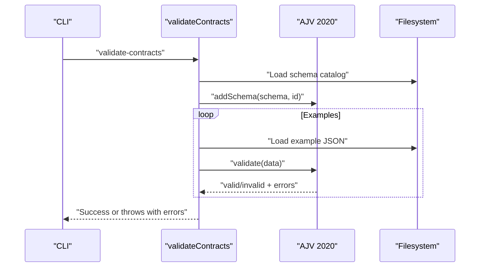
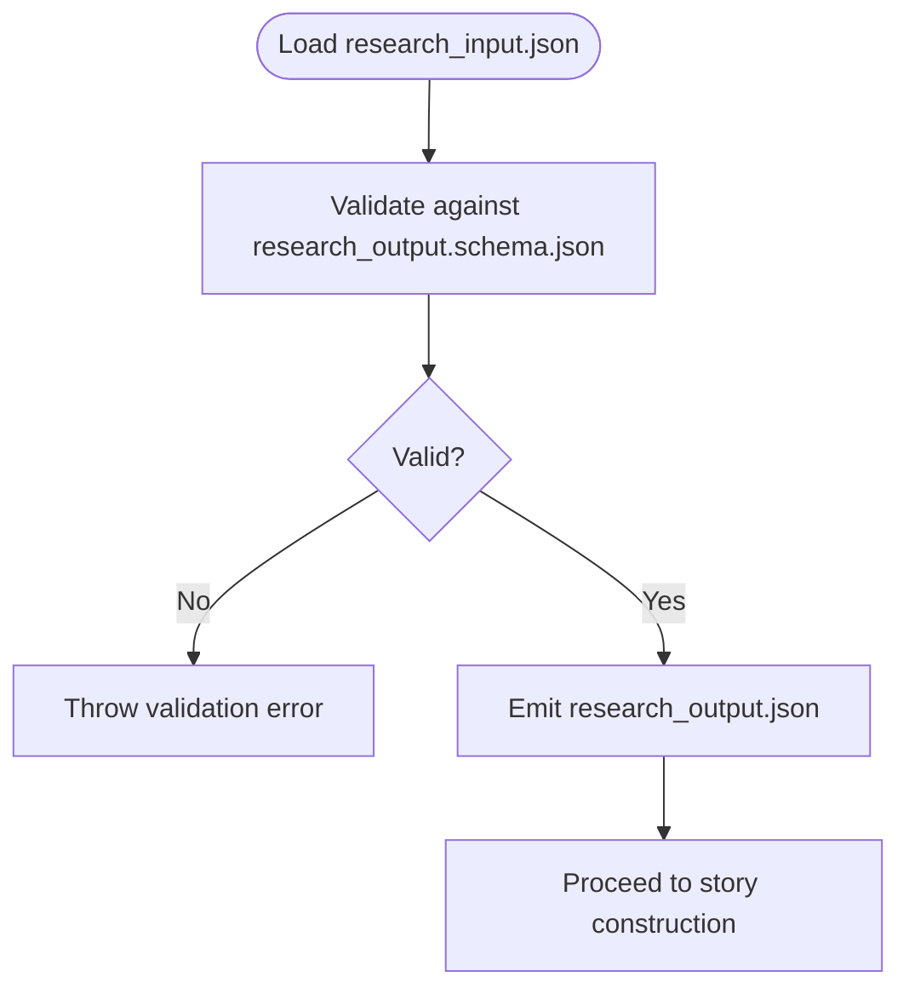
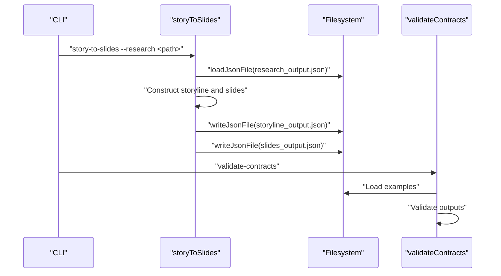
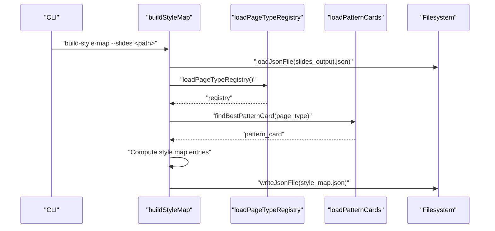
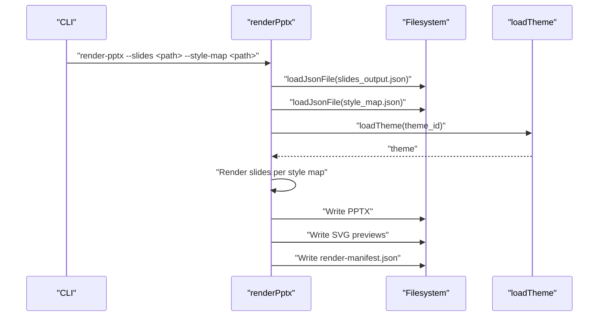
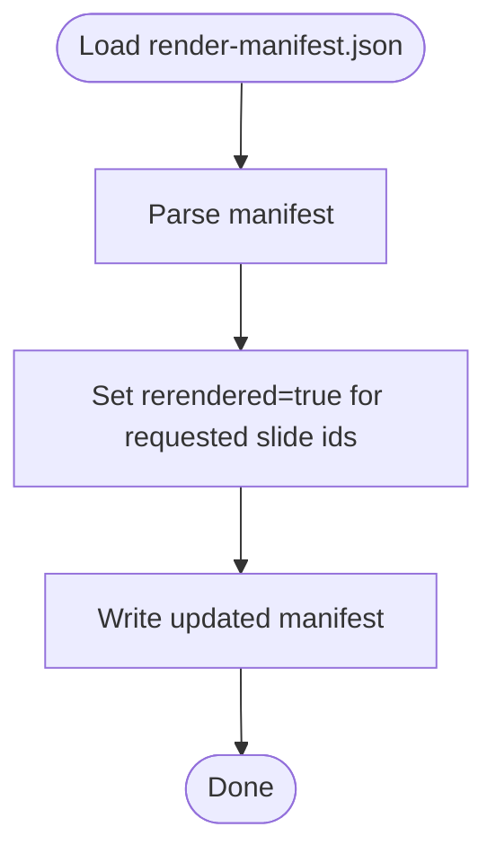
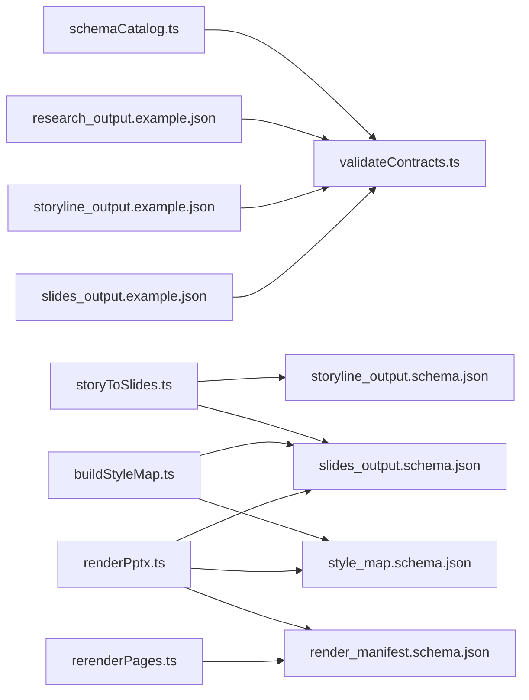
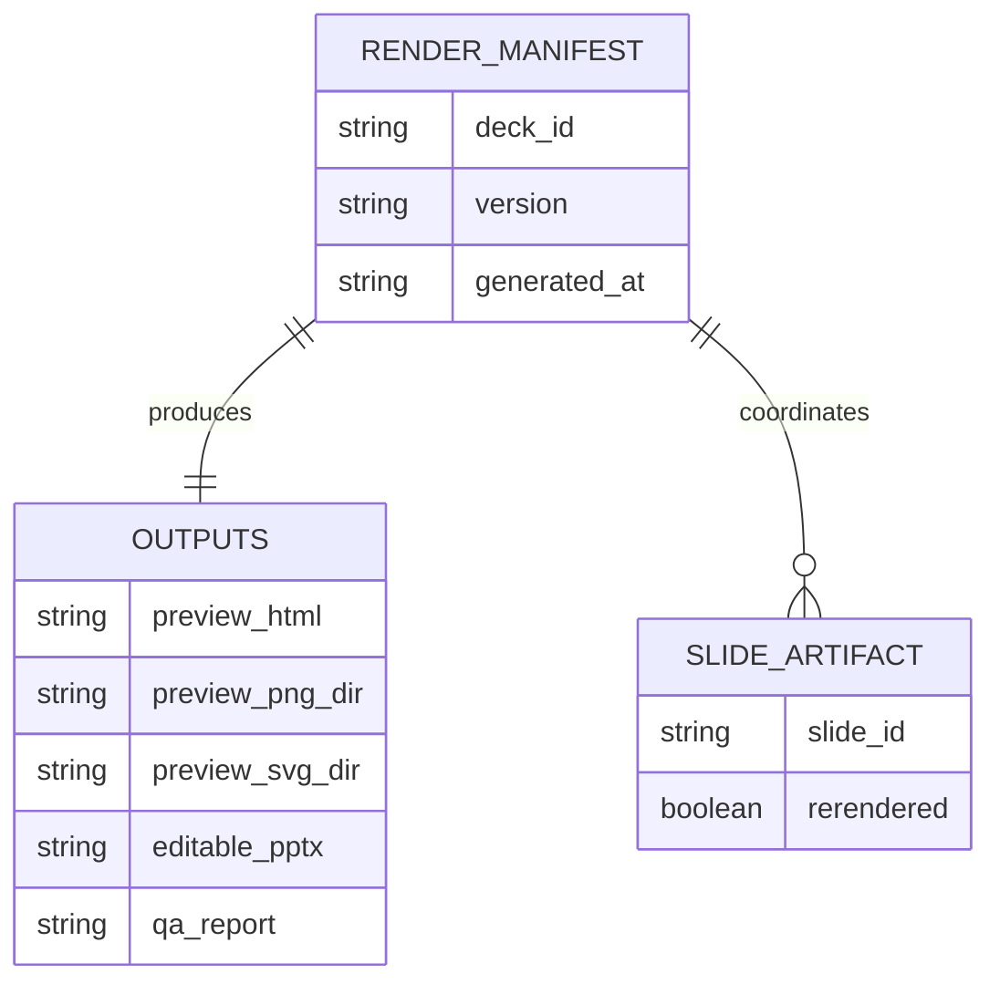

# Integration Patterns

<cite>
**Referenced Files in This Document**
- [render_manifest.schema.json](file://schemas/render_manifest.schema.json)
- [research_output.schema.json](file://schemas/research_output.schema.json)
- [storyline_output.schema.json](file://schemas/storyline_output.schema.json)
- [slides_output.schema.json](file://schemas/slides_output.schema.json)
- [style_map.schema.json](file://schemas/style_map.schema.json)
- [cli.ts](file://src/cli.ts)
- [schemaCatalog.ts](file://src/lib/schemaCatalog.ts)
- [validateContracts.ts](file://src/commands/validateContracts.ts)
- [json.ts](file://src/lib/json.ts)
- [storyToSlides.ts](file://src/commands/storyToSlides.ts)
- [buildStyleMap.ts](file://src/commands/buildStyleMap.ts)
- [renderPptx.ts](file://src/commands/renderPptx.ts)
- [rerenderPages.ts](file://src/commands/rerenderPages.ts)
- [research_output.example.json](file://schemas/research_output.example.json)
- [storyline_output.example.json](file://schemas/storyline_output.example.json)
- [slides_output.example.json](file://schemas/slides_output.example.json)
- [loadPageTypeRegistry.ts](file://src/lib/style/loadPageTypeRegistry.ts)
- [loadPatternCards.ts](file://src/lib/style/loadPatternCards.ts)
</cite>

## Table of Contents
1. [Introduction](#introduction)
2. [Project Structure](#project-structure)
3. [Core Components](#core-components)
4. [Architecture Overview](#architecture-overview)
5. [Detailed Component Analysis](#detailed-component-analysis)
6. [Dependency Analysis](#dependency-analysis)
7. [Performance Considerations](#performance-considerations)
8. [Troubleshooting Guide](#troubleshooting-guide)
9. [Conclusion](#conclusion)
10. [Appendices](#appendices)

## Introduction
This document explains how schema validation integrates with the Enterprise PPT Pipeline across four major stages: research processing, story construction, style mapping, and rendering. It details how schemas are used to enforce data consistency, coordinate outputs, and propagate errors. It also documents the render manifest schema and provides guidance for evolving schemas while maintaining backward compatibility.

## Project Structure
The pipeline is organized around schema-driven artifacts and CLI-driven stages:
- Schemas define the contract for each stage’s inputs and outputs.
- CLI commands orchestrate data movement and validation.
- Stage-specific commands transform data between schema-compliant artifacts.

```mermaid
graph TB
subgraph "CLI"
CLI["src/cli.ts"]
end
subgraph "Validation"
VC["src/commands/validateContracts.ts"]
SC["src/lib/schemaCatalog.ts"]
end
subgraph "Research"
RSO["schemas/research_output.schema.json"]
RE["schemas/research_output.example.json"]
end
subgraph "Story"
STY["schemas/storyline_output.schema.json"]
STE["schemas/storyline_output.example.json"]
end
subgraph "Slides"
SLO["schemas/slides_output.schema.json"]
SLE["schemas/slides_output.example.json"]
end
subgraph "Style"
SM["schemas/style_map.schema.json"]
end
subgraph "Render"
RM["schemas/render_manifest.schema.json"]
end
CLI --> VC
VC --> SC
VC --> RE
VC --> STE
VC --> SLE
CLI --> ST["src/commands/storyToSlides.ts"]
ST --> STY
ST --> SLO
CLI --> BM["src/commands/buildStyleMap.ts"]
BM --> SLO
BM --> SM
CLI --> RP["src/commands/renderPptx.ts"]
RP --> SLO
RP --> SM
RP --> RM
CLI --> RR["src/commands/rerenderPages.ts"]
RR --> RM
```

**Diagram sources**
- [cli.ts:1-57](file://src/cli.ts#L1-L57)
- [validateContracts.ts:1-100](file://src/commands/validateContracts.ts#L1-L100)
- [schemaCatalog.ts:1-24](file://src/lib/schemaCatalog.ts#L1-L24)
- [research_output.schema.json:1-88](file://schemas/research_output.schema.json#L1-L88)
- [research_output.example.json:1-45](file://schemas/research_output.example.json#L1-L45)
- [storyline_output.schema.json:1-49](file://schemas/storyline_output.schema.json#L1-L49)
- [storyline_output.example.json:1-23](file://schemas/storyline_output.example.json#L1-L23)
- [slides_output.schema.json:1-53](file://schemas/slides_output.schema.json#L1-L53)
- [slides_output.example.json:1-31](file://schemas/slides_output.example.json#L1-L31)
- [style_map.schema.json:1-70](file://schemas/style_map.schema.json#L1-L70)
- [render_manifest.schema.json:1-38](file://schemas/render_manifest.schema.json#L1-L38)
- [storyToSlides.ts:1-166](file://src/commands/storyToSlides.ts#L1-L166)
- [buildStyleMap.ts:1-110](file://src/commands/buildStyleMap.ts#L1-L110)
- [renderPptx.ts:1-1019](file://src/commands/renderPptx.ts#L1-L1019)
- [rerenderPages.ts:1-40](file://src/commands/rerenderPages.ts#L1-L40)

**Section sources**
- [cli.ts:1-57](file://src/cli.ts#L1-L57)
- [validateContracts.ts:1-100](file://src/commands/validateContracts.ts#L1-L100)
- [schemaCatalog.ts:1-24](file://src/lib/schemaCatalog.ts#L1-L24)

## Core Components
- Schema Catalog: Loads all schema definitions from the schemas directory for centralized validation.
- Validation Command: Builds an AJV 2020 validator, registers schemas, and validates example datasets.
- Stage Commands:
  - Story construction transforms research outputs into storyline and slides scaffolds.
  - Style mapping consumes slides to produce a style map aligned with page types and pattern cards.
  - Rendering consumes slides and style map to produce PPTX, SVG previews, and a render manifest.
  - Rerender marking updates the render manifest to request reprocessing of specific slides.

Key integration points:
- All stage outputs conform to their respective schemas.
- Validation ensures correctness before downstream stages.
- Render manifest coordinates outputs and rerender requests.

**Section sources**
- [schemaCatalog.ts:12-24](file://src/lib/schemaCatalog.ts#L12-L24)
- [validateContracts.ts:7-100](file://src/commands/validateContracts.ts#L7-L100)
- [storyToSlides.ts:12-166](file://src/commands/storyToSlides.ts#L12-L166)
- [buildStyleMap.ts:50-110](file://src/commands/buildStyleMap.ts#L50-L110)
- [renderPptx.ts:83-191](file://src/commands/renderPptx.ts#L83-L191)
- [rerenderPages.ts:15-40](file://src/commands/rerenderPages.ts#L15-L40)

## Architecture Overview
The pipeline enforces schema-based contracts at each stage. Validation runs against curated examples to guarantee schema compliance. Downstream stages consume validated outputs and produce new artifacts that adhere to their own schemas. The render manifest centralizes output locations and rerender metadata.



**Diagram sources**
- [cli.ts:39-50](file://src/cli.ts#L39-L50)
- [validateContracts.ts:7-100](file://src/commands/validateContracts.ts#L7-L100)
- [schemaCatalog.ts:12-24](file://src/lib/schemaCatalog.ts#L12-L24)
- [json.ts:4-14](file://src/lib/json.ts#L4-L14)

## Detailed Component Analysis

### Research Processing
- Purpose: Transform raw research inputs into a structured research output artifact.
- Schema: research_output.schema.json defines required fields and nested arrays with strict typing.
- Validation: validateContracts loads research_output.example.json and ensures it conforms to the schema.
- Error propagation: Missing keys, wrong types, or invalid enums cause immediate failure with detailed messages.



**Diagram sources**
- [research_output.schema.json:1-88](file://schemas/research_output.schema.json#L1-L88)
- [validateContracts.ts:26-98](file://src/commands/validateContracts.ts#L26-L98)
- [research_output.example.json:1-45](file://schemas/research_output.example.json#L1-L45)

**Section sources**
- [research_output.schema.json:1-88](file://schemas/research_output.schema.json#L1-L88)
- [validateContracts.ts:26-98](file://src/commands/validateContracts.ts#L26-L98)
- [research_output.example.json:1-45](file://schemas/research_output.example.json#L1-L45)

### Story Construction
- Purpose: Build a narrative structure and initial slide set from research output.
- Inputs: research_output.json (validated).
- Outputs: storyline_output.json and slides_output.json.
- Validation: validateContracts checks storyline_output.example.json and slides_output.example.json.
- Error propagation: Missing required fields or incorrect nesting triggers failures early in the pipeline.



**Diagram sources**
- [cli.ts:46-46](file://src/cli.ts#L46-L46)
- [storyToSlides.ts:12-166](file://src/commands/storyToSlides.ts#L12-L166)
- [validateContracts.ts:31-38](file://src/commands/validateContracts.ts#L31-L38)
- [storyline_output.example.json:1-23](file://schemas/storyline_output.example.json#L1-L23)
- [slides_output.example.json:1-31](file://schemas/slides_output.example.json#L1-L31)

**Section sources**
- [storyToSlides.ts:12-166](file://src/commands/storyToSlides.ts#L12-L166)
- [storyline_output.schema.json:1-49](file://schemas/storyline_output.schema.json#L1-L49)
- [slides_output.schema.json:1-53](file://schemas/slides_output.schema.json#L1-L53)
- [validateContracts.ts:31-38](file://src/commands/validateContracts.ts#L31-L38)

### Style Mapping
- Purpose: Produce a style map that binds slides to page types, visual anchors, and learned patterns.
- Inputs: slides_output.json (validated), page-type registry, and pattern cards.
- Output: style_map.json.
- Validation: validateContracts checks pattern cards and reference slide extractions; style_map.json is defined by style_map.schema.json.
- Error propagation: Missing page types, slide IDs, or mismatched counts cause failures.



**Diagram sources**
- [cli.ts:45-45](file://src/cli.ts#L45-L45)
- [buildStyleMap.ts:50-110](file://src/commands/buildStyleMap.ts#L50-L110)
- [loadPageTypeRegistry.ts:18-21](file://src/lib/style/loadPageTypeRegistry.ts#L18-L21)
- [loadPatternCards.ts:39-49](file://src/lib/style/loadPatternCards.ts#L39-L49)
- [style_map.schema.json:1-70](file://schemas/style_map.schema.json#L1-L70)

**Section sources**
- [buildStyleMap.ts:50-110](file://src/commands/buildStyleMap.ts#L50-L110)
- [loadPageTypeRegistry.ts:18-21](file://src/lib/style/loadPageTypeRegistry.ts#L18-L21)
- [loadPatternCards.ts:29-49](file://src/lib/style/loadPatternCards.ts#L29-L49)
- [style_map.schema.json:1-70](file://schemas/style_map.schema.json#L1-L70)

### Rendering Phase
- Purpose: Generate editable PPTX, SVG previews, and update the render manifest.
- Inputs: slides_output.json, style_map.json, theme.
- Outputs: PPTX, SVG previews, render-manifest.json.
- Validation: render_manifest.schema.json defines the manifest structure; renderPptx writes it after successful rendering.
- Error propagation: Mismatched slide counts, missing styles, or invalid page types trigger errors.



**Diagram sources**
- [cli.ts:47-47](file://src/cli.ts#L47-L47)
- [renderPptx.ts:83-191](file://src/commands/renderPptx.ts#L83-L191)
- [render_manifest.schema.json:1-38](file://schemas/render_manifest.schema.json#L1-L38)

**Section sources**
- [renderPptx.ts:83-191](file://src/commands/renderPptx.ts#L83-L191)
- [render_manifest.schema.json:1-38](file://schemas/render_manifest.schema.json#L1-L38)

### Rerender Coordination
- Purpose: Mark specific slides for rerender by updating the render manifest.
- Input: render-manifest.json.
- Behavior: Updates slide_artifacts.rerendered flags and refreshes generated_at.



**Diagram sources**
- [rerenderPages.ts:15-40](file://src/commands/rerenderPages.ts#L15-L40)
- [render_manifest.schema.json:23-36](file://schemas/render_manifest.schema.json#L23-L36)

**Section sources**
- [rerenderPages.ts:15-40](file://src/commands/rerenderPages.ts#L15-L40)
- [render_manifest.schema.json:23-36](file://schemas/render_manifest.schema.json#L23-L36)

## Dependency Analysis
- Validation depends on schemaCatalog to register all schemas and on example datasets to test them.
- Story construction depends on research_output.json being valid before writing outputs.
- Style mapping depends on slides_output.json, page-type registry, and pattern cards.
- Rendering depends on slides_output.json and style_map.json; it produces render-manifest.json.
- Rerender relies on render-manifest.json to track slide artifacts.



**Diagram sources**
- [schemaCatalog.ts:12-24](file://src/lib/schemaCatalog.ts#L12-L24)
- [validateContracts.ts:26-98](file://src/commands/validateContracts.ts#L26-L98)
- [storyToSlides.ts:12-166](file://src/commands/storyToSlides.ts#L12-L166)
- [buildStyleMap.ts:50-110](file://src/commands/buildStyleMap.ts#L50-L110)
- [renderPptx.ts:83-191](file://src/commands/renderPptx.ts#L83-L191)
- [rerenderPages.ts:15-40](file://src/commands/rerenderPages.ts#L15-L40)

**Section sources**
- [validateContracts.ts:26-98](file://src/commands/validateContracts.ts#L26-L98)
- [storyToSlides.ts:12-166](file://src/commands/storyToSlides.ts#L12-L166)
- [buildStyleMap.ts:50-110](file://src/commands/buildStyleMap.ts#L50-L110)
- [renderPptx.ts:83-191](file://src/commands/renderPptx.ts#L83-L191)
- [rerenderPages.ts:15-40](file://src/commands/rerenderPages.ts#L15-L40)

## Performance Considerations
- Centralized schema loading avoids repeated disk reads during validation.
- Parallelization opportunities exist in pattern card discovery and slide rendering steps.
- Minimizing filesystem writes by batching manifest updates improves throughput.

## Troubleshooting Guide
Common issues and resolutions:
- Validation failures:
  - Cause: Missing required fields, wrong types, or enum violations.
  - Action: Inspect the specific error messages and align data with the relevant schema.
- Mismatched slide counts:
  - Cause: slides_output.json and style_map.json have different slide counts.
  - Action: Re-run style mapping after correcting slides_output.json.
- Unknown page types:
  - Cause: page_type missing or not present in the registry.
  - Action: Add or correct page_type in slides_output.json and ensure registry includes it.
- Missing style entries:
  - Cause: render-pptx cannot find a style map entry for a slide ID.
  - Action: Regenerate style map and ensure IDs match between slides and style map.

**Section sources**
- [validateContracts.ts:85-98](file://src/commands/validateContracts.ts#L85-L98)
- [buildStyleMap.ts:63-74](file://src/commands/buildStyleMap.ts#L63-L74)
- [renderPptx.ts:111-133](file://src/commands/renderPptx.ts#L111-L133)

## Conclusion
Schema validation is the backbone of the Enterprise PPT Pipeline. By enforcing contracts at each stage, the system ensures data consistency, predictable transformations, and robust error propagation. The render manifest provides a single source of truth for outputs and rerender coordination. Extending schemas and evolving the pipeline should preserve backward compatibility through careful schema versioning and migration strategies.

## Appendices

### Render Manifest Schema Reference
The render manifest coordinates outputs and rerender metadata:
- Required fields: deck_id, version, generated_at, outputs.
- Outputs: paths for editable_pptx, preview_svg_dir, preview_html, and optional preview_png_dir/qa_report.
- Slide artifacts: per-slide markers indicating rerender status.



**Diagram sources**
- [render_manifest.schema.json:8-36](file://schemas/render_manifest.schema.json#L8-L36)

**Section sources**
- [render_manifest.schema.json:1-38](file://schemas/render_manifest.schema.json#L1-L38)

### Extending Schemas and Maintaining Backward Compatibility
Guidance:
- Version schemas using $id and maintain a registry of supported versions.
- Add new fields as optional with defaults to keep existing consumers happy.
- Use additionalProperties cautiously; enable it only when explicitly documented.
- Keep required fields minimal and evolve them via deprecation cycles.
- Update validateContracts to include new examples and ensure coverage.

[No sources needed since this section provides general guidance]