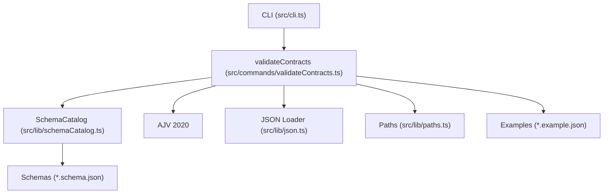
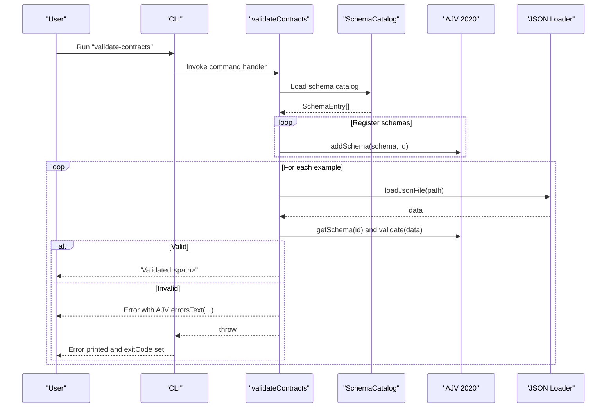
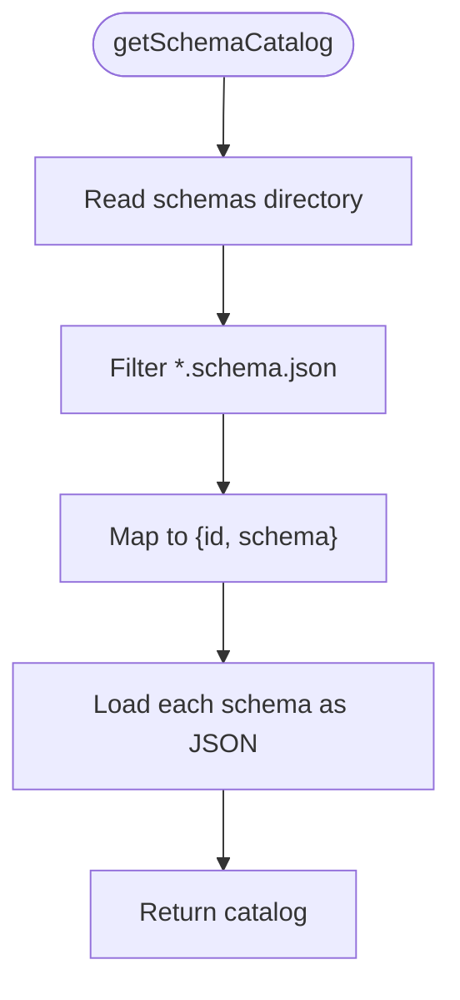
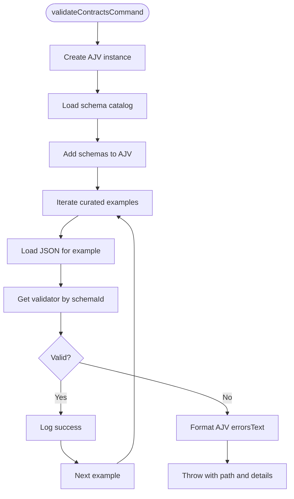
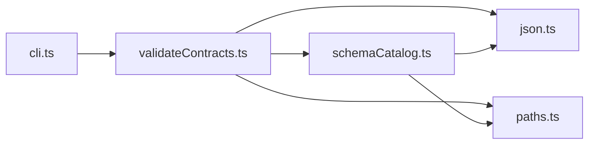

# Validation System

<cite>
**Referenced Files in This Document**
- [schemaCatalog.ts](file://src/lib/schemaCatalog.ts)
- [validateContracts.ts](file://src/commands/validateContracts.ts)
- [json.ts](file://src/lib/json.ts)
- [paths.ts](file://src/lib/paths.ts)
- [cli.ts](file://src/cli.ts)
- [research_output.schema.json](file://schemas/research_output.schema.json)
- [slides_output.schema.json](file://schemas/slides_output.schema.json)
- [storyline_output.schema.json](file://schemas/storyline_output.schema.json)
- [pattern_card.schema.json](file://schemas/pattern_card.schema.json)
- [research_output.example.json](file://schemas/research_output.example.json)
- [slides_output.example.json](file://schemas/slides_output.example.json)
- [reference_slide_extraction.example.json](file://examples/reference_slide_extraction.example.json)
</cite>

## Table of Contents
1. [Introduction](#introduction)
2. [Project Structure](#project-structure)
3. [Core Components](#core-components)
4. [Architecture Overview](#architecture-overview)
5. [Detailed Component Analysis](#detailed-component-analysis)
6. [Dependency Analysis](#dependency-analysis)
7. [Performance Considerations](#performance-considerations)
8. [Troubleshooting Guide](#troubleshooting-guide)
9. [Conclusion](#conclusion)

## Introduction
This document explains the schema validation system that enforces data integrity across the Enterprise PPT Pipeline. It focuses on:
- Centralized schema management via the SchemaCatalog
- Orchestration of validation through the validateContracts command
- Error handling, failure reporting, and debugging strategies
- Integration with pipeline execution and user feedback

The system leverages JSON Schemas and AJV 2020 to validate representative example datasets and pipeline outputs, ensuring consistent contracts across modules.

## Project Structure
The validation system spans three primary areas:
- CLI entry point dispatches commands
- Command orchestrates validation using AJV and the SchemaCatalog
- SchemaCatalog loads schemas from disk and exposes them to the validator
- Utility libraries provide JSON loading and path resolution
- Example datasets and schemas under schemas/ and examples/

**Diagram sources**
- [cli.ts:19-37](file://src/cli.ts#L19-L37)
- [validateContracts.ts:7-24](file://src/commands/validateContracts.ts#L7-L24)
- [schemaCatalog.ts:12-23](file://src/lib/schemaCatalog.ts#L12-L23)
- [json.ts:4-7](file://src/lib/json.ts#L4-L7)
- [paths.ts:9-11](file://src/lib/paths.ts#L9-L11)

**Section sources**
- [cli.ts:10-17](file://src/cli.ts#L10-L17)
- [validateContracts.ts:15-24](file://src/commands/validateContracts.ts#L15-L24)
- [schemaCatalog.ts:12-23](file://src/lib/schemaCatalog.ts#L12-L23)
- [json.ts:4-7](file://src/lib/json.ts#L4-L7)
- [paths.ts:9-11](file://src/lib/paths.ts#L9-L11)

## Core Components
- SchemaCatalog: Scans the schemas directory and loads all .schema.json files into memory, returning a catalog of schema entries keyed by filename.
- validateContracts command: Initializes AJV 2020, registers all loaded schemas, then validates curated example datasets against their respective schemas. It stops on the first failure and prints detailed error messages.
- JSON utilities: Provides safe loading and writing helpers used by the command and catalog.
- Paths utilities: Resolves absolute paths relative to the repository root for deterministic file discovery.
- CLI: Exposes the validate-contracts command and handles global error reporting.

Key behaviors:
- Centralized schema registration ensures all schemas are available under their filenames.
- Validation runs against curated examples across research, storyline, slides, pattern cards, and reference slide extraction domains.
- Failure mode: Throws immediately upon encountering invalid data, printing a human-readable summary of AJV errors.

**Section sources**
- [schemaCatalog.ts:12-23](file://src/lib/schemaCatalog.ts#L12-L23)
- [validateContracts.ts:7-24](file://src/commands/validateContracts.ts#L7-L24)
- [validateContracts.ts:85-99](file://src/commands/validateContracts.ts#L85-L99)
- [json.ts:4-7](file://src/lib/json.ts#L4-L7)
- [paths.ts:9-11](file://src/lib/paths.ts#L9-L11)
- [cli.ts:10-17](file://src/cli.ts#L10-L17)

## Architecture Overview
The validation pipeline is a thin orchestration layer around AJV:
- CLI parses arguments and invokes validateContracts
- validateContracts builds an AJV instance and registers schemas from SchemaCatalog
- For each example, it loads JSON, runs validation, and either logs success or throws with detailed errors

**Diagram sources**
- [cli.ts:19-37](file://src/cli.ts#L19-L37)
- [validateContracts.ts:7-24](file://src/commands/validateContracts.ts#L7-L24)
- [validateContracts.ts:85-99](file://src/commands/validateContracts.ts#L85-L99)
- [schemaCatalog.ts:12-23](file://src/lib/schemaCatalog.ts#L12-L23)
- [json.ts:4-7](file://src/lib/json.ts#L4-L7)

## Detailed Component Analysis

### SchemaCatalog
Responsibilities:
- Enumerate .schema.json files in the schemas directory
- Load each schema as JSON
- Return a typed catalog array of { id, schema }

Design notes:
- Uses asynchronous filesystem operations and path utilities
- Filters by extension to avoid non-schema files
- Returns entries keyed by filename, aligning with AJV’s schema ID usage

**Diagram sources**
- [schemaCatalog.ts:12-23](file://src/lib/schemaCatalog.ts#L12-L23)

**Section sources**
- [schemaCatalog.ts:12-23](file://src/lib/schemaCatalog.ts#L12-L23)

### validateContracts Command
Responsibilities:
- Initialize AJV 2020 with options enabling full error collection and relaxed strictness
- Build a catalog of schemas and register them with AJV
- Iterate curated examples, load JSON, validate, and report results
- Fail fast on first validation failure with a detailed error message

Processing logic:
- Schema registration: addSchema(schema, id) for each SchemaEntry
- Example validation: getSchema(id), load data, run validator, collect errors via errorsText
- Error handling: throw on missing validator or validation failure

**Diagram sources**
- [validateContracts.ts:7-24](file://src/commands/validateContracts.ts#L7-L24)
- [validateContracts.ts:85-99](file://src/commands/validateContracts.ts#L85-L99)

**Section sources**
- [validateContracts.ts:7-24](file://src/commands/validateContracts.ts#L7-L24)
- [validateContracts.ts:85-99](file://src/commands/validateContracts.ts#L85-L99)

### JSON Utilities
Responsibilities:
- Safe loading of JSON files with UTF-8 decoding and parsing
- Ensures directories exist before writing JSON artifacts

Usage:
- Used by validateContracts to load example datasets
- Used by SchemaCatalog to load schemas

**Section sources**
- [json.ts:4-7](file://src/lib/json.ts#L4-L7)

### Paths Utilities
Responsibilities:
- Resolve repository-relative paths for deterministic file discovery
- Provide helpers to parse CLI arguments

Usage:
- validateContracts composes paths to locate examples and schemas
- SchemaCatalog resolves the schemas directory

**Section sources**
- [paths.ts:9-11](file://src/lib/paths.ts#L9-L11)

### CLI Integration
Responsibilities:
- Dispatch validate-contracts to its handler
- Print help and handle unknown commands
- Global error handler prints error messages and sets exit code

Behavior:
- On command success, exits cleanly
- On error, prints message and sets non-zero exit code

**Section sources**
- [cli.ts:10-17](file://src/cli.ts#L10-L17)
- [cli.ts:39-56](file://src/cli.ts#L39-L56)

## Dependency Analysis
High-level dependencies:
- validateContracts depends on SchemaCatalog, JSON loader, and paths
- SchemaCatalog depends on paths and JSON loader
- CLI depends on command handlers
- AJV is a third-party dependency managed by the project

**Diagram sources**
- [cli.ts:10-17](file://src/cli.ts#L10-L17)
- [validateContracts.ts:3-5](file://src/commands/validateContracts.ts#L3-L5)
- [schemaCatalog.ts:1-5](file://src/lib/schemaCatalog.ts#L1-L5)
- [json.ts:1-7](file://src/lib/json.ts#L1-L7)
- [paths.ts:1-11](file://src/lib/paths.ts#L1-L11)

**Section sources**
- [cli.ts:10-17](file://src/cli.ts#L10-L17)
- [validateContracts.ts:3-5](file://src/commands/validateContracts.ts#L3-L5)
- [schemaCatalog.ts:1-5](file://src/lib/schemaCatalog.ts#L1-L5)
- [json.ts:1-7](file://src/lib/json.ts#L1-L7)
- [paths.ts:1-11](file://src/lib/paths.ts#L1-L11)

## Performance Considerations
- Schema loading cost: O(N) over the number of schemas; minimal overhead given typical counts.
- Validation cost: O(M) per example where M is the size of the dataset; AJV collects all errors for diagnostics.
- Disk I/O: Two passes over files—catalog enumeration and example loading—sequential and straightforward.
- Recommendations:
  - Keep schemas concise and avoid overly complex nested structures when possible.
  - Prefer targeted validation during development; reserve full example validation for CI or pre-release checks.
  - Consider caching parsed schemas if extending the system to validate many datasets repeatedly.

[No sources needed since this section provides general guidance]

## Troubleshooting Guide

Common failure scenarios and resolutions:
- Missing validator for schemaId
  - Symptom: Immediate error indicating a missing validator for a given schema ID.
  - Cause: The schema file was not registered because it was not present in the schemas directory or not named with the .schema.json extension.
  - Resolution: Ensure the schema exists under schemas/, is named with .schema.json, and matches the id used in the examples list.

- Validation failure with AJV errors
  - Symptom: Error thrown with a detailed message summarizing validation failures.
  - Causes:
    - Missing required properties
    - Type mismatches
    - Enum violations
    - Additional properties disallowed
  - Resolution: Inspect the example JSON and compare against the corresponding schema definition. Fix property types, add missing required fields, or remove unexpected fields.

- Example path not found
  - Symptom: Error when loading JSON for an example.
  - Cause: The example file path does not exist or is incorrect.
  - Resolution: Verify the path composition in the examples list and ensure the file exists at the computed location.

Debugging strategies:
- Run the validate-contracts command and read the first failure; fix incrementally.
- Temporarily comment out examples to isolate failing datasets.
- Compare example JSON with the schema’s required fields and types to quickly spot discrepancies.
- Use the AJV errorsText output to understand which constraints were violated.

Example validation targets and their schemas:
- research_output.schema.json validates research_output.example.json
- storyline_output.schema.json validates storyline_output.example.json
- slides_output.schema.json validates slides_output.example.json
- pattern_card.schema.json validates multiple pattern card examples
- reference_slide_extraction.schema.json validates examples under examples/ and style/reference_extractions/

**Section sources**
- [validateContracts.ts:85-99](file://src/commands/validateContracts.ts#L85-L99)
- [research_output.schema.json:1-88](file://schemas/research_output.schema.json#L1-L88)
- [slides_output.schema.json:1-53](file://schemas/slides_output.schema.json#L1-L53)
- [storyline_output.schema.json:1-49](file://schemas/storyline_output.schema.json#L1-L49)
- [pattern_card.schema.json:1-75](file://schemas/pattern_card.schema.json#L1-L75)
- [research_output.example.json:1-45](file://schemas/research_output.example.json#L1-L45)
- [slides_output.example.json:1-31](file://schemas/slides_output.example.json#L1-L31)
- [reference_slide_extraction.example.json:1-64](file://examples/reference_slide_extraction.example.json#L1-L64)

## Conclusion
The validation system provides a robust, centralized mechanism to enforce data contracts across the Enterprise PPT Pipeline. By registering all schemas and validating curated examples, it ensures early detection of data integrity issues, delivering actionable feedback to developers and operators. The fail-fast behavior guarantees that invalid datasets do not propagate downstream, maintaining pipeline reliability and user confidence.