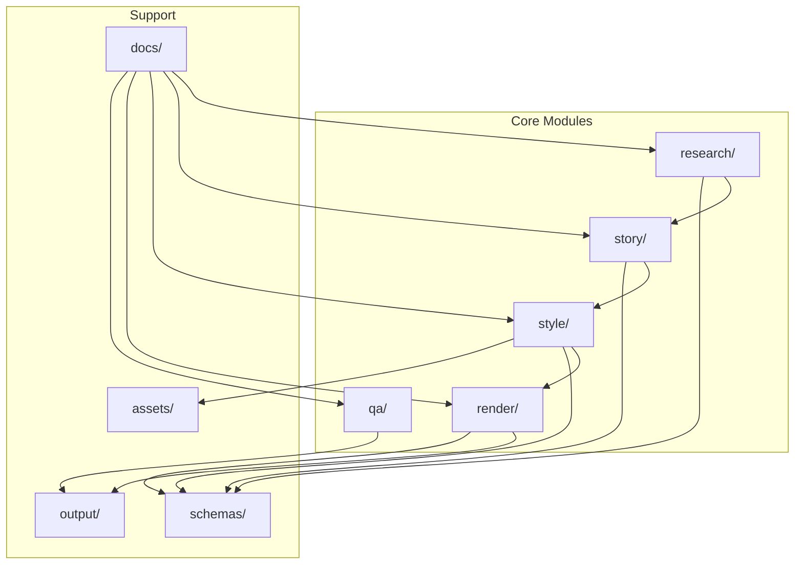
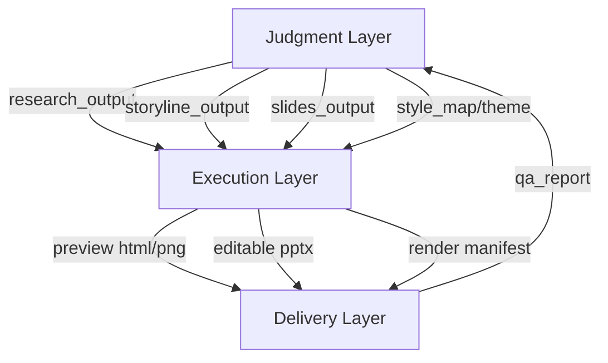
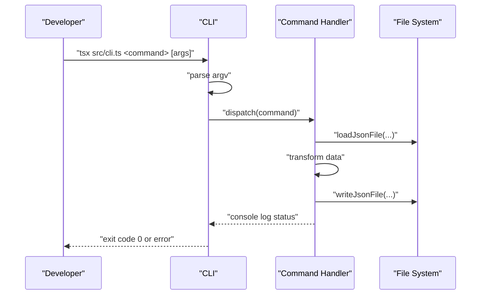
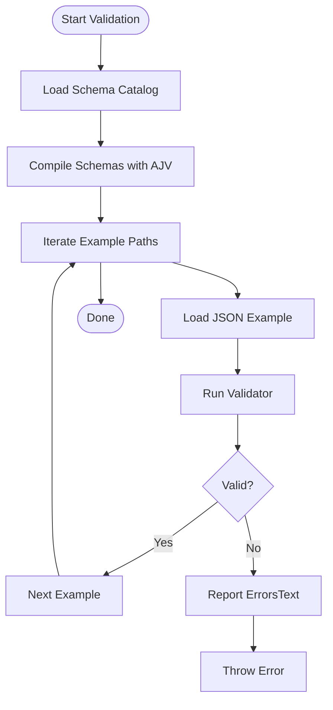
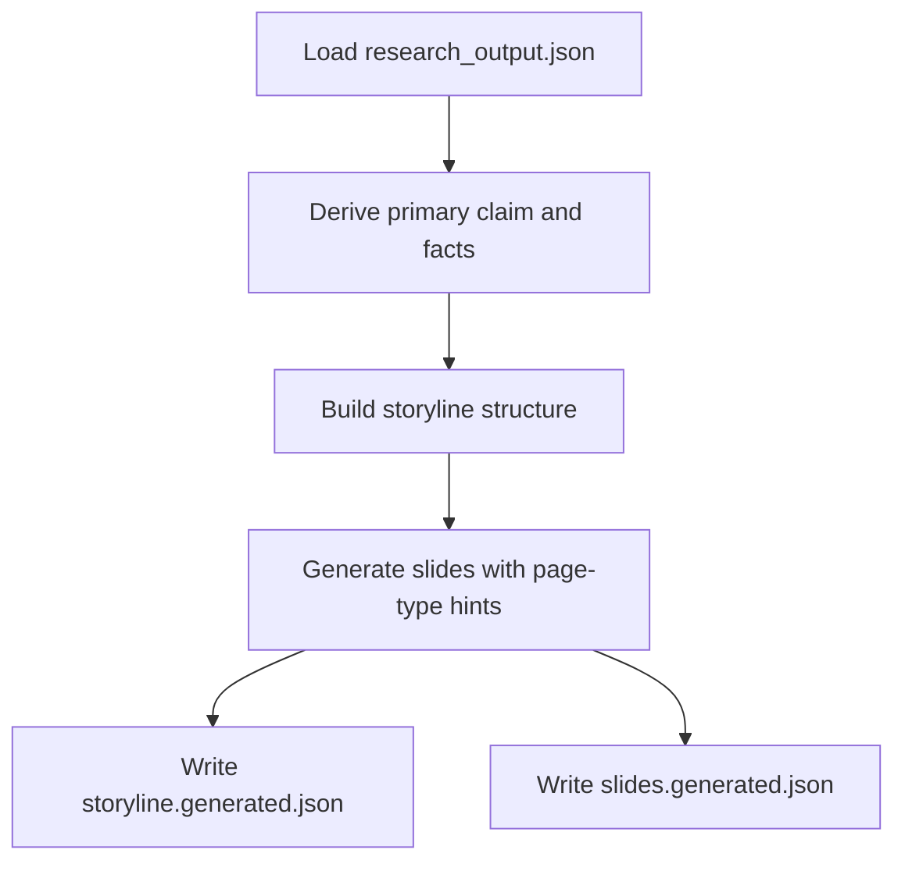
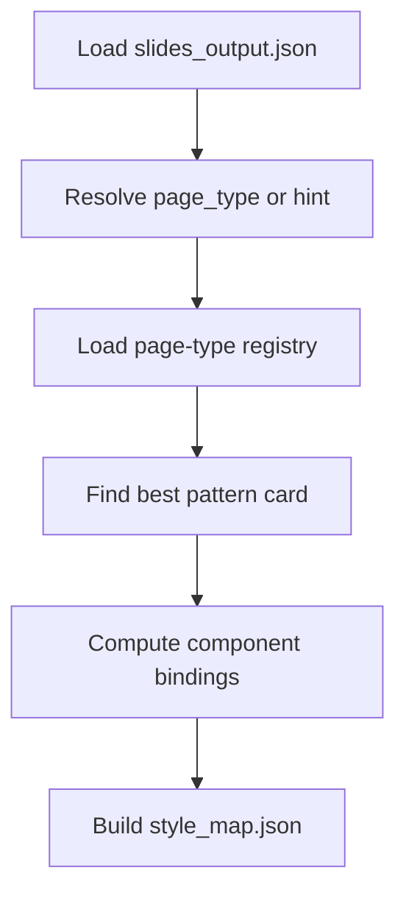
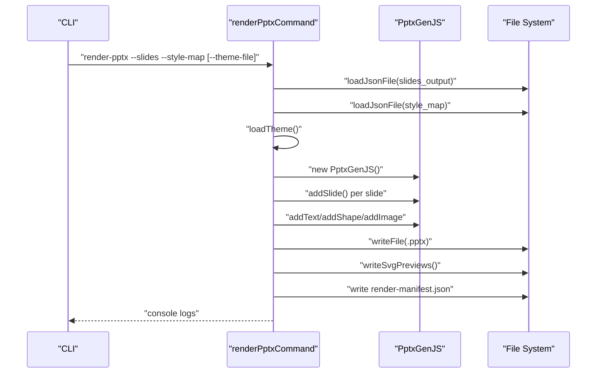
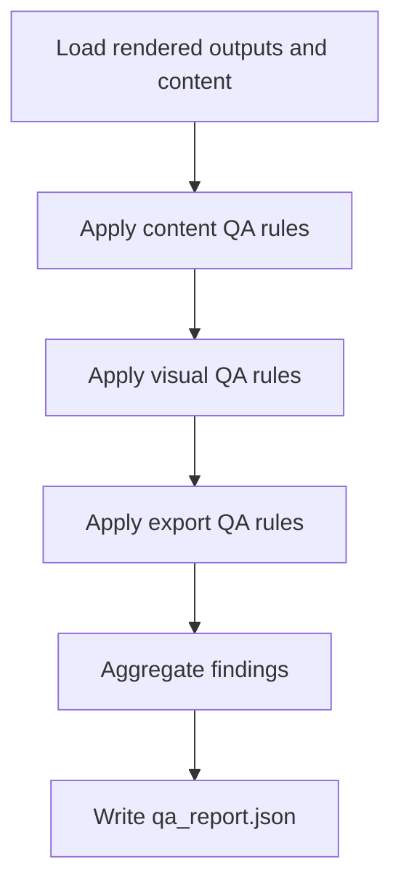
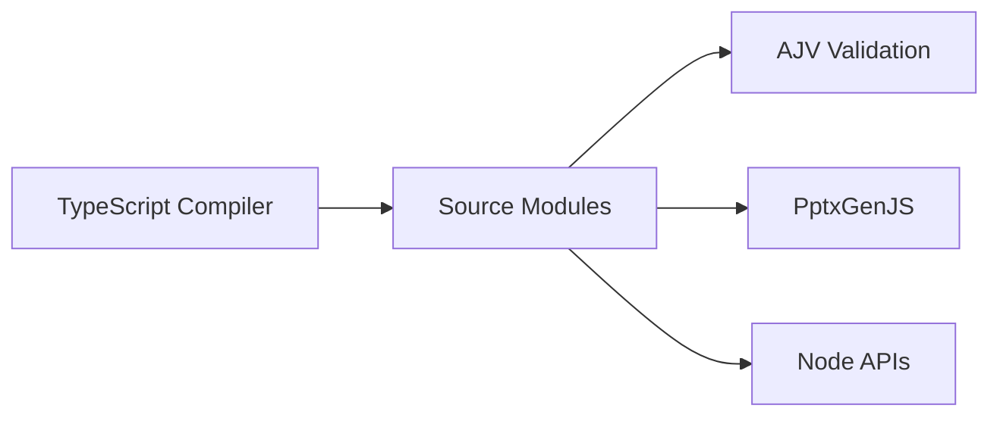

# Development Guidelines

<cite>
**Referenced Files in This Document**
- [README.md](file://README.md)
- [PROJECT_BLUEPRINT.md](file://PROJECT_BLUEPRINT.md)
- [01-system-architecture.md](file://01-system-architecture.md)
- [02-design-principles.md](file://02-design-principles.md)
- [04-editable-output-strategy.md](file://04-editable-output-strategy.md)
- [docs/architecture/module-boundaries.md](file://docs/architecture/module-boundaries.md)
- [docs/decisions/ADR-0002-editable-pptx-strategy.md](file://docs/decisions/ADR-0002-editable-pptx-strategy.md)
- [package.json](file://package.json)
- [tsconfig.json](file://tsconfig.json)
- [src/cli.ts](file://src/cli.ts)
- [src/commands/validateContracts.ts](file://src/commands/validateContracts.ts)
- [src/commands/buildStyleMap.ts](file://src/commands/buildStyleMap.ts)
- [src/commands/storyToSlides.ts](file://src/commands/storyToSlides.ts)
- [src/commands/renderPptx.ts](file://src/commands/renderPptx.ts)
- [schemas/slides_output.schema.json](file://schemas/slides_output.schema.json)
- [schemas/style_map.schema.json](file://schemas/style_map.schema.json)
- [style/patterns/page-type-registry.json](file://style/patterns/page-type-registry.json)
- [style/themes/dark-enterprise-tech.theme.json](file://style/themes/dark-enterprise-tech.theme.json)
- [skills/README.md](file://skills/README.md)
</cite>

## Table of Contents
1. [Introduction](#introduction)
2. [Project Structure](#project-structure)
3. [Core Components](#core-components)
4. [Architecture Overview](#architecture-overview)
5. [Detailed Component Analysis](#detailed-component-analysis)
6. [Dependency Analysis](#dependency-analysis)
7. [Performance Considerations](#performance-considerations)
8. [Troubleshooting Guide](#troubleshooting-guide)
9. [Conclusion](#conclusion)
10. [Appendices](#appendices)

## Introduction
This document defines the development guidelines for the Enterprise PPT System. It consolidates design principles, editable output strategy, skill-based development organization, coding conventions, TypeScript configuration, testing strategies, performance optimization guidelines, and maintenance practices. It also explains how development guidelines map to system requirements and outlines code review, debugging, and extension processes.

## Project Structure
The repository is organized around five core modules and supporting assets:
- research/: structured intake and outputs for upstream knowledge
- story/: storyline and structured slide source
- style/: theme, patterns, components, and reference extractions
- render/: preview and editable delivery pipelines
- qa/: QA rules and reports
- schemas/: JSON Schema contracts for all data artifacts
- docs/: architecture, decisions, and workflows
- styles and assets: theme tokens, UI primitives, and visual assets
- examples and references: representative datasets and curated references
- output/: versioned preview, delivery, and QA artifacts

**Section sources**
- [README.md:17-27](file://README.md#L17-L27)
- [PROJECT_BLUEPRINT.md:218-276](file://PROJECT_BLUEPRINT.md#L218-L276)

## Core Components
- CLI and Commands: Centralized command routing with typed handlers for validation, story building, style mapping, rendering, and rerendering.
- Validation: Schema-driven validation using AJV to ensure contracts are met across example datasets.
- Story Builder: Converts research into structured slides and storyline artifacts.
- Style Intelligence: Builds a style map from page-type hints and pattern cards.
- Renderer: Produces preview outputs and editable PPTX using native PPT objects.
- QA: Validates content, visuals, and exports against explicit rules.

Key conventions:
- Strict separation of judgment (research/story) and execution (style/renderer/QA).
- Structured JSON as the single source of truth.
- Deterministic layout and native PPT object mapping for editable delivery.
- Versioned outputs and manifests for reproducibility.

**Section sources**
- [src/cli.ts:10-37](file://src/cli.ts#L10-L37)
- [src/commands/validateContracts.ts:7-99](file://src/commands/validateContracts.ts#L7-L99)
- [src/commands/storyToSlides.ts:12-165](file://src/commands/storyToSlides.ts#L12-L165)
- [src/commands/buildStyleMap.ts:50-109](file://src/commands/buildStyleMap.ts#L50-L109)
- [src/commands/renderPptx.ts:83-187](file://src/commands/renderPptx.ts#L83-L187)
- [01-system-architecture.md:3-106](file://01-system-architecture.md#L3-L106)
- [02-design-principles.md:24-29](file://02-design-principles.md#L24-L29)

## Architecture Overview
The system enforces a strict separation between judgment and execution layers. Judgment responsibilities include research extraction, audience adaptation, storyline construction, page-type selection, critique, and QA review suggestions. Execution responsibilities include schema validation, style token resolution, deterministic layout calculation, preview rendering, editable PPTX export, local rerender, and export QA.

**Diagram sources**
- [01-system-architecture.md:26-44](file://01-system-architecture.md#L26-L44)
- [PROJECT_BLUEPRINT.md:46-47](file://PROJECT_BLUEPRINT.md#L46-L47)

**Section sources**
- [01-system-architecture.md:3-106](file://01-system-architecture.md#L3-L106)
- [PROJECT_BLUEPRINT.md:26-47](file://PROJECT_BLUEPRINT.md#L26-L47)

## Detailed Component Analysis

### CLI and Command Workflow
The CLI routes commands to dedicated handlers. Each command validates required arguments, loads JSON inputs, applies transformations, and writes outputs. Error handling prints help or exits with failure codes.

**Diagram sources**
- [src/cli.ts:19-56](file://src/cli.ts#L19-L56)
- [src/commands/validateContracts.ts:85-98](file://src/commands/validateContracts.ts#L85-L98)

**Section sources**
- [src/cli.ts:10-56](file://src/cli.ts#L10-L56)

### Validation Strategy (Schema-Driven)
Validation uses AJV to compile and apply JSON Schemas to example datasets. This ensures contracts are enforced consistently across modules.

**Diagram sources**
- [src/commands/validateContracts.ts:15-99](file://src/commands/validateContracts.ts#L15-L99)

**Section sources**
- [src/commands/validateContracts.ts:7-99](file://src/commands/validateContracts.ts#L7-L99)
- [schemas/slides_output.schema.json:1-53](file://schemas/slides_output.schema.json#L1-L53)
- [schemas/style_map.schema.json:1-70](file://schemas/style_map.schema.json#L1-L70)

### Story Builder
Story builder transforms research into structured slides and storyline artifacts. It ensures each slide has a primary claim and each chapter answers a concrete question.

**Diagram sources**
- [src/commands/storyToSlides.ts:21-165](file://src/commands/storyToSlides.ts#L21-L165)

**Section sources**
- [src/commands/storyToSlides.ts:12-165](file://src/commands/storyToSlides.ts#L12-L165)
- [02-design-principles.md:10-15](file://02-design-principles.md#L10-L15)

### Style Intelligence and Style Map
Style intelligence binds page types to visual anchors, weight centers, density levels, and component bindings. It resolves theme tokens and pattern cards to produce a style map.

**Diagram sources**
- [src/commands/buildStyleMap.ts:50-109](file://src/commands/buildStyleMap.ts#L50-L109)
- [style/patterns/page-type-registry.json:1-115](file://style/patterns/page-type-registry.json#L1-L115)
- [style/themes/dark-enterprise-tech.theme.json:1-55](file://style/themes/dark-enterprise-tech.theme.json#L1-L55)

**Section sources**
- [src/commands/buildStyleMap.ts:50-109](file://src/commands/buildStyleMap.ts#L50-L109)
- [style/patterns/page-type-registry.json:1-115](file://style/patterns/page-type-registry.json#L1-L115)
- [style/themes/dark-enterprise-tech.theme.json:1-55](file://style/themes/dark-enterprise-tech.theme.json#L1-L55)

### Renderer (Editable PPTX)
The renderer creates native PPT objects, ensuring text and shapes remain editable. It validates slide counts, applies theme tokens, renders page-type-specific layouts, and writes preview SVGs and a render manifest.

**Diagram sources**
- [src/commands/renderPptx.ts:83-187](file://src/commands/renderPptx.ts#L83-L187)

**Section sources**
- [src/commands/renderPptx.ts:83-187](file://src/commands/renderPptx.ts#L83-L187)
- [04-editable-output-strategy.md:35-61](file://04-editable-output-strategy.md#L35-L61)

### QA Layer
QA validates content, visuals, and exports against explicit rules and produces a reproducible report with severity and ownership.

**Section sources**
- [PROJECT_BLUEPRINT.md:194-217](file://PROJECT_BLUEPRINT.md#L194-L217)

## Dependency Analysis
- Language and Tooling: TypeScript with ES2022 target and NodeNext module resolution; AJV for validation; PptxGenJS for editable PPTX.
- Internal Dependencies: Commands depend on shared libraries for JSON I/O, path resolution, and theme loading; renderers depend on style assets and helpers.
- External Dependencies: AJV, PptxGenJS, Node built-ins.

**Diagram sources**
- [package.json:14-22](file://package.json#L14-L22)
- [tsconfig.json:2-13](file://tsconfig.json#L2-L13)

**Section sources**
- [package.json:14-22](file://package.json#L14-L22)
- [tsconfig.json:2-13](file://tsconfig.json#L2-L13)

## Performance Considerations
- Keep preview and delivery pipelines separate but consistent by sharing the page-type registry and theme tokens.
- Prefer deterministic layout calculations and avoid heavy DOM/SVG manipulation in preview; delegate complex visuals to native PPT objects in delivery.
- Minimize repeated I/O by batching reads/writes and using versioned output directories.
- Use component bindings and pattern cards to reduce duplication and improve maintainability.
- Validate early and fail fast to avoid expensive downstream operations.

[No sources needed since this section provides general guidance]

## Troubleshooting Guide
Common issues and remedies:
- Missing required arguments in commands: Ensure all required flags are provided; the CLI will print help or exit with error.
- Schema validation failures: Review AJV error messages and align data with the appropriate schema.
- Mismatched slide counts: Ensure slides_output and style_map contain the same number of slides.
- Unknown page types: Confirm page-type registry entries and that page-type hints are resolvable.
- Non-editable PPTX: Verify that native PPT objects are used and that fallback raster-only outputs are not produced as final delivery.

**Section sources**
- [src/cli.ts:28-36](file://src/cli.ts#L28-L36)
- [src/commands/validateContracts.ts:85-99](file://src/commands/validateContracts.ts#L85-L99)
- [src/commands/renderPptx.ts:111-113](file://src/commands/renderPptx.ts#L111-L113)
- [src/commands/buildStyleMap.ts:66-74](file://src/commands/buildStyleMap.ts#L66-L74)

## Conclusion
These guidelines establish a robust, layered development approach for the Enterprise PPT System. By enforcing separation of concerns, using structured JSON contracts, prioritizing editable delivery, and maintaining strict QA gates, teams can build reliable, reusable, and enterprise-grade presentation decks that are locally revisable and reproducible.

[No sources needed since this section summarizes without analyzing specific files]

## Appendices

### Coding Conventions
- Use TypeScript with strict compiler options and ES2022 target.
- Keep modules cohesive and decoupled; pass data via JSON contracts.
- Favor deterministic logic and explicit error handling.
- Separate concerns: judgment (research/story), style (patterns/themes), execution (rendering/QA).

**Section sources**
- [tsconfig.json:2-13](file://tsconfig.json#L2-L13)
- [02-design-principles.md:24-29](file://02-design-principles.md#L24-L29)

### Testing Strategies
- Contract tests: Validate example datasets against JSON Schemas using AJV.
- Unit-like command tests: Assert command outputs and side effects (e.g., written files).
- Integration tests: Run full pipelines (story -> style -> render) and verify outputs.

**Section sources**
- [src/commands/validateContracts.ts:7-99](file://src/commands/validateContracts.ts#L7-L99)

### Performance Optimization Guidelines
- Reuse shared resources (themes, assets, helpers).
- Avoid unnecessary recomputation; cache resolved page-type entries and pattern cards.
- Streamline I/O by writing only necessary artifacts and manifests.

[No sources needed since this section provides general guidance]

### Error Handling Approaches
- Fail fast: Validate inputs and contracts early.
- Clear messaging: Print help or detailed error messages for invalid commands or missing files.
- Idempotent operations: Ensure rerendering does not corrupt existing outputs.

**Section sources**
- [src/cli.ts:28-36](file://src/cli.ts#L28-L36)
- [src/commands/renderPptx.ts:791-800](file://src/commands/renderPptx.ts#L791-L800)

### Code Organization Principles
- Feature-based organization: Group related files under modules (research, story, style, render, qa).
- Shared libraries: Place reusable utilities (JSON I/O, path helpers, schema catalog) under src/lib.
- Versioned outputs: Use manifests and timestamped filenames to track changes.

**Section sources**
- [README.md:17-27](file://README.md#L17-L27)
- [src/commands/renderPptx.ts:168-186](file://src/commands/renderPptx.ts#L168-L186)

### Relationship Between Guidelines and System Requirements
- Editable delivery: Mandated by design principle and ADR; implemented via native PPT objects.
- Reproducible outputs: Achieved through versioned manifests and deterministic rendering.
- Local rerender: Enabled by structured content and modular page-type rendering.
- QA gates: Explicit rules ensure content, visuals, and exports meet quality criteria.

**Section sources**
- [04-editable-output-strategy.md:28-49](file://04-editable-output-strategy.md#L28-L49)
- [docs/decisions/ADR-0002-editable-pptx-strategy.md:9-27](file://docs/decisions/ADR-0002-editable-pptx-strategy.md#L9-L27)
- [PROJECT_BLUEPRINT.md:194-217](file://PROJECT_BLUEPRINT.md#L194-L217)

### Code Review Processes
- Enforce schema compliance for all artifacts.
- Review cross-module contracts (slides_output, style_map) for consistency.
- Verify editable PPTX correctness and rerender behavior.
- Ensure QA rules are aligned with product principles.

**Section sources**
- [schemas/slides_output.schema.json:1-53](file://schemas/slides_output.schema.json#L1-L53)
- [schemas/style_map.schema.json:1-70](file://schemas/style_map.schema.json#L1-L70)
- [02-design-principles.md:31-36](file://02-design-principles.md#L31-L36)

### Debugging Strategies
- Use CLI help to confirm command usage.
- Validate intermediate artifacts (storyline, slides, style_map) with schema validation.
- Inspect render manifest and preview outputs to localize issues.
- Test rerendering of specific slides to isolate problems.

**Section sources**
- [src/cli.ts:39-50](file://src/cli.ts#L39-L50)
- [src/commands/validateContracts.ts:85-99](file://src/commands/validateContracts.ts#L85-L99)
- [src/commands/renderPptx.ts:168-186](file://src/commands/renderPptx.ts#L168-L186)

### Maintenance Considerations
- Keep page-type registry and theme tokens centralized and versioned.
- Maintain pattern cards and reference extractions as structured assets.
- Update schemas and validators when contracts evolve.
- Document module boundaries and canonical flows to guide maintenance.

**Section sources**
- [docs/architecture/module-boundaries.md:1-151](file://docs/architecture/module-boundaries.md#L1-L151)
- [PROJECT_BLUEPRINT.md:218-276](file://PROJECT_BLUEPRINT.md#L218-L276)

### Extending the System and Integrating New Features
- Add new page types to the registry with explicit visual anchors, weight centers, and editable targets.
- Introduce pattern cards to encode reusable layouts and component bindings.
- Extend story builder rules to incorporate new narrative roles and page-type hints.
- Enhance renderer with new page-type handlers mapped to native PPT objects.
- Expand QA rules to cover new visual or content patterns.

**Section sources**
- [style/patterns/page-type-registry.json:1-115](file://style/patterns/page-type-registry.json#L1-L115)
- [src/commands/buildStyleMap.ts:75-98](file://src/commands/buildStyleMap.ts#L75-L98)
- [src/commands/renderPptx.ts:139-155](file://src/commands/renderPptx.ts#L139-L155)
- [skills/README.md:11-15](file://skills/README.md#L11-L15)