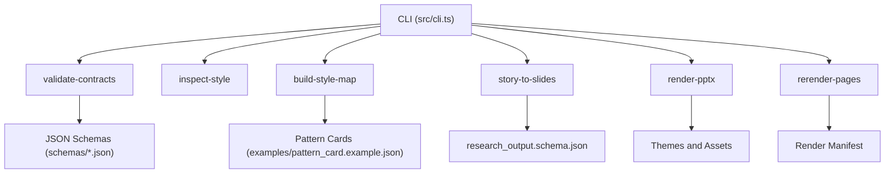
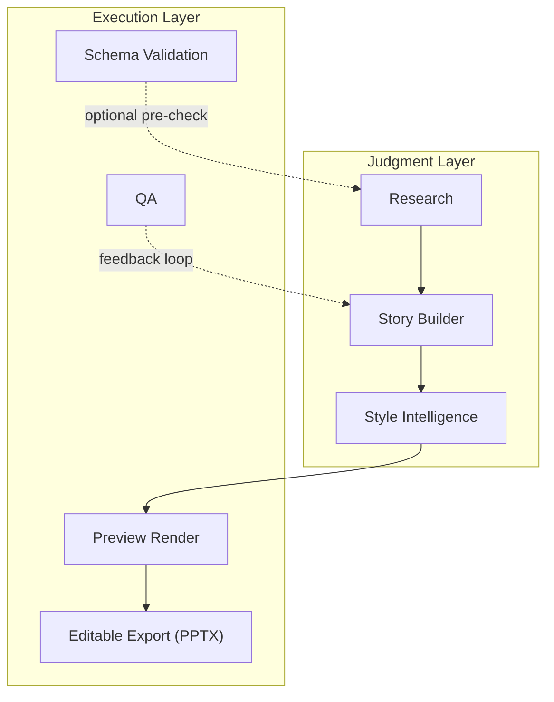
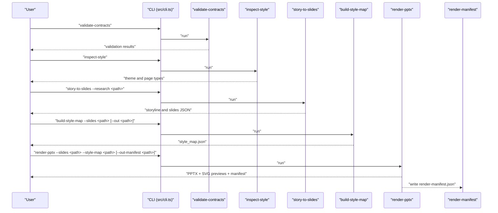
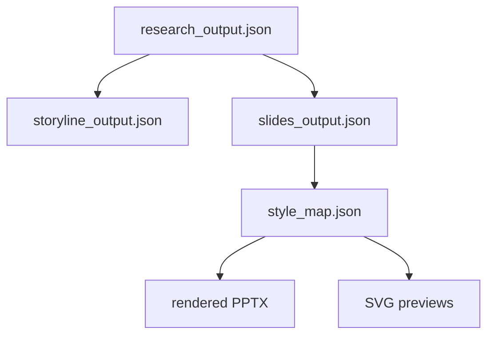
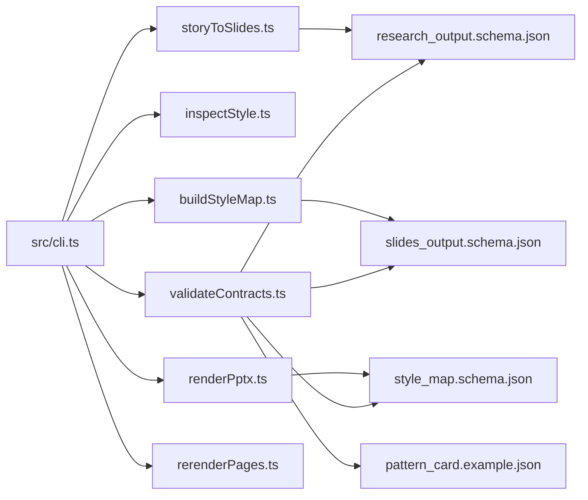

# Getting Started

<cite>
**Referenced Files in This Document**
- [README.md](file://README.md)
- [PROJECT_INIT.md](file://PROJECT_INIT.md)
- [03-operating-workflow.md](file://03-operating-workflow.md)
- [package.json](file://package.json)
- [src/cli.ts](file://src/cli.ts)
- [src/commands/validateContracts.ts](file://src/commands/validateContracts.ts)
- [src/commands/inspectStyle.ts](file://src/commands/inspectStyle.ts)
- [src/commands/buildStyleMap.ts](file://src/commands/buildStyleMap.ts)
- [src/commands/storyToSlides.ts](file://src/commands/storyToSlides.ts)
- [src/commands/renderPptx.ts](file://src/commands/renderPptx.ts)
- [src/commands/rerenderPages.ts](file://src/commands/rerenderPages.ts)
- [schemas/research_output.schema.json](file://schemas/research_output.schema.json)
- [schemas/slides_output.schema.json](file://schemas/slides_output.schema.json)
- [schemas/style_map.schema.json](file://schemas/style_map.schema.json)
- [examples/pattern_card.example.json](file://examples/pattern_card.example.json)
</cite>

## Table of Contents
1. [Introduction](#introduction)
2. [Project Structure](#project-structure)
3. [Core Components](#core-components)
4. [Architecture Overview](#architecture-overview)
5. [Detailed Component Analysis](#detailed-component-analysis)
6. [Dependency Analysis](#dependency-analysis)
7. [Performance Considerations](#performance-considerations)
8. [Troubleshooting Guide](#troubleshooting-guide)
9. [Conclusion](#conclusion)
10. [Appendices](#appendices)

## Introduction
This guide helps you install and run the Enterprise PPT System, an MVP pipeline that transforms research into structured slides, maps them to visual styles, and exports an editable PPTX. It covers prerequisites, installation, the six core CLI commands, step-by-step execution, interpreting outputs, and troubleshooting.

Key capabilities:
- Schema-driven contracts validation
- Storyline and slide scaffolding from research
- Style mapping to page types and themes
- Deterministic rendering to editable PPTX with SVG previews
- Local rerender requests for targeted fixes

Limitations:
- Rendering is MVP-focused; not all page types are implemented
- No production research crawling or external LLM orchestration in this bootstrap
- Editable output uses native PPT objects via PptxGenJS

**Section sources**
- [README.md:1-38](file://README.md#L1-L38)
- [PROJECT_INIT.md:3-44](file://PROJECT_INIT.md#L3-L44)

## Project Structure
High-level structure relevant to getting started:
- src/cli.ts: CLI entrypoint and command routing
- src/commands/*: Six core commands implementing the pipeline
- schemas/*: JSON Schemas validating inputs/outputs
- examples/*: Example artifacts for style patterns and reference extractions
- style/, research/, story/, render/, output/: module directories for assets and outputs
- package.json: Scripts and dependencies

**Diagram sources**
- [src/cli.ts:19-50](file://src/cli.ts#L19-L50)
- [src/commands/validateContracts.ts:15-24](file://src/commands/validateContracts.ts#L15-L24)
- [examples/pattern_card.example.json:1-54](file://examples/pattern_card.example.json#L1-L54)
- [schemas/research_output.schema.json:1-88](file://schemas/research_output.schema.json#L1-L88)

**Section sources**
- [README.md:17-22](file://README.md#L17-L22)
- [package.json:6-13](file://package.json#L6-L13)

## Core Components
- CLI entrypoint routes commands and prints help
- Six commands implement the pipeline:
  - validate-contracts: validates example datasets against schemas
  - inspect-style: introspects page types and theme family
  - story-to-slides: converts research into a storyline and structured slides
  - build-style-map: maps slides to page types, themes, and learned patterns
  - render-pptx: renders editable PPTX and SVG previews
  - rerender-pages: marks slides for local rerender in the manifest

**Section sources**
- [src/cli.ts:10-17](file://src/cli.ts#L10-L17)
- [src/cli.ts:39-50](file://src/cli.ts#L39-L50)
- [src/commands/validateContracts.ts:7-100](file://src/commands/validateContracts.ts#L7-L100)
- [src/commands/inspectStyle.ts:4-14](file://src/commands/inspectStyle.ts#L4-L14)
- [src/commands/storyToSlides.ts:12-166](file://src/commands/storyToSlides.ts#L12-L166)
- [src/commands/buildStyleMap.ts:50-110](file://src/commands/buildStyleMap.ts#L50-L110)
- [src/commands/renderPptx.ts:83-187](file://src/commands/renderPptx.ts#L83-L187)
- [src/commands/rerenderPages.ts:15-40](file://src/commands/rerenderPages.ts#L15-L40)

## Architecture Overview
The system follows a layered pipeline:
- Judgment layer: research, story, page-type selection, critique
- Execution layer: schema validation, preview render, PPTX export, QA
- Editable delivery: native PPT objects via PptxGenJS

**Diagram sources**
- [PROJECT_INIT.md:30-44](file://PROJECT_INIT.md#L30-L44)
- [03-operating-workflow.md:1-112](file://03-operating-workflow.md#L1-L112)

## Detailed Component Analysis

### Prerequisites and Installation
- Node.js: Required to run the CLI and scripts
- Install dependencies: Run the standard npm install to fetch dev/runtime dependencies
- Scripts: The package.json scripts wrap the CLI with tsx for convenience

What you need installed:
- Node.js runtime
- npm (comes with Node.js)

What gets installed:
- Runtime: PptxGenJS for editable PPTX export
- Dev/runtime tooling: TypeScript, tsx, AJV for schema validation

Verification steps:
- Confirm Node.js and npm are available
- Run the validate-contracts script to ensure schemas load correctly

**Section sources**
- [package.json:14-22](file://package.json#L14-L22)
- [package.json:6-13](file://package.json#L6-L13)

### Step-by-Step CLI Workflow

#### 1) Validate Contracts
Purpose: Ensure example datasets conform to schemas before proceeding.

Command:
- npm run validate:contracts

Outputs:
- Console logs success for each validated example
- Throws on first failure with details

Interpretation:
- If all validations pass, you can proceed confidently to later stages
- Failures indicate mismatches in structure or types

**Section sources**
- [src/commands/validateContracts.ts:7-100](file://src/commands/validateContracts.ts#L7-L100)
- [schemas/research_output.schema.json:1-88](file://schemas/research_output.schema.json#L1-L88)
- [schemas/slides_output.schema.json:1-53](file://schemas/slides_output.schema.json#L1-L53)
- [schemas/style_map.schema.json:1-70](file://schemas/style_map.schema.json#L1-70)
- [examples/pattern_card.example.json:1-54](file://examples/pattern_card.example.json#L1-L54)

#### 2) Inspect Style
Purpose: Discover supported page types and theme family for the MVP.

Command:
- npm run inspect:style

Outputs:
- Theme ID and name
- Total page types and MVP-priority page types

Interpretation:
- Use this to confirm the available page types before mapping slides
- The theme family drives visual anchors and layout defaults

**Section sources**
- [src/commands/inspectStyle.ts:4-14](file://src/commands/inspectStyle.ts#L4-L14)

#### 3) Prepare Research Data
Purpose: Provide a research dataset that matches the research schema.

Guidance:
- Create or adapt a research dataset to match research_output.schema.json
- Ensure required fields are present and types align

Where to start:
- Review the schema to understand required and optional fields
- Use the example dataset as a reference

**Section sources**
- [schemas/research_output.schema.json:1-88](file://schemas/research_output.schema.json#L1-L88)

#### 4) Story Generation
Purpose: Convert research into a storyline and structured slides.

Command:
- npm run pipeline:story-to-slides

Inputs:
- --research <path> pointing to your research dataset

Outputs:
- storyline_output.json (in story/outputs/)
- slides_output.json (in story/outputs/)

Interpretation:
- The command writes scaffolded content suitable for style mapping
- Verify the generated files exist and contain expected keys

**Section sources**
- [src/commands/storyToSlides.ts:12-166](file://src/commands/storyToSlides.ts#L12-L166)

#### 5) Style Mapping
Purpose: Bind each slide to a page type, theme, and learned pattern.

Command:
- npm run build:style-map

Inputs:
- --slides <path> to slides_output.json
- Optional: --out <path> for style_map.json
- Optional: --theme <theme-id> to override theme family

Outputs:
- style_map.json (default in style/outputs/)

Interpretation:
- The style map assigns page_type, visual_anchor, weight_center, and learned_pattern metadata
- Pattern cards inform component bindings and image usage

**Section sources**
- [src/commands/buildStyleMap.ts:50-110](file://src/commands/buildStyleMap.ts#L50-L110)
- [examples/pattern_card.example.json:1-54](file://examples/pattern_card.example.json#L1-L54)

#### 6) Final PPTX Export
Purpose: Render an editable PPTX and SVG previews.

Command:
- npm run render:pptx

Inputs:
- --slides <path> to slides_output.json
- --style-map <path> to style_map.json
- Optional: --theme-file <path> to override theme
- Optional: --out-manifest <path> to specify render manifest location

Outputs:
- Editable PPTX in output/delivery/
- SVG previews in output/preview/
- Render manifest in output/delivery/

Interpretation:
- The PPTX is editable and uses native shapes/images
- Open the preview HTML to review SVG outputs
- The manifest records outputs and rerender flags

**Section sources**
- [src/commands/renderPptx.ts:83-187](file://src/commands/renderPptx.ts#L83-L187)

#### Optional: Local Page Rerender
Purpose: Mark specific slides for rerender after QA feedback.

Command:
- npm run rerender:pages

Inputs:
- --manifest <path> to render-manifest.json
- --slides <id1,id2,...> slide IDs to rerender

Outputs:
- Updated render-manifest.json with rerender flags

Interpretation:
- Use this to iterate quickly on selected slides without full re-render

**Section sources**
- [src/commands/rerenderPages.ts:15-40](file://src/commands/rerenderPages.ts#L15-L40)

### Pipeline Sequence Diagram

**Diagram sources**
- [src/cli.ts:19-50](file://src/cli.ts#L19-L50)
- [src/commands/validateContracts.ts:7-100](file://src/commands/validateContracts.ts#L7-L100)
- [src/commands/inspectStyle.ts:4-14](file://src/commands/inspectStyle.ts#L4-L14)
- [src/commands/storyToSlides.ts:12-166](file://src/commands/storyToSlides.ts#L12-L166)
- [src/commands/buildStyleMap.ts:50-110](file://src/commands/buildStyleMap.ts#L50-L110)
- [src/commands/renderPptx.ts:83-187](file://src/commands/renderPptx.ts#L83-L187)

### Data Contracts and Examples
- research_output.schema.json defines the shape of research datasets
- slides_output.schema.json defines structured slide content
- style_map.schema.json defines the style mapping for rendering
- pattern_card.example.json demonstrates learned pattern metadata

**Diagram sources**
- [schemas/research_output.schema.json:1-88](file://schemas/research_output.schema.json#L1-L88)
- [schemas/slides_output.schema.json:1-53](file://schemas/slides_output.schema.json#L1-L53)
- [schemas/style_map.schema.json:1-70](file://schemas/style_map.schema.json#L1-L70)
- [examples/pattern_card.example.json:1-54](file://examples/pattern_card.example.json#L1-L54)

**Section sources**
- [schemas/research_output.schema.json:1-88](file://schemas/research_output.schema.json#L1-L88)
- [schemas/slides_output.schema.json:1-53](file://schemas/slides_output.schema.json#L1-L53)
- [schemas/style_map.schema.json:1-70](file://schemas/style_map.schema.json#L1-L70)
- [examples/pattern_card.example.json:1-54](file://examples/pattern_card.example.json#L1-L54)

## Dependency Analysis
- CLI depends on command handlers for each subcommand
- Commands depend on shared libraries for JSON I/O, paths, and schema/theme loading
- Rendering depends on PptxGenJS and helper modules for layout warnings and utilities
- Validation depends on AJV and the schema catalog

**Diagram sources**
- [src/cli.ts:1-6](file://src/cli.ts#L1-L6)
- [src/commands/validateContracts.ts:15-24](file://src/commands/validateContracts.ts#L15-L24)
- [schemas/research_output.schema.json:1-88](file://schemas/research_output.schema.json#L1-L88)
- [schemas/slides_output.schema.json:1-53](file://schemas/slides_output.schema.json#L1-L53)
- [schemas/style_map.schema.json:1-70](file://schemas/style_map.schema.json#L1-L70)
- [examples/pattern_card.example.json:1-54](file://examples/pattern_card.example.json#L1-L54)

**Section sources**
- [src/cli.ts:10-17](file://src/cli.ts#L10-L17)
- [src/commands/validateContracts.ts:15-24](file://src/commands/validateContracts.ts#L15-L24)

## Performance Considerations
- Keep datasets minimal during early iterations to reduce render time
- Use SVG previews for quick feedback before full PPTX export
- Limit rerender scope to specific slides to minimize rebuilds
- Separate preview and delivery paths to avoid unnecessary work

[No sources needed since this section provides general guidance]

## Troubleshooting Guide
Common issues and resolutions:
- Unknown command or missing help:
  - Ensure you are invoking the script via npm (tsx wrapper) and passing a valid command
  - Use the CLI’s built-in help to list commands and options
- Missing required arguments:
  - Many commands require specific flags (e.g., --research, --slides, --style-map)
  - The CLI will print an error and show help when arguments are missing
- Schema validation failures:
  - Fix field types or missing required properties according to the schema
  - Use the validate-contracts script to catch issues early
- Style map mismatch:
  - Ensure slides_output and style_map reference the same number of slides
  - Confirm page_type values match registered page types
- PPTX export conflicts:
  - If the target PPTX exists, the renderer appends a timestamped suffix; check the logged path
- Layout warnings:
  - The renderer checks for overlaps and out-of-bounds elements; address reported issues in content or layout hints

**Section sources**
- [src/cli.ts:28-36](file://src/cli.ts#L28-L36)
- [src/commands/validateContracts.ts:85-98](file://src/commands/validateContracts.ts#L85-L98)
- [src/commands/buildStyleMap.ts:111-113](file://src/commands/buildStyleMap.ts#L111-L113)
- [src/commands/renderPptx.ts:111-113](file://src/commands/renderPptx.ts#L111-L113)
- [src/commands/renderPptx.ts:161-164](file://src/commands/renderPptx.ts#L161-L164)

## Conclusion
You now have the essentials to install the system, prepare research data, generate story and slides, map styles, and export an editable PPTX. Use validate-contracts and inspect-style to confirm readiness, then follow the six-command pipeline. Iterate with rerender-pages for targeted fixes and rely on SVG previews for fast review.

[No sources needed since this section summarizes without analyzing specific files]

## Appendices

### Quick Reference: Six Commands
- npm run validate:contracts
- npm run inspect:style
- npm run pipeline:story-to-slides
- npm run build:style-map
- npm run render:pptx
- npm run rerender:pages

**Section sources**
- [package.json:6-13](file://package.json#L6-L13)

### Relationship Between Modules
- research/: provides research_output.json consumed by story-to-slides
- story/: generates storyline_output.json and slides_output.json
- style/: consumes slides_output.json to produce style_map.json
- render/: consumes slides_output.json and style_map.json to produce PPTX and previews
- qa/: intended for checklists and reports (not implemented in this bootstrap)

**Section sources**
- [README.md:17-22](file://README.md#L17-L22)
- [03-operating-workflow.md:1-112](file://03-operating-workflow.md#L1-L112)