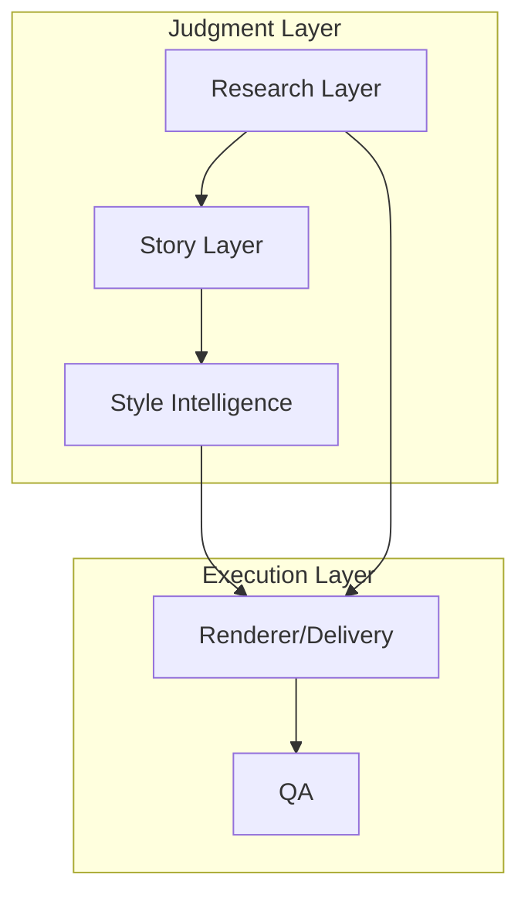
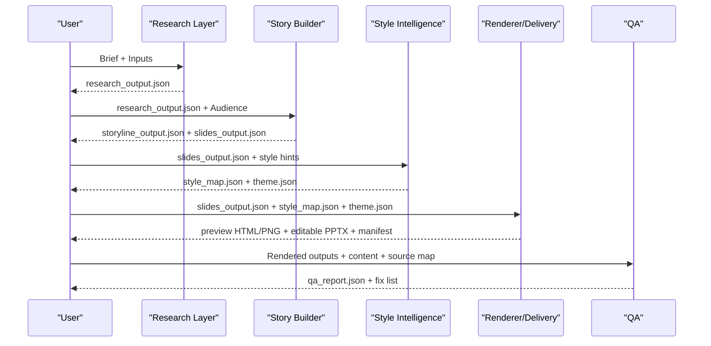
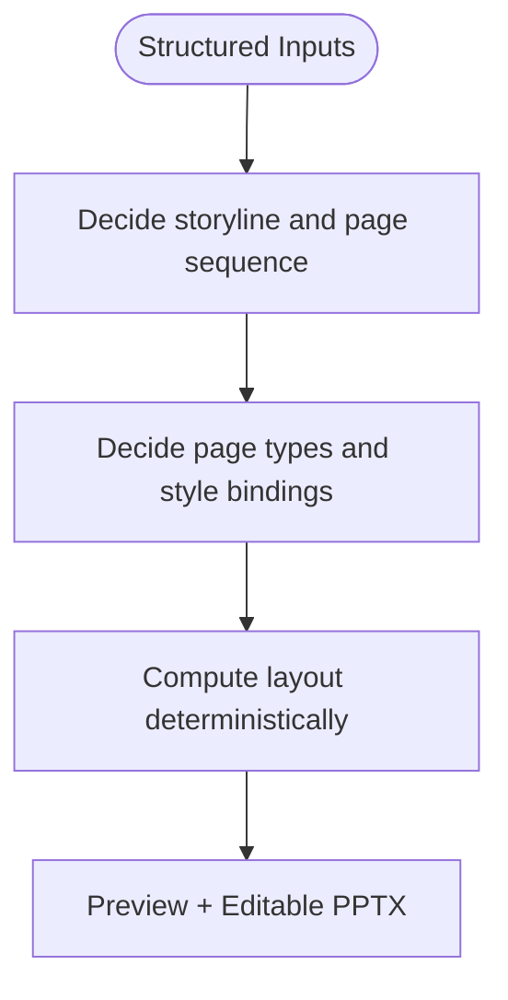
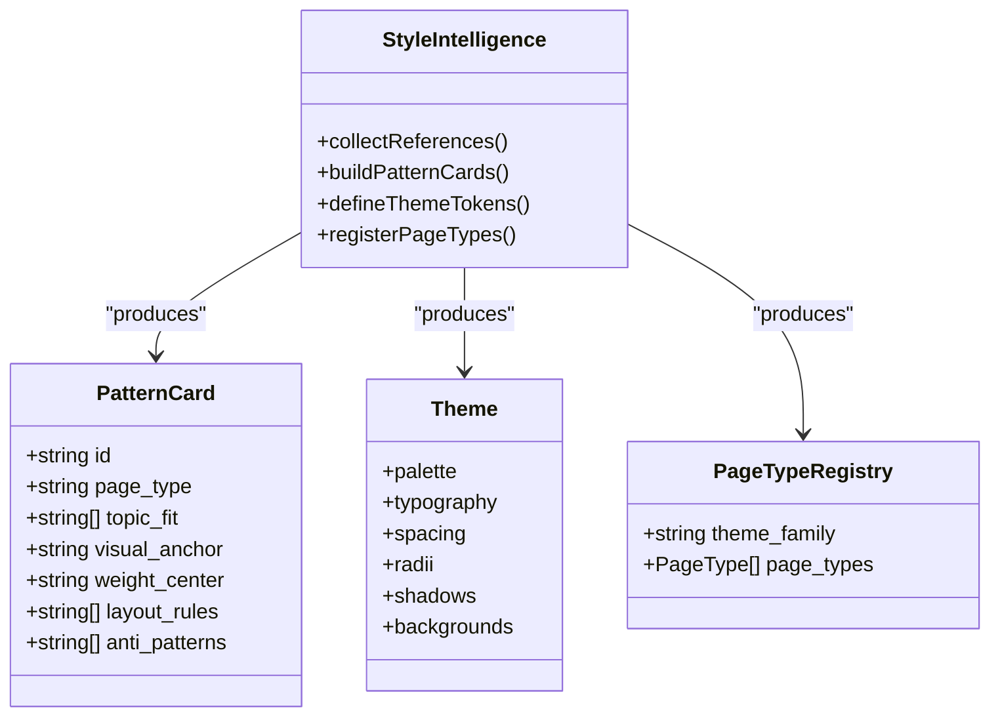
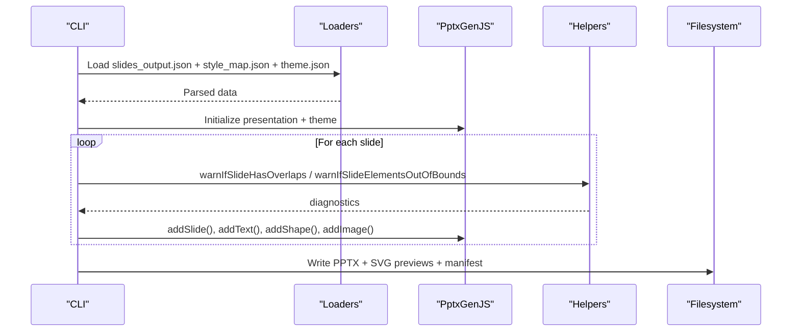
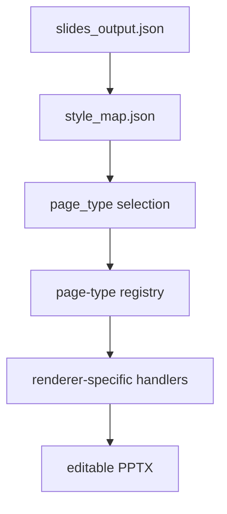
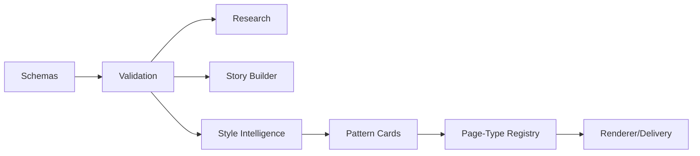
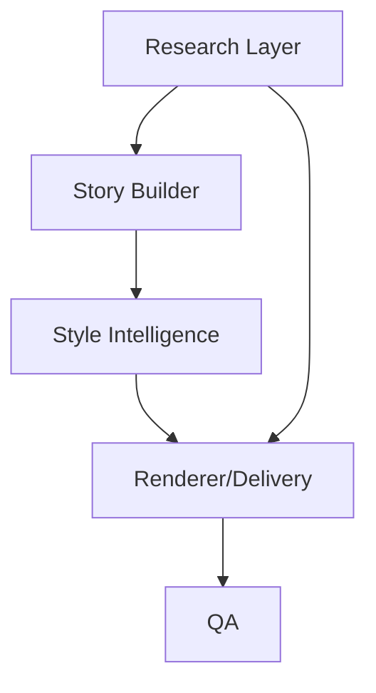

# Core Concepts

<cite>
**Referenced Files in This Document**
- [01-system-architecture.md](file://01-system-architecture.md)
- [02-design-principles.md](file://02-design-principles.md)
- [PROJECT_BLUEPRINT.md](file://PROJECT_BLUEPRINT.md)
- [docs/architecture/module-boundaries.md](file://docs/architecture/module-boundaries.md)
- [docs/architecture/deck-learning-system.md](file://docs/architecture/deck-learning-system.md)
- [references/style-intelligence.md](file://references/style-intelligence.md)
- [references/skill-split.md](file://references/skill-split.md)
- [04-editable-output-strategy.md](file://04-editable-output-strategy.md)
- [style/patterns/page-type-registry.json](file://style/patterns/page-type-registry.json)
- [src/commands/renderPptx.ts](file://src/commands/renderPptx.ts)
- [render/pptxgenjs_helpers/layout.js](file://render/pptxgenjs_helpers/layout.js)
- [render/pptxgenjs_helpers/util.js](file://render/pptxgenjs_helpers/util.js)
</cite>

## Table of Contents
1. [Introduction](#introduction)
2. [Project Structure](#project-structure)
3. [Core Components](#core-components)
4. [Architecture Overview](#architecture-overview)
5. [Detailed Component Analysis](#detailed-component-analysis)
6. [Dependency Analysis](#dependency-analysis)
7. [Performance Considerations](#performance-considerations)
8. [Troubleshooting Guide](#troubleshooting-guide)
9. [Conclusion](#conclusion)
10. [Appendices](#appendices)

## Introduction
This document defines the core concepts and mental models underpinning the Enterprise PPT System. It explains the layered architecture, the separation of judgment from execution, and how schema-driven validation and pattern-based design systems enable maintainable, scalable presentation production. It also documents key terminology—judgment layer, execution layer, style intelligence, editable delivery, and page-type mapping—and clarifies the skill split methodology and the editable output strategy using PptxGenJS. Conceptual diagrams illustrate how these principles work together to keep content, story, and style decoupled, while ensuring reproducible preview and editable delivery.

## Project Structure
The system is organized around five orthogonal layers, each with distinct responsibilities and data contracts:
- Judgment layer: research extraction, storyline construction, page-type selection, critique
- Execution layer: schema validation, style token resolution, deterministic layout, preview rendering, editable PPTX export, QA
- Style intelligence: reusable visual reasoning, theme tokens, page-type registry, pattern library
- Renderer/delivery: preview and editable outputs, versioned artifacts
- QA: content, visual, and export verification

**Diagram sources**
- [01-system-architecture.md:3-106](file://01-system-architecture.md#L3-L106)
- [docs/architecture/module-boundaries.md:6-151](file://docs/architecture/module-boundaries.md#L6-L151)

**Section sources**
- [01-system-architecture.md:3-106](file://01-system-architecture.md#L3-L106)
- [docs/architecture/module-boundaries.md:3-151](file://docs/architecture/module-boundaries.md#L3-L151)

## Core Components
- Judgment layer: produces structured, interpretable outputs (research, storyline, page-type selection) without encoding rendering logic.
- Execution layer: transforms structured content into reproducible outputs (HTML preview, editable PPTX) using schema validation and deterministic layout.
- Style intelligence: captures reusable visual knowledge (themes, patterns, page types) to guide style decisions independently of content.
- Renderer/delivery: renders preview and editable PPTX, with local rerender support and versioned manifests.
- QA: separates content, visual, and export checks to gate delivery.

Design principles emphasize:
- Content first, then story, then style
- Lock storyline before rendering
- Structured content as the single source of truth
- Deterministic, editable delivery
- Reproducible outputs and local revision

**Section sources**
- [02-design-principles.md:1-44](file://02-design-principles.md#L1-L44)
- [PROJECT_BLUEPRINT.md:24-44](file://PROJECT_BLUEPRINT.md#L24-L44)
- [docs/architecture/module-boundaries.md:6-151](file://docs/architecture/module-boundaries.md#L6-L151)

## Architecture Overview
The system enforces separation of concerns across layers. Data flows from structured inputs through research, story, style, renderer, and QA, with each stage owning only its designated responsibility.

**Diagram sources**
- [01-system-architecture.md:73-83](file://01-system-architecture.md#L73-L83)
- [docs/architecture/module-boundaries.md:6-151](file://docs/architecture/module-boundaries.md#L6-L151)

**Section sources**
- [01-system-architecture.md:73-83](file://01-system-architecture.md#L73-L83)
- [docs/architecture/module-boundaries.md:6-151](file://docs/architecture/module-boundaries.md#L6-L151)

## Detailed Component Analysis

### Judgment vs. Execution: Mental Models
- Judgment layer: human-in-the-loop reasoning, interpretation, and design direction.
- Execution layer: deterministic, repeatable transformations that avoid mixing content and layout.

Common misconception: conflating story decisions with rendering geometry. Storytelling should remain narrative-first; visual geometry is a downstream concern.

**Diagram sources**
- [docs/architecture/module-boundaries.md:23-133](file://docs/architecture/module-boundaries.md#L23-L133)

**Section sources**
- [docs/architecture/module-boundaries.md:23-133](file://docs/architecture/module-boundaries.md#L23-L133)

### Style Intelligence: Design Memory and Pattern-Based Systems
Style intelligence is the system’s visual memory. It stores:
- Reference samples and metadata
- Pattern cards capturing page types, layout rules, alignment logic, and anti-patterns
- Theme token sets (palette, typography, spacing, radii, shadows, backgrounds)
- Component libraries for reusable visual primitives

**Diagram sources**
- [references/style-intelligence.md:1-93](file://references/style-intelligence.md#L1-L93)
- [style/patterns/page-type-registry.json:1-115](file://style/patterns/page-type-registry.json#L1-L115)

**Section sources**
- [references/style-intelligence.md:1-93](file://references/style-intelligence.md#L1-L93)
- [style/patterns/page-type-registry.json:1-115](file://style/patterns/page-type-registry.json#L1-L115)

### Editable Delivery: PptxGenJS Strategy
Editable delivery ensures that final output remains editable and locally revisable. The system:
- Keeps HTML for fast iteration and review
- Adds a native PPTX pipeline using PptxGenJS
- Uses structured content as the single source of truth
- Supports local rerendering of affected pages and rebuild of PPTX

**Diagram sources**
- [04-editable-output-strategy.md:1-62](file://04-editable-output-strategy.md#L1-L62)
- [src/commands/renderPptx.ts:83-187](file://src/commands/renderPptx.ts#L83-L187)
- [render/pptxgenjs_helpers/layout.js:23-232](file://render/pptxgenjs_helpers/layout.js#L23-L232)
- [render/pptxgenjs_helpers/util.js:4-20](file://render/pptxgenjs_helpers/util.js#L4-L20)

**Section sources**
- [04-editable-output-strategy.md:1-62](file://04-editable-output-strategy.md#L1-L62)
- [src/commands/renderPptx.ts:83-187](file://src/commands/renderPptx.ts#L83-L187)
- [render/pptxgenjs_helpers/layout.js:23-232](file://render/pptxgenjs_helpers/layout.js#L23-L232)
- [render/pptxgenjs_helpers/util.js:4-20](file://render/pptxgenjs_helpers/util.js#L4-L20)

### Page-Type Mapping: Bridging Story and Style
Page-type mapping binds each slide to a reusable page type with explicit visual semantics. The registry encodes:
- Narrative roles
- Visual anchors
- Weight centers
- Density levels
- Editable target semantics
- MVP priority

**Diagram sources**
- [style/patterns/page-type-registry.json:1-115](file://style/patterns/page-type-registry.json#L1-L115)
- [src/commands/renderPptx.ts:139-155](file://src/commands/renderPptx.ts#L139-L155)

**Section sources**
- [style/patterns/page-type-registry.json:1-115](file://style/patterns/page-type-registry.json#L1-L115)
- [src/commands/renderPptx.ts:139-155](file://src/commands/renderPptx.ts#L139-L155)

### Schema-Driven Validation and Pattern-Based Design Systems
- Schemas define contracts for all structured outputs (brief, research, storyline, slides, style_map, theme, qa_report, render_manifest).
- Validation ensures each layer’s inputs conform to expectations before proceeding.
- Pattern-based design systems capture reusable knowledge from strong reference decks, enabling consistent, high-quality visuals across decks.

**Diagram sources**
- [PROJECT_BLUEPRINT.md:278-352](file://PROJECT_BLUEPRINT.md#L278-L352)
- [docs/architecture/deck-learning-system.md:1-37](file://docs/architecture/deck-learning-system.md#L1-L37)

**Section sources**
- [PROJECT_BLUEPRINT.md:278-352](file://PROJECT_BLUEPRINT.md#L278-L352)
- [docs/architecture/deck-learning-system.md:1-37](file://docs/architecture/deck-learning-system.md#L1-L37)

### Skill Split Methodology
The skill split separates responsibilities across four roles:
- deep-research: produce structured research and source maps
- ppt-story-builder: compile research into storyline and structured slides
- ppt-style-renderer: choose page types and render preview/editable outputs
- ppt-style-memory (optional): collect and abstract visual patterns, themes, and components

This keeps context small, avoids mixing research with rendering, and enables independent improvement of each skill.

**Section sources**
- [references/skill-split.md:1-41](file://references/skill-split.md#L1-L41)

## Dependency Analysis
The system exhibits clean module boundaries and low coupling between layers. The renderer depends on structured content and style decisions, while QA consumes both rendered outputs and source content.

**Diagram sources**
- [docs/architecture/module-boundaries.md:6-151](file://docs/architecture/module-boundaries.md#L6-L151)

**Section sources**
- [docs/architecture/module-boundaries.md:6-151](file://docs/architecture/module-boundaries.md#L6-L151)

## Performance Considerations
- Keep HTML preview fast and editable; reserve heavy PPTX generation for targeted runs.
- Use deterministic layout calculations and shared helpers to minimize regressions.
- Prefer native PPT objects where possible to reduce recomputation overhead.
- Maintain a small, prioritized page-type set during MVP to simplify rendering logic and improve coverage.

## Troubleshooting Guide
Common issues and remedies:
- Overlapping or out-of-bounds elements: use built-in helpers to detect overlaps and out-of-bounds conditions; adjust layout rules or component bindings accordingly.
- Drift between preview and PPTX: ensure page-type rules are shared between HTML and PPTX renderers; validate style_map and theme consistency.
- Mixed content and layout: enforce that slides_output remains narrative-only; style decisions are applied in style_map and theme.

**Section sources**
- [render/pptxgenjs_helpers/layout.js:23-232](file://render/pptxgenjs_helpers/layout.js#L23-L232)
- [render/pptxgenjs_helpers/layout.js:575-633](file://render/pptxgenjs_helpers/layout.js#L575-L633)
- [docs/architecture/module-boundaries.md:57-133](file://docs/architecture/module-boundaries.md#L57-L133)

## Conclusion
The Enterprise PPT System achieves maintainability and scalability by separating judgment from execution, grounding decisions in schemas, and building reusable pattern-based design systems. Style intelligence decouples visual choices from content, while editable delivery ensures long-term usability. The skill split methodology and layered architecture support iterative improvement, QA gating, and local revision workflows.

## Appendices

### Key Terminology
- Judgment layer: upstream reasoning and design direction (research, story, page-type selection, critique)
- Execution layer: deterministic rendering, validation, and export
- Style intelligence: reusable visual memory (themes, patterns, page types)
- Editable delivery: native PPTX output via PptxGenJS with structured content as single source of truth
- Page-type mapping: binding each slide to a reusable page type with explicit visual semantics

**Section sources**
- [01-system-architecture.md:3-106](file://01-system-architecture.md#L3-L106)
- [references/style-intelligence.md:1-93](file://references/style-intelligence.md#L1-L93)
- [04-editable-output-strategy.md:1-62](file://04-editable-output-strategy.md#L1-L62)
- [style/patterns/page-type-registry.json:1-115](file://style/patterns/page-type-registry.json#L1-L115)