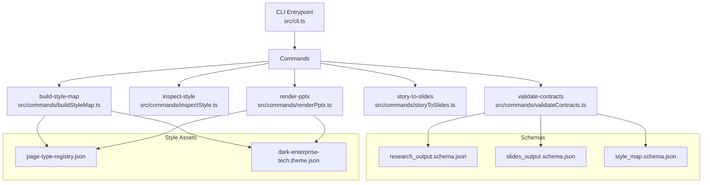
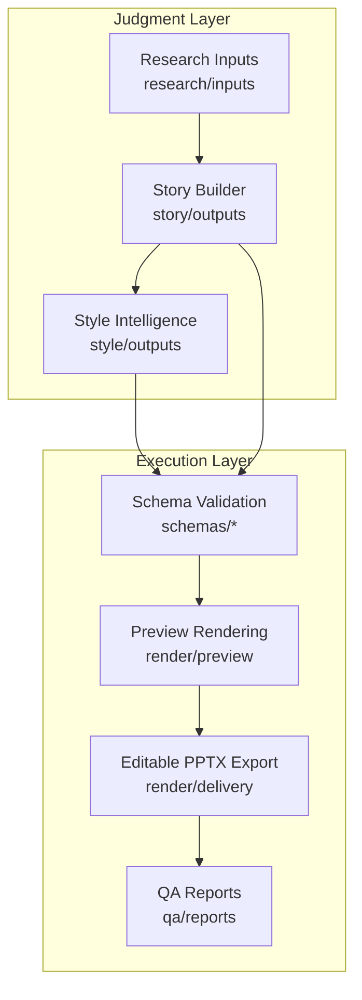
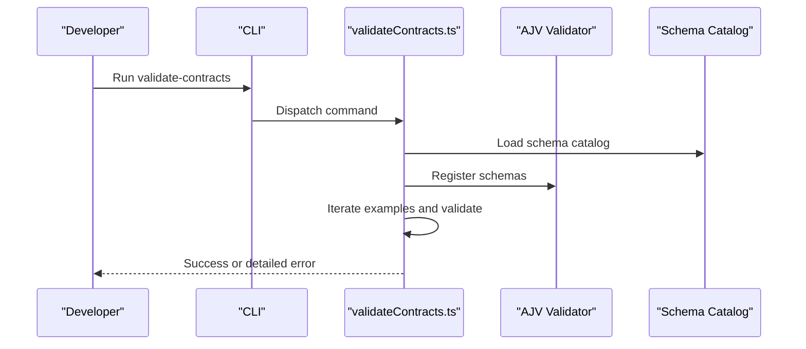
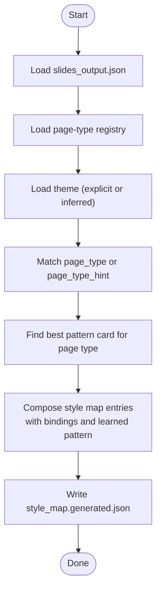
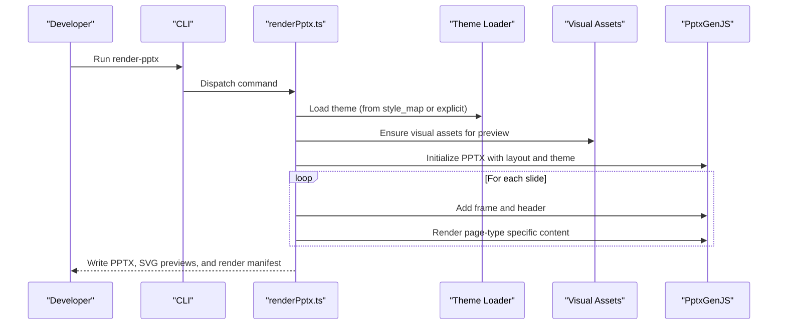
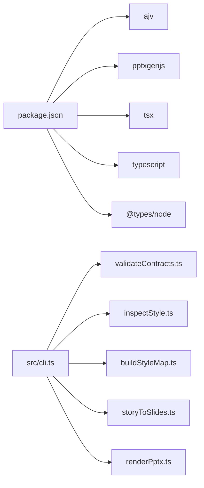

# Getting Started

<cite>
**Referenced Files in This Document**
- [README.md](file://README.md)
- [PROJECT_INIT.md](file://PROJECT_INIT.md)
- [PROJECT_BLUEPRINT.md](file://PROJECT_BLUEPRINT.md)
- [package.json](file://package.json)
- [src/cli.ts](file://src/cli.ts)
- [src/commands/validateContracts.ts](file://src/commands/validateContracts.ts)
- [src/commands/inspectStyle.ts](file://src/commands/inspectStyle.ts)
- [src/commands/buildStyleMap.ts](file://src/commands/buildStyleMap.ts)
- [src/commands/storyToSlides.ts](file://src/commands/storyToSlides.ts)
- [src/commands/renderPptx.ts](file://src/commands/renderPptx.ts)
- [schemas/research_output.schema.json](file://schemas/research_output.schema.json)
- [schemas/slides_output.schema.json](file://schemas/slides_output.schema.json)
- [schemas/style_map.schema.json](file://schemas/style_map.schema.json)
- [style/patterns/page-type-registry.json](file://style/patterns/page-type-registry.json)
- [style/themes/dark-enterprise-tech.theme.json](file://style/themes/dark-enterprise-tech.theme.json)
</cite>

## Table of Contents
1. [Introduction](#introduction)
2. [Project Structure](#project-structure)
3. [Core Components](#core-components)
4. [Architecture Overview](#architecture-overview)
5. [Detailed Component Analysis](#detailed-component-analysis)
6. [Dependency Analysis](#dependency-analysis)
7. [Performance Considerations](#performance-considerations)
8. [Troubleshooting Guide](#troubleshooting-guide)
9. [Conclusion](#conclusion)
10. [Appendices](#appendices)

## Introduction
This guide helps you install and run the Enterprise PPT System bootstrap, validate contracts, build style maps, and render editable PowerPoint decks. It covers prerequisites, environment setup, CLI usage, and a step-by-step workflow from research input to final PPTX output. The system is designed around structured JSON contracts, schema validation, a style intelligence layer, and deterministic rendering to editable PPTX.

## Project Structure
The repository is organized into modules that reflect the layered design: research, story, style, render, and QA. Key directories and files include:
- src/commands: CLI command implementations
- schemas/: JSON Schemas and example outputs
- style/: page-type registry, themes, and patterns
- research/, story/, render/, qa/: module-specific inputs, outputs, and artifacts
- output/: preview, delivery, and QA reports
- docs/: architecture, decisions, and workflows

**Diagram sources**
- [src/cli.ts:1-57](file://src/cli.ts#L1-L57)
- [src/commands/validateContracts.ts:1-100](file://src/commands/validateContracts.ts#L1-L100)
- [src/commands/buildStyleMap.ts:1-110](file://src/commands/buildStyleMap.ts#L1-L110)
- [src/commands/renderPptx.ts:1-801](file://src/commands/renderPptx.ts#L1-L801)
- [schemas/research_output.schema.json:1-88](file://schemas/research_output.schema.json#L1-L88)
- [schemas/slides_output.schema.json:1-53](file://schemas/slides_output.schema.json#L1-L53)
- [schemas/style_map.schema.json:1-70](file://schemas/style_map.schema.json#L1-L70)
- [style/patterns/page-type-registry.json:1-115](file://style/patterns/page-type-registry.json#L1-L115)
- [style/themes/dark-enterprise-tech.theme.json:1-55](file://style/themes/dark-enterprise-tech.theme.json#L1-L55)

**Section sources**
- [README.md:1-38](file://README.md#L1-L38)
- [PROJECT_BLUEPRINT.md:46-47](file://PROJECT_BLUEPRINT.md#L46-L47)

## Core Components
- CLI: Central command router with help and error handling.
- Validation: Loads schemas and validates example datasets.
- Style inspection: Lists theme and MVP page types.
- Story builder: Converts research into a storyline and structured slides.
- Style mapper: Builds a style map from slides and registry.
- Renderer: Produces editable PPTX and SVG previews.

**Section sources**
- [src/cli.ts:1-57](file://src/cli.ts#L1-L57)
- [src/commands/validateContracts.ts:1-100](file://src/commands/validateContracts.ts#L1-L100)
- [src/commands/inspectStyle.ts:1-14](file://src/commands/inspectStyle.ts#L1-L14)
- [src/commands/storyToSlides.ts:1-166](file://src/commands/storyToSlides.ts#L1-L166)
- [src/commands/buildStyleMap.ts:1-110](file://src/commands/buildStyleMap.ts#L1-L110)
- [src/commands/renderPptx.ts:1-801](file://src/commands/renderPptx.ts#L1-L801)

## Architecture Overview
The system follows a layered pipeline:
- Judgment layer: research, story, and style intelligence
- Execution layer: validation, preview rendering, editable PPTX export, QA
- Editable delivery: native PPT objects via PptxGenJS

**Diagram sources**
- [PROJECT_BLUEPRINT.md:26-44](file://PROJECT_BLUEPRINT.md#L26-L44)
- [PROJECT_BLUEPRINT.md:46-47](file://PROJECT_BLUEPRINT.md#L46-L47)

## Detailed Component Analysis

### Installation and Environment Setup
- Prerequisites
  - Node.js runtime compatible with the project’s TypeScript/ES module configuration.
  - npm scripts configured to use tsx for running TypeScript CLI entrypoints.
- Install dependencies
  - Run the standard npm install to fetch runtime and dev dependencies.
- Verify installation
  - Confirm CLI help prints available commands.

What to expect
- The package.json defines scripts that invoke the CLI with tsx.
- The CLI routes commands and prints help when invoked without arguments or with help.

**Section sources**
- [package.json:6-12](file://package.json#L6-L12)
- [src/cli.ts:39-50](file://src/cli.ts#L39-L50)

### Step-by-Step Workflow

#### Step 1: Validate Contracts
Goal: Ensure your structured inputs conform to schemas before proceeding.

- Run the validation script to check example datasets against schemas.
- The validator loads the schema catalog and iterates through example files, reporting validation errors with detailed messages.

**Diagram sources**
- [src/cli.ts:19-37](file://src/cli.ts#L19-L37)
- [src/commands/validateContracts.ts:1-100](file://src/commands/validateContracts.ts#L1-L100)

**Section sources**
- [src/commands/validateContracts.ts:26-98](file://src/commands/validateContracts.ts#L26-L98)
- [schemas/research_output.schema.json:1-88](file://schemas/research_output.schema.json#L1-L88)
- [schemas/slides_output.schema.json:1-53](file://schemas/slides_output.schema.json#L1-L53)
- [schemas/style_map.schema.json:1-70](file://schemas/style_map.schema.json#L1-L70)

#### Step 2: Inspect Style
Goal: Understand the current theme and available MVP page types.

- Run the inspect-style command to print theme metadata and the list of MVP page types.

**Section sources**
- [src/commands/inspectStyle.ts:1-14](file://src/commands/inspectStyle.ts#L1-L14)
- [style/patterns/page-type-registry.json:1-115](file://style/patterns/page-type-registry.json#L1-L115)
- [style/themes/dark-enterprise-tech.theme.json:1-55](file://style/themes/dark-enterprise-tech.theme.json#L1-L55)

#### Step 3: Build Style Map
Goal: Bind slides to page types, themes, and visual anchors.

- Provide the path to slides output and optionally an output path and theme ID.
- The command loads the page-type registry, resolves a theme, and writes a style map with component bindings and learned patterns.

**Diagram sources**
- [src/commands/buildStyleMap.ts:50-109](file://src/commands/buildStyleMap.ts#L50-L109)
- [style/patterns/page-type-registry.json:1-115](file://style/patterns/page-type-registry.json#L1-L115)

**Section sources**
- [src/commands/buildStyleMap.ts:50-109](file://src/commands/buildStyleMap.ts#L50-L109)

#### Step 4: Story to Slides
Goal: Generate a scaffold storyline and slides from research.

- Provide the path to research output and optional output paths for storyline and slides.
- The command writes structured JSON outputs suitable for style mapping and rendering.

**Section sources**
- [src/commands/storyToSlides.ts:12-165](file://src/commands/storyToSlides.ts#L12-L165)

#### Step 5: Render PPTX
Goal: Produce editable PPTX and SVG previews.

- Provide the paths to slides output and style map, and optionally theme file, output PPTX path, preview directory, and manifest output.
- The renderer creates a PPTX deck, adds frames and headers, renders page-type-specific content, and writes a render manifest.

**Diagram sources**
- [src/cli.ts:19-37](file://src/cli.ts#L19-L37)
- [src/commands/renderPptx.ts:83-187](file://src/commands/renderPptx.ts#L83-L187)

**Section sources**
- [src/commands/renderPptx.ts:94-187](file://src/commands/renderPptx.ts#L94-L187)

### Essential CLI Commands and Usage Patterns
- validate-contracts
  - Validates example datasets against schemas.
- inspect-style
  - Prints theme and MVP page types.
- build-style-map
  - Builds style_map.json from slides output.
- story-to-slides
  - Generates scaffold storyline and slides from research.
- render-pptx
  - Renders editable PPTX and SVG previews from slides and style map.

For command-specific options, run the CLI with help or refer to the command signatures.

**Section sources**
- [src/cli.ts:39-50](file://src/cli.ts#L39-L50)
- [package.json:6-12](file://package.json#L6-L12)

## Dependency Analysis
- Runtime dependencies
  - AJV for schema validation
  - PptxGenJS for editable PPTX export
- Dev dependencies
  - TypeScript, tsx, and @types/node for development and scripting
- Internal dependencies
  - CLI routes to command handlers
  - Commands depend on schema catalogs, style loaders, and render helpers

**Diagram sources**
- [package.json:14-22](file://package.json#L14-L22)
- [src/cli.ts:1-6](file://src/cli.ts#L1-L6)

**Section sources**
- [package.json:14-22](file://package.json#L14-L22)
- [src/cli.ts:1-6](file://src/cli.ts#L1-L6)

## Performance Considerations
- Keep slide counts manageable during early iterations to reduce render time.
- Reuse style maps and themes to minimize repeated loading overhead.
- Prefer incremental rerenders by targeting specific slide IDs when supported by your workflow.

## Troubleshooting Guide
Common issues and resolutions:
- Unknown command or missing arguments
  - Use the CLI help to list commands and required arguments.
- Validation failures
  - Review the detailed error messages printed by the validator and align your inputs with the schema definitions.
- Missing page type or style map mismatch
  - Ensure slides include page_type or page_type_hint and that the style map matches slide IDs.
- PPTX output conflicts
  - The renderer appends timestamps to filenames if the target exists; confirm the written path in the manifest.

**Section sources**
- [src/cli.ts:22-36](file://src/cli.ts#L22-L36)
- [src/commands/validateContracts.ts:85-98](file://src/commands/validateContracts.ts#L85-L98)
- [src/commands/buildStyleMap.ts:66-74](file://src/commands/buildStyleMap.ts#L66-L74)
- [src/commands/renderPptx.ts:111-113](file://src/commands/renderPptx.ts#L111-L113)
- [src/commands/renderPptx.ts:791-800](file://src/commands/renderPptx.ts#L791-L800)

## Conclusion
You now have the essentials to install the system, validate contracts, build style maps, and render editable PPTX decks. Continue by exploring the module boundaries, schema contracts, and style assets to deepen your understanding and customize the pipeline for your needs.

## Appendices

### Environment Configuration
- Node.js runtime and npm
- No additional environment variables are required by the CLI scripts.

**Section sources**
- [package.json:6-12](file://package.json#L6-L12)

### File Structure Expectations
- Inputs
  - research_output.json (validated by research_output.schema.json)
  - slides_output.json (validated by slides_output.schema.json)
- Outputs
  - style_map.json (validated by style_map.schema.json)
  - editable PPTX and SVG previews
  - render manifest

**Section sources**
- [schemas/research_output.schema.json:1-88](file://schemas/research_output.schema.json#L1-L88)
- [schemas/slides_output.schema.json:1-53](file://schemas/slides_output.schema.json#L1-L53)
- [schemas/style_map.schema.json:1-70](file://schemas/style_map.schema.json#L1-L70)
- [src/commands/renderPptx.ts:168-186](file://src/commands/renderPptx.ts#L168-L186)