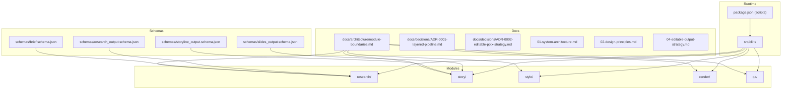
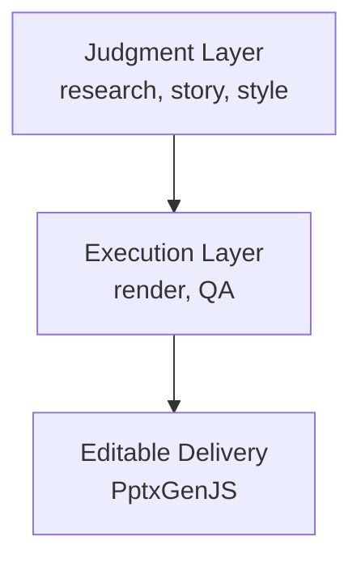
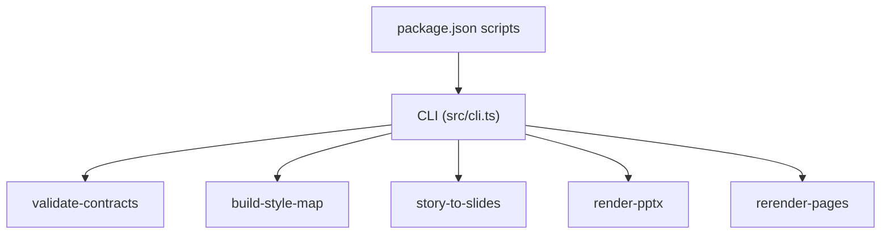

# Project Overview

<cite>
**Referenced Files in This Document**
- [README.md](file://README.md)
- [PROJECT_BLUEPRINT.md](file://PROJECT_BLUEPRINT.md)
- [01-system-architecture.md](file://01-system-architecture.md)
- [02-design-principles.md](file://02-design-principles.md)
- [04-editable-output-strategy.md](file://04-editable-output-strategy.md)
- [docs/architecture/module-boundaries.md](file://docs/architecture/module-boundaries.md)
- [docs/decisions/ADR-0001-layered-pipeline.md](file://docs/decisions/ADR-0001-layered-pipeline.md)
- [docs/decisions/ADR-0002-editable-pptx-strategy.md](file://docs/decisions/ADR-0002-editable-pptx-strategy.md)
- [package.json](file://package.json)
- [schemas\brief.schema.json](file://schemas/brief.schema.json)
- [schemas/research_output.schema.json](file://schemas/research_output.schema.json)
- [schemas/storyline_output.schema.json](file://schemas/storyline_output.schema.json)
- [schemas/slides_output.schema.json](file://schemas/slides_output.schema.json)
- [examples/pattern_card.example.json](file://examples/pattern_card.example.json)
</cite>

## Table of Contents
1. [Introduction](#introduction)
2. [Project Structure](#project-structure)
3. [Core Components](#core-components)
4. [Architecture Overview](#architecture-overview)
5. [Detailed Component Analysis](#detailed-component-analysis)
6. [Dependency Analysis](#dependency-analysis)
7. [Performance Considerations](#performance-considerations)
8. [Troubleshooting Guide](#troubleshooting-guide)
9. [Conclusion](#conclusion)
10. [Appendices](#appendices)

## Introduction
This repository is the design-stage skeleton for an enterprise PowerPoint production system. It captures the project’s purpose, current phase, and the foundational architecture that separates judgment from execution. The system is built around five core modules—research, story, style, render, and QA—each owning distinct responsibilities and producing inspectable, structured artifacts. The editable delivery strategy leverages native PPT objects via PptxGenJS to ensure that final decks remain fully editable and locally revisable.

Key goals:
- Treat the system as a production-grade workflow, not a one-shot generator.
- Keep judgment (research, story, page-type choice, critique) separate from execution (validation, preview, PPTX export, QA).
- Make editable PPTX a first-class delivery target.
- Learn reusable visual knowledge from strong reference decks and encode it as structured assets.

Current phase:
- Project modeling
- Repository planning
- Schema and contract definition
- Style asset planning
- MVP scoping

Scope highlights:
- Core modules: research, story, style, render, qa
- Layered pipeline: judgment layer (model-driven) and execution layer (deterministic)
- Editable delivery: native PPT objects via PptxGenJS
- System vision: a reusable, reviewable, and locally editable deck production system

**Section sources**
- [README.md:1-38](file://README.md#L1-L38)
- [PROJECT_BLUEPRINT.md:3-23](file://PROJECT_BLUEPRINT.md#L3-L23)
- [01-system-architecture.md:3-8](file://01-system-architecture.md#L3-L8)

## Project Structure
The repository organizes content into documentation, schemas, module directories, and runtime scripts. The CLI exposes commands for validating contracts, building style maps, converting story to slides, rendering PPTX, and rerendering pages. The schemas define the contracts for structured inputs and outputs across modules.

**Diagram sources**
- [docs/architecture/module-boundaries.md:1-151](file://docs/architecture/module-boundaries.md#L1-L151)
- [schemas\brief.schema.json:1-25](file://schemas/brief.schema.json#L1-L25)
- [schemas/research_output.schema.json:1-88](file://schemas/research_output.schema.json#L1-L88)
- [schemas/storyline_output.schema.json:1-49](file://schemas/storyline_output.schema.json#L1-L49)
- [schemas/slides_output.schema.json:1-53](file://schemas/slides_output.schema.json#L1-L53)
- [package.json:1-24](file://package.json#L1-L24)
- [src/cli.ts:1-57](file://src/cli.ts#L1-L57)

**Section sources**
- [README.md:17-22](file://README.md#L17-L22)
- [package.json:6-13](file://package.json#L6-L13)
- [src/cli.ts:10-17](file://src/cli.ts#L10-L17)

## Core Components
- Research: Produces a structured research report, fact base, and source map, keeping interpretation boundaries and risks explicit.
- Story: Translates research into a storyline and structured slide source, focusing on chapter logic, page claims, and narrative roles.
- Style: Preserves design memory and converts narrative intent into reusable visual decisions, including theme tokens, page-type registry, and pattern libraries.
- Render: Generates preview outputs and editable PPTX from structured slide content and style decisions, with deterministic layout and rerender support.
- QA: Validates content, story, visual, and export integrity, producing reproducible reports and fix lists.

These modules align with the layered pipeline: judgment layer (research, story, style) and execution layer (render, QA), with editable delivery as a first-class concern.

**Section sources**
- [PROJECT_BLUEPRINT.md:49-217](file://PROJECT_BLUEPRINT.md#L49-L217)
- [docs/architecture/module-boundaries.md:12-151](file://docs/architecture/module-boundaries.md#L12-L151)
- [01-system-architecture.md:11-72](file://01-system-architecture.md#L11-L72)

## Architecture Overview
The system enforces a strict separation between judgment and execution. Judgment responsibilities include research extraction, audience adaptation, storyline construction, page-type selection, and critique. Execution responsibilities include schema validation, style token resolution, deterministic layout calculation, preview rendering, editable PPTX export, local rerender, and export QA.

**Diagram sources**
- [01-system-architecture.md:3-8](file://01-system-architecture.md#L3-L8)
- [PROJECT_BLUEPRINT.md:26-45](file://PROJECT_BLUEPRINT.md#L26-L45)

**Section sources**
- [01-system-architecture.md:3-8](file://01-system-architecture.md#L3-L8)
- [PROJECT_BLUEPRINT.md:26-45](file://PROJECT_BLUEPRINT.md#L26-L45)

## Detailed Component Analysis

### Research Layer
Responsibilities:
- Extract facts, interpret boundaries, tag risks, and assemble a source map.
- Separate factual claims from interpretations and constraints.
- Provide structured inputs for downstream modules.

Design notes:
- Inputs include topic, audience, industry, objective, constraints, and source materials.
- Outputs include research_output.json and source_map.md.
- Must not own slide ordering, page-type choice, theme, or rendering logic.

Practical example:
- A research intake format with required fields ensures downstream story and style modules receive consistent, verifiable inputs.

**Section sources**
- [PROJECT_BLUEPRINT.md:51-80](file://PROJECT_BLUEPRINT.md#L51-L80)
- [docs/architecture/module-boundaries.md:13-35](file://docs/architecture/module-boundaries.md#L13-L35)
- [schemas\brief.schema.json:8-22](file://schemas/brief.schema.json#L8-L22)
- [schemas/research_output.schema.json:7-85](file://schemas/research_output.schema.json#L7-L85)

### Story Layer
Responsibilities:
- Convert research into chapter logic, page sequence, and structured slide content.
- Define one primary claim per slide and narrative roles.
- Emit semantic layout hints at the narrative level.

Design notes:
- Inputs: research_output.json, brief and audience model, optional reference extraction.
- Outputs: storyline_output.json and slides_output.json.
- Must not own theme tokens, visual geometry, or PPTX export logic.

Practical example:
- A structured slide source with per-slide claims and layout hints enables precise style binding and rendering.

**Section sources**
- [PROJECT_BLUEPRINT.md:81-106](file://PROJECT_BLUEPRINT.md#L81-L106)
- [docs/architecture/module-boundaries.md:37-61](file://docs/architecture/module-boundaries.md#L37-L61)
- [schemas/storyline_output.schema.json:8-46](file://schemas/storyline_output.schema.json#L8-L46)
- [schemas/slides_output.schema.json:8-51](file://schemas/slides_output.schema.json#L8-L51)

### Style Intelligence Layer
Responsibilities:
- Bind page types to narrative intent and resolve theme tokens.
- Maintain a pattern library and component definitions.
- Learn reusable layout and visual-expression knowledge from reference decks.

Design notes:
- Inputs: page-type hints, audience tone, theme family, reference patterns.
- Outputs: style_map.json, theme.json, pattern cards, component definitions.
- Must not own research facts, chapter logic, or final rendering.

Practical example:
- Pattern cards encode visual anchors, layout rules, alignment rules, and component recipes, enabling consistent reuse across decks.

**Section sources**
- [PROJECT_BLUEPRINT.md:107-136](file://PROJECT_BLUEPRINT.md#L107-L136)
- [docs/architecture/module-boundaries.md:62-85](file://docs/architecture/module-boundaries.md#L62-L85)
- [examples/pattern_card.example.json:1-54](file://examples/pattern_card.example.json#L1-L54)

### Renderer Layer
Responsibilities:
- Turn structured slide content and style decisions into preview and editable outputs.
- Provide deterministic layout calculation and local rerender capabilities.
- Generate versioned outputs and manifests.

Design notes:
- Inputs: slides_output.json, style_map.json, theme.json.
- Outputs: preview HTML/PNG, editable PPTX, render manifest.
- Must not own factual interpretation, storyline rewriting, or design memory authoring.

Practical example:
- Using PptxGenJS to map page types to native slide objects ensures text remains editable and major shapes/charts remain as native objects.

**Section sources**
- [PROJECT_BLUEPRINT.md:168-193](file://PROJECT_BLUEPRINT.md#L168-L193)
- [docs/architecture/module-boundaries.md:111-133](file://docs/architecture/module-boundaries.md#L111-L133)
- [04-editable-output-strategy.md:36-59](file://04-editable-output-strategy.md#L36-L59)

### QA Layer
Responsibilities:
- Verify factual defensibility, narrative quality, visual intentionality, and export integrity.
- Produce reproducible QA reports and fix lists.

Design notes:
- Inputs: rendered outputs, structured content, source map.
- Outputs: qa_report.json, review checklist, fix list.
- Must not own direct slide generation or primary research generation.

Practical example:
- A QA checklist and automated checks help catch common failures early and maintain consistency across decks.

**Section sources**
- [PROJECT_BLUEPRINT.md:194-217](file://PROJECT_BLUEPRINT.md#L194-L217)
- [docs/architecture/module-boundaries.md:134-151](file://docs/architecture/module-boundaries.md#L134-L151)

## Dependency Analysis
The system relies on structured JSON contracts to maintain module independence and enable local rerendering. The CLI orchestrates commands for validation, style mapping, story-to-slides conversion, PPTX rendering, and targeted page rerenders. The editable delivery strategy depends on PptxGenJS to preserve semantic page types and native object fidelity.

**Diagram sources**
- [package.json:6-13](file://package.json#L6-L13)
- [src/cli.ts:10-17](file://src/cli.ts#L10-L17)

**Section sources**
- [package.json:14-16](file://package.json#L14-L16)
- [src/cli.ts:19-37](file://src/cli.ts#L19-L37)

## Performance Considerations
- Keep preview and delivery paths separate but consistent, sharing the page-type registry and theme token system.
- Favor deterministic layout calculation and local rerender to minimize rebuild costs.
- Maintain structured JSON as the single source of truth to avoid recomputation overhead.
- Use schema validation to fail fast and reduce downstream errors.

[No sources needed since this section provides general guidance]

## Troubleshooting Guide
Common issues and remedies:
- Drift between preview and delivery: ensure shared page-type rules and theme token resolution across both renderers.
- Mixed story and rendering responsibilities: keep slides_output free of visual geometry; style binds page types and resolves components.
- Loss of editability: use native PPT objects via PptxGenJS; avoid full-slide raster images as the only delivery mode.
- QA bottlenecks: codify visual defects as concrete checks and keep QA reports reproducible.

**Section sources**
- [01-system-architecture.md:85-97](file://01-system-architecture.md#L85-L97)
- [04-editable-output-strategy.md:28-59](file://04-editable-output-strategy.md#L28-L59)
- [docs/architecture/module-boundaries.md:123-133](file://docs/architecture/module-boundaries.md#L123-L133)

## Conclusion
This skeleton establishes a layered, contract-driven foundation for an enterprise PowerPoint production system. By separating judgment from execution and prioritizing editable delivery, the system supports reviewability, local revision, and reuse across decks. The schema-defined contracts and module boundaries enable teams to incrementally build capability while maintaining consistency and traceability.

[No sources needed since this section summarizes without analyzing specific files]

## Appendices

### Canonical Data Flow
The system follows a predictable pipeline from structured inputs to inspectable outputs and editable delivery.

**Diagram sources**
- [PROJECT_BLUEPRINT.md:47](file://PROJECT_BLUEPRINT.md#L47)
- [docs/architecture/module-boundaries.md:7](file://docs/architecture/module-boundaries.md#L7)

### Practical Examples and Use Cases
- Executive strategy deck: Use the dark enterprise tech theme and a curated set of page types to produce a consistent, editable deck for leadership reviews.
- Local rerender workflow: Edit slides_output.json, rerender only affected pages, and rebuild the PPTX to incorporate last-minute changes.
- Style evolution: Update pattern cards and theme tokens, then rerun style mapping and rendering to refresh visual decisions without rewriting content.

**Section sources**
- [PROJECT_BLUEPRINT.md:411-422](file://PROJECT_BLUEPRINT.md#L411-L422)
- [04-editable-output-strategy.md:44-49](file://04-editable-output-strategy.md#L44-L49)
- [examples/pattern_card.example.json:1-54](file://examples/pattern_card.example.json#L1-L54)