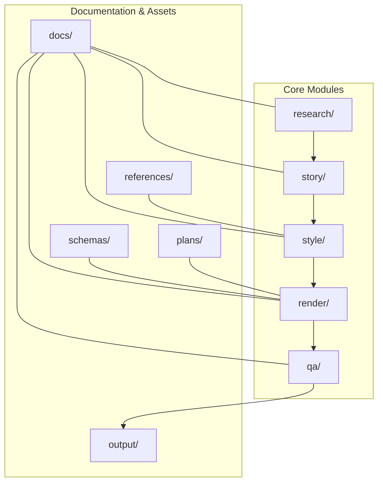
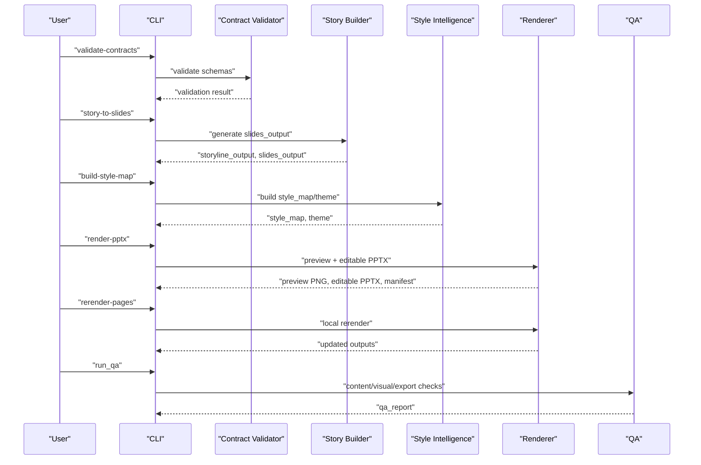
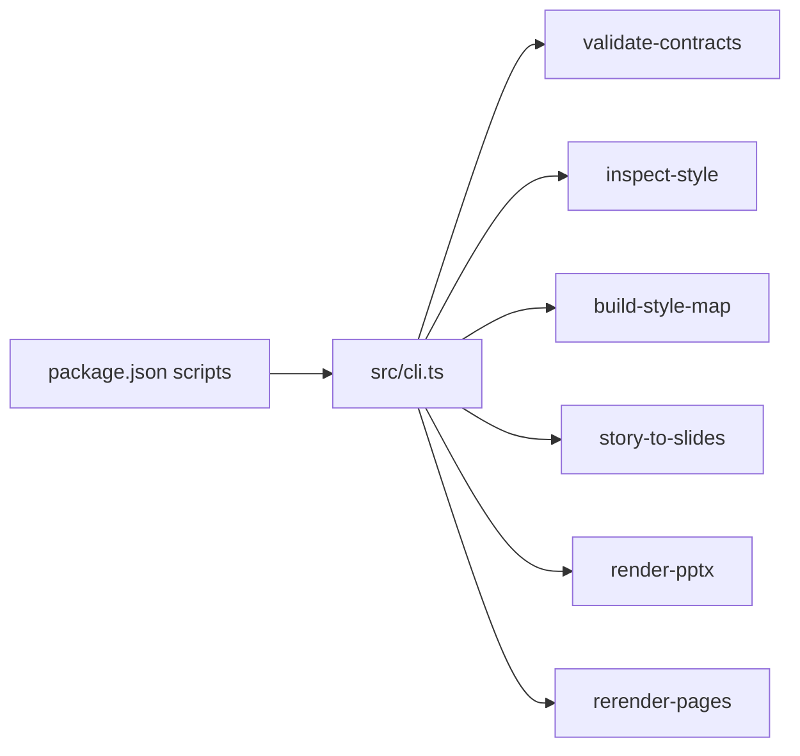

# Roadmap and Future Plans

<cite>
**Referenced Files in This Document**
- [mvp-roadmap.md](file://plans/mvp-roadmap.md)
- [fast-track-mvp.md](file://docs/workflows/fast-track-mvp.md)
- [mvp-scope.md](file://docs/workflows/mvp-scope.md)
- [deck-learning-system.md](file://docs/architecture/deck-learning-system.md)
- [PROJECT_BLUEPRINT.md](file://PROJECT_BLUEPRINT.md)
- [module-boundaries.md](file://docs/architecture/module-boundaries.md)
- [01-system-architecture.md](file://01-system-architecture.md)
- [market-gap.md](file://references/market-gap.md)
- [quality-bar.md](file://references/quality-bar.md)
- [skill-split.md](file://references/skill-split.md)
- [ADR-0003-fast-track-mvp.md](file://docs/decisions/ADR-0003-fast-track-mvp.md)
- [cli.ts](file://src/cli.ts)
- [package.json](file://package.json)
- [README.md](file://README.md)
</cite>

## Table of Contents
1. [Introduction](#introduction)
2. [Project Structure](#project-structure)
3. [Core Components](#core-components)
4. [Architecture Overview](#architecture-overview)
5. [Detailed Component Analysis](#detailed-component-analysis)
6. [Dependency Analysis](#dependency-analysis)
7. [Performance Considerations](#performance-considerations)
8. [Troubleshooting Guide](#troubleshooting-guide)
9. [Conclusion](#conclusion)
10. [Appendices](#appendices)

## Introduction
This document outlines the project roadmap and future development plans for an enterprise presentation production system. It consolidates the current MVP implementation timeline, feature expansion plans, and long-term evolution strategy. It also explains the market gap analysis, identified opportunities, and competitive positioning, followed by a phased development approach from MVP to full enterprise implementation. The plan addresses technical debt reduction, performance optimization, scalability enhancements, integration possibilities with existing enterprise systems, API expansion potential, customization capabilities, risk mitigation strategies, resource allocation plans, and success metrics for each development phase.

## Project Structure
The repository is organized around five core modules and associated documentation, schemas, and assets:
- research: upstream knowledge intake and validation
- story: narrative construction and structured slide source
- style: theme tokens, page-type registry, pattern cards, and reference extractions
- render: preview and editable PPTX delivery
- qa: content, visual, and export quality assurance
- docs: architecture, decisions, and workflows
- schemas: canonical contracts for data interchange
- references: quality bar, skill split, market gap, and curated assets
- plans: roadmap and scope documents
- output: versioned preview, delivery, and QA artifacts

**Diagram sources**
- [module-boundaries.md:1-151](file://docs/architecture/module-boundaries.md#L1-L151)
- [01-system-architecture.md:1-106](file://01-system-architecture.md#L1-L106)
- [PROJECT_BLUEPRINT.md:218-276](file://PROJECT_BLUEPRINT.md#L218-L276)

**Section sources**
- [README.md:17-23](file://README.md#L17-L23)
- [PROJECT_BLUEPRINT.md:218-276](file://PROJECT_BLUEPRINT.md#L218-L276)

## Core Components
- Judgment layer (research, story, style intelligence): responsible for editorial judgment, audience adaptation, storyline construction, page-type selection, and design critique.
- Execution layer (renderer, QA): responsible for schema validation, style token resolution, deterministic layout calculation, preview rendering, editable PPTX export, local rerender, and export QA.
- Data contracts: canonical schemas define the data flow from brief to research output, storyline output, slides output, style map/theme, preview, editable PPTX, and QA report.
- CLI and scripts: provide command-driven workflows for validation, style mapping, story-to-slides conversion, rendering, and rerendering.

Key implementation pointers:
- CLI exposes commands for validation, style inspection, building style maps, story-to-slides conversion, rendering PPTX, and rerendering pages.
- Package scripts wrap CLI commands for developer ergonomics.

**Section sources**
- [01-system-architecture.md:3-106](file://01-system-architecture.md#L3-L106)
- [module-boundaries.md:6-151](file://docs/architecture/module-boundaries.md#L6-L151)
- [PROJECT_BLUEPRINT.md:278-374](file://PROJECT_BLUEPRINT.md#L278-L374)
- [cli.ts:10-50](file://src/cli.ts#L10-L50)
- [package.json:6-12](file://package.json#L6-L12)

## Architecture Overview
The system enforces a strict separation between judgment and execution. The canonical flow moves from structured research input through storyline generation, structured slide content, style mapping and theming, preview rendering, editable PPTX export, and QA reporting. The module boundaries ensure that each layer owns its responsibilities and does not encroach on others, preserving revisability and testability.

**Diagram sources**
- [cli.ts:10-50](file://src/cli.ts#L10-L50)
- [module-boundaries.md:6-151](file://docs/architecture/module-boundaries.md#L6-L151)
- [PROJECT_BLUEPRINT.md:46-217](file://PROJECT_BLUEPRINT.md#L46-L217)

**Section sources**
- [01-system-architecture.md:73-83](file://01-system-architecture.md#L73-L83)
- [module-boundaries.md:6-11](file://docs/architecture/module-boundaries.md#L6-L11)
- [PROJECT_BLUEPRINT.md:46-217](file://PROJECT_BLUEPRINT.md#L46-L217)

## Detailed Component Analysis

### MVP Implementation Timeline
The MVP roadmap is divided into six phases, each with deliverables and exit criteria aligned with the fast-track, delivery-first approach.

- Phase 0: Foundations
  - Deliverables: project structure, schemas, theme token format, page-type registry.
- Phase 1: Deep Research Input
  - Deliverables: research output schema, source map format, research-to-story handoff format.
- Phase 2: Story Builder
  - Deliverables: storyline generator, slide content generator, chapter/page validation rules.
- Phase 3: Style Binding
  - Deliverables: fixed dark-tech theme, 8 controlled page types, rule-based style binding from page_type_hint.
- Phase 4: Editable PPT Renderer
  - Deliverables: native PPT object mapping for priority page types, editable PPTX export, versioned outputs, local rerender for selected pages.
- Phase 5: Preview and QA
  - Deliverables: PNG preview rendered from PPTX output, content QA checklist, visual QA checklist, export QA checks.
- Phase 6: Deck Learning System
  - Deliverables: reference deck ingestion, slide decomposition format, pattern extraction cards, layout/alignment/image usage rules, benchmark gallery for renderer upgrades.

Exit criteria for MVP include narrative coherence, consistent rendering across 8 page types, working editable PPTX output, local page rerender capability, and QA catching common failures.

**Section sources**
- [mvp-roadmap.md:1-68](file://plans/mvp-roadmap.md#L1-L68)

### Fast-Track MVP Plan
The fast-track plan emphasizes shipping a usable enterprise PPT MVP quickly without sacrificing editability or basic quality. The chosen path locks one deck category, one theme family, 8 page types, PPTX-first rendering, preview generated from PPTX, and QA before style expansion. The build order progresses through contracts, story chain, style binding, delivery rendering, and preview/QA.

Priority page types include cover_orbit, narrative_map, trust_terminal, bottleneck_shift, layered_architecture_stack, scenario_flow, risk_split, and chapter_summary_signal.

Post-MVP direction focuses on adding a Deck Learning System to ingest strong reference decks, extract reusable layout and image rules, expand pattern cards, and feed learned rules back into style intelligence and renderer upgrades.

**Section sources**
- [fast-track-mvp.md:1-75](file://docs/workflows/fast-track-mvp.md#L1-L75)
- [mvp-roadmap.md:50-67](file://plans/mvp-roadmap.md#L50-L67)

### Deck Learning System
The Deck Learning System goal is to transform strong external decks into reusable page knowledge rather than static inspiration. It learns page types, layout skeletons, alignment logic, weight center, visual anchors, image usage, highlight grammar, and anti-patterns. The minimal workflow involves ingesting reference decks, extracting slides into reference_slide_extraction, merging repeated strong patterns into pattern_card, feeding extracted rules back into style intelligence, and verifying learned patterns via renderer upgrades and QA.

Storage model keeps raw reference assets in references/ or external storage, extracted cards in style/reference_extractions/, and reusable patterns in style/patterns/. The golden rule is to avoid storing only screenshots; instead, store why the page works, what should be reused, and what should not be copied literally.

**Section sources**
- [deck-learning-system.md:1-37](file://docs/architecture/deck-learning-system.md#L1-L37)

### Market Gap Analysis and Competitive Positioning
Existing PPT tools underperform because they optimize for generation speed rather than enterprise-grade expression quality. They usually solve template filling, surface-level content generation, generic layout composition, and quick visual output, but miss audience-specific editorial judgment, chapter-level logic, page-level expression choice, enterprise constraints and boundaries, editable delivery, revision loops, and a true style memory system.

The product implication is that a better system should compete on editorial judgment, page-type selection, stronger visual system, editable enterprise delivery, and repeatable QA rather than just one-click generation.

**Section sources**
- [market-gap.md:1-29](file://references/market-gap.md#L1-L29)

### Phased Development Approach: From MVP to Full Enterprise Implementation
The recommended approach starts with a strict layered MVP and defers broader style exploration and preview stack enhancements until after MVP. The development sequence and acceptance criteria are defined across foundation contracts, research handoff, story builder, style intelligence, preview renderer, editable PPT renderer, QA layer, and deck learning system.

Technical route options include:
- Recommended: TypeScript/JavaScript with structured JSON as source of truth, HTML preview renderer, PptxGenJS delivery renderer, shared page-type registry and theme token system.
- Unified intermediate layout model: layout AST between structured slide content and final renderers for maximum consistency.
- Temporary hybrid for complex visuals: native PPT objects for text/simple shapes/charts/tables, with some complex diagrams allowed as SVG.

MVP scope includes 16:9 layout, one theme family (dark enterprise tech), 8 priority page types, structured handoff from research to story to style to render, editable PPTX export, preview PNG derived from rendered PPTX, local rerender by slide id, content/visual/export QA, and semi-automatic style binding from page_type_hint.

Explicit out-of-scope items for MVP include arbitrary deck styles, all industries, full automated deep research crawler stack, image-only final delivery, no-review one-click production, standalone HTML preview renderer, full automatic page-type selection, generalized component library beyond MVP page types, and automated large-scale reference deck learning.

Success metrics for each phase emphasize reproducibility, narrative necessity, visual intentionality, factual defensibility, and local revisability.

**Section sources**
- [PROJECT_BLUEPRINT.md:447-540](file://PROJECT_BLUEPRINT.md#L447-L540)
- [PROJECT_BLUEPRINT.md:541-591](file://PROJECT_BLUEPRINT.md#L541-L591)
- [mvp-scope.md:1-44](file://docs/workflows/mvp-scope.md#L1-L44)
- [ADR-0003-fast-track-mvp.md:1-29](file://docs/decisions/ADR-0003-fast-track-mvp.md#L1-L29)

### Risk Mitigation Strategies
Main risks include:
- Style intelligence collapsing into template reuse if pattern cards are too weak
- Preview and PPTX outputs drifting if page-type rules are not shared
- Story and rendering getting mixed if slides_output contains visual geometry too early
- Editable PPT support being expensive for highly custom visual motifs
- QA remaining manual unless visual defects are encoded as concrete checks
- Deck learning degrading into screenshot collection if extraction is not structured

Open questions include the balance between in-repo deep research versus external skill input, whether style intelligence should choose page types directly or story builder should emit hints, the minimum set of native PPT components needed for premium enterprise pages, which complex visuals are allowed to stay as SVG in MVP, the first benchmark deck used as acceptance reference, and the minimum structured format for learned layout knowledge from reference decks.

Mitigations involve maintaining strict module boundaries, keeping page-type rules shared across preview and delivery, ensuring slides_output remains narrative-only, prioritizing structured extraction in deck learning, and encoding visual defects as concrete QA checks.

**Section sources**
- [PROJECT_BLUEPRINT.md:592-609](file://PROJECT_BLUEPRINT.md#L592-L609)

### Resource Allocation Plans
Skills and assets:
- Skills: deep-research, ppt-story-builder, ppt-style-renderer, ppt-style-memory, deck-learning
- Assets: theme token sets, component primitives, icon packs, background systems, approved illustration fragments, reference screenshots with metadata, extracted reference layouts, benchmark slide crops, learned image-placement recipes

Quality bar defines acceptance standards across content, story, visual, and export domains, ensuring a slide is acceptable only if it is narratively necessary, visually intentional, factually defensible, and locally revisable.

**Section sources**
- [PROJECT_BLUEPRINT.md:375-410](file://PROJECT_BLUEPRINT.md#L375-L410)
- [quality-bar.md:1-40](file://references/quality-bar.md#L1-L40)

### Integration Possibilities and API Expansion Potential
Integration with existing enterprise systems can leverage:
- Structured data contracts enabling handoffs between upstream research systems and downstream rendering pipelines
- Versioned outputs and manifests supporting CI/CD and audit trails
- Editable PPTX as a first-class delivery target compatible with enterprise workflows

API expansion potential includes:
- Extending CLI commands and scripts to support batch processing, remote orchestration, and plugin-like integrations
- Exposing core modules as libraries for embedding within larger enterprise toolchains
- Standardizing extraction and ingestion APIs for reference decks and pattern cards

Customization capabilities:
- Theme token system and page-type registry enable customization of visual systems
- Pattern cards and component definitions support iterative style improvements
- Local rerender enables targeted updates without rebuilding entire decks

**Section sources**
- [module-boundaries.md:6-151](file://docs/architecture/module-boundaries.md#L6-L151)
- [PROJECT_BLUEPRINT.md:353-374](file://PROJECT_BLUEPRINT.md#L353-L374)
- [cli.ts:10-50](file://src/cli.ts#L10-L50)
- [package.json:6-12](file://package.json#L6-L12)

### Scalability Enhancements and Technical Debt Reduction
Scalability enhancements include:
- Shared page-type registry and theme token system across preview and delivery renderers
- Deterministic layout calculation and versioned output directories
- Modular QA rules enabling regression checks and continuous improvement

Technical debt reduction strategies:
- Enforce strict separation of judgment and execution layers
- Maintain canonical data contracts and module boundaries
- Keep story and rendering decoupled by avoiding visual geometry in slides_output
- Preserve editable PPTX as the primary delivery format to reduce reliance on screenshot-backed slides

**Section sources**
- [01-system-architecture.md:3-106](file://01-system-architecture.md#L3-L106)
- [module-boundaries.md:6-151](file://docs/architecture/module-boundaries.md#L6-L151)
- [PROJECT_BLUEPRINT.md:541-591](file://PROJECT_BLUEPRINT.md#L541-L591)

## Dependency Analysis
The system’s dependencies center on the CLI, core commands, and the schema-driven data contracts. The CLI routes commands to specialized handlers for validation, style inspection, building style maps, story-to-slides conversion, rendering PPTX, and rerendering pages. Package scripts wrap these commands for developer ergonomics.

**Diagram sources**
- [cli.ts:10-50](file://src/cli.ts#L10-L50)
- [package.json:6-12](file://package.json#L6-L12)

**Section sources**
- [cli.ts:10-50](file://src/cli.ts#L10-L50)
- [package.json:6-12](file://package.json#L6-L12)

## Performance Considerations
- Keep preview and delivery paths separate but consistent by sharing page-type rules and theme tokens.
- Use a layered model to minimize cross-layer coupling and reduce rework during iterations.
- Favor deterministic layout calculations and versioned outputs to improve reproducibility and performance.
- Avoid heavy reliance on screenshot-backed slides; preserve editable PPTX to maintain performance and editability.

[No sources needed since this section provides general guidance]

## Troubleshooting Guide
Common issues and remedies:
- Drift between preview and delivery: ensure shared page-type rules and theme tokens across both renderers.
- Mixed story and rendering responsibilities: keep slides_output narrative-only and avoid embedding visual geometry.
- QA bottlenecks: encode visual defects as concrete checks to automate QA and reduce manual effort.
- Deck learning degradation: store structured reasoning alongside visual assets; avoid pure screenshot collections.

Quality bar provides concrete acceptance criteria across content, story, visual, and export domains.

**Section sources**
- [quality-bar.md:1-40](file://references/quality-bar.md#L1-L40)
- [PROJECT_BLUEPRINT.md:592-609](file://PROJECT_BLUEPRINT.md#L592-L609)

## Conclusion
The roadmap establishes a clear, phased path from MVP to full enterprise implementation. By focusing on a single deck category, a fixed theme family, and a core set of page types, the system delivers editable, reviewable, and locally revisable enterprise decks. The fast-track, delivery-first approach ensures early delivery value while preserving the ability to evolve toward broader style systems, automated learning, and scalable integrations. Strict module boundaries, canonical data contracts, and QA gates protect against technical debt and ensure consistent quality across iterations.

[No sources needed since this section summarizes without analyzing specific files]

## Appendices

### Appendix A: MVP Scope and Acceptance Criteria
- Scope: 16:9 layout, dark enterprise tech theme, 8 priority page types, structured handoff, editable PPTX export, preview PNG, local rerender, QA.
- Acceptance: validated research input, clear slide claims, consistent rendering, editable delivery, QA catching common defects.

**Section sources**
- [mvp-scope.md:3-44](file://docs/workflows/mvp-scope.md#L3-L44)

### Appendix B: Module Responsibilities and Boundaries
- Deep Research: produces research_output and source_map; must not decide slide order, geometry, theme, or final page type.
- Story Builder: produces storyline_output and slides_output; must not decide token-level style or PPT object mapping.
- Style Intelligence: produces style_map and theme; must not decide research facts or storyline.
- Renderer: produces preview HTML/PNG and editable PPTX; must not decide research interpretation or storyline.
- QA: produces qa_report and fix list; must not silently rewrite content or restyle pages.

**Section sources**
- [module-boundaries.md:12-151](file://docs/architecture/module-boundaries.md#L12-L151)

### Appendix C: Skills and Asset Inventory
- Skills: deep-research, ppt-story-builder, ppt-style-renderer, ppt-style-memory, deck-learning.
- Assets: theme tokens, component primitives, icon packs, backgrounds, approved illustrations, reference screenshots, extracted layouts, benchmark crops, learned image-placement recipes.

**Section sources**
- [skill-split.md:1-41](file://references/skill-split.md#L1-L41)
- [PROJECT_BLUEPRINT.md:389-399](file://PROJECT_BLUEPRINT.md#L389-L399)