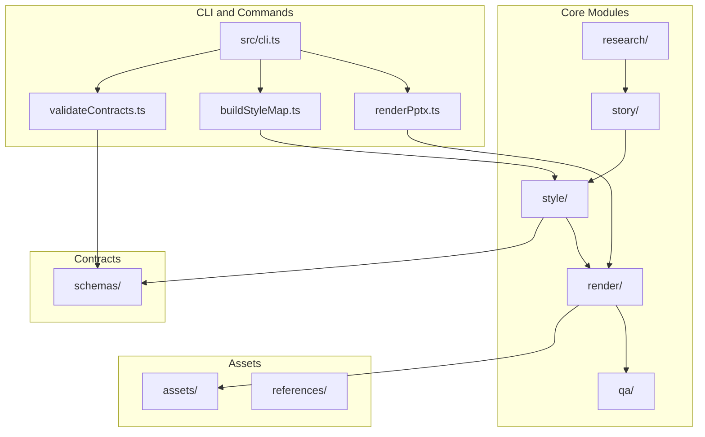
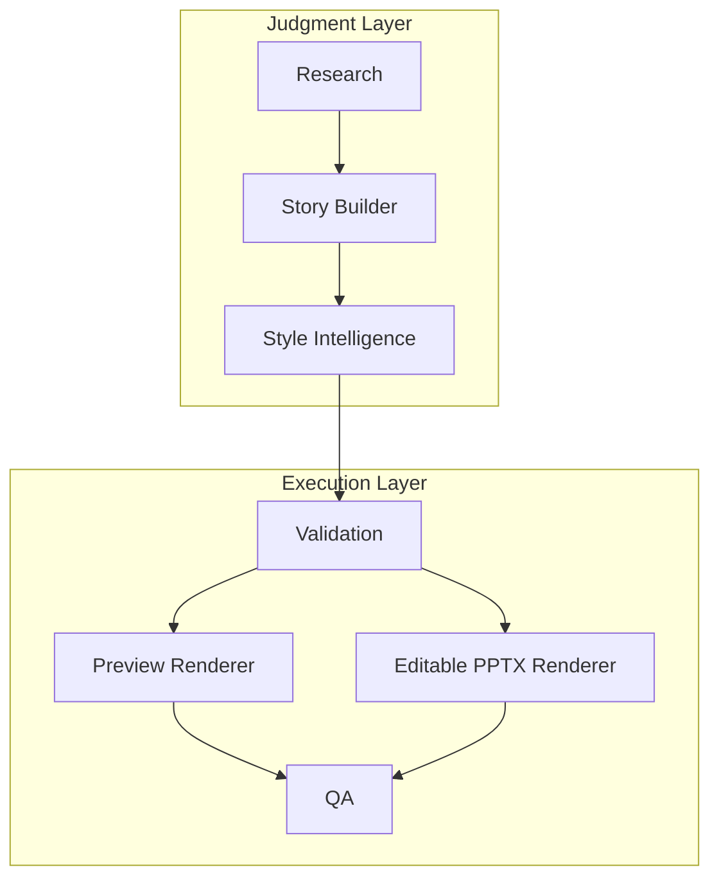
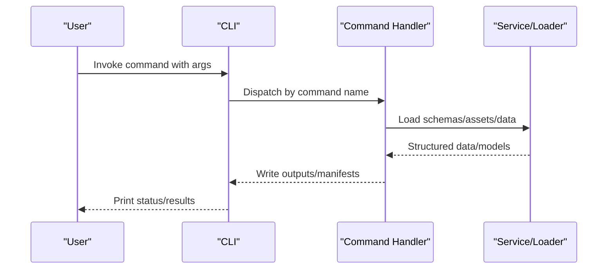
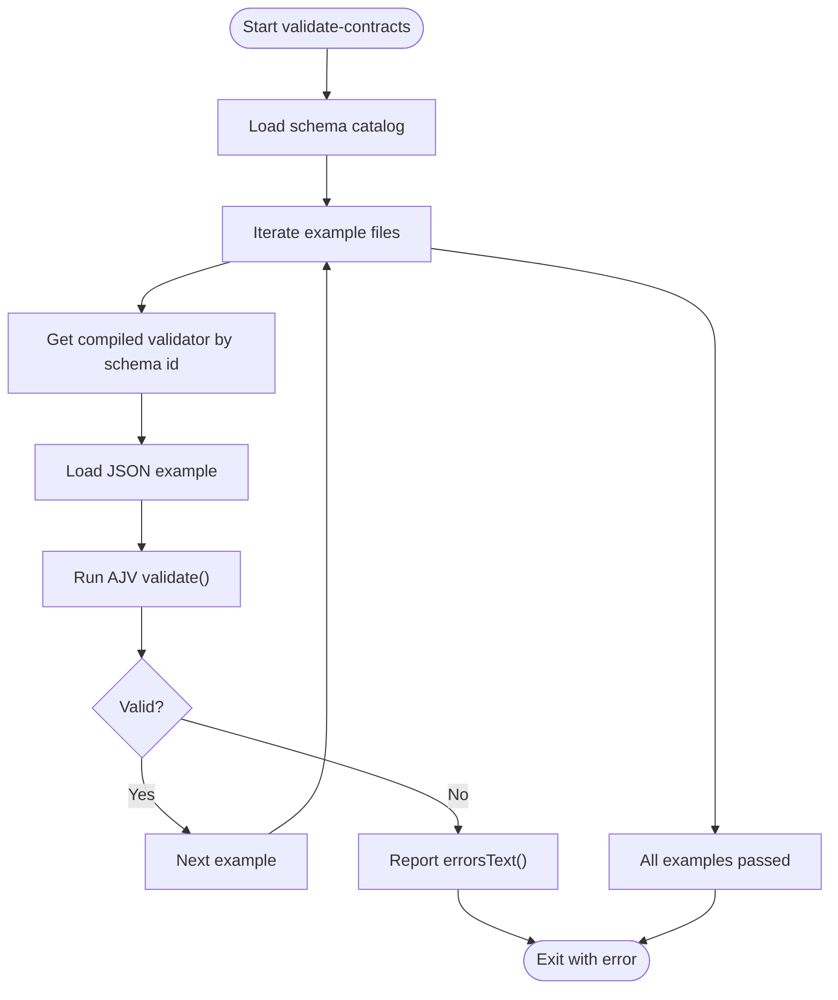
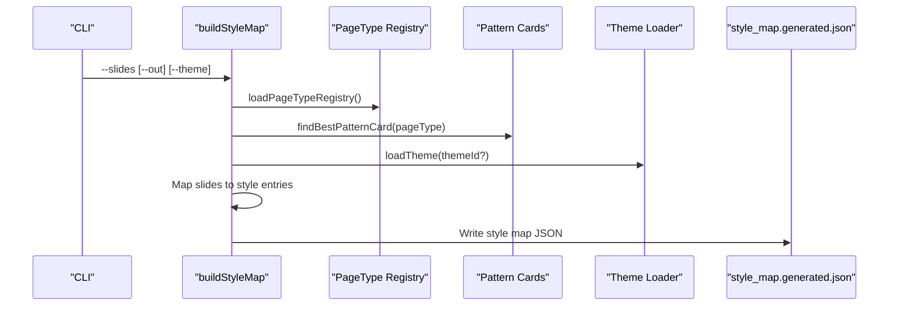
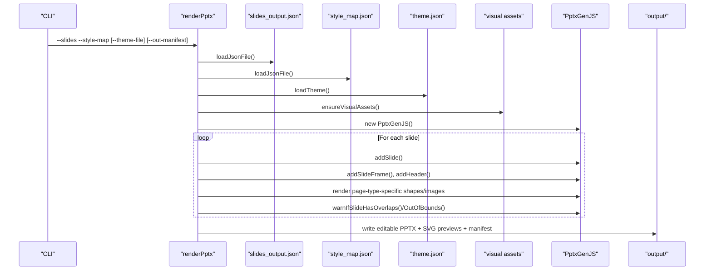
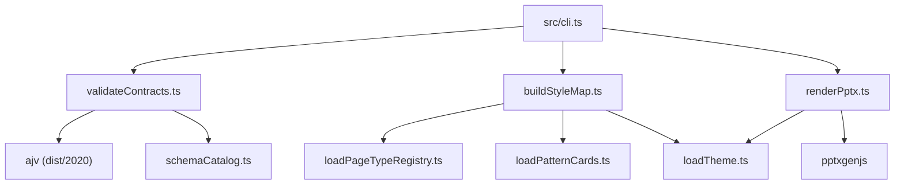

# System Architecture

<cite>
**Referenced Files in This Document**
- [README.md](file://README.md)
- [01-system-architecture.md](file://01-system-architecture.md)
- [02-design-principles.md](file://02-design-principles.md)
- [PROJECT_BLUEPRINT.md](file://PROJECT_BLUEPRINT.md)
- [src/cli.ts](file://src/cli.ts)
- [src/commands/validateContracts.ts](file://src/commands/validateContracts.ts)
- [src/commands/buildStyleMap.ts](file://src/commands/buildStyleMap.ts)
- [src/commands/renderPptx.ts](file://src/commands/renderPptx.ts)
- [src/lib/schemaCatalog.ts](file://src/lib/schemaCatalog.ts)
- [src/lib/style/loadPageTypeRegistry.ts](file://src/lib/style/loadPageTypeRegistry.ts)
- [src/lib/style/loadPatternCards.ts](file://src/lib/style/loadPatternCards.ts)
- [src/lib/style/loadTheme.ts](file://src/lib/style/loadTheme.ts)
- [schemas/research_output.schema.json](file://schemas/research_output.schema.json)
- [schemas/slides_output.schema.json](file://schemas/slides_output.schema.json)
- [package.json](file://package.json)
</cite>

## Table of Contents
1. [Introduction](#introduction)
2. [Project Structure](#project-structure)
3. [Core Components](#core-components)
4. [Architecture Overview](#architecture-overview)
5. [Detailed Component Analysis](#detailed-component-analysis)
6. [Dependency Analysis](#dependency-analysis)
7. [Performance Considerations](#performance-considerations)
8. [Troubleshooting Guide](#troubleshooting-guide)
9. [Conclusion](#conclusion)
10. [Appendices](#appendices)

## Introduction
This document describes the layered pipeline architecture of the Enterprise PPT System. It separates judgment from execution: the judgment layer (research, story, style) defines content and design intent, while the execution layer (validation, rendering, QA) enforces determinism, preview consistency, and editable delivery. The system uses schema-driven contracts, a style intelligence layer with reusable patterns, and PptxGenJS for editable PPTX output. The document also covers module boundaries, data flow, extensibility, scalability, and integration patterns.

## Project Structure
The repository is organized around five core layers and supporting assets:
- research/: structured intake and outputs for research artifacts
- story/: story building and structured slide source
- style/: themes, patterns, page-type registry, and style memory
- render/: preview and editable delivery pipeline
- qa/: QA rules and reports
- schemas/: JSON Schema contracts for all data exchanges
- docs/: architecture, decisions, and workflows
- assets/: UI primitives, backgrounds, icons
- references/: curated references and validated patterns
- examples/: example inputs and outputs for validation
- output/: preview, delivery, and QA artifacts

**Diagram sources**
- [src/cli.ts:1-57](file://src/cli.ts#L1-L57)
- [src/commands/validateContracts.ts:1-100](file://src/commands/validateContracts.ts#L1-L100)
- [src/commands/buildStyleMap.ts:1-110](file://src/commands/buildStyleMap.ts#L1-L110)
- [src/commands/renderPptx.ts:1-801](file://src/commands/renderPptx.ts#L1-L801)

**Section sources**
- [README.md:17-38](file://README.md#L17-L38)
- [PROJECT_BLUEPRINT.md:218-276](file://PROJECT_BLUEPRINT.md#L218-L276)

## Core Components
- Judgment layer
  - Research: produces structured research outputs with facts, interpretations, risks, constraints, and sources.
  - Story: converts research into chapter logic, page-by-page storyline, and structured slide content.
  - Style Intelligence: binds page types to reusable patterns, resolves theme tokens, and produces a style map.
- Execution layer
  - Validation: schema-driven validation of contracts across modules.
  - Rendering: HTML preview and editable PPTX via PptxGenJS.
  - QA: content, visual, and export checks with reproducible reports.

Key runtime components include the CLI, schema catalog, style loaders, and renderers.

**Section sources**
- [01-system-architecture.md:3-106](file://01-system-architecture.md#L3-L106)
- [02-design-principles.md:1-44](file://02-design-principles.md#L1-L44)
- [PROJECT_BLUEPRINT.md:26-45](file://PROJECT_BLUEPRINT.md#L26-L45)

## Architecture Overview
The system enforces a strict judgment-execution separation. Judgment components operate on structured, validated contracts and produce design-intent artifacts. Execution components consume these artifacts to produce preview and editable outputs, ensuring deterministic, reproducible, and reviewable results.

**Diagram sources**
- [01-system-architecture.md:98-106](file://01-system-architecture.md#L98-L106)
- [PROJECT_BLUEPRINT.md:26-45](file://PROJECT_BLUEPRINT.md#L26-L45)

## Detailed Component Analysis

### CLI and Command Flow
The CLI exposes commands for validation, style inspection, story-to-slides conversion, style map building, and PPTX rendering. Each command encapsulates a discrete stage in the pipeline.

**Diagram sources**
- [src/cli.ts:19-57](file://src/cli.ts#L19-L57)
- [src/commands/validateContracts.ts:7-100](file://src/commands/validateContracts.ts#L7-L100)
- [src/commands/buildStyleMap.ts:50-110](file://src/commands/buildStyleMap.ts#L50-L110)
- [src/commands/renderPptx.ts:83-187](file://src/commands/renderPptx.ts#L83-L187)

**Section sources**
- [src/cli.ts:1-57](file://src/cli.ts#L1-L57)
- [package.json:6-13](file://package.json#L6-L13)

### Schema-Driven Validation Architecture
Validation is centralized and schema-driven. The CLI invokes a validator that loads all schema entries and validates example datasets across modules.

**Diagram sources**
- [src/commands/validateContracts.ts:7-100](file://src/commands/validateContracts.ts#L7-L100)
- [src/lib/schemaCatalog.ts:12-24](file://src/lib/schemaCatalog.ts#L12-L24)

**Section sources**
- [src/commands/validateContracts.ts:1-100](file://src/commands/validateContracts.ts#L1-L100)
- [src/lib/schemaCatalog.ts:1-24](file://src/lib/schemaCatalog.ts#L1-L24)
- [schemas/research_output.schema.json:1-88](file://schemas/research_output.schema.json#L1-L88)
- [schemas/slides_output.schema.json:1-53](file://schemas/slides_output.schema.json#L1-L53)

### Style Intelligence and Style Map Building
The style map builder consumes structured slides, a page-type registry, and theme definitions to produce a style map with page-type bindings, visual anchors, density levels, and component bindings derived from pattern cards.

**Diagram sources**
- [src/commands/buildStyleMap.ts:50-110](file://src/commands/buildStyleMap.ts#L50-L110)
- [src/lib/style/loadPageTypeRegistry.ts:18-21](file://src/lib/style/loadPageTypeRegistry.ts#L18-L21)
- [src/lib/style/loadPatternCards.ts:39-49](file://src/lib/style/loadPatternCards.ts#L39-L49)
- [src/lib/style/loadTheme.ts:22-29](file://src/lib/style/loadTheme.ts#L22-L29)

**Section sources**
- [src/commands/buildStyleMap.ts:1-110](file://src/commands/buildStyleMap.ts#L1-L110)
- [src/lib/style/loadPageTypeRegistry.ts:1-21](file://src/lib/style/loadPageTypeRegistry.ts#L1-L21)
- [src/lib/style/loadPatternCards.ts:1-49](file://src/lib/style/loadPatternCards.ts#L1-L49)
- [src/lib/style/loadTheme.ts:1-29](file://src/lib/style/loadTheme.ts#L1-L29)

### Editable PPTX Delivery Strategy Using PptxGenJS
The PPTX renderer consumes slides and style map, applies theme tokens, and renders priority page types using native PPTX objects. It writes editable PPTX, SVG previews, and a render manifest.

**Diagram sources**
- [src/commands/renderPptx.ts:83-187](file://src/commands/renderPptx.ts#L83-L187)

**Section sources**
- [src/commands/renderPptx.ts:1-801](file://src/commands/renderPptx.ts#L1-L801)

### System Context: From Research to Rendered Presentation
This diagram shows the end-to-end transformation from research data to a rendered presentation, highlighting the judgment-execution separation and the role of style intelligence.

**Diagram sources**
- [01-system-architecture.md:73-83](file://01-system-architecture.md#L73-L83)
- [PROJECT_BLUEPRINT.md:46-47](file://PROJECT_BLUEPRINT.md#L46-L47)

## Dependency Analysis
The system’s runtime dependencies are minimal and focused: AJV for schema validation and PptxGenJS for editable PPTX. The CLI orchestrates commands that depend on internal libraries for loading schemas, styles, and themes.

**Diagram sources**
- [src/cli.ts:1-17](file://src/cli.ts#L1-L17)
- [src/commands/validateContracts.ts:1-24](file://src/commands/validateContracts.ts#L1-L24)
- [src/commands/buildStyleMap.ts:1-6](file://src/commands/buildStyleMap.ts#L1-L6)
- [src/commands/renderPptx.ts:1-10](file://src/commands/renderPptx.ts#L1-L10)
- [src/lib/schemaCatalog.ts:1-6](file://src/lib/schemaCatalog.ts#L1-L6)
- [src/lib/style/loadPageTypeRegistry.ts:1-3](file://src/lib/style/loadPageTypeRegistry.ts#L1-L3)
- [src/lib/style/loadPatternCards.ts:1-6](file://src/lib/style/loadPatternCards.ts#L1-L6)
- [src/lib/style/loadTheme.ts:1-3](file://src/lib/style/loadTheme.ts#L1-L3)
- [package.json:14-22](file://package.json#L14-L22)

**Section sources**
- [package.json:14-22](file://package.json#L14-L22)

## Performance Considerations
- Validation cost: Centralized schema loading and validation occur once per run; cache or reuse compiled validators if extending to continuous validation.
- Rendering cost: PPTX rendering is CPU-bound; batch operations and selective rerendering by slide id reduce rebuild time.
- Asset management: Ensure asset paths and theme resolution are cached to avoid repeated disk reads.
- Scalability: Add worker pools for parallel page-type rendering and pattern matching; modularize renderers to enable pluggable engines.

## Troubleshooting Guide
- Validation failures
  - Symptom: AJV validation errors during contract validation.
  - Action: Inspect the reported schema ID and example path; confirm the data conforms to the schema definition.
- Style map mismatches
  - Symptom: Missing page type or mismatched slide counts.
  - Action: Verify page-type registry entries and ensure slides_output and style_map have matching slide counts and IDs.
- PPTX rendering issues
  - Symptom: Overlapping elements or out-of-bounds warnings.
  - Action: Review page-type-specific rendering logic and adjust layout rules; verify theme tokens and component bindings.
- QA discrepancies
  - Symptom: QA report flags content or visual inconsistencies.
  - Action: Fix at the appropriate layer (story or style) and rerun targeted QA; maintain a fix list for traceability.

**Section sources**
- [src/commands/validateContracts.ts:85-99](file://src/commands/validateContracts.ts#L85-L99)
- [src/commands/buildStyleMap.ts:111-113](file://src/commands/buildStyleMap.ts#L111-L113)
- [src/commands/renderPptx.ts:157-159](file://src/commands/renderPptx.ts#L157-L159)

## Conclusion
The Enterprise PPT System enforces a robust judgment-execution separation with schema-driven contracts, reusable style patterns, and editable PPTX delivery. The layered design enables inspectability, reproducibility, and local rerendering—key requirements for enterprise-grade presentation production. Extensibility points include adding page types, integrating new renderers, and expanding the style intelligence layer with learned patterns.

## Appendices

### Canonical Data Flow
The canonical flow moves from structured inputs to validated contracts, story compilation, style mapping, preview rendering, editable PPTX, and QA reporting.

**Diagram sources**
- [01-system-architecture.md:73-83](file://01-system-architecture.md#L73-L83)
- [PROJECT_BLUEPRINT.md:46-47](file://PROJECT_BLUEPRINT.md#L46-L47)