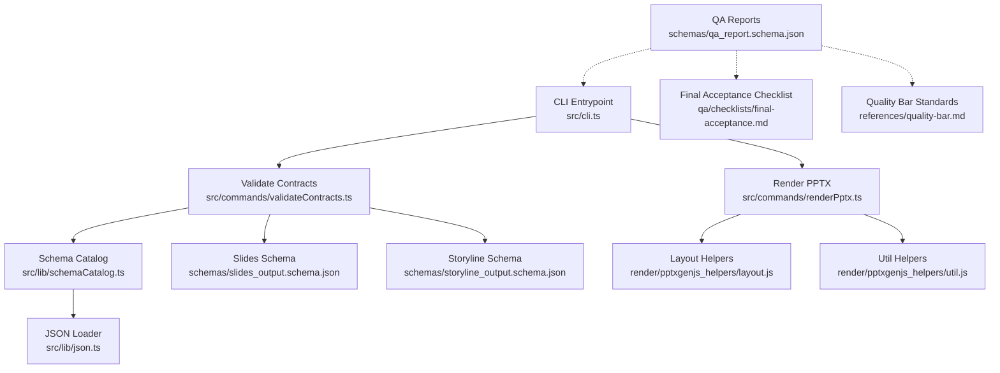
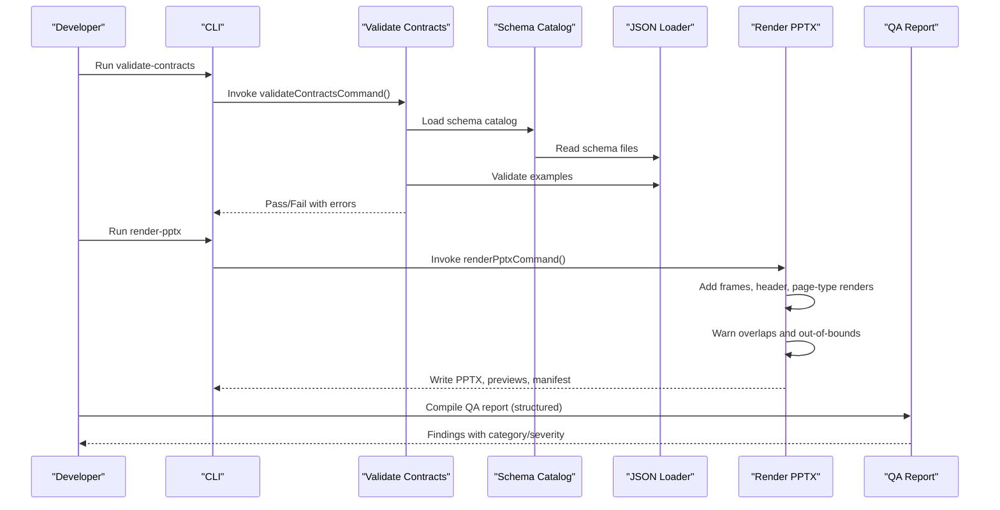
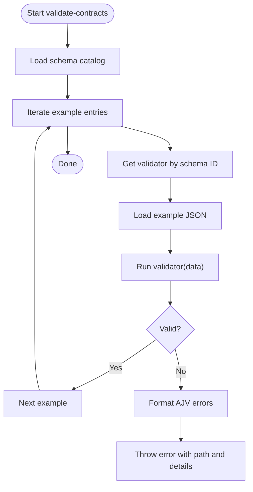
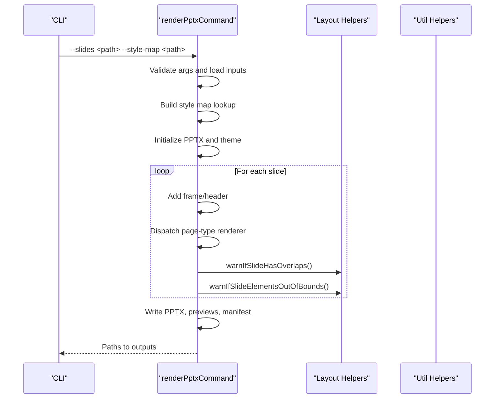
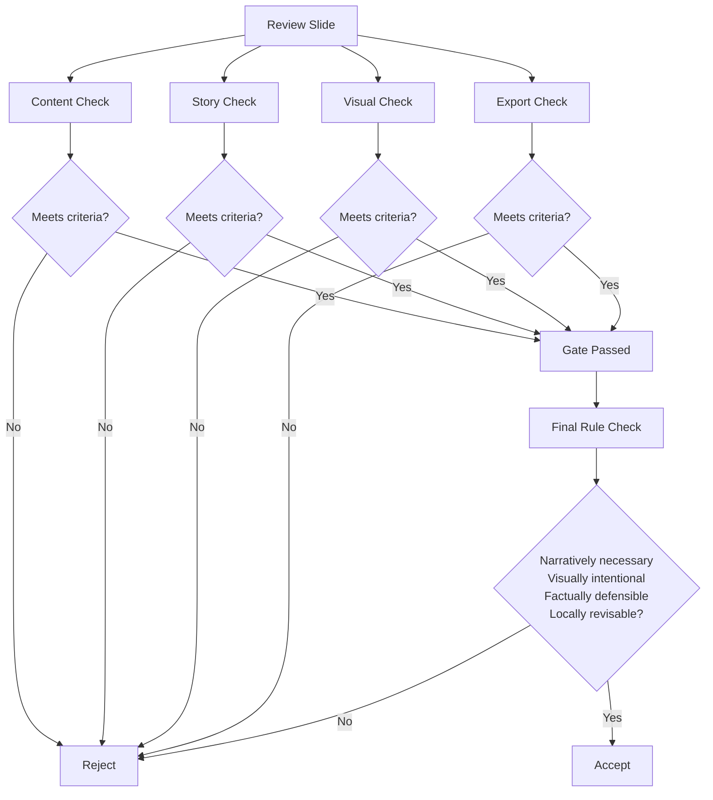
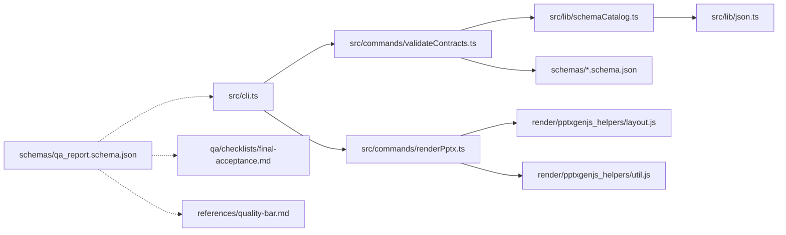

# Quality Assurance

<cite>
**Referenced Files in This Document**
- [README.md](file://README.md)
- [cli.ts](file://src/cli.ts)
- [validateContracts.ts](file://src/commands/validateContracts.ts)
- [renderPptx.ts](file://src/commands/renderPptx.ts)
- [schemaCatalog.ts](file://src/lib/schemaCatalog.ts)
- [json.ts](file://src/lib/json.ts)
- [slides_output.schema.json](file://schemas/slides_output.schema.json)
- [storyline_output.schema.json](file://schemas/storyline_output.schema.json)
- [qa_report.schema.json](file://schemas/qa_report.schema.json)
- [final-acceptance.md](file://qa/checklists/final-acceptance.md)
- [quality-bar.md](file://references/quality-bar.md)
</cite>

## Table of Contents
1. [Introduction](#introduction)
2. [Project Structure](#project-structure)
3. [Core Components](#core-components)
4. [Architecture Overview](#architecture-overview)
5. [Detailed Component Analysis](#detailed-component-analysis)
6. [Dependency Analysis](#dependency-analysis)
7. [Performance Considerations](#performance-considerations)
8. [Troubleshooting Guide](#troubleshooting-guide)
9. [Conclusion](#conclusion)
10. [Appendices](#appendices)

## Introduction
This document defines the Quality Assurance (QA) framework for the Enterprise PPT System. It explains acceptance criteria, validation procedures, quality gates, and QA reporting across the presentation production pipeline. It also documents the relationship between automated validation and manual review, quality metrics, performance benchmarks, and best practices for preventing common presentation defects.

## Project Structure
The QA system integrates with the broader pipeline through:
- CLI commands for validation and rendering
- JSON schema catalogs and validators
- QA checklists and quality bar standards
- QA report schema for standardized findings

**Diagram sources**
- [cli.ts:1-57](file://src/cli.ts#L1-L57)
- [validateContracts.ts:1-100](file://src/commands/validateContracts.ts#L1-L100)
- [renderPptx.ts:1-187](file://src/commands/renderPptx.ts#L1-L187)
- [schemaCatalog.ts:1-24](file://src/lib/schemaCatalog.ts#L1-L24)
- [json.ts:1-14](file://src/lib/json.ts#L1-L14)
- [slides_output.schema.json:1-53](file://schemas/slides_output.schema.json#L1-L53)
- [storyline_output.schema.json:1-49](file://schemas/storyline_output.schema.json#L1-L49)
- [qa_report.schema.json:1-28](file://schemas/qa_report.schema.json#L1-L28)
- [final-acceptance.md:1-28](file://qa/checklists/final-acceptance.md#L1-L28)
- [quality-bar.md:1-40](file://references/quality-bar.md#L1-L40)

**Section sources**
- [README.md:1-38](file://README.md#L1-L38)
- [cli.ts:1-57](file://src/cli.ts#L1-L57)

## Core Components
- Contract validation engine: Loads schema catalog and validates example datasets against JSON Schemas.
- Rendering pipeline: Produces editable PPTX and SVG previews, with built-in layout warnings.
- QA standards: Final acceptance checklist and quality bar define acceptance criteria.
- QA reporting: Structured QA report schema for findings categorization and severity.

Key responsibilities:
- Automated validation ensures schema compliance and contract integrity.
- Rendering validates layout constraints and writes artifacts for manual review.
- QA standards and reports formalize acceptance and remediation.

**Section sources**
- [validateContracts.ts:7-99](file://src/commands/validateContracts.ts#L7-L99)
- [renderPptx.ts:83-187](file://src/commands/renderPptx.ts#L83-L187)
- [final-acceptance.md:1-28](file://qa/checklists/final-acceptance.md#L1-L28)
- [quality-bar.md:1-40](file://references/quality-bar.md#L1-L40)
- [qa_report.schema.json:8-26](file://schemas/qa_report.schema.json#L8-L26)

## Architecture Overview
The QA pipeline is layered:
- Validation layer: schema-driven checks for contracts and outputs
- Rendering layer: produces deliverables and previews with layout diagnostics
- Review layer: manual QA guided by checklists and quality bar
- Reporting layer: standardized QA report for traceability

**Diagram sources**
- [cli.ts:10-17](file://src/cli.ts#L10-L17)
- [validateContracts.ts:20-98](file://src/commands/validateContracts.ts#L20-L98)
- [schemaCatalog.ts:12-23](file://src/lib/schemaCatalog.ts#L12-L23)
- [json.ts:4-7](file://src/lib/json.ts#L4-L7)
- [renderPptx.ts:135-159](file://src/commands/renderPptx.ts#L135-L159)
- [qa_report.schema.json:8-26](file://schemas/qa_report.schema.json#L8-L26)

## Detailed Component Analysis

### Contract Validation Engine
Purpose:
- Build a schema catalog from the schemas directory
- Validate example datasets against registered schemas
- Fail fast with detailed error messages

Implementation highlights:
- Uses AJV 2020 with strictness configured for early failure
- Iterates over a curated list of example files and their schema IDs
- Emits human-readable errors via AJV’s error formatter

Acceptance criteria:
- All examples must pass schema validation
- Errors must include schema ID and path for traceability

**Diagram sources**
- [validateContracts.ts:22-98](file://src/commands/validateContracts.ts#L22-L98)
- [schemaCatalog.ts:12-23](file://src/lib/schemaCatalog.ts#L12-L23)
- [json.ts:4-7](file://src/lib/json.ts#L4-L7)

**Section sources**
- [validateContracts.ts:7-99](file://src/commands/validateContracts.ts#L7-L99)
- [schemaCatalog.ts:12-23](file://src/lib/schemaCatalog.ts#L12-L23)
- [json.ts:4-7](file://src/lib/json.ts#L4-L7)

### Rendering Pipeline and Quality Gates
Purpose:
- Convert structured slides and style maps into an editable PPTX
- Generate SVG previews for manual review
- Enforce layout quality gates during render

Key quality gates:
- Slide count parity between slides output and style map
- Presence of required arguments (--slides, --style-map)
- Layout warnings for overlaps and out-of-bounds elements
- Output artifact integrity (PPTX, previews, manifest)

**Diagram sources**
- [renderPptx.ts:94-187](file://src/commands/renderPptx.ts#L94-L187)
- [renderPptx.ts:135-159](file://src/commands/renderPptx.ts#L135-L159)

**Section sources**
- [renderPptx.ts:83-187](file://src/commands/renderPptx.ts#L83-L187)

### QA Standards and Acceptance Criteria
Final acceptance checklist and quality bar define the acceptance bar:
- Content: clear claims, facts or justified interpretation, enterprise boundaries and risks
- Story: concrete questions, logical progression, no redundancy
- Visual: visual anchors, intentional weight center, no large empty containers, page-specific layouts
- Export: no overflow/cutoff, no encoding issues, PPTX opens cleanly, page sequence matches expectations

Final rule: a slide is acceptable only if it is narratively necessary, visually intentional, factually defensible, and locally revisable.

**Diagram sources**
- [final-acceptance.md:3-27](file://qa/checklists/final-acceptance.md#L3-L27)
- [quality-bar.md:3-39](file://references/quality-bar.md#L3-L39)

**Section sources**
- [final-acceptance.md:1-28](file://qa/checklists/final-acceptance.md#L1-L28)
- [quality-bar.md:1-40](file://references/quality-bar.md#L1-L40)

### QA Report Generation
The QA report schema defines a standardized structure for findings:
- Required fields: deck_id, status, findings array
- Findings items include category, severity, optional slide_id, message, and owner
- Categories: content, story, visual, export
- Severity: low, medium, high

This structure supports traceability and escalation during manual review.

**Section sources**
- [qa_report.schema.json:8-26](file://schemas/qa_report.schema.json#L8-L26)

## Dependency Analysis
The QA framework relies on:
- CLI orchestration for command invocation
- Schema catalog and JSON utilities for validation
- Rendering helpers for layout diagnostics
- QA standards and report schema for consistency

**Diagram sources**
- [cli.ts:10-17](file://src/cli.ts#L10-L17)
- [validateContracts.ts:20-98](file://src/commands/validateContracts.ts#L20-L98)
- [schemaCatalog.ts:12-23](file://src/lib/schemaCatalog.ts#L12-L23)
- [json.ts:4-7](file://src/lib/json.ts#L4-L7)
- [renderPptx.ts:86-89](file://src/commands/renderPptx.ts#L86-L89)
- [qa_report.schema.json:8-26](file://schemas/qa_report.schema.json#L8-L26)
- [final-acceptance.md:1-28](file://qa/checklists/final-acceptance.md#L1-L28)
- [quality-bar.md:1-40](file://references/quality-bar.md#L1-L40)

**Section sources**
- [cli.ts:1-57](file://src/cli.ts#L1-L57)
- [validateContracts.ts:1-100](file://src/commands/validateContracts.ts#L1-L100)
- [renderPptx.ts:1-187](file://src/commands/renderPptx.ts#L1-L187)

## Performance Considerations
- Validation performance: batch schema registration and reuse validators to minimize overhead
- Rendering performance: avoid unnecessary re-renders; leverage manifests to track rerendered slides
- Preview generation: generate SVG previews in parallel per slide where feasible
- Artifact storage: ensure output directories exist before writing to reduce I/O errors

[No sources needed since this section provides general guidance]

## Troubleshooting Guide
Common issues and resolutions:
- Missing required arguments for rendering: ensure both --slides and --style-map are provided
- Mismatched slide counts: verify slides output and style map contain equal numbers of slides
- Layout violations: address overlaps and out-of-bounds warnings before manual review
- Encoding or export issues: confirm PPTX opens cleanly; re-run render with corrected inputs
- Validation failures: inspect AJV error messages to locate invalid fields in examples

Manual review steps:
- Cross-check each finding against the QA report schema
- Confirm categories and severities align with the quality bar
- Escalate high-severity findings and re-validate after fixes

**Section sources**
- [renderPptx.ts:97-113](file://src/commands/renderPptx.ts#L97-L113)
- [renderPptx.ts:157-159](file://src/commands/renderPptx.ts#L157-L159)
- [validateContracts.ts:94-96](file://src/commands/validateContracts.ts#L94-L96)
- [qa_report.schema.json:8-26](file://schemas/qa_report.schema.json#L8-L26)

## Conclusion
The Enterprise PPT System’s QA framework combines automated schema validation, rendering diagnostics, and structured manual review. By adhering to the final acceptance checklist and quality bar, and by using the QA report schema, teams can maintain high-quality output, prevent common defects, and continuously improve the presentation production pipeline.

[No sources needed since this section summarizes without analyzing specific files]

## Appendices

### Practical QA Workflows
- Pre-render validation: run validate-contracts to ensure schema compliance before rendering
- Render and preview: execute render-pptx; review SVG previews and address layout warnings
- Manual QA: apply final acceptance checklist and quality bar to each slide
- Report findings: populate QA report with category, severity, and remediation ownership

**Section sources**
- [validateContracts.ts:85-98](file://src/commands/validateContracts.ts#L85-L98)
- [renderPptx.ts:165-166](file://src/commands/renderPptx.ts#L165-L166)
- [final-acceptance.md:3-27](file://qa/checklists/final-acceptance.md#L3-L27)
- [quality-bar.md:3-39](file://references/quality-bar.md#L3-L39)
- [qa_report.schema.json:8-26](file://schemas/qa_report.schema.json#L8-L26)

### Standards Compliance and Metrics
- Compliance: adhere to QA report schema for consistent reporting
- Metrics: track pass/fail rates, severity distribution, and remediation turnaround
- Benchmarks: compare slide-level acceptance rates against quality bar targets

**Section sources**
- [qa_report.schema.json:10-22](file://schemas/qa_report.schema.json#L10-L22)
- [quality-bar.md:34-40](file://references/quality-bar.md#L34-L40)