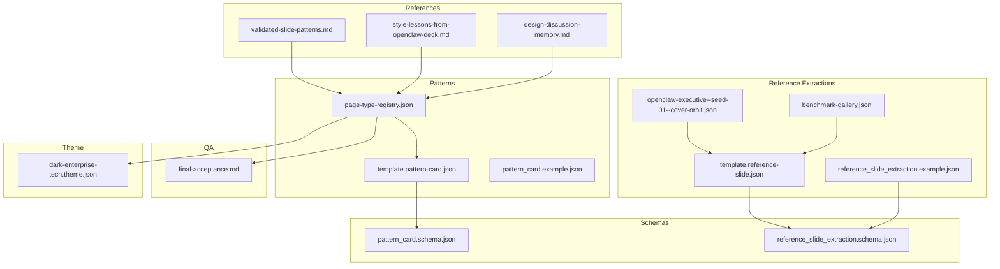
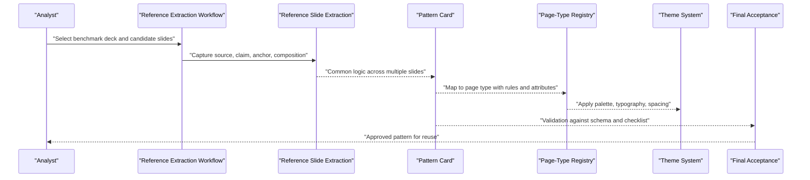
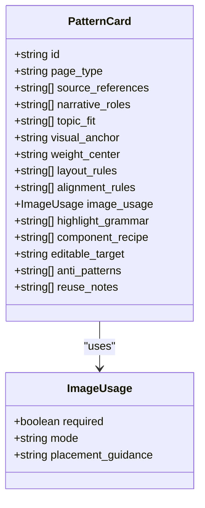
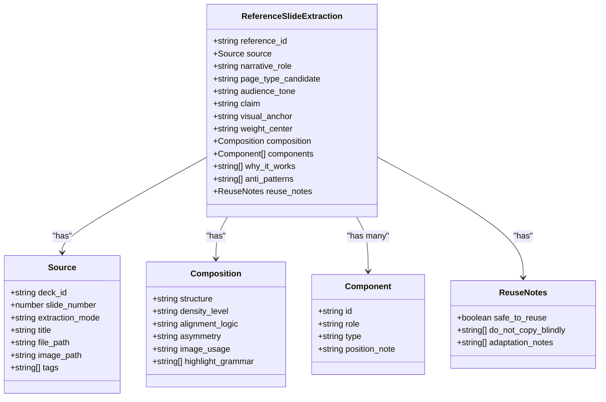
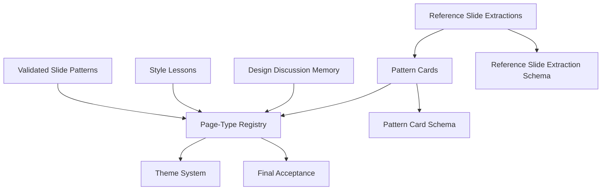

# Reference Patterns and Examples

<cite>
**Referenced Files in This Document**
- [validated-slide-patterns.md](file://references/validated-slide-patterns.md)
- [style-lessons-from-openclaw-deck.md](file://references/style-lessons-from-openclaw-deck.md)
- [design-discussion-memory.md](file://references/design-discussion-memory.md)
- [page-type-registry.json](file://style/patterns/page-type-registry.json)
- [template.pattern-card.json](file://style/patterns/template.pattern-card.json)
- [pattern_card.example.json](file://examples/pattern_card.example.json)
- [template.reference-slide.json](file://style/reference_extractions/template.reference-slide.json)
- [openclaw-executive--seed-01--cover-orbit.json](file://style/reference_extractions/openclaw-executive--seed-01--cover-orbit.json)
- [reference_slide_extraction.example.json](file://examples/reference_slide_extraction.example.json)
- [benchmark-gallery.json](file://style/reference_extractions/benchmark-gallery.json)
- [reference-extraction-workflow.md](file://docs/workflows/reference-extraction-workflow.md)
- [pattern_card.schema.json](file://schemas/pattern_card.schema.json)
- [reference_slide_extraction.schema.json](file://schemas/reference_slide_extraction.schema.json)
- [final-acceptance.md](file://qa/checklists/final-acceptance.md)
- [dark-enterprise-tech.theme.json](file://style/themes/dark-enterprise-tech.theme.json)
</cite>

## Table of Contents
1. [Introduction](#introduction)
2. [Project Structure](#project-structure)
3. [Core Components](#core-components)
4. [Architecture Overview](#architecture-overview)
5. [Detailed Component Analysis](#detailed-component-analysis)
6. [Dependency Analysis](#dependency-analysis)
7. [Performance Considerations](#performance-considerations)
8. [Troubleshooting Guide](#troubleshooting-guide)
9. [Conclusion](#conclusion)
10. [Appendices](#appendices)

## Introduction
This document presents the Enterprise PPT System’s validated reference patterns and examples library. It explains the proven slide patterns, style lessons learned from reference decks, and the design discussion archives that inform the system. It documents pattern cards, reference slide extractions, and template structures, and provides practical examples for applying proven design patterns, adapting successful layouts, and maintaining design consistency. It also outlines the relationship between reference materials and system patterns, adaptation strategies, creative interpretation guidelines, and quality assessment criteria.

## Project Structure
The pattern and example ecosystem centers on:
- References: validated slide patterns, style lessons, and design memory
- Patterns: page-type registry and pattern cards
- Reference extractions: structured slide analyses and gallery curation
- Schemas: formal contracts for pattern cards and reference extractions
- QA: acceptance criteria for visual and narrative quality
- Theme: a cohesive visual system that anchors pattern application

**Diagram sources**
- [validated-slide-patterns.md:1-345](file://references/validated-slide-patterns.md#L1-L345)
- [style-lessons-from-openclaw-deck.md:1-161](file://references/style-lessons-from-openclaw-deck.md#L1-L161)
- [design-discussion-memory.md:1-112](file://references/design-discussion-memory.md#L1-L112)
- [page-type-registry.json:1-115](file://style/patterns/page-type-registry.json#L1-L115)
- [template.pattern-card.json:1-46](file://style/patterns/template.pattern-card.json#L1-L46)
- [pattern_card.example.json:1-54](file://examples/pattern_card.example.json#L1-L54)
- [template.reference-slide.json:1-65](file://style/reference_extractions/template.reference-slide.json#L1-L65)
- [reference_slide_extraction.example.json:1-64](file://examples/reference_slide_extraction.example.json#L1-L64)
- [openclaw-executive--seed-01--cover-orbit.json:1-72](file://style/reference_extractions/openclaw-executive--seed-01--cover-orbit.json#L1-L72)
- [benchmark-gallery.json:1-17](file://style/reference_extractions/benchmark-gallery.json#L1-L17)
- [pattern_card.schema.json:1-75](file://schemas/pattern_card.schema.json#L1-L75)
- [reference_slide_extraction.schema.json:1-103](file://schemas/reference_slide_extraction.schema.json#L1-L103)
- [final-acceptance.md:1-28](file://qa/checklists/final-acceptance.md#L1-L28)
- [dark-enterprise-tech.theme.json:1-55](file://style/themes/dark-enterprise-tech.theme.json#L1-L55)

**Section sources**
- [validated-slide-patterns.md:1-345](file://references/validated-slide-patterns.md#L1-L345)
- [style-lessons-from-openclaw-deck.md:1-161](file://references/style-lessons-from-openclaw-deck.md#L1-L161)
- [design-discussion-memory.md:1-112](file://references/design-discussion-memory.md#L1-L112)
- [page-type-registry.json:1-115](file://style/patterns/page-type-registry.json#L1-L115)
- [template.pattern-card.json:1-46](file://style/patterns/template.pattern-card.json#L1-L46)
- [pattern_card.example.json:1-54](file://examples/pattern_card.example.json#L1-L54)
- [template.reference-slide.json:1-65](file://style/reference_extractions/template.reference-slide.json#L1-L65)
- [reference_slide_extraction.example.json:1-64](file://examples/reference_slide_extraction.example.json#L1-L64)
- [openclaw-executive--seed-01--cover-orbit.json:1-72](file://style/reference_extractions/openclaw-executive--seed-01--cover-orbit.json#L1-L72)
- [benchmark-gallery.json:1-17](file://style/reference_extractions/benchmark-gallery.json#L1-L17)
- [pattern_card.schema.json:1-75](file://schemas/pattern_card.schema.json#L1-L75)
- [reference_slide_extraction.schema.json:1-103](file://schemas/reference_slide_extraction.schema.json#L1-L103)
- [final-acceptance.md:1-28](file://qa/checklists/final-acceptance.md#L1-L28)
- [dark-enterprise-tech.theme.json:1-55](file://style/themes/dark-enterprise-tech.theme.json#L1-L55)

## Core Components
- Validated Slide Patterns: Concrete, reusable page types with observed strengths and usage guidance.
- Style Lessons: Concrete rules and anti-patterns distilled from producing strong decks.
- Design Discussion Memory: Preserved reasoning and standards for visual expression as part of meaning.
- Page-Type Registry: Structured mapping of page types to narrative roles, anchors, weight centers, density, and editability.
- Pattern Cards: Structured cards capturing layout rules, alignment rules, image usage, highlight grammar, component recipes, and reuse notes.
- Reference Slide Extractions: Structured analyses of individual slides with narrative role, visual anchor, composition, and guidance.
- Benchmark Gallery: Curated sets of extractions and pattern cards for reuse.
- Schemas: JSON Schemas that validate pattern cards and reference extractions.
- QA Checklist: Acceptance criteria ensuring narrative necessity, visual intentionality, factual defensibility, and local revisability.
- Theme: A cohesive visual system (palette, typography, spacing, shadows, backgrounds) that anchors pattern application.

**Section sources**
- [validated-slide-patterns.md:1-345](file://references/validated-slide-patterns.md#L1-L345)
- [style-lessons-from-openclaw-deck.md:1-161](file://references/style-lessons-from-openclaw-deck.md#L1-L161)
- [design-discussion-memory.md:1-112](file://references/design-discussion-memory.md#L1-L112)
- [page-type-registry.json:1-115](file://style/patterns/page-type-registry.json#L1-L115)
- [template.pattern-card.json:1-46](file://style/patterns/template.pattern-card.json#L1-L46)
- [pattern_card.example.json:1-54](file://examples/pattern_card.example.json#L1-L54)
- [template.reference-slide.json:1-65](file://style/reference_extractions/template.reference-slide.json#L1-L65)
- [reference_slide_extraction.example.json:1-64](file://examples/reference_slide_extraction.example.json#L1-L64)
- [openclaw-executive--seed-01--cover-orbit.json:1-72](file://style/reference_extractions/openclaw-executive--seed-01--cover-orbit.json#L1-L72)
- [benchmark-gallery.json:1-17](file://style/reference_extractions/benchmark-gallery.json#L1-L17)
- [pattern_card.schema.json:1-75](file://schemas/pattern_card.schema.json#L1-L75)
- [reference_slide_extraction.schema.json:1-103](file://schemas/reference_slide_extraction.schema.json#L1-L103)
- [final-acceptance.md:1-28](file://qa/checklists/final-acceptance.md#L1-L28)
- [dark-enterprise-tech.theme.json:1-55](file://style/themes/dark-enterprise-tech.theme.json#L1-L55)

## Architecture Overview
The system transforms strong reference slides into reusable pattern knowledge through a structured workflow. Pattern cards codify layout and alignment rules, while the page-type registry connects narrative roles to page types. The theme system ensures consistent visual expression. QA checks enforce quality gates.

**Diagram sources**
- [reference-extraction-workflow.md:1-73](file://docs/workflows/reference-extraction-workflow.md#L1-L73)
- [template.reference-slide.json:1-65](file://style/reference_extractions/template.reference-slide.json#L1-L65)
- [reference_slide_extraction.example.json:1-64](file://examples/reference_slide_extraction.example.json#L1-L64)
- [template.pattern-card.json:1-46](file://style/patterns/template.pattern-card.json#L1-L46)
- [pattern_card.example.json:1-54](file://examples/pattern_card.example.json#L1-L54)
- [page-type-registry.json:1-115](file://style/patterns/page-type-registry.json#L1-L115)
- [pattern_card.schema.json:1-75](file://schemas/pattern_card.schema.json#L1-L75)
- [reference_slide_extraction.schema.json:1-103](file://schemas/reference_slide_extraction.schema.json#L1-L103)
- [final-acceptance.md:1-28](file://qa/checklists/final-acceptance.md#L1-L28)
- [dark-enterprise-tech.theme.json:1-55](file://style/themes/dark-enterprise-tech.theme.json#L1-L55)

## Detailed Component Analysis

### Validated Slide Patterns
- Purpose: Capture concrete, reusable page types with observed strengths.
- Coverage: Includes 18 patterns such as Cover Orbit, Narrative Map Agenda, Trust Terminal, Closed Loop Process, Bottleneck Shift, Human-AI Relationship Evolution, Product Matrix Trio, Layered Architecture, Runtime Pooling, Scenario Flow, Decision Frame, Risk Split, Amplification Effect, Minimum Self-Protection, Security Control Plane, Chapter Summary, and Closing Control-First.
- Guidance: Each pattern specifies use cases, visual structure, why it works, and when not to use it. A recommended MVP set is provided for rapid adoption.

Practical application tips:
- Choose a pattern by narrative role and content intent, not convenience.
- Apply the pattern’s visual structure and anchor to maintain consistency.
- Use the pattern’s “why it works” rationale to justify design choices.

**Section sources**
- [validated-slide-patterns.md:1-345](file://references/validated-slide-patterns.md#L1-L345)

### Style Lessons Learned
- Core observation: Visual quality issues stem from composition, hierarchy, anchors, and emptiness, not just color.
- Practical rules: Color match is insufficient; asymmetry, focal contrast, object-centric layout, rhythm, and text-to-graphic balance matter.
- Visual anchors: Every important page needs a dominant object.
- Page weight: Explicitly design weight center; avoid top-heavy compositions.
- Avoid generic card grids; favor contrast and asymmetric hero objects.
- Decision objects: Executive decks must feel decision-supporting.
- Tech feel: Achieved via terminal grammar, chips/status pills, layered frames, subtle grids, controlled gradients, disciplined typography, and strategic accent colors.
- Treat empty boxes as bugs; ensure every significant container has a visual object, structured points, comparative statements, or meaningful metrics.
- One strong move: Best pages express one clear action (define, contrast, transition, control, visualize, expose).

**Section sources**
- [style-lessons-from-openclaw-deck.md:1-161](file://references/style-lessons-from-openclaw-deck.md#L1-L161)

### Design Discussion Memory
- The user emphasized that style is part of the argument and weak pages damage credibility.
- Standards included deliberate asymmetry, visible focal contrast, strong highlighted phrases, layered gradients/glows, icon/status-pill systems, terminal-like UI motifs, composition with object anchors, and appropriate density.
- Rejected patterns: Equal-width repetitive cards, large empty dark areas, top-heavy compositions, plain tables as architecture pages, weak timeline layouts, and generic “AI slop” layouts.
- Future guidance: Encode page weight center, object anchor choice, asymmetry rules, density rules, hierarchy rules, and chapter-level style logic into pattern cards, page-type rules, themes, and QA checks.

**Section sources**
- [design-discussion-memory.md:1-112](file://references/design-discussion-memory.md#L1-L112)

### Page-Type Registry
- Defines page types with narrative roles, visual anchors, weight centers, density levels, MVP priority, and editable targets.
- Example entries include cover_orbit, narrative_map, trust_terminal, closed_loop_flow, bottleneck_shift, evolution_split, layered_architecture_stack, scenario_flow, risk_split, security_control_plane, chapter_summary_signal, and closing_control_first.
- Supports MVP prioritization and editable-target mapping for rendering.

**Section sources**
- [page-type-registry.json:1-115](file://style/patterns/page-type-registry.json#L1-L115)

### Pattern Cards
- Template and example demonstrate how to encode:
  - Page type and narrative roles
  - Topic fit and visual anchor
  - Layout rules and alignment rules
  - Image usage (required, mode, placement guidance)
  - Highlight grammar
  - Component recipe
  - Editable target
  - Anti-patterns and reuse notes
- Schemas validate completeness and correctness.

**Diagram sources**
- [template.pattern-card.json:1-46](file://style/patterns/template.pattern-card.json#L1-L46)
- [pattern_card.schema.json:1-75](file://schemas/pattern_card.schema.json#L1-L75)

**Section sources**
- [template.pattern-card.json:1-46](file://style/patterns/template.pattern-card.json#L1-L46)
- [pattern_card.example.json:1-54](file://examples/pattern_card.example.json#L1-L54)
- [pattern_card.schema.json:1-75](file://schemas/pattern_card.schema.json#L1-L75)

### Reference Slide Extractions
- Template and example show how to extract:
  - Source metadata (deck, slide number, extraction mode, title, image path, tags)
  - Narrative role, page type candidate, audience tone, and claim
  - Visual anchor, weight center, and composition (structure, density level, alignment logic, asymmetry, image usage, highlight grammar)
  - Components with roles and types
  - Why it works, anti-patterns, and reuse notes
- Schemas validate structure and completeness.

**Diagram sources**
- [template.reference-slide.json:1-65](file://style/reference_extractions/template.reference-slide.json#L1-L65)
- [reference_slide_extraction.example.json:1-64](file://examples/reference_slide_extraction.example.json#L1-L64)
- [reference_slide_extraction.schema.json:1-103](file://schemas/reference_slide_extraction.schema.json#L1-L103)

**Section sources**
- [template.reference-slide.json:1-65](file://style/reference_extractions/template.reference-slide.json#L1-L65)
- [reference_slide_extraction.example.json:1-64](file://examples/reference_slide_extraction.example.json#L1-L64)
- [openclaw-executive--seed-01--cover-orbit.json:1-72](file://style/reference_extractions/openclaw-executive--seed-01--cover-orbit.json#L1-L72)
- [reference_slide_extraction.schema.json:1-103](file://schemas/reference_slide_extraction.schema.json#L1-L103)

### Benchmark Gallery
- Curates a set of reference extractions and pattern cards for reuse.
- Demonstrates how multiple slides can be merged into a unified pattern card.

**Section sources**
- [benchmark-gallery.json:1-17](file://style/reference_extractions/benchmark-gallery.json#L1-L17)

### Reference Extraction Workflow
- Purpose: Convert strong reference slides into structured design knowledge.
- Steps:
  - Pick the right benchmark deck (strong on executive clarity, image usage, visual hierarchy, alignment discipline, editable-friendly composition)
  - Select candidate slides (covers, chapter openers, agendas, architecture, transitions, summaries, closing signals)
  - Extract one slide (capture source, claim, narrative role, page type candidate, visual anchor, weight center, alignment logic, image usage, highlight grammar, why it works, blind reuse notes)
  - Merge repeated logic into a pattern card (summarize layout rules, alignment rules, image usage, editable target, anti-patterns)
  - Feed the learned pattern back (map to page-type registry, update renderer rules, add QA checks)
- Review standard: Explain what the slide is trying to do, why the layout works, where visual weight sits, how images contribute to impact, and which rules are reusable.

**Section sources**
- [reference-extraction-workflow.md:1-73](file://docs/workflows/reference-extraction-workflow.md#L1-L73)

### Quality Assessment Criteria
- Content: Clear claim, supported by facts or justified interpretation, with enterprise boundaries and risks stated where needed.
- Story: Each chapter answers a concrete question, page order progresses from context to implication to action, and no slide is redundant.
- Visual: Important slides have a visual anchor, weight center is intentional, large empty containers are defects, and layout feels page-specific, not template-generic.
- Export: No overflow, no cut-offs, no encoding issues, PPTX opens cleanly, and page sequence matches expected output.
- Final rule: A slide is accepted only if it is narratively necessary, visually intentional, factually defensible, and locally revisable.

**Section sources**
- [final-acceptance.md:1-28](file://qa/checklists/final-acceptance.md#L1-L28)

### Theme System
- Provides a cohesive visual foundation:
  - Palette: Background, surface, text, accents, grid
  - Typography: Font family and sizes
  - Spacing: xs, sm, md, lg, xl
  - Radius and borders
  - Shadows: card and glow_primary
  - Backgrounds: base, overlay, hero
- Ensures consistent application of patterns across decks.

**Section sources**
- [dark-enterprise-tech.theme.json:1-55](file://style/themes/dark-enterprise-tech.theme.json#L1-L55)

## Dependency Analysis
The system exhibits clear layering:
- References inform Patterns
- Patterns feed the Page-Type Registry
- Registry integrates with Theme and QA
- Reference Extractions validate and refine Patterns and Registry
- Schemas enforce structural integrity

**Diagram sources**
- [validated-slide-patterns.md:1-345](file://references/validated-slide-patterns.md#L1-L345)
- [style-lessons-from-openclaw-deck.md:1-161](file://references/style-lessons-from-openclaw-deck.md#L1-L161)
- [design-discussion-memory.md:1-112](file://references/design-discussion-memory.md#L1-L112)
- [page-type-registry.json:1-115](file://style/patterns/page-type-registry.json#L1-L115)
- [template.pattern-card.json:1-46](file://style/patterns/template.pattern-card.json#L1-L46)
- [pattern_card.schema.json:1-75](file://schemas/pattern_card.schema.json#L1-L75)
- [template.reference-slide.json:1-65](file://style/reference_extractions/template.reference-slide.json#L1-L65)
- [reference_slide_extraction.schema.json:1-103](file://schemas/reference_slide_extraction.schema.json#L1-L103)
- [dark-enterprise-tech.theme.json:1-55](file://style/themes/dark-enterprise-tech.theme.json#L1-L55)
- [final-acceptance.md:1-28](file://qa/checklists/final-acceptance.md#L1-L28)

**Section sources**
- [validated-slide-patterns.md:1-345](file://references/validated-slide-patterns.md#L1-L345)
- [style-lessons-from-openclaw-deck.md:1-161](file://references/style-lessons-from-openclaw-deck.md#L1-L161)
- [design-discussion-memory.md:1-112](file://references/design-discussion-memory.md#L1-L112)
- [page-type-registry.json:1-115](file://style/patterns/page-type-registry.json#L1-L115)
- [template.pattern-card.json:1-46](file://style/patterns/template.pattern-card.json#L1-L46)
- [pattern_card.schema.json:1-75](file://schemas/pattern_card.schema.json#L1-L75)
- [template.reference-slide.json:1-65](file://style/reference_extractions/template.reference-slide.json#L1-L65)
- [reference_slide_extraction.schema.json:1-103](file://schemas/reference_slide_extraction.schema.json#L1-L103)
- [dark-enterprise-tech.theme.json:1-55](file://style/themes/dark-enterprise-tech.theme.json#L1-L55)
- [final-acceptance.md:1-28](file://qa/checklists/final-acceptance.md#L1-L28)

## Performance Considerations
- Pattern reuse reduces rendering complexity and speeds up deck assembly.
- Explicit weight centers and alignment rules minimize rework during customization.
- Schemas enable early detection of missing or inconsistent fields, reducing downstream fixes.
- Theme-driven defaults streamline visual consistency and reduce design overhead.

## Troubleshooting Guide
Common issues and remedies:
- Empty lower half or top-heavy composition: Adjust weight center to middle or lower as appropriate; ensure every significant container has a visual object or structured content.
- Generic card repetition: Replace with asymmetric hero + supporting elements; use decision objects for executive decks.
- Weak page identity: Add a dominant visual anchor; ensure the page expresses one strong move.
- Blind reuse of visuals: Follow “do not copy blindly” notes; swap hero visuals by topic while preserving hierarchy and grid relationships.
- Schema violations: Validate against pattern_card.schema.json and reference_slide_extraction.schema.json to catch missing fields early.

**Section sources**
- [style-lessons-from-openclaw-deck.md:86-161](file://references/style-lessons-from-openclaw-deck.md#L86-L161)
- [design-discussion-memory.md:62-112](file://references/design-discussion-memory.md#L62-L112)
- [pattern_card.schema.json:1-75](file://schemas/pattern_card.schema.json#L1-L75)
- [reference_slide_extraction.schema.json:1-103](file://schemas/reference_slide_extraction.schema.json#L1-L103)

## Conclusion
The Enterprise PPT System’s reference patterns and examples provide a robust foundation for consistent, high-quality slide design. By anchoring decisions in validated patterns, applying explicit style rules, and enforcing quality through schemas and QA checks, teams can rapidly assemble decks that are narratively necessary, visually intentional, factually defensible, and locally revisable.

## Appendices

### Applying Proven Design Patterns
- Choose by narrative role: Use the page-type registry to select a pattern aligned with the slide’s purpose.
- Preserve the anchor: Maintain the dominant object and its placement logic across adaptations.
- Manage density and weight: Keep medium-high density for architecture and comparison pages; adjust weight center to reflect authority.
- Swap imagery thoughtfully: Replace hero visuals by topic while retaining the hierarchical structure and alignment discipline.

**Section sources**
- [page-type-registry.json:1-115](file://style/patterns/page-type-registry.json#L1-L115)
- [template.pattern-card.json:1-46](file://style/patterns/template.pattern-card.json#L1-L46)
- [pattern_card.example.json:1-54](file://examples/pattern_card.example.json#L1-L54)

### Adaptation Strategies and Creative Interpretation
- Preserve the “why it works”: When adapting, keep the core reasoning (e.g., object-centric layout, focal contrast) intact.
- Treat emptiness as a defect: Ensure every major container contributes to meaning.
- Avoid symmetry without purpose: Use symmetry only when the page explicitly explores equivalence or comparison.
- Use documented anti-patterns as guardrails: Do not flatten hero objects, do not repeat generic card grids, and do not rely solely on color.

**Section sources**
- [style-lessons-from-openclaw-deck.md:108-161](file://references/style-lessons-from-openclaw-deck.md#L108-L161)
- [design-discussion-memory.md:103-112](file://references/design-discussion-memory.md#L103-L112)

### Quality Assessment Criteria
- Content: Clear claim, supported by facts or justified interpretation, with enterprise boundaries and risks stated where needed.
- Story: Each chapter answers a concrete question, page order progresses from context to implication to action, and no slide is redundant.
- Visual: Important slides have a visual anchor, weight center is intentional, large empty containers are defects, and layout feels page-specific, not template-generic.
- Export: No overflow, no cut-offs, no encoding issues, PPTX opens cleanly, and page sequence matches expected output.
- Final rule: A slide is accepted only if it is narratively necessary, visually intentional, factually defensible, and locally revisable.

**Section sources**
- [final-acceptance.md:1-28](file://qa/checklists/final-acceptance.md#L1-L28)