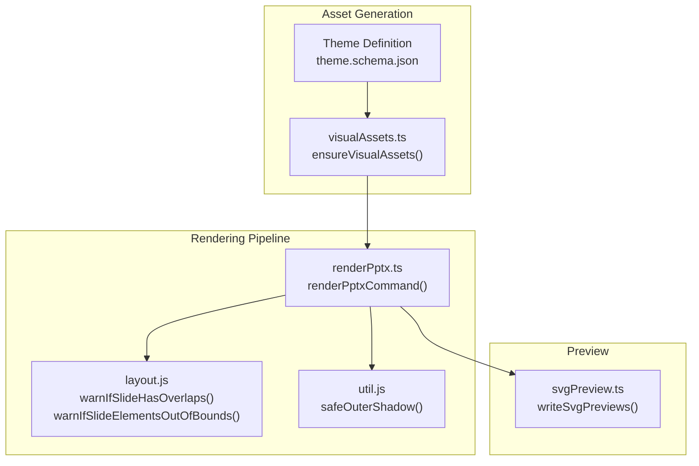
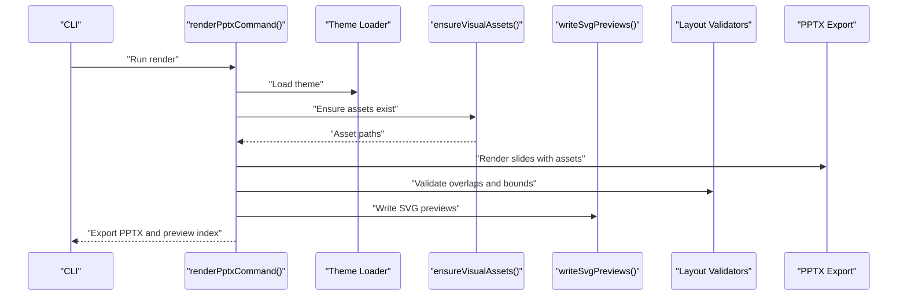
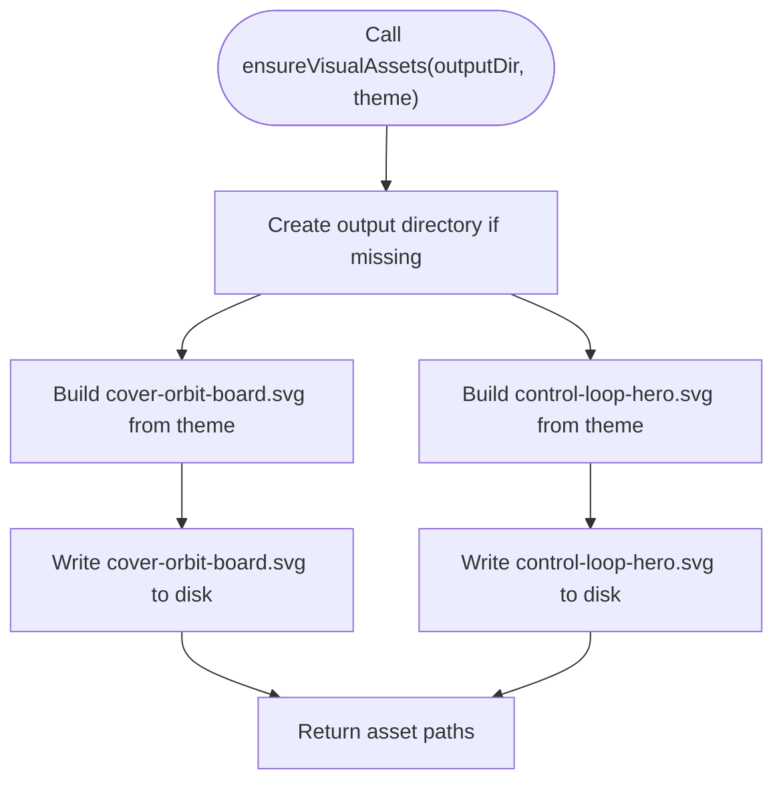
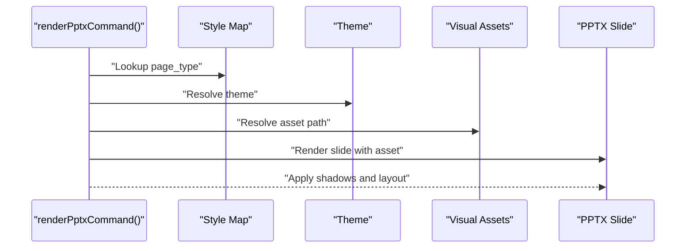
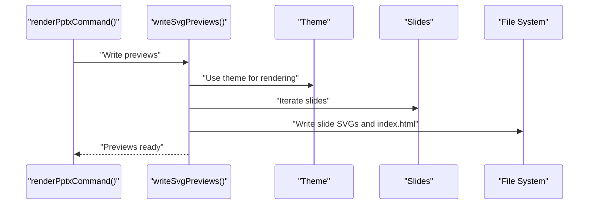
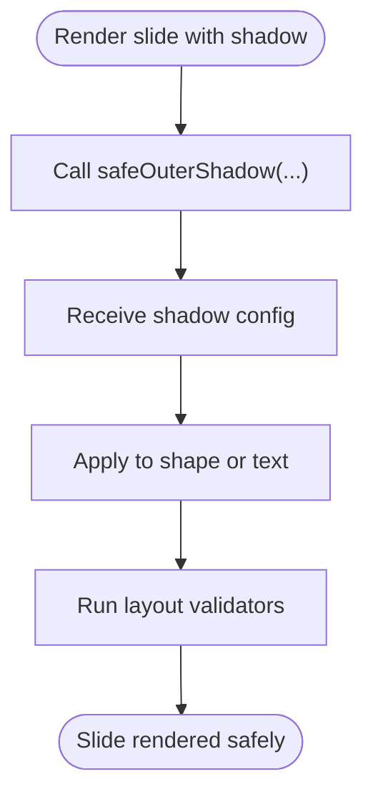
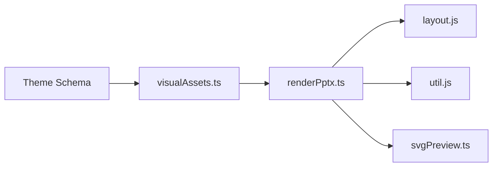

# Asset Management

<cite>
**Referenced Files in This Document**
- [visualAssets.ts](file://src/lib/render/visualAssets.ts)
- [renderPptx.ts](file://src/commands/renderPptx.ts)
- [svgPreview.ts](file://src/lib/render/svgPreview.ts)
- [util.js](file://render/pptxgenjs_helpers/util.js)
- [layout.js](file://render/pptxgenjs_helpers/layout.js)
- [theme.schema.json](file://schemas/theme.schema.json)
- [cover-orbit-board.svg](file://output/preview/assets/cover-orbit-board.svg)
- [control-loop-hero.svg](file://output/preview/assets/control-loop-hero.svg)
</cite>

## Table of Contents
1. [Introduction](#introduction)
2. [Project Structure](#project-structure)
3. [Core Components](#core-components)
4. [Architecture Overview](#architecture-overview)
5. [Detailed Component Analysis](#detailed-component-analysis)
6. [Dependency Analysis](#dependency-analysis)
7. [Performance Considerations](#performance-considerations)
8. [Troubleshooting Guide](#troubleshooting-guide)
9. [Conclusion](#conclusion)

## Introduction
This document describes the asset management system responsible for visual resources and optimization strategies in the enterprise PowerPoint system. It explains how visual assets are generated, cached, and integrated into both preview and final export workflows. The system focuses on:
- Generating reusable vector assets from theme definitions
- Managing asset resolution per slide type and visual requirements
- Providing utility functions for visual effects (shadows)
- Preparing assets for both preview (SVG) and final export (PPTX)
- Ensuring performance and scalability for large presentations

## Project Structure
The asset management system spans several modules:
- Visual asset generation and caching
- Slide-specific rendering and asset usage
- Preview generation (SVG)
- Utility helpers for shadows and layout validation
- Theme schema defining visual capabilities

**Diagram sources**
- [visualAssets.ts:11-24](file://src/lib/render/visualAssets.ts#L11-L24)
- [renderPptx.ts:109](file://src/commands/renderPptx.ts#L109)
- [layout.js:23-232](file://render/pptxgenjs_helpers/layout.js#L23-L232)
- [util.js:5-20](file://render/pptxgenjs_helpers/util.js#L5-L20)
- [svgPreview.ts:28-67](file://src/lib/render/svgPreview.ts#L28-L67)

**Section sources**
- [visualAssets.ts:11-24](file://src/lib/render/visualAssets.ts#L11-L24)
- [renderPptx.ts:109](file://src/commands/renderPptx.ts#L109)
- [svgPreview.ts:28-67](file://src/lib/render/svgPreview.ts#L28-L67)

## Core Components
- Visual asset generator: Creates SVG assets from theme definitions and writes them to disk for reuse.
- Theme schema: Defines the palette, typography, spacing, and visual capabilities used by assets.
- Rendering command: Orchestrates slide rendering, resolves assets, applies visual effects, and validates layout.
- Preview writer: Generates SVG previews for quick review and validation.
- Utility helpers: Provide safe shadow configuration and layout validation.

Key responsibilities:
- Asset creation: ensureVisualAssets() generates and persists SVG assets.
- Asset consumption: renderPptxCommand() selects and places assets per slide type.
- Preview preparation: writeSvgPreviews() creates SVG previews for review.
- Visual effects: safeOuterShadow() standardizes shadow application.
- Layout safety: warnIfSlideHasOverlaps() and warnIfSlideElementsOutOfBounds() prevent rendering issues.

**Section sources**
- [visualAssets.ts:11-24](file://src/lib/render/visualAssets.ts#L11-L24)
- [theme.schema.json:1-57](file://schemas/theme.schema.json#L1-L57)
- [renderPptx.ts:139-162](file://src/commands/renderPptx.ts#L139-L162)
- [svgPreview.ts:28-67](file://src/lib/render/svgPreview.ts#L28-L67)
- [util.js:5-20](file://render/pptxgenjs_helpers/util.js#L5-L20)
- [layout.js:23-232](file://render/pptxgenjs_helpers/layout.js#L23-L232)

## Architecture Overview
The asset lifecycle:
1. Theme definition drives asset generation.
2. Generated assets are cached on disk under the preview directory.
3. During rendering, assets are resolved and embedded into slides.
4. Previews are generated for review.
5. Final PPTX is exported with validated layout.

**Diagram sources**
- [renderPptx.ts:83-190](file://src/commands/renderPptx.ts#L83-L190)
- [visualAssets.ts:11-24](file://src/lib/render/visualAssets.ts#L11-L24)
- [svgPreview.ts:28-67](file://src/lib/render/svgPreview.ts#L28-L67)
- [layout.js:23-232](file://render/pptxgenjs_helpers/layout.js#L23-L232)

## Detailed Component Analysis

### Visual Asset Generation and Caching
- Purpose: Generate reusable SVG assets from theme definitions and cache them to disk.
- Behavior:
  - Creates output directory if missing.
  - Writes two named SVG files derived from the theme palette and typography.
  - Returns asset paths for later use in rendering and previews.
- Storage strategy:
  - Assets are stored under the preview assets directory.
  - Filenames are deterministic and versionless; overwrites occur on regeneration.

**Diagram sources**
- [visualAssets.ts:11-24](file://src/lib/render/visualAssets.ts#L11-L24)
- [cover-orbit-board.svg](file://output/preview/assets/cover-orbit-board.svg)
- [control-loop-hero.svg](file://output/preview/assets/control-loop-hero.svg)

**Section sources**
- [visualAssets.ts:11-24](file://src/lib/render/visualAssets.ts#L11-L24)
- [cover-orbit-board.svg](file://output/preview/assets/cover-orbit-board.svg)
- [control-loop-hero.svg](file://output/preview/assets/control-loop-hero.svg)

### Asset Resolution by Slide Type
- The rendering command switches on page_type to apply appropriate assets and layouts.
- Slide types and their asset usage:
  - Cover orbit: Uses the cover-orbit-board asset for hero visuals and adds orbital elements.
  - Bottleneck shift: Uses the control-loop-hero asset for contextual hero visuals.
  - Narrative map, chapter summary signal, trust terminal: Use built-in rendering without external images.
- Image usage modes from style maps influence asset placement and sizing (e.g., hero vs. contextual).

**Diagram sources**
- [renderPptx.ts:139-162](file://src/commands/renderPptx.ts#L139-L162)
- [renderPptx.ts:249-366](file://src/commands/renderPptx.ts#L249-L366)
- [renderPptx.ts:466-568](file://src/commands/renderPptx.ts#L466-L568)

**Section sources**
- [renderPptx.ts:139-162](file://src/commands/renderPptx.ts#L139-L162)
- [renderPptx.ts:249-366](file://src/commands/renderPptx.ts#L249-L366)
- [renderPptx.ts:466-568](file://src/commands/renderPptx.ts#L466-L568)

### Preview System Integration
- Purpose: Provide fast, browser-readable previews of slides.
- Behavior:
  - Renders SVG per slide using theme and style map.
  - Writes individual slide SVGs and an index HTML page.
  - Integrates with the asset generation step to ensure assets are present before rendering.

**Diagram sources**
- [svgPreview.ts:28-67](file://src/lib/render/svgPreview.ts#L28-L67)
- [renderPptx.ts:168](file://src/commands/renderPptx.ts#L168)

**Section sources**
- [svgPreview.ts:28-67](file://src/lib/render/svgPreview.ts#L28-L67)
- [renderPptx.ts:168](file://src/commands/renderPptx.ts#L168)

### Visual Effects Utilities
- Shadow factory:
  - safeOuterShadow() returns a standardized shadow configuration suitable for the rendering engine.
- Layout validation:
  - warnIfSlideHasOverlaps() detects overlaps and severe text overlaps.
  - warnIfSlideElementsOutOfBounds() checks elements against slide bounds.

**Diagram sources**
- [util.js:5-20](file://render/pptxgenjs_helpers/util.js#L5-L20)
- [layout.js:23-232](file://render/pptxgenjs_helpers/layout.js#L23-L232)

**Section sources**
- [util.js:5-20](file://render/pptxgenjs_helpers/util.js#L5-L20)
- [layout.js:23-232](file://render/pptxgenjs_helpers/layout.js#L23-L232)

## Dependency Analysis
- Theme-driven assets:
  - visualAssets.ts depends on theme palette and typography to generate SVGs.
- Rendering pipeline:
  - renderPptx.ts orchestrates theme loading, asset resolution, slide rendering, and preview writing.
  - Uses layout.js and util.js for safety and visual effects.
- Preview pipeline:
  - svgPreview.ts independently renders SVGs for review, using theme and style map.

**Diagram sources**
- [theme.schema.json:1-57](file://schemas/theme.schema.json#L1-L57)
- [visualAssets.ts:11-24](file://src/lib/render/visualAssets.ts#L11-L24)
- [renderPptx.ts:109](file://src/commands/renderPptx.ts#L109)
- [layout.js:23-232](file://render/pptxgenjs_helpers/layout.js#L23-L232)
- [util.js:5-20](file://render/pptxgenjs_helpers/util.js#L5-L20)
- [svgPreview.ts:28-67](file://src/lib/render/svgPreview.ts#L28-L67)

**Section sources**
- [theme.schema.json:1-57](file://schemas/theme.schema.json#L1-L57)
- [visualAssets.ts:11-24](file://src/lib/render/visualAssets.ts#L11-L24)
- [renderPptx.ts:109](file://src/commands/renderPptx.ts#L109)
- [svgPreview.ts:28-67](file://src/lib/render/svgPreview.ts#L28-L67)

## Performance Considerations
- Asset reuse:
  - Vector assets are generated once and reused across slides, reducing duplication and memory overhead.
- Preview efficiency:
  - SVG previews are written once per slide and indexed in a single HTML page for fast browsing.
- Layout validation:
  - Overlap and bounds warnings help avoid expensive rework during export by catching issues early.
- Scalability:
  - Deterministic asset filenames and centralized generation enable predictable caching and easy regeneration when themes change.

[No sources needed since this section provides general guidance]

## Troubleshooting Guide
- Missing assets:
  - Ensure ensureVisualAssets() runs before rendering to populate the preview assets directory.
- Overlapping or out-of-bounds elements:
  - Review console warnings from warnIfSlideHasOverlaps() and warnIfSlideElementsOutOfBounds().
- Shadow inconsistencies:
  - Use safeOuterShadow() to standardize shadow configurations across slides.

**Section sources**
- [renderPptx.ts:109](file://src/commands/renderPptx.ts#L109)
- [layout.js:23-232](file://render/pptxgenjs_helpers/layout.js#L23-L232)
- [util.js:5-20](file://render/pptxgenjs_helpers/util.js#L5-L20)

## Conclusion
The asset management system centralizes visual resource generation from theme definitions, caches assets for reuse, and integrates seamlessly with both preview and export workflows. By leveraging theme-driven SVG assets, standardized visual effects, and robust layout validation, the system ensures consistent, scalable, and high-quality slide production for enterprise presentations.