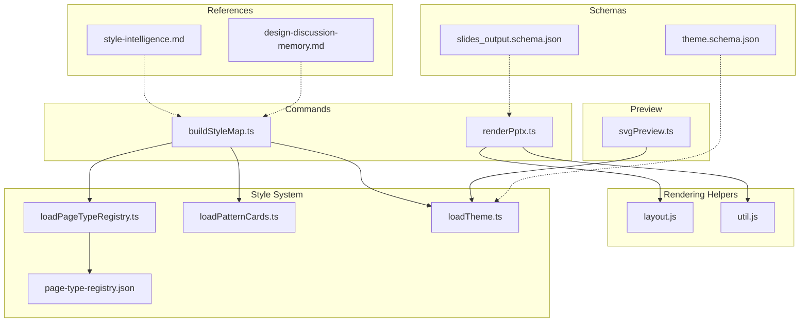
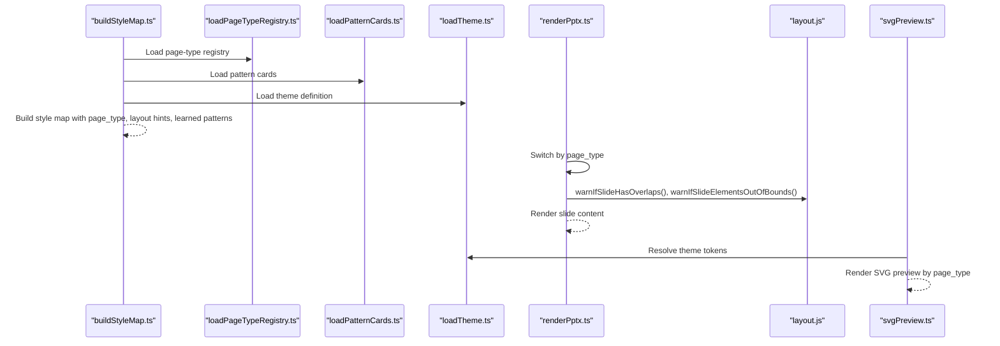
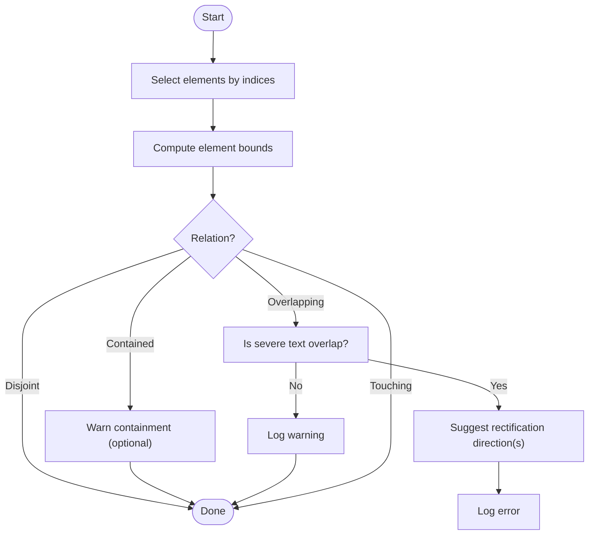
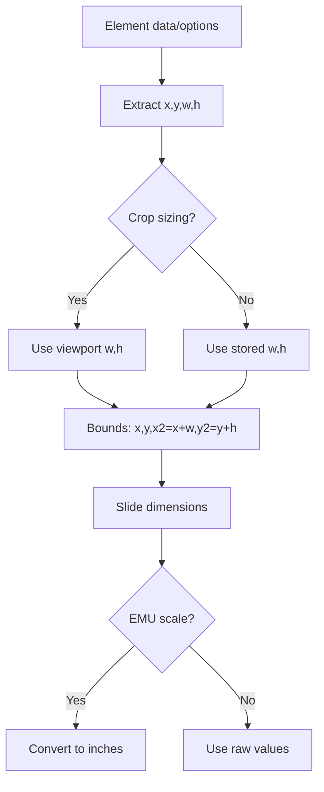
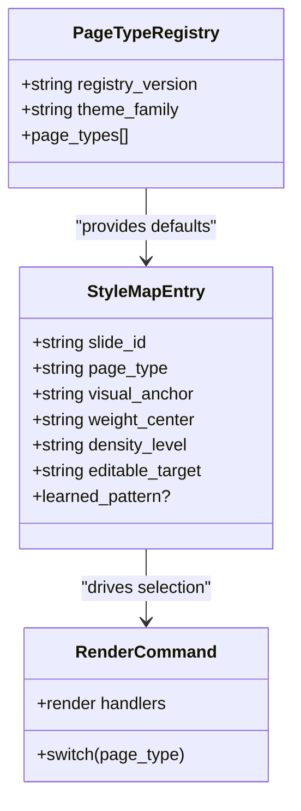
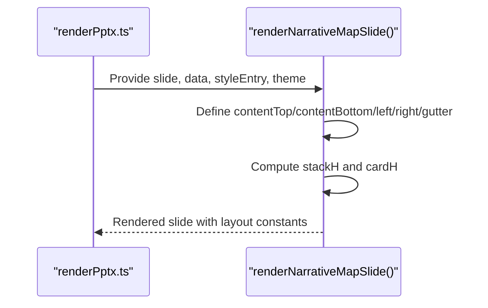
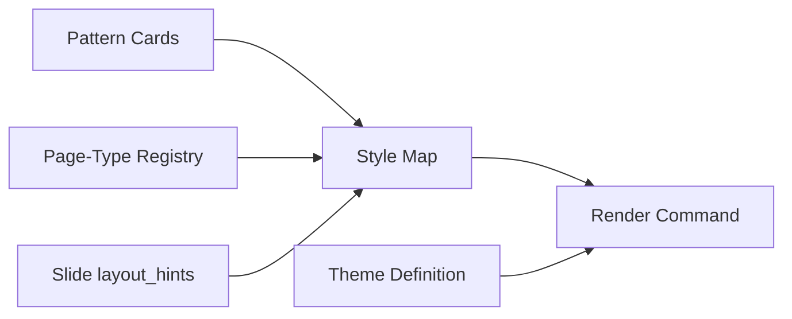
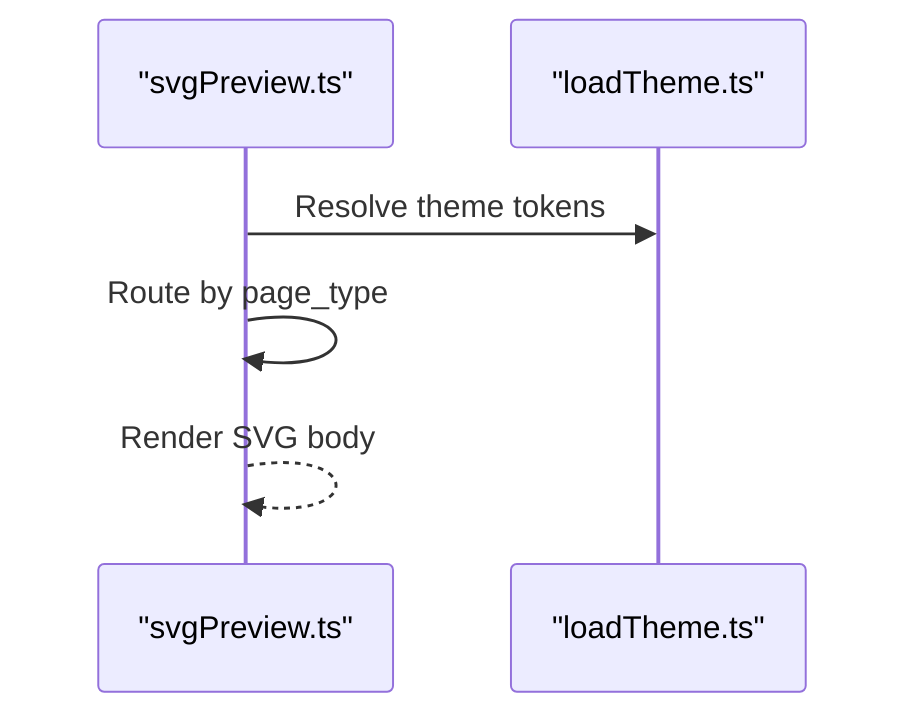
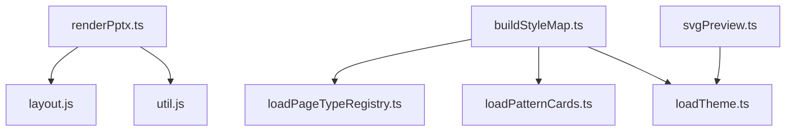

# Layout Management

<cite>
**Referenced Files in This Document**
- [layout.js](file://render/pptxgenjs_helpers/layout.js)
- [util.js](file://render/pptxgenjs_helpers/util.js)
- [renderPptx.ts](file://src/commands/renderPptx.ts)
- [buildStyleMap.ts](file://src/commands/buildStyleMap.ts)
- [loadPageTypeRegistry.ts](file://src/lib/style/loadPageTypeRegistry.ts)
- [loadPatternCards.ts](file://src/lib/style/loadPatternCards.ts)
- [loadTheme.ts](file://src/lib/style/loadTheme.ts)
- [page-type-registry.json](file://style/patterns/page-type-registry.json)
- [slides_output.schema.json](file://schemas/slides_output.schema.json)
- [theme.schema.json](file://schemas/theme.schema.json)
- [style-intelligence.md](file://references/style-intelligence.md)
- [design-discussion-memory.md](file://references/design-discussion-memory.md)
- [svgPreview.ts](file://src/lib/render/svgPreview.ts)
</cite>

## Table of Contents
1. [Introduction](#introduction)
2. [Project Structure](#project-structure)
3. [Core Components](#core-components)
4. [Architecture Overview](#architecture-overview)
5. [Detailed Component Analysis](#detailed-component-analysis)
6. [Dependency Analysis](#dependency-analysis)
7. [Performance Considerations](#performance-considerations)
8. [Troubleshooting Guide](#troubleshooting-guide)
9. [Conclusion](#conclusion)
10. [Appendices](#appendices)

## Introduction
This document explains the layout management system that controls slide formatting and positioning across page types. It covers:
- Layout algorithms for different slide types, including geometric calculations, spacing rules, and alignment strategies
- Utility functions for layout validation, including overlap detection and boundary checking
- Coordinate system, measurement units, and scaling factors
- Page type registry and selection/applying mechanism
- Consistency across slide types, responsive design considerations, and accessibility compliance
- Integration with the style system and how layout rules interact with visual patterns and themes

## Project Structure
The layout management system spans several modules:
- Rendering helpers for layout validation and element manipulation
- Command orchestration for applying page types and rendering slides
- Style system for page type registry, pattern cards, and theme definitions
- Schemas that define the shape of slide outputs and themes
- References that encode design intent and constraints

**Diagram sources**
- [layout.js:1-644](file://render/pptxgenjs_helpers/layout.js#L1-L644)
- [util.js:1-25](file://render/pptxgenjs_helpers/util.js#L1-L25)
- [renderPptx.ts:135-162](file://src/commands/renderPptx.ts#L135-L162)
- [buildStyleMap.ts:79-109](file://src/commands/buildStyleMap.ts#L79-L109)
- [loadPageTypeRegistry.ts:1-20](file://src/lib/style/loadPageTypeRegistry.ts#L1-L20)
- [loadPatternCards.ts:1-48](file://src/lib/style/loadPatternCards.ts#L1-L48)
- [loadTheme.ts:1-28](file://src/lib/style/loadTheme.ts#L1-L28)
- [page-type-registry.json:1-115](file://style/patterns/page-type-registry.json#L1-L115)
- [slides_output.schema.json:1-53](file://schemas/slides_output.schema.json#L1-L53)
- [theme.schema.json:1-57](file://schemas/theme.schema.json#L1-L57)
- [style-intelligence.md:1-79](file://references/style-intelligence.md#L1-L79)
- [design-discussion-memory.md:55-101](file://references/design-discussion-memory.md#L55-L101)
- [svgPreview.ts:81-112](file://src/lib/render/svgPreview.ts#L81-L112)

**Section sources**
- [layout.js:1-644](file://render/pptxgenjs_helpers/layout.js#L1-L644)
- [util.js:1-25](file://render/pptxgenjs_helpers/util.js#L1-L25)
- [renderPptx.ts:135-162](file://src/commands/renderPptx.ts#L135-L162)
- [buildStyleMap.ts:79-109](file://src/commands/buildStyleMap.ts#L79-L109)
- [loadPageTypeRegistry.ts:1-20](file://src/lib/style/loadPageTypeRegistry.ts#L1-L20)
- [loadPatternCards.ts:1-48](file://src/lib/style/loadPatternCards.ts#L1-L48)
- [loadTheme.ts:1-28](file://src/lib/style/loadTheme.ts#L1-L28)
- [page-type-registry.json:1-115](file://style/patterns/page-type-registry.json#L1-L115)
- [slides_output.schema.json:1-53](file://schemas/slides_output.schema.json#L1-L53)
- [theme.schema.json:1-57](file://schemas/theme.schema.json#L1-L57)
- [style-intelligence.md:1-79](file://references/style-intelligence.md#L1-L79)
- [design-discussion-memory.md:55-101](file://references/design-discussion-memory.md#L55-L101)
- [svgPreview.ts:81-112](file://src/lib/render/svgPreview.ts#L81-L112)

## Core Components
- Layout utilities: element alignment, distribution, overlap detection, and boundary warnings
- Element position and dimension helpers: bounds extraction, coordinate setting, and slide dimension inference
- Rendering orchestration: selecting page type handlers and applying QA checks
- Style system: page type registry, pattern cards, and theme definitions
- Preview rendering: SVG-based previews keyed by page type

Key responsibilities:
- Enforce layout rules per page type using explicit coordinates and derived sizes
- Validate layout correctness with overlap and boundary checks
- Integrate style hints and learned patterns to drive layout decisions
- Maintain consistency across page types and themes

**Section sources**
- [layout.js:23-232](file://render/pptxgenjs_helpers/layout.js#L23-L232)
- [layout.js:462-517](file://render/pptxgenjs_helpers/layout.js#L462-L517)
- [layout.js:519-573](file://render/pptxgenjs_helpers/layout.js#L519-L573)
- [layout.js:575-633](file://render/pptxgenjs_helpers/layout.js#L575-L633)
- [renderPptx.ts:135-162](file://src/commands/renderPptx.ts#L135-L162)
- [buildStyleMap.ts:79-109](file://src/commands/buildStyleMap.ts#L79-L109)
- [loadPageTypeRegistry.ts:1-20](file://src/lib/style/loadPageTypeRegistry.ts#L1-L20)
- [loadPatternCards.ts:1-48](file://src/lib/style/loadPatternCards.ts#L1-L48)
- [loadTheme.ts:1-28](file://src/lib/style/loadTheme.ts#L1-L28)
- [svgPreview.ts:81-112](file://src/lib/render/svgPreview.ts#L81-L112)

## Architecture Overview
The layout system orchestrates between style intelligence, page type selection, and rendering helpers.

**Diagram sources**
- [buildStyleMap.ts:79-109](file://src/commands/buildStyleMap.ts#L79-L109)
- [loadPageTypeRegistry.ts:1-20](file://src/lib/style/loadPageTypeRegistry.ts#L1-L20)
- [loadPatternCards.ts:1-48](file://src/lib/style/loadPatternCards.ts#L1-L48)
- [loadTheme.ts:1-28](file://src/lib/style/loadTheme.ts#L1-L28)
- [renderPptx.ts:135-162](file://src/commands/renderPptx.ts#L135-L162)
- [layout.js:23-232](file://render/pptxgenjs_helpers/layout.js#L23-L232)
- [layout.js:575-633](file://render/pptxgenjs_helpers/layout.js#L575-L633)
- [svgPreview.ts:81-112](file://src/lib/render/svgPreview.ts#L81-L112)

## Detailed Component Analysis

### Layout Utilities: Alignment, Distribution, Overlap Detection, Boundary Checks
- Alignment: Aligns selected elements to left/right/top/bottom or centers along axes
- Distribution: Distributes selected elements evenly along horizontal or vertical axis
- Overlap detection: Compares pairs of elements and detects overlaps or containment; includes special handling for diagonal lines and decorative shapes
- Boundary checks: Warns when elements exceed slide bounds

**Diagram sources**
- [layout.js:23-232](file://render/pptxgenjs_helpers/layout.js#L23-L232)
- [layout.js:234-345](file://render/pptxgenjs_helpers/layout.js#L234-L345)

**Section sources**
- [layout.js:23-232](file://render/pptxgenjs_helpers/layout.js#L23-L232)
- [layout.js:234-345](file://render/pptxgenjs_helpers/layout.js#L234-L345)
- [layout.js:462-517](file://render/pptxgenjs_helpers/layout.js#L462-L517)
- [layout.js:519-573](file://render/pptxgenjs_helpers/layout.js#L519-L573)
- [layout.js:575-633](file://render/pptxgenjs_helpers/layout.js#L575-L633)

### Coordinate System, Measurement Units, and Scaling
- Coordinates are stored as numeric x/y/w/h on element data/options
- For cropped images, viewport size is used for overlap/bounds computations
- Slide dimensions are inferred from pptxgenjs internals; large values are assumed EMU and converted to inches
- Utilities normalize and extract dimensions from multiple possible keys

**Diagram sources**
- [layout.js:356-369](file://render/pptxgenjs_helpers/layout.js#L356-L369)
- [layout.js:429-460](file://render/pptxgenjs_helpers/layout.js#L429-L460)

**Section sources**
- [layout.js:356-369](file://render/pptxgenjs_helpers/layout.js#L356-L369)
- [layout.js:429-460](file://render/pptxgenjs_helpers/layout.js#L429-L460)

### Page Type Registry and Selection
- Registry defines page types with narrative roles, visual anchors, weight center, density level, and editable target
- Style map resolution selects page type from either slide-provided or hinted values, enriched by pattern cards and layout hints
- Rendering command switches by page type to apply specialized layout rules

**Diagram sources**
- [page-type-registry.json:1-115](file://style/patterns/page-type-registry.json#L1-L115)
- [buildStyleMap.ts:79-109](file://src/commands/buildStyleMap.ts#L79-L109)
- [renderPptx.ts:135-162](file://src/commands/renderPptx.ts#L135-L162)

**Section sources**
- [page-type-registry.json:1-115](file://style/patterns/page-type-registry.json#L1-L115)
- [buildStyleMap.ts:79-109](file://src/commands/buildStyleMap.ts#L79-L109)
- [loadPageTypeRegistry.ts:1-20](file://src/lib/style/loadPageTypeRegistry.ts#L1-L20)
- [loadPatternCards.ts:1-48](file://src/lib/style/loadPatternCards.ts#L1-L48)
- [renderPptx.ts:135-162](file://src/commands/renderPptx.ts#L135-L162)

### Layout Algorithms by Page Type
- Narrative map slide: enforces shared top/bottom boundaries for left dominant card and right stack; computes card heights and gutters
- Other page types: rendered under dedicated handlers; QA checks are applied universally after rendering

**Diagram sources**
- [renderPptx.ts:368-401](file://src/commands/renderPptx.ts#L368-L401)

**Section sources**
- [renderPptx.ts:368-401](file://src/commands/renderPptx.ts#L368-L401)

### Integration with the Style System
- Learned patterns supply layout_rules, alignment_rules, and highlight_grammar
- Style map merges registry defaults with slide layout hints and pattern cards
- Themes provide palette and typography tokens consumed during rendering

**Diagram sources**
- [buildStyleMap.ts:79-109](file://src/commands/buildStyleMap.ts#L79-L109)
- [loadPatternCards.ts:1-48](file://src/lib/style/loadPatternCards.ts#L1-L48)
- [loadPageTypeRegistry.ts:1-20](file://src/lib/style/loadPageTypeRegistry.ts#L1-L20)
- [loadTheme.ts:1-28](file://src/lib/style/loadTheme.ts#L1-L28)
- [renderPptx.ts:135-162](file://src/commands/renderPptx.ts#L135-L162)

**Section sources**
- [buildStyleMap.ts:79-109](file://src/commands/buildStyleMap.ts#L79-L109)
- [loadPatternCards.ts:1-48](file://src/lib/style/loadPatternCards.ts#L1-L48)
- [loadPageTypeRegistry.ts:1-20](file://src/lib/style/loadPageTypeRegistry.ts#L1-L20)
- [loadTheme.ts:1-28](file://src/lib/style/loadTheme.ts#L1-L28)
- [renderPptx.ts:135-162](file://src/commands/renderPptx.ts#L135-L162)

### Preview Rendering and Page Type Routing
- SVG preview renders a shell and routes to page-type-specific bodies
- Uses theme tokens for typography and colors

**Diagram sources**
- [svgPreview.ts:81-112](file://src/lib/render/svgPreview.ts#L81-L112)
- [loadTheme.ts:1-28](file://src/lib/style/loadTheme.ts#L1-L28)

**Section sources**
- [svgPreview.ts:81-112](file://src/lib/render/svgPreview.ts#L81-L112)
- [loadTheme.ts:1-28](file://src/lib/style/loadTheme.ts#L1-L28)

## Dependency Analysis
- Rendering depends on layout helpers for QA checks and element manipulation
- Style map resolution depends on registry, pattern cards, and theme definitions
- Preview rendering depends on theme definitions

**Diagram sources**
- [renderPptx.ts:135-162](file://src/commands/renderPptx.ts#L135-L162)
- [layout.js:1-644](file://render/pptxgenjs_helpers/layout.js#L1-L644)
- [util.js:1-25](file://render/pptxgenjs_helpers/util.js#L1-L25)
- [buildStyleMap.ts:79-109](file://src/commands/buildStyleMap.ts#L79-L109)
- [loadPageTypeRegistry.ts:1-20](file://src/lib/style/loadPageTypeRegistry.ts#L1-L20)
- [loadPatternCards.ts:1-48](file://src/lib/style/loadPatternCards.ts#L1-L48)
- [loadTheme.ts:1-28](file://src/lib/style/loadTheme.ts#L1-L28)
- [svgPreview.ts:81-112](file://src/lib/render/svgPreview.ts#L81-L112)

**Section sources**
- [renderPptx.ts:135-162](file://src/commands/renderPptx.ts#L135-L162)
- [layout.js:1-644](file://render/pptxgenjs_helpers/layout.js#L1-L644)
- [util.js:1-25](file://render/pptxgenjs_helpers/util.js#L1-L25)
- [buildStyleMap.ts:79-109](file://src/commands/buildStyleMap.ts#L79-L109)
- [loadPageTypeRegistry.ts:1-20](file://src/lib/style/loadPageTypeRegistry.ts#L1-L20)
- [loadPatternCards.ts:1-48](file://src/lib/style/loadPatternCards.ts#L1-L48)
- [loadTheme.ts:1-28](file://src/lib/style/loadTheme.ts#L1-L28)
- [svgPreview.ts:81-112](file://src/lib/render/svgPreview.ts#L81-L112)

## Performance Considerations
- Overlap detection compares all pairs of visible elements; complexity is O(n^2) in the number of elements considered
- Distribution and alignment operate on selected indices; performance scales linearly with the number of selected elements
- Slide dimension inference scans multiple internal candidates; cost is proportional to the number of candidates checked
- Recommendations:
  - Limit the number of elements per slide to reduce overlap checks
  - Pre-filter decorative or ignorable elements when possible
  - Cache slide dimensions when rendering multiple slides with the same layout

[No sources needed since this section provides general guidance]

## Troubleshooting Guide
Common issues and remedies:
- Severe text overlap: Detected when overlapping intersection exceeds thresholds; the system suggests rectification directions
- Containment warnings: Full containment between elements; can be muted via options
- Out-of-bounds elements: Elements whose bounds exceed slide width/height; logged with violation details
- Diagonal line false positives: Overlap detection excludes diagonal lines that do not intersect rectangles

Operational tips:
- Use muteContainment to suppress containment warnings when they are expected (e.g., full-slide backgrounds)
- IgnoreLines and ignoreDecorativeShapes options help focus on meaningful overlaps
- Review alignment and distribution logic when elements appear misaligned or unevenly spaced

**Section sources**
- [layout.js:23-232](file://render/pptxgenjs_helpers/layout.js#L23-L232)
- [layout.js:575-633](file://render/pptxgenjs_helpers/layout.js#L575-L633)

## Conclusion
The layout management system combines explicit layout algorithms per page type with robust validation utilities to ensure consistent, readable, and accessible slide designs. It integrates tightly with the style system to apply learned patterns and theme tokens, while providing safeguards against overlaps and boundary violations. The modular design supports maintainability and extensibility across diverse slide types.

[No sources needed since this section summarizes without analyzing specific files]

## Appendices

### Accessibility Compliance Notes
- Text overlap detection helps prevent readability issues; address severe overlaps flagged by the system
- Boundary checks ensure content remains within slide bounds, improving screen reader navigation
- Asymmetry and density rules from design references guide balanced compositions that aid comprehension

[No sources needed since this section provides general guidance]

### Responsive Design Considerations
- Layout constants are expressed in absolute units; ensure consistent slide dimensions across outputs
- For dynamic content, consider deriving sizes proportionally from slide dimensions when adapting to different aspect ratios

[No sources needed since this section provides general guidance]