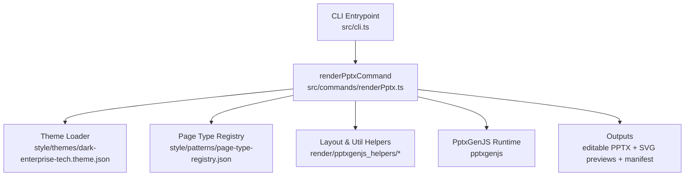
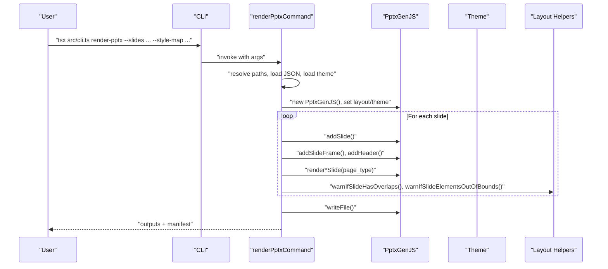
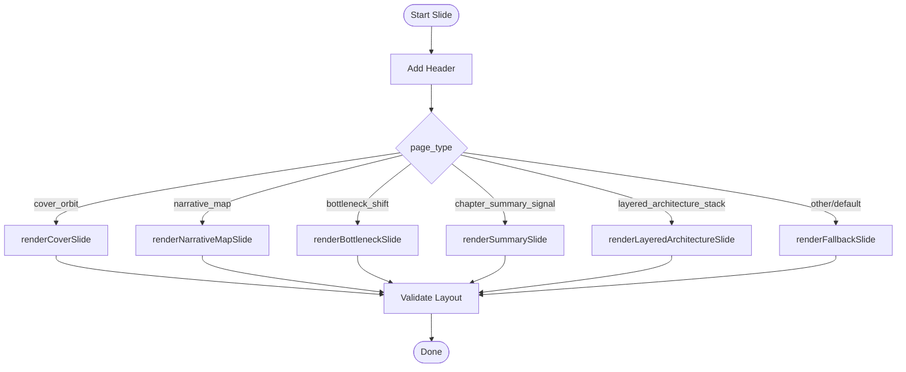
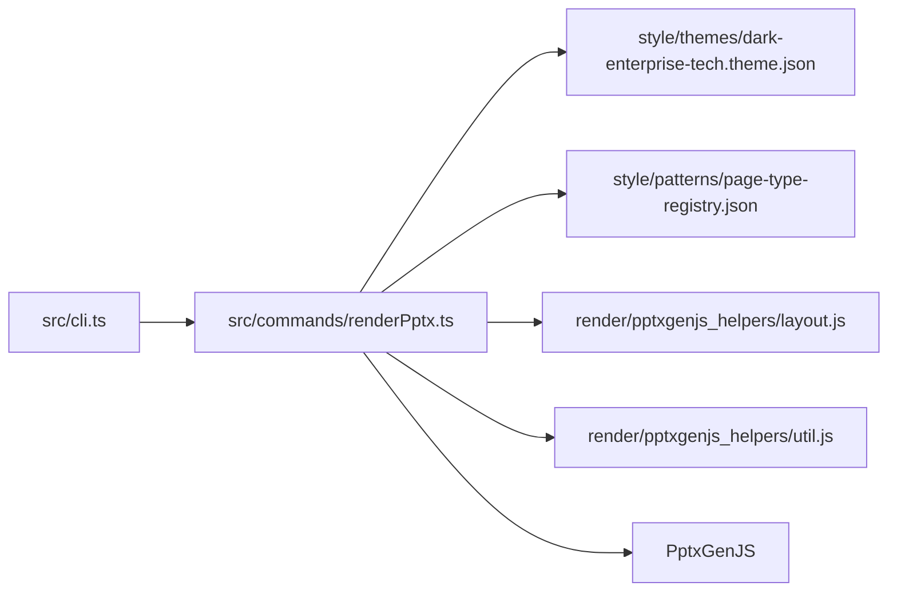

# PPTX Export

<cite>
**Referenced Files in This Document**
- [renderPptx.ts](file://src/commands/renderPptx.ts)
- [layout.js](file://render/pptxgenjs_helpers/layout.js)
- [util.js](file://render/pptxgenjs_helpers/util.js)
- [cli.ts](file://src/cli.ts)
- [dark-enterprise-tech.theme.json](file://style/themes/dark-enterprise-tech.theme.json)
- [page-type-registry.json](file://style/patterns/page-type-registry.json)
- [cover_orbit.openclaw-seed.pattern.json](file://style/patterns/cover_orbit.openclaw-seed.pattern.json)
- [bottleneck_shift.openclaw-seed.pattern.json](file://style/patterns/bottleneck_shift.openclaw-seed.pattern.json)
- [chapter_summary_signal.openclaw-seed.pattern.json](file://style/patterns/chapter_summary_signal.openclaw-seed.pattern.json)
- [layered_architecture_stack.openclaw-seed.pattern.json](file://style/patterns/layered_architecture_stack.openclaw-seed.pattern.json)
- [template.pattern-card.json](file://style/patterns/template.pattern-card.json)
</cite>

## Update Summary
**Changes Made**
- Enhanced cross-cutting concerns distribution algorithm in renderLayeredArchitectureSlide function
- Improved vertical spacing calculation for better visual presentation alignment
- Refined connector line positioning with proper layer-to-detail matching
- Enhanced coordinate format handling for line shapes in layered architecture presentations
- Improved rendering reliability for cross-layer connector lines

## Table of Contents
1. [Introduction](#introduction)
2. [Project Structure](#project-structure)
3. [Core Components](#core-components)
4. [Architecture Overview](#architecture-overview)
5. [Detailed Component Analysis](#detailed-component-analysis)
6. [Dependency Analysis](#dependency-analysis)
7. [Performance Considerations](#performance-considerations)
8. [Troubleshooting Guide](#troubleshooting-guide)
9. [Conclusion](#conclusion)
10. [Appendices](#appendices)

## Introduction
This document explains the PPTX export functionality that generates editable PowerPoint presentations using the PptxGenJS library. It covers the native PowerPoint generation process, slide creation and formatting, layout management, command-line interface, argument handling, output path resolution, slide rendering functions for different page types (cover, narrative map, bottleneck shift, summary, layered architecture), editable delivery strategy, visual styling (shadows, typography, color schemes), performance considerations, memory management, error handling, and integration with the style system and theme application.

## Project Structure
The PPTX export capability is implemented as a command-line tool that orchestrates rendering of slides into a PowerPoint deck. Key areas:
- CLI entrypoint registers and dispatches the render-pptx command.
- The render command loads slides and style map, applies theme, renders per-page-type slides, validates layout, and writes outputs.
- Helpers enforce layout correctness and provide safe shadow utilities.
- Styles and themes define palette, typography, and page-type semantics.

**Diagram sources**
- [cli.ts:19-56](file://src/cli.ts#L19-L56)
- [renderPptx.ts:83-187](file://src/commands/renderPptx.ts#L83-L187)
- [dark-enterprise-tech.theme.json:1-55](file://style/themes/dark-enterprise-tech.theme.json#L1-L55)
- [page-type-registry.json:1-115](file://style/patterns/page-type-registry.json#L1-L115)
- [layout.js:23-232](file://render/pptxgenjs_helpers/layout.js#L23-L232)
- [util.js:4-20](file://render/pptxgenjs_helpers/util.js#L4-L20)

**Section sources**
- [cli.ts:19-56](file://src/cli.ts#L19-L56)
- [renderPptx.ts:83-187](file://src/commands/renderPptx.ts#L83-L187)
- [dark-enterprise-tech.theme.json:1-55](file://style/themes/dark-enterprise-tech.theme.json#L1-L55)
- [page-type-registry.json:1-115](file://style/patterns/page-type-registry.json#L1-L115)
- [layout.js:23-232](file://render/pptxgenjs_helpers/layout.js#L23-L232)
- [util.js:4-20](file://render/pptxgenjs_helpers/util.js#L4-L20)

## Core Components
- CLI command registration and dispatch for render-pptx.
- renderPptxCommand: Loads inputs, initializes PptxGenJS, applies theme, iterates slides, renders per-type, validates layout, writes outputs.
- Layout helpers: Detect overlaps, containment, and out-of-bounds elements; align and distribute elements.
- Utilities: Safe outer shadow factory for consistent shadow definitions.
- Theme and patterns: Palette, typography, page-type registry, and pattern cards inform rendering.

**Section sources**
- [cli.ts:10-17](file://src/cli.ts#L10-L17)
- [renderPptx.ts:83-187](file://src/commands/renderPptx.ts#L83-L187)
- [layout.js:23-232](file://render/pptxgenjs_helpers/layout.js#L23-L232)
- [util.js:4-20](file://render/pptxgenjs_helpers/util.js#L4-L20)
- [dark-enterprise-tech.theme.json:4-53](file://style/themes/dark-enterprise-tech.theme.json#L4-L53)
- [page-type-registry.json:3-112](file://style/patterns/page-type-registry.json#L3-L112)

## Architecture Overview
The render pipeline:
- Parse CLI args and resolve input paths.
- Load slides JSON and style map; validate counts match.
- Load theme; prepare visual assets.
- Initialize PptxGenJS with layout and theme metadata.
- For each slide:
  - Add slide frame and header.
  - Dispatch to page-type renderer.
  - Validate layout (overlaps, out-of-bounds).
- Write PPTX, SVG previews, and render manifest.

**Diagram sources**
- [cli.ts:19-56](file://src/cli.ts#L19-L56)
- [renderPptx.ts:83-187](file://src/commands/renderPptx.ts#L83-L187)
- [layout.js:23-232](file://render/pptxgenjs_helpers/layout.js#L23-L232)

## Detailed Component Analysis

### CLI and Argument Handling
- Registers render-pptx command and prints help.
- render-pptx expects --slides and --style-map; optional --theme-file, --out-manifest, --out-pptx, --out-preview-dir.
- Validates presence of required inputs and throws if missing.

**Section sources**
- [cli.ts:10-17](file://src/cli.ts#L10-L17)
- [cli.ts:39-50](file://src/cli.ts#L39-L50)
- [renderPptx.ts:94-99](file://src/commands/renderPptx.ts#L94-L99)

### PptxGenJS Initialization and Theme Application
- Creates PptxGenJS instance and sets layout to wide, author/company/subject/title/lang, and theme fonts.
- Applies theme palette and typography to slide background and text.

**Section sources**
- [renderPptx.ts:115-126](file://src/commands/renderPptx.ts#L115-L126)
- [dark-enterprise-tech.theme.json:4-21](file://style/themes/dark-enterprise-tech.theme.json#L4-L21)

### Slide Creation and Frame/Header
- Adds a rounded background frame and a borderless inner rounded rectangle for slide content area.
- Adds header text blocks for deck branding, title, and optional subtitle.

**Section sources**
- [renderPptx.ts:189-208](file://src/commands/renderPptx.ts#L189-L208)
- [renderPptx.ts:210-244](file://src/commands/renderPptx.ts#L210-L244)

### Page-Type Rendering Functions
- Switch by page_type from style map to render specialized layouts:
  - Cover slide: Hero image region, claim card, orbit accents, story points.
  - Narrative map: Dominant/supporting chapters, decision cue.
  - Bottleneck shift: Thesis statement, contextual grounding image, support cards.
  - Chapter summary signal: Summary takeaways, implications, decision cue.
  - Layered architecture: Stack layers with cross-cutting concerns and connector lines.
  - Fallback: Generic centered claim block.

**Diagram sources**
- [renderPptx.ts:139-155](file://src/commands/renderPptx.ts#L139-L155)
- [renderPptx.ts:246-363](file://src/commands/renderPptx.ts#L246-L363)
- [renderPptx.ts:365-436](file://src/commands/renderPptx.ts#L365-L436)
- [renderPptx.ts:438-540](file://src/commands/renderPptx.ts#L438-L540)
- [renderPptx.ts:542-645](file://src/commands/renderPptx.ts#L542-L645)
- [renderPptx.ts:868-1049](file://src/commands/renderPptx.ts#L868-L1049)
- [renderPptx.ts:647-668](file://src/commands/renderPptx.ts#L647-L668)

#### Cover Slide Rendering
- Hero image region with inset and rounded frame.
- Claim card with accent border and shadow.
- Orbit circles and labels for thematic emphasis.
- Story points as small pill-shaped badges below.

**Section sources**
- [renderPptx.ts:246-363](file://src/commands/renderPptx.ts#L246-L363)
- [cover_orbit.openclaw-seed.pattern.json:19-23](file://style/patterns/cover_orbit.openclaw-seed.pattern.json#L19-L23)

#### Narrative Map Rendering
- Left column: dominant chapter block.
- Right column: two stacked supporting chapter cards.
- Bottom bar: decision cue.

**Section sources**
- [renderPptx.ts:365-436](file://src/commands/renderPptx.ts#L365-L436)

#### Bottleneck Shift Rendering
- Left column: oversized primary statement, explanatory note, grounding visual region.
- Right column: up to three support cards with step indicators.
- Uses contextual image mode from pattern.

**Section sources**
- [renderPptx.ts:438-540](file://src/commands/renderPptx.ts#L438-L540)
- [bottleneck_shift.openclaw-seed.pattern.json:19-23](file://style/patterns/bottleneck_shift.openclaw-seed.pattern.json#L19-L23)

#### Chapter Summary Signal Rendering
- Left: summary takeaways and implications list.
- Right: decision cue and commentary.

**Section sources**
- [renderPptx.ts:542-645](file://src/commands/renderPptx.ts#L542-L645)
- [chapter_summary_signal.openclaw-seed.pattern.json:19-23](file://style/patterns/chapter_summary_signal.openclaw-seed.pattern.json#L19-L23)

#### Layered Architecture Rendering
- **Updated**: Enhanced cross-cutting concerns distribution algorithm with improved vertical spacing calculation.
- Stack layers with consistent spacing and visual hierarchy using fixed layer heights.
- Cross-cutting concerns with connector lines that properly handle coordinate calculations and layer alignment.
- Improved rendering reliability for cross-layer relationships with enhanced algorithmic precision.

**Updated** Enhanced cross-cutting concerns distribution algorithm in renderLayeredArchitectureSlide function. The algorithm now features improved vertical spacing calculation and proper alignment with architectural layers for better visual presentation. Key improvements include:

- **Enhanced Vertical Spacing Calculation**: Uses `(contentBottom - contentTop - detailCardHeight) / Math.max(crossCutting.length - 1, 1)` for precise spacing distribution
- **Improved Layer-to-Detail Matching**: Connects cross-cutting concerns to corresponding architectural layers using `Math.min(index, layerCount - 1)` for robust layer indexing
- **Refined Coordinate Format Handling**: Implements proper min/max handling for line positioning with `Math.min(lineY1, lineY2)` and `Math.abs(lineH)`
- **Better Visual Presentation Alignment**: Ensures connector lines align precisely with layer centers using `contentTop + (layerCount - 1 - layerIndex) * (baseLayerHeight + layerSpacing) + baseLayerHeight / 2`

**Section sources**
- [renderPptx.ts:868-1049](file://src/commands/renderPptx.ts#L868-L1049)
- [layered_architecture_stack.openclaw-seed.pattern.json:10-23](file://style/patterns/layered_architecture_stack.openclaw-seed.pattern.json#L10-L23)

#### Fallback Rendering
- Large centered claim card for unknown page types.

**Section sources**
- [renderPptx.ts:647-668](file://src/commands/renderPptx.ts#L647-L668)

### Editable Delivery Strategy
- Uses native PptxGenJS shapes and text to maintain editable object structure.
- Shapes and text remain as PowerPoint-native objects for later editing.
- Pattern metadata includes editable_target hints indicating native shapes plus text.

**Section sources**
- [page-type-registry.json:12](file://style/patterns/page-type-registry.json#L12)
- [page-type-registry.json:21](file://style/patterns/page-type-registry.json#L21)
- [page-type-registry.json:48](file://style/patterns/page-type-registry.json#L48)
- [page-type-registry.json:102](file://style/patterns/page-type-registry.json#L102)
- [cover_orbit.openclaw-seed.pattern.json:35](file://style/patterns/cover_orbit.openclaw-seed.pattern.json#L35)
- [bottleneck_shift.openclaw-seed.pattern.json:35](file://style/patterns/bottleneck_shift.openclaw-seed.pattern.json#L35)
- [chapter_summary_signal.openclaw-seed.pattern.json:34](file://style/patterns/chapter_summary_signal.openclaw-seed.pattern.json#L34)
- [layered_architecture_stack.openclaw-seed.pattern.json:42](file://style/patterns/layered_architecture_stack.openclaw-seed.pattern.json#L42)

### Visual Styling: Shadows, Typography, Color Schemes
- Shadows: safeOuterShadow helper ensures consistent outer shadows with color, opacity, angle, blur, offset.
- Typography: theme.typography.font_family applied to headers and body text.
- Color scheme: theme.palette provides background, surface, surface_alt, text_primary/text_secondary, and accent colors.

**Section sources**
- [util.js:4-20](file://render/pptxgenjs_helpers/util.js#L4-L20)
- [renderPptx.ts:122-126](file://src/commands/renderPptx.ts#L122-L126)
- [renderPptx.ts:210-244](file://src/commands/renderPptx.ts#L210-L244)
- [dark-enterprise-tech.theme.json:4-21](file://style/themes/dark-enterprise-tech.theme.json#L4-L21)

### Layout Management and Validation
- warnIfSlideHasOverlaps: Detects overlapping elements, with special handling for diagonal lines and decorative shapes; severity escalates for text overlaps.
- warnIfSlideElementsOutOfBounds: Checks elements against computed slide dimensions and warns on violations.
- Alignment and distribution utilities are available for advanced layout adjustments.

**Section sources**
- [layout.js:23-232](file://render/pptxgenjs_helpers/layout.js#L23-L232)
- [layout.js:575-633](file://render/pptxgenjs_helpers/layout.js#L575-L633)

### Output Path Resolution and Manifest Generation
- resolveWritablePptxPath: If the requested path exists, appends a timestamped suffix to avoid overwrite; otherwise returns the requested path.
- Writes PPTX, SVG previews, and a render manifest with deck metadata and artifact references.

**Section sources**
- [renderPptx.ts:791-800](file://src/commands/renderPptx.ts#L791-L800)
- [renderPptx.ts:161-186](file://src/commands/renderPptx.ts#L161-L186)

## Dependency Analysis
- renderPptxCommand depends on:
  - PptxGenJS runtime for slide creation and writing.
  - Theme loader for palette and typography.
  - Layout helpers for validation.
  - CLI for argument parsing and dispatch.

**Diagram sources**
- [cli.ts:19-56](file://src/cli.ts#L19-L56)
- [renderPptx.ts:83-187](file://src/commands/renderPptx.ts#L83-L187)
- [dark-enterprise-tech.theme.json:1-55](file://style/themes/dark-enterprise-tech.theme.json#L1-L55)
- [page-type-registry.json:1-115](file://style/patterns/page-type-registry.json#L1-L115)
- [layout.js:23-232](file://render/pptxgenjs_helpers/layout.js#L23-L232)
- [util.js:4-20](file://render/pptxgenjs_helpers/util.js#L4-L20)

**Section sources**
- [cli.ts:19-56](file://src/cli.ts#L19-L56)
- [renderPptx.ts:83-187](file://src/commands/renderPptx.ts#L83-L187)
- [layout.js:23-232](file://render/pptxgenjs_helpers/layout.js#L23-L232)
- [util.js:4-20](file://render/pptxgenjs_helpers/util.js#L4-L20)

## Performance Considerations
- Minimize repeated theme lookups by caching theme object per run.
- Prefer batched shape/text additions within a slide to reduce internal reflows.
- Validate early: ensure slides and style map lengths match before iteration.
- Avoid excessive shadow blur and opacity combinations that increase rendering cost.
- For large decks, consider splitting into batches and writing manifests incrementally.

## Troubleshooting Guide
Common issues and remedies:
- Missing required arguments: Ensure --slides and --style-map are provided.
- Mismatched slide counts: The command validates that slides and style map entries match; fix input data.
- Overlapping text elements: The overlap validator raises warnings and suggestions; adjust positions to avoid overlaps.
- Elements outside slide bounds: The out-of-bounds validator logs violations; constrain coordinates within slide dimensions.
- Output path conflicts: The resolver appends a timestamped suffix when the file exists; confirm the intended output location.
- **Updated**: Layered architecture line rendering issues: The enhanced cross-cutting concerns distribution algorithm ensures reliable cross-layer connector lines with improved vertical spacing calculation and proper alignment with architectural layers.

**Section sources**
- [renderPptx.ts:94-99](file://src/commands/renderPptx.ts#L94-L99)
- [renderPptx.ts:111-113](file://src/commands/renderPptx.ts#L111-L113)
- [layout.js:23-232](file://render/pptxgenjs_helpers/layout.js#L23-L232)
- [layout.js:575-633](file://render/pptxgenjs_helpers/layout.js#L575-L633)
- [renderPptx.ts:791-800](file://src/commands/renderPptx.ts#L791-L800)

## Conclusion
The PPTX export system integrates CLI orchestration, theme-driven styling, and pattern-aware rendering to produce editable PowerPoint decks. It leverages PptxGenJS for native object fidelity, enforces layout correctness via helper validations, and supports an editable delivery strategy. The modular design allows extension to new page types and refinement of visual styles. Recent enhancements to the cross-cutting concerns distribution algorithm in the layered architecture rendering significantly improve visual presentation alignment and rendering reliability while maintaining backward compatibility.

## Appendices

### Appendix A: Page Types and Pattern Metadata
- Page type registry defines theme family and editable_target for each page type.
- Pattern cards specify image usage modes and editable_target guidance.

**Section sources**
- [page-type-registry.json:3-112](file://style/patterns/page-type-registry.json#L3-L112)
- [cover_orbit.openclaw-seed.pattern.json:19-23](file://style/patterns/cover_orbit.openclaw-seed.pattern.json#L19-L23)
- [bottleneck_shift.openclaw-seed.pattern.json:19-23](file://style/patterns/bottleneck_shift.openclaw-seed.pattern.json#L19-L23)
- [chapter_summary_signal.openclaw-seed.pattern.json:19-23](file://style/patterns/chapter_summary_signal.openclaw-seed.pattern.json#L19-L23)
- [layered_architecture_stack.openclaw-seed.pattern.json:10-23](file://style/patterns/layered_architecture_stack.openclaw-seed.pattern.json#L10-L23)
- [template.pattern-card.json:19-23](file://style/patterns/template.pattern-card.json#L19-L23)

### Appendix B: Enhanced Cross-Cutting Concerns Distribution Algorithm
**Updated** The layered architecture rendering now includes a sophisticated cross-cutting concerns distribution algorithm with several key improvements:

**Enhanced Vertical Spacing Calculation**
- Uses `(contentBottom - contentTop - detailCardHeight) / Math.max(crossCutting.length - 1, 1)` for precise vertical spacing distribution
- Ensures equal spacing between cross-cutting concern cards regardless of the number of items
- Handles edge cases where there are no cross-cutting concerns gracefully

**Improved Layer-to-Detail Matching**
- Connects cross-cutting concerns to corresponding architectural layers using `Math.min(index, layerCount - 1)` for robust layer indexing
- Calculates target layer positions with `contentTop + (layerCount - 1 - layerIndex) * (baseLayerHeight + layerSpacing) + baseLayerHeight / 2`
- Ensures connector lines align precisely with layer centers for better visual presentation

**Enhanced Coordinate Format Handling**
- Implements proper min/max handling for line positioning with `Math.min(lineY1, lineY2)` and `Math.abs(lineH)`
- Uses `Math.min()` to ensure line coordinates are always valid regardless of layer order
- Employs `Math.abs()` for line height calculations to prevent negative values

**Robust Connector Line Rendering**
- Only draws connector lines when the distance between layer and detail is within reasonable limits (`< 2.0`)
- Prevents overly long or misplaced connector lines that would disrupt visual presentation
- Uses dashed lines with `dashType: "dash"` for subtle visual connections

**Section sources**
- [renderPptx.ts:1000-1026](file://src/commands/renderPptx.ts#L1000-L1026)
- [renderPptx.ts:1017-1024](file://src/commands/renderPptx.ts#L1017-L1024)
- [layout.js:519-573](file://render/pptxgenjs_helpers/layout.js#L519-L573)