# Preview System

<cite>
**Referenced Files in This Document**
- [svgPreview.ts](file://src/lib/render/svgPreview.ts)
- [visualAssets.ts](file://src/lib/render/visualAssets.ts)
- [renderPptx.ts](file://src/commands/renderPptx.ts)
- [rerenderPages.ts](file://src/commands/rerenderPages.ts)
- [buildStyleMap.ts](file://src/commands/buildStyleMap.ts)
- [loadPatternCards.ts](file://src/lib/style/loadPatternCards.ts)
- [ADR-0002-editable-pptx-strategy.md](file://docs/decisions/ADR-0002-editable-pptx-strategy.md)
- [ADR-0003-fast-track-mvp.md](file://docs/decisions/ADR-0003-fast-track-mvp.md)
- [04-editable-output-strategy.md](file://04-editable-output-strategy.md)
- [01-system-architecture.md](file://01-system-architecture.md)
- [03-operating-workflow.md](file://03-operating-workflow.md)
- [layout.js](file://render/pptxgenjs_helpers/layout.js)
- [util.js](file://render/pptxgenjs_helpers/util.js)
</cite>

## Update Summary
**Changes Made**
- Enhanced layered architecture preview with improved cross-cutting concerns distribution
- Added better title alignment consistency with explicit alignment rules
- Improved connector line calculations for cleaner visual connections between layers
- Integrated alignment rules from pattern cards into both preview and delivery systems
- Updated cross-cutting concerns rendering with precise connector positioning

## Table of Contents
1. [Introduction](#introduction)
2. [Project Structure](#project-structure)
3. [Core Components](#core-components)
4. [Architecture Overview](#architecture-overview)
5. [Detailed Component Analysis](#detailed-component-analysis)
6. [Alignment Rules and Cross-Cutting Concerns](#alignment-rules-and-cross-cutting-concerns)
7. [Dependency Analysis](#dependency-analysis)
8. [Performance Considerations](#performance-considerations)
9. [Troubleshooting Guide](#troubleshooting-guide)
10. [Conclusion](#conclusion)
11. [Appendices](#appendices)

## Introduction
This document describes the preview rendering system responsible for generating HTML/SVG visualizations of slide content. It explains how vector graphics are produced per slide, how interactive preview pages are assembled, and how visual assets are managed for preview generation. The system now features enhanced layered architecture previews with improved cross-cutting concerns distribution, better title alignment consistency, and enhanced connector line calculations for cleaner visual connections between layers. It also documents the relationship between preview generation and the editable PPTX delivery pipeline, including how preview data informs final presentation formatting. Finally, it covers performance optimization, caching strategies, scalability considerations, and integration with the broader rendering pipeline and QA processes.

## Project Structure
The preview system spans several modules:
- Rendering logic for SVG slide previews and HTML cards
- Visual assets management for reusable SVG components
- CLI command to orchestrate PPTX rendering and preview generation
- Pattern card system defining alignment rules and layout guidelines
- Helper utilities for PPTX layout and shadows
- Architectural decisions and operating guidelines that shape preview/delivery alignment

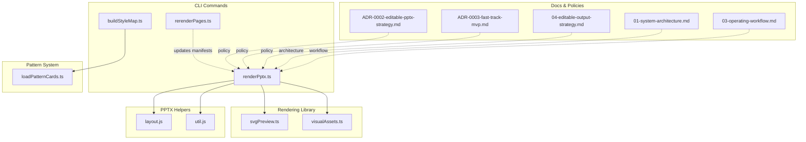

**Diagram sources**
- [renderPptx.ts:100-130](file://src/commands/renderPptx.ts#L100-L130)
- [svgPreview.ts:28-67](file://src/lib/render/svgPreview.ts#L28-L67)
- [visualAssets.ts:11-24](file://src/lib/render/visualAssets.ts#L11-L24)
- [buildStyleMap.ts:34-46](file://src/commands/buildStyleMap.ts#L34-L46)
- [loadPatternCards.ts:10-27](file://src/lib/style/loadPatternCards.ts#L10-L27)
- [layout.js:429-460](file://render/pptxgenjs_helpers/layout.js#L429-L460)
- [util.js:5-20](file://render/pptxgenjs_helpers/util.js#L5-L20)
- [ADR-0002-editable-pptx-strategy.md:1-28](file://docs/decisions/ADR-0002-editable-pptx-strategy.md#L1-L28)
- [ADR-0003-fast-track-mvp.md:1-29](file://docs/decisions/ADR-0003-fast-track-mvp.md#L1-L29)
- [04-editable-output-strategy.md:1-62](file://04-editable-output-strategy.md#L1-L62)
- [01-system-architecture.md:98-106](file://01-system-architecture.md#L98-L106)
- [03-operating-workflow.md:88-112](file://03-operating-workflow.md#L88-L112)

**Section sources**
- [svgPreview.ts:28-67](file://src/lib/render/svgPreview.ts#L28-L67)
- [visualAssets.ts:11-24](file://src/lib/render/visualAssets.ts#L11-L24)
- [renderPptx.ts:80-130](file://src/commands/renderPptx.ts#L80-L130)
- [buildStyleMap.ts:34-46](file://src/commands/buildStyleMap.ts#L34-L46)
- [loadPatternCards.ts:10-27](file://src/lib/style/loadPatternCards.ts#L10-L27)
- [ADR-0002-editable-pptx-strategy.md:1-28](file://docs/decisions/ADR-0002-editable-pptx-strategy.md#L1-L28)
- [ADR-0003-fast-track-mvp.md:1-29](file://docs/decisions/ADR-0003-fast-track-mvp.md#L1-L29)
- [04-editable-output-strategy.md:1-62](file://04-editable-output-strategy.md#L1-L62)
- [01-system-architecture.md:98-106](file://01-system-architecture.md#L98-L106)
- [03-operating-workflow.md:88-112](file://03-operating-workflow.md#L88-L112)

## Core Components
- SVG slide preview generator: Produces a vector SVG per slide and an HTML index page of cards linking to each SVG.
- Visual assets manager: Generates reusable SVG assets (e.g., orbit boards, loop heroes) and returns their filesystem paths.
- PPTX renderer orchestrator: Loads slides and style maps, ensures visual assets, and builds a PPTX while preserving page-type semantics.
- Pattern card system: Defines alignment rules and layout guidelines that guide both preview and delivery rendering.
- Layout and shadow helpers: Provide safe defaults for PPTX element positioning and visual effects.
- Policy and workflow documents: Define dual-output strategy, editable PPTX preference, and operating procedures.

Key responsibilities:
- Vector rendering: Each slide is rendered as an SVG with theme-aware colors, gradients, and page-type-specific content areas.
- Interactive preview: An HTML page displays a grid of slide cards, each linking to its SVG.
- Asset bundling: Reusable SVGs are written once and reused across slides and preview generation.
- Delivery alignment: Preview logic preserves semantic page types so the PPTX renderer can map them to native slide objects.
- Alignment enforcement: Pattern cards define explicit alignment rules that ensure consistent visual hierarchy across both preview and delivery.

**Section sources**
- [svgPreview.ts:28-67](file://src/lib/render/svgPreview.ts#L28-L67)
- [visualAssets.ts:11-24](file://src/lib/render/visualAssets.ts#L11-L24)
- [renderPptx.ts:100-130](file://src/commands/renderPptx.ts#L100-L130)
- [buildStyleMap.ts:34-46](file://src/commands/buildStyleMap.ts#L34-L46)
- [layout.js:429-460](file://render/pptxgenjs_helpers/layout.js#L429-L460)
- [util.js:5-20](file://render/pptxgenjs_helpers/util.js#L5-L20)

## Architecture Overview
The preview system integrates with the broader rendering pipeline to support both rapid review and editable delivery, now enhanced with alignment rules enforcement.

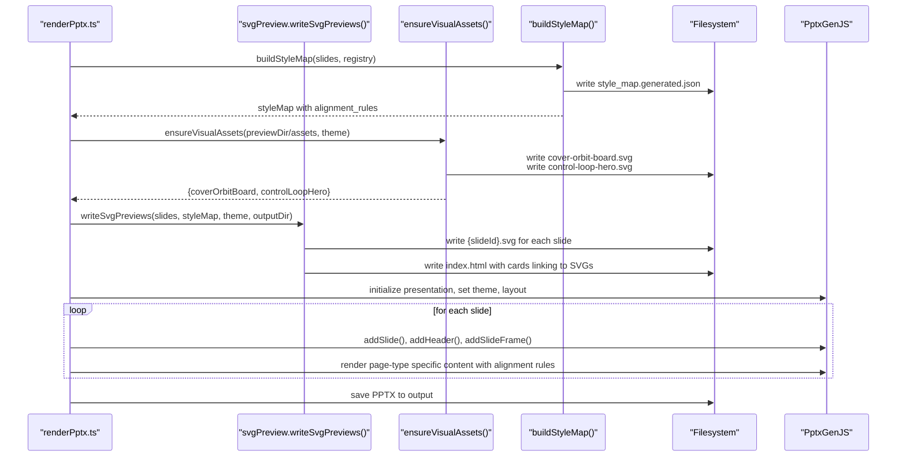

**Diagram sources**
- [renderPptx.ts:100-130](file://src/commands/renderPptx.ts#L100-L130)
- [svgPreview.ts:28-67](file://src/lib/render/svgPreview.ts#L28-L67)
- [visualAssets.ts:11-24](file://src/lib/render/visualAssets.ts#L11-L24)
- [buildStyleMap.ts:50-110](file://src/commands/buildStyleMap.ts#L50-L110)

## Detailed Component Analysis

### SVG Slide Preview Generator
Responsibilities:
- Iterate over slide records and style entries to render a unique SVG per slide.
- Emit a shell with theme-aware background, glow gradient, and header text.
- Dispatch to page-type-specific renderers (cover, narrative map, bottleneck shift, chapter summary, trust terminal, layered architecture, fallback).
- Write each SVG to disk and collect HTML card fragments for the preview index.

Processing logic:
- Determine page type from style entry, slide metadata, or hint.
- Build SVG definition blocks (gradients) and shell (background, strokes, header).
- Render page-type body and compose the final SVG document.
- Write index.html with responsive grid of cards referencing each SVG.

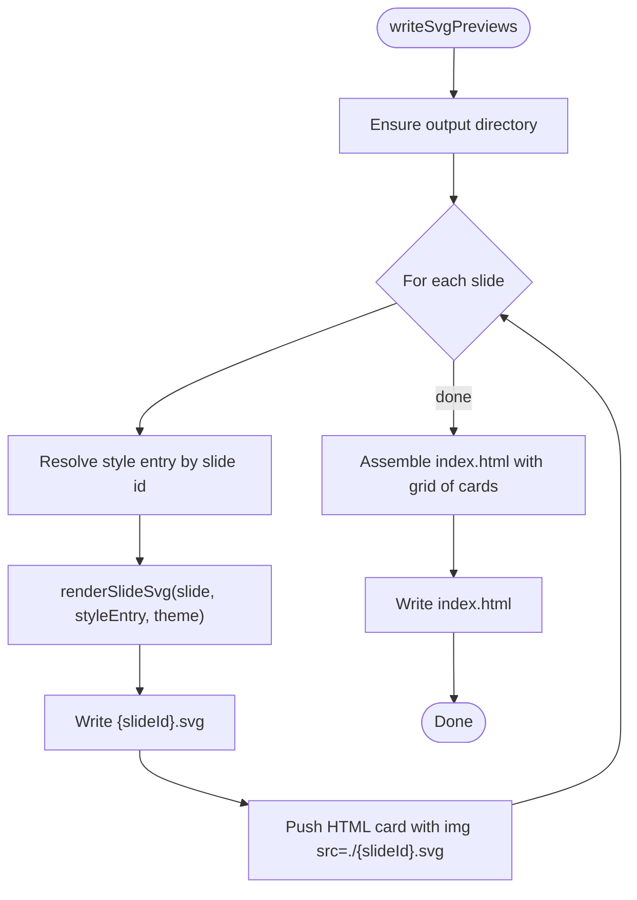

**Diagram sources**
- [svgPreview.ts:28-67](file://src/lib/render/svgPreview.ts#L28-L67)
- [svgPreview.ts:69-112](file://src/lib/render/svgPreview.ts#L69-L112)

**Section sources**
- [svgPreview.ts:28-67](file://src/lib/render/svgPreview.ts#L28-L67)
- [svgPreview.ts:69-112](file://src/lib/render/svgPreview.ts#L69-L112)

### Visual Assets Manager
Responsibilities:
- Ensure the preview assets directory exists.
- Generate reusable SVGs (e.g., cover-orbit board, control loop hero) based on theme tokens.
- Write assets to disk and return their absolute paths for downstream use.

Usage:
- Called during PPTX rendering to pre-bundle assets into the preview directory.
- Returned paths can be used by both preview and delivery renderers.

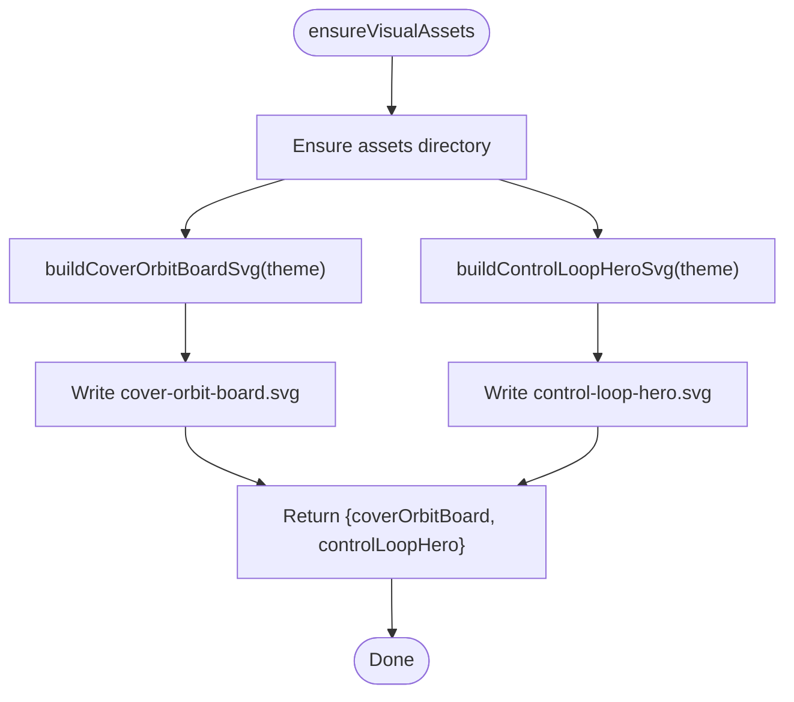

**Diagram sources**
- [visualAssets.ts:11-24](file://src/lib/render/visualAssets.ts#L11-L24)
- [visualAssets.ts:26-71](file://src/lib/render/visualAssets.ts#L26-L71)
- [visualAssets.ts:74-121](file://src/lib/render/visualAssets.ts#L74-L121)

**Section sources**
- [visualAssets.ts:11-24](file://src/lib/render/visualAssets.ts#L11-L24)

### PPTX Renderer Orchestration and Page-Type Semantics
Responsibilities:
- Load slides and style map, validate counts, and load theme.
- Ensure visual assets are present in the preview assets directory.
- Initialize PPTX with layout and theme fonts.
- For each slide, add frame, header, and render page-type-specific content using native PPTX objects.
- Preserve semantic page types so delivery formatting aligns with preview semantics.
- Apply alignment rules from pattern cards to ensure consistent visual hierarchy.

Integration points:
- Calls svgPreview to generate SVG previews for review.
- Uses layout.js to detect slide elements and warn about overlaps/out-of-bounds elements.
- Uses util.js to apply safe outer shadows consistently.
- Consumes alignment rules from learned patterns to enforce consistent layouts.

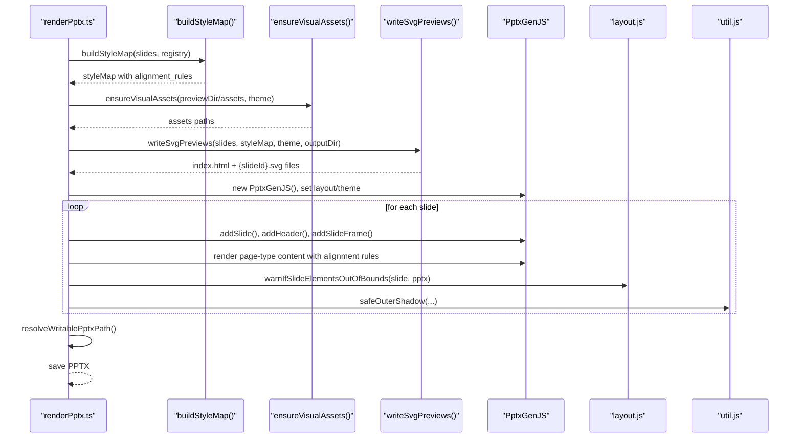

**Diagram sources**
- [renderPptx.ts:100-130](file://src/commands/renderPptx.ts#L100-L130)
- [renderPptx.ts:80-92](file://src/commands/renderPptx.ts#L80-L92)
- [buildStyleMap.ts:50-110](file://src/commands/buildStyleMap.ts#L50-L110)
- [layout.js:429-460](file://render/pptxgenjs_helpers/layout.js#L429-L460)
- [util.js:5-20](file://render/pptxgenjs_helpers/util.js#L5-L20)

**Section sources**
- [renderPptx.ts:80-130](file://src/commands/renderPptx.ts#L80-L130)
- [buildStyleMap.ts:50-110](file://src/commands/buildStyleMap.ts#L50-L110)
- [layout.js:429-460](file://render/pptxgenjs_helpers/layout.js#L429-L460)
- [util.js:5-20](file://render/pptxgenjs_helpers/util.js#L5-L20)

### Page-Type-Specific Renderers (SVG)
The preview system delegates to page-type-specific renderers for each slide. These functions compute positions and shapes based on theme tokens and slide blocks, returning SVG markup for the body portion of the slide.

Representative page types:
- Cover orbit: renders a hero area, orbital rings, and story points.
- Narrative map: splits content into dominant/supporting chapters and a decision cue.
- Bottleneck shift: emphasizes execution framing with optional contextual visuals.
- Chapter summary: presents summary signals and implications alongside a decision cue.
- Trust terminal: showcases terminal window with security indicators and governance labels.
- Layered architecture: displays architectural stack with cross-cutting concerns and enhanced connector lines.
- Fallback: renders a simple content container for unknown page types.

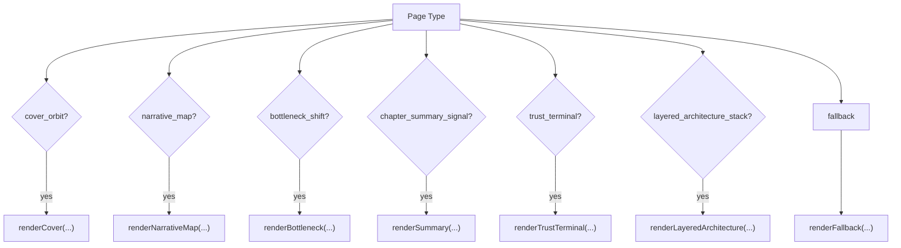

**Diagram sources**
- [svgPreview.ts:69-112](file://src/lib/render/svgPreview.ts#L69-L112)
- [svgPreview.ts:114-147](file://src/lib/render/svgPreview.ts#L114-L147)
- [svgPreview.ts:149-178](file://src/lib/render/svgPreview.ts#L149-L178)
- [svgPreview.ts:180-226](file://src/lib/render/svgPreview.ts#L180-L226)
- [svgPreview.ts:228-245](file://src/lib/render/svgPreview.ts#L228-L245)
- [svgPreview.ts:247-253](file://src/lib/render/svgPreview.ts#L247-L253)
- [svgPreview.ts:251-300](file://src/lib/render/svgPreview.ts#L251-L300)
- [svgPreview.ts:302-368](file://src/lib/render/svgPreview.ts#L302-L368)
- [svgPreview.ts:370-376](file://src/lib/render/svgPreview.ts#L370-L376)

**Section sources**
- [svgPreview.ts:69-112](file://src/lib/render/svgPreview.ts#L69-L112)
- [svgPreview.ts:114-147](file://src/lib/render/svgPreview.ts#L114-L147)
- [svgPreview.ts:149-178](file://src/lib/render/svgPreview.ts#L149-L178)
- [svgPreview.ts:180-226](file://src/lib/render/svgPreview.ts#L180-L226)
- [svgPreview.ts:228-245](file://src/lib/render/svgPreview.ts#L228-L245)
- [svgPreview.ts:247-253](file://src/lib/render/svgPreview.ts#L247-L253)
- [svgPreview.ts:251-300](file://src/lib/render/svgPreview.ts#L251-L300)
- [svgPreview.ts:302-368](file://src/lib/render/svgPreview.ts#L302-L368)
- [svgPreview.ts:370-376](file://src/lib/render/svgPreview.ts#L370-L376)

### Preview Directory Structure and HTML Output
- Output directory contains:
  - One SVG file per slide named by slide ID.
  - An index.html containing a responsive grid of cards, each linking to its SVG.
- The HTML uses minimal styling to present a clean, scrollable gallery of slide previews.

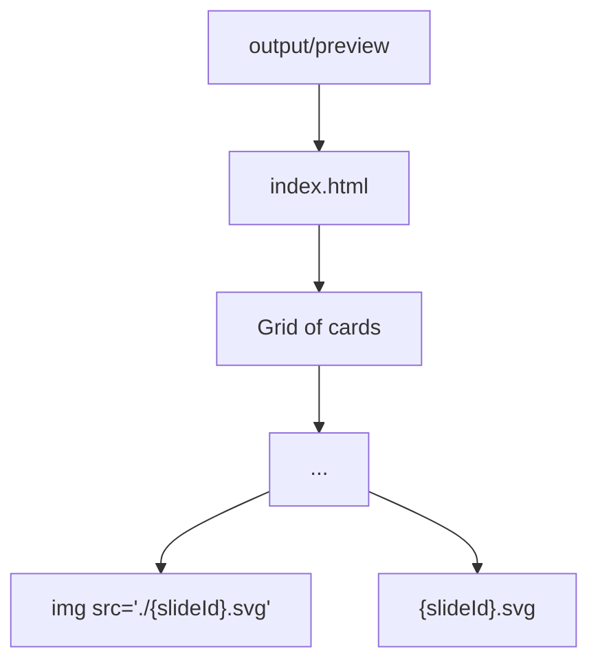

**Diagram sources**
- [svgPreview.ts:45-67](file://src/lib/render/svgPreview.ts#L45-L67)

**Section sources**
- [svgPreview.ts:45-67](file://src/lib/render/svgPreview.ts#L45-L67)

### Browser-Based Review Workflows
- The generated index.html provides a fast, local review experience.
- Users can navigate cards to inspect slide visuals and verify layout and typography.
- Because SVGs are vector-based, previews remain crisp at various zoom levels.

**Section sources**
- [svgPreview.ts:45-67](file://src/lib/render/svgPreview.ts#L45-L67)

### Relationship Between Preview Generation and PPTX Export
- Dual-output strategy: preview pipeline produces HTML/SVG for iteration; delivery pipeline produces editable PPTX.
- Shared contracts: page-type semantics must be preserved so the PPTX renderer can map slide content to native objects.
- Preview assets: visual assets are generated once and reused to maintain consistency across preview and delivery outputs.
- Alignment rules: pattern cards define explicit alignment rules that ensure consistent visual hierarchy across both preview and delivery.

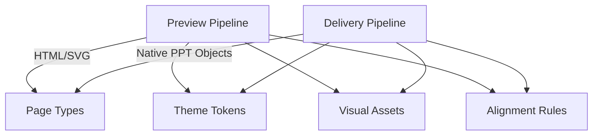

**Diagram sources**
- [ADR-0002-editable-pptx-strategy.md:10-27](file://docs/decisions/ADR-0002-editable-pptx-strategy.md#L10-L27)
- [04-editable-output-strategy.md:35-40](file://04-editable-output-strategy.md#L35-L40)

**Section sources**
- [ADR-0002-editable-pptx-strategy.md:1-28](file://docs/decisions/ADR-0002-editable-pptx-strategy.md#L1-L28)
- [04-editable-output-strategy.md:1-62](file://04-editable-output-strategy.md#L1-L62)

### Preview Performance Optimization and Scalability
- Vector-first previews: SVGs are lightweight and render quickly; ideal for large decks.
- Asset reuse: Visual assets are prebuilt and reused across slides and preview generations.
- Incremental rerendering: Manifest-based marking allows targeted re-rendering of affected slides.
- Delivery-first MVP: For MVP, preview PNGs are derived from the rendered PPTX to reduce duplication and drift.

Recommendations:
- Cache rendered SVGs and index.html; invalidate only when slide IDs or styles change.
- Parallelize SVG writes and HTML generation for large decks.
- Use incremental rerendering to limit work when only a subset of slides changes.

**Section sources**
- [rerenderPages.ts:15-39](file://src/commands/rerenderPages.ts#L15-L39)
- [ADR-0003-fast-track-mvp.md:10-16](file://docs/decisions/ADR-0003-fast-track-mvp.md#L10-L16)

## Alignment Rules and Cross-Cutting Concerns

### Enhanced Layered Architecture Preview
The layered architecture preview now features significantly improved cross-cutting concerns distribution with better visual alignment and cleaner connector lines.

Key enhancements:
- **Explicit alignment rules**: The renderer now includes comments documenting alignment rules such as "Right-side details align to the stack's right edge."
- **Improved cross-cutting concerns distribution**: Cross-cutting concerns are now distributed more evenly to fill available vertical space.
- **Enhanced connector line calculations**: Connector lines between layers and cross-cutting concerns are calculated with precise positioning and distance checks.
- **Better title alignment consistency**: Architecture titles now share consistent baseline positioning across the stack.

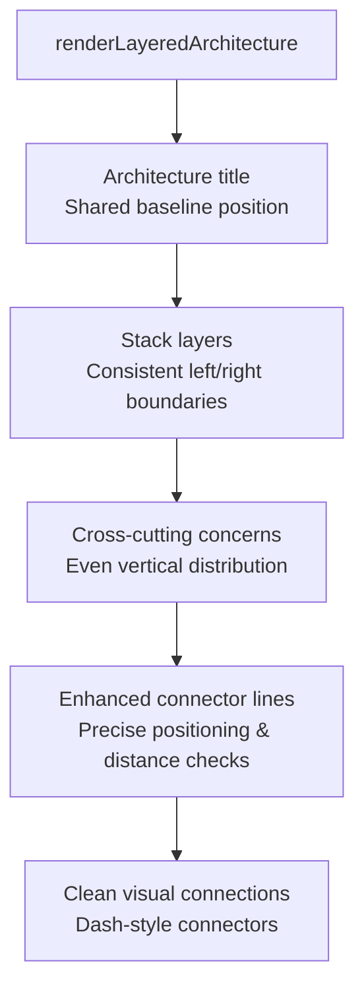

**Diagram sources**
- [svgPreview.ts:302-368](file://src/lib/render/svgPreview.ts#L302-L368)
- [renderPptx.ts:997-1050](file://src/commands/renderPptx.ts#L997-L1050)

### Pattern Card Integration
The system now integrates alignment rules from pattern cards into both preview and delivery rendering:

- **Pattern card loading**: Pattern cards define alignment rules that guide visual layout.
- **Style map generation**: Build style map includes alignment rules from learned patterns.
- **Delivery rendering**: PPTX renderer applies alignment rules to ensure consistent layouts.

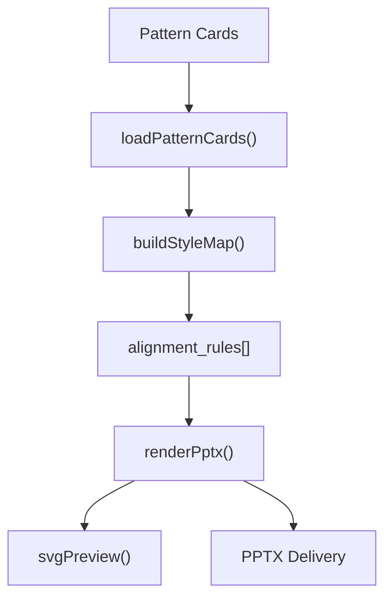

**Diagram sources**
- [loadPatternCards.ts:29-49](file://src/lib/style/loadPatternCards.ts#L29-L49)
- [buildStyleMap.ts:88-98](file://src/commands/buildStyleMap.ts#L88-L98)
- [renderPptx.ts:997-1050](file://src/commands/renderPptx.ts#L997-L1050)

**Section sources**
- [svgPreview.ts:302-368](file://src/lib/render/svgPreview.ts#L302-L368)
- [renderPptx.ts:997-1050](file://src/commands/renderPptx.ts#L997-L1050)
- [buildStyleMap.ts:88-98](file://src/commands/buildStyleMap.ts#L88-L98)
- [loadPatternCards.ts:10-27](file://src/lib/style/loadPatternCards.ts#L10-L27)

## Dependency Analysis
The preview system exhibits clear separation of concerns with enhanced pattern card integration:
- CLI orchestrates IO and calls rendering helpers.
- Rendering library encapsulates SVG composition and HTML assembly.
- Visual assets manager centralizes asset generation.
- Pattern card system defines alignment rules and layout guidelines.
- PPTX helpers enforce layout correctness and consistent styling.
- Policy documents guide dual-output strategy and editable PPTX preference.

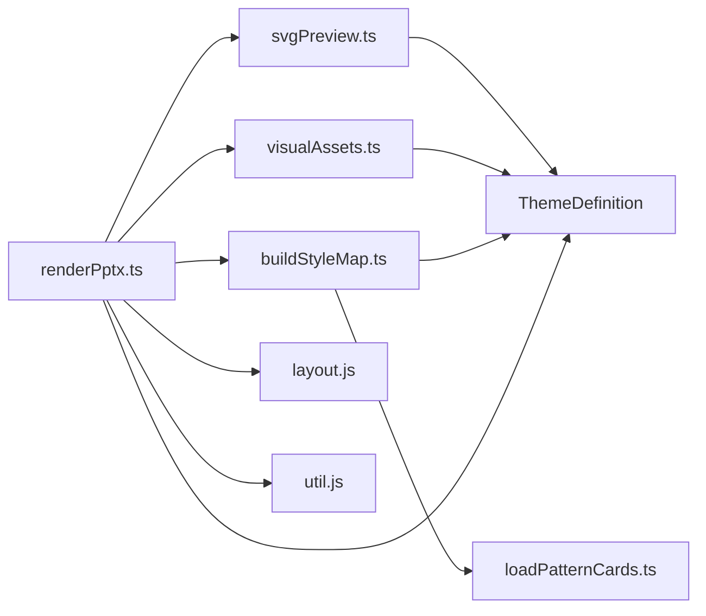

**Diagram sources**
- [renderPptx.ts:7-9](file://src/commands/renderPptx.ts#L7-L9)
- [svgPreview.ts](file://src/lib/render/svgPreview.ts#L4)
- [visualAssets.ts](file://src/lib/render/visualAssets.ts#L4)
- [buildStyleMap.ts:34-46](file://src/commands/buildStyleMap.ts#L34-L46)
- [loadPatternCards.ts:10-27](file://src/lib/style/loadPatternCards.ts#L10-L27)
- [layout.js:429-460](file://render/pptxgenjs_helpers/layout.js#L429-L460)
- [util.js:5-20](file://render/pptxgenjs_helpers/util.js#L5-L20)

**Section sources**
- [renderPptx.ts:7-9](file://src/commands/renderPptx.ts#L7-L9)
- [svgPreview.ts](file://src/lib/render/svgPreview.ts#L4)
- [visualAssets.ts](file://src/lib/render/visualAssets.ts#L4)
- [buildStyleMap.ts:34-46](file://src/commands/buildStyleMap.ts#L34-L46)
- [loadPatternCards.ts:10-27](file://src/lib/style/loadPatternCards.ts#L10-L27)
- [layout.js:429-460](file://render/pptxgenjs_helpers/layout.js#L429-L460)
- [util.js:5-20](file://render/pptxgenjs_helpers/util.js#L5-L20)

## Performance Considerations
- Prefer vector outputs (SVG) for previews to minimize file sizes and enable fast iteration.
- Pre-generate and cache visual assets to avoid recomputation.
- Use incremental rerendering to avoid regenerating unchanged slides.
- For large decks, consider batching or parallelizing SVG writes and HTML generation.
- Align preview and delivery outputs to reduce redundant transformations.
- Enhanced connector line calculations optimize visual performance by reducing unnecessary line rendering.

## Troubleshooting Guide
Common issues and remedies:
- Slide count mismatch: Ensure slides output and style map contain the same number of slides before rendering.
- Out-of-bounds elements: The layout helper warns when elements exceed slide bounds; adjust coordinates or sizes accordingly.
- Overlapping elements: The layout helper detects overlaps; refine positioning to prevent visual conflicts.
- Shadow configuration: Use the provided helper to ensure consistent and safe shadow attributes.
- Alignment rule violations: Ensure alignment rules from pattern cards are properly applied in both preview and delivery rendering.
- Cross-cutting concern distribution: Verify that cross-cutting concerns are evenly distributed and properly connected to their corresponding layers.

**Section sources**
- [renderPptx.ts:111-113](file://src/commands/renderPptx.ts#L111-L113)
- [layout.js:462-623](file://render/pptxgenjs_helpers/layout.js#L462-L623)
- [util.js:5-20](file://render/pptxgenjs_helpers/util.js#L5-L20)

## Conclusion
The preview rendering system delivers efficient, scalable HTML/SVG previews aligned with the editable PPTX delivery pipeline. Recent enhancements include improved cross-cutting concerns distribution in layered architecture previews, better title alignment consistency with explicit alignment rules, and enhanced connector line calculations for cleaner visual connections. By preserving page-type semantics, managing visual assets centrally, integrating alignment rules from pattern cards, and leveraging vector graphics, it supports fast review loops while ensuring delivery formatting remains consistent. Policy documents and helper utilities further strengthen reliability and maintainability across the rendering pipeline.

## Appendices

### Appendix A: Preview and Delivery Alignment Notes
- Maintain semantic page types across preview and delivery to ensure accurate mapping to native PPTX objects.
- Use theme tokens consistently to guarantee visual continuity.
- Keep preview assets synchronized with delivery assets to avoid divergence.
- Apply alignment rules from pattern cards to ensure consistent visual hierarchy.
- Implement enhanced connector line calculations for cleaner visual connections between layers.

**Section sources**
- [ADR-0002-editable-pptx-strategy.md:24-27](file://docs/decisions/ADR-0002-editable-pptx-strategy.md#L24-L27)
- [04-editable-output-strategy.md:51-60](file://04-editable-output-strategy.md#L51-L60)
- [layered_architecture_stack.openclaw-seed.pattern.json:17-22](file://style/patterns/layered_architecture_stack.openclaw-seed.pattern.json#L17-L22)