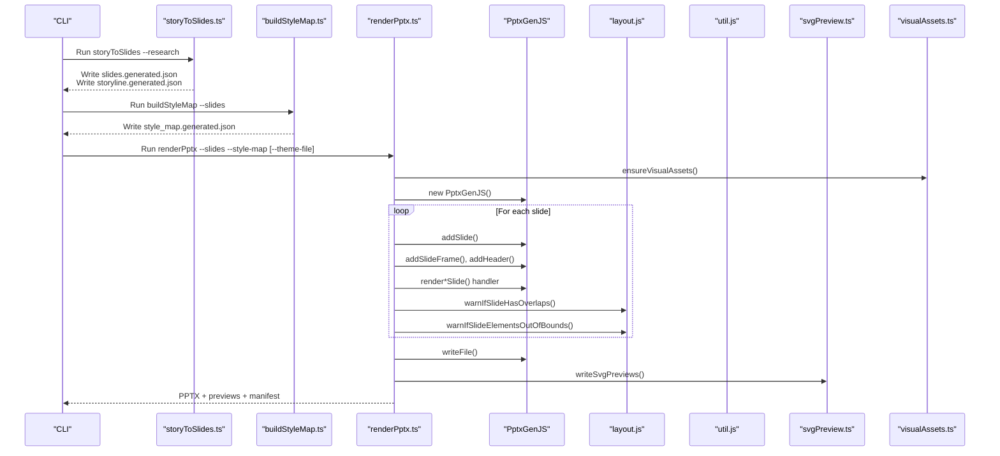
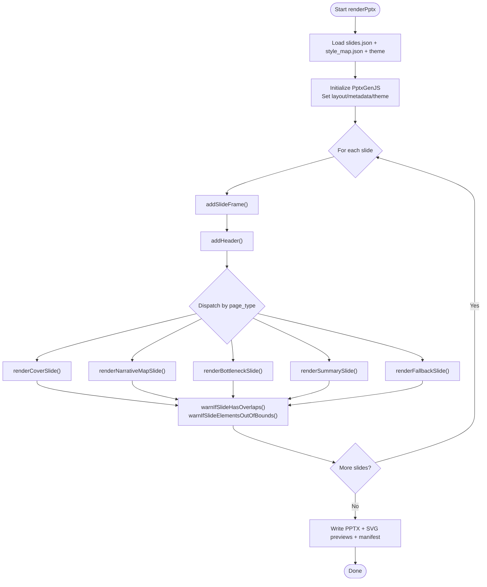
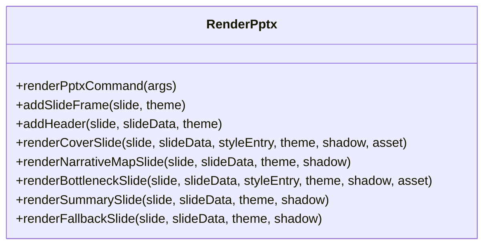
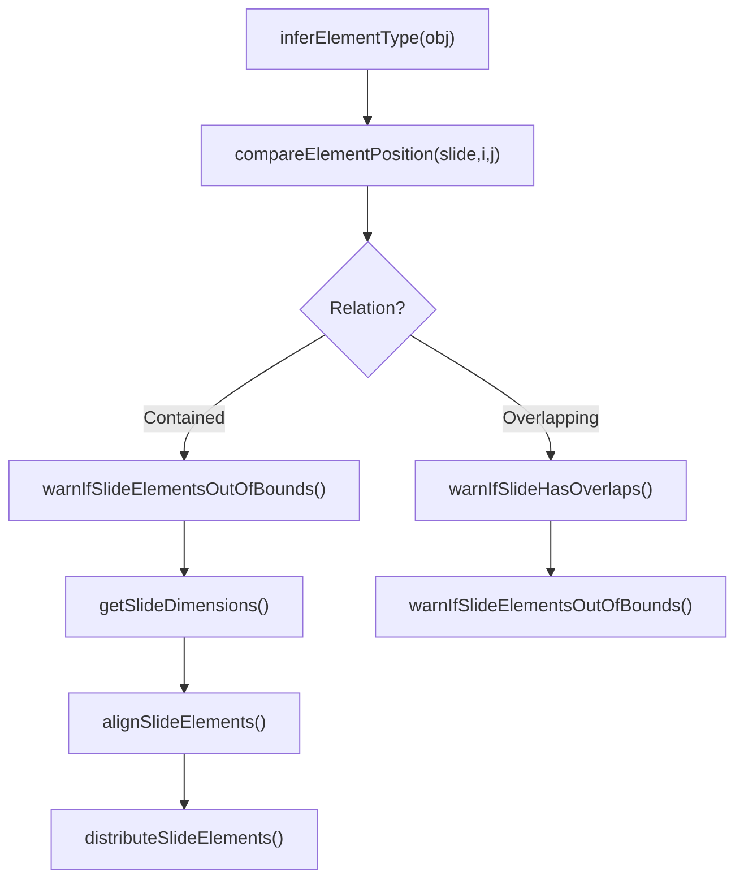
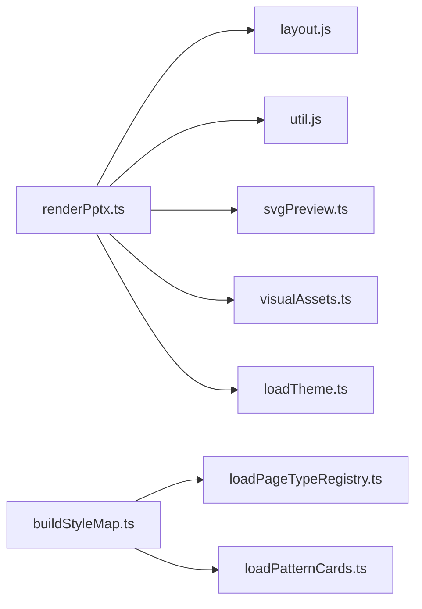

# Rendering Pipeline

<cite>
**Referenced Files in This Document**
- [renderPptx.ts](file://src/commands/renderPptx.ts)
- [buildStyleMap.ts](file://src/commands/buildStyleMap.ts)
- [storyToSlides.ts](file://src/commands/storyToSlides.ts)
- [layout.js](file://render/pptxgenjs_helpers/layout.js)
- [util.js](file://render/pptxgenjs_helpers/util.js)
- [svgPreview.ts](file://src/lib/render/svgPreview.ts)
- [visualAssets.ts](file://src/lib/render/visualAssets.ts)
- [loadTheme.ts](file://src/lib/style/loadTheme.ts)
- [loadPageTypeRegistry.ts](file://src/lib/style/loadPageTypeRegistry.ts)
- [loadPatternCards.ts](file://src/lib/style/loadPatternCards.ts)
- [page-type-registry.json](file://style/patterns/page-type-registry.json)
- [template.pattern-card.json](file://style/patterns/template.pattern-card.json)
- [style_map.generated.json](file://style/outputs/style_map.generated.json)
- [slides.generated.json](file://story/outputs/slides.generated.json)
- [storyline.generated.json](file://story/outputs/storyline.generated.json)
- [mvp-preview-deck.pptx](file://output/delivery/mvp-preview-deck.pptx)
- [render-manifest.json](file://output/delivery/render-manifest.json)
- [index.html](file://output/preview/index.html)
</cite>

## Table of Contents
1. [Introduction](#introduction)
2. [Project Structure](#project-structure)
3. [Core Components](#core-components)
4. [Architecture Overview](#architecture-overview)
5. [Detailed Component Analysis](#detailed-component-analysis)
6. [Dependency Analysis](#dependency-analysis)
7. [Performance Considerations](#performance-considerations)
8. [Troubleshooting Guide](#troubleshooting-guide)
9. [Conclusion](#conclusion)
10. [Appendices](#appendices)

## Introduction
This document explains the Enterprise PPT System's rendering pipeline that transforms structured slide data and style maps into editable PowerPoint presentations using PptxGenJS. It documents the preview rendering system for HTML/SVG visualization, the delivery pipeline for native PPTX export, and asset management strategies. The pipeline emphasizes an editable delivery strategy that preserves PowerPoint object structure for content modification, along with layout algorithms, utility functions, page-type handlers, formatting specifications, performance considerations, memory management, scalability, external tool integrations, and quality assurance processes.

## Project Structure
The rendering pipeline spans several areas:
- Commands orchestrate the end-to-end workflow: story scaffolding, style mapping, and PPTX rendering.
- Helpers encapsulate PptxGenJS-specific layout and formatting utilities.
- Libraries handle preview generation and asset provisioning.
- Styles and patterns define page types and learned layouts.
- Outputs include editable PPTX, SVG previews, and a render manifest.

```mermaid
graph TB
subgraph "Commands"
STS["storyToSlides.ts"]
BSM["buildStyleMap.ts"]
RPTX["renderPptx.ts"]
end
subgraph "Helpers"
LYT["layout.js"]
UTL["util.js"]
end
subgraph "Libraries"
SVP["svgPreview.ts"]
VAS["visualAssets.ts"]
LTM["loadTheme.ts"]
LPTR["loadPageTypeRegistry.ts"]
LPC["loadPatternCards.ts"]
end
subgraph "Styles & Patterns"
PTR["page-type-registry.json"]
PC["template.pattern-card.json"]
end
subgraph "Outputs"
PPTX["mvp-preview-deck.pptx"]
PREV["index.html"]
MAN["render-manifest.json"]
SMJ["style_map.generated.json"]
SLJ["slides.generated.json"]
SJ["storyline.generated.json"]
end
STS --> SLJ
STS --> SJ
BSM --> SMJ
BSM --> PTR
BSM --> PC
BSM --> LTM
BSM --> LPTR
BSM --> LPC
RPTX --> PPTX
RPTX --> PREV
RPTX --> MAN
RPTX --> LYT
RPTX --> UTL
RPTX --> SVP
RPTX --> VAS
RPTX --> LTM
```

**Diagram sources**
- [renderPptx.ts:1-187](file://src/commands/renderPptx.ts#L1-L187)
- [buildStyleMap.ts:50-109](file://src/commands/buildStyleMap.ts#L50-L109)
- [storyToSlides.ts:12-165](file://src/commands/storyToSlides.ts#L12-L165)
- [layout.js:1-644](file://render/pptxgenjs_helpers/layout.js#L1-L644)
- [util.js:1-25](file://render/pptxgenjs_helpers/util.js#L1-L25)
- [svgPreview.ts](file://src/lib/render/svgPreview.ts)
- [visualAssets.ts](file://src/lib/render/visualAssets.ts)
- [loadTheme.ts](file://src/lib/style/loadTheme.ts)
- [loadPageTypeRegistry.ts](file://src/lib/style/loadPageTypeRegistry.ts)
- [loadPatternCards.ts](file://src/lib/style/loadPatternCards.ts)
- [page-type-registry.json](file://style/patterns/page-type-registry.json)
- [template.pattern-card.json](file://style/patterns/template.pattern-card.json)

**Section sources**
- [renderPptx.ts:1-187](file://src/commands/renderPptx.ts#L1-L187)
- [buildStyleMap.ts:50-109](file://src/commands/buildStyleMap.ts#L50-L109)
- [storyToSlides.ts:12-165](file://src/commands/storyToSlides.ts#L12-L165)

## Core Components
- Story-to-Slides Command: Generates a scaffold storyline and slides JSON from research input, establishing claims, page types, and layout hints.
- Build Style Map Command: Consumes slides JSON, resolves page types and pattern cards, and emits a style map with learned patterns, editable targets, and component bindings.
- Render PPTX Command: Drives PptxGenJS to create an editable presentation, applies per-page handlers, validates layout, writes previews, and produces a manifest.
- Layout and Utility Helpers: Provide element overlap detection, bounds checking, alignment/distribution utilities, and safe shadow configuration.
- Preview and Asset Libraries: Generate SVG previews and provision visual assets for slides.
- Style and Pattern Catalogs: Define page types and reusable pattern cards guiding layout and formatting.

**Section sources**
- [storyToSlides.ts:12-165](file://src/commands/storyToSlides.ts#L12-L165)
- [buildStyleMap.ts:50-109](file://src/commands/buildStyleMap.ts#L50-L109)
- [renderPptx.ts:83-187](file://src/commands/renderPptx.ts#L83-L187)
- [layout.js:23-232](file://render/pptxgenjs_helpers/layout.js#L23-L232)
- [util.js:5-20](file://render/pptxgenjs_helpers/util.js#L5-L20)
- [svgPreview.ts](file://src/lib/render/svgPreview.ts)
- [visualAssets.ts](file://src/lib/render/visualAssets.ts)

## Architecture Overview
The pipeline follows a layered approach:
- Input: Research JSON feeds into story scaffolding.
- Style Mapping: Page types and pattern cards inform layout and formatting.
- Rendering: PptxGenJS constructs slides with handlers for each page type, applying theme and assets.
- Validation: Layout helpers detect overlaps and out-of-bounds elements.
- Delivery: Writes PPTX, SVG previews, and a manifest for traceability.

**Diagram sources**
- [storyToSlides.ts:12-165](file://src/commands/storyToSlides.ts#L12-L165)
- [buildStyleMap.ts:50-109](file://src/commands/buildStyleMap.ts#L50-L109)
- [renderPptx.ts:83-187](file://src/commands/renderPptx.ts#L83-L187)
- [layout.js:23-232](file://render/pptxgenjs_helpers/layout.js#L23-L232)
- [util.js:5-20](file://render/pptxgenjs_helpers/util.js#L5-L20)
- [svgPreview.ts](file://src/lib/render/svgPreview.ts)
- [visualAssets.ts](file://src/lib/render/visualAssets.ts)

## Detailed Component Analysis

### Story-to-Slides Command
- Purpose: Convert research JSON into a structured storyline and a slides deck with claims, page-type hints, and layout hints.
- Key behaviors:
  - Reads research input and derives primary statements and facts.
  - Builds a narrative structure with chapters and slides.
  - Produces two outputs: storyline and slides JSON for downstream style mapping and rendering.

**Section sources**
- [storyToSlides.ts:12-165](file://src/commands/storyToSlides.ts#L12-L165)

### Build Style Map Command
- Purpose: Resolve page types, select pattern cards, and produce a style map with learned patterns, editable targets, and component bindings.
- Key behaviors:
  - Loads page type registry and theme.
  - For each slide, selects a page type and finds the best matching pattern card.
  - Aggregates component bindings and computes visual anchors and weight centers.
  - Emits a style map JSON consumed by the renderer.

**Section sources**
- [buildStyleMap.ts:50-109](file://src/commands/buildStyleMap.ts#L50-L109)
- [loadPageTypeRegistry.ts](file://src/lib/style/loadPageTypeRegistry.ts)
- [loadPatternCards.ts](file://src/lib/style/loadPatternCards.ts)
- [page-type-registry.json](file://style/patterns/page-type-registry.json)
- [template.pattern-card.json](file://style/patterns/template.pattern-card.json)

### Render PPTX Command
- Purpose: Drive PptxGenJS to create an editable PowerPoint presentation from slides and style map.
- Key behaviors:
  - Initializes PptxGenJS with layout, metadata, and theme fonts.
  - Iterates slides, adds frame and header, then dispatches to page-type handlers.
  - Applies layout validation helpers after each slide.
  - Writes PPTX, SVG previews, and a render manifest.

**Diagram sources**
- [renderPptx.ts:83-187](file://src/commands/renderPptx.ts#L83-L187)
- [layout.js:23-232](file://render/pptxgenjs_helpers/layout.js#L23-L232)

**Section sources**
- [renderPptx.ts:83-187](file://src/commands/renderPptx.ts#L83-L187)

### Page-Type Handlers
- Cover Orbit: Renders hero imagery, claim card, orbital accents, and story points.
- Narrative Map: Places dominant and supporting chapters in stacked info cards with a decision cue footer.
- Bottleneck Shift: Presents a primary statement, contextual visuals, and up to three impact cards.
- Chapter Summary Signal: Summarizes key signals and implications with a decision cue panel.
- Fallback: Provides a robust default layout for unknown page types.

**Diagram sources**
- [renderPptx.ts:189-787](file://src/commands/renderPptx.ts#L189-L787)

**Section sources**
- [renderPptx.ts:246-363](file://src/commands/renderPptx.ts#L246-L363)
- [renderPptx.ts:365-436](file://src/commands/renderPptx.ts#L365-L436)
- [renderPptx.ts:438-540](file://src/commands/renderPptx.ts#L438-L540)
- [renderPptx.ts:542-645](file://src/commands/renderPptx.ts#L542-L645)
- [renderPptx.ts:647-668](file://src/commands/renderPptx.ts#L647-L668)

### Layout Algorithms and Utilities
- Element Type Inference: Determines object types (text, image, chart, shape, media, table, smartart, line) from data/options.
- Overlap Detection: Compares element positions, detects overlaps and containment, with tunable options to mute containment warnings and ignore lines/shapes.
- Bounds Checking: Warns when elements exceed slide dimensions, converting EMU values to inches when necessary.
- Alignment and Distribution: Aligns selected elements to edges or centers; distributes elements along horizontal or vertical axes with computed gaps.
- Shadow Factory: Provides a safe outer shadow configuration to avoid XML pitfalls.

**Diagram sources**
- [layout.js:4-18](file://render/pptxgenjs_helpers/layout.js#L4-L18)
- [layout.js:234-344](file://render/pptxgenjs_helpers/layout.js#L234-L344)
- [layout.js:429-460](file://render/pptxgenjs_helpers/layout.js#L429-L460)
- [layout.js:462-517](file://render/pptxgenjs_helpers/layout.js#L462-L517)
- [layout.js:519-573](file://render/pptxgenjs_helpers/layout.js#L519-L573)
- [layout.js:575-633](file://render/pptxgenjs_helpers/layout.js#L575-L633)

**Section sources**
- [layout.js:23-232](file://render/pptxgenjs_helpers/layout.js#L23-L232)
- [layout.js:429-633](file://render/pptxgenjs_helpers/layout.js#L429-L633)
- [util.js:5-20](file://render/pptxgenjs_helpers/util.js#L5-L20)

### Preview Rendering System
- SVG Previews: Generates SVG previews for slides and writes an index.html for easy visualization.
- Asset Management: Ensures visual assets are available under the preview directory using theme-provided assets.

**Section sources**
- [renderPptx.ts:165-166](file://src/commands/renderPptx.ts#L165-L166)
- [svgPreview.ts](file://src/lib/render/svgPreview.ts)
- [visualAssets.ts](file://src/lib/render/visualAssets.ts)

### Editable Delivery Strategy
- Preserves PowerPoint Object Structure: Uses PptxGenJS APIs to add shapes, images, and text, enabling later editing in PowerPoint.
- Shadow and Formatting Safety: Utilizes a safe shadow factory to prevent XML pitfalls and ensure consistent rendering.
- Manifest Tracking: Records editable PPTX path, preview locations, and slide artifacts for traceability.

**Section sources**
- [renderPptx.ts:115-126](file://src/commands/renderPptx.ts#L115-L126)
- [util.js:5-20](file://render/pptxgenjs_helpers/util.js#L5-L20)
- [renderPptx.ts:168-186](file://src/commands/renderPptx.ts#L168-L186)

### Formatting Specifications
- Dimensions: Standard slide width and height constants guide layout calculations.
- Typography: Theme-provided font families applied to headers and body text.
- Colors: Palette values from theme applied to backgrounds, fills, strokes, and accents.
- Shadows: Consistent shadow configuration via utility function.

**Section sources**
- [renderPptx.ts:80-81](file://src/commands/renderPptx.ts#L80-L81)
- [renderPptx.ts:122-126](file://src/commands/renderPptx.ts#L122-L126)
- [renderPptx.ts:189-244](file://src/commands/renderPptx.ts#L189-L244)

## Dependency Analysis
- Command Dependencies:
  - renderPptx depends on layout.js, util.js, svgPreview.ts, visualAssets.ts, and loadTheme.ts.
  - buildStyleMap depends on loadPageTypeRegistry.ts and loadPatternCards.ts.
- Runtime Dependencies:
  - PptxGenJS is dynamically required and instantiated.
  - Node FS APIs manage file I/O and directory creation.
- Output Dependencies:
  - render-manifest.json links editable PPTX and preview assets.

**Diagram sources**
- [renderPptx.ts:83-187](file://src/commands/renderPptx.ts#L83-L187)
- [layout.js:1-644](file://render/pptxgenjs_helpers/layout.js#L1-L644)
- [util.js:1-25](file://render/pptxgenjs_helpers/util.js#L1-L25)
- [svgPreview.ts](file://src/lib/render/svgPreview.ts)
- [visualAssets.ts](file://src/lib/render/visualAssets.ts)
- [loadTheme.ts](file://src/lib/style/loadTheme.ts)
- [buildStyleMap.ts:50-109](file://src/commands/buildStyleMap.ts#L50-L109)
- [loadPageTypeRegistry.ts](file://src/lib/style/loadPageTypeRegistry.ts)
- [loadPatternCards.ts](file://src/lib/style/loadPatternCards.ts)

**Section sources**
- [renderPptx.ts:83-187](file://src/commands/renderPptx.ts#L83-L187)
- [buildStyleMap.ts:50-109](file://src/commands/buildStyleMap.ts#L50-L109)

## Performance Considerations
- Memory Management:
  - Minimize repeated object cloning; reuse theme and asset references across slides.
  - Avoid loading large assets multiple times; cache resolved asset paths.
- Scalability:
  - Parallelize independent slide renders where possible (current implementation iterates sequentially).
  - Batch write operations for previews and manifests to reduce I/O overhead.
- Layout Validation:
  - Keep overlap and bounds checks O(n^2) per slide acceptable for typical slide counts; consider spatial indexing for very dense slides.
- I/O Efficiency:
  - Ensure output directories exist before writing; use atomic writes for manifests.
- Rendering Cost:
  - Prefer vector assets for scalability; limit heavy shadows and gradients where unnecessary.

## Troubleshooting Guide
- Missing Arguments:
  - Ensure required arguments are provided for each command (e.g., --research, --slides, --style-map).
- Slide Count Mismatch:
  - Verify slides.json and style_map.json contain the same number of slides.
- Unknown Page Types:
  - Confirm page_type or page_type_hint values match registry entries.
- Overlaps and Out-of-Bounds Elements:
  - Review warnings from overlap/bounds validators and adjust layout coordinates or sizes.
- Asset Resolution Failures:
  - Confirm theme and pattern assets are present and accessible.

**Section sources**
- [renderPptx.ts:94-99](file://src/commands/renderPptx.ts#L94-L99)
- [renderPptx.ts:111-113](file://src/commands/renderPptx.ts#L111-L113)
- [buildStyleMap.ts:66-74](file://src/commands/buildStyleMap.ts#L66-L74)
- [layout.js:23-232](file://render/pptxgenjs_helpers/layout.js#L23-L232)

## Conclusion
The Enterprise PPT System’s rendering pipeline integrates story scaffolding, style mapping, and PptxGenJS-driven rendering to produce editable PowerPoint decks with robust preview and asset management. Layout algorithms and utilities ensure visual quality, while the editable delivery strategy preserves PowerPoint object structure for enterprise review and revision. With careful attention to performance, memory, and scalability, the pipeline supports iterative development and QA processes for large presentations.

## Appendices

### Render Manifest Schema
- deck_id: Identifier for the rendered deck.
- version: Version of the rendering pipeline.
- generated_at: Timestamp of generation.
- outputs: Paths to editable PPTX, preview SVG directory, and preview HTML.
- slide_artifacts: Per-slide flags indicating rerender status.

**Section sources**
- [renderPptx.ts:168-186](file://src/commands/renderPptx.ts#L168-L186)

### Example Outputs
- Editable PPTX: [mvp-preview-deck.pptx](file://output/delivery/mvp-preview-deck.pptx)
- Preview HTML: [index.html](file://output/preview/index.html)
- Render Manifest: [render-manifest.json](file://output/delivery/render-manifest.json)
- Style Map: [style_map.generated.json](file://style/outputs/style_map.generated.json)
- Slides JSON: [slides.generated.json](file://story/outputs/slides.generated.json)
- Storyline JSON: [storyline.generated.json](file://story/outputs/storyline.generated.json)