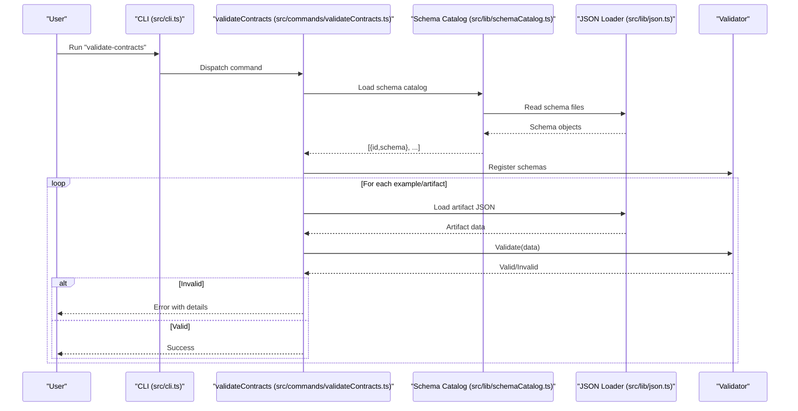
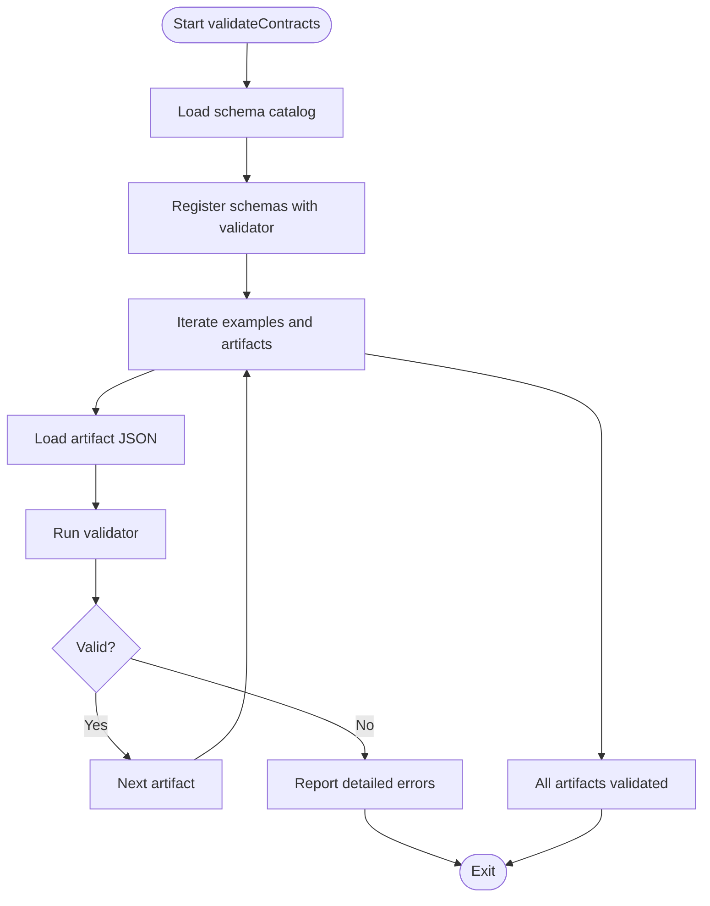
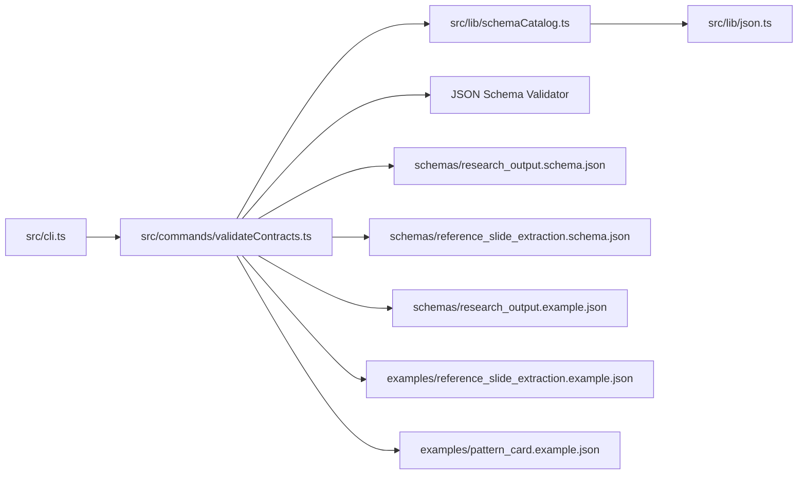

# Research Processing

<cite>
**Referenced Files in This Document**
- [cli.ts](file://src/cli.ts)
- [validateContracts.ts](file://src/commands/validateContracts.ts)
- [schemaCatalog.ts](file://src/lib/schemaCatalog.ts)
- [json.ts](file://src/lib/json.ts)
- [research_output.schema.json](file://schemas/research_output.schema.json)
- [research_output.example.json](file://schemas/research_output.example.json)
- [reference_slide_extraction.schema.json](file://schemas/reference_slide_extraction.schema.json)
- [reference_slide_extraction.example.json](file://examples/reference_slide_extraction.example.json)
- [pattern_card.example.json](file://examples/pattern_card.example.json)
- [validateContracts.ts](file://src/commands/validateContracts.ts)
</cite>

## Table of Contents
1. [Introduction](#introduction)
2. [Project Structure](#project-structure)
3. [Core Components](#core-components)
4. [Architecture Overview](#architecture-overview)
5. [Detailed Component Analysis](#detailed-component-analysis)
6. [Dependency Analysis](#dependency-analysis)
7. [Performance Considerations](#performance-considerations)
8. [Troubleshooting Guide](#troubleshooting-guide)
9. [Conclusion](#conclusion)
10. [Appendices](#appendices)

## Introduction
This document explains the research processing layer of the Enterprise PPT System with a focus on structured research data extraction, input validation workflows, and source attribution systems. It documents the research templates, input formats, and output specifications, and demonstrates how validated research integrates into the story construction phase. It also covers data provenance tracking, quality assurance measures, error handling for malformed inputs, and best practices for preparing and integrating research data.

## Project Structure
The research processing layer centers around:
- Schemas that define the shape and constraints of research and style artifacts
- Example datasets that demonstrate valid structures
- A validation command that checks real-world artifacts against schemas
- A CLI that exposes validation and other processing commands

```mermaid
graph TB
subgraph "CLI"
CLI["src/cli.ts"]
end
subgraph "Validation"
VC["src/commands/validateContracts.ts"]
SC["src/lib/schemaCatalog.ts"]
JSONIO["src/lib/json.ts"]
end
subgraph "Schemas"
ROS["schemas/research_output.schema.json"]
RSE["schemas/reference_slide_extraction.schema.json"]
end
subgraph "Examples"
ROE["schemas/research_output.example.json"]
RSE_EX["examples/reference_slide_extraction.example.json"]
PC_EX["examples/pattern_card.example.json"]
end
CLI --> VC
VC --> SC
SC --> JSONIO
VC --> ROS
VC --> RSE
VC --> ROE
VC --> RSE_EX
VC --> PC_EX
```

**Diagram sources**
- [cli.ts:1-57](file://src/cli.ts#L1-L57)
- [validateContracts.ts:1-100](file://src/commands/validateContracts.ts#L1-L100)
- [schemaCatalog.ts:1-24](file://src/lib/schemaCatalog.ts#L1-L24)
- [json.ts:1-14](file://src/lib/json.ts#L1-L14)
- [research_output.schema.json:1-88](file://schemas/research_output.schema.json#L1-L88)
- [reference_slide_extraction.schema.json:1-103](file://schemas/reference_slide_extraction.schema.json#L1-L103)
- [research_output.example.json:1-45](file://schemas/research_output.example.json#L1-L45)
- [reference_slide_extraction.example.json:1-64](file://examples/reference_slide_extraction.example.json#L1-L64)
- [pattern_card.example.json:1-54](file://examples/pattern_card.example.json#L1-L54)

**Section sources**
- [cli.ts:1-57](file://src/cli.ts#L1-L57)
- [validateContracts.ts:1-100](file://src/commands/validateContracts.ts#L1-L100)
- [schemaCatalog.ts:1-24](file://src/lib/schemaCatalog.ts#L1-L24)
- [json.ts:1-14](file://src/lib/json.ts#L1-L14)

## Core Components
- Research output schema and example: Defines the canonical structure for research insights, including facts, interpretations, risks, industry constraints, open questions, and sources with attribution.
- Reference slide extraction schema and example: Captures narrative role, page type candidate, composition rules, visual anchors, and reuse notes for style reference slides.
- Pattern card example: Demonstrates how reference slide extractions are aggregated into reusable pattern cards for page types.
- Validation command: Loads all schema entries, registers them with a JSON Schema validator, and validates example and real artifacts.

Key responsibilities:
- Enforce structural and semantic constraints for research artifacts
- Track provenance via source identifiers and typed references
- Support downstream story construction by providing structured, validated inputs

**Section sources**
- [research_output.schema.json:1-88](file://schemas/research_output.schema.json#L1-L88)
- [research_output.example.json:1-45](file://schemas/research_output.example.json#L1-L45)
- [reference_slide_extraction.schema.json:1-103](file://schemas/reference_slide_extraction.schema.json#L1-L103)
- [reference_slide_extraction.example.json:1-64](file://examples/reference_slide_extraction.example.json#L1-L64)
- [pattern_card.example.json:1-54](file://examples/pattern_card.example.json#L1-L54)
- [validateContracts.ts:1-100](file://src/commands/validateContracts.ts#L1-L100)

## Architecture Overview
The research processing pipeline is driven by the CLI and anchored by schema-driven validation. Artifacts produced during research are validated against their respective schemas before being accepted into downstream stages.



**Diagram sources**
- [cli.ts:19-37](file://src/cli.ts#L19-L37)
- [validateContracts.ts:22-98](file://src/commands/validateContracts.ts#L22-L98)
- [schemaCatalog.ts:12-23](file://src/lib/schemaCatalog.ts#L12-L23)
- [json.ts:4-6](file://src/lib/json.ts#L4-L6)

## Detailed Component Analysis

### Research Output Schema and Example
The research output schema defines the canonical structure for research insights:
- Topic, audience, industry, objective: High-level framing fields
- Facts: Structured statements with confidence and source references
- Interpretations: Derived insights supported by fact IDs
- Risks: Identified risk statements with supporting fact IDs
- Industry constraints and open questions: Lists of domain-specific constraints and unresolved questions
- Sources: Typed, attributed references with optional URLs

The example demonstrates a minimal valid research output with one fact, one interpretation, one risk, several constraints, one open question, and one primary source.

Practical implications:
- Provenance is tracked via source IDs referenced by facts and interpretations
- Confidence levels enable downstream prioritization
- Sources include type and optional URL for traceability

**Section sources**
- [research_output.schema.json:8-85](file://schemas/research_output.schema.json#L8-L85)
- [research_output.example.json:6-44](file://schemas/research_output.example.json#L6-L44)

### Reference Slide Extraction Schema and Example
The reference slide extraction schema captures:
- Reference identifier and source metadata (deck ID, slide number, extraction mode, title, file paths, tags)
- Narrative role, page type candidate, audience tone
- Claim, visual anchor, weight center
- Composition rules (structure, density level, alignment logic, image usage, highlight grammar)
- Components with roles and types
- Why it works, anti-patterns, and reuse notes (including safe-to-reuse, adaptation notes)

The example shows a complete extraction for a slide that communicates trust through a runtime terminal window, with composition notes, component roles, and reuse guidance.

Provenance and reuse:
- Source metadata enables traceability back to original decks and slides
- Reuse notes encode safe adaptations and warnings

**Section sources**
- [reference_slide_extraction.schema.json:7-101](file://schemas/reference_slide_extraction.schema.json#L7-L101)
- [reference_slide_extraction.example.json:3-63](file://examples/reference_slide_extraction.example.json#L3-L63)

### Pattern Card Example
Pattern cards aggregate validated reference slide extractions into reusable page-type patterns. The example demonstrates:
- Pattern identification, page type, and source references
- Narrative roles and topic fit
- Visual anchor and weight center
- Layout and alignment rules
- Image usage guidance and highlight grammar
- Component recipe and editable target
- Anti-patterns and reuse notes

These cards bridge research and rendering by codifying design intent and constraints.

**Section sources**
- [pattern_card.example.json:4-53](file://examples/pattern_card.example.json#L4-L53)

### Validation Command Workflow
The validation command orchestrates schema-driven quality assurance:
- Loads all schema entries from disk
- Registers schemas with a JSON Schema validator
- Iterates over curated examples and real artifacts
- Validates each artifact and reports detailed errors if invalid



**Diagram sources**
- [validateContracts.ts:22-98](file://src/commands/validateContracts.ts#L22-L98)
- [schemaCatalog.ts:12-23](file://src/lib/schemaCatalog.ts#L12-L23)
- [json.ts:4-6](file://src/lib/json.ts#L4-L6)

**Section sources**
- [validateContracts.ts:1-100](file://src/commands/validateContracts.ts#L1-L100)
- [schemaCatalog.ts:1-24](file://src/lib/schemaCatalog.ts#L1-L24)
- [json.ts:1-14](file://src/lib/json.ts#L1-L14)

## Dependency Analysis
The validation pipeline depends on:
- CLI dispatch to the validation command
- Schema catalog loader to enumerate and load schema files
- JSON I/O utilities to parse artifacts
- A JSON Schema validator to enforce structural and semantic rules



**Diagram sources**
- [cli.ts:10-17](file://src/cli.ts#L10-L17)
- [validateContracts.ts:1-100](file://src/commands/validateContracts.ts#L1-L100)
- [schemaCatalog.ts:12-23](file://src/lib/schemaCatalog.ts#L12-L23)
- [json.ts:4-6](file://src/lib/json.ts#L4-L6)

**Section sources**
- [cli.ts:1-57](file://src/cli.ts#L1-L57)
- [validateContracts.ts:1-100](file://src/commands/validateContracts.ts#L1-L100)
- [schemaCatalog.ts:1-24](file://src/lib/schemaCatalog.ts#L1-L24)
- [json.ts:1-14](file://src/lib/json.ts#L1-L14)

## Performance Considerations
- Batch schema registration: The validator loads all schemas once per run, minimizing repeated parsing overhead.
- Streaming validation: Validation occurs per artifact; for large sets, consider parallelizing artifact loading while keeping validation synchronous to maintain deterministic error reporting.
- Disk I/O: Schema and example files are read synchronously; caching or preloading could reduce repeated disk access in CI contexts.

## Troubleshooting Guide
Common issues and resolutions:
- Missing validator for schema ID: Indicates a mismatch between the registered schema ID and the requested validator. Ensure the schema filename matches the ID used in the catalog.
- Validation failures: Use the detailed error messages to locate offending fields. Fix missing required fields, incorrect types, or out-of-range enumerations.
- Malformed JSON: Verify encoding and formatting; the JSON loader expects UTF-8 and valid JSON.
- Source attribution gaps: Ensure every fact and interpretation references existing source IDs; missing IDs break provenance.

Operational tips:
- Run the validation command locally before committing artifacts to catch issues early.
- Keep examples up to date with schema changes to prevent drift.
- For CI, treat validation failures as blocking to maintain contract integrity.

**Section sources**
- [validateContracts.ts:85-98](file://src/commands/validateContracts.ts#L85-L98)
- [json.ts:4-6](file://src/lib/json.ts#L4-L6)

## Conclusion
The research processing layer enforces rigorous structure and provenance for research insights and style references. By validating artifacts against precise schemas and maintaining clear source attributions, it ensures reliable integration into story construction and rendering. Adhering to the documented input formats and validation workflows improves downstream presentation effectiveness and reduces integration risk.

## Appendices

### Research Templates and Input Formats
- Research output: Framing fields, facts with confidence and source references, interpretations and risks with supporting fact IDs, industry constraints, open questions, and sources with type and optional URL.
- Reference slide extraction: Source metadata, narrative role, page type candidate, claim, visual anchor, weight center, composition rules, components, and reuse notes.
- Pattern card: Aggregated guidance for page types, including layout and alignment rules, highlight grammar, and reuse notes.

**Section sources**
- [research_output.schema.json:8-85](file://schemas/research_output.schema.json#L8-L85)
- [reference_slide_extraction.schema.json:7-101](file://schemas/reference_slide_extraction.schema.json#L7-L101)
- [pattern_card.example.json:4-53](file://examples/pattern_card.example.json#L4-L53)

### Output Specifications
- Research output: A single JSON object conforming to the research output schema, suitable for downstream story construction.
- Reference slide extraction: A single JSON object conforming to the reference slide extraction schema, suitable for style pattern generation.
- Pattern card: A single JSON object conforming to the pattern card schema, suitable for page-type registry and rendering.

**Section sources**
- [research_output.schema.json:1-88](file://schemas/research_output.schema.json#L1-L88)
- [reference_slide_extraction.schema.json:1-103](file://schemas/reference_slide_extraction.schema.json#L1-L103)
- [pattern_card.example.json:1-54](file://examples/pattern_card.example.json#L1-L54)

### Practical Examples
- Research data preparation: Prepare a research output JSON using the schema’s required fields and ensure each fact references a valid source ID. Include at least one primary source and optionally secondary/internal sources.
- Validation procedure: Run the validation command to check your research output and related artifacts against the schemas. Review detailed error messages and update your inputs accordingly.
- Integration with story construction: Once validated, the research output feeds into the story construction phase, where facts, interpretations, and risks inform narrative structure and slide content.

**Section sources**
- [research_output.example.json:1-45](file://schemas/research_output.example.json#L1-L45)
- [reference_slide_extraction.example.json:1-64](file://examples/reference_slide_extraction.example.json#L1-L64)
- [validateContracts.ts:85-98](file://src/commands/validateContracts.ts#L85-L98)