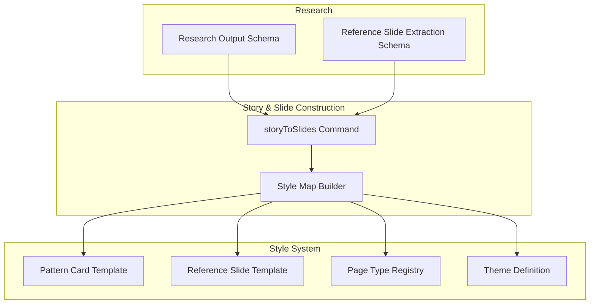
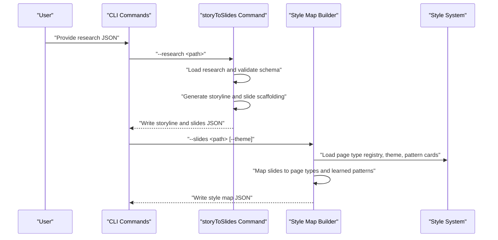
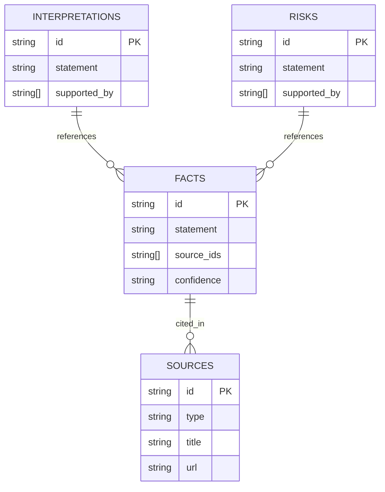
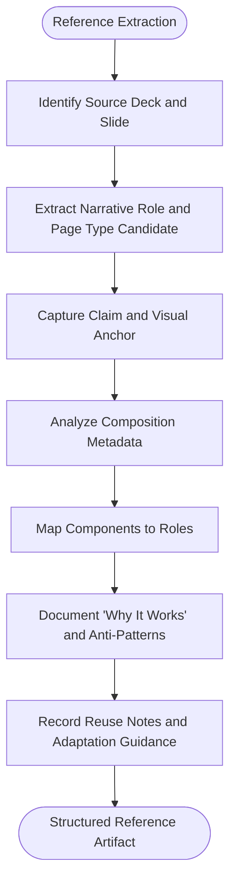
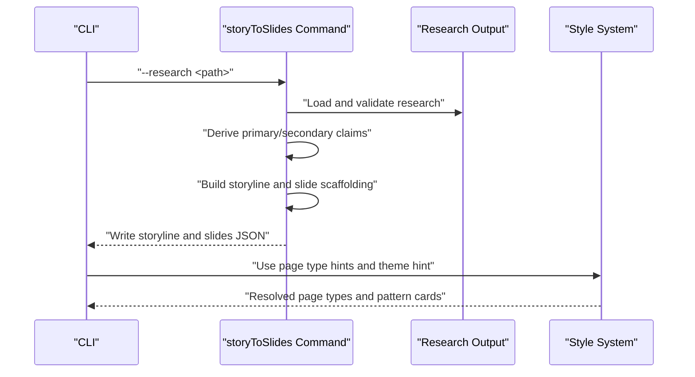
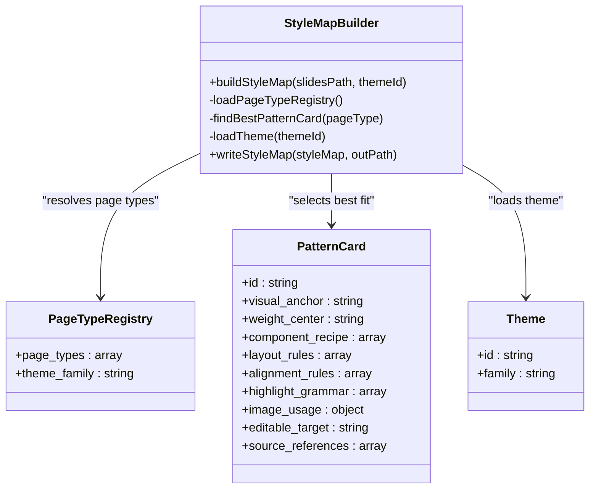
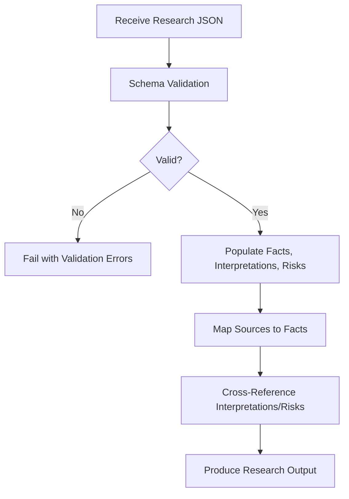
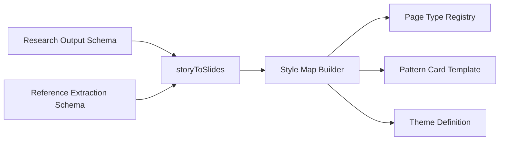

# Deep Research Capability

<cite>
**Referenced Files in This Document**
- [skills/README.md](file://skills/README.md)
- [schemas/research_output.schema.json](file://schemas/research_output.schema.json)
- [schemas/reference_slide_extraction.schema.json](file://schemas/reference_slide_extraction.schema.json)
- [src/commands/storyToSlides.ts](file://src/commands/storyToSlides.ts)
- [src/commands/buildStyleMap.ts](file://src/commands/buildStyleMap.ts)
- [style/reference_extractions/template.reference-slide.json](file://style/reference_extractions/template.reference-slide.json)
- [style/patterns/template.pattern-card.json](file://style/patterns/template.pattern-card.json)
- [style/themes/dark-enterprise-tech.theme.json](file://style/themes/dark-enterprise-tech.theme.json)
- [style/components/page-type-registry.json](file://style/components/page-type-registry.json)
- [docs/workflows/reference-extraction-workflow.md](file://docs/workflows/reference-extraction-workflow.md)
</cite>

## Table of Contents
1. [Introduction](#introduction)
2. [Project Structure](#project-structure)
3. [Core Components](#core-components)
4. [Architecture Overview](#architecture-overview)
5. [Detailed Component Analysis](#detailed-component-analysis)
6. [Dependency Analysis](#dependency-analysis)
7. [Performance Considerations](#performance-considerations)
8. [Troubleshooting Guide](#troubleshooting-guide)
9. [Conclusion](#conclusion)
10. [Appendices](#appendices)

## Introduction
This document explains the Deep Research capability within the enterprise presentation system. It focuses on how comprehensive data gathering, source attribution, and research validation are orchestrated, how intake workflows operate, how data is extracted and transformed, and how quality assurance is maintained. It also documents how deep research feeds into the broader presentation pipeline, including research fidelity metrics, source mapping strategies, cross-referencing methodologies, and the contribution to storytelling and slide construction.

## Project Structure
The Deep Research capability interacts with several subsystems:
- Research intake and output schemas define the shape of research artifacts and their metadata.
- Story building transforms research into narrative structure and slide scaffolding.
- Style mapping binds slides to page types, patterns, and editable targets.
- Reference extraction and pattern cards inform style reuse and composition rules.
- Themes and page-type registries provide rendering context.

**Diagram sources**
- [schemas/research_output.schema.json:1-88](file://schemas/research_output.schema.json#L1-L88)
- [schemas/reference_slide_extraction.schema.json:1-103](file://schemas/reference_slide_extraction.schema.json#L1-L103)
- [src/commands/storyToSlides.ts:1-166](file://src/commands/storyToSlides.ts#L1-L166)
- [src/commands/buildStyleMap.ts:1-110](file://src/commands/buildStyleMap.ts#L1-L110)
- [style/reference_extractions/template.reference-slide.json](file://style/reference_extractions/template.reference-slide.json)
- [style/patterns/template.pattern-card.json](file://style/patterns/template.pattern-card.json)
- [style/components/page-type-registry.json](file://style/components/page-type-registry.json)
- [style/themes/dark-enterprise-tech.theme.json](file://style/themes/dark-enterprise-tech.theme.json)

**Section sources**
- [skills/README.md:1-16](file://skills/README.md#L1-L16)
- [schemas/research_output.schema.json:1-88](file://schemas/research_output.schema.json#L1-L88)
- [schemas/reference_slide_extraction.schema.json:1-103](file://schemas/reference_slide_extraction.schema.json#L1-L103)
- [src/commands/storyToSlides.ts:1-166](file://src/commands/storyToSlides.ts#L1-L166)
- [src/commands/buildStyleMap.ts:1-110](file://src/commands/buildStyleMap.ts#L1-L110)

## Core Components
- Research Output Schema: Defines the canonical structure for research artifacts, including topic, audience, industry, objective, facts, interpretations, risks, constraints, open questions, and sources. It enforces strong typing and required fields to ensure fidelity and traceability.
- Reference Slide Extraction Schema: Captures how reference slides are analyzed for narrative role, page type candidate, claim, visual anchor, composition, components, and reuse notes. It supports cross-referencing and anti-pattern detection.
- Story-to-Slides Command: Transforms research into a storyline and initial slide deck, using research fields to populate narrative claims and slide blocks.
- Style Map Builder: Consumes slide outputs and maps them to page types, patterns, and editable targets, enabling consistent rendering and editable delivery.

Key responsibilities:
- Research Intake: Structured ingestion of facts, interpretations, risks, constraints, and sources.
- Source Attribution: Explicit mapping of facts to source identifiers with confidence levels.
- Validation: Schema-driven validation ensures completeness and consistency.
- Cross-Referencing: Interpretations and facts can reference each other via identifiers.
- Presentation Pipeline: Research drives narrative structure and slide scaffolding, which are later styled and rendered.

**Section sources**
- [schemas/research_output.schema.json:1-88](file://schemas/research_output.schema.json#L1-L88)
- [schemas/reference_slide_extraction.schema.json:1-103](file://schemas/reference_slide_extraction.schema.json#L1-L103)
- [src/commands/storyToSlides.ts:1-166](file://src/commands/storyToSlides.ts#L1-L166)
- [src/commands/buildStyleMap.ts:1-110](file://src/commands/buildStyleMap.ts#L1-L110)

## Architecture Overview
The Deep Research capability participates in a layered pipeline:
- Inputs: Research JSON aligned to the research output schema; optional reference slide extraction JSON aligned to the reference extraction schema.
- Processing: Story building command converts research into a storyline and slide scaffolding; style map builder binds slides to page types and patterns.
- Outputs: Storyline JSON, slides JSON, and a style map JSON for rendering and editable delivery.

**Diagram sources**
- [src/commands/storyToSlides.ts:1-166](file://src/commands/storyToSlides.ts#L1-L166)
- [src/commands/buildStyleMap.ts:1-110](file://src/commands/buildStyleMap.ts#L1-L110)
- [schemas/research_output.schema.json:1-88](file://schemas/research_output.schema.json#L1-L88)

## Detailed Component Analysis

### Research Output Schema and Fidelity Metrics
The research output schema defines:
- Required fields: topic, audience, industry, objective, facts, sources.
- Facts: each fact includes an identifier, statement, source_ids array (non-empty), and confidence level (low, medium, high).
- Interpretations: statements supported by references to fact identifiers.
- Risks: statements optionally supported by references to facts.
- Sources: minimal metadata per source (id, type, title, url), enabling traceability and attribution.

Fidelity metrics derived from schema:
- Completeness: Required fields ensure baseline coverage.
- Traceability: source_ids and supported_by arrays enable bidirectional mapping between facts and interpretations/risks.
- Confidence scoring: allows downstream prioritization and review gating.
- Cross-referencing: identifiers form a graph connecting facts, interpretations, and risks.

**Diagram sources**
- [schemas/research_output.schema.json:1-88](file://schemas/research_output.schema.json#L1-L88)

**Section sources**
- [schemas/research_output.schema.json:1-88](file://schemas/research_output.schema.json#L1-L88)

### Reference Slide Extraction Schema and Cross-Referencing Methodology
The reference extraction schema captures:
- Source identification (deck_id, slide_number, extraction_mode).
- Narrative role and page type candidate.
- Claim, visual anchor, weight center, and composition structure.
- Component roles and types.
- Why-it-works rationales and anti-patterns.
- Reuse notes including safe-to-reuse flags and adaptation guidance.

Cross-referencing methodology:
- Interpretations and risks can reference facts via identifiers.
- Composition metadata enables mapping to page types and pattern cards.
- Component roles help align slide scaffolding to visual anchors and layout rules.

**Diagram sources**
- [schemas/reference_slide_extraction.schema.json:1-103](file://schemas/reference_slide_extraction.schema.json#L1-L103)

**Section sources**
- [schemas/reference_slide_extraction.schema.json:1-103](file://schemas/reference_slide_extraction.schema.json#L1-L103)

### Story-to-Slides Workflow and Template Usage
The story-to-slides command:
- Loads research JSON and validates against the research output schema.
- Derives primary and secondary claims from interpretations and facts.
- Builds a storyline with chapters and slides, assigning page type hints.
- Generates a slide deck with blocks, layout hints, and notes.

Template usage:
- Page type hints guide the selection of pattern cards and page types.
- Theme hints influence style family selection.
- Layout hints (weight center, density level, symmetry preferences) inform composition.

**Diagram sources**
- [src/commands/storyToSlides.ts:1-166](file://src/commands/storyToSlides.ts#L1-L166)
- [schemas/research_output.schema.json:1-88](file://schemas/research_output.schema.json#L1-L88)

**Section sources**
- [src/commands/storyToSlides.ts:1-166](file://src/commands/storyToSlides.ts#L1-L166)

### Style Map Building and Editable Delivery
The style map builder:
- Loads slide outputs and resolves page types from the registry.
- Selects best-fit pattern cards and computes component bindings.
- Produces a style map with learned patterns, alignment rules, and editable targets.

Integration with broader presentation system:
- Page type registry defines canonical page types and defaults.
- Pattern cards encode composition rules and editable targets.
- Theme selection influences color families and typography families.

**Diagram sources**
- [src/commands/buildStyleMap.ts:1-110](file://src/commands/buildStyleMap.ts#L1-L110)
- [style/components/page-type-registry.json](file://style/components/page-type-registry.json)
- [style/patterns/template.pattern-card.json](file://style/patterns/template.pattern-card.json)
- [style/themes/dark-enterprise-tech.theme.json](file://style/themes/dark-enterprise-tech.theme.json)

**Section sources**
- [src/commands/buildStyleMap.ts:1-110](file://src/commands/buildStyleMap.ts#L1-L110)

### Research Intake Workflows and Quality Assurance
Research intake workflows:
- Structured ingestion of research JSON aligned to the research output schema.
- Validation at ingestion time ensures required fields and consistent types.
- Source mapping: facts are linked to sources via source_ids; interpretations/risks reference facts via supported_by arrays.

Quality assurance procedures:
- Schema validation prevents malformed artifacts.
- Confidence scoring enables prioritized review.
- Cross-referencing via identifiers ensures logical consistency.
- Reference extraction schema supports reuse validation and anti-pattern detection.

**Diagram sources**
- [schemas/research_output.schema.json:1-88](file://schemas/research_output.schema.json#L1-L88)

**Section sources**
- [schemas/research_output.schema.json:1-88](file://schemas/research_output.schema.json#L1-L88)

### Practical Examples of Research Processing Pipelines
- Example pipeline 1: Research intake → Story building → Style mapping → Rendered slides
  - Input: Research JSON conforming to the research output schema.
  - Transformation: storyToSlides generates storyline and slide scaffolding.
  - Binding: buildStyleMap maps slides to page types and patterns.
  - Output: Style map enabling editable delivery and consistent rendering.

- Example pipeline 2: Reference extraction → Cross-reference → Pattern alignment
  - Input: Reference slide extraction JSON conforming to the reference extraction schema.
  - Transformation: Extracted composition and components inform page type candidates.
  - Alignment: Pattern cards and page type registry resolve layout rules and editable targets.

**Section sources**
- [src/commands/storyToSlides.ts:1-166](file://src/commands/storyToSlides.ts#L1-L166)
- [src/commands/buildStyleMap.ts:1-110](file://src/commands/buildStyleMap.ts#L1-L110)
- [schemas/reference_slide_extraction.schema.json:1-103](file://schemas/reference_slide_extraction.schema.json#L1-L103)

## Dependency Analysis
Deep Research integrates with:
- Story building: consumes research to produce narrative structure and slide scaffolding.
- Style mapping: consumes slide outputs to produce style maps for rendering and editable delivery.
- Reference extractions: informs composition and pattern alignment.
- Page type registry and themes: provide canonical page types and style families.

**Diagram sources**
- [schemas/research_output.schema.json:1-88](file://schemas/research_output.schema.json#L1-L88)
- [schemas/reference_slide_extraction.schema.json:1-103](file://schemas/reference_slide_extraction.schema.json#L1-L103)
- [src/commands/storyToSlides.ts:1-166](file://src/commands/storyToSlides.ts#L1-L166)
- [src/commands/buildStyleMap.ts:1-110](file://src/commands/buildStyleMap.ts#L1-L110)
- [style/components/page-type-registry.json](file://style/components/page-type-registry.json)
- [style/patterns/template.pattern-card.json](file://style/patterns/template.pattern-card.json)
- [style/themes/dark-enterprise-tech.theme.json](file://style/themes/dark-enterprise-tech.theme.json)

**Section sources**
- [skills/README.md:1-16](file://skills/README.md#L1-L16)
- [src/commands/storyToSlides.ts:1-166](file://src/commands/storyToSlides.ts#L1-L166)
- [src/commands/buildStyleMap.ts:1-110](file://src/commands/buildStyleMap.ts#L1-L110)

## Performance Considerations
- Validation overhead: Schema validation occurs during research intake and slide generation; keep inputs minimal and pre-validate when possible.
- Parallelization: Style map building iterates over slides; consider batching and caching pattern card lookups.
- Memory footprint: Large research sets and many slides increase memory usage; stream or chunk processing where feasible.
- Rendering throughput: Style map computation is proportional to slide count; optimize pattern card resolution and registry lookups.

## Troubleshooting Guide
Common issues and resolutions:
- Missing required fields in research JSON: Ensure topic, audience, industry, objective, facts, and sources are present and correctly typed.
- Empty source_ids or unsupported identifiers: Verify that each fact’s source_ids reference existing sources and that interpretations/risks reference valid fact identifiers.
- Unknown page type in slide outputs: Confirm page_type or page_type_hint matches registry entries; otherwise, add or correct the page type.
- Missing theme: Provide a valid theme ID or rely on theme_hint from slide outputs; ensure theme exists in the theme catalog.
- Reference extraction inconsistencies: Validate composition metadata and component roles; ensure extraction_mode and source identifiers are correct.

**Section sources**
- [schemas/research_output.schema.json:1-88](file://schemas/research_output.schema.json#L1-L88)
- [schemas/reference_slide_extraction.schema.json:1-103](file://schemas/reference_slide_extraction.schema.json#L1-L103)
- [src/commands/storyToSlides.ts:1-166](file://src/commands/storyToSlides.ts#L1-L166)
- [src/commands/buildStyleMap.ts:1-110](file://src/commands/buildStyleMap.ts#L1-L110)

## Conclusion
The Deep Research capability establishes a robust foundation for enterprise presentations by enforcing rigorous research intake, traceable source attribution, and validated cross-references. Its integration with story building and style mapping ensures that research fidelity translates into coherent narrative structure and consistently styled, editable slides. By leveraging schemas, reference extraction, and pattern-based composition, the system delivers high-quality, repeatable outputs suitable for executive review and iterative refinement.

## Appendices
- Reference extraction workflow documentation: See the dedicated workflow document for detailed steps and guidelines.
- Templates and patterns: Use the provided templates and patterns to maintain consistency across decks.
- Theme and page type registry: Ensure theme and page type selections align with organizational standards.

**Section sources**
- [docs/workflows/reference-extraction-workflow.md](file://docs/workflows/reference-extraction-workflow.md)
- [style/reference_extractions/template.reference-slide.json](file://style/reference_extractions/template.reference-slide.json)
- [style/patterns/template.pattern-card.json](file://style/patterns/template.pattern-card.json)
- [style/components/page-type-registry.json](file://style/components/page-type-registry.json)
- [style/themes/dark-enterprise-tech.theme.json](file://style/themes/dark-enterprise-tech.theme.json)