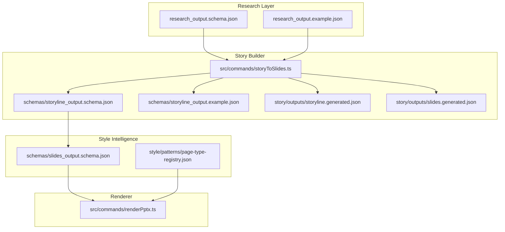
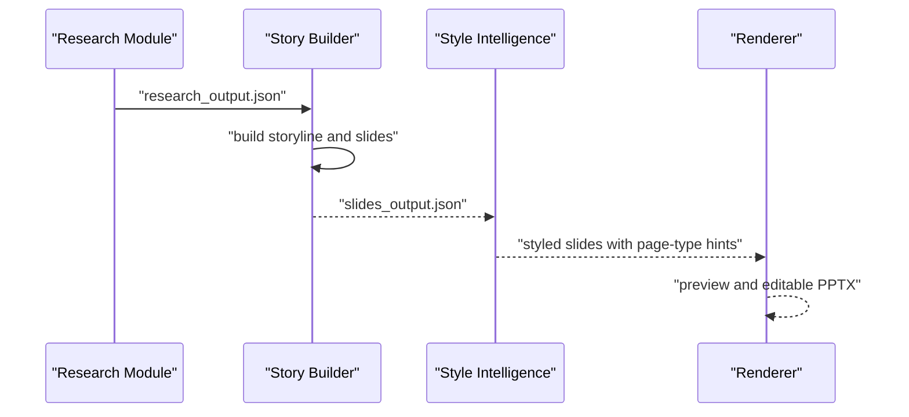
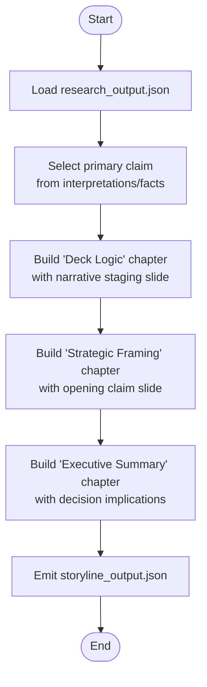
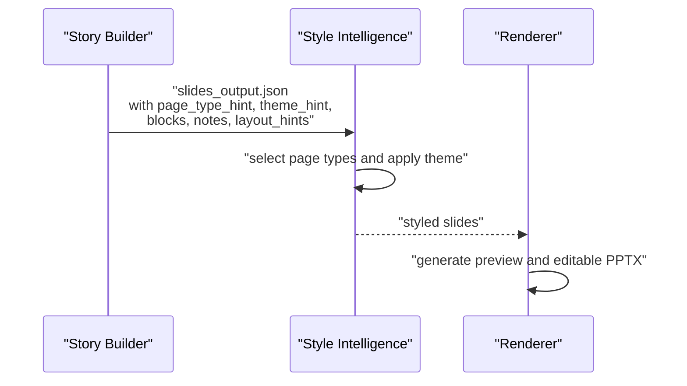
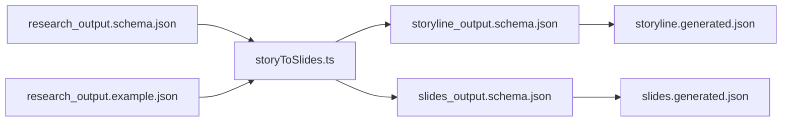

# PPT Story Builder

<cite>
**Referenced Files in This Document**
- [skills/README.md](file://skills/README.md)
- [src/commands/storyToSlides.ts](file://src/commands/storyToSlides.ts)
- [schemas/research_output.schema.json](file://schemas/research_output.schema.json)
- [schemas/research_output.example.json](file://schemas/research_output.example.json)
- [schemas/storyline_output.schema.json](file://schemas/storyline_output.schema.json)
- [schemas/storyline_output.example.json](file://schemas/storyline_output.example.json)
- [schemas/slides_output.schema.json](file://schemas/slides_output.schema.json)
- [story/outputs/storyline.generated.json](file://story/outputs/storyline.generated.json)
- [story/outputs/slides.generated.json](file://story/outputs/slides.generated.json)
- [docs/decisions/ADR-0001-layered-pipeline.md](file://docs/decisions/ADR-0001-layered-pipeline.md)
- [PROJECT_BLUEPRINT.md](file://PROJECT_BLUEPRINT.md)
- [src/commands/renderPptx.ts](file://src/commands/renderPptx.ts)
</cite>

## Table of Contents
1. [Introduction](#introduction)
2. [Project Structure](#project-structure)
3. [Core Components](#core-components)
4. [Architecture Overview](#architecture-overview)
5. [Detailed Component Analysis](#detailed-component-analysis)
6. [Dependency Analysis](#dependency-analysis)
7. [Performance Considerations](#performance-considerations)
8. [Troubleshooting Guide](#troubleshooting-guide)
9. [Conclusion](#conclusion)
10. [Appendices](#appendices)

## Introduction
The PPT Story Builder skill module is responsible for transforming structured research data into a coherent narrative blueprint and structured slide content. It defines the story’s chapters, the central questions each chapter addresses, and the claims that drive individual slides. The module also establishes slide sequencing patterns and integrates with the style intelligence system by emitting page-type hints that guide subsequent rendering and styling.

At a high level, the story builder:
- Accepts structured research input conforming to a defined schema
- Produces a storyline artifact that organizes content into chapters and slides
- Produces a slides artifact that captures per-slide content, layout hints, and notes for style binding
- Ensures logical flow between slides and maintains audience engagement by aligning narrative staging with page-type choices

## Project Structure
The PPT Story Builder lives within the broader layered pipeline and interacts with research, style, and rendering modules. The relevant parts of the repository include:
- Command-line entry point that orchestrates story-to-slides conversion
- Schemas that define contracts for research, storyline, and slides outputs
- Generated outputs that demonstrate the expected structure of narrative and slide artifacts
- Architectural documents that describe the separation of concerns across layers

**Diagram sources**
- [src/commands/storyToSlides.ts:12-166](file://src/commands/storyToSlides.ts#L12-L166)
- [schemas/research_output.schema.json:1-88](file://schemas/research_output.schema.json#L1-L88)
- [schemas/research_output.example.json:1-45](file://schemas/research_output.example.json#L1-L45)
- [schemas/storyline_output.schema.json:1-49](file://schemas/storyline_output.schema.json#L1-L49)
- [schemas/storyline_output.example.json:1-23](file://schemas/storyline_output.example.json#L1-L23)
- [schemas/slides_output.schema.json:1-53](file://schemas/slides_output.schema.json#L1-L53)
- [story/outputs/storyline.generated.json:1-49](file://story/outputs/storyline.generated.json#L1-L49)
- [story/outputs/slides.generated.json:1-97](file://story/outputs/slides.generated.json#L1-L97)
- [src/commands/renderPptx.ts:363-412](file://src/commands/renderPptx.ts#L363-L412)

**Section sources**
- [skills/README.md:11-16](file://skills/README.md#L11-L16)
- [docs/decisions/ADR-0001-layered-pipeline.md:10-23](file://docs/decisions/ADR-0001-layered-pipeline.md#L10-L23)
- [PROJECT_BLUEPRINT.md:610-619](file://PROJECT_BLUEPRINT.md#L610-L619)

## Core Components
- Storyline schema and example: Defines the narrative structure with deck title, audience, and a narrative block containing core question and chapters. Each chapter includes an id, title, question, and ordered slides. Each slide includes id, claim, role, and optional page-type hint.
- Slides schema and example: Defines the per-slide structure with deck title, theme hint, and an array of slides. Each slide includes identifiers, chapter linkage, title, claim, blocks, notes, and layout hints.
- Research schema and example: Defines the upstream research input with topic, audience, industry, objective, facts, interpretations, risks, constraints, open questions, and sources.
- Story-to-slides command: Transforms research into a scaffolded storyline and slides, wiring claims and page-type hints to guide style binding.

Key responsibilities:
- Storyline construction: Build chapters around a core question and stage opening, middle, and conclusion slides.
- Slide sequencing: Define the order of slides to maintain logical flow and narrative pacing.
- Page-type hints: Provide hints that style intelligence can consume to select appropriate page types and layouts.
- Notes and layout hints: Encode audience tone, emphasis points, and layout preferences to support rendering.

**Section sources**
- [schemas/storyline_output.schema.json:8-47](file://schemas/storyline_output.schema.json#L8-L47)
- [schemas/slides_output.schema.json:7-50](file://schemas/slides_output.schema.json#L7-L50)
- [schemas/research_output.schema.json:7-85](file://schemas/research_output.schema.json#L7-L85)
- [src/commands/storyToSlides.ts:12-166](file://src/commands/storyToSlides.ts#L12-L166)

## Architecture Overview
The PPT Story Builder participates in a layered pipeline:
- Research layer produces structured research outputs.
- Story builder consumes research and emits structured storyline and slides artifacts.
- Style intelligence consumes slides and binds page types and themes.
- Renderer consumes styled slides and produces preview and editable PPTX.

**Diagram sources**
- [docs/decisions/ADR-0001-layered-pipeline.md:10-23](file://docs/decisions/ADR-0001-layered-pipeline.md#L10-L23)
- [src/commands/storyToSlides.ts:12-166](file://src/commands/storyToSlides.ts#L12-L166)
- [schemas/slides_output.schema.json:1-53](file://schemas/slides_output.schema.json#L1-L53)

**Section sources**
- [skills/README.md:11-16](file://skills/README.md#L11-L16)
- [PROJECT_BLUEPRINT.md:610-619](file://PROJECT_BLUEPRINT.md#L610-L619)

## Detailed Component Analysis

### Storyline Construction Algorithms
The story builder constructs a three-part narrative scaffold:
- Deck Logic chapter: Establishes the agenda and narrative staging for executive review.
- Strategic Framing chapter: Presents the opening strategic claim derived from research.
- Executive Summary chapter: Provides decision implications and next steps.

Algorithmic flow:
- Extract primary interpretation or first fact as the opening strategic claim.
- Derive secondary support points from research facts and domain constraints.
- Assign page-type hints to guide style selection for each slide.

**Diagram sources**
- [src/commands/storyToSlides.ts:21-73](file://src/commands/storyToSlides.ts#L21-L73)

**Section sources**
- [src/commands/storyToSlides.ts:21-73](file://src/commands/storyToSlides.ts#L21-L73)

### Chapter Logic Implementation
Chapter logic is driven by the core question and the ordered progression of slides:
- Intro chapter: Sets the stage for executive review and frames the discussion path.
- Strategic Framing chapter: Anchors the presentation on the primary claim and support points.
- Summary chapter: Reinforces decision relevance and outlines implications.

Implementation highlights:
- Each chapter includes a question that guides slide content and page-type selection.
- Slides are sequenced to move from broad framing to specific claims and culminate in decision implications.

**Section sources**
- [src/commands/storyToSlides.ts:31-70](file://src/commands/storyToSlides.ts#L31-L70)
- [schemas/storyline_output.schema.json:14-44](file://schemas/storyline_output.schema.json#L14-L44)

### Slide Sequencing Patterns
Slide sequencing follows a staged narrative arc:
- Cover slide introduces topic, subtitle, and claim, with story points and audience notes.
- Agenda slide presents the narrative map and decision cues.
- Framing slide delivers the opening strategic claim and support points.
- Summary slide consolidates implications and decision cues.

Layout and notes:
- Layout hints encode weight center, density level, and symmetry preferences.
- Notes include audience tone, visual anchors, and emphasis keywords to guide stylistic choices.

**Section sources**
- [src/commands/storyToSlides.ts:75-159](file://src/commands/storyToSlides.ts#L75-L159)
- [schemas/slides_output.schema.json:17-48](file://schemas/slides_output.schema.json#L17-L48)

### Integration with Style Intelligence
The story builder integrates with style intelligence by:
- Emitting page-type hints per slide to guide page-type selection.
- Providing theme hints to align visual themes with the narrative.
- Supplying blocks, notes, and layout hints that inform styling and composition.

**Diagram sources**
- [src/commands/storyToSlides.ts:75-159](file://src/commands/storyToSlides.ts#L75-L159)
- [schemas/slides_output.schema.json:10-48](file://schemas/slides_output.schema.json#L10-L48)
- [src/commands/renderPptx.ts:363-412](file://src/commands/renderPptx.ts#L363-L412)

**Section sources**
- [src/commands/storyToSlides.ts:75-159](file://src/commands/storyToSlides.ts#L75-L159)
- [schemas/slides_output.schema.json:10-48](file://schemas/slides_output.schema.json#L10-L48)

### Practical Examples of Storyline Generation
- Example storyline: Demonstrates a minimal narrative with a core question and chapters.
- Example slides: Shows a four-slide deck with page-type hints and notes aligned to the storyline.

These examples illustrate how the story builder translates research into a structured narrative and slide deck.

**Section sources**
- [schemas/storyline_output.example.json:1-23](file://schemas/storyline_output.example.json#L1-L23)
- [story/outputs/storyline.generated.json:1-49](file://story/outputs/storyline.generated.json#L1-L49)
- [story/outputs/slides.generated.json:1-97](file://story/outputs/slides.generated.json#L1-L97)

### Prompt Engineering Techniques and Content Structuring Workflows
While the current implementation focuses on structured data ingestion and scaffolding, the following techniques can be applied to refine prompts and workflows:
- Core question framing: Ensure the research objective becomes the central question driving each chapter.
- Claim anchoring: Use the primary interpretation or first fact as the opening claim; derive support points from subsequent facts.
- Page-type alignment: Choose page-type hints that reflect the slide’s role (e.g., narrative map, bottleneck shift, chapter summary signal).
- Notes and emphasis: Encode audience tone and must-emphasize points to guide stylistic reinforcement.

[No sources needed since this section provides general guidance]

### Narrative Coherence Validation and Best Practices
- Coherence validation: Verify that each slide’s claim supports the chapter question and that the storyline’s chapters progress logically from framing to decision implications.
- Best practices:
  - Keep page-type hints consistent with slide roles.
  - Use notes to anchor visual metaphors and emphasize decision-relevant points.
  - Align layout hints with the intended weight and density for each slide.

[No sources needed since this section provides general guidance]

## Dependency Analysis
The story builder depends on:
- Research schema and example for input validation and content sourcing
- Storyline and slides schemas for output contracts
- Generated outputs for demonstration and testing

**Diagram sources**
- [schemas/research_output.schema.json:1-88](file://schemas/research_output.schema.json#L1-L88)
- [schemas/research_output.example.json:1-45](file://schemas/research_output.example.json#L1-L45)
- [src/commands/storyToSlides.ts:12-166](file://src/commands/storyToSlides.ts#L12-L166)
- [schemas/storyline_output.schema.json:1-49](file://schemas/storyline_output.schema.json#L1-L49)
- [schemas/slides_output.schema.json:1-53](file://schemas/slides_output.schema.json#L1-L53)
- [story/outputs/storyline.generated.json:1-49](file://story/outputs/storyline.generated.json#L1-L49)
- [story/outputs/slides.generated.json:1-97](file://story/outputs/slides.generated.json#L1-L97)

**Section sources**
- [src/commands/storyToSlides.ts:12-166](file://src/commands/storyToSlides.ts#L12-L166)
- [schemas/research_output.schema.json:7-85](file://schemas/research_output.schema.json#L7-L85)
- [schemas/storyline_output.schema.json:8-47](file://schemas/storyline_output.schema.json#L8-L47)
- [schemas/slides_output.schema.json:7-50](file://schemas/slides_output.schema.json#L7-L50)

## Performance Considerations
- Minimize redundant computations by deriving claims and support points from the research input once.
- Keep page-type hints aligned with slide roles to reduce rework during style binding.
- Validate schemas early to fail fast on malformed inputs.

[No sources needed since this section provides general guidance]

## Troubleshooting Guide
Common issues and resolutions:
- Missing research input: Ensure the research path argument is provided and points to a valid research output file.
- Schema mismatches: Validate inputs against the research schema and outputs against the storyline and slides schemas.
- Page-type hint mismatches: Confirm that emitted page-type hints match available page types in the style registry.

**Section sources**
- [src/commands/storyToSlides.ts:14-16](file://src/commands/storyToSlides.ts#L14-L16)
- [schemas/research_output.schema.json:7-85](file://schemas/research_output.schema.json#L7-L85)
- [schemas/storyline_output.schema.json:8-47](file://schemas/storyline_output.schema.json#L8-L47)
- [schemas/slides_output.schema.json:7-50](file://schemas/slides_output.schema.json#L7-L50)

## Conclusion
The PPT Story Builder skill module provides a structured pathway from research to narrative and slide content. By enforcing clear contracts, sequencing slides deliberately, and integrating with style intelligence via page-type hints, it ensures logical flow and audience engagement. The layered pipeline further enables independent inspection, iteration, and delivery of editable presentations.

[No sources needed since this section summarizes without analyzing specific files]

## Appendices
- Boundary definitions: The story builder owns storyline and structured slide content, distinct from research and rendering responsibilities.
- Layered pipeline rationale: Adopting a layered pipeline improves modularity, allows rerendering, and supports multiple deck variants from the same research.

**Section sources**
- [skills/README.md:11-16](file://skills/README.md#L11-L16)
- [docs/decisions/ADR-0001-layered-pipeline.md:10-23](file://docs/decisions/ADR-0001-layered-pipeline.md#L10-L23)
- [PROJECT_BLUEPRINT.md:610-619](file://PROJECT_BLUEPRINT.md#L610-L619)