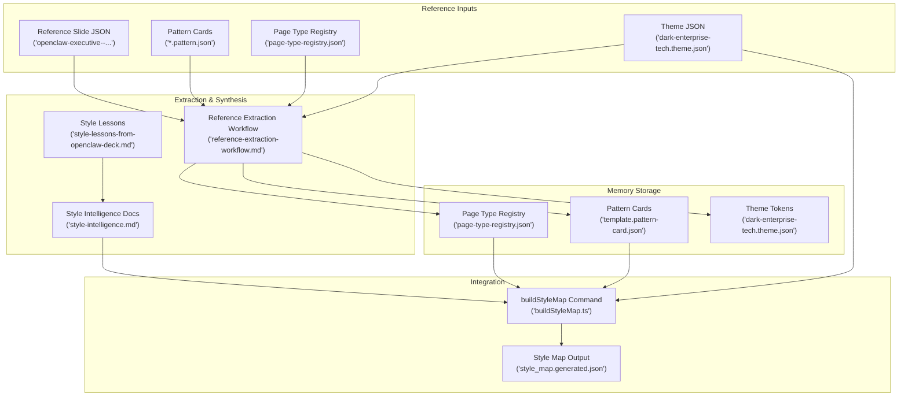
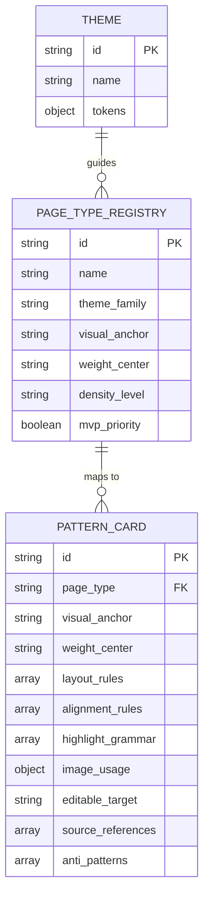
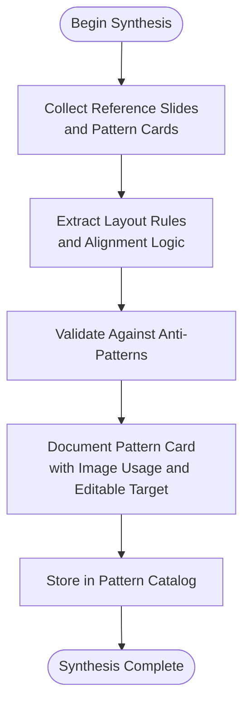
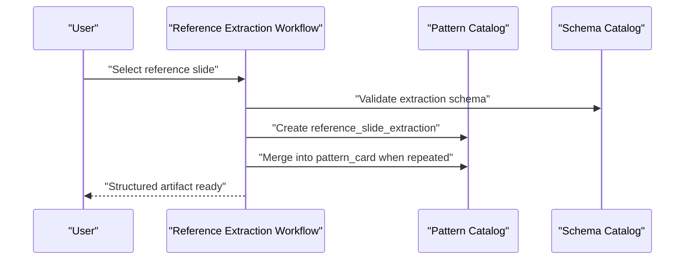
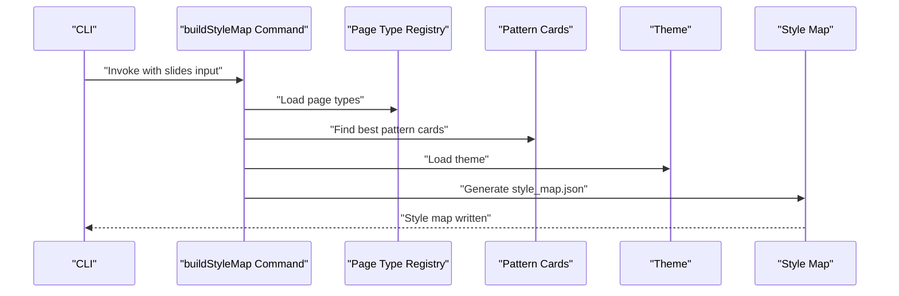
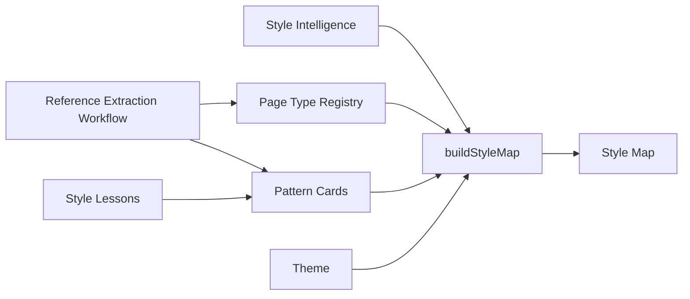

# PPT Style Memory

<cite>
**Referenced Files in This Document**
- [skills/README.md](file://skills/README.md)
- [references/skill-split.md](file://references/skill-split.md)
- [references/style-intelligence.md](file://references/style-intelligence.md)
- [references/style-lessons-from-openclaw-deck.md](file://references/style-lessons-from-openclaw-deck.md)
- [references/validated-slide-patterns.md](file://references/validated-slide-patterns.md)
- [docs/workflows/reference-extraction-workflow.md](file://docs/workflows/reference-extraction-workflow.md)
- [src/commands/buildStyleMap.ts](file://src/commands/buildStyleMap.ts)
- [src/commands/inspectStyle.ts](file://src/commands/inspectStyle.ts)
- [src/lib/schemaCatalog.ts](file://src/lib/schemaCatalog.ts)
- [style/patterns/page-type-registry.json](file://style/patterns/page-type-registry.json)
- [style/patterns/template.pattern-card.json](file://style/patterns/template.pattern-card.json)
- [style/reference_extractions/template.reference-slide.json](file://style/reference_extractions/template.reference-slide.json)
- [style/themes/dark-enterprise-tech.theme.json](file://style/themes/dark-enterprise-tech.theme.json)
- [style/outputs/style_map.generated.json](file://style/outputs/style_map.generated.json)
</cite>

## Table of Contents
1. [Introduction](#introduction)
2. [Project Structure](#project-structure)
3. [Core Components](#core-components)
4. [Architecture Overview](#architecture-overview)
5. [Detailed Component Analysis](#detailed-component-analysis)
6. [Dependency Analysis](#dependency-analysis)
7. [Performance Considerations](#performance-considerations)
8. [Troubleshooting Guide](#troubleshooting-guide)
9. [Conclusion](#conclusion)
10. [Appendices](#appendices)

## Introduction
PPT Style Memory is an optional capability that transforms high-quality reference slides and design insights into reusable, structured knowledge for presentation systems. Its primary goals are:
- Design pattern recognition: extracting page types, layout rules, and anti-patterns from strong examples
- Reusable memory storage: persisting validated patterns, themes, and component definitions
- Pattern extraction processes: converting visual reasoning into machine-readable artifacts

By maintaining a curated pattern catalog and synthesizing design lessons, Style Memory enables consistent, brand-aligned slide creation and improves design efficiency across decks.

## Project Structure
The PPT Style Memory module spans documentation, schemas, and command-line tools that orchestrate pattern extraction and style mapping.

```mermaid
graph TB
subgraph "Documentation"
A["skills/README.md"]
B["references/skill-split.md"]
C["references/style-intelligence.md"]
D["references/style-lessons-from-openclaw-deck.md"]
E["references/validated-slide-patterns.md"]
F["docs/workflows/reference-extraction-workflow.md"]
end
subgraph "Artifacts"
G["style/patterns/page-type-registry.json"]
H["style/patterns/template.pattern-card.json"]
I["style/reference_extractions/template.reference-slide.json"]
J["style/themes/dark-enterprise-tech.theme.json"]
K["style/outputs/style_map.generated.json"]
end
subgraph "Commands"
L["src/commands/buildStyleMap.ts"]
M["src/commands/inspectStyle.ts"]
N["src/lib/schemaCatalog.ts"]
end
A --> L
B --> L
C --> L
D --> L
E --> L
F --> L
G --> L
H --> L
I --> L
J --> L
K --> L
N --> L
```

**Diagram sources**
- [skills/README.md:1-16](file://skills/README.md#L1-L16)
- [references/skill-split.md:1-41](file://references/skill-split.md#L1-L41)
- [references/style-intelligence.md:1-93](file://references/style-intelligence.md#L1-L93)
- [references/style-lessons-from-openclaw-deck.md:1-161](file://references/style-lessons-from-openclaw-deck.md#L1-L161)
- [references/validated-slide-patterns.md:1-345](file://references/validated-slide-patterns.md#L1-L345)
- [docs/workflows/reference-extraction-workflow.md:1-73](file://docs/workflows/reference-extraction-workflow.md#L1-L73)
- [style/patterns/page-type-registry.json](file://style/patterns/page-type-registry.json)
- [style/patterns/template.pattern-card.json](file://style/patterns/template.pattern-card.json)
- [style/reference_extractions/template.reference-slide.json](file://style/reference_extractions/template.reference-slide.json)
- [style/themes/dark-enterprise-tech.theme.json](file://style/themes/dark-enterprise-tech.theme.json)
- [style/outputs/style_map.generated.json](file://style/outputs/style_map.generated.json)
- [src/commands/buildStyleMap.ts:1-110](file://src/commands/buildStyleMap.ts#L1-L110)
- [src/commands/inspectStyle.ts:1-14](file://src/commands/inspectStyle.ts#L1-L14)
- [src/lib/schemaCatalog.ts:1-24](file://src/lib/schemaCatalog.ts#L1-L24)

**Section sources**
- [skills/README.md:1-16](file://skills/README.md#L1-L16)
- [references/skill-split.md:1-41](file://references/skill-split.md#L1-L41)
- [references/style-intelligence.md:1-93](file://references/style-intelligence.md#L1-L93)
- [references/style-lessons-from-openclaw-deck.md:1-161](file://references/style-lessons-from-openclaw-deck.md#L1-L161)
- [references/validated-slide-patterns.md:1-345](file://references/validated-slide-patterns.md#L1-L345)
- [docs/workflows/reference-extraction-workflow.md:1-73](file://docs/workflows/reference-extraction-workflow.md#L1-L73)

## Core Components
- Pattern Catalog Management
  - Maintains a page-type registry and validated pattern cards
  - Stores reusable page types, layout rules, alignment rules, and anti-patterns
- Design Lesson Synthesis
  - Encapsulates practical style rules and anti-patterns learned from real decks
  - Provides guidance for visual anchors, weight centers, and composition decisions
- Reference Extraction Workflow
  - Converts strong reference slides into structured knowledge artifacts
  - Merges repeated logic into reusable pattern cards
- Style Intelligence Integration
  - Produces a style map that binds page types, visual anchors, and editable targets
  - Enables consistent rendering and editable output across presentations

**Section sources**
- [references/style-intelligence.md:1-93](file://references/style-intelligence.md#L1-L93)
- [references/style-lessons-from-openclaw-deck.md:1-161](file://references/style-lessons-from-openclaw-deck.md#L1-L161)
- [references/validated-slide-patterns.md:1-345](file://references/validated-slide-patterns.md#L1-L345)
- [docs/workflows/reference-extraction-workflow.md:1-73](file://docs/workflows/reference-extraction-workflow.md#L1-L73)

## Architecture Overview
The PPT Style Memory skill orchestrates pattern recognition and memory storage through a clear pipeline: extract reference knowledge, synthesize design lessons, manage the pattern catalog, and integrate with the style intelligence system to produce a style map.

**Diagram sources**
- [docs/workflows/reference-extraction-workflow.md:1-73](file://docs/workflows/reference-extraction-workflow.md#L1-L73)
- [references/style-lessons-from-openclaw-deck.md:1-161](file://references/style-lessons-from-openclaw-deck.md#L1-L161)
- [references/style-intelligence.md:1-93](file://references/style-intelligence.md#L1-L93)
- [style/patterns/page-type-registry.json](file://style/patterns/page-type-registry.json)
- [style/patterns/template.pattern-card.json](file://style/patterns/template.pattern-card.json)
- [style/reference_extractions/template.reference-slide.json](file://style/reference_extractions/template.reference-slide.json)
- [style/themes/dark-enterprise-tech.theme.json](file://style/themes/dark-enterprise-tech.theme.json)
- [src/commands/buildStyleMap.ts:1-110](file://src/commands/buildStyleMap.ts#L1-L110)
- [style/outputs/style_map.generated.json](file://style/outputs/style_map.generated.json)

## Detailed Component Analysis

### Pattern Catalog Management
- Page Type Registry
  - Defines reusable page types with attributes such as visual anchors, weight centers, and density levels
  - Supports MVP prioritization and theme family selection
- Pattern Cards
  - Capture validated page layouts with layout rules, alignment rules, highlight grammar, and image usage guidance
  - Include anti-patterns and editable target definitions for consistent rendering
- Themes
  - Token-based theme definitions enable consistent color palettes, typography, spacing, and effects across slides

**Diagram sources**
- [style/patterns/page-type-registry.json](file://style/patterns/page-type-registry.json)
- [style/patterns/template.pattern-card.json](file://style/patterns/template.pattern-card.json)
- [style/themes/dark-enterprise-tech.theme.json](file://style/themes/dark-enterprise-tech.theme.json)

**Section sources**
- [style/patterns/page-type-registry.json](file://style/patterns/page-type-registry.json)
- [style/patterns/template.pattern-card.json](file://style/patterns/template.pattern-card.json)
- [style/themes/dark-enterprise-tech.theme.json](file://style/themes/dark-enterprise-tech.theme.json)

### Design Lesson Synthesis
- Practical Style Rules
  - Emphasizes asymmetry, focal contrast, object-centric layouts, and rhythm
  - Highlights the importance of visual anchors and designed weight centers
- Anti-Patterns
  - Identifies generic card grids, symmetry without purpose, and empty boxes as recurring weaknesses
- Composition Guidance
  - Provides explicit rules for page weight distribution and decision-object usage
- What Worked Best
  - Documents successful patterns like Cover Orbit, Trust Terminal, and Bottleneck Shift with rationale

**Diagram sources**
- [references/style-lessons-from-openclaw-deck.md:1-161](file://references/style-lessons-from-openclaw-deck.md#L1-L161)
- [references/validated-slide-patterns.md:1-345](file://references/validated-slide-patterns.md#L1-L345)

**Section sources**
- [references/style-lessons-from-openclaw-deck.md:1-161](file://references/style-lessons-from-openclaw-deck.md#L1-L161)
- [references/validated-slide-patterns.md:1-345](file://references/validated-slide-patterns.md#L1-L345)

### Reference Extraction Workflow
- Purpose
  - Convert strong reference slides into structured design knowledge for reuse
- Outputs
  - Reference slide extractions and merged pattern cards
- Steps
  - Pick benchmark decks, select candidate slides, extract one slide, merge repeated logic, and feed learned patterns back into the catalog
- Quality Standard
  - Focus on narrative role, layout rationale, visual weight, image contribution, and reusable rules

**Diagram sources**
- [docs/workflows/reference-extraction-workflow.md:1-73](file://docs/workflows/reference-extraction-workflow.md#L1-L73)
- [src/lib/schemaCatalog.ts:1-24](file://src/lib/schemaCatalog.ts#L1-L24)

**Section sources**
- [docs/workflows/reference-extraction-workflow.md:1-73](file://docs/workflows/reference-extraction-workflow.md#L1-L73)
- [src/lib/schemaCatalog.ts:1-24](file://src/lib/schemaCatalog.ts#L1-L24)

### Style Intelligence Integration
- Role
  - Provides reusable visual reasoning and assets; not responsible for generating slides directly
- Responsibilities
  - Theme libraries, component libraries, pattern libraries, and anti-pattern knowledge
- Integration Point
  - The buildStyleMap command consumes page-type registry, pattern cards, and themes to produce a style map

**Diagram sources**
- [src/commands/buildStyleMap.ts:1-110](file://src/commands/buildStyleMap.ts#L1-L110)
- [style/patterns/page-type-registry.json](file://style/patterns/page-type-registry.json)
- [style/patterns/template.pattern-card.json](file://style/patterns/template.pattern-card.json)
- [style/themes/dark-enterprise-tech.theme.json](file://style/themes/dark-enterprise-tech.theme.json)
- [style/outputs/style_map.generated.json](file://style/outputs/style_map.generated.json)

**Section sources**
- [references/style-intelligence.md:1-93](file://references/style-intelligence.md#L1-L93)
- [src/commands/buildStyleMap.ts:1-110](file://src/commands/buildStyleMap.ts#L1-L110)

## Dependency Analysis
- Component Coupling
  - Pattern cards depend on page-type registry entries and themes
  - The buildStyleMap command depends on registry, pattern cards, and theme loading
- Cohesion
  - Style lessons and validated patterns are cohesive units that inform pattern card creation
- External Dependencies
  - Schema catalog validates extraction artifacts
- Integration Points
  - Reference extraction workflow feeds pattern catalog and registry
  - Style intelligence integrates with rendering via style map

**Diagram sources**
- [docs/workflows/reference-extraction-workflow.md:1-73](file://docs/workflows/reference-extraction-workflow.md#L1-L73)
- [references/style-lessons-from-openclaw-deck.md:1-161](file://references/style-lessons-from-openclaw-deck.md#L1-L161)
- [references/style-intelligence.md:1-93](file://references/style-intelligence.md#L1-L93)
- [src/commands/buildStyleMap.ts:1-110](file://src/commands/buildStyleMap.ts#L1-L110)
- [style/patterns/page-type-registry.json](file://style/patterns/page-type-registry.json)
- [style/patterns/template.pattern-card.json](file://style/patterns/template.pattern-card.json)
- [style/themes/dark-enterprise-tech.theme.json](file://style/themes/dark-enterprise-tech.theme.json)
- [style/outputs/style_map.generated.json](file://style/outputs/style_map.generated.json)

**Section sources**
- [src/commands/buildStyleMap.ts:1-110](file://src/commands/buildStyleMap.ts#L1-L110)
- [src/lib/schemaCatalog.ts:1-24](file://src/lib/schemaCatalog.ts#L1-L24)

## Performance Considerations
- Minimize redundant pattern lookups by caching best matches per page type
- Batch process reference extractions to reduce I/O overhead
- Validate schemas early to fail fast and avoid downstream computation
- Keep theme and registry loading efficient by preloading frequently used entries

## Troubleshooting Guide
- Missing page type or hint
  - Ensure each slide specifies a page type or hint; otherwise, mapping fails
- Unknown page type
  - Verify the page type exists in the registry; otherwise, add it or correct the identifier
- Missing required arguments
  - The buildStyleMap command requires a slides input; provide the path via the appropriate flag
- Schema validation errors
  - Confirm extraction artifacts conform to the expected schema catalog entries

**Section sources**
- [src/commands/buildStyleMap.ts:50-110](file://src/commands/buildStyleMap.ts#L50-L110)
- [src/lib/schemaCatalog.ts:12-24](file://src/lib/schemaCatalog.ts#L12-L24)

## Conclusion
PPT Style Memory elevates presentation design by capturing reusable patterns, synthesizing practical lessons, and integrating with the style intelligence system to produce consistent, brand-aligned outputs. Through rigorous extraction workflows and pattern catalog management, it ensures design efficiency and strategic coherence across decks.

## Appendices
- Practical Examples
  - Pattern Identification: Use validated patterns like Cover Orbit and Trust Terminal as templates for similar narrative roles
  - Memory Organization Strategies: Group patterns by page type and maintain anti-pattern notes to prevent regressions
  - Cross-Reference Methodologies: Link pattern cards to source references and editable targets for traceability
- Pattern Validation Criteria
  - Layout rules must be observable and repeatable
  - Alignment rules should reflect compositional intent
  - Highlight grammar and image usage must be actionable for rendering
- Design Consistency Enforcement
  - Enforce theme tokens and page-type weights centrally
  - Prevent anti-patterns through QA checks and pattern-driven rendering
- Integration with Style Intelligence
  - Feed pattern cards and lessons into the style intelligence system to enrich the pattern library and theme tokens