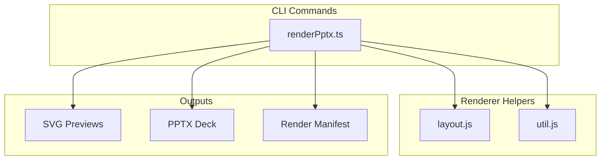
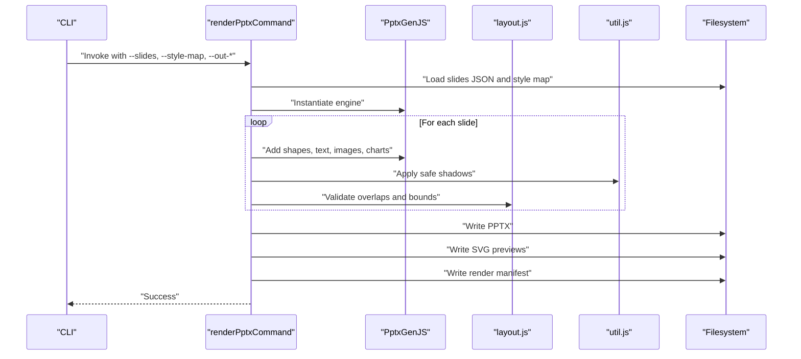
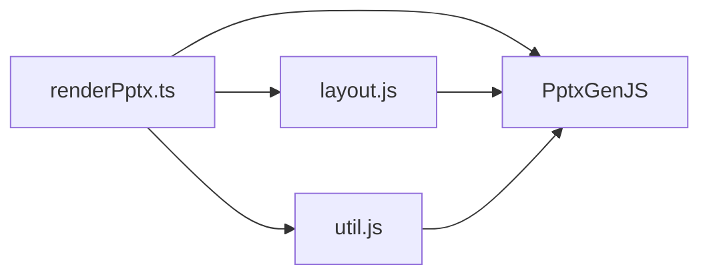

# PPT Style Renderer

<cite>
**Referenced Files in This Document**
- [renderPptx.ts](file://src/commands/renderPptx.ts)
- [layout.js](file://render/pptxgenjs_helpers/layout.js)
- [util.js](file://render/pptxgenjs_helpers/util.js)
- [ADR-0001-layered-pipeline.md](file://docs/decisions/ADR-0001-layered-pipeline.md)
- [ADR-0002-editable-pptx-strategy.md](file://docs/decisions/ADR-0002-editable-pptx-strategy.md)
- [README.md](file://README.md)
- [PROJECT_BLUEPRINT.md](file://PROJECT_BLUEPRINT.md)
- [PROJECT_INIT.md](file://PROJECT_INIT.md)
- [slides_output.schema.json](file://schemas/slides_output.schema.json)
- [style_map.schema.json](file://schemas/style_map.schema.json)
- [render_manifest.schema.json](file://schemas/render_manifest.schema.json)
</cite>

## Table of Contents
1. [Introduction](#introduction)
2. [Project Structure](#project-structure)
3. [Core Components](#core-components)
4. [Architecture Overview](#architecture-overview)
5. [Detailed Component Analysis](#detailed-component-analysis)
6. [Dependency Analysis](#dependency-analysis)
7. [Performance Considerations](#performance-considerations)
8. [Troubleshooting Guide](#troubleshooting-guide)
9. [Conclusion](#conclusion)
10. [Appendices](#appendices)

## Introduction
This document describes the PPT Style Renderer skill module and its role in transforming styled slide content into editable PowerPoint decks. It explains how style binding is applied, how previews are generated, and how the delivery pipeline integrates with PptxGenJS to produce high-quality, editable PPTX files. The document also covers layout management, utility functions, rendering performance, quality assurance checks, and the end-to-end rendering pipeline integration.

## Project Structure
The PPT Style Renderer is part of a layered pipeline that separates research, story building, style intelligence, rendering, and QA. The renderer command orchestrates the production of editable PPTX and SVG previews, while helper modules provide layout validation and safe styling utilities.

**Diagram sources**
- [renderPptx.ts:80-211](file://src/commands/renderPptx.ts#L80-L211)
- [layout.js:1-644](file://render/pptxgenjs_helpers/layout.js#L1-L644)
- [util.js:1-25](file://render/pptxgenjs_helpers/util.js#L1-L25)

**Section sources**
- [ADR-0001-layered-pipeline.md:1-24](file://docs/decisions/ADR-0001-layered-pipeline.md#L1-L24)
- [ADR-0002-editable-pptx-strategy.md:1-28](file://docs/decisions/ADR-0002-editable-pptx-strategy.md#L1-L28)
- [PROJECT_BLUEPRINT.md:262-381](file://PROJECT_BLUEPRINT.md#L262-L381)
- [PROJECT_INIT.md:80-95](file://PROJECT_INIT.md#L80-L95)

## Core Components
- Render command: Loads styled slides and style maps, configures PptxGenJS, and writes editable PPTX, SVG previews, and a render manifest.
- Layout helpers: Detect element types, compute overlaps, align/distribute elements, and warn about out-of-bounds elements.
- Utility helpers: Provide safe shadow configurations compatible with PptxGenJS.

Key responsibilities:
- Style binding: Applied during slide construction via PptxGenJS APIs.
- Preview generation: SVG previews written to disk for inspection.
- Editable output: Native PPTX produced with semantic slide types preserved.

**Section sources**
- [renderPptx.ts:80-211](file://src/commands/renderPptx.ts#L80-L211)
- [layout.js:1-644](file://render/pptxgenjs_helpers/layout.js#L1-L644)
- [util.js:1-25](file://render/pptxgenjs_helpers/util.js#L1-L25)

## Architecture Overview
The renderer follows a dual-output strategy: a preview pipeline for rapid iteration and a delivery pipeline for native editable PPTX. The render command coordinates both outputs and validates layout correctness.

**Diagram sources**
- [renderPptx.ts:80-211](file://src/commands/renderPptx.ts#L80-L211)
- [layout.js:23-232](file://render/pptxgenjs_helpers/layout.js#L23-L232)
- [util.js:4-20](file://render/pptxgenjs_helpers/util.js#L4-L20)

## Detailed Component Analysis

### Render Command: renderPptxCommand
Responsibilities:
- Parse CLI arguments for input slides, style map, and output destinations.
- Initialize PptxGenJS and configure slide dimensions.
- Iterate over slides, apply styles, and add elements to the slide.
- Add a slide frame using theme background and border.
- Write editable PPTX, SVG previews, and a render manifest.

Rendering pipeline integration:
- Uses PptxGenJS native slide objects to preserve editability.
- Integrates layout helpers to detect overlaps and out-of-bounds elements.
- Integrates utility helpers to safely apply shadows.

Editable output creation:
- Ensures semantic page types remain intact for downstream editing.
- Produces a manifest for traceability and rerendering.

Preview generation:
- Writes SVG previews alongside the PPTX for quick review.

Practical example workflow:
- Load slides JSON and style map.
- Run the render command with output paths.
- Inspect SVG previews; open PPTX in PowerPoint to verify editability.

**Section sources**
- [renderPptx.ts:80-211](file://src/commands/renderPptx.ts#L80-L211)
- [renderPptx.ts:171-190](file://src/commands/renderPptx.ts#L171-L190)

### Layout Helpers: layout.js
Capabilities:
- Element type inference (text, image, shape, chart, table, media, smartArt, line).
- Overlap detection with warnings and suggestions for rectification.
- Alignment and distribution utilities for positioning multiple elements.
- Out-of-bounds detection with warnings.
- Slide dimension resolution from PptxGenJS internals.

Quality assurance:
- Warns on severe text overlaps requiring fixes.
- Suggests horizontal or vertical adjustments to resolve overlaps.
- Flags containment and overlap cases for manual review.

Performance characteristics:
- Linear-time comparisons per slide; suitable for typical slide counts.
- Early exits and minimal allocations reduce overhead.

**Section sources**
- [layout.js:4-18](file://render/pptxgenjs_helpers/layout.js#L4-L18)
- [layout.js:23-232](file://render/pptxgenjs_helpers/layout.js#L23-L232)
- [layout.js:462-517](file://render/pptxgenjs_helpers/layout.js#L462-L517)
- [layout.js:519-573](file://render/pptxgenjs_helpers/layout.js#L519-L573)
- [layout.js:575-633](file://render/pptxgenjs_helpers/layout.js#L575-L633)
- [layout.js:429-460](file://render/pptxgenjs_helpers/layout.js#L429-L460)

### Utility Helpers: util.js
Capabilities:
- Safe outer shadow configuration compatible with PptxGenJS.
- Prevents invalid shadow combinations and XML pitfalls.

Usage:
- Called during slide construction to apply consistent shadow effects.

**Section sources**
- [util.js:4-20](file://render/pptxgenjs_helpers/util.js#L4-L20)

### Rendering Pipeline Integration
Layered pipeline:
- Research → Story Builder → Style Intelligence → Renderer → QA.
- Each layer produces structured artifacts for inspection and reruns.

Editable PPTX strategy:
- Prefer native PPTX for final delivery.
- Allow SVG insertion as a temporary bridge for complex visuals.

**Section sources**
- [ADR-0001-layered-pipeline.md:1-24](file://docs/decisions/ADR-0001-layered-pipeline.md#L1-L24)
- [ADR-0002-editable-pptx-strategy.md:1-28](file://docs/decisions/ADR-0002-editable-pptx-strategy.md#L1-L28)

### Style Binding and Visual Consistency
Style binding:
- Styles are applied via PptxGenJS APIs when adding shapes, text, images, and charts.
- Theme palette and typography are enforced consistently across slides.

Visual consistency:
- Slide frame added uniformly to maintain brand consistency.
- Layout helpers ensure spacing and alignment remain consistent.

**Section sources**
- [renderPptx.ts:192-211](file://src/commands/renderPptx.ts#L192-L211)
- [layout.js:462-517](file://render/pptxgenjs_helpers/layout.js#L462-L517)

### Preview Generation Process
Process:
- For each slide, generate an SVG preview and write to the preview directory.
- Produce a single HTML index referencing the SVGs for quick browsing.

Outputs:
- SVG directory for individual slide previews.
- HTML index for aggregated preview navigation.

**Section sources**
- [renderPptx.ts:101-104](file://src/commands/renderPptx.ts#L101-L104)
- [renderPptx.ts:171-189](file://src/commands/renderPptx.ts#L171-L189)

### PPTX Export Procedures
Procedure:
- Instantiate PptxGenJS.
- Configure slide dimensions and theme.
- Add slide frame and content elements.
- Validate layout and write outputs.

Validation:
- Overlap and out-of-bounds warnings guide corrections before export.

**Section sources**
- [renderPptx.ts:80-99](file://src/commands/renderPptx.ts#L80-L99)
- [layout.js:23-232](file://render/pptxgenjs_helpers/layout.js#L23-L232)
- [layout.js:575-633](file://render/pptxgenjs_helpers/layout.js#L575-L633)

### Practical Examples

#### Style Application Workflow
- Load styled slides and style map.
- For each slide, iterate over elements and apply styles using PptxGenJS APIs.
- Apply safe shadows via utility helper.
- Validate with layout helpers; adjust positions if needed.

#### Preview Generation Process
- Generate SVG previews per slide.
- Write HTML index for easy navigation.
- Review for readability and visual fidelity.

#### PPTX Export Procedure
- Build the presentation with all slides.
- Validate layout and fix overlaps.
- Export PPTX and update render manifest.

**Section sources**
- [renderPptx.ts:80-211](file://src/commands/renderPptx.ts#L80-L211)
- [layout.js:23-232](file://render/pptxgenjs_helpers/layout.js#L23-L232)
- [util.js:4-20](file://render/pptxgenjs_helpers/util.js#L4-L20)

## Dependency Analysis
The render command depends on:
- PptxGenJS for editable output.
- Layout helpers for quality checks.
- Utility helpers for safe styling.

**Diagram sources**
- [renderPptx.ts:80-99](file://src/commands/renderPptx.ts#L80-L99)
- [layout.js:1-644](file://render/pptxgenjs_helpers/layout.js#L1-L644)
- [util.js:1-25](file://render/pptxgenjs_helpers/util.js#L1-L25)

**Section sources**
- [renderPptx.ts:80-99](file://src/commands/renderPptx.ts#L80-L99)

## Performance Considerations
- Overlap detection runs in O(n^2) per slide; acceptable for typical slide counts.
- Use alignment and distribution helpers to minimize manual positioning work.
- Prefer vector-based previews (SVG) for faster generation and lower storage.
- Keep slide dimensions consistent to avoid repeated conversions.

## Troubleshooting Guide
Common issues and resolutions:
- Severe text overlaps: Fix by repositioning elements horizontally or vertically as suggested by overlap warnings.
- Out-of-bounds elements: Adjust coordinates to fit within slide dimensions.
- Containment warnings: Review whether full containment is intended or if elements should be resized/moved.
- Shadow configuration: Use the safe outer shadow helper to avoid invalid combinations.

**Section sources**
- [layout.js:160-200](file://render/pptxgenjs_helpers/layout.js#L160-L200)
- [layout.js:575-633](file://render/pptxgenjs_helpers/layout.js#L575-L633)
- [util.js:4-20](file://render/pptxgenjs_helpers/util.js#L4-L20)

## Conclusion
The PPT Style Renderer skill module integrates style binding, preview generation, and editable PPTX export through a layered pipeline. It leverages PptxGenJS for native, editable output, employs layout helpers for quality assurance, and uses utility helpers for safe styling. The result is a robust system that maintains visual consistency and design integrity across slides while enabling efficient iteration and final delivery.

## Appendices

### Schema References
- Slides output schema: Defines the structure of slide content used by the renderer.
- Style map schema: Defines the mapping of styles to page types and components.
- Render manifest schema: Describes the metadata and outputs produced by the render command.

**Section sources**
- [slides_output.schema.json](file://schemas/slides_output.schema.json)
- [style_map.schema.json](file://schemas/style_map.schema.json)
- [render_manifest.schema.json](file://schemas/render_manifest.schema.json)