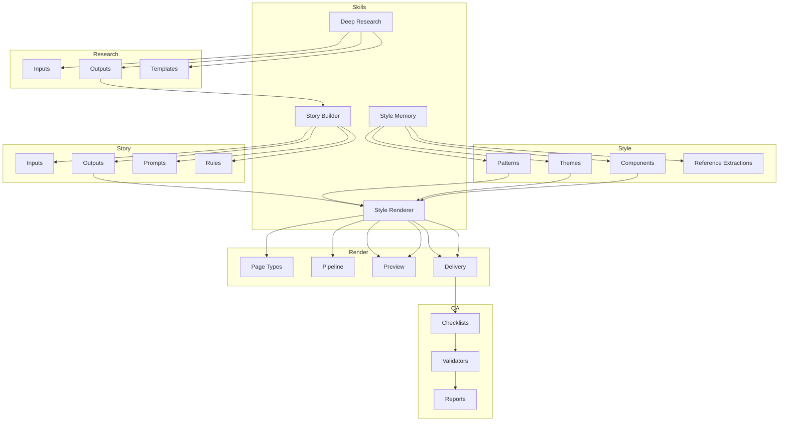
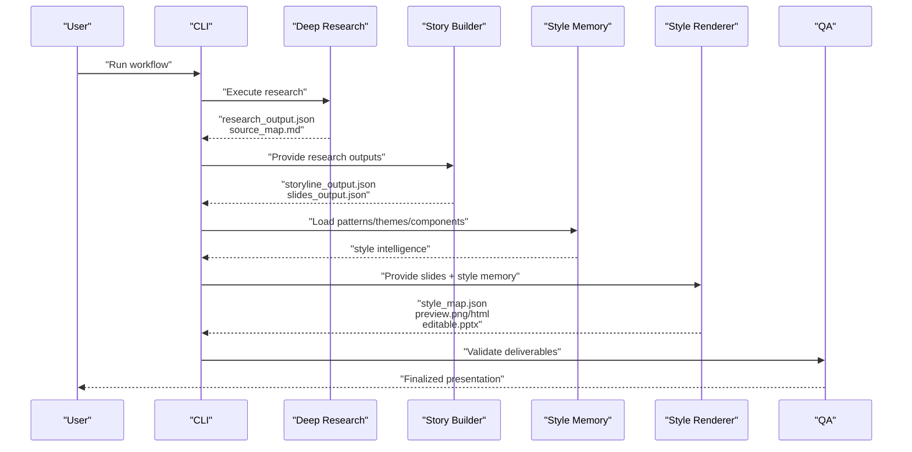
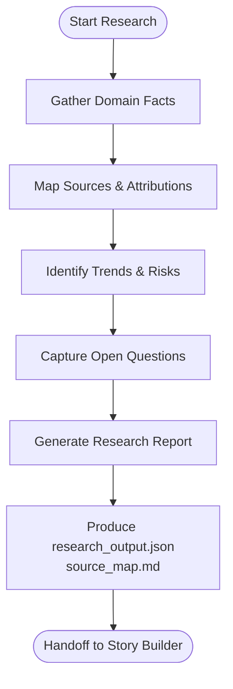
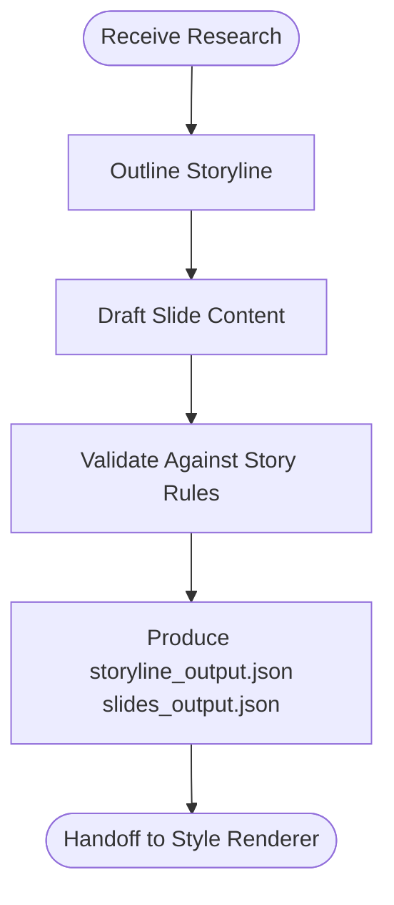
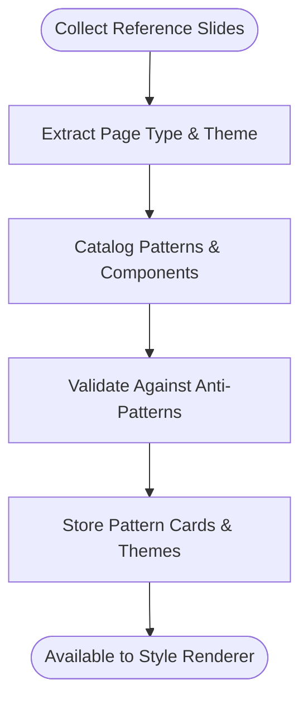
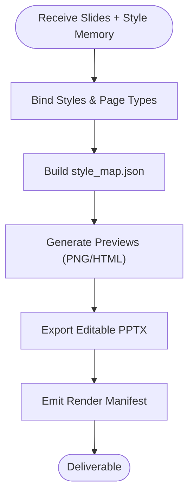
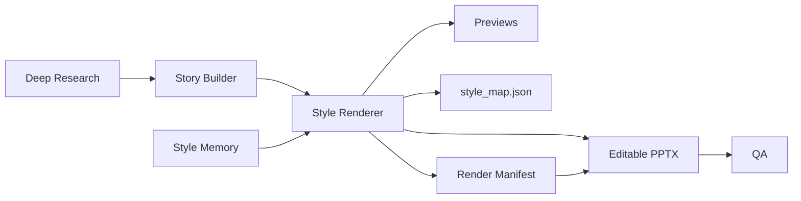

# Skills System

<cite>
**Referenced Files in This Document**
- [README.md](file://README.md)
- [skills/README.md](file://skills/README.md)
- [references/skill-split.md](file://references/skill-split.md)
- [references/style-intelligence.md](file://references/style-intelligence.md)
- [references/validated-slide-patterns.md](file://references/validated-slide-patterns.md)
- [schemas/research_output.schema.json](file://schemas/research_output.schema.json)
- [schemas/storyline_output.schema.json](file://schemas/storyline_output.schema.json)
- [schemas/slides_output.schema.json](file://schemas/slides_output.schema.json)
- [schemas/style_map.schema.json](file://schemas/style_map.schema.json)
- [schemas/render_manifest.schema.json](file://schemas/render_manifest.schema.json)
- [src/commands/buildStyleMap.ts](file://src/commands/buildStyleMap.ts)
- [src/commands/storyToSlides.ts](file://src/commands/storyToSlides.ts)
- [src/commands/renderPptx.ts](file://src/commands/renderPptx.ts)
- [src/commands/rerenderPages.ts](file://src/commands/rerenderPages.ts)
- [src/commands/inspectStyle.ts](file://src/commands/inspectStyle.ts)
- [src/commands/validateContracts.ts](file://src/commands/validateContracts.ts)
- [src/cli.ts](file://src/cli.ts)
- [docs/architecture/module-boundaries.md](file://docs/architecture/module-boundaries.md)
- [docs/workflows/fast-track-mvp.md](file://docs/workflows/fast-track-mvp.md)
- [docs/workflows/mvp-scope.md](file://docs/workflows/mvp-scope.md)
- [docs/workflows/reference-extraction-workflow.md](file://docs/workflows/reference-extraction-workflow.md)
- [qa/checklists/final-acceptance.md](file://qa/checklists/final-acceptance.md)
- [qa/reports/](file://qa/reports/)
- [qa/validators/](file://qa/validators/)
- [style/patterns/page-type-registry.json](file://style/patterns/page-type-registry.json)
- [style/patterns/template.pattern-card.json](file://style/patterns/template.pattern-card.json)
- [style/reference_extractions/benchmark-gallery.json](file://style/reference_extractions/benchmark-gallery.json)
- [style/reference_extractions/openclaw-executive--seed-01--cover-orbit.json](file://style/reference_extractions/openclaw-executive--seed-01--cover-orbit.json)
- [style/reference_extractions/openclaw-executive--seed-02--bottleneck-shift.json](file://style/reference_extractions/openclaw-executive--seed-02--bottleneck-shift.json)
- [style/reference_extractions/openclaw-executive--seed-03--chapter-summary-signal.json](file://style/reference_extractions/openclaw-executive--seed-03--chapter-summary-signal.json)
- [style/reference_extractions/template.reference-slide.json](file://style/reference_extractions/template.reference-slide.json)
- [style/themes/dark-enterprise-tech.theme.json](file://style/themes/dark-enterprise-tech.theme.json)
- [style/components/](file://style/components/)
- [style/lessons/](file://style/lessons/)
- [style/patterns/](file://style/patterns/)
- [style/reference_extractions/README.md](file://style/reference_extractions/README.md)
- [style/outputs/style_map.generated.json](file://style/outputs/style_map.generated.json)
- [research/inputs/](file://research/inputs/)
- [research/outputs/](file://research/outputs/)
- [research/templates/](file://research/templates/)
- [story/inputs/](file://story/inputs/)
- [story/outputs/](file://story/outputs/)
- [story/prompts/](file://story/prompts/)
- [story/rules/](file://story/rules/)
- [render/delivery/](file://render/delivery/)
- [render/preview/](file://render/preview/)
- [render/page_types/](file://render/page_types/)
- [render/pipeline/](file://render/pipeline/)
- [render/pptxgenjs_helpers/layout.js](file://render/pptxgenjs_helpers/layout.js)
- [render/pptxgenjs_helpers/util.js](file://render/pptxgenjs_helpers/util.js)
</cite>

## Table of Contents
1. [Introduction](#introduction)
2. [Project Structure](#project-structure)
3. [Core Components](#core-components)
4. [Architecture Overview](#architecture-overview)
5. [Detailed Component Analysis](#detailed-component-analysis)
6. [Dependency Analysis](#dependency-analysis)
7. [Performance Considerations](#performance-considerations)
8. [Troubleshooting Guide](#troubleshooting-guide)
9. [Conclusion](#conclusion)
10. [Appendices](#appendices)

## Introduction
This document describes the skills system for the Enterprise PPT System’s specialized capability modules. The system is organized around four core skills:
- Deep Research: Comprehensive data gathering and source mapping
- PPT Story Builder: Narrative construction and structured slide content
- PPT Style Memory: Design pattern recognition and reusable style assets
- PPT Style Renderer: Visual implementation and editable output

These skills are intentionally decoupled to maintain clear boundaries, reduce context complexity, and avoid mixing research logic with rendering logic. Outputs from each skill feed downstream modules, enabling iterative refinement, preview, and final editable delivery.

## Project Structure
The repository organizes capabilities by functional skill and integrates with research, story, style, render, and QA subsystems. Key directories and their roles:
- skills/: Four core skills and their boundary definitions
- research/: Inputs, outputs, and templates for research tasks
- story/: Inputs, outputs, prompts, and rules for story construction
- style/: Patterns, themes, components, and reference extractions forming style memory
- render/: Preview, delivery, page types, and rendering pipeline helpers
- schemas/: JSON Schema contracts for all major outputs
- src/commands/: CLI command implementations orchestrating skill workflows
- qa/: Checklists, validators, and reports for quality assurance
- docs/: Architectural decisions and workflows guiding MVP and beyond

**Diagram sources**
- [README.md:17-22](file://README.md#L17-L22)
- [skills/README.md:11-15](file://skills/README.md#L11-L15)
- [references/skill-split.md:3-41](file://references/skill-split.md#L3-L41)
- [docs/architecture/module-boundaries.md](file://docs/architecture/module-boundaries.md)

**Section sources**
- [README.md:17-38](file://README.md#L17-L38)
- [skills/README.md:1-16](file://skills/README.md#L1-L16)
- [references/skill-split.md:1-41](file://references/skill-split.md#L1-L41)

## Core Components
This section documents each skill’s purpose, outputs, and integration points.

- Deep Research
  - Purpose: Produce a factual base, source map, trend summary, risks, and open questions.
  - Outputs: research_output.json, source_map.md, and a research report.
  - Integration: Feeds research outputs consumed by the Story Builder.
  - Quality criteria: Completeness of sources, clarity of trends, and identification of risks and open questions.

- PPT Story Builder
  - Purpose: Transform research into a storyline and structured slide content.
  - Outputs: storyline_output.json and slides_output.json.
  - Integration: Storyline and slides are consumed by the Style Renderer.
  - Quality criteria: Logical narrative arc, coherent slide structure, and alignment with research.

- PPT Style Memory
  - Purpose: Collect and abstract visual patterns, themes, and components for reuse.
  - Outputs: pattern cards, theme tokens, and component definitions.
  - Integration: Provides style intelligence to the Style Renderer and informs pattern selection.
  - Quality criteria: Reusability, specificity to domains, and documented anti-patterns.

- PPT Style Renderer
  - Purpose: Choose page types, bind styles, generate previews, and produce editable PPTX.
  - Outputs: style_map.json, preview HTML/PNG, and editable PPTX.
  - Integration: Consumes story content and style memory; emits render manifests and deliverables.
  - Quality criteria: Visual coherence, adherence to page-type rules, and fidelity to themes/components.

**Section sources**
- [references/skill-split.md:3-41](file://references/skill-split.md#L3-L41)
- [skills/README.md:11-15](file://skills/README.md#L11-L15)
- [references/style-intelligence.md:1-93](file://references/style-intelligence.md#L1-L93)

## Architecture Overview
The skills system follows a staged pipeline:
1. Deep Research gathers and structures facts and sources.
2. Story Builder transforms structured facts into narrative and slide outlines.
3. Style Memory maintains reusable design assets and patterns.
4. Style Renderer binds story content to page types and styles, producing previews and editable output.

**Diagram sources**
- [references/skill-split.md:3-41](file://references/skill-split.md#L3-L41)
- [src/commands/](file://src/commands/)
- [schemas/](file://schemas/)

## Detailed Component Analysis

### Deep Research
- Responsibilities
  - Data gathering and verification
  - Source mapping and attribution
  - Trend analysis and risk identification
  - Open questions cataloging
- Outputs and Contracts
  - research_output.json: Structured research data
  - source_map.md: Source attribution and traceability
  - research report: Summarized insights
- Integration Patterns
  - Consumed by Story Builder to inform narrative and slide content
  - Validates against research_output.schema.json
- Practical Example
  - Use research templates to capture domain-specific facts, then produce research_output.json and source_map.md for story construction.

**Diagram sources**
- [references/skill-split.md:7-11](file://references/skill-split.md#L7-L11)
- [schemas/research_output.schema.json](file://schemas/research_output.schema.json)

**Section sources**
- [references/skill-split.md:3-11](file://references/skill-split.md#L3-L11)
- [schemas/research_output.schema.json](file://schemas/research_output.schema.json)

### PPT Story Builder
- Responsibilities
  - Convert research into a storyline
  - Structure slide content aligned with narrative
- Outputs and Contracts
  - storyline_output.json: Narrative blueprint
  - slides_output.json: Structured slide content
- Integration Patterns
  - Consumes research_output.json and source_map.md
  - Produces slides for Style Renderer
- Practical Example
  - Use story prompts and rules to draft storyline_output.json, then derive slides_output.json for rendering.

**Diagram sources**
- [references/skill-split.md:12-19](file://references/skill-split.md#L12-L19)
- [schemas/storyline_output.schema.json](file://schemas/storyline_output.schema.json)
- [schemas/slides_output.schema.json](file://schemas/slides_output.schema.json)

**Section sources**
- [references/skill-split.md:12-19](file://references/skill-split.md#L12-L19)
- [schemas/storyline_output.schema.json](file://schemas/storyline_output.schema.json)
- [schemas/slides_output.schema.json](file://schemas/slides_output.schema.json)

### PPT Style Memory
- Responsibilities
  - Maintain reference samples, patterns, themes, and components
  - Extract and document reusable design elements
- Outputs and Contracts
  - Pattern cards and page-type patterns
  - Theme tokens (colors, typography, spacing)
  - Component definitions (reusable UI primitives)
- Integration Patterns
  - Supplies style intelligence to Style Renderer
  - Supports pattern validation and anti-pattern avoidance
- Practical Example
  - Curate reference slides, extract page types and themes, and populate pattern cards for reuse.

**Diagram sources**
- [references/style-intelligence.md:9-44](file://references/style-intelligence.md#L9-L44)
- [references/validated-slide-patterns.md:7-345](file://references/validated-slide-patterns.md#L7-L345)

**Section sources**
- [references/style-intelligence.md:1-93](file://references/style-intelligence.md#L1-L93)
- [references/validated-slide-patterns.md:1-345](file://references/validated-slide-patterns.md#L1-L345)

### PPT Style Renderer
- Responsibilities
  - Choose page types and bind styles
  - Generate previews and editable PPTX
- Outputs and Contracts
  - style_map.json: Style bindings per slide
  - preview.png/html: Visual previews
  - editable.pptx: Final deliverable
- Integration Patterns
  - Consumes slides_output.json and style intelligence
  - Emits render_manifest.schema.json for delivery
- Practical Example
  - Build style_map.json from slides and patterns, render previews, then export editable PPTX.

**Diagram sources**
- [references/skill-split.md:20-28](file://references/skill-split.md#L20-L28)
- [schemas/style_map.schema.json](file://schemas/style_map.schema.json)
- [schemas/render_manifest.schema.json](file://schemas/render_manifest.schema.json)

**Section sources**
- [references/skill-split.md:20-28](file://references/skill-split.md#L20-L28)
- [schemas/style_map.schema.json](file://schemas/style_map.schema.json)
- [schemas/render_manifest.schema.json](file://schemas/render_manifest.schema.json)

## Dependency Analysis
The skills system enforces clear boundaries and data contracts. Dependencies flow as follows:
- Deep Research → Story Builder (via research_output.json and source_map.md)
- Story Builder → Style Renderer (via storyline_output.json and slides_output.json)
- Style Memory → Style Renderer (via patterns, themes, components)
- Style Renderer → Delivery (via style_map.json, previews, editable.pptx)
- QA validates deliverables produced by the Style Renderer

**Diagram sources**
- [skills/README.md:11-15](file://skills/README.md#L11-L15)
- [references/skill-split.md:3-41](file://references/skill-split.md#L3-L41)
- [schemas/](file://schemas/)

**Section sources**
- [skills/README.md:11-15](file://skills/README.md#L11-L15)
- [references/skill-split.md:38-41](file://references/skill-split.md#L38-L41)

## Performance Considerations
- Iterative Preview Pipeline
  - Use previews to catch style mismatches early, reducing rework in later stages.
- Contract Validation
  - Validate outputs against JSON Schemas to prevent downstream errors and reprocessing.
- Style Intelligence Reuse
  - Centralize pattern and theme catalogs to minimize redundant computation and improve consistency.
- Modular Rendering
  - Separate preview and delivery paths to optimize for speed during iteration and fidelity during export.

[No sources needed since this section provides general guidance]

## Troubleshooting Guide
Common issues and resolutions:
- Mismatched Outputs
  - Symptom: Style Renderer fails to bind styles
  - Action: Verify slides_output.json and style_map.schema.json match; confirm pattern IDs align with style memory.
- Missing References
  - Symptom: Lack of visual anchors or page-type choices
  - Action: Populate style patterns and themes; ensure pattern cards include anti-patterns and layout rules.
- QA Failures
  - Symptom: Deliverable rejected by QA
  - Action: Review final-acceptance checklist and validators; regenerate previews and PPTX after corrections.

**Section sources**
- [schemas/style_map.schema.json](file://schemas/style_map.schema.json)
- [schemas/render_manifest.schema.json](file://schemas/render_manifest.schema.json)
- [qa/checklists/final-acceptance.md](file://qa/checklists/final-acceptance.md)

## Conclusion
The skills system separates concerns across research, story, style memory, and rendering to enable scalable, high-quality presentation production. Clear outputs, contracts, and modular integrations support iterative refinement, robust QA, and extensible style intelligence.

[No sources needed since this section summarizes without analyzing specific files]

## Appendices

### Skill Specialization and Cross-Training
- Specialization
  - Deep Research: Fact gathering, source mapping, risk analysis
  - Story Builder: Narrative design, slide structuring
  - Style Memory: Pattern extraction, theme authoring, component cataloging
  - Style Renderer: Style binding, preview generation, editable output
- Cross-Training Opportunities
  - Researchers can learn story structuring and basic style patterns
  - Story builders can learn pattern recognition and theme application
  - Style engineers can learn research synthesis and QA validation
- Extensibility
  - New skills can be introduced by defining outputs, contracts, and integration points
  - Add new page types by extending the pattern registry and updating the renderer

**Section sources**
- [references/skill-split.md:38-41](file://references/skill-split.md#L38-L41)
- [style/patterns/page-type-registry.json](file://style/patterns/page-type-registry.json)

### Workflow Examples and Best Practices
- Research Workflow
  - Use research templates to gather domain facts, produce research_output.json and source_map.md, and validate against schema.
- Story Workflow
  - Draft storyline_output.json using prompts and rules, then derive slides_output.json for rendering.
- Style Memory Workflow
  - Curate reference slides, extract page types and themes, and document anti-patterns in pattern cards.
- Rendering Workflow
  - Build style_map.json, generate previews, and export editable PPTX; validate with render manifest.

**Section sources**
- [docs/workflows/reference-extraction-workflow.md](file://docs/workflows/reference-extraction-workflow.md)
- [docs/workflows/fast-track-mvp.md](file://docs/workflows/fast-track-mvp.md)
- [docs/workflows/mvp-scope.md](file://docs/workflows/mvp-scope.md)

### Command Integration and Tooling
Key CLI commands orchestrate the skills:
- buildStyleMap.ts: Builds style_map.json from slides and patterns
- storyToSlides.ts: Transforms storyline to slides
- renderPptx.ts: Renders editable PPTX
- rerenderPages.ts: Re-renders pages for updates
- inspectStyle.ts: Inspects style bindings
- validateContracts.ts: Validates schema contracts

**Section sources**
- [src/commands/buildStyleMap.ts](file://src/commands/buildStyleMap.ts)
- [src/commands/storyToSlides.ts](file://src/commands/storyToSlides.ts)
- [src/commands/renderPptx.ts](file://src/commands/renderPptx.ts)
- [src/commands/rerenderPages.ts](file://src/commands/rerenderPages.ts)
- [src/commands/inspectStyle.ts](file://src/commands/inspectStyle.ts)
- [src/commands/validateContracts.ts](file://src/commands/validateContracts.ts)
- [src/cli.ts](file://src/cli.ts)

### Quality Assessment Criteria
- Research
  - Completeness of sources, clarity of trends, identification of risks and open questions
- Story
  - Logical narrative arc, coherent slide structure, alignment with research
- Style Memory
  - Reusability, specificity to domains, documented anti-patterns
- Rendering
  - Visual coherence, adherence to page-type rules, fidelity to themes/components

**Section sources**
- [references/skill-split.md:3-41](file://references/skill-split.md#L3-L41)
- [references/style-intelligence.md:15-44](file://references/style-intelligence.md#L15-L44)