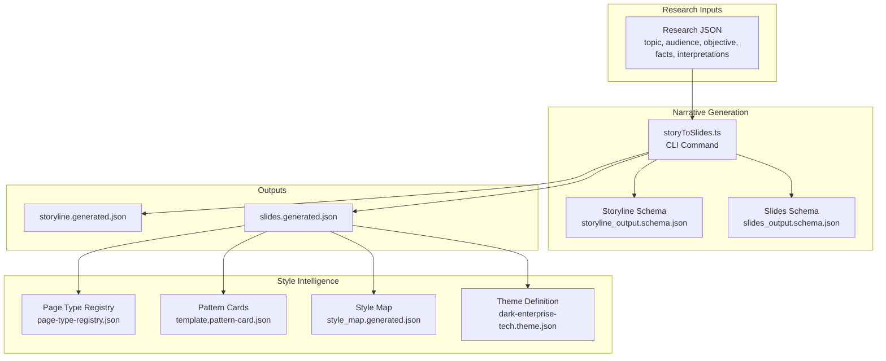
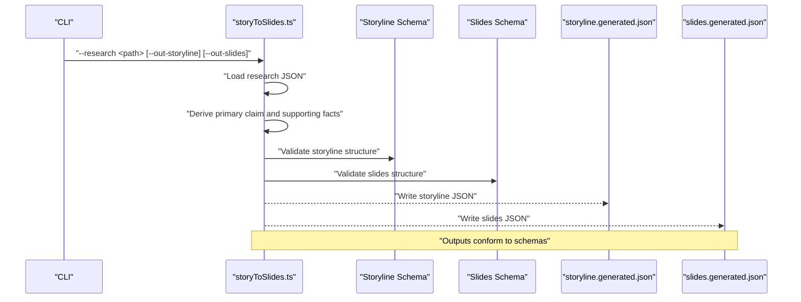
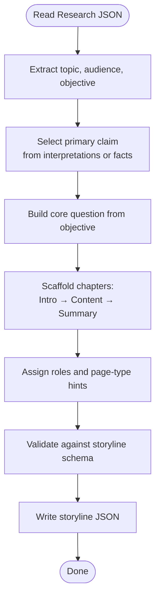
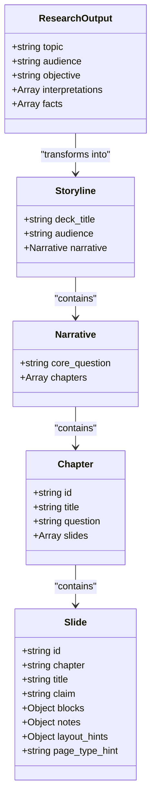
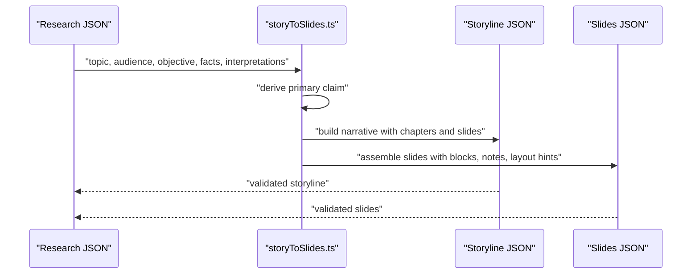
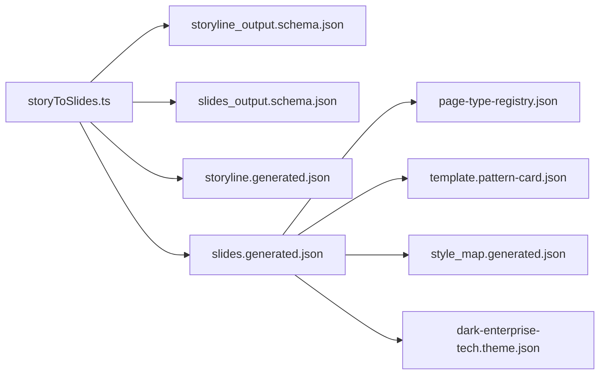

# Narrative Generation

<cite>
**Referenced Files in This Document**
- [storyToSlides.ts](file://src/commands/storyToSlides.ts)
- [storyline_output.schema.json](file://schemas/storyline_output.schema.json)
- [slides_output.schema.json](file://schemas/slides_output.schema.json)
- [storyline.generated.json](file://story/outputs/storyline.generated.json)
- [slides.generated.json](file://story/outputs/slides.generated.json)
- [svgPreview.ts](file://src/lib/render/svgPreview.ts)
- [style_map.generated.json](file://style/outputs/style_map.generated.json)
- [theme.dark-enterprise-tech.theme.json](file://style/themes/dark-enterprise-tech.theme.json)
- [pattern.template.pattern-card.json](file://style/patterns/template.pattern-card.json)
- [page-type-registry.json](file://style/patterns/page-type-registry.json)
- [validated-slide-patterns.md](file://references/validated-slide-patterns.md)
- [style-intelligence.md](file://references/style-intelligence.md)
- [quality-bar.md](file://references/quality-bar.md)
- [final-acceptance.md](file://qa/checklists/final-acceptance.md)
</cite>

## Table of Contents
1. [Introduction](#introduction)
2. [Project Structure](#project-structure)
3. [Core Components](#core-components)
4. [Architecture Overview](#architecture-overview)
5. [Detailed Component Analysis](#detailed-component-analysis)
6. [Dependency Analysis](#dependency-analysis)
7. [Performance Considerations](#performance-considerations)
8. [Troubleshooting Guide](#troubleshooting-guide)
9. [Conclusion](#conclusion)
10. [Appendices](#appendices)

## Introduction
This document describes the narrative generation subsystem that transforms research data into coherent, structured storylines and slide decks. It explains the storyline creation process, prompt engineering techniques embedded in the transformation logic, and content structuring algorithms. It documents how research data is mapped into story arcs, character/subject positioning, and thematic consistency, and how the system integrates with style intelligence to align narrative content with design. Practical examples of prompt templates, narrative flow patterns, and quality assurance checks are included, along with iterative refinement workflows and stakeholder feedback incorporation strategies.

## Project Structure
The narrative generation subsystem centers on a command that converts research JSON into a storyline and a set of slides. The resulting artifacts conform to JSON Schemas that define structure and validation. Style intelligence and page patterns inform visual rendering and layout hints.

**Diagram sources**
- [storyToSlides.ts:12-165](file://src/commands/storyToSlides.ts#L12-L165)
- [storyline_output.schema.json:1-49](file://schemas/storyline_output.schema.json#L1-L49)
- [slides_output.schema.json:1-53](file://schemas/slides_output.schema.json#L1-L53)
- [storyline.generated.json:1-49](file://story/outputs/storyline.generated.json#L1-L49)
- [slides.generated.json:1-97](file://story/outputs/slides.generated.json#L1-L97)
- [page-type-registry.json](file://style/patterns/page-type-registry.json)
- [pattern.template.pattern-card.json](file://style/patterns/template.pattern-card.json)
- [style_map.generated.json](file://style/outputs/style_map.generated.json)
- [theme.dark-enterprise-tech.theme.json](file://style/themes/dark-enterprise-tech.theme.json)

**Section sources**
- [storyToSlides.ts:12-165](file://src/commands/storyToSlides.ts#L12-L165)
- [storyline_output.schema.json:1-49](file://schemas/storyline_output.schema.json#L1-L49)
- [slides_output.schema.json:1-53](file://schemas/slides_output.schema.json#L1-L53)
- [storyline.generated.json:1-49](file://story/outputs/storyline.generated.json#L1-L49)
- [slides.generated.json:1-97](file://story/outputs/slides.generated.json#L1-L97)

## Core Components
- Storyline generator: A CLI command that reads research JSON and produces a structured narrative with chapters and slides, each carrying claims and roles.
- Slide assembler: Extends the storyline into slide records with content blocks, notes, and layout hints.
- Schemas: JSON Schemas that validate storyline and slide outputs, ensuring structural integrity and required fields.
- Style intelligence: Page type registry, pattern cards, style maps, and theme definitions that guide visual rendering and layout decisions aligned with narrative content.

Key responsibilities:
- Transform research statements into a narrative arc with a core question and chapter progression.
- Position subject claims as central to each slide while preserving thematic consistency.
- Provide layout hints and notes to guide visual design and audience tone.
- Integrate with style intelligence to select appropriate page types and patterns.

**Section sources**
- [storyToSlides.ts:12-165](file://src/commands/storyToSlides.ts#L12-L165)
- [storyline_output.schema.json:1-49](file://schemas/storyline_output.schema.json#L1-L49)
- [slides_output.schema.json:1-53](file://schemas/slides_output.schema.json#L1-L53)

## Architecture Overview
The narrative generation pipeline follows a deterministic transformation from research to story to slides, with validation and style alignment at each stage.

**Diagram sources**
- [storyToSlides.ts:12-165](file://src/commands/storyToSlides.ts#L12-L165)
- [storyline_output.schema.json:1-49](file://schemas/storyline_output.schema.json#L1-L49)
- [slides_output.schema.json:1-53](file://schemas/slides_output.schema.json#L1-L53)
- [storyline.generated.json:1-49](file://story/outputs/storyline.generated.json#L1-L49)
- [slides.generated.json:1-97](file://story/outputs/slides.generated.json#L1-L97)

## Detailed Component Analysis

### Storyline Creation Process
The command orchestrates a three-chapter narrative scaffold:
- Intro chapter: Establishes agenda and narrative staging.
- First content chapter: Presents the opening strategic claim derived from research.
- Summary chapter: Provides decision implications and a concise summary.

Processing logic:
- Reads research topic, audience, and objective.
- Selects a primary claim from interpretations or facts.
- Builds a core question from the research objective.
- Assigns roles and page-type hints to slides to guide subsequent rendering.

**Diagram sources**
- [storyToSlides.ts:21-72](file://src/commands/storyToSlides.ts#L21-L72)
- [storyline_output.schema.json:1-49](file://schemas/storyline_output.schema.json#L1-L49)

**Section sources**
- [storyToSlides.ts:21-72](file://src/commands/storyToSlides.ts#L21-L72)
- [storyline_output.schema.json:1-49](file://schemas/storyline_output.schema.json#L1-L49)

### Prompt Engineering Techniques in the Code
Prompt engineering is embedded in the transformation logic rather than external LLM prompts:
- Claim selection: Chooses the most relevant primary statement to anchor the narrative.
- Role assignment: Assigns slide roles (e.g., narrative staging, opening strategic claim, chapter summary) to maintain structural coherence.
- Page-type hints: Guides rendering by associating slides with specific page types (e.g., narrative_map, bottleneck_shift, chapter_summary_signal).

These techniques ensure that the generated content remains focused, consistent, and aligned with the intended narrative architecture.

**Section sources**
- [storyToSlides.ts:21-72](file://src/commands/storyToSlides.ts#L21-L72)

### Content Structuring Algorithms
The algorithm applies a fixed, repeatable structure to transform unstructured research into structured narrative and slide content:
- Chapter sequencing: Intro → Content → Summary.
- Slide anchoring: Each slide carries a single claim that supports the chapter’s question.
- Block composition: Slides include content blocks (e.g., primary statements, support points, summaries) and optional notes and layout hints.

**Diagram sources**
- [storyToSlides.ts:4-10](file://src/commands/storyToSlides.ts#L4-L10)
- [storyline_output.schema.json:11-46](file://schemas/storyline_output.schema.json#L11-L46)
- [slides_output.schema.json:11-49](file://schemas/slides_output.schema.json#L11-L49)

**Section sources**
- [storyToSlides.ts:4-10](file://src/commands/storyToSlides.ts#L4-L10)
- [storyline_output.schema.json:11-46](file://schemas/storyline_output.schema.json#L11-L46)
- [slides_output.schema.json:11-49](file://schemas/slides_output.schema.json#L11-L49)

### Research Data to Coherent Narrative Transformation
Transformation steps:
- Research ingestion: Loads topic, audience, objective, and arrays of statements.
- Primary claim derivation: Uses the first interpretation or fact as the central claim; falls back to defaults if missing.
- Chapter construction: Creates a staged intro, a content chapter anchored by the primary claim, and a summary chapter.
- Slide assembly: Populates slide metadata (id, chapter, title, claim) and adds blocks, notes, and layout hints.

**Diagram sources**
- [storyToSlides.ts:21-159](file://src/commands/storyToSlides.ts#L21-L159)
- [storyline_output.schema.json:1-49](file://schemas/storyline_output.schema.json#L1-L49)
- [slides_output.schema.json:1-53](file://schemas/slides_output.schema.json#L1-L53)

**Section sources**
- [storyToSlides.ts:21-159](file://src/commands/storyToSlides.ts#L21-L159)

### Story Arc Development and Character/Subject Positioning
- Story arc: Fixed triadic structure (staging → framing → decision) ensures a clear progression for executive audiences.
- Subject positioning: The primary claim anchors each chapter; slides restate and support the claim, keeping the subject front-and-center.
- Thematic consistency: The core question and page-type hints reinforce consistent messaging across slides.

**Section sources**
- [storyToSlides.ts:30-72](file://src/commands/storyToSlides.ts#L30-L72)
- [storyline_output.schema.json:16-44](file://schemas/storyline_output.schema.json#L16-L44)

### Thematic Consistency Maintenance
- Core question: Derived from the research objective, it frames each chapter’s focus.
- Page-type hints: Guide consistent visual treatment across slides.
- Notes and layout hints: Reinforce emphasis and positioning for the target audience.

**Section sources**
- [storyToSlides.ts:30-72](file://src/commands/storyToSlides.ts#L30-L72)
- [slides_output.schema.json:27-47](file://schemas/slides_output.schema.json#L27-L47)

### Practical Examples of Prompt Templates and Patterns
While the system does not rely on external LLM prompts, the transformation logic embodies reusable patterns:
- Primary claim template: Use the first interpretation or fact as the central claim.
- Chapter progression template: Intro → Content → Summary.
- Slide block template: Primary statement + support points + decision cue/summary.

These patterns ensure predictable, repeatable outputs suitable for iterative refinement and stakeholder review.

**Section sources**
- [storyToSlides.ts:21-72](file://src/commands/storyToSlides.ts#L21-L72)

### Quality Assurance Checks
Validation and QA:
- Structural validation: Storyline and slides are validated against JSON Schemas to ensure required fields and types.
- Acceptance criteria: Final acceptance checklist references quality bar standards for narrative coherence and design alignment.
- Iterative refinement: Outputs are designed to be editable and revisited during review cycles.

**Section sources**
- [storyline_output.schema.json:1-49](file://schemas/storyline_output.schema.json#L1-L49)
- [slides_output.schema.json:1-53](file://schemas/slides_output.schema.json#L1-L53)
- [quality-bar.md](file://references/quality-bar.md)
- [final-acceptance.md](file://qa/checklists/final-acceptance.md)

### Integration with Style Intelligence for Narrative-to-Design Alignment
Style intelligence informs visual rendering and layout:
- Page type registry: Defines page types used by slides (e.g., narrative_map, bottleneck_shift, chapter_summary_signal).
- Pattern cards: Provide reusable slide layouts and content structures.
- Style map and theme: Supply color palettes, typography, and visual anchors to reinforce narrative emphasis.

Rendering example:
- The narrative map slide uses layout hints and blocks to present dominant and supporting chapters with visual hierarchy.

**Section sources**
- [page-type-registry.json](file://style/patterns/page-type-registry.json)
- [pattern.template.pattern-card.json](file://style/patterns/template.pattern-card.json)
- [style_map.generated.json](file://style/outputs/style_map.generated.json)
- [theme.dark-enterprise-tech.theme.json](file://style/themes/dark-enterprise-tech.theme.json)
- [svgPreview.ts:149-170](file://src/lib/render/svgPreview.ts#L149-L170)

### Iterative Refinement Workflows and Stakeholder Feedback Incorporation
Workflow outline:
- Initial generation: Produce storyline and slides via the CLI command.
- Review: Stakeholders assess narrative coherence and design fit.
- Edit: Iterate on claims, blocks, notes, and layout hints.
- Re-validate: Confirm outputs remain valid against schemas.
- Re-render: Apply style intelligence to reflect updates.

This cycle ensures continuous improvement while maintaining structural integrity.

**Section sources**
- [storyToSlides.ts:161-165](file://src/commands/storyToSlides.ts#L161-L165)
- [storyline_output.schema.json:1-49](file://schemas/storyline_output.schema.json#L1-L49)
- [slides_output.schema.json:1-53](file://schemas/slides_output.schema.json#L1-L53)

### Best Practices for Maintaining Narrative Coherence Across Multiple Presentation Components
- Centralize the core question and primary claim to anchor all slides.
- Use page-type hints consistently to preserve visual and structural continuity.
- Keep notes and layout hints aligned with the intended audience tone and emphasis.
- Validate outputs against schemas after each iteration to prevent drift.
- Reference validated slide patterns and style intelligence to maintain brand and design consistency.

**Section sources**
- [validated-slide-patterns.md](file://references/validated-slide-patterns.md)
- [style-intelligence.md](file://references/style-intelligence.md)
- [slides_output.schema.json:27-47](file://schemas/slides_output.schema.json#L27-L47)

## Dependency Analysis
The narrative generation subsystem depends on schemas for validation and style intelligence for rendering. The CLI command is the central coordinator.

**Diagram sources**
- [storyToSlides.ts:12-165](file://src/commands/storyToSlides.ts#L12-L165)
- [storyline_output.schema.json:1-49](file://schemas/storyline_output.schema.json#L1-L49)
- [slides_output.schema.json:1-53](file://schemas/slides_output.schema.json#L1-L53)
- [storyline.generated.json:1-49](file://story/outputs/storyline.generated.json#L1-L49)
- [slides.generated.json:1-97](file://story/outputs/slides.generated.json#L1-L97)
- [page-type-registry.json](file://style/patterns/page-type-registry.json)
- [pattern.template.pattern-card.json](file://style/patterns/template.pattern-card.json)
- [style_map.generated.json](file://style/outputs/style_map.generated.json)
- [theme.dark-enterprise-tech.theme.json](file://style/themes/dark-enterprise-tech.theme.json)

**Section sources**
- [storyToSlides.ts:12-165](file://src/commands/storyToSlides.ts#L12-L165)
- [storyline_output.schema.json:1-49](file://schemas/storyline_output.schema.json#L1-L49)
- [slides_output.schema.json:1-53](file://schemas/slides_output.schema.json#L1-L53)

## Performance Considerations
- Deterministic transformations: The pipeline avoids expensive operations, relying on simple data mapping and schema validation.
- Validation cost: Running JSON Schema validation is lightweight compared to generation.
- Scalability: To scale, consider batching research inputs and parallelizing validation per output artifact.

## Troubleshooting Guide
Common issues and resolutions:
- Missing research fields: Ensure topic, audience, objective, and at least one fact or interpretation are present.
- Schema violations: Validate outputs against the storyline and slides schemas; correct missing or mis-typed fields.
- Rendering mismatches: Confirm page-type hints match entries in the page type registry and that pattern cards are available.
- Style inconsistencies: Verify the style map and theme definitions align with the intended design language.

**Section sources**
- [storyline_output.schema.json:1-49](file://schemas/storyline_output.schema.json#L1-L49)
- [slides_output.schema.json:1-53](file://schemas/slides_output.schema.json#L1-L53)
- [page-type-registry.json](file://style/patterns/page-type-registry.json)
- [pattern.template.pattern-card.json](file://style/patterns/template.pattern-card.json)
- [style_map.generated.json](file://style/outputs/style_map.generated.json)
- [theme.dark-enterprise-tech.theme.json](file://style/themes/dark-enterprise-tech.theme.json)

## Conclusion
The narrative generation subsystem provides a robust, schema-driven mechanism to convert research into structured storylines and slides. By anchoring content with primary claims, enforcing consistent chapter progression, and integrating with style intelligence, it maintains thematic coherence across multiple presentation components. The deterministic transformation, combined with validation and iterative refinement workflows, enables reliable delivery for enterprise stakeholders.

## Appendices
- Example outputs for reference:
  - [storyline.generated.json:1-49](file://story/outputs/storyline.generated.json#L1-L49)
  - [slides.generated.json:1-97](file://story/outputs/slides.generated.json#L1-L97)
- Schemas for validation:
  - [storyline_output.schema.json:1-49](file://schemas/storyline_output.schema.json#L1-L49)
  - [slides_output.schema.json:1-53](file://schemas/slides_output.schema.json#L1-L53)
- Style and rendering references:
  - [style_map.generated.json](file://style/outputs/style_map.generated.json)
  - [theme.dark-enterprise-tech.theme.json](file://style/themes/dark-enterprise-tech.theme.json)
  - [page-type-registry.json](file://style/patterns/page-type-registry.json)
  - [pattern.template.pattern-card.json](file://style/patterns/template.pattern-card.json)
  - [validated-slide-patterns.md](file://references/validated-slide-patterns.md)
  - [style-intelligence.md](file://references/style-intelligence.md)
  - [quality-bar.md](file://references/quality-bar.md)
  - [final-acceptance.md](file://qa/checklists/final-acceptance.md)