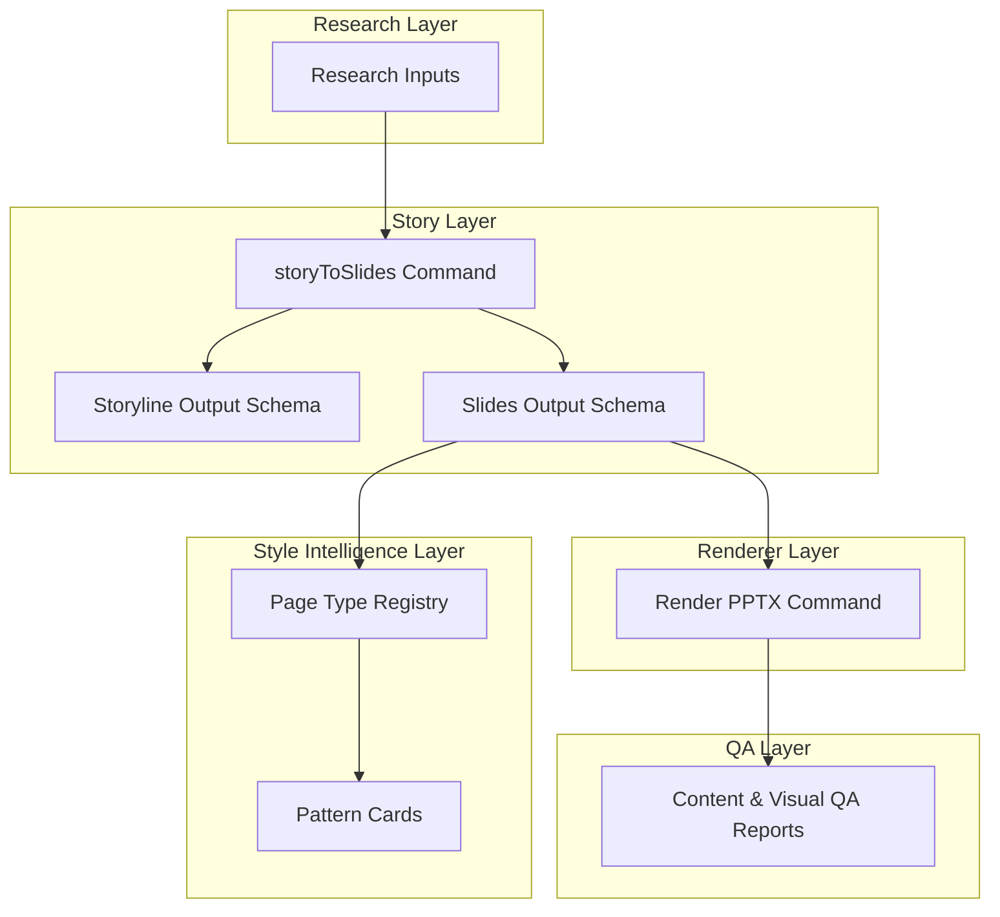
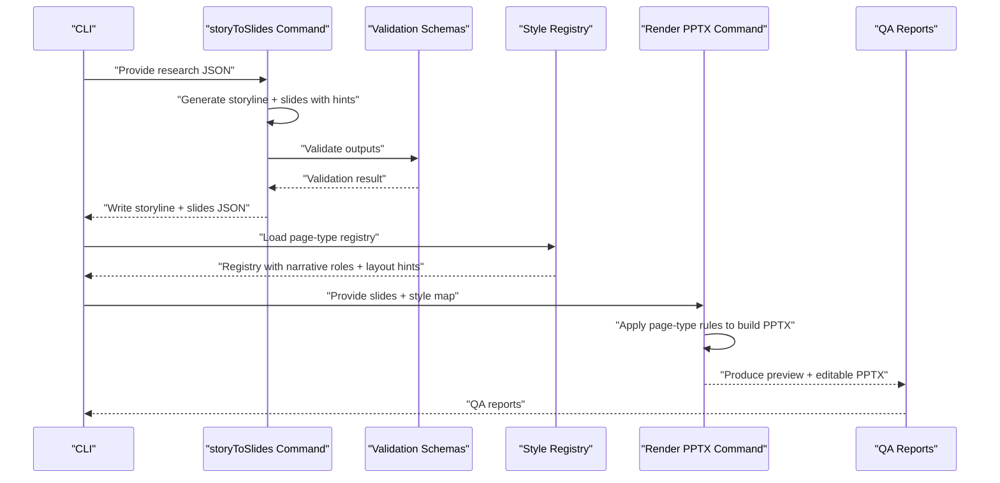
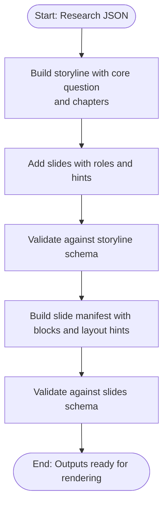
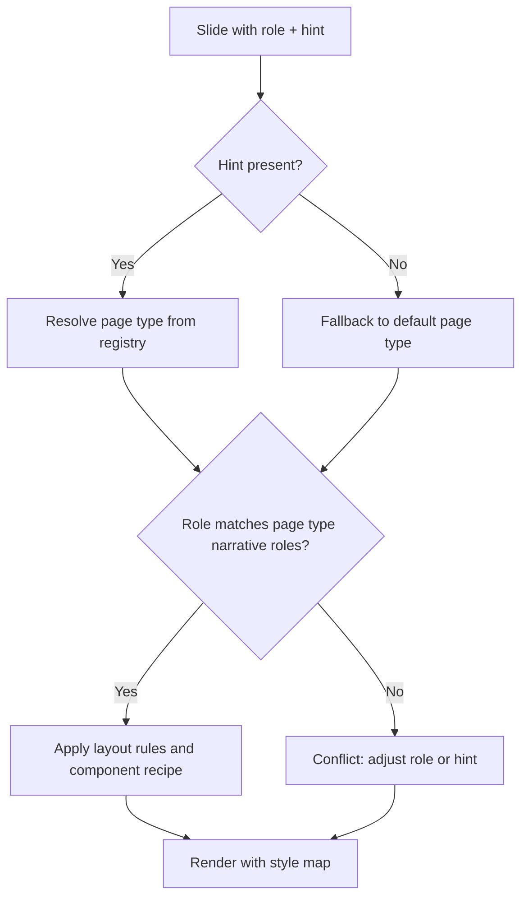
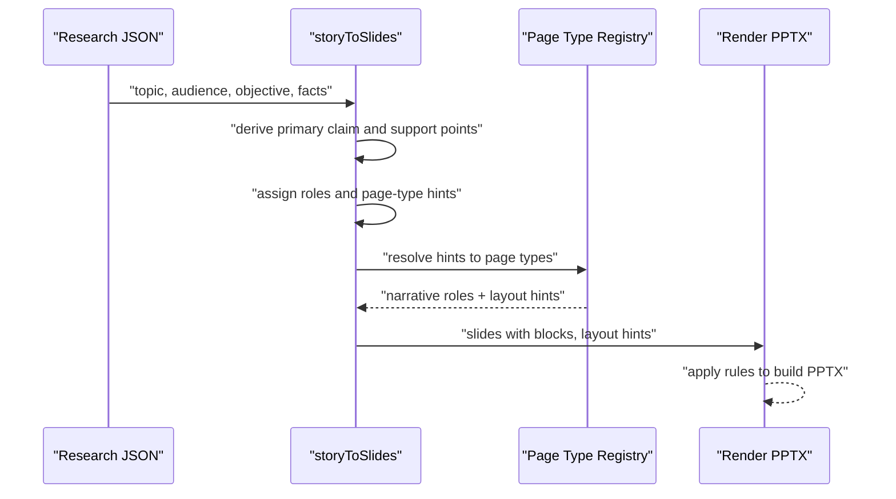
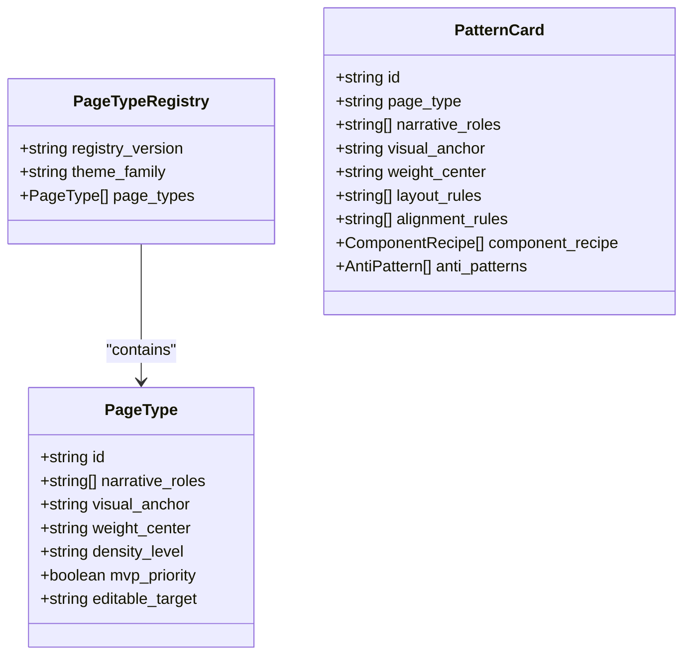
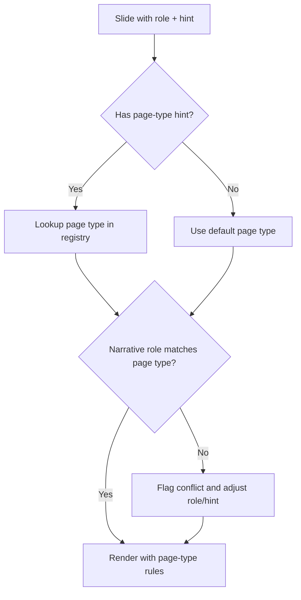
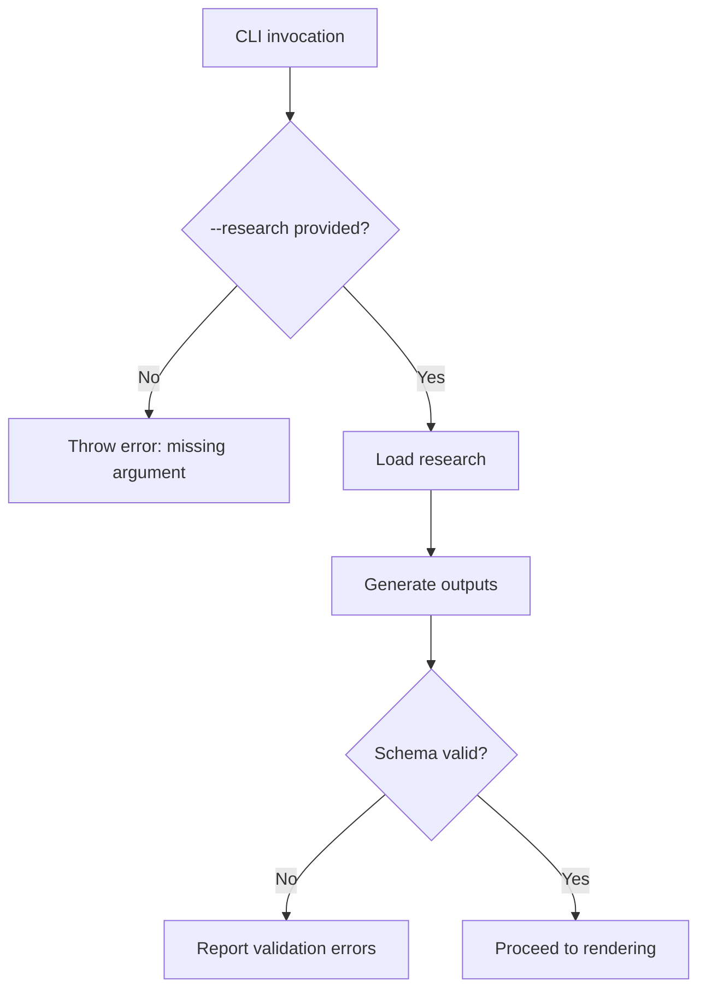
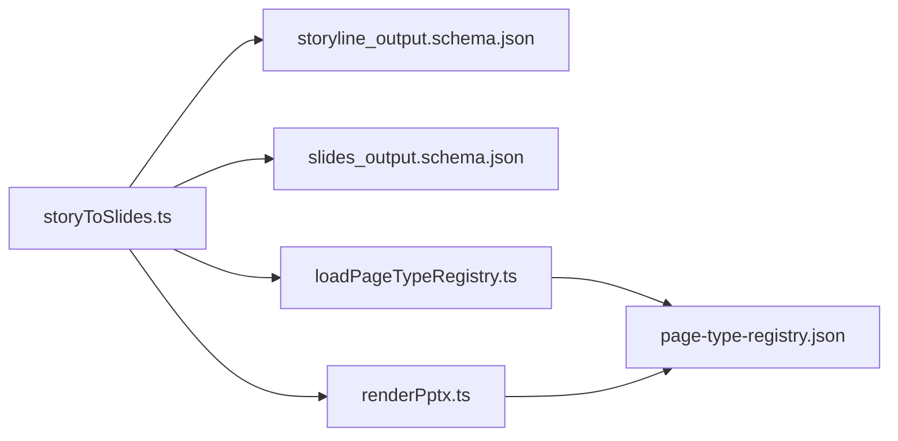

# Rule-Based Story Construction

<cite>
**Referenced Files in This Document**
- [01-system-architecture.md](file://01-system-architecture.md)
- [02-design-principles.md](file://02-design-principles.md)
- [03-operating-workflow.md](file://03-operating-workflow.md)
- [04-editable-output-strategy.md](file://04-editable-output-strategy.md)
- [README.md](file://README.md)
- [storyToSlides.ts](file://src/commands/storyToSlides.ts)
- [loadPageTypeRegistry.ts](file://src/lib/style/loadPageTypeRegistry.ts)
- [page-type-registry.json](file://style/patterns/page-type-registry.json)
- [template.pattern-card.json](file://style/patterns/template.pattern-card.json)
- [storyline_output.schema.json](file://schemas/storyline_output.schema.json)
- [slides_output.schema.json](file://schemas/slides_output.schema.json)
- [renderPptx.ts](file://src/commands/renderPptx.ts)
</cite>

## Table of Contents
1. [Introduction](#introduction)
2. [Project Structure](#project-structure)
3. [Core Components](#core-components)
4. [Architecture Overview](#architecture-overview)
5. [Detailed Component Analysis](#detailed-component-analysis)
6. [Dependency Analysis](#dependency-analysis)
7. [Performance Considerations](#performance-considerations)
8. [Troubleshooting Guide](#troubleshooting-guide)
9. [Conclusion](#conclusion)
10. [Appendices](#appendices)

## Introduction
This document describes a rule-based story construction system designed to automate narrative structuring and slide generation for enterprise presentations. It explains how automated content structuring rules, constraint satisfaction, and logic-driven generation work together to produce coherent storylines and structured slide decks. It documents rule definition formats, conditional logic implementation, exception handling, validation rules, conflict resolution, maintenance workflows, version control, integration with manual authoring, best practices, testing methodologies, and performance optimization for large-scale content generation.

## Project Structure
The repository is organized into layers and modules that separate judgment (research, story, style) from execution (rendering, QA). The story construction capability centers on:
- Story command that transforms research into a structured storyline and slide manifest
- Style intelligence that binds narrative roles to page types and enforces layout and visual rules
- Schemas that validate story and slide outputs
- Render command that applies page-type-specific rules to produce editable PPTX

**Diagram sources**
- [01-system-architecture.md:1-106](file://01-system-architecture.md#L1-L106)
- [storyToSlides.ts:1-166](file://src/commands/storyToSlides.ts#L1-L166)
- [loadPageTypeRegistry.ts:1-20](file://src/lib/style/loadPageTypeRegistry.ts#L1-L20)
- [page-type-registry.json:1-115](file://style/patterns/page-type-registry.json#L1-L115)
- [template.pattern-card.json:1-46](file://style/patterns/template.pattern-card.json#L1-L46)
- [storyline_output.schema.json:1-49](file://schemas/storyline_output.schema.json#L1-L49)
- [slides_output.schema.json:1-53](file://schemas/slides_output.schema.json#L1-L53)
- [renderPptx.ts:652-695](file://src/commands/renderPptx.ts#L652-L695)

**Section sources**
- [01-system-architecture.md:1-106](file://01-system-architecture.md#L1-L106)
- [README.md:1-38](file://README.md#L1-L38)

## Core Components
- Story command: Transforms research into a structured storyline and a slide manifest, embedding page-type hints and narrative roles.
- Style registry: Defines page types with narrative roles, visual anchors, layout weights, density levels, and editable targets.
- Pattern cards: Encode layout rules, alignment rules, component recipes, and anti-patterns for each page type.
- Output schemas: Enforce structural constraints on storyline and slide manifests.
- Render command: Applies page-type-specific rules to generate editable PPTX.

Key implementation references:
- Story generation and hints: [storyToSlides.ts:26-73](file://src/commands/storyToSlides.ts#L26-L73), [storyToSlides.ts:75-159](file://src/commands/storyToSlides.ts#L75-L159)
- Page type registry: [loadPageTypeRegistry.ts:1-20](file://src/lib/style/loadPageTypeRegistry.ts#L1-L20), [page-type-registry.json:1-115](file://style/patterns/page-type-registry.json#L1-L115)
- Pattern card rules: [template.pattern-card.json:1-46](file://style/patterns/template.pattern-card.json#L1-L46)
- Validation schemas: [storyline_output.schema.json:1-49](file://schemas/storyline_output.schema.json#L1-L49), [slides_output.schema.json:1-53](file://schemas/slides_output.schema.json#L1-L53)
- Render-time rule application: [renderPptx.ts:652-695](file://src/commands/renderPptx.ts#L652-L695)

**Section sources**
- [storyToSlides.ts:1-166](file://src/commands/storyToSlides.ts#L1-L166)
- [loadPageTypeRegistry.ts:1-20](file://src/lib/style/loadPageTypeRegistry.ts#L1-L20)
- [page-type-registry.json:1-115](file://style/patterns/page-type-registry.json#L1-L115)
- [template.pattern-card.json:1-46](file://style/patterns/template.pattern-card.json#L1-L46)
- [storyline_output.schema.json:1-49](file://schemas/storyline_output.schema.json#L1-L49)
- [slides_output.schema.json:1-53](file://schemas/slides_output.schema.json#L1-L53)
- [renderPptx.ts:652-695](file://src/commands/renderPptx.ts#L652-L695)

## Architecture Overview
The system separates judgment from execution. Judgment components (research, story, style) produce canonical, schema-validated outputs. Execution components (rendering, QA) consume these outputs deterministically.

**Diagram sources**
- [01-system-architecture.md:1-106](file://01-system-architecture.md#L1-L106)
- [storyToSlides.ts:1-166](file://src/commands/storyToSlides.ts#L1-L166)
- [storyline_output.schema.json:1-49](file://schemas/storyline_output.schema.json#L1-L49)
- [slides_output.schema.json:1-53](file://schemas/slides_output.schema.json#L1-L53)
- [loadPageTypeRegistry.ts:1-20](file://src/lib/style/loadPageTypeRegistry.ts#L1-L20)
- [page-type-registry.json:1-115](file://style/patterns/page-type-registry.json#L1-L115)
- [renderPptx.ts:652-695](file://src/commands/renderPptx.ts#L652-L695)

## Detailed Component Analysis

### Automated Content Structuring Rules
Automated structuring embeds narrative roles and page-type hints into the slide manifest. The story command constructs:
- A storyline with chapters and slides, each carrying a role and optional page-type hint
- A slide manifest with per-slide claims, titles, blocks, and layout hints

**Diagram sources**
- [storyToSlides.ts:26-73](file://src/commands/storyToSlides.ts#L26-L73)
- [storyToSlides.ts:75-159](file://src/commands/storyToSlides.ts#L75-L159)
- [storyline_output.schema.json:1-49](file://schemas/storyline_output.schema.json#L1-L49)
- [slides_output.schema.json:1-53](file://schemas/slides_output.schema.json#L1-L53)

**Section sources**
- [storyToSlides.ts:26-73](file://src/commands/storyToSlides.ts#L26-L73)
- [storyToSlides.ts:75-159](file://src/commands/storyToSlides.ts#L75-L159)
- [storyline_output.schema.json:1-49](file://schemas/storyline_output.schema.json#L1-L49)
- [slides_output.schema.json:1-53](file://schemas/slides_output.schema.json#L1-L53)

### Constraint Satisfaction and Conditional Logic
Constraint satisfaction occurs through:
- Schema validation ensuring required fields and types
- Registry lookup to match narrative roles to page types
- Conditional application of page-type rules during rendering

**Diagram sources**
- [loadPageTypeRegistry.ts:1-20](file://src/lib/style/loadPageTypeRegistry.ts#L1-L20)
- [page-type-registry.json:1-115](file://style/patterns/page-type-registry.json#L1-L115)
- [template.pattern-card.json:1-46](file://style/patterns/template.pattern-card.json#L1-L46)
- [renderPptx.ts:652-695](file://src/commands/renderPptx.ts#L652-L695)

**Section sources**
- [loadPageTypeRegistry.ts:1-20](file://src/lib/style/loadPageTypeRegistry.ts#L1-L20)
- [page-type-registry.json:1-115](file://style/patterns/page-type-registry.json#L1-L115)
- [template.pattern-card.json:1-46](file://style/patterns/template.pattern-card.json#L1-L46)
- [renderPptx.ts:652-695](file://src/commands/renderPptx.ts#L652-L695)

### Logic-Driven Narrative Generation
Narrative generation follows a deterministic pipeline:
- Core question derived from research objective
- Chapter progression guided by narrative roles
- Slide claims grounded in research statements
- Layout hints and page-type hints guiding visual binding

**Diagram sources**
- [storyToSlides.ts:4-10](file://src/commands/storyToSlides.ts#L4-L10)
- [storyToSlides.ts:21-73](file://src/commands/storyToSlides.ts#L21-L73)
- [loadPageTypeRegistry.ts:1-20](file://src/lib/style/loadPageTypeRegistry.ts#L1-L20)
- [page-type-registry.json:1-115](file://style/patterns/page-type-registry.json#L1-L115)
- [renderPptx.ts:652-695](file://src/commands/renderPptx.ts#L652-L695)

**Section sources**
- [storyToSlides.ts:4-10](file://src/commands/storyToSlides.ts#L4-L10)
- [storyToSlides.ts:21-73](file://src/commands/storyToSlides.ts#L21-L73)
- [loadPageTypeRegistry.ts:1-20](file://src/lib/style/loadPageTypeRegistry.ts#L1-L20)
- [page-type-registry.json:1-115](file://style/patterns/page-type-registry.json#L1-L115)
- [renderPptx.ts:652-695](file://src/commands/renderPptx.ts#L652-L695)

### Rule Definition Formats
Rules are encoded in two forms:
- Page type registry: maps page type IDs to narrative roles, visual anchors, layout weights, density levels, and editable targets
- Pattern cards: define layout rules, alignment rules, component recipes, highlight grammar, and anti-patterns for each page type

**Diagram sources**
- [loadPageTypeRegistry.ts:4-16](file://src/lib/style/loadPageTypeRegistry.ts#L4-L16)
- [page-type-registry.json:1-115](file://style/patterns/page-type-registry.json#L1-L115)
- [template.pattern-card.json:1-46](file://style/patterns/template.pattern-card.json#L1-L46)

**Section sources**
- [loadPageTypeRegistry.ts:1-20](file://src/lib/style/loadPageTypeRegistry.ts#L1-L20)
- [page-type-registry.json:1-115](file://style/patterns/page-type-registry.json#L1-L115)
- [template.pattern-card.json:1-46](file://style/patterns/template.pattern-card.json#L1-L46)

### Conditional Logic Implementation
Conditional logic is implemented as:
- Role-to-page-type matching via registry lookup
- Hint-based selection with fallback defaults
- Conflict detection when roles do not align with page type capabilities
- Rendering-time enforcement of layout and alignment rules

**Diagram sources**
- [loadPageTypeRegistry.ts:1-20](file://src/lib/style/loadPageTypeRegistry.ts#L1-L20)
- [page-type-registry.json:1-115](file://style/patterns/page-type-registry.json#L1-L115)
- [template.pattern-card.json:1-46](file://style/patterns/template.pattern-card.json#L1-L46)
- [renderPptx.ts:652-695](file://src/commands/renderPptx.ts#L652-L695)

**Section sources**
- [loadPageTypeRegistry.ts:1-20](file://src/lib/style/loadPageTypeRegistry.ts#L1-L20)
- [page-type-registry.json:1-115](file://style/patterns/page-type-registry.json#L1-L115)
- [template.pattern-card.json:1-46](file://style/patterns/template.pattern-card.json#L1-L46)
- [renderPptx.ts:652-695](file://src/commands/renderPptx.ts#L652-L695)

### Exception Handling Mechanisms
Exceptions arise from:
- Missing required arguments in CLI invocation
- Schema violations in generated outputs
- Role-page-type mismatches
- Missing or invalid page-type hints

Mitigations:
- Early validation with descriptive errors
- Fallback defaults for missing hints
- Conflict logging and remediation suggestions

**Diagram sources**
- [storyToSlides.ts:12-21](file://src/commands/storyToSlides.ts#L12-L21)
- [storyline_output.schema.json:1-49](file://schemas/storyline_output.schema.json#L1-L49)
- [slides_output.schema.json:1-53](file://schemas/slides_output.schema.json#L1-L53)

**Section sources**
- [storyToSlides.ts:12-21](file://src/commands/storyToSlides.ts#L12-L21)
- [storyline_output.schema.json:1-49](file://schemas/storyline_output.schema.json#L1-L49)
- [slides_output.schema.json:1-53](file://schemas/slides_output.schema.json#L1-L53)

### Examples of Rule Patterns for Different Presentation Types
- Cover orbit: emphasizes a strong visual anchor and right-weighted composition
- Bottleneck shift: positions the primary statement on the left with medium density
- Chapter summary signal: low-density, left-weighted layout to spotlight decision implications
- Narrative map: center-middle weight with medium density for agenda and framing

These patterns are defined in the registry and pattern cards and enforced during rendering.

**Section sources**
- [page-type-registry.json:1-115](file://style/patterns/page-type-registry.json#L1-L115)
- [template.pattern-card.json:1-46](file://style/patterns/template.pattern-card.json#L1-L46)
- [renderPptx.ts:652-695](file://src/commands/renderPptx.ts#L652-L695)

### Automated Content Validation Rules
Validation ensures:
- Required fields are present and non-empty
- Structural arrays meet minimum item counts
- Nested objects conform to required property sets
- Optional hints remain consistent with schema expectations

Validation is applied to both storyline and slide outputs prior to rendering.

**Section sources**
- [storyline_output.schema.json:1-49](file://schemas/storyline_output.schema.json#L1-L49)
- [slides_output.schema.json:1-53](file://schemas/slides_output.schema.json#L1-L53)

### Conflict Resolution Procedures
Conflicts occur when:
- A slide’s narrative role does not match the selected page type
- A page-type hint is missing or invalid

Resolution steps:
- Log mismatch details
- Adjust role or hint to align with registry-defined capabilities
- Re-run validation and rendering

**Section sources**
- [loadPageTypeRegistry.ts:1-20](file://src/lib/style/loadPageTypeRegistry.ts#L1-L20)
- [page-type-registry.json:1-115](file://style/patterns/page-type-registry.json#L1-L115)
- [template.pattern-card.json:1-46](file://style/patterns/template.pattern-card.json#L1-L46)

### Rule Maintenance Workflows and Version Control
Maintenance workflows:
- Update page-type registry entries to reflect new page types or changes in capabilities
- Revise pattern cards to refine layout rules and anti-patterns
- Version registry_version to track breaking changes
- Keep schemas synchronized with output structures

Version control:
- Track changes to registry and pattern cards in version control
- Use semantic versioning for registry_version
- Maintain backward-compatible schemas when possible

**Section sources**
- [page-type-registry.json:1-3](file://style/patterns/page-type-registry.json#L1-L3)
- [template.pattern-card.json:1-46](file://style/patterns/template.pattern-card.json#L1-L46)

### Integration with Manual Authoring Processes
Manual authoring integration:
- Authors can override page-type hints and layout hints
- Notes and layout hints enable targeted adjustments
- Editable PPTX output supports iterative refinement

**Section sources**
- [storyToSlides.ts:75-159](file://src/commands/storyToSlides.ts#L75-L159)
- [04-editable-output-strategy.md](file://04-editable-output-strategy.md)

## Dependency Analysis
The story construction system exhibits clear layering and minimal coupling:
- Story command depends on research inputs and produces validated outputs
- Style registry decouples page-type semantics from rendering
- Render command consumes validated slide manifests and applies page-type rules

**Diagram sources**
- [storyToSlides.ts:1-166](file://src/commands/storyToSlides.ts#L1-L166)
- [storyline_output.schema.json:1-49](file://schemas/storyline_output.schema.json#L1-L49)
- [slides_output.schema.json:1-53](file://schemas/slides_output.schema.json#L1-L53)
- [loadPageTypeRegistry.ts:1-20](file://src/lib/style/loadPageTypeRegistry.ts#L1-L20)
- [page-type-registry.json:1-115](file://style/patterns/page-type-registry.json#L1-L115)
- [renderPptx.ts:652-695](file://src/commands/renderPptx.ts#L652-L695)

**Section sources**
- [storyToSlides.ts:1-166](file://src/commands/storyToSlides.ts#L1-L166)
- [loadPageTypeRegistry.ts:1-20](file://src/lib/style/loadPageTypeRegistry.ts#L1-L20)
- [page-type-registry.json:1-115](file://style/patterns/page-type-registry.json#L1-L115)
- [storyline_output.schema.json:1-49](file://schemas/storyline_output.schema.json#L1-L49)
- [slides_output.schema.json:1-53](file://schemas/slides_output.schema.json#L1-L53)
- [renderPptx.ts:652-695](file://src/commands/renderPptx.ts#L652-L695)

## Performance Considerations
- Minimize repeated registry lookups by caching resolved page types
- Batch validation to reduce I/O overhead
- Parallelize rendering for independent slides when feasible
- Keep rule sets concise and indexed by narrative roles
- Use incremental updates to avoid regenerating unchanged outputs

## Troubleshooting Guide
Common issues and resolutions:
- Missing research argument: ensure --research is provided to the story command
- Validation failures: review required fields and array sizes in generated outputs
- Role-page-type mismatch: adjust slide role or page-type hint to align with registry capabilities
- Render anomalies: verify layout hints and editable targets match page-type expectations

**Section sources**
- [storyToSlides.ts:12-21](file://src/commands/storyToSlides.ts#L12-L21)
- [storyline_output.schema.json:1-49](file://schemas/storyline_output.schema.json#L1-L49)
- [slides_output.schema.json:1-53](file://schemas/slides_output.schema.json#L1-L53)
- [loadPageTypeRegistry.ts:1-20](file://src/lib/style/loadPageTypeRegistry.ts#L1-L20)
- [page-type-registry.json:1-115](file://style/patterns/page-type-registry.json#L1-L115)

## Conclusion
The rule-based story construction system separates judgment from execution, enabling automated narrative structuring, robust validation, and deterministic rendering. By encoding rules in registries and pattern cards, and enforcing constraints through schemas, the system scales to large volumes while remaining editable and maintainable. Integrating with manual authoring and QA ensures high-quality, enterprise-grade presentation decks.

## Appendices
- Best practices for rule design:
  - Keep narrative roles precise and aligned with page-type capabilities
  - Define clear layout and alignment rules in pattern cards
  - Use versioned registries and schemas to manage change
- Testing methodologies:
  - Unit tests for story generation logic
  - Integration tests validating schema compliance
  - Regression tests for rendering outputs
- Performance optimization:
  - Cache registry lookups and reuse validated manifests
  - Streamline rendering pipelines and minimize redundant computations