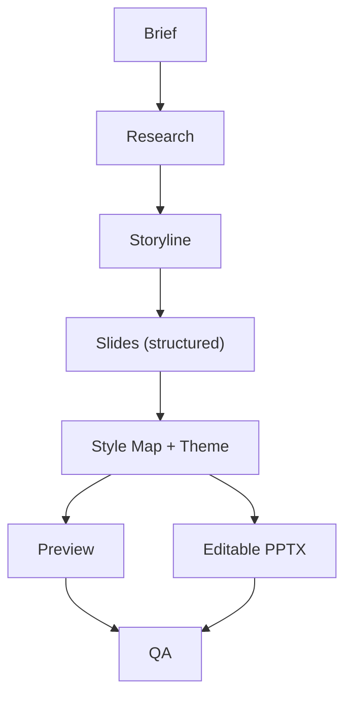
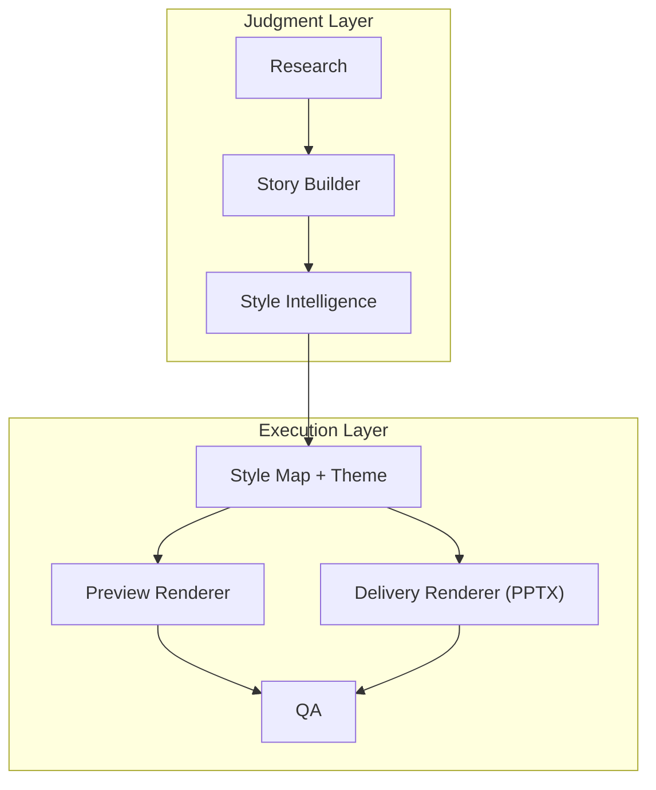
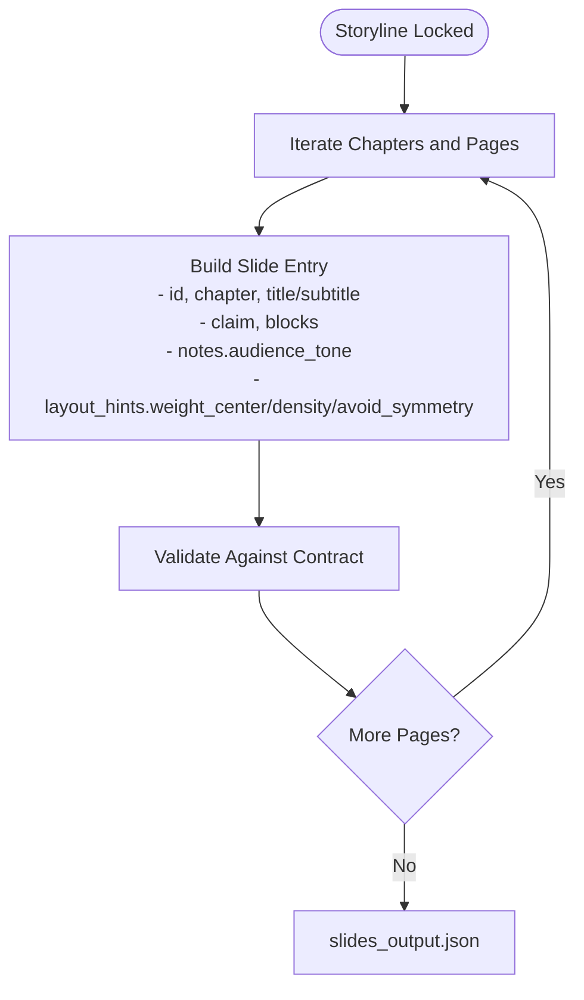
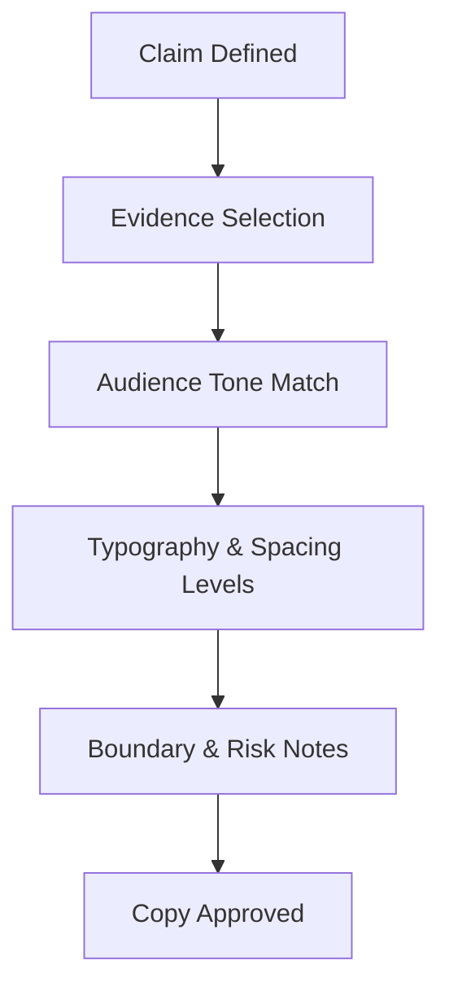
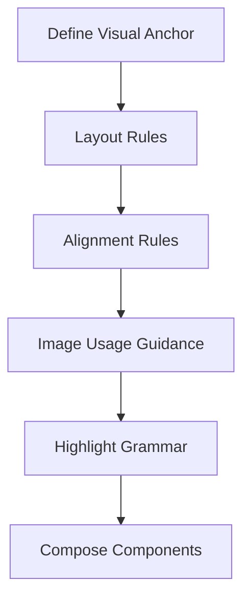
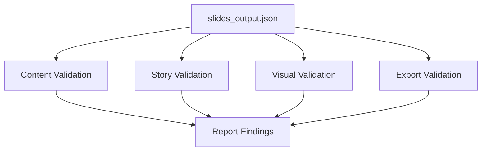
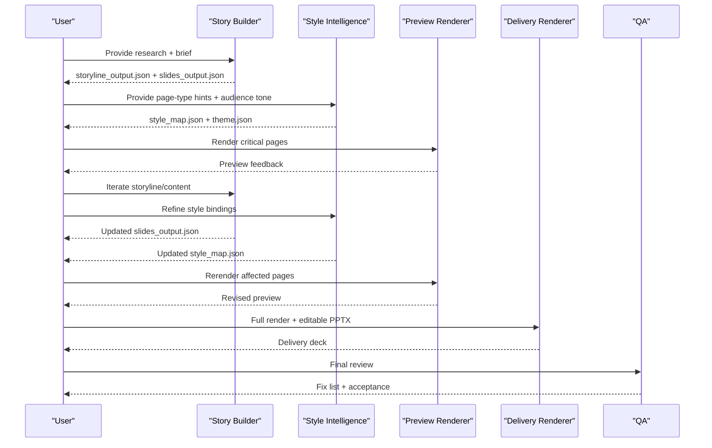
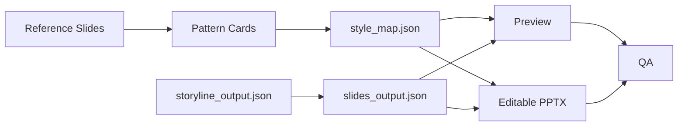

# Slide Content Development

<cite>
**Referenced Files in This Document**
- [README.md](file://README.md)
- [PROJECT_BLUEPRINT.md](file://PROJECT_BLUEPRINT.md)
- [01-system-architecture.md](file://01-system-architecture.md)
- [02-design-principles.md](file://02-design-principles.md)
- [03-operating-workflow.md](file://03-operating-workflow.md)
- [04-editable-output-strategy.md](file://04-editable-output-strategy.md)
- [slides_output.schema.json](file://schemas/slides_output.schema.json)
- [storyline_output.schema.json](file://schemas/storyline_output.schema.json)
- [pattern_card.example.json](file://examples/pattern_card.example.json)
- [reference_slide_extraction.example.json](file://examples/reference_slide_extraction.example.json)
- [template.pattern-card.json](file://style/patterns/template.pattern-card.json)
- [template.reference-slide.json](file://style/reference_extractions/template.reference-slide.json)
- [validated-slide-patterns.md](file://references/validated-slide-patterns.md)
- [quality-bar.md](file://references/quality-bar.md)
- [final-acceptance.md](file://qa/checklists/final-acceptance.md)
- [style-intelligence.md](file://references/style-intelligence.md)
- [skill-split.md](file://references/skill-split.md)
</cite>

## Table of Contents
1. [Introduction](#introduction)
2. [Project Structure](#project-structure)
3. [Core Components](#core-components)
4. [Architecture Overview](#architecture-overview)
5. [Detailed Component Analysis](#detailed-component-analysis)
6. [Dependency Analysis](#dependency-analysis)
7. [Performance Considerations](#performance-considerations)
8. [Troubleshooting Guide](#troubleshooting-guide)
9. [Conclusion](#conclusion)
10. [Appendices](#appendices)

## Introduction
This document explains how storylines are transformed into individual slide content and how that content is composed into final, editable presentations. It covers content structuring, information hierarchy, multimedia integration, copywriting guidelines, validation procedures, and quality assurance checkpoints. It also documents slide composition patterns, stakeholder approvals, and iterative refinement practices grounded in the repository’s layered architecture and schema-driven contracts.

## Project Structure
The slide content development process is organized around a layered system:
- Judgment layer: research, audience adaptation, storyline construction, page-type selection, critique
- Execution layer: schema validation, preview rendering, editable PPTX export, QA

The canonical flow is: brief → research_output → storyline_output → slides_output → style_map/theme → preview → editable_pptx → qa_report.

**Diagram sources**
- [PROJECT_BLUEPRINT.md:46-47](file://PROJECT_BLUEPRINT.md#L46-L47)
- [01-system-architecture.md:74-83](file://01-system-architecture.md#L74-L83)

**Section sources**
- [README.md:17-32](file://README.md#L17-L32)
- [PROJECT_BLUEPRINT.md:26-47](file://PROJECT_BLUEPRINT.md#L26-L47)
- [01-system-architecture.md:3-106](file://01-system-architecture.md#L3-L106)

## Core Components
- Research: Produces structured facts, interpretations, risks, constraints, and open questions.
- Story Builder: Converts research into chapters, page claims, and structured slide content.
- Style Intelligence: Encodes reusable patterns, themes, and component libraries; binds page types to slides.
- Renderer: Renders preview outputs and editable PPTX using structured content and style decisions.
- QA: Validates content, story, visual, and export quality against explicit criteria.

Key contracts:
- slides_output.json: Defines slide-level structure, claims, blocks, notes, and layout hints.
- storyline_output.json: Defines deck title, audience, and narrative with chapters and slides.
- Pattern cards and reference slide extractions: Encode page-type rules, composition, alignment, and anti-patterns.

**Section sources**
- [PROJECT_BLUEPRINT.md:51-193](file://PROJECT_BLUEPRINT.md#L51-L193)
- [02-design-principles.md:3-44](file://02-design-principles.md#L3-L44)
- [slides_output.schema.json:1-53](file://schemas/slides_output.schema.json#L1-L53)
- [storyline_output.schema.json:1-49](file://schemas/storyline_output.schema.json#L1-L49)

## Architecture Overview
The system enforces separation of concerns:
- Content and layout are decoupled until final rendering.
- Style intelligence provides reusable visual reasoning independent of story.
- Renderers consume structured content and style maps to produce preview and editable outputs.

**Diagram sources**
- [PROJECT_BLUEPRINT.md:26-47](file://PROJECT_BLUEPRINT.md#L26-L47)
- [01-system-architecture.md:98-106](file://01-system-architecture.md#L98-L106)

**Section sources**
- [01-system-architecture.md:3-106](file://01-system-architecture.md#L3-L106)
- [PROJECT_BLUEPRINT.md:26-47](file://PROJECT_BLUEPRINT.md#L26-L47)

## Detailed Component Analysis

### From Storyline to Structured Slide Content
Transformation steps:
- Lock storyline before rendering.
- Convert each chapter’s pages into structured slide entries with one primary claim.
- Separate title, subtitle, claim, content blocks, speaker notes, and layout hints.
- Ensure high-risk pages include boundaries and caveats.

**Diagram sources**
- [03-operating-workflow.md:42-61](file://03-operating-workflow.md#L42-L61)
- [slides_output.schema.json:11-50](file://schemas/slides_output.schema.json#L11-L50)

**Section sources**
- [03-operating-workflow.md:42-61](file://03-operating-workflow.md#L42-L61)
- [slides_output.schema.json:1-53](file://schemas/slides_output.schema.json#L1-L53)

### Information Hierarchy and Copywriting Guidelines
- One primary claim per slide; avoid knowledge completeness for presentation quality.
- State boundaries and risks for enterprise contexts.
- Audience adaptation is mandatory; adjust tone and framing accordingly.
- Typography levels and spacing should be clear and consistent with theme tokens.

**Diagram sources**
- [02-design-principles.md:3-22](file://02-design-principles.md#L3-L22)
- [03-operating-workflow.md:54-58](file://03-operating-workflow.md#L54-L58)

**Section sources**
- [02-design-principles.md:3-22](file://02-design-principles.md#L3-L22)
- [03-operating-workflow.md:54-58](file://03-operating-workflow.md#L54-L58)

### Multimedia Element Integration
- Visual anchors: Each slide should have a focal object or layout priority.
- Image usage modes: Hero placement guidance and rules for dominant visuals.
- Highlight grammar: Color and emphasis rules to stage hierarchy.
- Alignment rules: Shared edges and grid logic to maintain design discipline.

**Diagram sources**
- [template.pattern-card.json:7-35](file://style/patterns/template.pattern-card.json#L7-L35)
- [pattern_card.example.json:16-37](file://examples/pattern_card.example.json#L16-L37)
- [reference_slide_extraction.example.json:17-28](file://examples/reference_slide_extraction.example.json#L17-L28)

**Section sources**
- [template.pattern-card.json:1-46](file://style/patterns/template.pattern-card.json#L1-L46)
- [pattern_card.example.json:1-54](file://examples/pattern_card.example.json#L1-L54)
- [reference_slide_extraction.example.json:1-64](file://examples/reference_slide_extraction.example.json#L1-L64)

### Slide Composition Patterns
- Use validated page types for consistent, reusable compositions.
- Prefer asymmetry with intentional weight centers over generic symmetrical layouts.
- Maintain a single dominant visual object per slide; avoid equal-width comparison cards.

Examples of validated patterns:
- Cover Orbit, Narrative Map, Trust Terminal, Closed Loop Flow, Bottleneck Shift, Evolution Split, Layered Architecture Stack, Scenario Flow, Risk Split, Security Control Plane, Chapter Summary Signal, Closing Control-First.

**Section sources**
- [validated-slide-patterns.md:7-345](file://references/validated-slide-patterns.md#L7-L345)
- [template.pattern-card.json:7-44](file://style/patterns/template.pattern-card.json#L7-L44)

### Content Validation Procedures
- Content QA: Clear claims, factual support, audience fit, enterprise boundaries.
- Story QA: Concrete chapter questions, logical progression, no redundancy.
- Visual QA: Visual anchors, intentional weight center, no generic layouts.
- Export QA: No overflow/cutoff, clean encoding, correct page sequence.

**Diagram sources**
- [quality-bar.md:3-32](file://references/quality-bar.md#L3-L32)
- [final-acceptance.md:3-27](file://qa/checklists/final-acceptance.md#L3-L27)

**Section sources**
- [quality-bar.md:1-40](file://references/quality-bar.md#L1-L40)
- [final-acceptance.md:1-28](file://qa/checklists/final-acceptance.md#L1-L28)

### Stakeholder Approval and Iterative Refinement
- Review critical pages first: cover, agenda, architecture, risk, conclusion.
- Local rerender: edit slides_output.json and rerender only affected pages.
- Final acceptance standard: narratively necessary, visually intentional, factually defensible, locally revisable.

**Diagram sources**
- [03-operating-workflow.md:73-112](file://03-operating-workflow.md#L73-L112)
- [04-editable-output-strategy.md:42-49](file://04-editable-output-strategy.md#L42-L49)
- [PROJECT_BLUEPRINT.md:447-527](file://PROJECT_BLUEPRINT.md#L447-L527)

**Section sources**
- [03-operating-workflow.md:73-112](file://03-operating-workflow.md#L73-L112)
- [04-editable-output-strategy.md:42-49](file://04-editable-output-strategy.md#L42-L49)
- [PROJECT_BLUEPRINT.md:447-527](file://PROJECT_BLUEPRINT.md#L447-L527)

### Best Practices for Readability, Engagement, and Visual Alignment
- Readability: Clear typography levels, sufficient spacing, minimal dense blocks.
- Engagement: Visual anchors, asymmetry with alignment, hero visuals for focal points.
- Consistency: Theme tokens, component recipes, and pattern rules applied uniformly.

**Section sources**
- [02-design-principles.md:17-29](file://02-design-principles.md#L17-L29)
- [style-intelligence.md:24-44](file://references/style-intelligence.md#L24-L44)

## Dependency Analysis
The slide content development process depends on:
- Structured contracts (storyline_output.json, slides_output.json) to guide composition.
- Style intelligence (pattern cards, reference extractions) to enforce visual decisions.
- QA checklists to gate acceptance.

**Diagram sources**
- [storyline_output.schema.json:8-46](file://schemas/storyline_output.schema.json#L8-L46)
- [slides_output.schema.json:8-50](file://schemas/slides_output.schema.json#L8-L50)
- [template.pattern-card.json:1-46](file://style/patterns/template.pattern-card.json#L1-L46)
- [template.reference-slide.json:1-65](file://style/reference_extractions/template.reference-slide.json#L1-L65)

**Section sources**
- [storyline_output.schema.json:1-49](file://schemas/storyline_output.schema.json#L1-L49)
- [slides_output.schema.json:1-53](file://schemas/slides_output.schema.json#L1-L53)
- [template.pattern-card.json:1-46](file://style/patterns/template.pattern-card.json#L1-L46)
- [template.reference-slide.json:1-65](file://style/reference_extractions/template.reference-slide.json#L1-L65)

## Performance Considerations
- Keep preview and delivery paths separate but consistent by sharing page-type rules and theme tokens.
- Use local rerendering to minimize rebuild costs when iterating on slides.
- Maintain a small, prioritized page-type set for MVP to reduce rendering complexity.

**Section sources**
- [PROJECT_BLUEPRINT.md:541-584](file://PROJECT_BLUEPRINT.md#L541-L584)
- [04-editable-output-strategy.md:42-49](file://04-editable-output-strategy.md#L42-L49)

## Troubleshooting Guide
Common issues and remedies:
- Empty or generic slides: Apply pattern rules and ensure a visual anchor.
- Poor readability: Adjust typography levels and spacing; avoid dense blocks.
- Visual inconsistency: Bind slides to validated page types and follow alignment rules.
- Export problems: Validate against export QA rules and ensure no overflow or cutoff.

**Section sources**
- [quality-bar.md:17-32](file://references/quality-bar.md#L17-L32)
- [final-acceptance.md:13-24](file://qa/checklists/final-acceptance.md#L13-L24)
- [validated-slide-patterns.md:331-345](file://references/validated-slide-patterns.md#L331-L345)

## Conclusion
Slide content development in this system is a structured, schema-driven process that separates storytelling from visual design, ensuring each slide has a clear claim, a strong visual anchor, and consistent theme application. By validating content, story, visuals, and exports against explicit criteria, teams can iteratively refine decks while maintaining editability and reproducibility.

## Appendices

### Slide Templates and Adaptation Workflows
- Use pattern cards to define page-type rules, alignment, and anti-patterns.
- Reference slide extractions capture narrative roles, composition logic, and component recipes.
- Adapt templates by preserving hierarchy and grid relationships while swapping topic-appropriate visuals.

**Section sources**
- [template.pattern-card.json:1-46](file://style/patterns/template.pattern-card.json#L1-L46)
- [template.reference-slide.json:1-65](file://style/reference_extractions/template.reference-slide.json#L1-L65)
- [pattern_card.example.json:1-54](file://examples/pattern_card.example.json#L1-L54)
- [reference_slide_extraction.example.json:1-64](file://examples/reference_slide_extraction.example.json#L1-L64)

### Quality Assurance Checkpoints
- Content: One claim per slide, supported by facts or justified interpretation, with enterprise boundaries where needed.
- Story: Concrete chapter questions, logical progression, no redundancy.
- Visual: Visual anchors, intentional weight center, no generic layouts.
- Export: Clean encoding, no overflow/cutoff, correct page sequence.

**Section sources**
- [quality-bar.md:3-39](file://references/quality-bar.md#L3-L39)
- [final-acceptance.md:3-27](file://qa/checklists/final-acceptance.md#L3-L27)