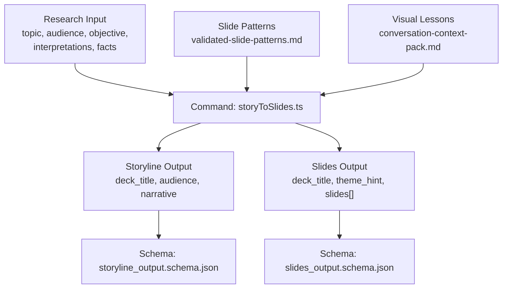
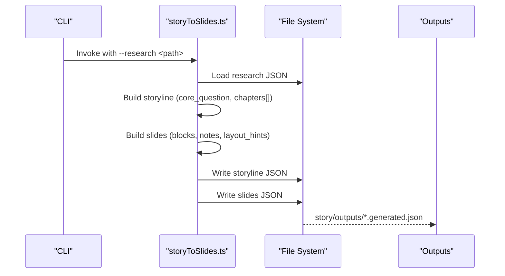
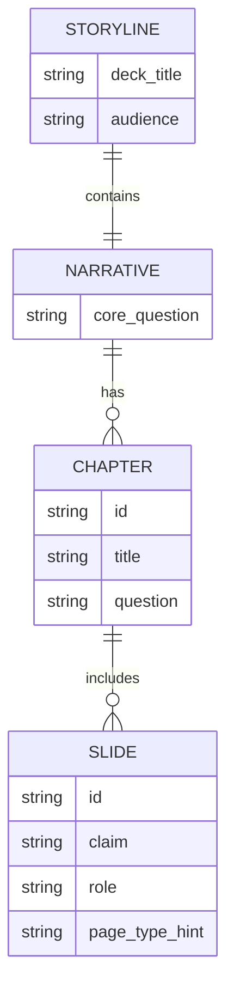
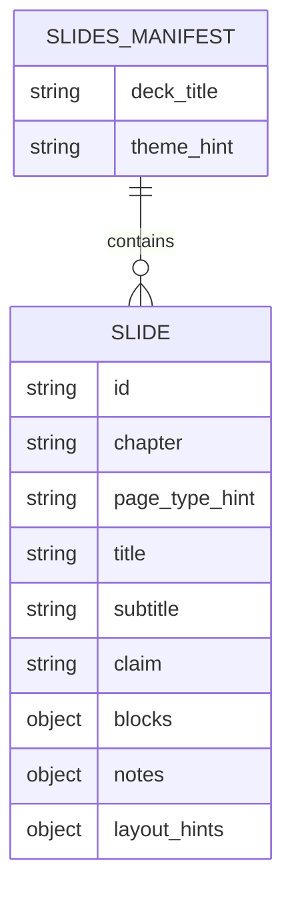
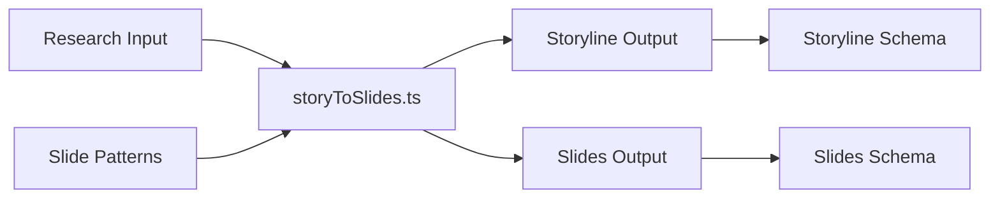

# Story Construction

<cite>
**Referenced Files in This Document**
- [storyToSlides.ts](file://src/commands/storyToSlides.ts)
- [storyline_output.schema.json](file://schemas/storyline_output.schema.json)
- [slides_output.schema.json](file://schemas/slides_output.schema.json)
- [storyline_output.example.json](file://schemas/storyline_output.example.json)
- [storyline.generated.json](file://story/outputs/storyline.generated.json)
- [slides.generated.json](file://story/outputs/slides.generated.json)
- [validated-slide-patterns.md](file://references/validated-slide-patterns.md)
- [conversation-context-pack.md](file://references/conversation-context-pack.md)
- [PROJECT_INIT.md](file://PROJECT_INIT.md)
</cite>

## Table of Contents
1. [Introduction](#introduction)
2. [Project Structure](#project-structure)
3. [Core Components](#core-components)
4. [Architecture Overview](#architecture-overview)
5. [Detailed Component Analysis](#detailed-component-analysis)
6. [Dependency Analysis](#dependency-analysis)
7. [Performance Considerations](#performance-considerations)
8. [Troubleshooting Guide](#troubleshooting-guide)
9. [Conclusion](#conclusion)
10. [Appendices](#appendices)

## Introduction
This document explains the story construction layer of the Enterprise PPT System. It covers how the narrative is generated from research, how slide content is structured, and how chapter logic is implemented. It also documents the prompt engineering system, rule-based story construction, integration with research data, and the relationship between story elements and visual design decisions. Practical workflows, structuring patterns, quality assurance procedures, iterative refinement, stakeholder feedback integration, and consistency maintenance are included, along with best practices for story construction and content quality standards.

## Project Structure
The story construction layer centers around a single command that transforms research into a structured storyline and a set of slides. The command reads a research input, constructs a narrative skeleton, and writes both the storyline and slide manifests to the outputs folder. Schemas define the contract for both outputs, while reference materials codify validated slide patterns and lessons learned from visual design.

**Diagram sources**
- [storyToSlides.ts:12-166](file://src/commands/storyToSlides.ts#L12-L166)
- [storyline_output.schema.json:1-49](file://schemas/storyline_output.schema.json#L1-L49)
- [slides_output.schema.json:1-53](file://schemas/slides_output.schema.json#L1-L53)
- [validated-slide-patterns.md:1-345](file://references/validated-slide-patterns.md#L1-L345)
- [conversation-context-pack.md:203-261](file://references/conversation-context-pack.md#L203-L261)

**Section sources**
- [storyToSlides.ts:12-166](file://src/commands/storyToSlides.ts#L12-L166)
- [storyline_output.schema.json:1-49](file://schemas/storyline_output.schema.json#L1-L49)
- [slides_output.schema.json:1-53](file://schemas/slides_output.schema.json#L1-L53)
- [validated-slide-patterns.md:1-345](file://references/validated-slide-patterns.md#L1-L345)
- [conversation-context-pack.md:203-261](file://references/conversation-context-pack.md#L203-L261)

## Core Components
- Research input model: Provides topic, audience, objective, optional interpretations, and facts used to seed the story.
- Storyline builder: Produces a narrative with a core question and ordered chapters, each containing slides with roles and page-type hints.
- Slides builder: Produces a deck manifest with themed slides, each carrying blocks, notes, and layout hints.
- Output schemas: Enforce structural integrity for both storyline and slides outputs.
- Reference patterns and lessons: Guide page-type selection and visual composition decisions.

Key implementation references:
- Research ingestion and primary claim derivation: [storyToSlides.ts:21-25](file://src/commands/storyToSlides.ts#L21-L25)
- Storyline construction: [storyToSlides.ts:26-73](file://src/commands/storyToSlides.ts#L26-L73)
- Slides construction: [storyToSlides.ts:75-159](file://src/commands/storyToSlides.ts#L75-L159)
- Output schemas: [storyline_output.schema.json:1-49](file://schemas/storyline_output.schema.json#L1-L49), [slides_output.schema.json:1-53](file://schemas/slides_output.schema.json#L1-L53)

**Section sources**
- [storyToSlides.ts:21-159](file://src/commands/storyToSlides.ts#L21-L159)
- [storyline_output.schema.json:1-49](file://schemas/storyline_output.schema.json#L1-L49)
- [slides_output.schema.json:1-53](file://schemas/slides_output.schema.json#L1-L53)

## Architecture Overview
The story construction pipeline is a deterministic, rule-based transform driven by research. It composes a narrative with three chapters (introduction, main framing, summary) and maps each slide to a validated page pattern. The command writes both the storyline and slides outputs, which are later consumed by the style and rendering layers.

**Diagram sources**
- [storyToSlides.ts:12-166](file://src/commands/storyToSlides.ts#L12-L166)
- [storyline.generated.json:1-49](file://story/outputs/storyline.generated.json#L1-L49)
- [slides.generated.json:1-97](file://story/outputs/slides.generated.json#L1-L97)

## Detailed Component Analysis

### Research Integration and Prompt Engineering
- Inputs: The command expects a research payload with topic, audience, objective, optional interpretations, and facts. The first interpretation or first fact becomes the primary claim; a second fact is used as a supporting point.
- Prompt engineering: The command acts as a prompt engine by mapping research fields into narrative scaffolding. It sets the core question from the research objective and populates chapter questions accordingly.
- Deterministic mapping: The command enforces a fixed narrative structure to ensure consistency across decks.

References:
- Research loading and claim derivation: [storyToSlides.ts:21-25](file://src/commands/storyToSlides.ts#L21-L25)
- Core question and chapter questions: [storyToSlides.ts:30-48](file://src/commands/storyToSlides.ts#L30-L48)

**Section sources**
- [storyToSlides.ts:21-48](file://src/commands/storyToSlides.ts#L21-L48)

### Storyline Generation
- Structure: The storyline includes deck title, audience, and a narrative object with a core question and an array of chapters.
- Chapters: The current implementation defines three chapters: introduction (agenda), main framing (strategic claim), and summary (decision implications).
- Chapter slides: Each chapter contains one or more slides with identifiers, claims, roles, and page-type hints.

References:
- Storyline shape and required fields: [storyline_output.schema.json:8-46](file://schemas/storyline_output.schema.json#L8-L46)
- Example storyline: [storyline_output.example.json:1-23](file://schemas/storyline_output.example.json#L1-L23)
- Generated storyline: [storyline.generated.json:1-49](file://story/outputs/storyline.generated.json#L1-L49)

**Diagram sources**
- [storyline_output.schema.json:8-46](file://schemas/storyline_output.schema.json#L8-L46)
- [storyline.generated.json:4-47](file://story/outputs/storyline.generated.json#L4-L47)

**Section sources**
- [storyline_output.schema.json:8-46](file://schemas/storyline_output.schema.json#L8-L46)
- [storyline_output.example.json:1-23](file://schemas/storyline_output.example.json#L1-L23)
- [storyline.generated.json:1-49](file://story/outputs/storyline.generated.json#L1-L49)

### Slide Content Creation and Structuring
- Deck metadata: Includes deck title and theme hint for downstream style application.
- Slide blocks: Each slide carries a blocks object with content arrays and statements appropriate to the page type (e.g., story_points, primary_statement, support_points, summary, implications).
- Notes and layout hints: Slides include notes for audience tone, visual anchors, and emphasis cues, plus layout hints for composition (weight center, density level, symmetry preferences).
- Page-type hints: Each slide carries a page-type hint that maps to validated slide patterns.

References:
- Slides schema and required fields: [slides_output.schema.json:7-50](file://schemas/slides_output.schema.json#L7-L50)
- Generated slides manifest: [slides.generated.json:1-97](file://story/outputs/slides.generated.json#L1-L97)

**Diagram sources**
- [slides_output.schema.json:7-50](file://schemas/slides_output.schema.json#L7-L50)
- [slides.generated.json:4-96](file://story/outputs/slides.generated.json#L4-L96)

**Section sources**
- [slides_output.schema.json:7-50](file://schemas/slides_output.schema.json#L7-L50)
- [slides.generated.json:1-97](file://story/outputs/slides.generated.json#L1-L97)

### Chapter Logic Implementation
- Introduction chapter: Establishes deck logic and narrative staging via an agenda slide.
- Main framing chapter: Presents the opening strategic claim derived from research.
- Summary chapter: Provides decision implications and a concise summary.

References:
- Chapter construction: [storyToSlides.ts:31-71](file://src/commands/storyToSlides.ts#L31-L71)
- Generated chapters and slides: [storyline.generated.json:6-46](file://story/outputs/storyline.generated.json#L6-L46)

**Section sources**
- [storyToSlides.ts:31-71](file://src/commands/storyToSlides.ts#L31-L71)
- [storyline.generated.json:6-46](file://story/outputs/storyline.generated.json#L6-L46)

### Relationship Between Story Elements and Visual Design Decisions
- Page-type hints: Link story slides to validated slide patterns (e.g., cover_orbit, narrative_map, bottleneck_shift, chapter_summary_signal).
- Layout hints: Drive composition choices such as weight center, density level, and symmetry avoidance.
- Notes: Provide guidance on audience tone, visual anchors, and emphasis areas.

References:
- Page-type hints in slides: [slides.generated.json:8, 36, 57, 77](file://story/outputs/slides.generated.json#L8,L36,L57,L77)
- Layout hints: [slides.generated.json:27-31, 48-52, 68-72, 89-93](file://story/outputs/slides.generated.json#L27-L31,L48-L52,L68-L72,L89-L93)
- Notes: [slides.generated.json:19-26, 105-111, 127-131, 143-151](file://story/outputs/slides.generated.json#L19-L26,L105-L111,L127-L131,L143-L151)
- Slide patterns reference: [validated-slide-patterns.md:7-344](file://references/validated-slide-patterns.md#L7-L344)

**Section sources**
- [slides.generated.json:8, 36, 57, 77](file://story/outputs/slides.generated.json#L8,L36,L57,L77)
- [slides.generated.json:27-31, 48-52, 68-72, 89-93](file://story/outputs/slides.generated.json#L27-L31,L48-L52,L68-L72,L89-L93)
- [slides.generated.json:19-26, 105-111, 127-131, 143-151](file://story/outputs/slides.generated.json#L19-L26,L105-L111,L127-L131,L143-L151)
- [validated-slide-patterns.md:7-344](file://references/validated-slide-patterns.md#L7-L344)

### Practical Workflows and Iterative Refinement
- Workflow steps:
  1) Confirm PPT story and content
  2) Match style to content
  3) Generate and test
- Iterative refinement:
  - Use QA and revision loops to improve storyline and slide quality.
  - Apply layout and composition improvements based on visual lessons.
  - Maintain separation of content and format for consistent, editable delivery.

References:
- Process conclusion and workflow: [conversation-context-pack.md:239-244](file://references/conversation-context-pack.md#L239-L244)
- Content-format separation principle: [conversation-context-pack.md:246-248](file://references/conversation-context-pack.md#L246-L248)
- System-level conclusions: [conversation-context-pack.md:251-261](file://references/conversation-context-pack.md#L251-L261)

**Section sources**
- [conversation-context-pack.md:239-261](file://references/conversation-context-pack.md#L239-L261)

### Quality Assurance Procedures
- Contract validation: Both outputs conform to strict JSON schemas ensuring required fields and shapes.
- Output examples: Example outputs demonstrate expected structure and content patterns.
- QA checklist: The QA area includes acceptance criteria and validation artifacts.

References:
- Storyline schema: [storyline_output.schema.json:1-49](file://schemas/storyline_output.schema.json#L1-L49)
- Slides schema: [slides_output.schema.json:1-53](file://schemas/slides_output.schema.json#L1-L53)
- Example storyline: [storyline_output.example.json:1-23](file://schemas/storyline_output.example.json#L1-L23)
- Generated outputs: [storyline.generated.json:1-49](file://story/outputs/storyline.generated.json#L1-L49), [slides.generated.json:1-97](file://story/outputs/slides.generated.json#L1-L97)

**Section sources**
- [storyline_output.schema.json:1-49](file://schemas/storyline_output.schema.json#L1-L49)
- [slides_output.schema.json:1-53](file://schemas/slides_output.schema.json#L1-L53)
- [storyline_output.example.json:1-23](file://schemas/storyline_output.example.json#L1-L23)
- [storyline.generated.json:1-49](file://story/outputs/storyline.generated.json#L1-L49)
- [slides.generated.json:1-97](file://story/outputs/slides.generated.json#L1-L97)

## Dependency Analysis
The story construction layer depends on:
- Research input contract: Ensures the presence of topic, audience, objective, and facts.
- Slide pattern catalog: Validates page-type hints and informs visual composition.
- Output schemas: Enforce structural consistency for both storyline and slides.

**Diagram sources**
- [storyToSlides.ts:12-166](file://src/commands/storyToSlides.ts#L12-L166)
- [validated-slide-patterns.md:1-345](file://references/validated-slide-patterns.md#L1-L345)
- [storyline_output.schema.json:1-49](file://schemas/storyline_output.schema.json#L1-L49)
- [slides_output.schema.json:1-53](file://schemas/slides_output.schema.json#L1-L53)

**Section sources**
- [storyToSlides.ts:12-166](file://src/commands/storyToSlides.ts#L12-L166)
- [validated-slide-patterns.md:1-345](file://references/validated-slide-patterns.md#L1-L345)
- [storyline_output.schema.json:1-49](file://schemas/storyline_output.schema.json#L1-L49)
- [slides_output.schema.json:1-53](file://schemas/slides_output.schema.json#L1-L53)

## Performance Considerations
- Deterministic generation: The command produces consistent outputs from identical research inputs, enabling repeatable QA and revision loops.
- Minimal branching: Fixed narrative structure reduces complexity and potential errors.
- Early validation: JSON schema enforcement prevents downstream rendering failures caused by malformed outputs.

## Troubleshooting Guide
Common issues and resolutions:
- Missing research argument: The command throws an error if the research path is not provided. Ensure the --research flag is set.
  - Reference: [storyToSlides.ts:13-16](file://src/commands/storyToSlides.ts#L13-L16)
- Empty or insufficient research fields: If interpretations or facts are missing, the command substitutes safe defaults. Verify research completeness.
  - Reference: [storyToSlides.ts:22-24](file://src/commands/storyToSlides.ts#L22-L24)
- Schema violations: If outputs fail schema validation, adjust fields to meet required shapes and types.
  - References: [storyline_output.schema.json:8-46](file://schemas/storyline_output.schema.json#L8-L46), [slides_output.schema.json:7-50](file://schemas/slides_output.schema.json#L7-L50)
- Visual composition problems: Use layout hints and notes to guide composition; align with validated patterns.
  - References: [slides.generated.json:27-31, 48-52, 68-72, 89-93](file://story/outputs/slides.generated.json#L27-L31,L48-L52,L68-L72,L89-L93), [validated-slide-patterns.md:7-344](file://references/validated-slide-patterns.md#L7-L344)

**Section sources**
- [storyToSlides.ts:13-24](file://src/commands/storyToSlides.ts#L13-L24)
- [storyline_output.schema.json:8-46](file://schemas/storyline_output.schema.json#L8-L46)
- [slides_output.schema.json:7-50](file://schemas/slides_output.schema.json#L7-L50)
- [slides.generated.json:27-31, 48-52, 68-72, 89-93](file://story/outputs/slides.generated.json#L27-L31,L48-L52,L68-L72,L89-L93)
- [validated-slide-patterns.md:7-344](file://references/validated-slide-patterns.md#L7-L344)

## Conclusion
The story construction layer provides a deterministic, schema-driven pathway from research to narrative and slide manifests. By enforcing a clear chapter structure, mapping slides to validated patterns, and embedding composition hints, it ensures consistency, editability, and alignment between story and visuals. The documented workflows, quality checks, and iterative refinement practices support reliable, enterprise-grade presentation production.

## Appendices

### Best Practices for Story Construction
- Keep the core question focused and audience-specific.
- Derive primary claims from the most credible interpretation or first fact.
- Use page-type hints to select patterns aligned with the slide’s role (cover, agenda, framing, summary).
- Include notes and layout hints to guide visual composition and emphasize decision-relevant points.
- Maintain separation of content and format to enable efficient revisions.

References:
- Core thesis and module direction: [PROJECT_INIT.md:22-53](file://PROJECT_INIT.md#L22-L53)
- Visual lessons and composition guidance: [conversation-context-pack.md:222-248](file://references/conversation-context-pack.md#L222-L248)
- Slide patterns catalog: [validated-slide-patterns.md:331-344](file://references/validated-slide-patterns.md#L331-L344)

**Section sources**
- [PROJECT_INIT.md:22-53](file://PROJECT_INIT.md#L22-L53)
- [conversation-context-pack.md:222-248](file://references/conversation-context-pack.md#L222-L248)
- [validated-slide-patterns.md:331-344](file://references/validated-slide-patterns.md#L331-L344)