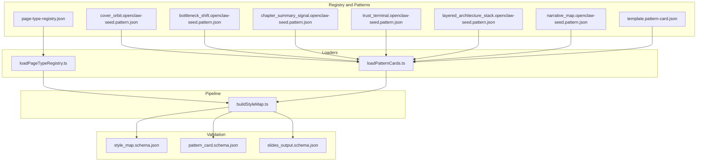
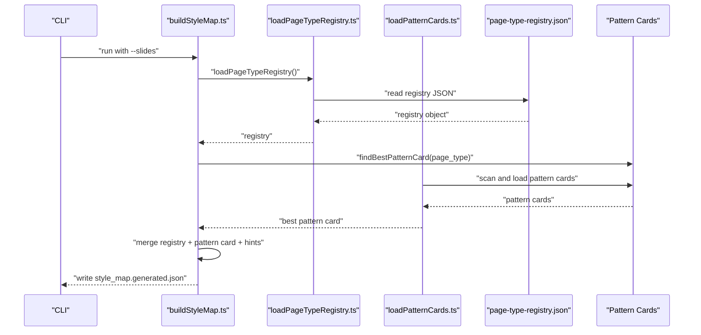
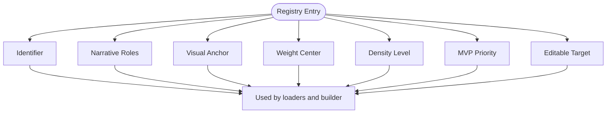
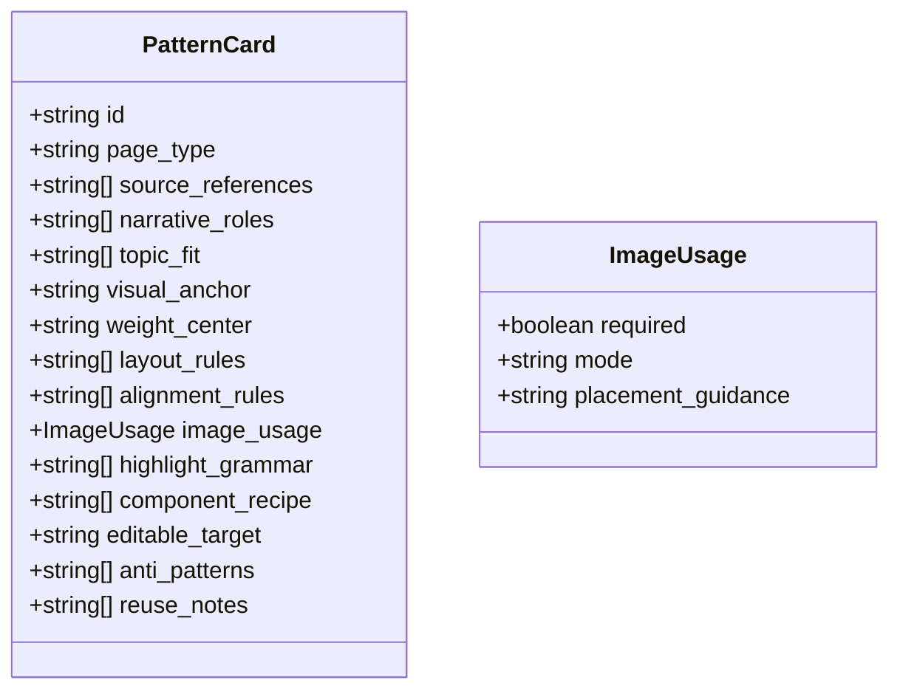
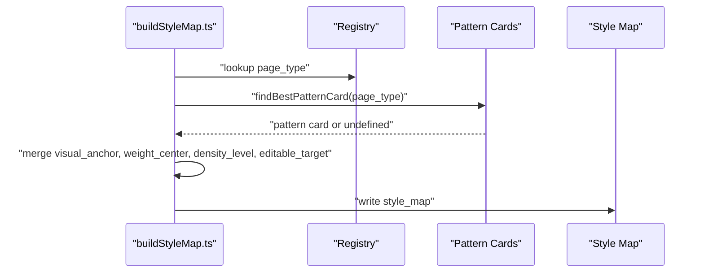
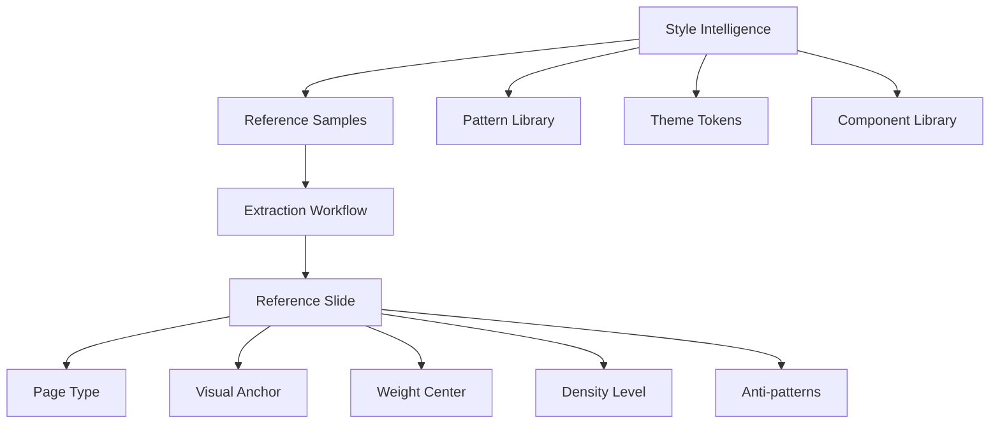
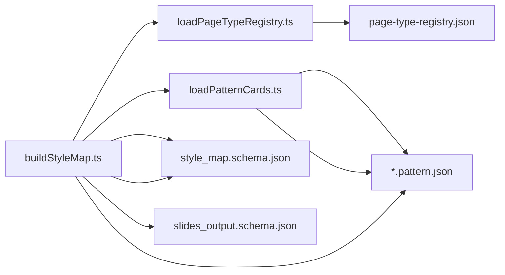

# Page Type Registry

<cite>
**Referenced Files in This Document**
- [page-type-registry.json](file://style/patterns/page-type-registry.json)
- [loadPageTypeRegistry.ts](file://src/lib/style/loadPageTypeRegistry.ts)
- [loadPatternCards.ts](file://src/lib/style/loadPatternCards.ts)
- [buildStyleMap.ts](file://src/commands/buildStyleMap.ts)
- [trust_terminal.openclaw-seed.pattern.json](file://style/patterns/trust_terminal.openclaw-seed.pattern.json)
- [layered_architecture_stack.openclaw-seed.pattern.json](file://style/patterns/layered_architecture_stack.openclaw-seed.pattern.json)
- [narrative_map.openclaw-seed.pattern.json](file://style/patterns/narrative_map.openclaw-seed.pattern.json)
- [template.pattern-card.json](file://style/patterns/template.pattern-card.json)
- [cover_orbit.openclaw-seed.pattern.json](file://style/patterns/cover_orbit.openclaw-seed.pattern.json)
- [bottleneck_shift.openclaw-seed.pattern.json](file://style/patterns/bottleneck_shift.openclaw-seed.pattern.json)
- [chapter_summary_signal.openclaw-seed.pattern.json](file://style/patterns/chapter_summary_signal.openclaw-seed.pattern.json)
- [style_map.schema.json](file://schemas/style_map.schema.json)
- [pattern_card.schema.json](file://schemas/pattern_card.schema.json)
- [slides_output.schema.json](file://schemas/slides_output.schema.json)
- [style-intelligence.md](file://references/style-intelligence.md)
- [template.reference-slide.json](file://style/reference_extractions/template.reference-slide.json)
</cite>

## Update Summary
**Changes Made**
- Updated registry to include three new page types: trust_terminal, layered_architecture_stack, and narrative_map
- Added comprehensive pattern cards for each new page type with detailed layout rules and design guidance
- Enhanced page type documentation to reflect the expanded registry with new specialized page types
- Updated examples and best practices to include the new page types

## Table of Contents
1. [Introduction](#introduction)
2. [Project Structure](#project-structure)
3. [Core Components](#core-components)
4. [Architecture Overview](#architecture-overview)
5. [Detailed Component Analysis](#detailed-component-analysis)
6. [Dependency Analysis](#dependency-analysis)
7. [Performance Considerations](#performance-considerations)
8. [Troubleshooting Guide](#troubleshooting-guide)
9. [Conclusion](#conclusion)
10. [Appendices](#appendices)

## Introduction
This document describes the page type registry system that classifies and manages slide types in the Enterprise PPT System. The registry defines page types by narrative roles, visual anchors, weight centers, density levels, and editability targets. It also connects page types to pattern cards that encode layout rules, alignment logic, component recipes, and design constraints. The system integrates with the style intelligence pipeline to produce a style map that guides rendering and ensures consistent, strategic design decisions across presentations.

**Updated** Added three new specialized page types: trust_terminal for trust explanation and architecture reasoning, layered_architecture_stack for architecture and stack explanation, and narrative_map for agenda and chapter framing.

## Project Structure
The page type registry and related assets are organized as follows:
- Registry definition: a JSON file enumerating page types and their attributes.
- Pattern cards: JSON documents that describe how each page type should be composed, including layout rules, alignment rules, component recipes, and design constraints.
- Loader utilities: TypeScript modules that load the registry and pattern cards into the runtime.
- Command pipeline: a command that consumes slide outputs and builds a style map by combining registry entries with the best matching pattern cards.
- Schemas: JSON Schema definitions that validate the registry, pattern cards, and style map artifacts.

**Diagram sources**
- [page-type-registry.json:1-115](file://style/patterns/page-type-registry.json#L1-L115)
- [loadPageTypeRegistry.ts:1-21](file://src/lib/style/loadPageTypeRegistry.ts#L1-L21)
- [loadPatternCards.ts:1-49](file://src/lib/style/loadPatternCards.ts#L1-L49)
- [buildStyleMap.ts:1-110](file://src/commands/buildStyleMap.ts#L1-L110)
- [trust_terminal.openclaw-seed.pattern.json:1-53](file://style/patterns/trust_terminal.openclaw-seed.pattern.json#L1-L53)
- [layered_architecture_stack.openclaw-seed.pattern.json:1-55](file://style/patterns/layered_architecture_stack.openclaw-seed.pattern.json#L1-L55)
- [narrative_map.openclaw-seed.pattern.json:1-52](file://style/patterns/narrative_map.openclaw-seed.pattern.json#L1-L52)

**Section sources**
- [page-type-registry.json:1-115](file://style/patterns/page-type-registry.json#L1-L115)
- [loadPageTypeRegistry.ts:1-21](file://src/lib/style/loadPageTypeRegistry.ts#L1-L21)
- [loadPatternCards.ts:1-49](file://src/lib/style/loadPatternCards.ts#L1-L49)
- [buildStyleMap.ts:1-110](file://src/commands/buildStyleMap.ts#L1-L110)

## Core Components
- Page Type Registry: A JSON catalog of page types with fields such as identifier, narrative roles, visual anchor, weight center, density level, MVP priority, and editable target. It also carries a registry version and theme family.
- Pattern Cards: JSON documents that capture the compositional and design guidance for a page type, including layout rules, alignment rules, component recipes, highlight grammar, image usage guidance, anti-patterns, and reuse notes.
- Loaders:
  - Registry loader: Loads the registry JSON and exposes a typed interface.
  - Pattern card loader: Scans the patterns directory, loads all pattern cards, and selects the best candidate per page type (preferring seed references when present).
- Style Map Builder: Consumes slide outputs, resolves page types via the registry, augments with pattern card details, and writes a validated style map artifact.

Key responsibilities:
- Classification: Narrative roles and visual anchors classify page types for semantic routing.
- Layout requirements: Pattern cards define layout and alignment rules; registry entries supply defaults.
- Design constraints: Anti-patterns and highlight grammar constrain design choices.
- Editability: Editable target informs whether native shapes/text, hybrid (SVG), or native-only editing is preferred.

**Updated** The registry now includes three specialized page types that expand the system's capabilities for enterprise presentation scenarios.

**Section sources**
- [page-type-registry.json:1-115](file://style/patterns/page-type-registry.json#L1-L115)
- [loadPageTypeRegistry.ts:1-21](file://src/lib/style/loadPageTypeRegistry.ts#L1-L21)
- [loadPatternCards.ts:1-49](file://src/lib/style/loadPatternCards.ts#L1-L49)
- [buildStyleMap.ts:50-109](file://src/commands/buildStyleMap.ts#L50-L109)

## Architecture Overview
The page type registry participates in a two-stage process:
1. Registry ingestion: The registry is loaded and indexed by page type ID.
2. Pattern augmentation: For each slide, the system resolves the page type, fetches the best pattern card, merges layout hints, and emits a style map.

**Diagram sources**
- [buildStyleMap.ts:50-109](file://src/commands/buildStyleMap.ts#L50-L109)
- [loadPageTypeRegistry.ts:1-21](file://src/lib/style/loadPageTypeRegistry.ts#L1-L21)
- [loadPatternCards.ts:1-49](file://src/lib/style/loadPatternCards.ts#L1-L49)
- [page-type-registry.json:1-115](file://style/patterns/page-type-registry.json#L1-L115)

## Detailed Component Analysis

### Page Type Registry
The registry encodes page types with:
- Identifier: Unique page type ID.
- Narrative roles: Semantic categories guiding content framing.
- Visual anchor: Dominant compositional element.
- Weight center: Asymmetry bias (e.g., right-middle, center-middle).
- Density level: Low, medium, or high.
- MVP priority: Whether the page type is prioritized for MVP.
- Editable target: Native shapes plus text, hybrid native plus SVG, or native only.

**Updated** The registry now includes three new specialized page types:

#### Trust Terminal Page Type
- **Identifier**: trust_terminal
- **Narrative roles**: trust explanation, architecture reasoning
- **Visual anchor**: terminal_window
- **Weight center**: right-middle
- **Density level**: medium
- **MVP priority**: true
- **Editable target**: native_shapes_plus_text

#### Layered Architecture Stack Page Type
- **Identifier**: layered_architecture_stack
- **Narrative roles**: architecture, stack explanation
- **Visual anchor**: layered_stack
- **Weight center**: middle
- **Density level**: high
- **MVP priority**: true
- **Editable target**: native_shapes_plus_text

#### Narrative Map Page Type
- **Identifier**: narrative_map
- **Narrative roles**: agenda, chapter framing
- **Visual anchor**: chapter_card_stack
- **Weight center**: center-middle
- **Density level**: medium
- **MVP priority**: true
- **Editable target**: native_shapes_plus_text

Common page types include:
- Cover: Strategic framing and chapter opener.
- Bottleneck shift: Paradigm shift and thesis page.
- Evolution split: Transition and before-after.
- Scenario flow: Workflow and scenario.
- Risk split: Risk contrast and control framing.
- Security control plane: Security architecture and governance.
- Chapter summary signal: Summary and decision implication.
- Closing control first: Closing and call to action.

**Diagram sources**
- [page-type-registry.json:4-113](file://style/patterns/page-type-registry.json#L4-L113)

**Section sources**
- [page-type-registry.json:1-115](file://style/patterns/page-type-registry.json#L1-L115)
- [loadPageTypeRegistry.ts:4-16](file://src/lib/style/loadPageTypeRegistry.ts#L4-L16)

### Pattern Cards
Pattern cards provide detailed design guidance for each page type:
- Identifiers and references: Page type, pattern ID, and source references.
- Narrative roles and topic fit: Semantic and topical alignment.
- Visual anchor and weight center: Composition intent.
- Layout rules and alignment rules: Structural and grid constraints.
- Image usage guidance: Required modes and placement.
- Highlight grammar: Color, contrast, and effect strategies.
- Component recipe: Reusable components to bind.
- Editable target: Preferred editability mode.
- Anti-patterns and reuse notes: What to avoid and how to adapt.

**Updated** Three new pattern cards have been added to support the new page types:

#### Trust Terminal Pattern Card
Provides detailed guidance for trust explanation and architecture reasoning presentations. Features a terminal window as the central trust object with layered security context, emphasizing security indicators and governance labels.

#### Layered Architecture Stack Pattern Card
Defines layout rules for multi-layer system architecture explanations. Uses vertical stacking with consistent spacing to show architectural hierarchy, featuring distinct visual treatment for each layer.

#### Narrative Map Pattern Card
Establishes composition guidelines for agenda and chapter framing. Uses a dominant chapter card on the left with supporting chapter cards on the right, plus a decision cue band at the bottom.

**Diagram sources**
- [loadPatternCards.ts:7-27](file://src/lib/style/loadPatternCards.ts#L7-L27)
- [trust_terminal.openclaw-seed.pattern.json:1-53](file://style/patterns/trust_terminal.openclaw-seed.pattern.json#L1-L53)
- [layered_architecture_stack.openclaw-seed.pattern.json:1-55](file://style/patterns/layered_architecture_stack.openclaw-seed.pattern.json#L1-L55)
- [narrative_map.openclaw-seed.pattern.json:1-52](file://style/patterns/narrative_map.openclaw-seed.pattern.json#L1-L52)

**Section sources**
- [loadPatternCards.ts:1-49](file://src/lib/style/loadPatternCards.ts#L1-L49)
- [trust_terminal.openclaw-seed.pattern.json:1-53](file://style/patterns/trust_terminal.openclaw-seed.pattern.json#L1-L53)
- [layered_architecture_stack.openclaw-seed.pattern.json:1-55](file://style/patterns/layered_architecture_stack.openclaw-seed.pattern.json#L1-L55)
- [narrative_map.openclaw-seed.pattern.json:1-52](file://style/patterns/narrative_map.openclaw-seed.pattern.json#L1-L52)

### Style Map Builder
The style map builder orchestrates registry and pattern card data into a validated style map:
- Loads slide outputs and the page type registry.
- Resolves each slide's page type from the slide output or hint.
- Looks up the registry entry and the best pattern card.
- Merges visual anchor, weight center, density level, and editable target from pattern card or registry.
- Aggregates component bindings from the visual anchor and component recipe.
- Emits a style map with required fields and optional learned pattern details.

**Diagram sources**
- [buildStyleMap.ts:63-99](file://src/commands/buildStyleMap.ts#L63-L99)

**Section sources**
- [buildStyleMap.ts:50-109](file://src/commands/buildStyleMap.ts#L50-L109)

### Integration with Style Intelligence
The style intelligence system documents the purpose and structure of the registry and pattern library:
- Purpose: Serve as design memory to guide intentional, strategic expression.
- What to store: Reference samples, pattern library, theme tokens, and component library.
- Extraction guidance: For each reference slide, extract narrative role, page type, visual anchor, weight center, density level, and anti-patterns.
- Pattern card template: Provides a structured YAML template for authoring pattern cards.

**Diagram sources**
- [style-intelligence.md:1-93](file://references/style-intelligence.md#L1-L93)

**Section sources**
- [style-intelligence.md:1-93](file://references/style-intelligence.md#L1-L93)
- [template.reference-slide.json:1-65](file://style/reference_extractions/template.reference-slide.json#L1-L65)

## Dependency Analysis
The system exhibits clear separation of concerns:
- Registry loader depends on JSON loading and repository path utilities.
- Pattern card loader depends on filesystem scanning and JSON loading.
- Style map builder depends on both loaders and writes to a validated style map artifact.
- Schemas validate registry entries, pattern cards, and style maps.

**Diagram sources**
- [loadPageTypeRegistry.ts:1-21](file://src/lib/style/loadPageTypeRegistry.ts#L1-L21)
- [loadPatternCards.ts:1-49](file://src/lib/style/loadPatternCards.ts#L1-L49)
- [buildStyleMap.ts:1-110](file://src/commands/buildStyleMap.ts#L1-L110)
- [style_map.schema.json:1-34](file://schemas/style_map.schema.json#L1-L34)
- [pattern_card.schema.json:1-49](file://schemas/pattern_card.schema.json#L1-L49)
- [slides_output.schema.json:35-52](file://schemas/slides_output.schema.json#L35-L52)

**Section sources**
- [loadPageTypeRegistry.ts:1-21](file://src/lib/style/loadPageTypeRegistry.ts#L1-L21)
- [loadPatternCards.ts:1-49](file://src/lib/style/loadPatternCards.ts#L1-L49)
- [buildStyleMap.ts:1-110](file://src/commands/buildStyleMap.ts#L1-L110)
- [style_map.schema.json:1-34](file://schemas/style_map.schema.json#L1-L34)
- [pattern_card.schema.json:1-49](file://schemas/pattern_card.schema.json#L1-L49)
- [slides_output.schema.json:35-52](file://schemas/slides_output.schema.json#L35-L52)

## Performance Considerations
- Registry and pattern card loading: Both are lightweight JSON reads. Caching or memoization is unnecessary for typical decks.
- Pattern selection: The best pattern lookup scans all cards and filters by page type; this scales linearly with the number of pattern cards. For large catalogs, consider indexing pattern cards by page type.
- Style map building: Iterates over slides and performs lookups; complexity is O(S) for slides plus O(P) for pattern cards. Parallelization of pattern loading is possible if needed.
- Validation: JSON Schema validation occurs during artifact writing; keep schemas concise and targeted to reduce overhead.

## Troubleshooting Guide
Common issues and resolutions:
- Unknown page type: The style map builder throws if a slide lacks a page type or if the page type is not found in the registry. Ensure the slide output includes a valid page type or page type hint.
- Missing pattern card: If no pattern card matches a page type, the learned pattern section is omitted; the builder still succeeds using registry defaults for layout hints and editable target.
- Schema mismatch: Validate generated artifacts against the style map, pattern card, and slides output schemas to catch field mismatches early.
- Editability conflicts: If a slide's editable target differs from the pattern card, the builder prefers the pattern card's editable target; adjust pattern cards or slide hints accordingly.

**Section sources**
- [buildStyleMap.ts:67-74](file://src/commands/buildStyleMap.ts#L67-L74)
- [buildStyleMap.ts:75-98](file://src/commands/buildStyleMap.ts#L75-L98)
- [style_map.schema.json:8-34](file://schemas/style_map.schema.json#L8-L34)
- [pattern_card.schema.json:7-49](file://schemas/pattern_card.schema.json#L7-L49)
- [slides_output.schema.json:35-52](file://schemas/slides_output.schema.json#L35-L52)

## Conclusion
The page type registry system provides a structured, extensible foundation for classifying slide types, encoding layout and design constraints, and integrating with the style intelligence pipeline. By combining registry entries with detailed pattern cards, the system enables automated, strategic design decisions and supports maintainable evolution of presentation requirements.

**Updated** The addition of three new specialized page types (trust_terminal, layered_architecture_stack, and narrative_map) significantly expands the system's capabilities for enterprise presentation scenarios, providing targeted solutions for trust explanation, architecture communication, and narrative structuring.

## Appendices

### Appendix A: Example Page Types and Their Roles
- Cover: Strategic framing and chapter opener.
- Content: Information-rich layouts for explanations and summaries.
- Comparison: Side-by-side contrasts and trade-offs.
- Summary: Conclusive takeaways and decision implications.

**Updated** Expanded list with new specialized page types:
- Trust Terminal: Trust explanation and architecture reasoning with terminal window visual anchor.
- Layered Architecture Stack: Architecture and stack explanation with layered stack visual anchor.
- Narrative Map: Agenda and chapter framing with chapter card stack visual anchor.

These roles inform narrative routing and help select appropriate page types and pattern cards.

**Section sources**
- [page-type-registry.json:4-113](file://style/patterns/page-type-registry.json#L4-L113)

### Appendix B: Custom Page Type Creation Workflow
Steps to add a new page type:
1. Define a new registry entry with identifier, narrative roles, visual anchor, weight center, density level, and editable target.
2. Create a pattern card under the patterns directory with layout rules, alignment rules, component recipe, and anti-patterns.
3. Optionally add a reference slide extraction to capture composition insights.
4. Run the style map builder to validate and incorporate the new page type into the style map.

**Updated** The workflow now supports three new specialized page types that can be added following the same process.

**Section sources**
- [page-type-registry.json:1-115](file://style/patterns/page-type-registry.json#L1-L115)
- [loadPatternCards.ts:29-49](file://src/lib/style/loadPatternCards.ts#L29-L49)
- [template.pattern-card.json:1-46](file://style/patterns/template.pattern-card.json#L1-L46)
- [template.reference-slide.json:1-65](file://style/reference_extractions/template.reference-slide.json#L1-L65)

### Appendix C: Best Practices for Organization and Maintenance
- Keep narrative roles focused and consistent across related page types.
- Prefer explicit visual anchors and weight centers to enforce composition discipline.
- Use anti-patterns to codify recurring design pitfalls.
- Maintain a clear separation between registry entries and pattern cards to enable independent evolution.
- Validate artifacts with JSON Schemas to ensure compatibility and correctness.

**Updated** Best practices now include considerations for the three new specialized page types, emphasizing their unique narrative roles and visual anchors.

**Section sources**
- [style-intelligence.md:15-23](file://references/style-intelligence.md#L15-L23)
- [style_map.schema.json:8-34](file://schemas/style_map.schema.json#L8-L34)
- [pattern_card.schema.json:7-49](file://schemas/pattern_card.schema.json#L7-L49)

### Appendix D: New Page Types Reference
**Trust Terminal Page Type**
- **Purpose**: Explain trust mechanisms and architecture reasoning
- **Visual Strategy**: Terminal window as central trust object with layered security context
- **Layout Pattern**: Right-side dominance with left-side trust claims and governance labels
- **Design Elements**: Terminal window frame, command prompt content, trust badge indicators, governance label stack, security context layer

**Layered Architecture Stack Page Type**
- **Purpose**: Explain multi-layer system architectures and platform stacks
- **Visual Strategy**: Vertical layered stack with distinct visual separation between architectural layers
- **Layout Pattern**: Dominant left column for layer hierarchy, right column for details and cross-cutting concerns
- **Design Elements**: Layer container blocks, layer label system, layer description text, cross-layer connector lines, detail annotation cards

**Narrative Map Page Type**
- **Purpose**: Establish deck structure and chapter framing
- **Visual Strategy**: Dominant chapter card on left with supporting chapter cards on right
- **Layout Pattern**: Left-right composition with decision cue band at bottom
- **Design Elements**: Dominant chapter card, supporting chapter card stack, chapter number labels, decision cue band

**Section sources**
- [trust_terminal.openclaw-seed.pattern.json:1-53](file://style/patterns/trust_terminal.openclaw-seed.pattern.json#L1-L53)
- [layered_architecture_stack.openclaw-seed.pattern.json:1-55](file://style/patterns/layered_architecture_stack.openclaw-seed.pattern.json#L1-L55)
- [narrative_map.openclaw-seed.pattern.json:1-52](file://style/patterns/narrative_map.openclaw-seed.pattern.json#L1-L52)