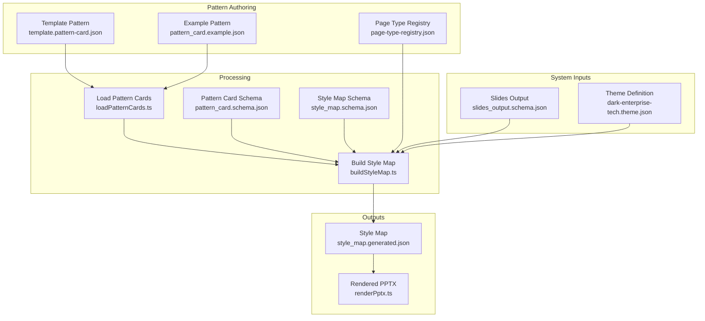
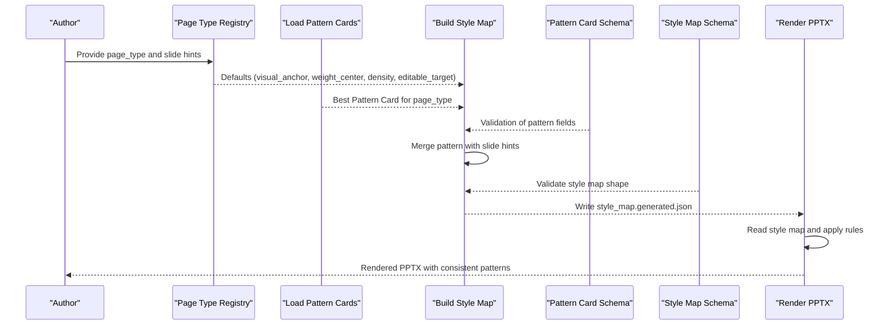
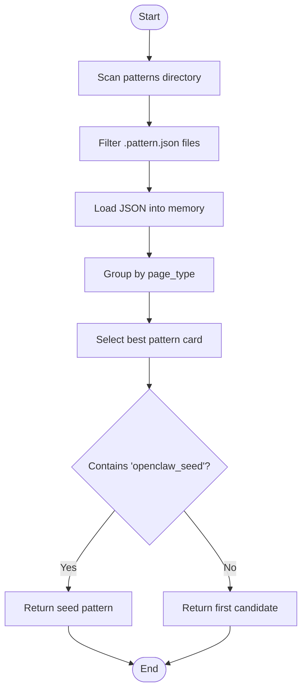
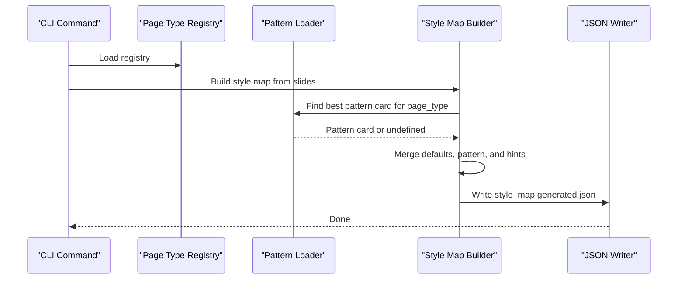
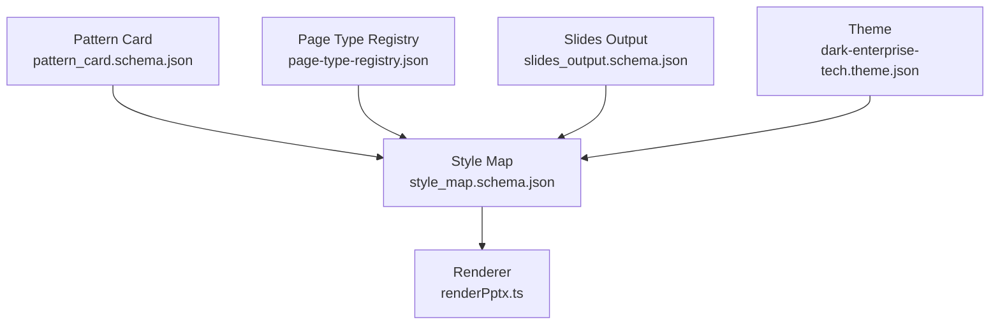

# Pattern Cards

<cite>
**Referenced Files in This Document**
- [pattern_card.schema.json](file://schemas/pattern_card.schema.json)
- [template.pattern-card.json](file://style/patterns/template.pattern-card.json)
- [pattern_card.example.json](file://examples/pattern_card.example.json)
- [page-type-registry.json](file://style/patterns/page-type-registry.json)
- [loadPatternCards.ts](file://src/lib/style/loadPatternCards.ts)
- [buildStyleMap.ts](file://src/commands/buildStyleMap.ts)
- [reference-extraction-workflow.md](file://docs/workflows/reference-extraction-workflow.md)
- [style_map.schema.json](file://schemas/style_map.schema.json)
- [style-intelligence.md](file://references/style-intelligence.md)
- [validated-slide-patterns.md](file://references/validated-slide-patterns.md)
- [dark-enterprise-tech.theme.json](file://style/themes/dark-enterprise-tech.theme.json)
- [slides_output.schema.json](file://schemas/slides_output.schema.json)
- [renderPptx.ts](file://src/commands/renderPptx.ts)
</cite>

## Table of Contents
1. [Introduction](#introduction)
2. [Project Structure](#project-structure)
3. [Core Components](#core-components)
4. [Architecture Overview](#architecture-overview)
5. [Detailed Component Analysis](#detailed-component-analysis)
6. [Dependency Analysis](#dependency-analysis)
7. [Performance Considerations](#performance-considerations)
8. [Troubleshooting Guide](#troubleshooting-guide)
9. [Conclusion](#conclusion)
10. [Appendices](#appendices)

## Introduction
Pattern cards are reusable design blueprints that encode how specific slide types should be composed, arranged, and styled. They capture:
- Page type identity and narrative roles
- Visual anchor and weight center
- Layout and alignment rules
- Image usage guidance and editable target preferences
- Highlight grammar and component recipes
- Anti-patterns and reuse notes

By encapsulating these design decisions, pattern cards enable consistent presentation patterns across diverse topics while preserving flexibility for content adaptation.

## Project Structure
Pattern cards live alongside page-type registries and are consumed by the style-map building pipeline and renderers. The following diagram shows how pattern cards relate to page types, style maps, and rendering.

**Diagram sources**
- [template.pattern-card.json:1-46](file://style/patterns/template.pattern-card.json#L1-L46)
- [pattern_card.example.json:1-54](file://examples/pattern_card.example.json#L1-L54)
- [page-type-registry.json:1-115](file://style/patterns/page-type-registry.json#L1-L115)
- [slides_output.schema.json:35-52](file://schemas/slides_output.schema.json#L35-L52)
- [dark-enterprise-tech.theme.json:1-55](file://style/themes/dark-enterprise-tech.theme.json#L1-L55)
- [loadPatternCards.ts:1-48](file://src/lib/style/loadPatternCards.ts#L1-L48)
- [buildStyleMap.ts:50-109](file://src/commands/buildStyleMap.ts#L50-L109)
- [pattern_card.schema.json:1-75](file://schemas/pattern_card.schema.json#L1-L75)
- [style_map.schema.json:1-70](file://schemas/style_map.schema.json#L1-L70)
- [renderPptx.ts:210-258](file://src/commands/renderPptx.ts#L210-L258)

**Section sources**
- [template.pattern-card.json:1-46](file://style/patterns/template.pattern-card.json#L1-L46)
- [pattern_card.example.json:1-54](file://examples/pattern_card.example.json#L1-L54)
- [page-type-registry.json:1-115](file://style/patterns/page-type-registry.json#L1-L115)
- [slides_output.schema.json:35-52](file://schemas/slides_output.schema.json#L35-L52)
- [dark-enterprise-tech.theme.json:1-55](file://style/themes/dark-enterprise-tech.theme.json#L1-L55)
- [loadPatternCards.ts:1-48](file://src/lib/style/loadPatternCards.ts#L1-L48)
- [buildStyleMap.ts:50-109](file://src/commands/buildStyleMap.ts#L50-L109)
- [pattern_card.schema.json:1-75](file://schemas/pattern_card.schema.json#L1-L75)
- [style_map.schema.json:1-70](file://schemas/style_map.schema.json#L1-L70)
- [renderPptx.ts:210-258](file://src/commands/renderPptx.ts#L210-L258)

## Core Components
- Pattern Card: A JSON object that defines a reusable slide blueprint. See the schema and examples for required and optional fields.
- Page Type Registry: A registry that binds page types to narrative roles, visual anchors, weight centers, density levels, and editable targets.
- Style Map Builder: A command that merges slide inputs with page types and pattern cards to produce a style map with learned patterns.
- Renderer: A command that consumes the style map to drive slide composition and styling.

Key responsibilities:
- Pattern cards define layout rules, alignment rules, image usage, highlight grammar, component recipes, and anti-patterns.
- The registry provides defaults for page types when no pattern card is found.
- The style map builder resolves the best pattern card per page type and augments it with slide-specific hints.
- Renderers consume the style map to enforce composition discipline and theme-appropriate styling.

**Section sources**
- [pattern_card.schema.json:1-75](file://schemas/pattern_card.schema.json#L1-L75)
- [page-type-registry.json:1-115](file://style/patterns/page-type-registry.json#L1-L115)
- [buildStyleMap.ts:50-109](file://src/commands/buildStyleMap.ts#L50-L109)
- [style_map.schema.json:1-70](file://schemas/style_map.schema.json#L1-L70)

## Architecture Overview
The pattern card system participates in a pipeline that transforms structured slide inputs into a style map and then renders PPTX. The sequence below illustrates how pattern cards influence rendering.

**Diagram sources**
- [page-type-registry.json:1-115](file://style/patterns/page-type-registry.json#L1-L115)
- [loadPatternCards.ts:1-48](file://src/lib/style/loadPatternCards.ts#L1-L48)
- [buildStyleMap.ts:50-109](file://src/commands/buildStyleMap.ts#L50-L109)
- [pattern_card.schema.json:1-75](file://schemas/pattern_card.schema.json#L1-L75)
- [style_map.schema.json:1-70](file://schemas/style_map.schema.json#L1-L70)
- [renderPptx.ts:210-258](file://src/commands/renderPptx.ts#L210-L258)

## Detailed Component Analysis

### Pattern Card Structure
A pattern card is a JSON object that encodes:
- Identity and classification: id, page_type, source_references
- Narrative and topic fit: narrative_roles, topic_fit
- Composition anchors: visual_anchor, weight_center
- Layout and alignment: layout_rules, alignment_rules
- Image usage: image_usage (required, mode, placement_guidance)
- Styling grammar: highlight_grammar
- Component recipe: component_recipe
- Editable target: editable_target
- Quality guardrails: anti_patterns
- Adaptation notes: reuse_notes

Validation is enforced by the pattern card schema, ensuring required fields and constrained enumerations.

Practical example references:
- Template pattern card: [template.pattern-card.json:1-46](file://style/patterns/template.pattern-card.json#L1-L46)
- Example pattern card: [pattern_card.example.json:1-54](file://examples/pattern_card.example.json#L1-L54)
- Schema definition: [pattern_card.schema.json:1-75](file://schemas/pattern_card.schema.json#L1-L75)

**Section sources**
- [template.pattern-card.json:1-46](file://style/patterns/template.pattern-card.json#L1-L46)
- [pattern_card.example.json:1-54](file://examples/pattern_card.example.json#L1-L54)
- [pattern_card.schema.json:1-75](file://schemas/pattern_card.schema.json#L1-L75)

### Page Types and Pattern Cards
Page types define the semantic category of a slide and provide default composition attributes. Pattern cards refine or override these defaults when present.

- Page type registry entries include id, narrative_roles, visual_anchor, weight_center, density_level, mvp_priority, and editable_target.
- Pattern cards supply page_type-specific refinements such as layout_rules, alignment_rules, image_usage, highlight_grammar, and component_recipe.
- The style map builder selects the best pattern card per page_type and merges it with registry defaults and slide hints.

References:
- Page type registry: [page-type-registry.json:1-115](file://style/patterns/page-type-registry.json#L1-L115)
- Style map builder: [buildStyleMap.ts:50-109](file://src/commands/buildStyleMap.ts#L50-L109)

**Section sources**
- [page-type-registry.json:1-115](file://style/patterns/page-type-registry.json#L1-L115)
- [buildStyleMap.ts:50-109](file://src/commands/buildStyleMap.ts#L50-L109)

### Pattern Card Loading and Selection
The loader scans the patterns directory for files ending with .pattern.json and loads them into memory. It then filters by page_type and prefers seed patterns that indicate proven stability.

**Diagram sources**
- [loadPatternCards.ts:1-48](file://src/lib/style/loadPatternCards.ts#L1-L48)

**Section sources**
- [loadPatternCards.ts:1-48](file://src/lib/style/loadPatternCards.ts#L1-L48)

### Building the Style Map with Pattern Cards
The style map builder:
- Reads slides output and page-type registry
- Resolves page_type for each slide
- Loads the best pattern card for that page_type
- Merges pattern card fields with slide hints (notes, layout_hints)
- Writes a style map that includes learned_pattern when available

**Diagram sources**
- [buildStyleMap.ts:50-109](file://src/commands/buildStyleMap.ts#L50-L109)
- [loadPatternCards.ts:1-48](file://src/lib/style/loadPatternCards.ts#L1-L48)
- [page-type-registry.json:1-115](file://style/patterns/page-type-registry.json#L1-L115)

**Section sources**
- [buildStyleMap.ts:50-109](file://src/commands/buildStyleMap.ts#L50-L109)
- [loadPatternCards.ts:1-48](file://src/lib/style/loadPatternCards.ts#L1-L48)
- [page-type-registry.json:1-115](file://style/patterns/page-type-registry.json#L1-L115)

### Rendering with Pattern Cards
The renderer consumes the style map to:
- Enforce layout and alignment rules
- Apply highlight grammar and image usage guidance
- Place components according to component_recipe
- Respect editable_target preferences

Example rendering references:
- Header and cover slide rendering: [renderPptx.ts:210-258](file://src/commands/renderPptx.ts#L210-L258)

**Section sources**
- [renderPptx.ts:210-258](file://src/commands/renderPptx.ts#L210-L258)

### Practical Examples of Pattern Card Creation and Modification
- Reference extraction workflow: describes how to extract repeated logic into pattern cards and feed them back into the registry and renderer.
- Style intelligence documentation: outlines what to store and how to think about reusable patterns.
- Validated slide patterns: documents concrete, reusable page types with observed strengths and usage guidance.

References:
- Reference extraction workflow: [reference-extraction-workflow.md:1-73](file://docs/workflows/reference-extraction-workflow.md#L1-L73)
- Style intelligence: [style-intelligence.md:1-93](file://references/style-intelligence.md#L1-L93)
- Validated patterns: [validated-slide-patterns.md:1-345](file://references/validated-slide-patterns.md#L1-L345)

**Section sources**
- [reference-extraction-workflow.md:1-73](file://docs/workflows/reference-extraction-workflow.md#L1-L73)
- [style-intelligence.md:1-93](file://references/style-intelligence.md#L1-L93)
- [validated-slide-patterns.md:1-345](file://references/validated-slide-patterns.md#L1-L345)

## Dependency Analysis
Pattern cards depend on:
- Page type registry for defaults
- Slide inputs for hints (visual_anchor, weight_center, density_level)
- Theme definitions for styling tokens
- Schemas for validation

**Diagram sources**
- [pattern_card.schema.json:1-75](file://schemas/pattern_card.schema.json#L1-L75)
- [style_map.schema.json:1-70](file://schemas/style_map.schema.json#L1-L70)
- [page-type-registry.json:1-115](file://style/patterns/page-type-registry.json#L1-L115)
- [slides_output.schema.json:35-52](file://schemas/slides_output.schema.json#L35-L52)
- [dark-enterprise-tech.theme.json:1-55](file://style/themes/dark-enterprise-tech.theme.json#L1-L55)
- [renderPptx.ts:210-258](file://src/commands/renderPptx.ts#L210-L258)

**Section sources**
- [pattern_card.schema.json:1-75](file://schemas/pattern_card.schema.json#L1-L75)
- [style_map.schema.json:1-70](file://schemas/style_map.schema.json#L1-L70)
- [page-type-registry.json:1-115](file://style/patterns/page-type-registry.json#L1-L115)
- [slides_output.schema.json:35-52](file://schemas/slides_output.schema.json#L35-L52)
- [dark-enterprise-tech.theme.json:1-55](file://style/themes/dark-enterprise-tech.theme.json#L1-L55)
- [renderPptx.ts:210-258](file://src/commands/renderPptx.ts#L210-L258)

## Performance Considerations
- Pattern loading: Scanning and parsing pattern files is O(N) with N being the number of pattern files. Keep pattern files focused and avoid unnecessary nesting.
- Style map building: Merging patterns with slides and registry entries is linear in the number of slides. Prefer caching or incremental updates when iterating on patterns.
- Rendering: Applying learned patterns adds minimal overhead compared to template-based rendering, but ensure component_recipe and image_usage are concise to reduce layout computation.

## Troubleshooting Guide
Common issues and resolutions:
- Unknown page type: Ensure the slide’s page_type matches an entry in the registry. The builder throws an error if the page_type is missing or unknown.
- Missing pattern card: If no pattern card exists for a page_type, the builder falls back to registry defaults. Add a pattern card to refine composition.
- Validation errors: Verify that pattern cards conform to the schema, especially required fields and enumerated values.
- Rendering mismatches: Confirm that the renderer respects learned_pattern fields and editable_target preferences.

**Section sources**
- [buildStyleMap.ts:67-74](file://src/commands/buildStyleMap.ts#L67-L74)
- [pattern_card.schema.json:1-75](file://schemas/pattern_card.schema.json#L1-L75)
- [style_map.schema.json:1-70](file://schemas/style_map.schema.json#L1-L70)

## Conclusion
Pattern cards are the core of the Enterprise PPT System’s design memory. They capture reusable composition logic, enforce alignment discipline, and guide rendering to produce consistent, strategic slides. By organizing patterns around page types, validating with schemas, and integrating with the style map builder and renderer, the system balances consistency with adaptability across topics.

## Appendices

### Best Practices for Pattern Organization
- Keep patterns focused on a single page type and narrative role.
- Use clear, descriptive ids and include seed indicators for proven patterns.
- Document topic_fit to help surface applicable patterns for new topics.
- Record anti_patterns to prevent common mistakes.
- Provide reuse_notes to guide adaptation across domains.

**Section sources**
- [template.pattern-card.json:1-46](file://style/patterns/template.pattern-card.json#L1-L46)
- [pattern_card.example.json:1-54](file://examples/pattern_card.example.json#L1-L54)
- [validated-slide-patterns.md:1-345](file://references/validated-slide-patterns.md#L1-L345)

### Strategies for Maintaining Design Consistency While Allowing Flexibility
- Use registry defaults as the baseline and refine with pattern cards.
- Leverage component_recipe to standardize component arrangements.
- Apply highlight_grammar and image_usage to maintain visual discipline.
- Allow topic_fit and reuse_notes to guide adaptation without sacrificing core composition rules.

**Section sources**
- [page-type-registry.json:1-115](file://style/patterns/page-type-registry.json#L1-L115)
- [buildStyleMap.ts:75-98](file://src/commands/buildStyleMap.ts#L75-L98)
- [style_map.schema.json:1-70](file://schemas/style_map.schema.json#L1-L70)