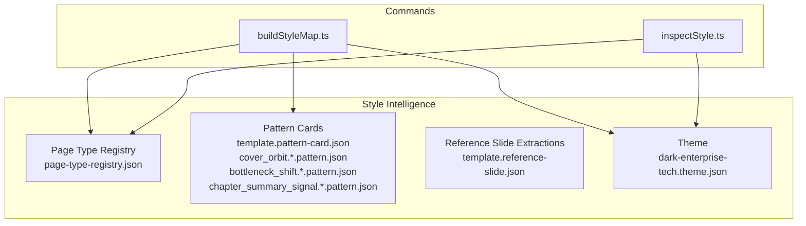
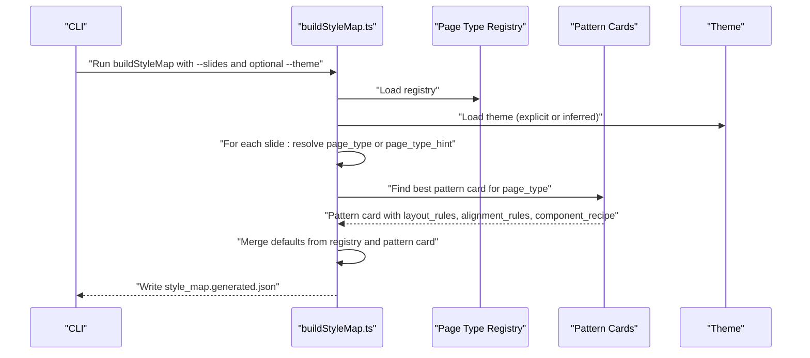
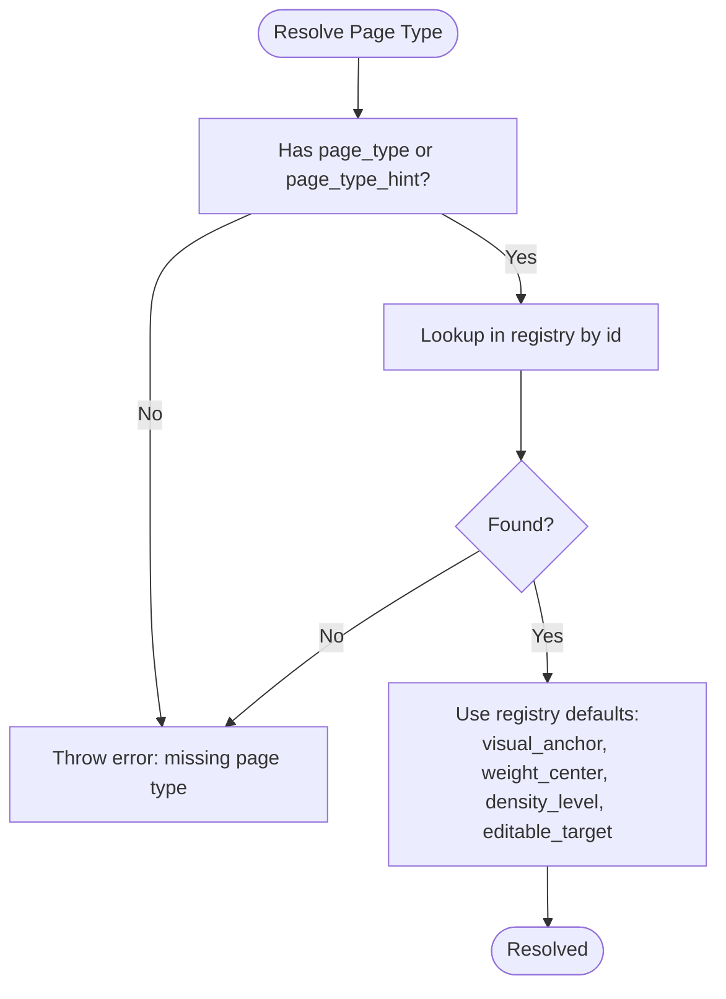
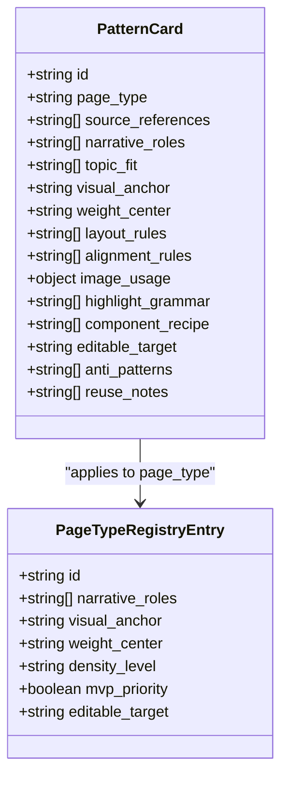
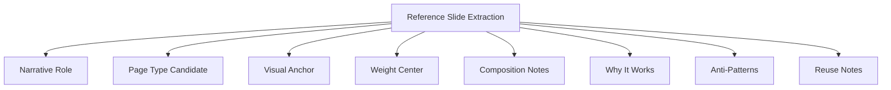
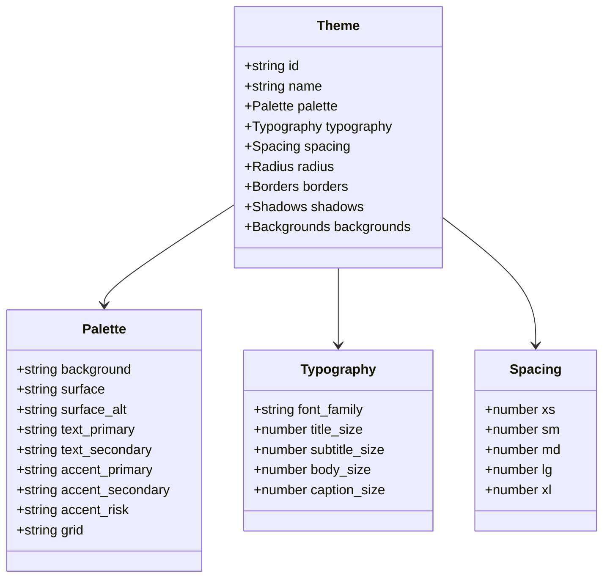
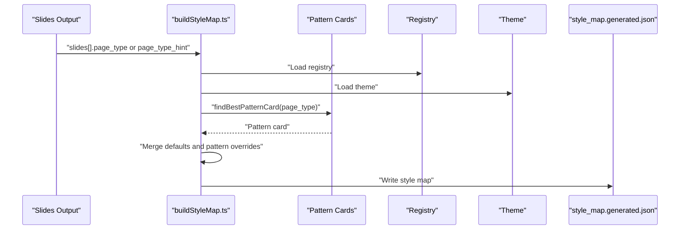
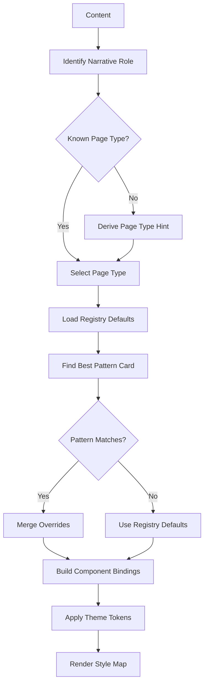
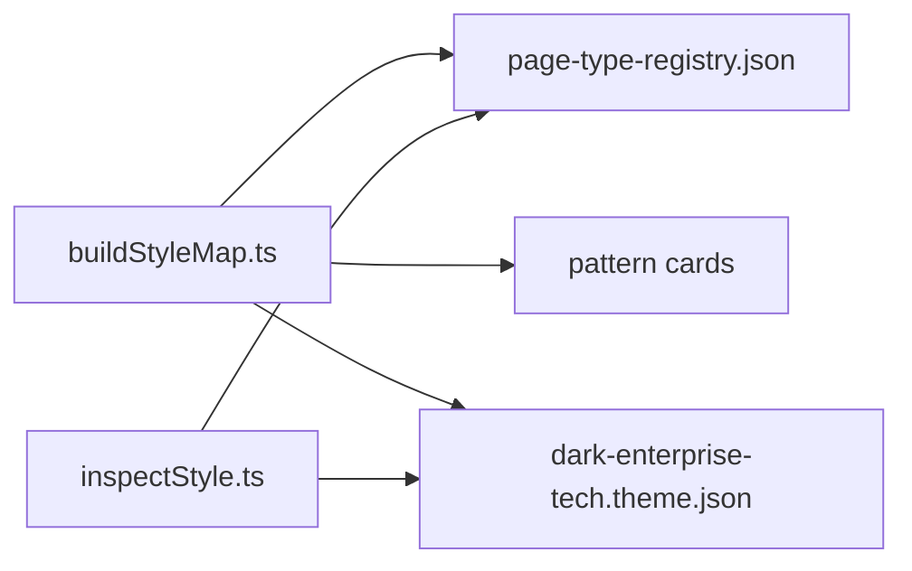

# Style Intelligence

<cite>
**Referenced Files in This Document**
- [style-intelligence.md](file://references/style-intelligence.md)
- [validated-slide-patterns.md](file://references/validated-slide-patterns.md)
- [style-lessons-from-openclaw-deck.md](file://references/style-lessons-from-openclaw-deck.md)
- [page-type-registry.json](file://style/patterns/page-type-registry.json)
- [template.pattern-card.json](file://style/patterns/template.pattern-card.json)
- [cover_orbit.openclaw-seed.pattern.json](file://style/patterns/cover_orbit.openclaw-seed.pattern.json)
- [bottleneck_shift.openclaw-seed.pattern.json](file://style/patterns/bottleneck_shift.openclaw-seed.pattern.json)
- [chapter_summary_signal.openclaw-seed.pattern.json](file://style/patterns/chapter_summary_signal.openclaw-seed.pattern.json)
- [template.reference-slide.json](file://style/reference_extractions/template.reference-slide.json)
- [dark-enterprise-tech.theme.json](file://style/themes/dark-enterprise-tech.theme.json)
- [buildStyleMap.ts](file://src/commands/buildStyleMap.ts)
- [inspectStyle.ts](file://src/commands/inspectStyle.ts)
</cite>

## Table of Contents
1. [Introduction](#introduction)
2. [Project Structure](#project-structure)
3. [Core Components](#core-components)
4. [Architecture Overview](#architecture-overview)
5. [Detailed Component Analysis](#detailed-component-analysis)
6. [Dependency Analysis](#dependency-analysis)
7. [Performance Considerations](#performance-considerations)
8. [Troubleshooting Guide](#troubleshooting-guide)
9. [Conclusion](#conclusion)
10. [Appendices](#appendices)

## Introduction
This document explains the style intelligence system that powers automated design decision-making in the Enterprise PPT System. The system transforms content structure into intentional visual expression by selecting page types, matching reusable patterns, and applying consistent styling guided by themes and reference materials. It emphasizes human-in-the-loop oversight, customization, and iterative improvement to maintain design quality while enabling scalable automation.

## Project Structure
The style intelligence system is organized around:
- Pattern cards and page-type registry that encode reusable page designs and their narrative roles
- Reference slide extractions that capture design insights and anti-patterns
- Themes that define token-based visual systems
- Commands that orchestrate style mapping and inspection

**Diagram sources**
- [page-type-registry.json:1-115](file://style/patterns/page-type-registry.json#L1-L115)
- [template.pattern-card.json:1-46](file://style/patterns/template.pattern-card.json#L1-L46)
- [cover_orbit.openclaw-seed.pattern.json:1-46](file://style/patterns/cover_orbit.openclaw-seed.pattern.json#L1-L46)
- [bottleneck_shift.openclaw-seed.pattern.json:1-46](file://style/patterns/bottleneck_shift.openclaw-seed.pattern.json#L1-L46)
- [chapter_summary_signal.openclaw-seed.pattern.json:1-45](file://style/patterns/chapter_summary_signal.openclaw-seed.pattern.json#L1-L45)
- [template.reference-slide.json:1-65](file://style/reference_extractions/template.reference-slide.json#L1-L65)
- [dark-enterprise-tech.theme.json:1-55](file://style/themes/dark-enterprise-tech.theme.json#L1-L55)
- [buildStyleMap.ts:1-110](file://src/commands/buildStyleMap.ts#L1-L110)
- [inspectStyle.ts:1-14](file://src/commands/inspectStyle.ts#L1-L14)

**Section sources**
- [style-intelligence.md:1-93](file://references/style-intelligence.md#L1-L93)
- [page-type-registry.json:1-115](file://style/patterns/page-type-registry.json#L1-L115)
- [template.pattern-card.json:1-46](file://style/patterns/template.pattern-card.json#L1-L46)
- [template.reference-slide.json:1-65](file://style/reference_extractions/template.reference-slide.json#L1-L65)
- [dark-enterprise-tech.theme.json:1-55](file://style/themes/dark-enterprise-tech.theme.json#L1-L55)
- [buildStyleMap.ts:1-110](file://src/commands/buildStyleMap.ts#L1-L110)
- [inspectStyle.ts:1-14](file://src/commands/inspectStyle.ts#L1-L14)

## Core Components
- Page Type Registry: Defines page types with narrative roles, visual anchors, weight centers, density levels, and editable targets. Used to select appropriate page types for content.
- Pattern Cards: Encode layout rules, alignment rules, highlight grammar, component recipes, and anti-patterns for reuse. Provide learned guidance for consistent styling.
- Reference Slide Extractions: Capture narrative role, page type candidate, visual anchor, weight center, composition notes, and reuse/adaptation guidance.
- Theme: Token-based visual system (colors, typography, spacing, radii, borders, shadows, backgrounds) ensuring consistent styling across pages.
- Commands:
  - buildStyleMap: Consumes slides output, resolves page types, selects best pattern cards, merges registry defaults, and writes a style map with learned patterns and component bindings.
  - inspectStyle: Inspects registry and theme, enumerates MVP page types, and prints system state.

**Section sources**
- [page-type-registry.json:1-115](file://style/patterns/page-type-registry.json#L1-L115)
- [template.pattern-card.json:1-46](file://style/patterns/template.pattern-card.json#L1-L46)
- [template.reference-slide.json:1-65](file://style/reference_extractions/template.reference-slide.json#L1-L65)
- [dark-enterprise-tech.theme.json:1-55](file://style/themes/dark-enterprise-tech.theme.json#L1-L55)
- [buildStyleMap.ts:1-110](file://src/commands/buildStyleMap.ts#L1-L110)
- [inspectStyle.ts:1-14](file://src/commands/inspectStyle.ts#L1-L14)

## Architecture Overview
The style intelligence pipeline connects content structure to visual expression via page type selection, pattern matching, and theme-driven styling.

**Diagram sources**
- [buildStyleMap.ts:50-109](file://src/commands/buildStyleMap.ts#L50-L109)
- [page-type-registry.json:1-115](file://style/patterns/page-type-registry.json#L1-L115)
- [template.pattern-card.json:1-46](file://style/patterns/template.pattern-card.json#L1-L46)
- [dark-enterprise-tech.theme.json:1-55](file://style/themes/dark-enterprise-tech.theme.json#L1-L55)

## Detailed Component Analysis

### Page Type Registry
- Purpose: Define reusable page types with metadata for narrative roles, visual anchors, weight centers, density levels, and editable targets.
- Usage: Provides fallbacks and defaults when pattern cards are absent or incomplete.
- MVP priority: Some page types are prioritized for rapid delivery.

**Diagram sources**
- [buildStyleMap.ts:64-74](file://src/commands/buildStyleMap.ts#L64-L74)
- [page-type-registry.json:1-115](file://style/patterns/page-type-registry.json#L1-L115)

**Section sources**
- [page-type-registry.json:1-115](file://style/patterns/page-type-registry.json#L1-L115)
- [buildStyleMap.ts:64-74](file://src/commands/buildStyleMap.ts#L64-L74)

### Pattern Cards
- Purpose: Encapsulate learned design guidance for page types, including layout rules, alignment rules, highlight grammar, component recipes, and anti-patterns.
- Matching: Pattern cards are selected per page type to inform component bindings and styling.
- Example patterns:
  - Cover Orbit: Hero visual on right, headline stack on left, strong visual weight center.
  - Bottleneck Shift: Left-heavy thesis, right support cards, grounding visual in lower-left.
  - Chapter Summary Signal: Dominant summary block, implication panel, compact signal cue.

**Diagram sources**
- [template.pattern-card.json:1-46](file://style/patterns/template.pattern-card.json#L1-L46)
- [cover_orbit.openclaw-seed.pattern.json:1-46](file://style/patterns/cover_orbit.openclaw-seed.pattern.json#L1-L46)
- [bottleneck_shift.openclaw-seed.pattern.json:1-46](file://style/patterns/bottleneck_shift.openclaw-seed.pattern.json#L1-L46)
- [chapter_summary_signal.openclaw-seed.pattern.json:1-45](file://style/patterns/chapter_summary_signal.openclaw-seed.pattern.json#L1-L45)
- [page-type-registry.json:1-115](file://style/patterns/page-type-registry.json#L1-L115)

**Section sources**
- [template.pattern-card.json:1-46](file://style/patterns/template.pattern-card.json#L1-L46)
- [cover_orbit.openclaw-seed.pattern.json:1-46](file://style/patterns/cover_orbit.openclaw-seed.pattern.json#L1-L46)
- [bottleneck_shift.openclaw-seed.pattern.json:1-46](file://style/patterns/bottleneck_shift.openclaw-seed.pattern.json#L1-L46)
- [chapter_summary_signal.openclaw-seed.pattern.json:1-45](file://style/patterns/chapter_summary_signal.openclaw-seed.pattern.json#L1-L45)

### Reference Slide Extractions
- Purpose: Capture narrative role, page type candidate, visual anchor, weight center, composition notes, and reuse/adaptation guidance from reference slides.
- Role: Inform pattern selection and validate design choices against real-world examples.

**Diagram sources**
- [template.reference-slide.json:1-65](file://style/reference_extractions/template.reference-slide.json#L1-L65)

**Section sources**
- [template.reference-slide.json:1-65](file://style/reference_extractions/template.reference-slide.json#L1-L65)

### Theme System
- Purpose: Provide token-based visual system (palette, typography, spacing, radii, borders, shadows, backgrounds) for consistent styling.
- Integration: Applied by rendering pipeline to ensure visual coherence across slides.

**Diagram sources**
- [dark-enterprise-tech.theme.json:1-55](file://style/themes/dark-enterprise-tech.theme.json#L1-L55)

**Section sources**
- [dark-enterprise-tech.theme.json:1-55](file://style/themes/dark-enterprise-tech.theme.json#L1-L55)

### Style Resolution and Pattern Matching
- Resolution steps:
  - Resolve page type from input slides or hints
  - Load registry entry and theme
  - Find best pattern card for the page type
  - Merge pattern card overrides with registry defaults
  - Build component bindings from visual anchors and component recipes
- Outputs:
  - Style map with page type, visual anchor, weight center, density level, component bindings, editable target, and learned pattern metadata

**Diagram sources**
- [buildStyleMap.ts:64-100](file://src/commands/buildStyleMap.ts#L64-L100)
- [page-type-registry.json:1-115](file://style/patterns/page-type-registry.json#L1-L115)
- [template.pattern-card.json:1-46](file://style/patterns/template.pattern-card.json#L1-L46)

**Section sources**
- [buildStyleMap.ts:64-100](file://src/commands/buildStyleMap.ts#L64-L100)

### Practical Examples of Style Intelligence in Action
- Cover Orbit:
  - Pattern: Right-side hero visual balanced by a left headline stack
  - Layout rules: Reserve dominant zones; keep metadata compact
  - Alignment rules: Shared left grid; fixed right-frame offsets
  - Image usage: Hero mode; placement guidance to establish focal point
  - Highlight grammar: Neutral headlines; accent for signal text; glow around focal anchor
  - Anti-patterns: Shrinking hero; multiple accent colors; breaking left-grid alignment
- Bottleneck Shift:
  - Pattern: Oversized thesis on left; right support cards; grounding visual in lower-left
  - Layout rules: Drive page with thesis; align support cards; prevent top-heavy composition
  - Alignment rules: Shared frame boundaries; grounded visual aligns to left column
  - Image usage: Contextual mode; grounding image panel
  - Highlight grammar: Oversized thesis; limited accent; gradient in grounding area
  - Anti-patterns: Empty lower box; breaking alignment; too many support cards
- Chapter Summary Signal:
  - Pattern: Dominant summary block; implication panel; compact signal cue
  - Layout rules: One dominant takeaway; low-density to emphasize intentionality
  - Alignment rules: Shared left grid; signal cue aligns to outer frame
  - Image usage: Optional texture or accent; page stands without hero
  - Highlight grammar: Neutral main takeaway; accent on decision cue
  - Anti-patterns: Three equal cards; dense bullet lists; overdecorating conclusion

**Section sources**
- [cover_orbit.openclaw-seed.pattern.json:1-46](file://style/patterns/cover_orbit.openclaw-seed.pattern.json#L1-L46)
- [bottleneck_shift.openclaw-seed.pattern.json:1-46](file://style/patterns/bottleneck_shift.openclaw-seed.pattern.json#L1-L46)
- [chapter_summary_signal.openclaw-seed.pattern.json:1-45](file://style/patterns/chapter_summary_signal.openclaw-seed.pattern.json#L1-L45)

### Decision Trees for Pattern Selection
- Content → Page Type → Pattern → Style Application
- Decision nodes:
  - Narrative role drives page type selection
  - Topic fit validates pattern applicability
  - Visual anchor and weight center guide layout and density
  - Anti-patterns prevent weak compositions

**Diagram sources**
- [validated-slide-patterns.md:331-345](file://references/validated-slide-patterns.md#L331-L345)
- [page-type-registry.json:1-115](file://style/patterns/page-type-registry.json#L1-L115)
- [template.pattern-card.json:1-46](file://style/patterns/template.pattern-card.json#L1-L46)
- [buildStyleMap.ts:64-100](file://src/commands/buildStyleMap.ts#L64-L100)

## Dependency Analysis
- buildStyleMap depends on:
  - Page Type Registry for defaults
  - Pattern Cards for learned guidance
  - Theme for token-based styling
- inspectStyle depends on:
  - Page Type Registry for enumeration
  - Theme for display

**Diagram sources**
- [buildStyleMap.ts:1-110](file://src/commands/buildStyleMap.ts#L1-L110)
- [inspectStyle.ts:1-14](file://src/commands/inspectStyle.ts#L1-L14)
- [page-type-registry.json:1-115](file://style/patterns/page-type-registry.json#L1-L115)
- [dark-enterprise-tech.theme.json:1-55](file://style/themes/dark-enterprise-tech.theme.json#L1-L55)

**Section sources**
- [buildStyleMap.ts:1-110](file://src/commands/buildStyleMap.ts#L1-L110)
- [inspectStyle.ts:1-14](file://src/commands/inspectStyle.ts#L1-L14)

## Performance Considerations
- Minimize repeated file loads by caching registry and theme in memory during command execution.
- Parallelize pattern card lookups when processing multiple slides concurrently.
- Keep pattern and reference extraction JSONs lean to reduce parsing overhead.
- Prefer streaming writes for large style maps to avoid memory spikes.

## Troubleshooting Guide
- Missing page type or hint:
  - Symptom: Error indicating slide lacks page_type or page_type_hint.
  - Fix: Provide page_type or page_type_hint in slides output.
- Unknown page type:
  - Symptom: Error indicating unknown page type for a slide.
  - Fix: Add the page type to the registry or correct the identifier.
- Missing pattern card:
  - Symptom: Registry defaults applied without pattern overrides.
  - Fix: Ensure a matching pattern card exists for the page type.
- Theme mismatch:
  - Symptom: Inconsistent colors or tokens.
  - Fix: Verify theme ID and ensure the theme file is present and valid.

**Section sources**
- [buildStyleMap.ts:52-74](file://src/commands/buildStyleMap.ts#L52-L74)

## Conclusion
The style intelligence system enables automated yet intentional design by connecting content narrative roles to curated page types, learned patterns, and token-based themes. It balances automation with human oversight, supports customization via pattern overrides, and improves consistency through validated patterns and lessons learned from real decks.

## Appendices

### Best Practices for Maintaining Design Quality While Enabling Automation
- Use narrative roles to drive page type selection, not convenience.
- Place at least one anchor object on every important slide.
- Treat visual emptiness as a quality defect; ensure every container has a meaningful object or grouping.
- Vary internal composition within a consistent theme.
- Use model judgment to decide expression form, not only wording.

**Section sources**
- [style-lessons-from-openclaw-deck.md:155-161](file://references/style-lessons-from-openclaw-deck.md#L155-L161)

### Strategies for Improving Design Consistency
- Maintain a growing library of validated slide patterns and lessons learned.
- Regularly inspect and refine the page type registry and pattern cards.
- Apply theme tokens consistently across all components.
- Document anti-patterns and reuse notes to guide future adaptations.

**Section sources**
- [validated-slide-patterns.md:1-345](file://references/validated-slide-patterns.md#L1-L345)
- [style-lessons-from-openclaw-deck.md:1-161](file://references/style-lessons-from-openclaw-deck.md#L1-L161)