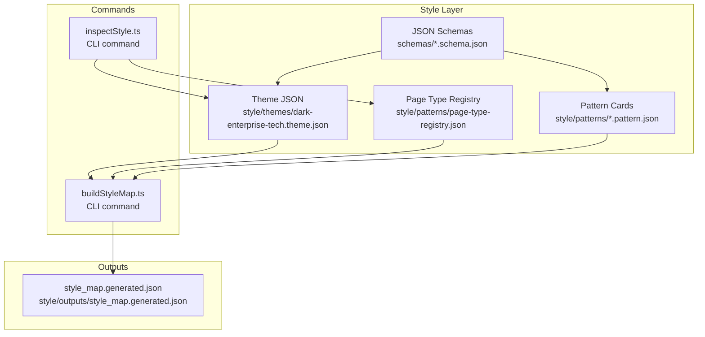
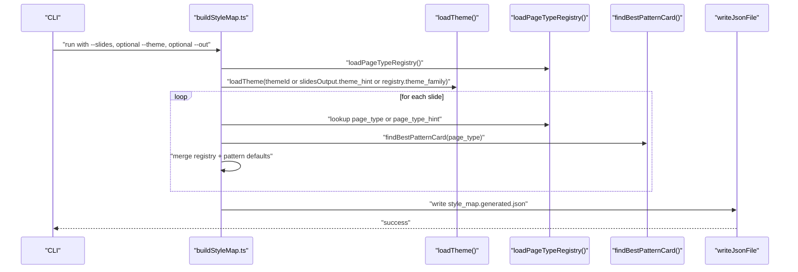
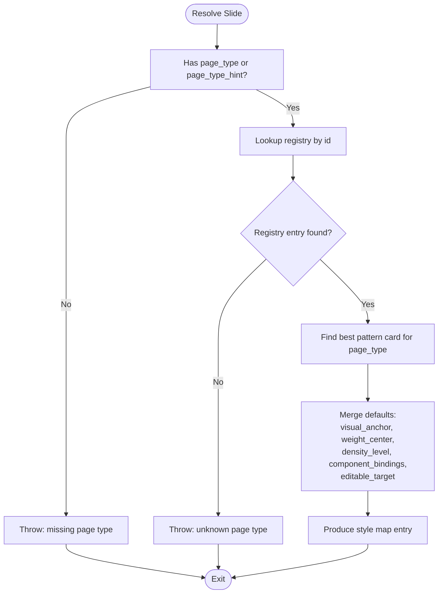
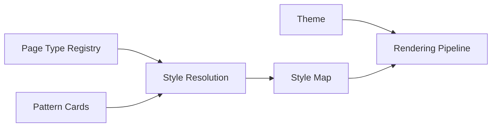

# Style System

<cite>
**Referenced Files in This Document**
- [dark-enterprise-tech.theme.json](file://style/themes/dark-enterprise-tech.theme.json)
- [page-type-registry.json](file://style/patterns/page-type-registry.json)
- [template.pattern-card.json](file://style/patterns/template.pattern-card.json)
- [bottleneck_shift.openclaw-seed.pattern.json](file://style/patterns/bottleneck_shift.openclaw-seed.pattern.json)
- [chapter_summary_signal.openclaw-seed.pattern.json](file://style/patterns/chapter_summary_signal.openclaw-seed.pattern.json)
- [cover_orbit.openclaw-seed.pattern.json](file://style/patterns/cover_orbit.openclaw-seed.pattern.json)
- [openclaw-executive--seed-01--cover-orbit.json](file://style/reference_extractions/openclaw-executive--seed-01--cover-orbit.json)
- [theme.schema.json](file://schemas/theme.schema.json)
- [pattern_card.schema.json](file://schemas/pattern_card.schema.json)
- [buildStyleMap.ts](file://src/commands/buildStyleMap.ts)
- [inspectStyle.ts](file://src/commands/inspectStyle.ts)
- [style_map.generated.json](file://style/outputs/style_map.generated.json)
</cite>

## Table of Contents
1. [Introduction](#introduction)
2. [Project Structure](#project-structure)
3. [Core Components](#core-components)
4. [Architecture Overview](#architecture-overview)
5. [Detailed Component Analysis](#detailed-component-analysis)
6. [Dependency Analysis](#dependency-analysis)
7. [Performance Considerations](#performance-considerations)
8. [Troubleshooting Guide](#troubleshooting-guide)
9. [Conclusion](#conclusion)
10. [Appendices](#appendices)

## Introduction
This document describes the Enterprise PPT System’s design intelligence layer with a focus on the style system. It explains how themes define consistent visual foundations, how page types classify slides, and how pattern cards encode reusable design components. It also documents the relationships among themes, patterns, and page types, the style resolution process, and how the system integrates with the rendering pipeline. Practical examples illustrate theme customization, pattern creation, and component composition, along with best practices for extensibility and maintenance.

## Project Structure
The style system is organized around three pillars:
- Themes: JSON-defined visual foundations (colors, typography, spacing, radii, borders, shadows, backgrounds).
- Page Types: A registry that categorizes slides by narrative and visual roles, anchors, and layout characteristics.
- Pattern Cards: JSON specifications of proven slide compositions, including component recipes, alignment rules, and anti-patterns.

**Diagram sources**
- [dark-enterprise-tech.theme.json:1-55](file://style/themes/dark-enterprise-tech.theme.json#L1-L55)
- [page-type-registry.json:1-115](file://style/patterns/page-type-registry.json#L1-L115)
- [template.pattern-card.json:1-46](file://style/patterns/template.pattern-card.json#L1-L46)
- [buildStyleMap.ts:1-110](file://src/commands/buildStyleMap.ts#L1-L110)
- [inspectStyle.ts:1-14](file://src/commands/inspectStyle.ts#L1-L14)
- [style_map.generated.json:1-142](file://style/outputs/style_map.generated.json#L1-L142)

**Section sources**
- [dark-enterprise-tech.theme.json:1-55](file://style/themes/dark-enterprise-tech.theme.json#L1-L55)
- [page-type-registry.json:1-115](file://style/patterns/page-type-registry.json#L1-L115)
- [template.pattern-card.json:1-46](file://style/patterns/template.pattern-card.json#L1-L46)
- [buildStyleMap.ts:1-110](file://src/commands/buildStyleMap.ts#L1-L110)
- [inspectStyle.ts:1-14](file://src/commands/inspectStyle.ts#L1-L14)
- [style_map.generated.json:1-142](file://style/outputs/style_map.generated.json#L1-L142)

## Core Components
- Theme: Defines palette, typography, spacing, radius, borders, shadows, and backgrounds. Used to resolve concrete visual attributes during rendering.
- Page Type Registry: Associates each slide with a canonical page type, including narrative roles, visual anchor, weight center, density level, and editable target.
- Pattern Card: Encodes a reusable slide composition with component recipe, layout and alignment rules, highlight grammar, image usage guidance, and anti-patterns.
- Style Map: The output of style resolution, binding each slide to a page type, visual anchor, weight center, density level, component bindings, editable target, and optionally a learned pattern.

**Section sources**
- [dark-enterprise-tech.theme.json:1-55](file://style/themes/dark-enterprise-tech.theme.json#L1-L55)
- [page-type-registry.json:1-115](file://style/patterns/page-type-registry.json#L1-L115)
- [template.pattern-card.json:1-46](file://style/patterns/template.pattern-card.json#L1-L46)
- [buildStyleMap.ts:24-48](file://src/commands/buildStyleMap.ts#L24-L48)
- [style_map.generated.json:1-142](file://style/outputs/style_map.generated.json#L1-L142)

## Architecture Overview
The style system resolves a set of narrative-driven slide definitions into a style map that guides the rendering pipeline. The process:
- Load a theme (explicit or inferred from registry/theme family).
- Load the page type registry.
- For each slide, resolve page type and compute style properties.
- Find the best pattern card for the page type.
- Merge registry defaults with pattern overrides to produce component bindings and editable target.
- Write the style map for downstream rendering.

**Diagram sources**
- [buildStyleMap.ts:50-109](file://src/commands/buildStyleMap.ts#L50-L109)
- [page-type-registry.json:1-115](file://style/patterns/page-type-registry.json#L1-L115)
- [style_map.generated.json:1-142](file://style/outputs/style_map.generated.json#L1-L142)

## Detailed Component Analysis

### Theme Management
Themes encapsulate the visual foundation. They include:
- Palette: background, surface, text, accents, and grid.
- Typography: font family and sizes.
- Spacing: named units (xs, sm, md, lg, xl).
- Radius and Borders: shape and border definitions.
- Shadows: card and special glows.
- Backgrounds: base, overlay, hero descriptors.

Validation is enforced via a JSON schema that requires core keys and allows additional properties for extensibility.

Practical customization tips:
- Keep palette harmonious; limit accent usage to reinforce hierarchy.
- Align typography scales with content density expectations per page type.
- Use spacing consistently across components to maintain rhythm.
- Define shadow and glow sparingly to avoid visual noise.

**Section sources**
- [dark-enterprise-tech.theme.json:1-55](file://style/themes/dark-enterprise-tech.theme.json#L1-L55)
- [theme.schema.json:1-58](file://schemas/theme.schema.json#L1-L58)

### Page Type Registry
The registry classifies slides by:
- Canonical id and narrative roles.
- Visual anchor (component id that anchors the composition).
- Weight center (layout balance hint).
- Density level (low/medium/high).
- Editable target (rendering mode for authoring flexibility).

This enables consistent classification and fallback behavior when pattern matching is incomplete.

**Section sources**
- [page-type-registry.json:1-115](file://style/patterns/page-type-registry.json#L1-L115)

### Pattern Card System
Pattern cards capture reusable slide compositions:
- Identification and page type linkage.
- Narrative roles and topic fit.
- Visual anchor and weight center.
- Layout and alignment rules.
- Highlight grammar and image usage guidance.
- Component recipe (ordered list of components).
- Editable target and anti-patterns.
- Reuse notes and source references.

Pattern cards are discovered by page type and merged into the style map, enriching the resolved slide with learned composition guidance.

Examples:
- Cover Orbit: emphasizes a right-side hero balanced by a left headline stack.
- Bottleneck Shift: prioritizes a large thesis with grounded supporting visuals.
- Chapter Summary Signal: focuses on a dominant takeaway with a compact signal cue.

**Section sources**
- [template.pattern-card.json:1-46](file://style/patterns/template.pattern-card.json#L1-L46)
- [cover_orbit.openclaw-seed.pattern.json:1-46](file://style/patterns/cover_orbit.openclaw-seed.pattern.json#L1-L46)
- [bottleneck_shift.openclaw-seed.pattern.json:1-46](file://style/patterns/bottleneck_shift.openclaw-seed.pattern.json#L1-L46)
- [chapter_summary_signal.openclaw-seed.pattern.json:1-45](file://style/patterns/chapter_summary_signal.openclaw-seed.pattern.json#L1-L45)

### Style Resolution and Pattern Matching
The resolution algorithm:
- Validates presence of page_type or page_type_hint.
- Resolves registry entry by id.
- Finds the best pattern card for the page type.
- Merges defaults:
  - visual_anchor: pattern override > slide hint > registry fallback.
  - weight_center: pattern override > slide hint > registry fallback.
  - density_level: slide hint > registry fallback.
  - component_bindings: starts with registry visual_anchor, adds pattern component_recipe.
  - editable_target: pattern override > registry fallback.
- Produces learned_pattern metadata when a pattern is applied.

**Diagram sources**
- [buildStyleMap.ts:64-100](file://src/commands/buildStyleMap.ts#L64-L100)
- [page-type-registry.json:1-115](file://style/patterns/page-type-registry.json#L1-L115)
- [template.pattern-card.json:1-46](file://style/patterns/template.pattern-card.json#L1-L46)

**Section sources**
- [buildStyleMap.ts:64-100](file://src/commands/buildStyleMap.ts#L64-L100)

### Rendering Pipeline Integration
The style map produced by the style resolver provides:
- theme_family for rendering to select the appropriate theme.
- Per-slide page_type, visual_anchor, weight_center, density_level, component_bindings, and editable_target.
- Optional learned_pattern metadata to guide authoring and review.

This structured output enables downstream rendering stages to:
- Apply theme tokens to components.
- Compose layouts according to visual anchors and weight centers.
- Enforce alignment and density rules.
- Choose rendering modes based on editable targets.

**Section sources**
- [style_map.generated.json:1-142](file://style/outputs/style_map.generated.json#L1-L142)
- [buildStyleMap.ts:102-109](file://src/commands/buildStyleMap.ts#L102-L109)

### Practical Examples

#### Theme Customization
- Objective: Create a “Light Enterprise Tech” variant.
- Steps:
  - Duplicate the existing theme JSON.
  - Adjust palette hues to light equivalents.
  - Tune typography sizes and spacing to match lighter contrast expectations.
  - Validate against the theme schema.
- Outcome: A new theme family that preserves design system consistency while adapting tone.

**Section sources**
- [dark-enterprise-tech.theme.json:1-55](file://style/themes/dark-enterprise-tech.theme.json#L1-L55)
- [theme.schema.json:1-58](file://schemas/theme.schema.json#L1-L58)

#### Pattern Creation
- Objective: Add a pattern for “Risk Split.”
- Steps:
  - Identify the page type id in the registry.
  - Author a pattern card with:
    - visual_anchor and weight_center aligned to the intended composition.
    - layout_rules and alignment_rules reflecting composition discipline.
    - component_recipe enumerating core UI primitives.
    - highlight_grammar and image_usage guidance.
    - anti_patterns and reuse_notes for quality control.
  - Validate against the pattern card schema.
- Outcome: A reusable pattern that can be matched automatically and surfaced in the style map.

**Section sources**
- [page-type-registry.json:77-85](file://style/patterns/page-type-registry.json#L77-L85)
- [template.pattern-card.json:1-46](file://style/patterns/template.pattern-card.json#L1-L46)
- [pattern_card.schema.json:1-75](file://schemas/pattern_card.schema.json#L1-L75)

#### Component Composition
- Objective: Compose a “Chapter Summary Signal” slide.
- Steps:
  - Resolve page_type to “chapter_summary_signal.”
  - Pattern provides component_recipe: summary text panel, implication panel, signal cue card.
  - Apply theme tokens for typography and spacing.
  - Enforce alignment rules to keep the signal cue aligned to the summary grid.
  - Use image_usage guidance to decide whether a texture is optional.
- Outcome: A concise, high-impact summary slide with consistent visual grammar.

**Section sources**
- [chapter_summary_signal.openclaw-seed.pattern.json:1-45](file://style/patterns/chapter_summary_signal.openclaw-seed.pattern.json#L1-L45)
- [style_map.generated.json:100-139](file://style/outputs/style_map.generated.json#L100-L139)

## Dependency Analysis
The style system exhibits clear separation of concerns:
- Themes are consumed by rendering; they do not depend on patterns or page types.
- Page types provide classification and fallbacks; they do not depend on patterns.
- Pattern cards are discovered by page type and merged into the style map.
- The CLI commands orchestrate loading, matching, and writing the style map.

**Diagram sources**
- [dark-enterprise-tech.theme.json:1-55](file://style/themes/dark-enterprise-tech.theme.json#L1-L55)
- [page-type-registry.json:1-115](file://style/patterns/page-type-registry.json#L1-L115)
- [template.pattern-card.json:1-46](file://style/patterns/template.pattern-card.json#L1-L46)
- [buildStyleMap.ts:50-109](file://src/commands/buildStyleMap.ts#L50-L109)
- [style_map.generated.json:1-142](file://style/outputs/style_map.generated.json#L1-L142)

**Section sources**
- [buildStyleMap.ts:50-109](file://src/commands/buildStyleMap.ts#L50-L109)

## Performance Considerations
- Minimize repeated IO: cache loaded registry and theme objects in memory during a single run.
- De-duplicate component bindings: use sets to merge visual anchors and component recipes.
- Batch processing: process slides concurrently with bounded concurrency to improve throughput.
- Schema validation: pre-validate inputs to fail fast and reduce runtime errors.

## Troubleshooting Guide
Common issues and resolutions:
- Missing page_type or page_type_hint:
  - Symptom: Error indicating missing classification.
  - Fix: Provide page_type or page_type_hint in the slides input.
- Unknown page type:
  - Symptom: Error indicating an unrecognized id.
  - Fix: Add the id to the page type registry or correct the value.
- Missing pattern for a page type:
  - Symptom: Slide resolved without learned_pattern metadata.
  - Fix: Create a pattern card for the page type and ensure it passes schema validation.
- Theme mismatch:
  - Symptom: Inconsistent rendering or invalid tokens.
  - Fix: Validate theme JSON against the theme schema and ensure all required keys are present.

**Section sources**
- [buildStyleMap.ts:67-74](file://src/commands/buildStyleMap.ts#L67-L74)
- [page-type-registry.json:1-115](file://style/patterns/page-type-registry.json#L1-L115)
- [theme.schema.json:1-58](file://schemas/theme.schema.json#L1-L58)
- [pattern_card.schema.json:1-75](file://schemas/pattern_card.schema.json#L1-L75)

## Conclusion
The Enterprise PPT System’s style system couples a robust theme model with a page type registry and a library of validated pattern cards. Through deterministic resolution and a clear style map output, it ensures consistent visual design at scale. By following the provided schemas, patterns, and best practices, teams can extend the system efficiently and maintain design integrity across large decks.

## Appendices

### Best Practices for Pattern Creation
- Ground patterns in real reference extractions to ensure fidelity to successful compositions.
- Keep component recipes minimal and focused on core primitives.
- Encode explicit layout and alignment rules to reduce ambiguity.
- Provide highlight grammar and image usage guidance to preserve visual discipline.
- Include anti-patterns and reuse notes to guide adoption and prevent misuse.

**Section sources**
- [openclaw-executive--seed-01--cover-orbit.json:1-72](file://style/reference_extractions/openclaw-executive--seed-01--cover-orbit.json#L1-L72)
- [template.pattern-card.json:1-46](file://style/patterns/template.pattern-card.json#L1-L46)

### Maintenance Strategies for Large-Scale Systems
- Version the page type registry and pattern cards to track changes and enable rollbacks.
- Use schema validation in CI to enforce structural consistency.
- Establish a review process for new patterns and theme variants.
- Periodically audit the style map for orphaned components or unused patterns.
- Document theme families and their intended use cases to prevent drift.

**Section sources**
- [page-type-registry.json:1-115](file://style/patterns/page-type-registry.json#L1-L115)
- [pattern_card.schema.json:1-75](file://schemas/pattern_card.schema.json#L1-L75)
- [theme.schema.json:1-58](file://schemas/theme.schema.json#L1-L58)