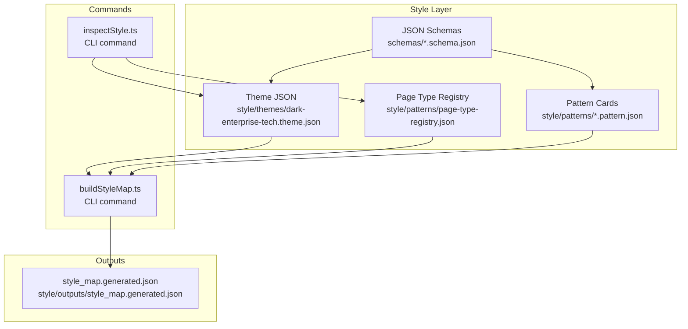
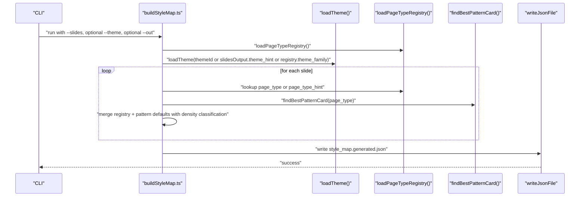
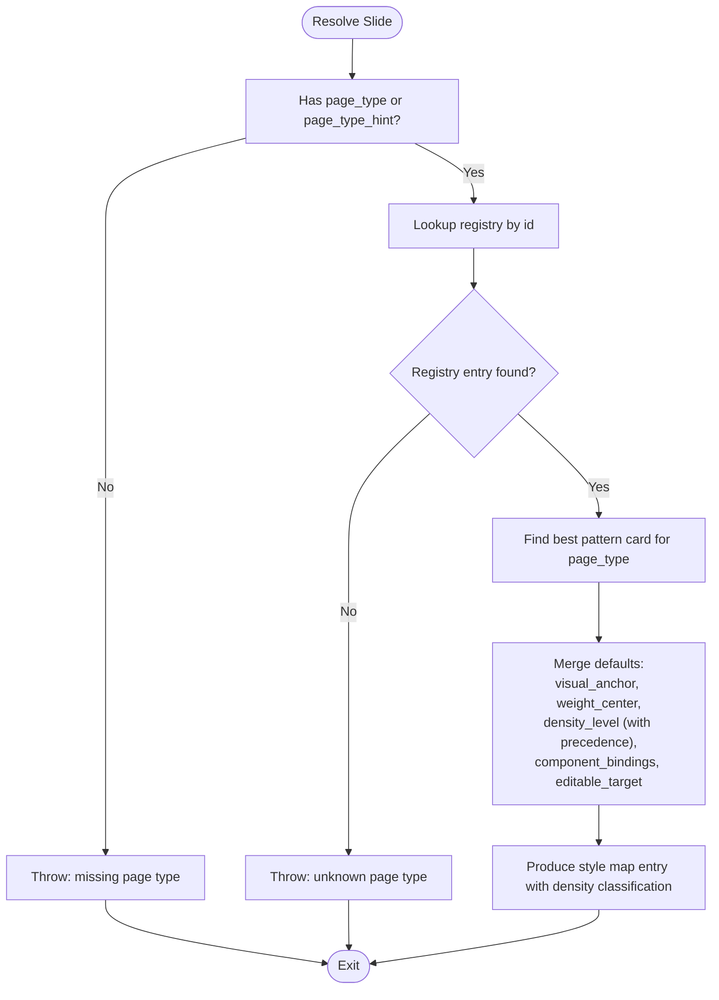
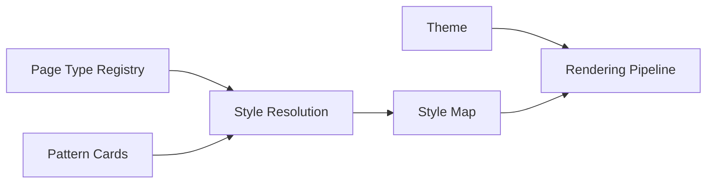

# Style System

<cite>
**Referenced Files in This Document**
- [dark-enterprise-tech.theme.json](file://style/themes/dark-enterprise-tech.theme.json)
- [page-type-registry.json](file://style/patterns/page-type-registry.json)
- [template.pattern-card.json](file://style/patterns/template.pattern-card.json)
- [narrative_map.openclaw-seed.pattern.json](file://style/patterns/openclaw-executive--seed--narrative_map.pattern.json)
- [trust_terminal.openclaw-seed.pattern.json](file://style/patterns/openclaw-executive--seed--trust_terminal.pattern.json)
- [layered_architecture_stack.openclaw-seed.pattern.json](file://style/patterns/openclaw-executive--seed--layered_architecture_stack.pattern.json)
- [chapter_summary_signal.openclaw-seed.pattern.json](file://style/patterns/openclaw-executive--seed--chapter_summary_signal.pattern.json)
- [cover_orbit.openclaw-seed.pattern.json](file://style/patterns/openclaw-executive--seed--cover_orbit.pattern.json)
- [bottleneck_shift.openclaw-seed.pattern.json](file://style/patterns/openclaw-executive--seed--bottleneck_shift.pattern.json)
- [openclaw-executive--seed-01--cover-orbit.json](file://style/reference_extractions/openclaw-executive--seed-01--cover-orbit.json)
- [theme.schema.json](file://schemas/theme.schema.json)
- [pattern_card.schema.json](file://schemas/pattern_card.schema.json)
- [buildStyleMap.ts](file://src/commands/buildStyleMap.ts)
- [inspectStyle.ts](file://src/commands/inspectStyle.ts)
- [style_map.generated.json](file://style/outputs/style_map.generated.json)
- [renderPptx.ts](file://src/commands/renderPptx.ts)
- [svgPreview.ts](file://src/lib/render/svgPreview.ts)
</cite>

## Update Summary
**Changes Made**
- Added documentation for the new density_level field in pattern card schema and style resolution
- Updated pattern card examples to include density_level values for all pattern cards
- Enhanced style resolution examples to demonstrate density classification logic
- Added documentation for compact annotation pill design in layered architecture patterns
- Updated pattern matching examples to reflect density-based composition guidance
- Documented naming convention migration from reference seed format to pattern card format

## Table of Contents
1. [Introduction](#introduction)
2. [Project Structure](#project-structure)
3. [Core Components](#core-components)
4. [Architecture Overview](#architecture-overview)
5. [Detailed Component Analysis](#detailed-component-analysis)
6. [Dependency Analysis](#dependency-analysis)
7. [Performance Considerations](#performance-considerations)
8. [Troubleshooting Guide](#troubleshooting-guide)
9. [Conclusion](#conclusion)
10. [Appendices](#appendices)

## Introduction
This document describes the Enterprise PPT System's design intelligence layer with a focus on the style system. It explains how themes define consistent visual foundations, how page types classify slides, and how pattern cards encode reusable design components. The system now includes enhanced density classification capabilities that enable fine-grained control over content density and visual weight distribution. The latest updates introduce three new pattern cards for specialized page types: narrative_map for agenda and chapter framing, trust_terminal for trust explanation and architecture reasoning, and layered_architecture_stack for architecture explanation and stack visualization. These patterns incorporate compact annotation pill designs for governance controls and follow updated naming conventions. The system documents the relationships among themes, patterns, and page types, the style resolution process with density classification, and how the system integrates with the rendering pipeline. Practical examples illustrate theme customization, pattern creation, and component composition, along with best practices for extensibility and maintenance.

## Project Structure
The style system is organized around four pillars with enhanced density classification:
- Themes: JSON-defined visual foundations (colors, typography, spacing, radii, borders, shadows, backgrounds).
- Page Types: A registry that categorizes slides by narrative and visual roles, anchors, weight center, and density level.
- Pattern Cards: JSON specifications of proven slide compositions, including component recipes, alignment rules, anti-patterns, and density classifications.
- Style Map: The output of style resolution, binding each slide to a page type, visual anchor, weight center, density level, component bindings, editable target, and optionally a learned pattern.

**Diagram sources**
- [dark-enterprise-tech.theme.json:1-55](file://style/themes/dark-enterprise-tech.theme.json#L1-L55)
- [page-type-registry.json:1-115](file://style/patterns/page-type-registry.json#L1-L115)
- [template.pattern-card.json:1-46](file://style/patterns/template.pattern-card.json#L1-L46)
- [buildStyleMap.ts:1-110](file://src/commands/buildStyleMap.ts#L1-L110)
- [inspectStyle.ts:1-14](file://src/commands/inspectStyle.ts#L1-L14)
- [style_map.generated.json:1-261](file://style/outputs/style_map.generated.json#L1-L261)

**Section sources**
- [dark-enterprise-tech.theme.json:1-55](file://style/themes/dark-enterprise-tech.theme.json#L1-L55)
- [page-type-registry.json:1-115](file://style/patterns/page-type-registry.json#L1-L115)
- [template.pattern-card.json:1-46](file://style/patterns/template.pattern-card.json#L1-L46)
- [buildStyleMap.ts:1-110](file://src/commands/buildStyleMap.ts#L1-L110)
- [inspectStyle.ts:1-14](file://src/commands/inspectStyle.ts#L1-L14)
- [style_map.generated.json:1-261](file://style/outputs/style_map.generated.json#L1-L261)

## Core Components
- Theme: Defines palette, typography, spacing, radius, borders, shadows, and backgrounds. Used to resolve concrete visual attributes during rendering.
- Page Type Registry: Associates each slide with a canonical page type, including narrative roles, visual anchor, weight center, density level, and editable target.
- Pattern Card: Encodes a reusable slide composition with component recipe, layout and alignment rules, highlight grammar, image usage guidance, anti-patterns, and density classification.
- Style Map: The output of style resolution, binding each slide to a page type, visual anchor, weight center, density level, component bindings, editable target, and optionally a learned pattern.

**Section sources**
- [dark-enterprise-tech.theme.json:1-55](file://style/themes/dark-enterprise-tech.theme.json#L1-L55)
- [page-type-registry.json:1-115](file://style/patterns/page-type-registry.json#L1-L115)
- [template.pattern-card.json:1-46](file://style/patterns/template.pattern-card.json#L1-L46)
- [buildStyleMap.ts:24-48](file://src/commands/buildStyleMap.ts#L24-L48)
- [style_map.generated.json:1-261](file://style/outputs/style_map.generated.json#L1-L261)

## Architecture Overview
The style system resolves a set of narrative-driven slide definitions into a style map that guides the rendering pipeline with enhanced density classification. The process:
- Load a theme (explicit or inferred from registry/theme family).
- Load the page type registry.
- For each slide, resolve page type and compute style properties including density level.
- Find the best pattern card for the page type.
- Merge registry defaults with pattern overrides to produce component bindings, density classification, and editable target.
- Write the style map for downstream rendering.

**Diagram sources**
- [buildStyleMap.ts:50-109](file://src/commands/buildStyleMap.ts#L50-L109)
- [page-type-registry.json:1-115](file://style/patterns/page-type-registry.json#L1-L115)
- [style_map.generated.json:1-261](file://style/outputs/style_map.generated.json#L1-L261)

## Detailed Component Analysis

### Theme Management
Themes encapsulate the visual foundation. They include:
- Palette: background, surface, text, accents, and grid.
- Typography: font family and sizes.
- Spacing: named units (xs, sm, md, lg, xl).
- Radius and Borders: shape and border definitions.
- Shadows: card and special glows.
- Backgrounds: base, overlay, hero descriptors.

Validation is enforced via a JSON schema that requires core keys and allows additional properties for extensibility.

Practical customization tips:
- Keep palette harmonious; limit accent usage to reinforce hierarchy.
- Align typography scales with content density expectations per page type.
- Use spacing consistently across components to maintain rhythm.
- Define shadow and glow sparingly to avoid visual noise.

**Section sources**
- [dark-enterprise-tech.theme.json:1-55](file://style/themes/dark-enterprise-tech.theme.json#L1-L55)
- [theme.schema.json:1-58](file://schemas/theme.schema.json#L1-L58)

### Page Type Registry
The registry classifies slides by:
- Canonical id and narrative roles.
- Visual anchor (component id that anchors the composition).
- Weight center (layout balance hint).
- Density level (low/medium/high).
- Editable target (rendering mode for authoring flexibility).

This enables consistent classification and fallback behavior when pattern matching is incomplete. The registry now includes seven page types with density classifications:
- **cover_orbit**: Strategic framing with medium density
- **narrative_map**: Agenda and chapter framing with medium density
- **trust_terminal**: Trust explanation and architecture reasoning with medium density
- **closed_loop_flow**: Process and execution loop with medium density
- **bottleneck_shift**: Paradigm shift and thesis page with medium density
- **evolution_split**: Transition and before/after with medium density
- **layered_architecture_stack**: Architecture explanation and stack visualization with high density
- **scenario_flow**: Workflow and scenario with medium density
- **risk_split**: Risk contrast and control framing with medium density
- **security_control_plane**: Security architecture and governance with high density
- **chapter_summary_signal**: Summary and decision implication with low density
- **closing_control_first**: Closing and call to action with low density

**Section sources**
- [page-type-registry.json:1-115](file://style/patterns/page-type-registry.json#L1-L115)

### Pattern Card System
Pattern cards capture reusable slide compositions with enhanced density classification:
- Identification and page type linkage.
- Narrative roles and topic fit.
- Visual anchor and weight center.
- Density level classification (low, medium, high).
- Layout and alignment rules.
- Highlight grammar and image usage guidance.
- Component recipe (ordered list of components).
- Editable target and anti-patterns.
- Reuse notes and source references.

Pattern cards are discovered by page type and merged into the style map, enriching the resolved slide with learned composition guidance and density classification. All pattern cards now include density_level fields:

Examples:
- Cover Orbit: emphasizes a right-side hero balanced by a left headline stack with medium density.
- Bottleneck Shift: prioritizes a large thesis with grounded supporting visuals at medium density.
- Chapter Summary Signal: focuses on a dominant takeaway with compact signal cue at low density.
- **Narrative Map**: establishes narrative priority with medium density, featuring a dominant left-side chapter card and supporting right-side stack, plus a decision cue band at the bottom.
- **Trust Terminal**: centers on a terminal window as the dominant trust object with medium density, using the right side for the terminal and left side for trust claims.
- **Layered Architecture Stack**: vertically stacks architectural layers with high density, using the left side for labels and right side for details.

**Updated** All pattern cards now include density_level fields with appropriate classifications based on content complexity and visual weight requirements.

**Section sources**
- [template.pattern-card.json:1-46](file://style/patterns/template.pattern-card.json#L1-L46)
- [narrative_map.openclaw-seed.pattern.json:1-52](file://style/patterns/openclaw-executive--seed--narrative_map.pattern.json#L1-L52)
- [trust_terminal.openclaw-seed.pattern.json:1-53](file://style/patterns/openclaw-executive--seed--trust_terminal.pattern.json#L1-L53)
- [layered_architecture_stack.openclaw-seed.pattern.json:1-55](file://style/patterns/openclaw-executive--seed--layered_architecture_stack.pattern.json#L1-L55)
- [cover_orbit.openclaw-seed.pattern.json:1-46](file://style/patterns/openclaw-executive--seed--cover_orbit.pattern.json#L1-L46)
- [bottleneck_shift.openclaw-seed.pattern.json:1-46](file://style/patterns/openclaw-executive--seed--bottleneck_shift.pattern.json#L1-L46)
- [chapter_summary_signal.openclaw-seed.pattern.json:1-45](file://style/patterns/openclaw-executive--seed--chapter_summary_signal.pattern.json#L1-L45)

### Style Resolution and Pattern Matching
The resolution algorithm now includes enhanced density classification:
- Validates presence of page_type or page_type_hint.
- Resolves registry entry by id.
- Finds the best pattern card for the page type.
- Merges defaults with density classification:
  - visual_anchor: pattern override > slide hint > registry fallback.
  - weight_center: pattern override > slide hint > registry fallback.
  - density_level: slide layout_hints density_level > pattern density_level > registry density_level.
  - component_bindings: starts with registry visual_anchor, adds pattern component_recipe.
  - editable_target: pattern override > registry fallback.
- Produces learned_pattern metadata when a pattern is applied.

**Diagram sources**
- [buildStyleMap.ts:64-100](file://src/commands/buildStyleMap.ts#L64-L100)
- [page-type-registry.json:1-115](file://style/patterns/page-type-registry.json#L1-L115)
- [template.pattern-card.json:1-46](file://style/patterns/template.pattern-card.json#L1-L46)

**Section sources**
- [buildStyleMap.ts:64-100](file://src/commands/buildStyleMap.ts#L64-L100)

### Rendering Pipeline Integration
The style map produced by the style resolver provides:
- theme_family for rendering to select the appropriate theme.
- Per-slide page_type, visual_anchor, weight_center, density_level, component_bindings, and editable_target.
- Optional learned_pattern metadata to guide authoring and review.

Density classification enables the rendering pipeline to:
- Apply appropriate spacing and sizing based on density level.
- Control visual weight distribution for different content densities.
- Implement compact annotation designs for high-density patterns like layered architecture stacks.
- Optimize component arrangement for low-density summary slides.

**Updated** The style map now includes density_level classifications for all pattern cards, enabling precise density-based rendering and component arrangement.

**Section sources**
- [style_map.generated.json:1-261](file://style/outputs/style_map.generated.json#L1-L261)
- [buildStyleMap.ts:102-109](file://src/commands/buildStyleMap.ts#L102-L109)

### Practical Examples

#### Theme Customization
- Objective: Create a "Light Enterprise Tech" variant.
- Steps:
  - Duplicate the existing theme JSON.
  - Adjust palette hues to light equivalents.
  - Tune typography sizes and spacing to match lighter contrast expectations.
  - Validate against the theme schema.
- Outcome: A new theme family that preserves design system consistency while adapting tone.

**Section sources**
- [dark-enterprise-tech.theme.json:1-55](file://style/themes/dark-enterprise-tech.theme.json#L1-L55)
- [theme.schema.json:1-58](file://schemas/theme.schema.json#L1-L58)

#### Pattern Creation with Density Classification
- Objective: Add a pattern for "Risk Split."
- Steps:
  - Identify the page type id in the registry.
  - Author a pattern card with:
    - visual_anchor and weight_center aligned to the intended composition.
    - density_level appropriate for the content complexity (medium for risk comparison).
    - layout_rules and alignment_rules reflecting composition discipline.
    - component_recipe enumerating core UI primitives.
    - highlight_grammar and image_usage guidance.
    - anti_patterns and reuse_notes for quality control.
  - Validate against the pattern card schema.
- Outcome: A reusable pattern that can be matched automatically and surfaced in the style map with proper density classification.

**Updated** All pattern cards now include density_level fields with appropriate classifications:
- **Narrative Map patterns** use medium density to balance chapter cards and supporting elements.
- **Trust Terminal patterns** use medium density to accommodate terminal windows and trust claims.
- **Layered Architecture Stack patterns** use high density to handle multiple architectural layers and governance controls.
- **Chapter Summary Signal patterns** use low density to maintain clarity in summary presentations.

**Section sources**
- [page-type-registry.json:15-31](file://style/patterns/page-type-registry.json#L15-L31)
- [page-type-registry.json:59-67](file://style/patterns/page-type-registry.json#L59-L67)
- [template.pattern-card.json:1-46](file://style/patterns/template.pattern-card.json#L1-L46)
- [pattern_card.schema.json:1-76](file://schemas/pattern_card.schema.json#L1-L76)

#### Component Composition with Density Considerations
- Objective: Compose a "Chapter Summary Signal" slide with low density.
- Steps:
  - Resolve page_type to "chapter_summary_signal" with density_level "low".
  - Pattern provides component_recipe: summary text panel, implication panel, signal cue card.
  - Apply theme tokens for typography and spacing optimized for low density.
  - Enforce alignment rules to keep the signal cue aligned to the summary grid.
  - Use image_usage guidance to decide whether a texture is optional.
- Outcome: A concise, high-impact summary slide with consistent visual grammar optimized for low-density presentation.

**Updated** Added examples for density-based composition:
- **Narrative Map composition**: Medium density with dominant left-side chapter card and supporting right-side stack, plus decision cue band at the bottom. Use accent colors for chapter numbers and decision cues while maintaining readable text colors.
- **Trust Terminal composition**: Medium density right-side terminal window as the primary visual anchor with left-side trust claims and governance labels. Include security indicators and trust badges with subtle glow effects.
- **Layered Architecture Stack composition**: High density with vertically stacked architectural layers, left-side labels, and right-side details. Use accent colors for critical layers and implement compact annotation pills for governance controls.
- **Chapter Summary Signal composition**: Low density with dominant summary block and compact decision signal object, optimized for clarity and impact.

**Section sources**
- [chapter_summary_signal.openclaw-seed.pattern.json:1-45](file://style/patterns/openclaw-executive--seed--chapter_summary_signal.pattern.json#L1-L45)
- [narrative_map.openclaw-seed.pattern.json:33-38](file://style/patterns/openclaw-executive--seed--narrative_map.pattern.json#L33-L38)
- [trust_terminal.openclaw-seed.pattern.json:33-39](file://style/patterns/openclaw-executive--seed--trust_terminal.pattern.json#L33-L39)
- [layered_architecture_stack.openclaw-seed.pattern.json:35-41](file://style/patterns/openclaw-executive--seed--layered_architecture_stack.pattern.json#L35-L41)
- [style_map.generated.json:47-86](file://style/outputs/style_map.generated.json#L47-L86)
- [style_map.generated.json:131-172](file://style/outputs/style_map.generated.json#L131-L172)
- [style_map.generated.json:174-217](file://style/outputs/style_map.generated.json#L174-L217)

### Compact Annotation Pill Design
The layered architecture stack pattern incorporates a compact annotation pill design for governance controls and cross-cutting concerns. This design feature uses:
- Rounded rectangular shapes with pill-like proportions
- Subtle surface fills with transparency effects
- Thin accent borders with reduced opacity
- Tight vertical spacing for multiple annotations
- Consistent typography sizing for readability

The rendering implementation creates compact annotation pills with:
- Height: 0.28 units for tight vertical packing
- Spacing: 0.35 units between pills
- Radius: 0.15 units for soft rounded corners
- Fill: Surface alt color with 12% transparency
- Border: Accent secondary color with 70% opacity

**Section sources**
- [layered_architecture_stack.openclaw-seed.pattern.json:35-41](file://style/patterns/openclaw-executive--seed--layered_architecture_stack.pattern.json#L35-L41)
- [renderPptx.ts:997-1026](file://src/commands/renderPptx.ts#L997-L1026)
- [svgPreview.ts:366-368](file://src/lib/render/svgPreview.ts#L366-L368)

### Naming Convention Migration
The pattern card system has migrated from reference seed naming to standardized pattern card naming:
- Old format: `openclaw-executive--seed--{page_type}.pattern.json`
- New format: `{page_type}_openclaw_seed` for pattern ids

Migration examples:
- `openclaw-executive--seed--narrative_map.pattern.json` → `narrative_map_openclaw_seed`
- `openclaw-executive--seed--trust_terminal.pattern.json` → `trust_terminal_openclaw_seed`
- `openclaw-executive--seed--layered_architecture_stack.pattern.json` → `layered_architecture_stack_openclaw_seed`

This migration improves consistency and makes pattern identification more predictable across the system.

**Section sources**
- [narrative_map.openclaw-seed.pattern.json:1-52](file://style/patterns/openclaw-executive--seed--narrative_map.pattern.json#L1-L52)
- [trust_terminal.openclaw-seed.pattern.json:1-53](file://style/patterns/openclaw-executive--seed--trust_terminal.pattern.json#L1-L53)
- [layered_architecture_stack.openclaw-seed.pattern.json:1-55](file://style/patterns/openclaw-executive--seed--layered_architecture_stack.pattern.json#L1-L55)
- [style_map.generated.json:18-18](file://style/outputs/style_map.generated.json#L18-L18)
- [style_map.generated.json:59-59](file://style/outputs/style_map.generated.json#L59-L59)
- [style_map.generated.json:144-144](file://style/outputs/style_map.generated.json#L144-L144)
- [style_map.generated.json:187-187](file://style/outputs/style_map.generated.json#L187-L187)

## Dependency Analysis
The style system exhibits clear separation of concerns with enhanced density classification:
- Themes are consumed by rendering; they do not depend on patterns or page types.
- Page types provide classification, density levels, and fallbacks; they do not depend on patterns.
- Pattern cards are discovered by page type, include density classifications, and merged into the style map.
- The CLI commands orchestrate loading, matching, density classification, and writing the style map.

**Diagram sources**
- [dark-enterprise-tech.theme.json:1-55](file://style/themes/dark-enterprise-tech.theme.json#L1-L55)
- [page-type-registry.json:1-115](file://style/patterns/page-type-registry.json#L1-L115)
- [template.pattern-card.json:1-46](file://style/patterns/template.pattern-card.json#L1-L46)
- [buildStyleMap.ts:50-109](file://src/commands/buildStyleMap.ts#L50-L109)
- [style_map.generated.json:1-261](file://style/outputs/style_map.generated.json#L1-L261)

**Section sources**
- [buildStyleMap.ts:50-109](file://src/commands/buildStyleMap.ts#L50-L109)

## Performance Considerations
- Minimize repeated IO: cache loaded registry and theme objects in memory during a single run.
- De-duplicate component bindings: use sets to merge visual anchors and component recipes.
- Batch processing: process slides concurrently with bounded concurrency to improve throughput.
- Schema validation: pre-validate inputs to fail fast and reduce runtime errors.
- Density-aware optimization: use density classifications to optimize rendering performance for different content densities.

## Troubleshooting Guide
Common issues and resolutions:
- Missing page_type or page_type_hint:
  - Symptom: Error indicating missing classification.
  - Fix: Provide page_type or page_type_hint in the slides input.
- Unknown page type:
  - Symptom: Error indicating an unrecognized id.
  - Fix: Add the id to the page type registry or correct the value.
- Missing pattern for a page type:
  - Symptom: Slide resolved without learned_pattern metadata.
  - Fix: Create a pattern card for the page type and ensure it passes schema validation.
- Theme mismatch:
  - Symptom: Inconsistent rendering or invalid tokens.
  - Fix: Validate theme JSON against the theme schema and ensure all required keys are present.
- Density level conflicts:
  - Symptom: Unexpected density classification in style map.
  - Fix: Verify density_level precedence order: slide layout_hints > pattern > registry fallback.

**Section sources**
- [buildStyleMap.ts:67-74](file://src/commands/buildStyleMap.ts#L67-L74)
- [page-type-registry.json:1-115](file://style/patterns/page-type-registry.json#L1-L115)
- [theme.schema.json:1-58](file://schemas/theme.schema.json#L1-L58)
- [pattern_card.schema.json:1-76](file://schemas/pattern_card.schema.json#L1-L76)

## Conclusion
The Enterprise PPT System's style system couples a robust theme model with a page type registry, density classification, and a library of validated pattern cards. The addition of enhanced density classification capabilities expands the system's ability to control content density and visual weight distribution across different presentation scenarios. The inclusion of three new pattern cards—narrative_map for agenda management, trust_terminal for trust explanation, and layered_architecture_stack for architecture visualization—along with compact annotation pill designs and updated naming conventions, demonstrates the system's evolution toward more sophisticated presentation design. Through deterministic resolution with density classification and a clear style map output, it ensures consistent visual design at scale while providing fine-grained control over content density and composition. By following the provided schemas, patterns, and best practices, teams can extend the system efficiently and maintain design integrity across large decks.

## Appendices

### Best Practices for Pattern Creation with Density Classification
- Ground patterns in real reference extractions to ensure fidelity to successful compositions.
- Assign appropriate density levels based on content complexity and visual weight requirements.
- Keep component recipes minimal and focused on core primitives.
- Encode explicit layout and alignment rules to reduce ambiguity.
- Provide highlight grammar and image usage guidance to preserve visual discipline.
- Include anti-patterns and reuse notes to guide adoption and prevent misuse.
- Consider compact annotation designs for high-density patterns like layered architectures.

**Updated** Added guidance for density classification and compact annotation design:
- **Narrative Map patterns** should use medium density with balanced left-right composition and decision cue bands.
- **Trust Terminal patterns** should use medium density with terminal windows as primary anchors and governance labels as secondary elements.
- **Layered Architecture Stack patterns** should use high density with vertical stacking, distinct layer treatments, and compact annotation pills for governance controls.
- **Chapter Summary Signal patterns** should use low density with dominant summary blocks and compact signal cues.

**Section sources**
- [openclaw-executive--seed-01--cover-orbit.json:1-72](file://style/reference_extractions/openclaw-executive--seed-01--cover-orbit.json#L1-L72)
- [template.pattern-card.json:1-46](file://style/patterns/template.pattern-card.json#L1-L46)
- [narrative_map.openclaw-seed.pattern.json:10-21](file://style/patterns/openclaw-executive--seed--narrative_map.pattern.json#L10-L21)
- [trust_terminal.openclaw-seed.pattern.json:10-15](file://style/patterns/openclaw-executive--seed--trust_terminal.pattern.json#L10-L15)
- [layered_architecture_stack.openclaw-seed.pattern.json:10-16](file://style/patterns/openclaw-executive--seed--layered_architecture_stack.pattern.json#L10-L16)

### Maintenance Strategies for Large-Scale Systems
- Version the page type registry and pattern cards to track changes and enable rollbacks.
- Use schema validation in CI to enforce structural consistency.
- Establish a review process for new patterns and theme variants.
- Periodically audit the style map for orphaned components or unused patterns.
- Document theme families and their intended use cases to prevent drift.
- Monitor density classification usage to ensure appropriate density assignments.
- Track naming convention compliance for pattern cards and reference seeds.

**Updated** The expanded pattern library now includes density classifications and compact annotation designs that require ongoing maintenance and versioning:
- Agenda and navigation patterns (narrative_map) with medium density
- Security and trust patterns (trust_terminal) with medium density  
- Architecture and technical patterns (layered_architecture_stack) with high density
- Summary patterns (chapter_summary_signal) with low density
- Compact annotation pill implementations for governance controls

**Section sources**
- [page-type-registry.json:1-115](file://style/patterns/page-type-registry.json#L1-L115)
- [pattern_card.schema.json:1-76](file://schemas/pattern_card.schema.json#L1-L76)
- [theme.schema.json:1-58](file://schemas/theme.schema.json#L1-L58)
- [narrative_map.openclaw-seed.pattern.json:46-50](file://style/patterns/openclaw-executive--seed--narrative_map.pattern.json#L46-L50)
- [trust_terminal.openclaw-seed.pattern.json:47-51](file://style/patterns/openclaw-executive--seed--trust_terminal.pattern.json#L47-L51)
- [layered_architecture_stack.openclaw-seed.pattern.json:49-53](file://style/patterns/openclaw-executive--seed--layered_architecture_stack.pattern.json#L49-L53)
- [renderPptx.ts:997-1026](file://src/commands/renderPptx.ts#L997-L1026)
- [svgPreview.ts:366-368](file://src/lib/render/svgPreview.ts#L366-L368)