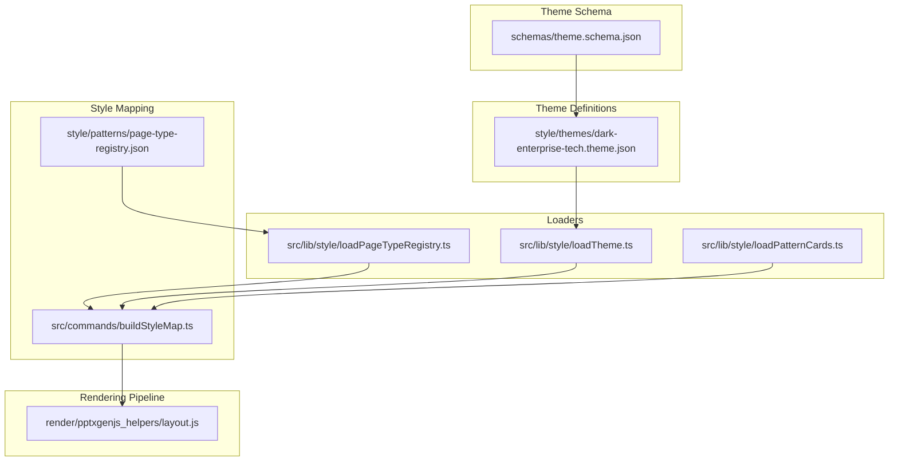
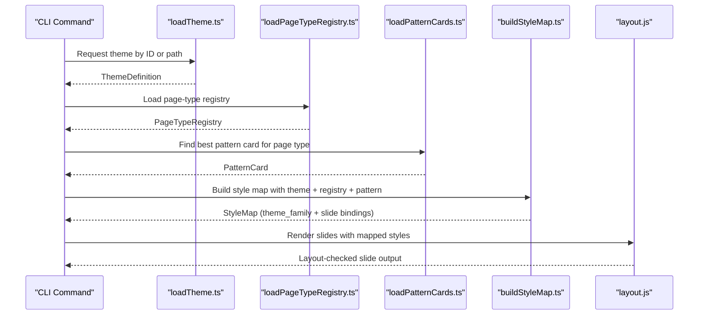
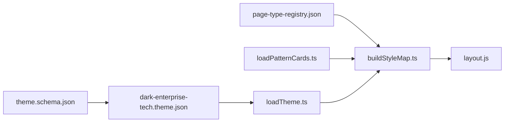

# Theme Management

<cite>
**Referenced Files in This Document**
- [theme.schema.json](file://schemas/theme.schema.json)
- [dark-enterprise-tech.theme.json](file://style/themes/dark-enterprise-tech.theme.json)
- [loadTheme.ts](file://src/lib/style/loadTheme.ts)
- [buildStyleMap.ts](file://src/commands/buildStyleMap.ts)
- [page-type-registry.json](file://style/patterns/page-type-registry.json)
- [loadPageTypeRegistry.ts](file://src/lib/style/loadPageTypeRegistry.ts)
- [loadPatternCards.ts](file://src/lib/style/loadPatternCards.ts)
- [layout.js](file://render/pptxgenjs_helpers/layout.js)
- [ADR-0003-fast-track-mvp.md](file://docs/decisions/ADR-0003-fast-track-mvp.md)
</cite>

## Table of Contents
1. [Introduction](#introduction)
2. [Project Structure](#project-structure)
3. [Core Components](#core-components)
4. [Architecture Overview](#architecture-overview)
5. [Detailed Component Analysis](#detailed-component-analysis)
6. [Dependency Analysis](#dependency-analysis)
7. [Performance Considerations](#performance-considerations)
8. [Troubleshooting Guide](#troubleshooting-guide)
9. [Conclusion](#conclusion)

## Introduction
This document explains the theme management system in the Enterprise PPT System. It describes how themes define the complete visual identity—palette colors, typography scales, spacing systems, and design tokens—and documents the JSON schema that validates theme definitions. It also covers practical customization, inheritance patterns, composition strategies, and integration with the rendering pipeline for automatic style application. Guidance is included for maintaining consistent brand guidelines across presentations and building robust theme-driven slide decks.

## Project Structure
The theme system spans schema validation, theme definition files, loaders, and the style mapping pipeline that binds themes to page types and patterns.

**Diagram sources**
- [theme.schema.json:1-58](file://schemas/theme.schema.json#L1-L58)
- [dark-enterprise-tech.theme.json:1-55](file://style/themes/dark-enterprise-tech.theme.json#L1-L55)
- [loadTheme.ts:1-29](file://src/lib/style/loadTheme.ts#L1-L29)
- [loadPageTypeRegistry.ts:1-21](file://src/lib/style/loadPageTypeRegistry.ts#L1-L21)
- [loadPatternCards.ts:1-49](file://src/lib/style/loadPatternCards.ts#L1-L49)
- [buildStyleMap.ts:1-110](file://src/commands/buildStyleMap.ts#L1-L110)
- [page-type-registry.json:1-115](file://style/patterns/page-type-registry.json#L1-L115)
- [layout.js:1-644](file://render/pptxgenjs_helpers/layout.js#L1-L644)

**Section sources**
- [theme.schema.json:1-58](file://schemas/theme.schema.json#L1-L58)
- [dark-enterprise-tech.theme.json:1-55](file://style/themes/dark-enterprise-tech.theme.json#L1-L55)
- [loadTheme.ts:1-29](file://src/lib/style/loadTheme.ts#L1-L29)
- [loadPageTypeRegistry.ts:1-21](file://src/lib/style/loadPageTypeRegistry.ts#L1-L21)
- [loadPatternCards.ts:1-49](file://src/lib/style/loadPatternCards.ts#L1-L49)
- [buildStyleMap.ts:1-110](file://src/commands/buildStyleMap.ts#L1-L110)
- [page-type-registry.json:1-115](file://style/patterns/page-type-registry.json#L1-L115)
- [layout.js:1-644](file://render/pptxgenjs_helpers/layout.js#L1-L644)

## Core Components
- Theme schema: Defines the canonical structure for theme definitions, including required and optional fields for palettes, typography, spacing, radius, borders, shadows, and backgrounds.
- Theme definition: A concrete theme JSON file that supplies values for the schema, such as color tokens, font sizes, spacing units, corner radii, border specs, shadow effects, and background descriptors.
- Theme loader: Loads a theme by ID or explicit path and exposes a strongly typed ThemeDefinition to downstream consumers.
- Style mapping pipeline: Selects a theme, resolves page types, finds pattern cards, and produces a style map that captures theme family and slide-level bindings.
- Rendering helpers: Provide layout utilities that operate on slide elements and can be informed by theme-derived spacing and alignment rules.

**Section sources**
- [theme.schema.json:1-58](file://schemas/theme.schema.json#L1-L58)
- [dark-enterprise-tech.theme.json:1-55](file://style/themes/dark-enterprise-tech.theme.json#L1-L55)
- [loadTheme.ts:1-29](file://src/lib/style/loadTheme.ts#L1-L29)
- [buildStyleMap.ts:50-109](file://src/commands/buildStyleMap.ts#L50-L109)
- [layout.js:462-573](file://render/pptxgenjs_helpers/layout.js#L462-L573)

## Architecture Overview
The theme system is designed around a schema-first approach. Themes are validated against the schema, loaded into memory, and then bound to page types and patterns during style mapping. Rendering helpers consume normalized slide layouts and can leverage theme-derived spacing and alignment semantics.

**Diagram sources**
- [loadTheme.ts:22-28](file://src/lib/style/loadTheme.ts#L22-L28)
- [loadPageTypeRegistry.ts:18-20](file://src/lib/style/loadPageTypeRegistry.ts#L18-L20)
- [loadPatternCards.ts:39-48](file://src/lib/style/loadPatternCards.ts#L39-L48)
- [buildStyleMap.ts:50-109](file://src/commands/buildStyleMap.ts#L50-L109)
- [layout.js:462-573](file://render/pptxgenjs_helpers/layout.js#L462-L573)

## Detailed Component Analysis

### Theme JSON Schema
The schema defines the contract for theme definitions:
- Required top-level fields: id, name, palette, typography, spacing, backgrounds.
- Palette: required keys include background, surface, text_primary, accent_primary; additional named tokens are permitted.
- Typography: required keys include font_family, title_size, body_size; optional subtitle_size and caption_size.
- Spacing: a dictionary of named units (e.g., xs, sm, md, lg, xl) mapping to numeric values.
- Radius: optional dictionary of named corner radius values.
- Borders: optional dictionary of border configurations.
- Shadows: optional dictionary of shadow configurations.
- Backgrounds: optional dictionary of background descriptors.

Practical implications:
- Enforces a minimal set of tokens to guarantee consistent rendering.
- Allows extension for brand-specific tokens without breaking core contracts.
- Supports flexible typography and spacing scales tailored to presentation density.

**Section sources**
- [theme.schema.json:1-58](file://schemas/theme.schema.json#L1-L58)

### Example Theme Definition
The example theme demonstrates:
- Palette tokens for background, surface, alternate surfaces, primary and secondary text, primary and secondary accents, risk color, and grid overlay.
- Typography tokens for font family and multiple size scales.
- Spacing scale with named steps.
- Corner radius values for common components.
- Border and shadow configurations with blur and color.
- Background descriptors for base, overlay, and hero treatments.

Customization tips:
- Keep palette tokens aligned with brand guidelines.
- Use semantic names for spacing and radius to improve readability and maintainability.
- Define typography scales that support hierarchy across slide types.

**Section sources**
- [dark-enterprise-tech.theme.json:1-55](file://style/themes/dark-enterprise-tech.theme.json#L1-L55)

### Theme Loading and Type Safety
The theme loader:
- Accepts either a theme ID (resolved to a filename) or an explicit JSON path.
- Returns a strongly typed ThemeDefinition, enabling safe consumption downstream.

Integration points:
- Used by the style mapper to select a theme family for the style map.
- Can be extended to support theme inheritance or composition by merging multiple theme layers.

**Section sources**
- [loadTheme.ts:1-29](file://src/lib/style/loadTheme.ts#L1-L29)

### Style Mapping and Theme Binding
The style mapping command:
- Resolves a theme using a provided ID, a hint from slides output, or the registry’s theme family.
- Loads the page-type registry and pattern cards.
- Produces a style map containing the theme family and per-slide bindings derived from registry entries and pattern cards.

MVP context:
- The project’s decision record indicates a focus on a single theme family for the MVP, simplifying style binding and ensuring consistent delivery.

**Section sources**
- [buildStyleMap.ts:50-109](file://src/commands/buildStyleMap.ts#L50-L109)
- [page-type-registry.json:1-115](file://style/patterns/page-type-registry.json#L1-L115)
- [loadPageTypeRegistry.ts:1-21](file://src/lib/style/loadPageTypeRegistry.ts#L1-L21)
- [loadPatternCards.ts:1-49](file://src/lib/style/loadPatternCards.ts#L1-L49)
- [ADR-0003-fast-track-mvp.md:10-16](file://docs/decisions/ADR-0003-fast-track-mvp.md#L10-L16)

### Rendering Pipeline Integration
Layout helpers:
- Provide utilities for detecting element types, computing overlaps, aligning elements, distributing elements, and validating bounds.
- These utilities can be leveraged to apply theme-derived spacing consistently across slides and to enforce layout rules that respect theme tokens.

Recommendations:
- Use spacing tokens to drive margins, padding, and gutters.
- Apply radius and shadow configurations to shape components.
- Align layout logic with theme-defined typography scales for readable text hierarchy.

**Section sources**
- [layout.js:462-573](file://render/pptxgenjs_helpers/layout.js#L462-L573)

## Dependency Analysis
The theme system exhibits clear separation of concerns:
- Schema validates definitions.
- Theme loader decouples theme selection from rendering.
- Style mapping orchestrates theme, registry, and patterns.
- Rendering helpers operate on slide-level geometry.

**Diagram sources**
- [theme.schema.json:1-58](file://schemas/theme.schema.json#L1-L58)
- [dark-enterprise-tech.theme.json:1-55](file://style/themes/dark-enterprise-tech.theme.json#L1-L55)
- [loadTheme.ts:1-29](file://src/lib/style/loadTheme.ts#L1-L29)
- [page-type-registry.json:1-115](file://style/patterns/page-type-registry.json#L1-L115)
- [loadPatternCards.ts:1-49](file://src/lib/style/loadPatternCards.ts#L1-L49)
- [buildStyleMap.ts:1-110](file://src/commands/buildStyleMap.ts#L1-L110)
- [layout.js:1-644](file://render/pptxgenjs_helpers/layout.js#L1-L644)

**Section sources**
- [theme.schema.json:1-58](file://schemas/theme.schema.json#L1-L58)
- [dark-enterprise-tech.theme.json:1-55](file://style/themes/dark-enterprise-tech.theme.json#L1-L55)
- [loadTheme.ts:1-29](file://src/lib/style/loadTheme.ts#L1-L29)
- [page-type-registry.json:1-115](file://style/patterns/page-type-registry.json#L1-L115)
- [loadPatternCards.ts:1-49](file://src/lib/style/loadPatternCards.ts#L1-L49)
- [buildStyleMap.ts:1-110](file://src/commands/buildStyleMap.ts#L1-L110)
- [layout.js:1-644](file://render/pptxgenjs_helpers/layout.js#L1-L644)

## Performance Considerations
- Centralize theme loading: Load and cache the theme once per process to avoid repeated disk reads.
- Minimize runtime transformations: Prefer precomputed numeric values for spacing and typography scales.
- Favor additive extensions: Add new tokens rather than modifying existing ones to reduce churn.
- Keep pattern cards concise: Limit the number of component recipes and rules to streamline style mapping.

## Troubleshooting Guide
Common issues and resolutions:
- Missing required fields: Ensure id, name, palette, typography, spacing, and backgrounds are present according to the schema.
- Unknown page type: Verify the page type exists in the registry; otherwise, update the slides output or registry.
- Theme path resolution: When passing a theme ID, confirm the corresponding theme file exists under the themes directory.
- Layout overlaps or out-of-bounds elements: Use the rendering helpers to detect and resolve overlaps and boundary violations.

Validation and checks:
- Schema validation ensures structural correctness of theme definitions.
- Rendering helpers provide warnings for overlaps and out-of-bounds elements, aiding iterative refinement.

**Section sources**
- [theme.schema.json:6-7](file://schemas/theme.schema.json#L6-L7)
- [buildStyleMap.ts:67-74](file://src/commands/buildStyleMap.ts#L67-L74)
- [layout.js:23-232](file://render/pptxgenjs_helpers/layout.js#L23-L232)

## Conclusion
The Enterprise PPT System’s theme management system centers on a schema-driven approach that enforces consistency while allowing flexibility for brand-specific extensions. Themes define the visual identity comprehensively, and the style mapping pipeline binds themes to page types and patterns. Rendering helpers ensure layout quality by leveraging theme-derived tokens. For MVP, locking a single theme family simplifies delivery and preview alignment, while future enhancements can introduce multi-theme support and advanced composition strategies.