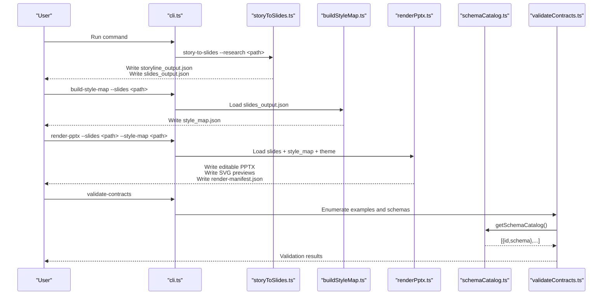
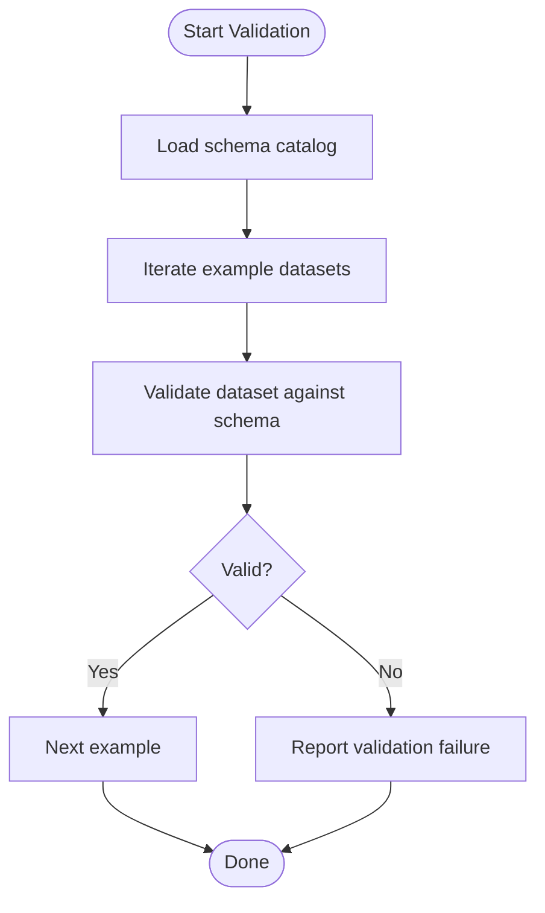
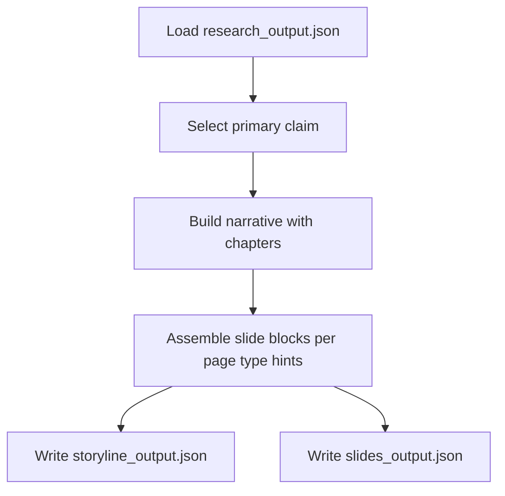
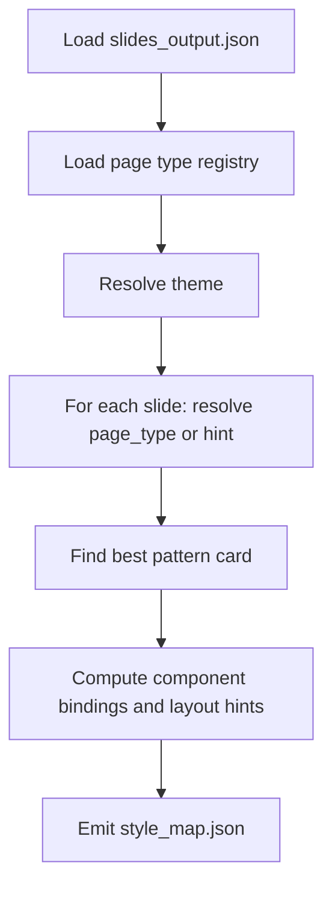
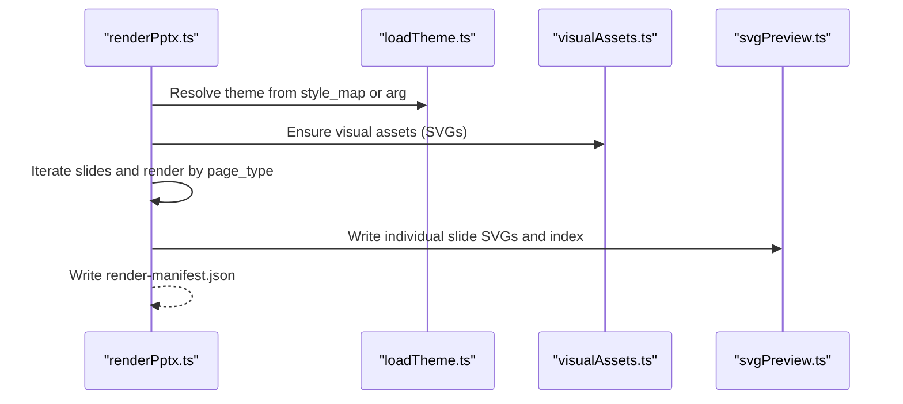
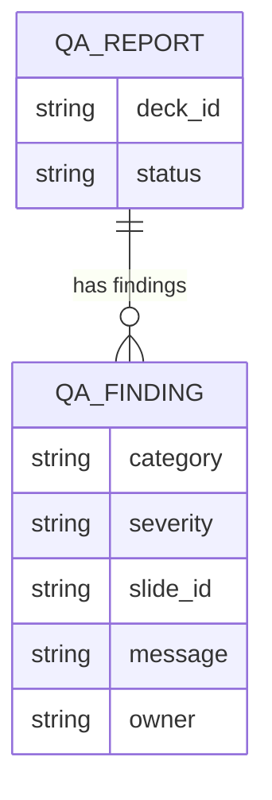
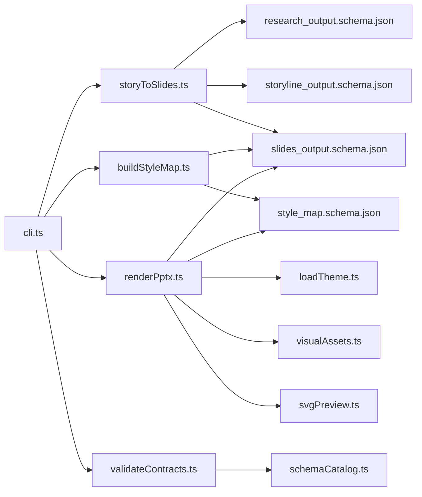

# Data Flow Patterns and Information Architecture

<cite>
**Referenced Files in This Document**
- [research_output.schema.json](file://schemas/research_output.schema.json)
- [storyline_output.schema.json](file://schemas/storyline_output.schema.json)
- [slides_output.schema.json](file://schemas/slides_output.schema.json)
- [style_map.schema.json](file://schemas/style_map.schema.json)
- [qa_report.schema.json](file://schemas/qa_report.schema.json)
- [validateContracts.ts](file://src/commands/validateContracts.ts)
- [cli.ts](file://src/cli.ts)
- [buildStyleMap.ts](file://src/commands/buildStyleMap.ts)
- [storyToSlides.ts](file://src/commands/storyToSlides.ts)
- [renderPptx.ts](file://src/commands/renderPptx.ts)
- [schemaCatalog.ts](file://src/lib/schemaCatalog.ts)
- [svgPreview.ts](file://src/lib/render/svgPreview.ts)
- [visualAssets.ts](file://src/lib/render/visualAssets.ts)
- [loadTheme.ts](file://src/lib/style/loadTheme.ts)
</cite>

## Table of Contents
1. [Introduction](#introduction)
2. [Project Structure](#project-structure)
3. [Core Components](#core-components)
4. [Architecture Overview](#architecture-overview)
5. [Detailed Component Analysis](#detailed-component-analysis)
6. [Dependency Analysis](#dependency-analysis)
7. [Performance Considerations](#performance-considerations)
8. [Troubleshooting Guide](#troubleshooting-guide)
9. [Conclusion](#conclusion)

## Introduction
This document describes the Enterprise PPT System’s data flow patterns and information architecture. It traces the canonical pipeline from deep research to final editable PPTX delivery, covering research_output.json, storyline_output.json, slides_output.json, style_map.json, preview generation, editable PPTX creation, and QA reporting. It explains the schema-driven validation system, error handling, data integrity guarantees, lineage and provenance considerations, and performance optimization strategies including caching and parallelization opportunities.

## Project Structure
The system is organized around a command-driven CLI that orchestrates data transformations and rendering:
- Schemas define canonical data contracts for each stage.
- Commands implement the processing pipeline.
- Rendering utilities produce editable PPTX and SVG previews.
- Validation utilities enforce schema compliance across example datasets.

```mermaid
graph TB
subgraph "CLI"
CLI["cli.ts"]
end
subgraph "Commands"
STS["storyToSlides.ts"]
BSM["buildStyleMap.ts"]
RPTX["renderPptx.ts"]
VC["validateContracts.ts"]
end
subgraph "Libraries"
SC["schemaCatalog.ts"]
LA["loadTheme.ts"]
VAS["visualAssets.ts"]
SPV["svgPreview.ts"]
end
subgraph "Schemas"
ROS["research_output.schema.json"]
SLS["slides_output.schema.json"]
STL["storyline_output.schema.json"]
SMAP["style_map.schema.json"]
QAR["qa_report.schema.json"]
end
subgraph "Outputs"
OUT1["research_output.json"]
OUT2["storyline_output.json"]
OUT3["slides_output.json"]
OUT4["style_map.json"]
OUT5["render-manifest.json"]
PREV["SVG previews"]
end
CLI --> STS
CLI --> BSM
CLI --> RPTX
CLI --> VC
VC --> SC
SC --> ROS
SC --> STL
SC --> SLS
SC --> SMAP
SC --> QAR
STS --> OUT2
STS --> OUT3
BSM --> OUT4
RPTX --> OUT5
RPTX --> PREV
RPTX --> LA
RPTX --> VAS
RPTX --> SPV
```

**Diagram sources**
- [cli.ts:1-57](file://src/cli.ts#L1-L57)
- [validateContracts.ts:1-100](file://src/commands/validateContracts.ts#L1-L100)
- [schemaCatalog.ts:1-24](file://src/lib/schemaCatalog.ts#L1-L24)
- [research_output.schema.json:1-88](file://schemas/research_output.schema.json#L1-L88)
- [storyline_output.schema.json:1-49](file://schemas/storyline_output.schema.json#L1-L49)
- [slides_output.schema.json:1-53](file://schemas/slides_output.schema.json#L1-L53)
- [style_map.schema.json:1-70](file://schemas/style_map.schema.json#L1-L70)
- [qa_report.schema.json:1-28](file://schemas/qa_report.schema.json#L1-L28)
- [storyToSlides.ts:1-166](file://src/commands/storyToSlides.ts#L1-L166)
- [buildStyleMap.ts:1-110](file://src/commands/buildStyleMap.ts#L1-L110)
- [renderPptx.ts:1-1019](file://src/commands/renderPptx.ts#L1-L1019)
- [loadTheme.ts:1-29](file://src/lib/style/loadTheme.ts#L1-L29)
- [visualAssets.ts:1-122](file://src/lib/render/visualAssets.ts#L1-L122)
- [svgPreview.ts:1-270](file://src/lib/render/svgPreview.ts#L1-L270)

**Section sources**
- [cli.ts:1-57](file://src/cli.ts#L1-L57)
- [validateContracts.ts:1-100](file://src/commands/validateContracts.ts#L1-L100)
- [schemaCatalog.ts:1-24](file://src/lib/schemaCatalog.ts#L1-L24)

## Core Components
- CLI entry point routes commands and prints help.
- Schema catalog aggregates all JSON schemas for validation.
- Contract validation command loads example datasets and validates against schemas.
- Story-to-slides command transforms research into a storyline and initial slides.
- Build-style-map command maps slides to page types and learned patterns.
- Render-PPTX command renders editable PPTX, SVG previews, and a render manifest.
- Rendering utilities generate reusable visual assets and SVG previews.

Key responsibilities:
- Enforce schema contracts at runtime and via example validation.
- Transform unstructured research into structured narrative and slide decks.
- Produce style maps that bind page types, visual anchors, and learned patterns.
- Render deliverables with consistent theming and layout rules.
- Provide preview artifacts for QA and iteration.

**Section sources**
- [cli.ts:1-57](file://src/cli.ts#L1-L57)
- [validateContracts.ts:1-100](file://src/commands/validateContracts.ts#L1-L100)
- [schemaCatalog.ts:1-24](file://src/lib/schemaCatalog.ts#L1-L24)
- [storyToSlides.ts:1-166](file://src/commands/storyToSlides.ts#L1-L166)
- [buildStyleMap.ts:1-110](file://src/commands/buildStyleMap.ts#L1-L110)
- [renderPptx.ts:1-1019](file://src/commands/renderPptx.ts#L1-L1019)

## Architecture Overview
The system follows a layered, schema-driven pipeline:
- Input: Research dataset (research_output.json).
- Transformation: Storyline scaffolding and slide scaffolding.
- Style binding: Page type mapping and learned pattern application.
- Rendering: Editable PPTX and SVG previews with theme-aware visuals.
- QA: Render manifest and optional QA report schema for pass/fail criteria.



**Diagram sources**
- [cli.ts:1-57](file://src/cli.ts#L1-L57)
- [storyToSlides.ts:1-166](file://src/commands/storyToSlides.ts#L1-L166)
- [buildStyleMap.ts:1-110](file://src/commands/buildStyleMap.ts#L1-L110)
- [renderPptx.ts:1-1019](file://src/commands/renderPptx.ts#L1-L1019)
- [schemaCatalog.ts:1-24](file://src/lib/schemaCatalog.ts#L1-L24)
- [validateContracts.ts:1-100](file://src/commands/validateContracts.ts#L1-L100)

## Detailed Component Analysis

### Data Contracts and Validation
- Schemas define canonical shapes for research, storyline, slides, style maps, and QA reports.
- Validation runs against curated examples to ensure contract adherence.
- Schema catalog enumerates all schema entries dynamically.



**Diagram sources**
- [validateContracts.ts:1-100](file://src/commands/validateContracts.ts#L1-L100)
- [schemaCatalog.ts:1-24](file://src/lib/schemaCatalog.ts#L1-L24)
- [research_output.schema.json:1-88](file://schemas/research_output.schema.json#L1-L88)
- [storyline_output.schema.json:1-49](file://schemas/storyline_output.schema.json#L1-L49)
- [slides_output.schema.json:1-53](file://schemas/slides_output.schema.json#L1-L53)
- [style_map.schema.json:1-70](file://schemas/style_map.schema.json#L1-L70)
- [qa_report.schema.json:1-28](file://schemas/qa_report.schema.json#L1-L28)

**Section sources**
- [validateContracts.ts:1-100](file://src/commands/validateContracts.ts#L1-L100)
- [schemaCatalog.ts:1-24](file://src/lib/schemaCatalog.ts#L1-L24)
- [research_output.schema.json:1-88](file://schemas/research_output.schema.json#L1-L88)
- [storyline_output.schema.json:1-49](file://schemas/storyline_output.schema.json#L1-L49)
- [slides_output.schema.json:1-53](file://schemas/slides_output.schema.json#L1-L53)
- [style_map.schema.json:1-70](file://schemas/style_map.schema.json#L1-L70)
- [qa_report.schema.json:1-28](file://schemas/qa_report.schema.json#L1-L28)

### Storyline and Slide Scaffolding
- Transforms research_output.json into a narrative structure and initial slide deck.
- Uses the first interpretation or fact as the primary claim; fills gaps with defaults.
- Writes storyline_output.json and slides_output.json.



**Diagram sources**
- [storyToSlides.ts:1-166](file://src/commands/storyToSlides.ts#L1-L166)
- [research_output.schema.json:1-88](file://schemas/research_output.schema.json#L1-L88)
- [storyline_output.schema.json:1-49](file://schemas/storyline_output.schema.json#L1-L49)
- [slides_output.schema.json:1-53](file://schemas/slides_output.schema.json#L1-L53)

**Section sources**
- [storyToSlides.ts:1-166](file://src/commands/storyToSlides.ts#L1-L166)

### Style Map Construction
- Loads slides_output.json and resolves page types and theme.
- Matches each slide to a page type registry and best pattern card.
- Builds style_map.json with learned patterns, bindings, and layout hints.



**Diagram sources**
- [buildStyleMap.ts:1-110](file://src/commands/buildStyleMap.ts#L1-L110)
- [style_map.schema.json:1-70](file://schemas/style_map.schema.json#L1-L70)

**Section sources**
- [buildStyleMap.ts:1-110](file://src/commands/buildStyleMap.ts#L1-L110)

### Editable PPTX and Preview Generation
- Validates slide count matches style map length.
- Renders themed slides using page-type-specific renderers.
- Generates SVG previews and an HTML index for review.
- Produces a render manifest with output paths and metadata.



**Diagram sources**
- [renderPptx.ts:1-1019](file://src/commands/renderPptx.ts#L1-L1019)
- [loadTheme.ts:1-29](file://src/lib/style/loadTheme.ts#L1-L29)
- [visualAssets.ts:1-122](file://src/lib/render/visualAssets.ts#L1-L122)
- [svgPreview.ts:1-270](file://src/lib/render/svgPreview.ts#L1-L270)

**Section sources**
- [renderPptx.ts:1-1019](file://src/commands/renderPptx.ts#L1-L1019)
- [loadTheme.ts:1-29](file://src/lib/style/loadTheme.ts#L1-L29)
- [visualAssets.ts:1-122](file://src/lib/render/visualAssets.ts#L1-L122)
- [svgPreview.ts:1-270](file://src/lib/render/svgPreview.ts#L1-L270)

### QA Reporting and Manifest
- QA report schema defines categories and severity levels for findings.
- Render manifest captures outputs and rerender metadata for traceability.



**Diagram sources**
- [qa_report.schema.json:1-28](file://schemas/qa_report.schema.json#L1-L28)

**Section sources**
- [qa_report.schema.json:1-28](file://schemas/qa_report.schema.json#L1-L28)

## Dependency Analysis
- CLI depends on command handlers.
- Commands depend on libraries for IO, theming, and rendering.
- Validation depends on schema catalog and AJV.
- Rendering depends on theme definitions and visual assets.



**Diagram sources**
- [cli.ts:1-57](file://src/cli.ts#L1-L57)
- [validateContracts.ts:1-100](file://src/commands/validateContracts.ts#L1-L100)
- [schemaCatalog.ts:1-24](file://src/lib/schemaCatalog.ts#L1-L24)
- [storyToSlides.ts:1-166](file://src/commands/storyToSlides.ts#L1-L166)
- [buildStyleMap.ts:1-110](file://src/commands/buildStyleMap.ts#L1-L110)
- [renderPptx.ts:1-1019](file://src/commands/renderPptx.ts#L1-L1019)
- [loadTheme.ts:1-29](file://src/lib/style/loadTheme.ts#L1-L29)
- [visualAssets.ts:1-122](file://src/lib/render/visualAssets.ts#L1-L122)
- [svgPreview.ts:1-270](file://src/lib/render/svgPreview.ts#L1-L270)

**Section sources**
- [cli.ts:1-57](file://src/cli.ts#L1-L57)
- [validateContracts.ts:1-100](file://src/commands/validateContracts.ts#L1-L100)
- [schemaCatalog.ts:1-24](file://src/lib/schemaCatalog.ts#L1-L24)
- [storyToSlides.ts:1-166](file://src/commands/storyToSlides.ts#L1-L166)
- [buildStyleMap.ts:1-110](file://src/commands/buildStyleMap.ts#L1-L110)
- [renderPptx.ts:1-1019](file://src/commands/renderPptx.ts#L1-L1019)

## Performance Considerations
- Parallelization opportunities:
  - Style map construction computes per slide; parallelize slide processing after resolving registry and theme.
  - Rendering loop iterates slides; parallelize where page-type renderers are independent.
- Caching and reuse:
  - Visual assets (SVGs) are generated once and reused across slides; ensure deterministic asset paths and avoid redundant writes.
  - Theme resolution is constant-time per run; cache resolved theme definition.
- I/O optimization:
  - Batch writes for SVG previews and HTML index.
  - Minimize filesystem operations by writing manifests last.
- Memory footprint:
  - Stream large outputs where possible; keep only necessary intermediate objects in memory.

[No sources needed since this section provides general guidance]

## Troubleshooting Guide
Common validation and runtime checks:
- Missing required arguments in commands trigger explicit errors.
- Slide count mismatch between slides_output.json and style_map.json triggers an error during render.
- Unknown page types or missing page_type/page_type_hint cause style map construction to fail.
- Validation failures enumerate detailed AJV errors for quick diagnosis.

Recommended actions:
- Verify schema compliance using the contract validation command.
- Confirm theme resolution and page type registry presence.
- Inspect render manifest for output paths and rerender flags.
- Review SVG previews for visual anomalies before finalizing PPTX.

**Section sources**
- [buildStyleMap.ts:50-110](file://src/commands/buildStyleMap.ts#L50-L110)
- [renderPptx.ts:83-190](file://src/commands/renderPptx.ts#L83-L190)
- [validateContracts.ts:7-100](file://src/commands/validateContracts.ts#L7-L100)

## Conclusion
The Enterprise PPT System enforces strict schema-driven contracts across the entire pipeline, transforming raw research into structured narrative and slides, binding styles via learned patterns, and rendering editable PPTX with robust preview artifacts. The architecture supports traceability through manifests and validation, while offering clear opportunities for parallelization and caching to improve throughput. Consistent theming and pattern-driven layouts ensure maintainable, enterprise-grade slide decks with editable delivery and QA-ready outputs.