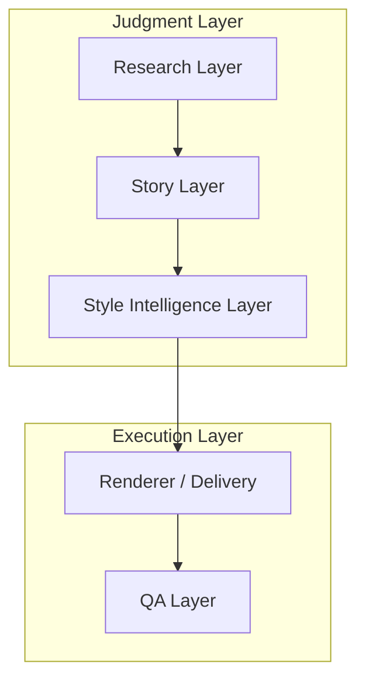
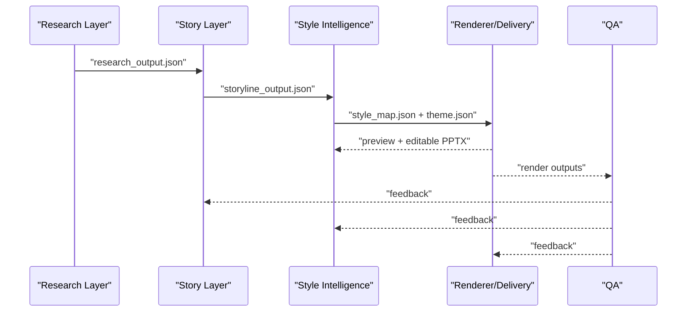
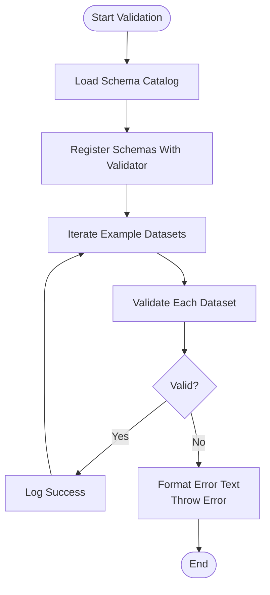
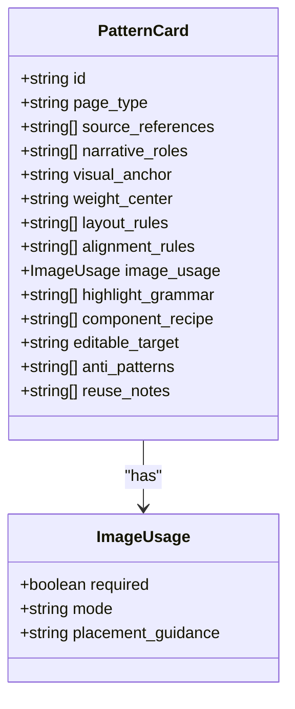
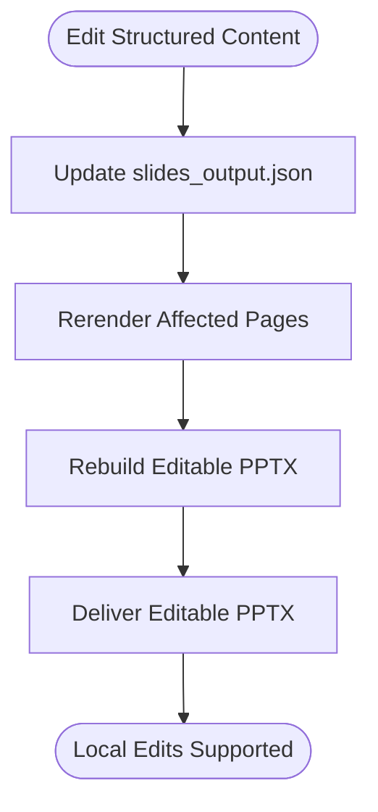
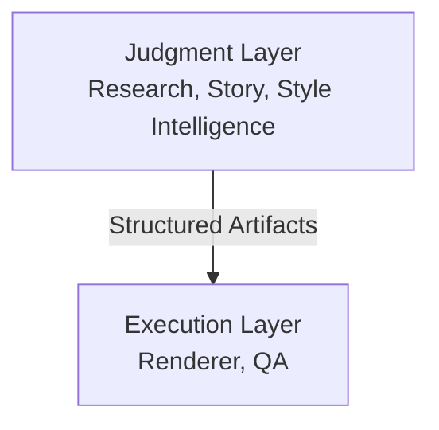
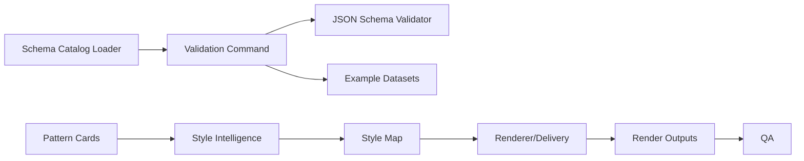

# Design Principles and Technical Decisions

<cite>
**Referenced Files in This Document**
- [02-design-principles.md](file://02-design-principles.md)
- [01-system-architecture.md](file://01-system-architecture.md)
- [04-editable-output-strategy.md](file://04-editable-output-strategy.md)
- [PROJECT_BLUEPRINT.md](file://PROJECT_BLUEPRINT.md)
- [module-boundaries.md](file://docs/architecture/module-boundaries.md)
- [pattern_card.schema.json](file://schemas/pattern_card.schema.json)
- [slides_output.schema.json](file://schemas/slides_output.schema.json)
- [style_map.schema.json](file://schemas/style_map.schema.json)
- [schemaCatalog.ts](file://src/lib/schemaCatalog.ts)
- [validateContracts.ts](file://src/commands/validateContracts.ts)
- [template.pattern-card.json](file://style/patterns/template.pattern-card.json)
- [cover_orbit.openclaw-seed.pattern.json](file://style/patterns/cover_orbit.openclaw-seed.pattern.json)
- [bottleneck_shift.openclaw-seed.pattern.json](file://style/patterns/bottleneck_shift.openclaw-seed.pattern.json)
- [ADR-0001-layered-pipeline.md](file://docs/decisions/ADR-0001-layered-pipeline.md)
</cite>

## Table of Contents
1. [Introduction](#introduction)
2. [Project Structure](#project-structure)
3. [Core Components](#core-components)
4. [Architecture Overview](#architecture-overview)
5. [Detailed Component Analysis](#detailed-component-analysis)
6. [Dependency Analysis](#dependency-analysis)
7. [Performance Considerations](#performance-considerations)
8. [Troubleshooting Guide](#troubleshooting-guide)
9. [Conclusion](#conclusion)
10. [Appendices](#appendices)

## Introduction
This document explains the Enterprise PPT System’s foundational design principles and the technical decisions that underpin them. It focuses on:
- Schema-driven validation as the contract enforcement mechanism
- Pattern-based design systems for visual consistency
- Editable PowerPoint preservation as a first-class delivery requirement
- Regression-safe assembly through layered separation of judgment and execution

It also documents the trade-offs between flexibility and determinism, the rationale for separate judgment and execution layers, and how these principles guide rapid iteration and quality assurance. Performance and scalability implications are addressed alongside guidance for future feature development and system evolution.

## Project Structure
The repository is organized around a layered pipeline that separates judgment (large-model-driven decisions) from execution (deterministic rendering and export). Structured JSON artifacts flow through the pipeline, validated by JSON Schemas, and transformed into preview outputs and editable PPTX.

**Diagram sources**
- [01-system-architecture.md:3-106](file://01-system-architecture.md#L3-L106)
- [module-boundaries.md:12-151](file://docs/architecture/module-boundaries.md#L12-L151)

**Section sources**
- [01-system-architecture.md:3-106](file://01-system-architecture.md#L3-L106)
- [module-boundaries.md:1-151](file://docs/architecture/module-boundaries.md#L1-L151)

## Core Components
- Judgment vs. Execution separation ensures that content and design decisions are distinct from rendering logic, enabling local rerendering, independent inspection, and safer evolution.
- Schema-driven validation enforces contracts across structured artifacts, ensuring deterministic behavior and reliable regression checks.
- Pattern-based design systems codify reusable visual knowledge as pattern cards, preserving design memory and enforcing consistency across decks.
- Editable PowerPoint preservation guarantees that final delivery supports ongoing local edits, avoiding brittle image-only outputs.

These principles collectively enable rapid iteration and robust quality assurance.

**Section sources**
- [02-design-principles.md:1-44](file://02-design-principles.md#L1-L44)
- [01-system-architecture.md:3-106](file://01-system-architecture.md#L3-L106)
- [04-editable-output-strategy.md:1-62](file://04-editable-output-strategy.md#L1-L62)
- [PROJECT_BLUEPRINT.md:26-45](file://PROJECT_BLUEPRINT.md#L26-L45)

## Architecture Overview
The system adopts a strict layered pipeline:
- Research: produces structured research outputs and source maps
- Story: compiles research into storyline and structured slide content
- Style Intelligence: binds page types, defines themes, and builds pattern libraries
- Renderer/Delivery: generates previews and editable PPTX
- QA: validates content, story, visuals, and exports

**Diagram sources**
- [01-system-architecture.md:73-83](file://01-system-architecture.md#L73-L83)
- [module-boundaries.md:6-151](file://docs/architecture/module-boundaries.md#L6-L151)

**Section sources**
- [01-system-architecture.md:73-83](file://01-system-architecture.md#L73-L83)
- [module-boundaries.md:6-151](file://docs/architecture/module-boundaries.md#L6-L151)

## Detailed Component Analysis

### Schema-Driven Validation
Rationale:
- JSON Schema validation provides a single source of truth for structured artifacts, ensuring deterministic behavior and predictable transformations.
- It enables fast, automated contract checks across the pipeline, reducing ambiguity and preventing downstream rendering errors.
- The validation command loads all schemas and validates example datasets, surfacing issues early in the process.

Implementation highlights:
- A catalog loader enumerates schema files and registers them with a JSON Schema validator.
- A validation command iterates over curated examples and reports detailed errors via the validator’s error-text utility.

Trade-offs:
- Strict schemas reduce flexibility during early experimentation but increase determinism and maintainability.
- Over-constraining schemas can slow iteration; balancing minimal required fields with helpful constraints is essential.

**Diagram sources**
- [schemaCatalog.ts:12-23](file://src/lib/schemaCatalog.ts#L12-L23)
- [validateContracts.ts:7-100](file://src/commands/validateContracts.ts#L7-L100)

**Section sources**
- [validateContracts.ts:7-100](file://src/commands/validateContracts.ts#L7-L100)
- [schemaCatalog.ts:12-23](file://src/lib/schemaCatalog.ts#L12-L23)
- [slides_output.schema.json:1-53](file://schemas/slides_output.schema.json#L1-L53)
- [style_map.schema.json:1-70](file://schemas/style_map.schema.json#L1-L70)
- [pattern_card.schema.json:1-75](file://schemas/pattern_card.schema.json#L1-L75)

### Pattern-Based Design Systems
Rationale:
- Pattern cards encode reusable visual knowledge: narrative roles, visual anchors, layout and alignment rules, component recipes, and anti-patterns.
- They enforce consistency while remaining adaptable to topic and audience, enabling rapid, high-quality iterations.

Key schema elements:
- Pattern cards include identifiers, page types, source references, narrative roles, visual anchors, weight centers, layout and alignment rules, image usage guidance, highlight grammar, component recipes, editable targets, anti-patterns, and reuse notes.

Examples:
- Template pattern card and seed-based pattern cards illustrate how the same page type can be adapted across contexts while preserving core compositional principles.

**Diagram sources**
- [pattern_card.schema.json:18-73](file://schemas/pattern_card.schema.json#L18-L73)

**Section sources**
- [pattern_card.schema.json:1-75](file://schemas/pattern_card.schema.json#L1-L75)
- [template.pattern-card.json:1-46](file://style/patterns/template.pattern-card.json#L1-L46)
- [cover_orbit.openclaw-seed.pattern.json:1-46](file://style/patterns/cover_orbit.openclaw-seed.pattern.json#L1-L46)
- [bottleneck_shift.openclaw-seed.pattern.json:1-46](file://style/patterns/bottleneck_shift.openclaw-seed.pattern.json#L1-L46)

### Editable PowerPoint Preservation
Rationale:
- Enterprise decks must be editable post-delivery. Purely image-backed outputs are brittle and prevent necessary revisions.
- The recommended model uses a dual pipeline: preview (fast HTML/PNG) and delivery (native PPT objects) to balance iteration speed and final fidelity.

Design constraint:
- Future renderers must map page types to native slide objects. Generic renderers without page-type semantics will not produce high-end results.

**Diagram sources**
- [04-editable-output-strategy.md:42-49](file://04-editable-output-strategy.md#L42-L49)

**Section sources**
- [04-editable-output-strategy.md:1-62](file://04-editable-output-strategy.md#L1-L62)
- [PROJECT_BLUEPRINT.md:505-515](file://PROJECT_BLUEPRINT.md#L505-L515)

### Separation of Judgment and Execution
Rationale:
- Mixing content/story decisions with rendering logic leads to contamination, expensive revisions, and style changes requiring content rewrites.
- Separation allows the same research to support multiple deck variants, the same storyline to render under different visual systems, and the same visual system to be reused across topics.

Decision record:
- Accepted architectural decision to adopt a layered pipeline with structured artifacts at each stage.

**Diagram sources**
- [01-system-architecture.md:3-106](file://01-system-architecture.md#L3-L106)
- [ADR-0001-layered-pipeline.md:1-24](file://docs/decisions/ADR-0001-layered-pipeline.md#L1-L24)

**Section sources**
- [01-system-architecture.md:85-97](file://01-system-architecture.md#L85-L97)
- [ADR-0001-layered-pipeline.md:1-24](file://docs/decisions/ADR-0001-layered-pipeline.md#L1-L24)

### Regression-Safe Assembly
Rationale:
- Deterministic rendering and versioned outputs ensure reproducibility and enable targeted rerenders.
- The renderer layer owns layout calculation, native PPT object mapping, local rerender, and versioned output directories, while avoiding content/story decisions.

Guidance:
- Keep page-type rules shared between preview and delivery renderers to minimize divergence.
- Maintain structured slide content as the single source of truth to simplify rerendering and QA.

**Section sources**
- [01-system-architecture.md:51-72](file://01-system-architecture.md#L51-L72)
- [module-boundaries.md:111-133](file://docs/architecture/module-boundaries.md#L111-L133)

## Dependency Analysis
The system’s dependencies center on structured contracts and shared registries:
- Validation depends on the schema catalog and AJV 2020
- Pattern cards depend on page-type semantics and style intelligence outputs
- Renderer depends on slides output, style map, and theme
- QA depends on rendered outputs and structured content

**Diagram sources**
- [schemaCatalog.ts:12-23](file://src/lib/schemaCatalog.ts#L12-L23)
- [validateContracts.ts:7-100](file://src/commands/validateContracts.ts#L7-L100)
- [pattern_card.schema.json:1-75](file://schemas/pattern_card.schema.json#L1-L75)
- [style_map.schema.json:1-70](file://schemas/style_map.schema.json#L1-L70)

**Section sources**
- [schemaCatalog.ts:12-23](file://src/lib/schemaCatalog.ts#L12-L23)
- [validateContracts.ts:7-100](file://src/commands/validateContracts.ts#L7-L100)
- [module-boundaries.md:111-151](file://docs/architecture/module-boundaries.md#L111-L151)

## Performance Considerations
- Validation performance: Loading and registering schemas is O(N) in the number of schema files; validating examples scales with dataset sizes. Keeping examples minimal and targeted improves throughput.
- Rendering performance: Shared page-type rules and theme token resolution reduce duplication and improve consistency. Local rerendering avoids full rebuilds, lowering latency for iterative feedback.
- Scalability: Versioned outputs and deterministic assembly support horizontal scaling of rendering tasks and parallel QA runs.

[No sources needed since this section provides general guidance]

## Troubleshooting Guide
Common issues and remedies:
- Validation failures: Use the validation command to identify failing datasets and review error messages. Ensure required fields are present and types match expectations.
- Style drift: Verify that page-type rules are enforced consistently across preview and delivery renderers. Confirm that the style map and theme are applied as intended.
- Editability problems: Confirm that editable targets are set appropriately in pattern cards and that native PPT object mapping is used for critical elements.

**Section sources**
- [validateContracts.ts:85-98](file://src/commands/validateContracts.ts#L85-L98)
- [04-editable-output-strategy.md:51-62](file://04-editable-output-strategy.md#L51-L62)

## Conclusion
The Enterprise PPT System’s design principles—schema-driven validation, pattern-based design systems, editable PowerPoint preservation, and regression-safe assembly—are implemented through a strict layered pipeline. These choices balance flexibility and determinism, enable rapid iteration, and ensure robust quality assurance. As the system evolves, continued adherence to structured contracts, shared page-type semantics, and editable-native delivery will guide scalable feature development and system maturity.

[No sources needed since this section summarizes without analyzing specific files]

## Appendices

### Appendix A: Design Principles Summary
- Content: facts first, interpretation second, recommendation third; chapters answer concrete decision questions; slides have one primary claim; avoid confusing completeness with presentation quality; enterprise decks state boundaries.
- Story: lock storyline before rendering; pages exist only if they serve a narrative role; chapter logic matters more than deck length; good decks are edited, not merely generated; audience adaptation is mandatory.
- Visual: color similarity is not design quality; each slide needs a visual anchor; page weight and visual center must be intentional; repeated generic layouts degrade quality; theme consistency and page variety must coexist.
- Rendering: preview and delivery are separate concerns; use structured content as the single source of truth; avoid image-only final delivery; support local page rerendering; use deterministic export paths and versioned outputs.
- QA: content QA and visual QA are separate review passes; preview a small critical set before full render; do not trust one-shot generation for enterprise deliverables; track unresolved assumptions explicitly; final delivery must be reproducible.
- Product: the system is a PPT production system, not a template launcher; large models should act as editor, design director, and reviewer; rules and code should handle precision and stability; every layer should be inspectable and replaceable; editable delivery is a first-class requirement.

**Section sources**
- [02-design-principles.md:1-44](file://02-design-principles.md#L1-L44)