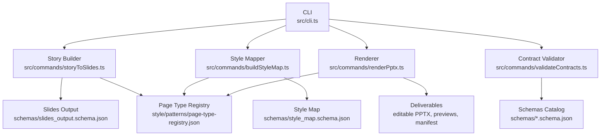
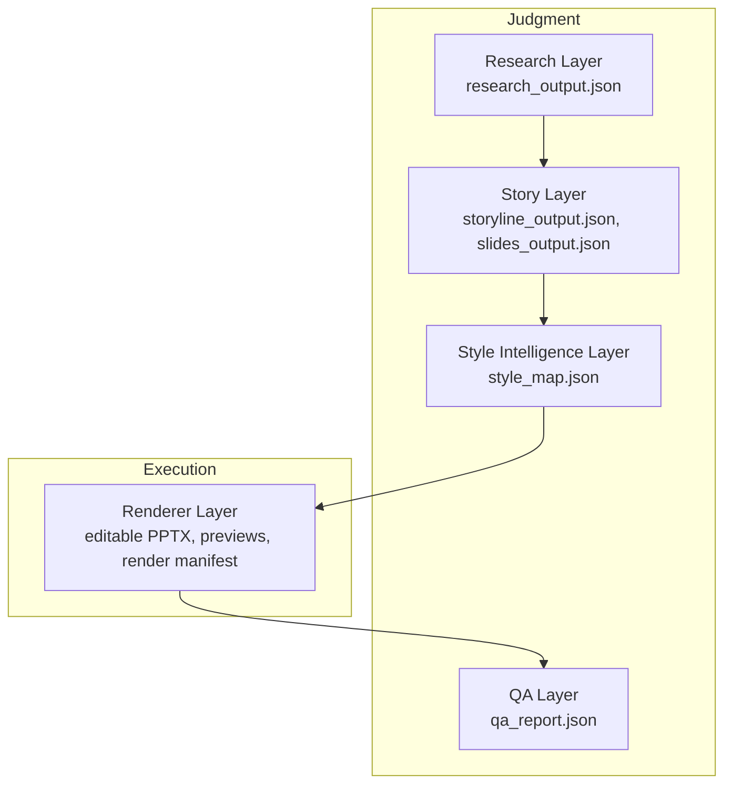
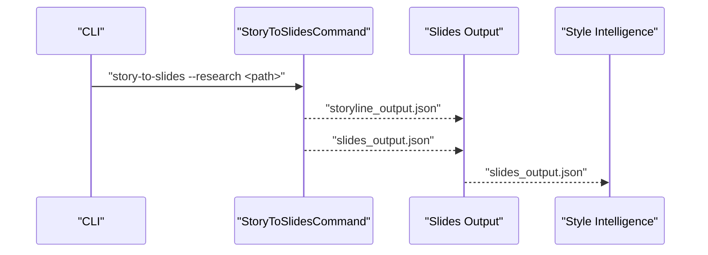
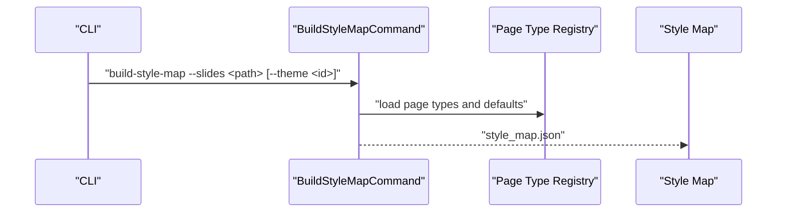
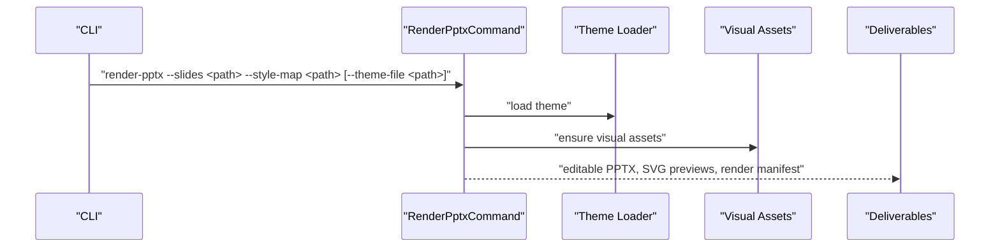
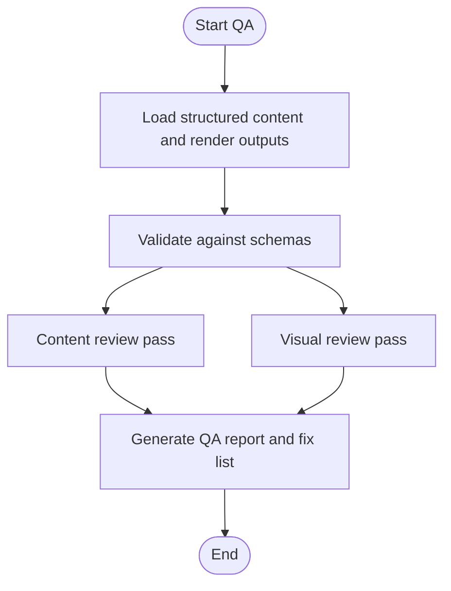
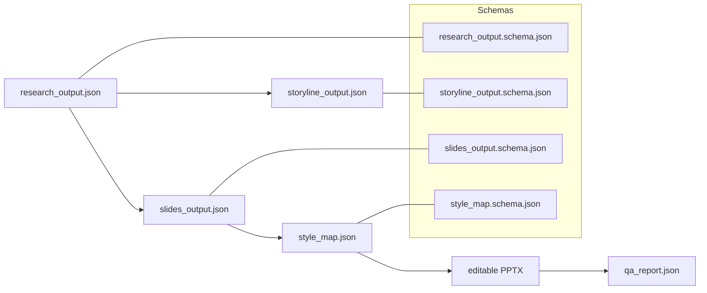

# Layered Pipeline Design

<cite>
**Referenced Files in This Document**
- [01-system-architecture.md](file://01-system-architecture.md)
- [02-design-principles.md](file://02-design-principles.md)
- [docs/architecture/deck-learning-system.md](file://docs/architecture/deck-learning-system.md)
- [docs/architecture/module-boundaries.md](file://docs/architecture/module-boundaries.md)
- [docs/decisions/ADR-0001-layered-pipeline.md](file://docs/decisions/ADR-0001-layered-pipeline.md)
- [src/cli.ts](file://src/cli.ts)
- [src/commands/buildStyleMap.ts](file://src/commands/buildStyleMap.ts)
- [src/commands/storyToSlides.ts](file://src/commands/storyToSlides.ts)
- [src/commands/renderPptx.ts](file://src/commands/renderPptx.ts)
- [src/commands/validateContracts.ts](file://src/commands/validateContracts.ts)
- [schemas/research_output.schema.json](file://schemas/research_output.schema.json)
- [schemas/storyline_output.schema.json](file://schemas/storyline_output.schema.json)
- [schemas/slides_output.schema.json](file://schemas/slides_output.schema.json)
- [schemas/style_map.schema.json](file://schemas/style_map.schema.json)
- [style/patterns/page-type-registry.json](file://style/patterns/page-type-registry.json)
</cite>

## Table of Contents
1. [Introduction](#introduction)
2. [Project Structure](#project-structure)
3. [Core Components](#core-components)
4. [Architecture Overview](#architecture-overview)
5. [Detailed Component Analysis](#detailed-component-analysis)
6. [Dependency Analysis](#dependency-analysis)
7. [Performance Considerations](#performance-considerations)
8. [Troubleshooting Guide](#troubleshooting-guide)
9. [Conclusion](#conclusion)
10. [Appendices](#appendices)

## Introduction
This document explains the Enterprise PPT System’s layered pipeline architecture and how it separates judgment from execution. The system is designed so that large language models drive creative and analytical decisions (research, story, style, and QA), while a deterministic code engine handles precise rendering, layout, and export. The five-layer pipeline is: Research Layer, Story Layer, Style Intelligence Layer, Renderer Layer, and QA Layer. Each layer produces structured artifacts that can be independently inspected, rerun, and evolved, enabling maintainability, flexibility, and efficient development.

## Project Structure
The repository organizes content around the pipeline layers and their artifacts:
- CLI exposes commands to orchestrate each layer and validate contracts.
- Commands implement each layer’s logic and transform structured JSON artifacts.
- Schemas define canonical data contracts for validation.
- Style assets and patterns provide reusable visual knowledge.
- Docs capture architecture, principles, and decisions.

**Diagram sources**
- [src/cli.ts:1-57](file://src/cli.ts#L1-L57)
- [src/commands/storyToSlides.ts:1-166](file://src/commands/storyToSlides.ts#L1-L166)
- [src/commands/buildStyleMap.ts:1-110](file://src/commands/buildStyleMap.ts#L1-L110)
- [src/commands/renderPptx.ts:1-801](file://src/commands/renderPptx.ts#L1-L801)
- [src/commands/validateContracts.ts:1-100](file://src/commands/validateContracts.ts#L1-L100)
- [schemas/slides_output.schema.json:1-53](file://schemas/slides_output.schema.json#L1-L53)
- [schemas/style_map.schema.json:1-70](file://schemas/style_map.schema.json#L1-L70)
- [style/patterns/page-type-registry.json:1-115](file://style/patterns/page-type-registry.json#L1-L115)

**Section sources**
- [src/cli.ts:1-57](file://src/cli.ts#L1-L57)
- [docs/architecture/module-boundaries.md:1-151](file://docs/architecture/module-boundaries.md#L1-L151)
- [01-system-architecture.md:1-106](file://01-system-architecture.md#L1-L106)

## Core Components
- Research Layer: Produces a structured research report and related metadata for downstream use.
- Story Layer: Transforms research into a storyline and per-slide content with narrative roles and page-type hints.
- Style Intelligence Layer: Binds page types, visual anchors, and layout rules into a style map informed by patterns and themes.
- Renderer Layer: Renders deterministic outputs (editable PPTX, previews) from structured slide content and style map.
- QA Layer: Validates content and visual fidelity against expectations and tracks fixes.

Key responsibilities and contracts are defined in the architecture and module boundaries documents, and enforced via JSON schemas and CLI commands.

**Section sources**
- [01-system-architecture.md:9-72](file://01-system-architecture.md#L9-L72)
- [docs/architecture/module-boundaries.md:12-151](file://docs/architecture/module-boundaries.md#L12-L151)
- [schemas/research_output.schema.json:1-88](file://schemas/research_output.schema.json#L1-L88)
- [schemas/storyline_output.schema.json:1-49](file://schemas/storyline_output.schema.json#L1-L49)
- [schemas/slides_output.schema.json:1-53](file://schemas/slides_output.schema.json#L1-L53)
- [schemas/style_map.schema.json:1-70](file://schemas/style_map.schema.json#L1-L70)

## Architecture Overview
The system enforces “separation of judgment from execution.” Judgment includes deciding content, narrative structure, and design intent. Execution covers deterministic layout, object placement, and export.

**Diagram sources**
- [01-system-architecture.md:3-106](file://01-system-architecture.md#L3-L106)
- [docs/architecture/module-boundaries.md:6-151](file://docs/architecture/module-boundaries.md#L6-L151)

## Detailed Component Analysis

### Research Layer
- Inputs: topic, audience, industry, objective, constraints, source materials.
- Outputs: research report, fact base, source map, key tensions/risks/open questions.
- Responsibilities: collect, analyze, and distill domain knowledge; remain neutral on layout and page types.
- Validation: validated by research_output.schema.json.

Concrete transformation: The Research Layer’s structured output feeds the Story Layer’s inputs.

**Section sources**
- [01-system-architecture.md:11-25](file://01-system-architecture.md#L11-L25)
- [docs/architecture/module-boundaries.md:12-35](file://docs/architecture/module-boundaries.md#L12-L35)
- [schemas/research_output.schema.json:1-88](file://schemas/research_output.schema.json#L1-L88)

### Story Layer
- Inputs: research outputs, optional reference deck extractions.
- Outputs: chapter logic, page-by-page storyline, per-page claims, supporting points, structured slide source.
- Responsibilities: lock narrative before rendering; ensure each page has a clear role; adapt to audience.
- CLI command: story-to-slides scaffolds storyline and slides outputs.

**Diagram sources**
- [src/cli.ts:42-48](file://src/cli.ts#L42-L48)
- [src/commands/storyToSlides.ts:12-166](file://src/commands/storyToSlides.ts#L12-L166)
- [schemas/storyline_output.schema.json:1-49](file://schemas/storyline_output.schema.json#L1-L49)
- [schemas/slides_output.schema.json:1-53](file://schemas/slides_output.schema.json#L1-L53)

**Section sources**
- [01-system-architecture.md:26-36](file://01-system-architecture.md#L26-L36)
- [docs/architecture/module-boundaries.md:36-61](file://docs/architecture/module-boundaries.md#L36-L61)
- [src/commands/storyToSlides.ts:12-166](file://src/commands/storyToSlides.ts#L12-L166)

### Style Intelligence Layer
- Inputs: page-type hints, audience tone, theme family, reference patterns.
- Outputs: style map, theme token set, page-type bindings, visual anchors.
- Responsibilities: bind page types to layout skeletons and visual anchors; preserve factual content from earlier layers.
- CLI command: build-style-map consumes slides_output.json and registry to produce style_map.json.

**Diagram sources**
- [src/cli.ts:45-46](file://src/cli.ts#L45-L46)
- [src/commands/buildStyleMap.ts:50-110](file://src/commands/buildStyleMap.ts#L50-L110)
- [style/patterns/page-type-registry.json:1-115](file://style/patterns/page-type-registry.json#L1-L115)
- [schemas/style_map.schema.json:1-70](file://schemas/style_map.schema.json#L1-L70)

**Section sources**
- [01-system-architecture.md:38-50](file://01-system-architecture.md#L38-L50)
- [docs/architecture/module-boundaries.md:62-85](file://docs/architecture/module-boundaries.md#L62-L85)
- [src/commands/buildStyleMap.ts:50-110](file://src/commands/buildStyleMap.ts#L50-L110)

### Renderer Layer
- Inputs: structured slide content, style map, theme tokens.
- Outputs: preview HTML/PNG, editable PPTX, render manifest.
- Responsibilities: deterministic layout, overflow handling, versioned outputs, and export safety.
- CLI command: render-pptx orchestrates rendering and writes deliverables.

**Diagram sources**
- [src/cli.ts:47-48](file://src/cli.ts#L47-L48)
- [src/commands/renderPptx.ts:83-187](file://src/commands/renderPptx.ts#L83-L187)

**Section sources**
- [01-system-architecture.md:51-61](file://01-system-architecture.md#L51-L61)
- [docs/architecture/module-boundaries.md:111-133](file://docs/architecture/module-boundaries.md#L111-L133)
- [src/commands/renderPptx.ts:83-187](file://src/commands/renderPptx.ts#L83-L187)

### QA Layer
- Inputs: rendered output, content source, source map.
- Outputs: content QA report, visual QA report, fix list.
- Responsibilities: separate content and visual reviews; track unresolved assumptions; ensure reproducibility.
- CLI command: validate-contracts checks all canonical artifacts against schemas.

**Diagram sources**
- [src/commands/validateContracts.ts:7-100](file://src/commands/validateContracts.ts#L7-L100)
- [schemas/research_output.schema.json:1-88](file://schemas/research_output.schema.json#L1-L88)
- [schemas/storyline_output.schema.json:1-49](file://schemas/storyline_output.schema.json#L1-L49)
- [schemas/slides_output.schema.json:1-53](file://schemas/slides_output.schema.json#L1-L53)
- [schemas/style_map.schema.json:1-70](file://schemas/style_map.schema.json#L1-L70)

**Section sources**
- [01-system-architecture.md:62-72](file://01-system-architecture.md#L62-L72)
- [docs/architecture/module-boundaries.md:134-151](file://docs/architecture/module-boundaries.md#L134-L151)
- [src/commands/validateContracts.ts:7-100](file://src/commands/validateContracts.ts#L7-L100)

## Dependency Analysis
The pipeline defines clear data dependencies and module boundaries. Each layer’s output is a schema-defined artifact consumed by the next layer. The CLI coordinates execution and ensures contracts are met.

**Diagram sources**
- [docs/architecture/module-boundaries.md:6-11](file://docs/architecture/module-boundaries.md#L6-L11)
- [schemas/research_output.schema.json:1-88](file://schemas/research_output.schema.json#L1-L88)
- [schemas/storyline_output.schema.json:1-49](file://schemas/storyline_output.schema.json#L1-L49)
- [schemas/slides_output.schema.json:1-53](file://schemas/slides_output.schema.json#L1-L53)
- [schemas/style_map.schema.json:1-70](file://schemas/style_map.schema.json#L1-L70)

**Section sources**
- [docs/architecture/module-boundaries.md:6-11](file://docs/architecture/module-boundaries.md#L6-L11)
- [src/commands/validateContracts.ts:26-83](file://src/commands/validateContracts.ts#L26-L83)

## Performance Considerations
- Deterministic rendering: The renderer computes layout and exports without randomness, reducing rework and enabling targeted rerenders.
- Local rerendering: The CLI supports rerendering specific pages, minimizing full rebuild costs.
- Schema-driven validation: Early contract checks prevent costly runtime failures and reduce debugging cycles.
- Pattern reuse: Style Intelligence consumes learned patterns to accelerate rendering and maintain consistency.

[No sources needed since this section provides general guidance]

## Troubleshooting Guide
Common issues and remedies:
- Mismatched slide counts: Ensure slides_output.json and style_map.json contain the same number of slides.
- Missing page-type binding: Verify page_type or page_type_hint is present on each slide; the Style Intelligence Layer requires one.
- Unknown page type: Confirm the page type exists in the registry; otherwise, update the slide hint or registry.
- Missing theme: Provide a theme ID or ensure the slides output includes a theme hint; the renderer loads the theme accordingly.
- Contract violations: Run validate-contracts to identify schema mismatches and fix the offending artifacts.

**Section sources**
- [src/commands/renderPptx.ts:111-113](file://src/commands/renderPptx.ts#L111-L113)
- [src/commands/buildStyleMap.ts:66-74](file://src/commands/buildStyleMap.ts#L66-L74)
- [src/commands/renderPptx.ts:108](file://src/commands/renderPptx.ts#L108)
- [src/commands/validateContracts.ts:85-98](file://src/commands/validateContracts.ts#L85-L98)

## Conclusion
The layered pipeline cleanly separates judgment from execution, enabling iterative refinement at each stage. Structured artifacts, schema validation, and deterministic rendering improve maintainability, flexibility, and development velocity. This design allows the same research to support multiple variants, the same storyline to render under different styles, and the same style to evolve across topics.

[No sources needed since this section summarizes without analyzing specific files]

## Appendices

### Why This Separation Improves Outcomes
- Content and layout contamination is prevented by keeping decisions in higher layers and rendering in code.
- Revisions become localized: fixing a slide’s wording affects only the Story Layer; changing visuals affects only the Style Intelligence and Renderer.
- Style evolution does not require rewriting content; the same structured slides can be restyled without content changes.
- Rendering bugs are easier to isolate because the Renderer is deterministic and consumes only structured inputs.

**Section sources**
- [01-system-architecture.md:85-97](file://01-system-architecture.md#L85-L97)

### Design Principles Underlying the Pipeline
- Content: facts first, interpretation second, recommendation third; every slide must have one primary claim.
- Story: lock storyline before rendering; pages must serve a narrative role; audience adaptation is mandatory.
- Visual: each slide needs a visual anchor; theme consistency and variety must coexist.
- Rendering: preview and delivery are separate; use structured content as the single source of truth; support local rerendering and deterministic exports.
- QA: content and visual QA are separate; preview critical pages first; do not trust one-shot generation; track unresolved assumptions; final delivery must be reproducible.

**Section sources**
- [02-design-principles.md:3-44](file://02-design-principles.md#L3-L44)

### Deck Learning System
- Goal: turn strong external decks into reusable page knowledge.
- Workflow: ingest reference decks → extract reference slides → merge patterns → feed style intelligence → verify with renderer and QA.
- Storage: raw assets in references; extracted cards in style/reference_extractions; reusable patterns in style/patterns.

**Section sources**
- [docs/architecture/deck-learning-system.md:1-37](file://docs/architecture/deck-learning-system.md#L1-L37)

### Architectural Decisions
- Adopt a layered pipeline with independent, inspectable modules.
- Each layer produces structured artifacts consumable by downstream layers.
- Consequences: local rerendering, style evolution without content rewrite, multiple deck variants from one research, and first-class module contracts.

**Section sources**
- [docs/decisions/ADR-0001-layered-pipeline.md:1-24](file://docs/decisions/ADR-0001-layered-pipeline.md#L1-L24)