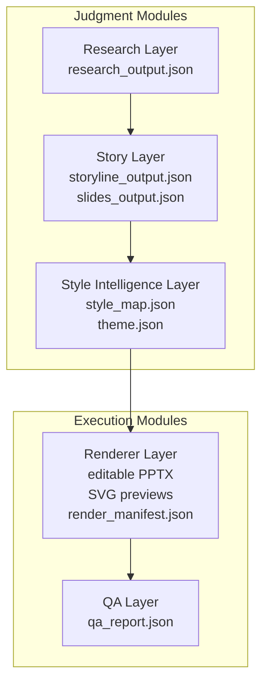
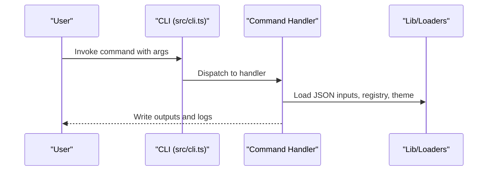
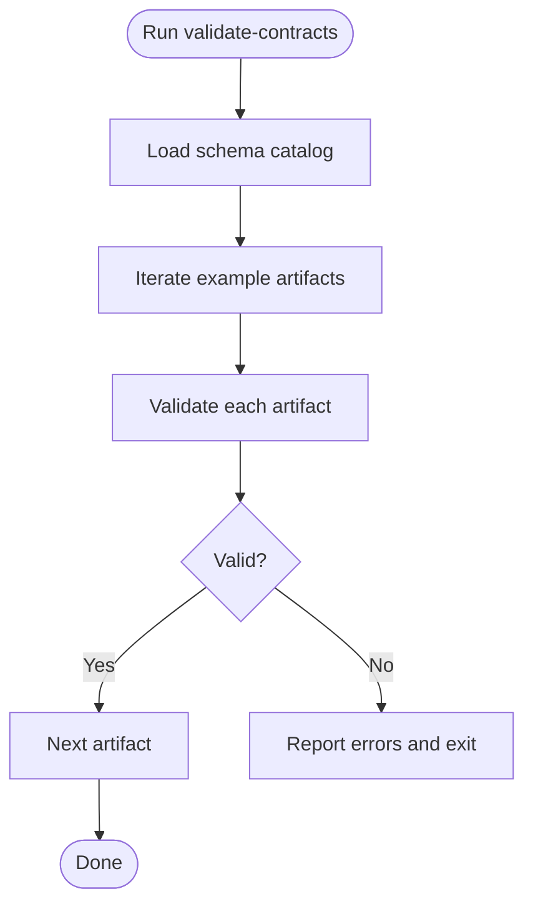
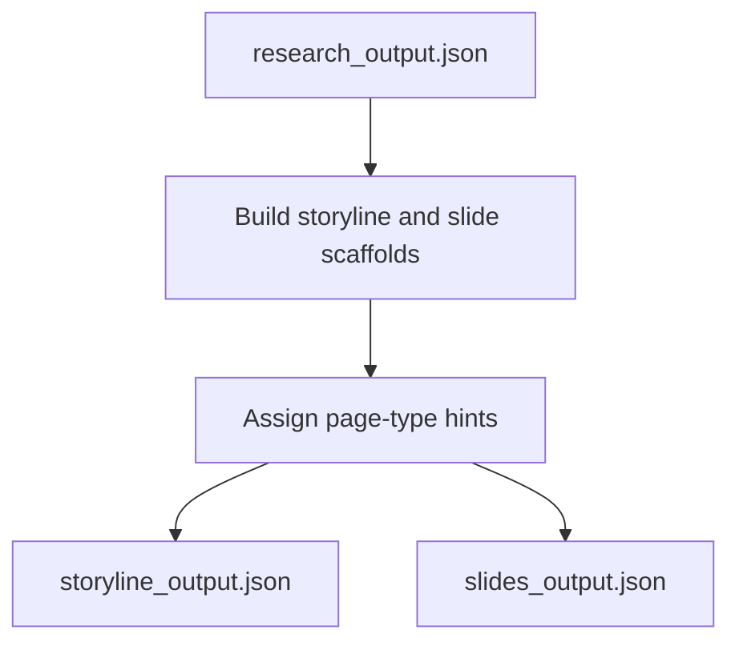
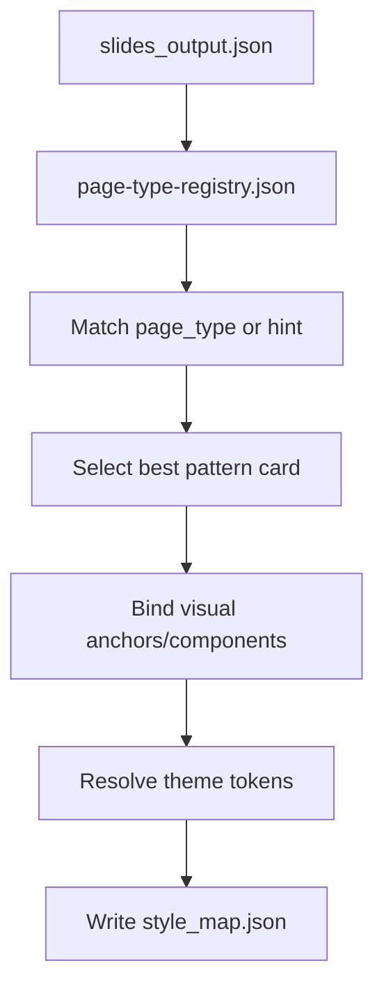
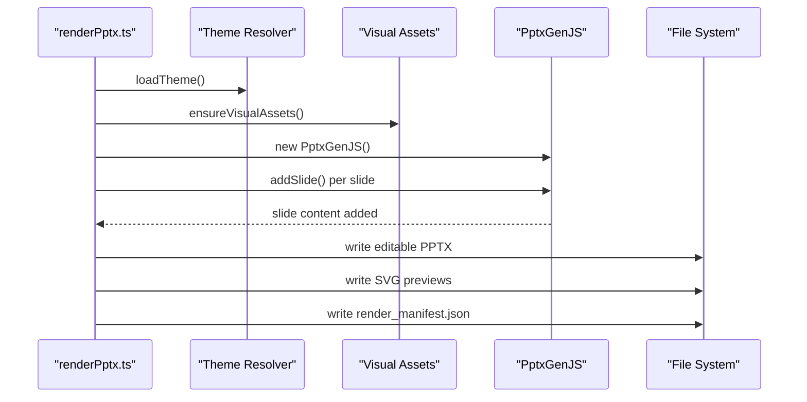
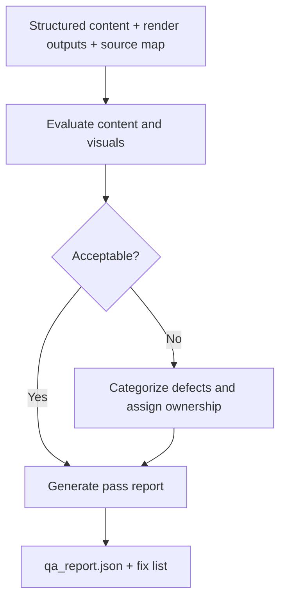
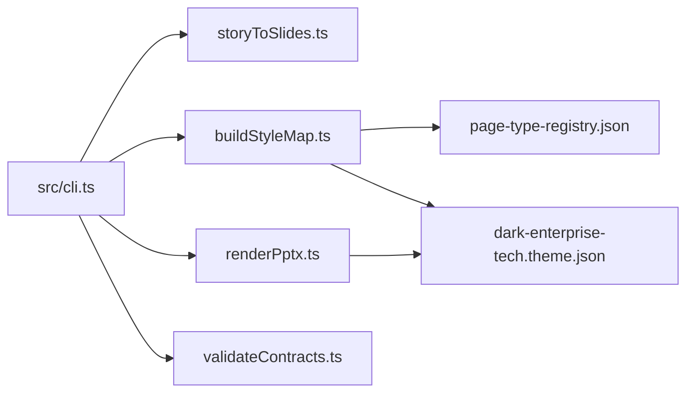

# Module Boundaries and Component Relationships

<cite>
**Referenced Files in This Document**
- [01-system-architecture.md](file://01-system-architecture.md)
- [module-boundaries.md](file://docs/architecture/module-boundaries.md)
- [ADR-0001-layered-pipeline.md](file://docs/decisions/ADR-0001-layered-pipeline.md)
- [cli.ts](file://src/cli.ts)
- [buildStyleMap.ts](file://src/commands/buildStyleMap.ts)
- [storyToSlides.ts](file://src/commands/storyToSlides.ts)
- [renderPptx.ts](file://src/commands/renderPptx.ts)
- [validateContracts.ts](file://src/commands/validateContracts.ts)
- [page-type-registry.json](file://style/patterns/page-type-registry.json)
- [dark-enterprise-tech.theme.json](file://style/themes/dark-enterprise-tech.theme.json)
- [package.json](file://package.json)
</cite>

## Table of Contents
1. [Introduction](#introduction)
2. [Project Structure](#project-structure)
3. [Core Components](#core-components)
4. [Architecture Overview](#architecture-overview)
5. [Detailed Component Analysis](#detailed-component-analysis)
6. [Dependency Analysis](#dependency-analysis)
7. [Performance Considerations](#performance-considerations)
8. [Troubleshooting Guide](#troubleshooting-guide)
9. [Conclusion](#conclusion)

## Introduction
This document defines the module boundaries and component interaction patterns for the Enterprise PPT System. It explains how judgment (research, story, style) is separated from execution (rendering, QA) to enable independent inspection, reruns, and reuse across variants. It documents canonical data contracts, runtime components, and the layered pipeline that keeps modules loosely coupled while ensuring efficient data flow.

## Project Structure
The system is organized around a CLI-driven pipeline with clearly defined modules:
- Research layer: consumes a brief and produces research outputs.
- Story layer: transforms research into structured storyline and slide scaffolds.
- Style Intelligence layer: binds page types, builds a style map, and resolves theme tokens.
- Renderer layer: generates editable PPTX, SVG previews, and a render manifest.
- QA layer: validates content and visual fidelity against expectations.

```mermaid
graph TB
subgraph "CLI"
CLI["src/cli.ts"]
end
subgraph "Commands"
STS["storyToSlides.ts"]
BSM["buildStyleMap.ts"]
RPTX["renderPptx.ts"]
VCON["validateContracts.ts"]
end
subgraph "Runtime Contracts"
PTREG["style/patterns/page-type-registry.json"]
THEME["style/themes/dark-enterprise-tech.theme.json"]
end
CLI --> STS
CLI --> BSM
CLI --> RPTX
CLI --> VCON
BSM --> PTREG
BSM --> THEME
RPTX --> THEME
```

**Diagram sources**
- [cli.ts:1-57](file://src/cli.ts#L1-L57)
- [storyToSlides.ts:1-166](file://src/commands/storyToSlides.ts#L1-L166)
- [buildStyleMap.ts:1-110](file://src/commands/buildStyleMap.ts#L1-L110)
- [renderPptx.ts:1-801](file://src/commands/renderPptx.ts#L1-L801)
- [page-type-registry.json:1-115](file://style/patterns/page-type-registry.json#L1-L115)
- [dark-enterprise-tech.theme.json:1-55](file://style/themes/dark-enterprise-tech.theme.json#L1-L55)

**Section sources**
- [01-system-architecture.md:1-106](file://01-system-architecture.md#L1-L106)
- [module-boundaries.md:1-151](file://docs/architecture/module-boundaries.md#L1-L151)
- [ADR-0001-layered-pipeline.md:1-24](file://docs/decisions/ADR-0001-layered-pipeline.md#L1-L24)
- [cli.ts:1-57](file://src/cli.ts#L1-L57)

## Core Components
- Content validator: validates JSON artifacts against schemas to ensure contract integrity.
- Page-type selector: selects a canonical page type per slide using a registry.
- Theme token resolver: loads theme tokens and typography for rendering.
- HTML preview renderer: writes SVG previews and an index for interactive review.
- Editable PPTX renderer: generates a deterministic, editable PowerPoint deck.
- Screenshot/export pipeline: outputs preview assets and a render manifest for downstream QA.
- QA checker: evaluates content and visuals against criteria and produces a QA report.

These components are orchestrated via CLI commands that enforce module boundaries and data contracts.

**Section sources**
- [01-system-architecture.md:98-106](file://01-system-architecture.md#L98-L106)
- [module-boundaries.md:134-151](file://docs/architecture/module-boundaries.md#L134-L151)
- [validateContracts.ts:1-100](file://src/commands/validateContracts.ts#L1-L100)
- [buildStyleMap.ts:1-110](file://src/commands/buildStyleMap.ts#L1-L110)
- [renderPptx.ts:1-801](file://src/commands/renderPptx.ts#L1-L801)

## Architecture Overview
The system enforces a strict judgment-execution separation:
- Judgment modules (research, story, style) produce structured artifacts that are validated and persisted.
- Execution modules (renderer, QA) consume these artifacts deterministically and produce outputs and manifests.



**Diagram sources**
- [01-system-architecture.md:73-83](file://01-system-architecture.md#L73-L83)
- [module-boundaries.md:6-11](file://docs/architecture/module-boundaries.md#L6-L11)

## Detailed Component Analysis

### CLI and Command Orchestration
The CLI exposes commands for each stage and runtime component:
- validate-contracts: validates all registered schemas against example artifacts.
- story-to-slides: scaffolds storyline and slide structures from research.
- build-style-map: constructs a style map from slides and page-type registry.
- render-pptx: renders editable PPTX, SVG previews, and a render manifest.
- rerender-pages: supports targeted rerenders of specific slides.



**Diagram sources**
- [cli.ts:19-57](file://src/cli.ts#L19-L57)
- [validateContracts.ts:7-100](file://src/commands/validateContracts.ts#L7-L100)
- [storyToSlides.ts:12-166](file://src/commands/storyToSlides.ts#L12-L166)
- [buildStyleMap.ts:50-110](file://src/commands/buildStyleMap.ts#L50-L110)
- [renderPptx.ts:83-187](file://src/commands/renderPptx.ts#L83-L187)

**Section sources**
- [cli.ts:10-50](file://src/cli.ts#L10-L50)
- [package.json:6-12](file://package.json#L6-L12)

### Content Validator
Responsibilities:
- Build a schema catalog and register validators.
- Validate example artifacts for research, slides, patterns, and reference extractions.

Data contracts validated:
- research_output.schema.json
- storyline_output.schema.json
- slides_output.schema.json
- reference_slide_extraction.schema.json
- pattern_card.schema.json
- benchmark_gallery.schema.json



**Diagram sources**
- [validateContracts.ts:7-100](file://src/commands/validateContracts.ts#L7-L100)

**Section sources**
- [validateContracts.ts:1-100](file://src/commands/validateContracts.ts#L1-L100)

### Story Builder
Responsibilities:
- Transform research into a structured storyline and slide scaffolds.
- Assign page-type hints per slide to guide style selection.

Key outputs:
- storyline_output.json
- slides_output.json



**Diagram sources**
- [storyToSlides.ts:12-166](file://src/commands/storyToSlides.ts#L12-L166)

**Section sources**
- [module-boundaries.md:36-61](file://docs/architecture/module-boundaries.md#L36-L61)
- [storyToSlides.ts:12-166](file://src/commands/storyToSlides.ts#L12-L166)

### Style Intelligence
Responsibilities:
- Select page types per slide using the page-type registry.
- Bind visual anchors, weights, density, and component recipes.
- Resolve theme tokens and produce a style map.

Inputs:
- slides_output.json
- page-type-registry.json
- theme selection (explicit or inferred)

Outputs:
- style_map.json
- theme.json



**Diagram sources**
- [buildStyleMap.ts:50-110](file://src/commands/buildStyleMap.ts#L50-L110)
- [page-type-registry.json:1-115](file://style/patterns/page-type-registry.json#L1-L115)
- [dark-enterprise-tech.theme.json:1-55](file://style/themes/dark-enterprise-tech.theme.json#L1-L55)

**Section sources**
- [module-boundaries.md:62-85](file://docs/architecture/module-boundaries.md#L62-L85)
- [buildStyleMap.ts:1-110](file://src/commands/buildStyleMap.ts#L1-L110)

### Renderer
Responsibilities:
- Render editable PPTX using a deterministic layout engine.
- Generate SVG previews and an index for review.
- Produce a render manifest with output paths and rerender metadata.

Inputs:
- slides_output.json
- style_map.json
- theme.json

Outputs:
- editable PPTX
- SVG previews
- render_manifest.json



**Diagram sources**
- [renderPptx.ts:83-187](file://src/commands/renderPptx.ts#L83-L187)

**Section sources**
- [module-boundaries.md:111-133](file://docs/architecture/module-boundaries.md#L111-L133)
- [renderPptx.ts:1-801](file://src/commands/renderPptx.ts#L1-L801)

### QA Checker
Responsibilities:
- Validate rendered outputs against structured content and source maps.
- Produce a QA report and actionable fix list.

Inputs:
- structured content
- render outputs
- source map

Outputs:
- qa_report.json
- fix list



**Diagram sources**
- [module-boundaries.md:134-151](file://docs/architecture/module-boundaries.md#L134-L151)

**Section sources**
- [module-boundaries.md:134-151](file://docs/architecture/module-boundaries.md#L134-L151)

## Dependency Analysis
The modules depend on shared contracts and resources:
- Shared contracts: schemas for research, slides, storyline, patterns, and extractions.
- Shared resources: page-type registry and theme definitions.
- CLI orchestration: routes commands to handlers and manages exit codes.



**Diagram sources**
- [cli.ts:1-57](file://src/cli.ts#L1-L57)
- [buildStyleMap.ts:1-110](file://src/commands/buildStyleMap.ts#L1-L110)
- [renderPptx.ts:1-801](file://src/commands/renderPptx.ts#L1-L801)
- [page-type-registry.json:1-115](file://style/patterns/page-type-registry.json#L1-L115)
- [dark-enterprise-tech.theme.json:1-55](file://style/themes/dark-enterprise-tech.theme.json#L1-L55)

**Section sources**
- [cli.ts:1-57](file://src/cli.ts#L1-L57)
- [package.json:1-24](file://package.json#L1-L24)

## Performance Considerations
- Deterministic rendering: The renderer uses fixed layouts and explicit coordinates to minimize variability across runs.
- Asset caching: Visual assets are ensured once per run and reused across slides.
- Incremental rerendering: The render manifest tracks slide artifacts and rerender flags to support targeted updates.
- Validation cost: Contract validation runs once during CI or preflight checks to fail fast on malformed artifacts.

## Troubleshooting Guide
Common issues and resolutions:
- Missing required arguments: Commands validate required inputs and surface descriptive errors. Ensure paths for slides, style maps, and themes are provided.
- Schema validation failures: Run the content validator to identify mismatches between artifacts and schemas.
- Mismatched slide counts: The renderer verifies that slides and style map entries match; ensure both inputs are produced by the same pipeline run.
- Unknown page types: The style mapper throws when a page type is not present in the registry; confirm the page-type hint or registry entry.
- Output conflicts: The renderer automatically appends timestamps to prevent overwriting existing files.

Operational tips:
- Use validate-contracts before rendering to catch schema errors early.
- Re-run story-to-slides to refresh slide scaffolds when research changes.
- Use build-style-map to regenerate style maps after updating page-type hints or patterns.
- Use render-pptx to rebuild outputs; leverage rerender flags in the manifest for targeted updates.

**Section sources**
- [buildStyleMap.ts:50-110](file://src/commands/buildStyleMap.ts#L50-L110)
- [renderPptx.ts:83-187](file://src/commands/renderPptx.ts#L83-L187)
- [validateContracts.ts:7-100](file://src/commands/validateContracts.ts#L7-L100)

## Conclusion
The Enterprise PPT System achieves clear module boundaries by separating judgment from execution. Each layer produces verifiable artifacts that can be independently inspected and rerun. The CLI orchestrates commands that enforce data contracts, while shared resources like the page-type registry and theme definitions keep style and rendering decoupled. This design enables efficient data flow, robust QA, and scalable iteration across content, style, and delivery variants.