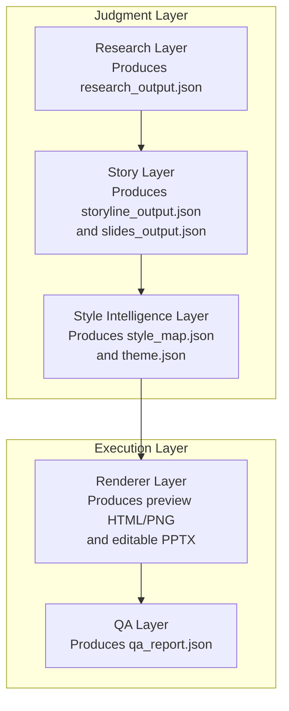
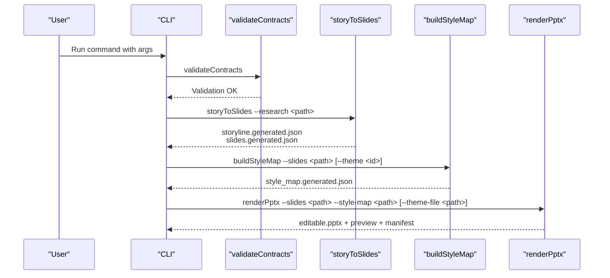
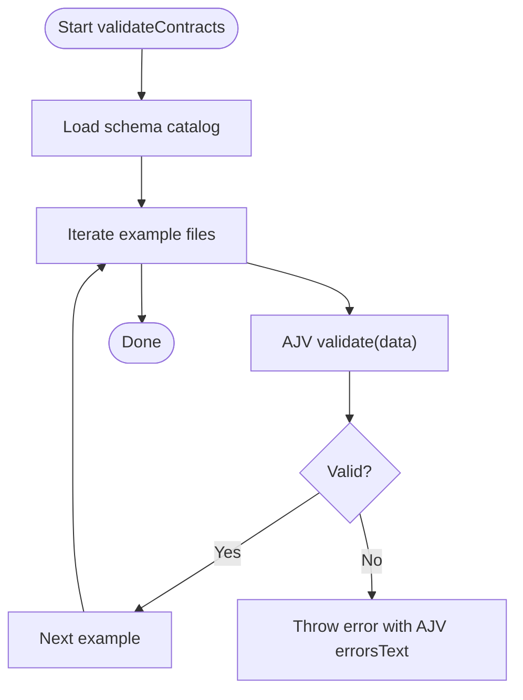
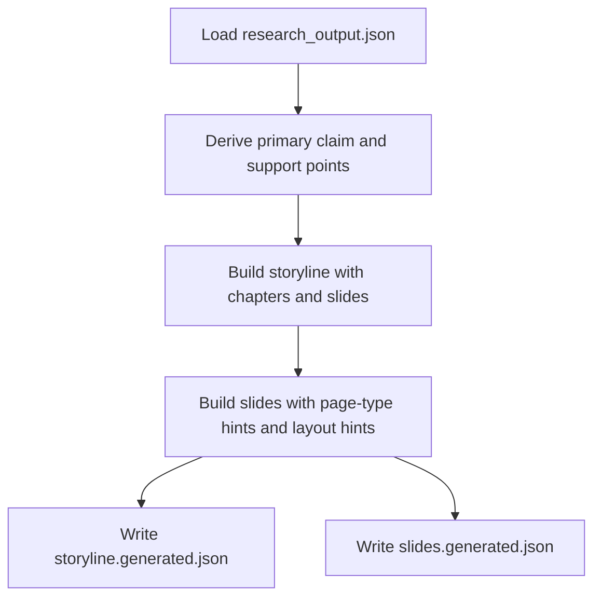
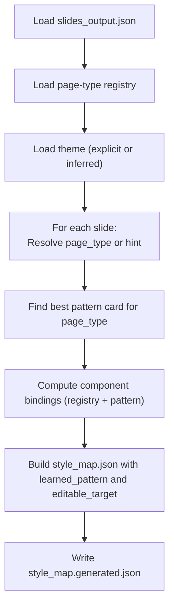
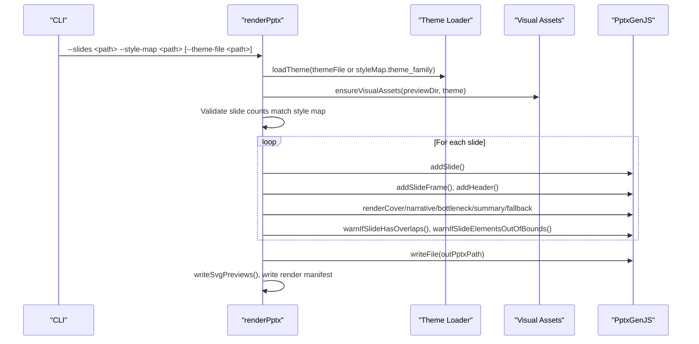
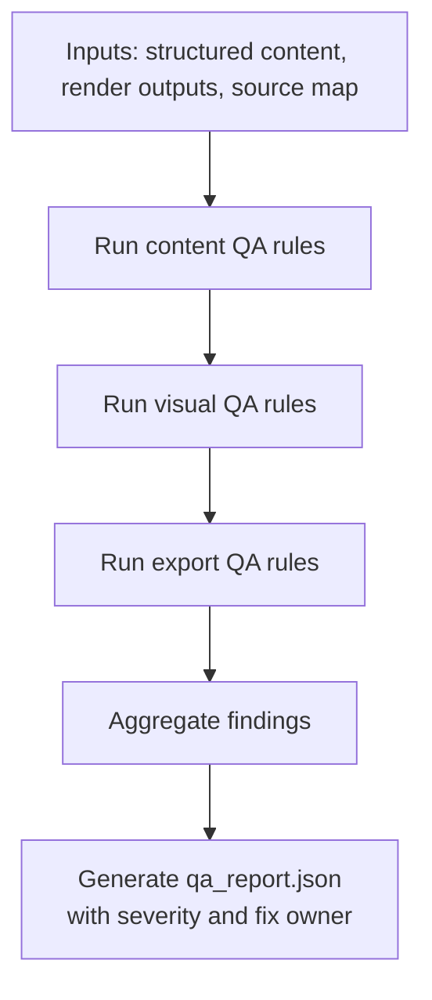
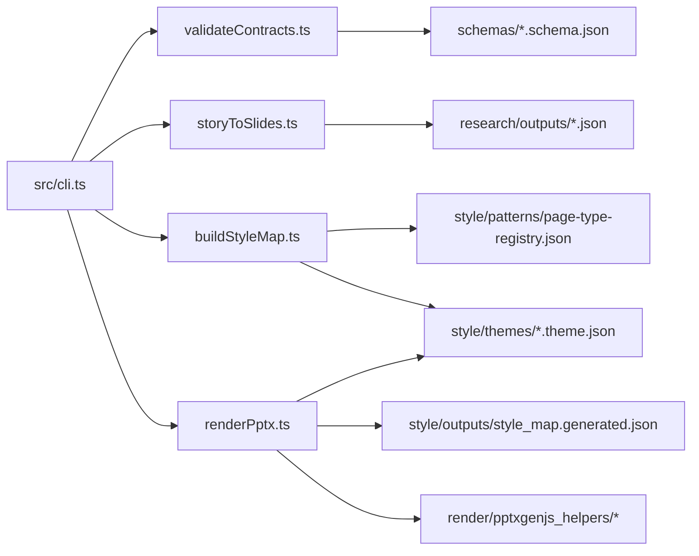
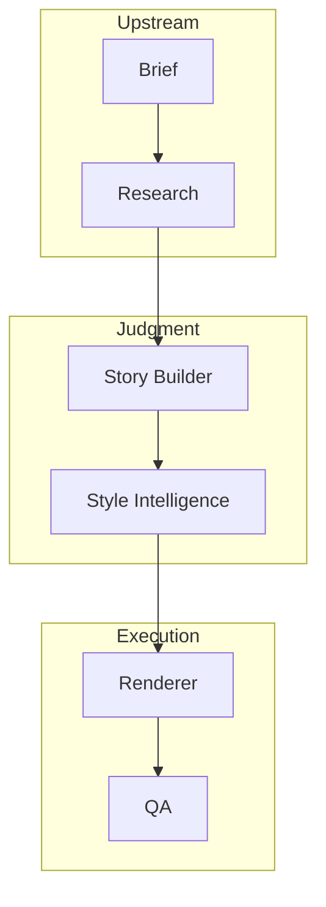

# System Architecture

<cite>
**Referenced Files in This Document**
- [01-system-architecture.md](file://01-system-architecture.md)
- [PROJECT_BLUEPRINT.md](file://PROJECT_BLUEPRINT.md)
- [docs/architecture/module-boundaries.md](file://docs/architecture/module-boundaries.md)
- [docs/decisions/ADR-0001-layered-pipeline.md](file://docs/decisions/ADR-0001-layered-pipeline.md)
- [src/cli.ts](file://src/cli.ts)
- [src/commands/validateContracts.ts](file://src/commands/validateContracts.ts)
- [src/commands/buildStyleMap.ts](file://src/commands/buildStyleMap.ts)
- [src/commands/storyToSlides.ts](file://src/commands/storyToSlides.ts)
- [src/commands/renderPptx.ts](file://src/commands/renderPptx.ts)
- [schemas/research_output.schema.json](file://schemas/research_output.schema.json)
- [schemas/slides_output.schema.json](file://schemas/slides_output.schema.json)
- [style/patterns/page-type-registry.json](file://style/patterns/page-type-registry.json)
- [style/themes/dark-enterprise-tech.theme.json](file://style/themes/dark-enterprise-tech.theme.json)
</cite>

## Table of Contents
1. [Introduction](#introduction)
2. [Project Structure](#project-structure)
3. [Core Components](#core-components)
4. [Architecture Overview](#architecture-overview)
5. [Detailed Component Analysis](#detailed-component-analysis)
6. [Dependency Analysis](#dependency-analysis)
7. [Performance Considerations](#performance-considerations)
8. [Troubleshooting Guide](#troubleshooting-guide)
9. [Conclusion](#conclusion)
10. [Appendices](#appendices)

## Introduction
This document describes the Enterprise PPT System’s layered pipeline design. The system separates judgment from execution to enable:
- Inspectable, structured artifacts at each layer
- Independent reruns and local revisions
- Reusable style intelligence decoupled from content
- Deterministic rendering for both preview and editable PPTX

The pipeline comprises five layers: Research, Story, Style Intelligence, Renderer, and QA. Artifacts produced by earlier layers serve as contracts for downstream modules, enforced by schema-driven validation and explicit CLI commands.

## Project Structure
The repository is organized by functional domains and artifacts:
- docs: Architectural decisions, module boundaries, and workflows
- schemas: JSON Schemas defining contracts for structured data
- research: Inputs, outputs, and templates for upstream research
- story: Structured storyline and slide source prior to style binding
- style: Themes, patterns, page-type registry, and reference extractions
- render: Rendering pipeline, preview, delivery, and page-type implementations
- qa: Validators, checklists, and QA reports
- skills: Skill modules implementing each layer’s capabilities
- assets: UI primitives, backgrounds, icons, and illustrations
- output: Versioned preview, delivery, and QA artifacts
- src: CLI and command implementations orchestrating the pipeline

```mermaid
graph TB
subgraph "Docs"
A1["docs/architecture/*"]
A2["docs/decisions/*"]
A3["docs/workflows/*"]
end
subgraph "Schemas"
S1["schemas/*.schema.json"]
end
subgraph "Research"
R1["research/inputs/*"]
R2["research/outputs/*"]
R3["research/templates/*"]
end
subgraph "Story"
ST1["story/inputs/*"]
ST2["story/outputs/*"]
ST3["story/prompts/*"]
ST4["story/rules/*"]
end
subgraph "Style"
Y1["style/themes/*"]
Y2["style/patterns/*"]
Y3["style/components/*"]
Y4["style/reference_extractions/*"]
Y5["style/lessons/*"]
end
subgraph "Render"
RD1["render/page_types/*"]
RD2["render/preview/*"]
RD3["render/delivery/*"]
RD4["render/pipeline/*"]
end
subgraph "QA"
Q1["qa/checklists/*"]
Q2["qa/validators/*"]
Q3["qa/reports/*"]
end
subgraph "Skills"
SK1["skills/deep-research/*"]
SK2["skills/ppt-story-builder/*"]
SK3["skills/ppt-style-renderer/*"]
SK4["skills/ppt-style-memory/*"]
end
subgraph "CLI"
C1["src/cli.ts"]
C2["src/commands/*"]
end
A1 --> S1
A2 --> S1
A3 --> S1
S1 --> C2
R2 --> C2
ST2 --> C2
Y2 --> C2
Y1 --> C2
RD1 --> C2
Q2 --> C2
SK1 --> C2
SK2 --> C2
SK3 --> C2
SK4 --> C2
C1 --> C2
```

**Diagram sources**
- [01-system-architecture.md:1-106](file://01-system-architecture.md#L1-L106)
- [PROJECT_BLUEPRINT.md:218-276](file://PROJECT_BLUEPRINT.md#L218-L276)

**Section sources**
- [01-system-architecture.md:1-106](file://01-system-architecture.md#L1-L106)
- [PROJECT_BLUEPRINT.md:218-276](file://PROJECT_BLUEPRINT.md#L218-L276)

## Core Components
This section outlines the five-layer pipeline and the responsibilities of each layer.

- Judgment layer
  - Research: Produces structured research outputs with facts, interpretations, risks, constraints, and sources.
  - Story: Converts research into structured storyline and slide content with narrative roles and page-type hints.
  - Style Intelligence: Builds style maps from slides and page-type registry, binds themes and pattern cards, and defines editable targets.

- Execution layer
  - Renderer: Renders preview outputs and editable PPTX using deterministic layout rules and shared theme tokens.
  - QA: Validates content, story, visual, and export integrity against explicit rules and generates reproducible QA reports.

- Contracts and validation
  - JSON Schemas define canonical contracts for research_output, slides_output, and related artifacts.
  - CLI commands enforce validation and orchestrate each stage.

**Section sources**
- [01-system-architecture.md:9-72](file://01-system-architecture.md#L9-L72)
- [PROJECT_BLUEPRINT.md:26-45](file://PROJECT_BLUEPRINT.md#L26-L45)
- [docs/architecture/module-boundaries.md:12-151](file://docs/architecture/module-boundaries.md#L12-L151)

## Architecture Overview
The system enforces separation of concerns by producing inspectable, versioned artifacts at each layer. The canonical data flow moves from upstream research to structured slides, then to style binding and rendering, and finally to QA.

**Diagram sources**
- [01-system-architecture.md:73-83](file://01-system-architecture.md#L73-L83)
- [PROJECT_BLUEPRINT.md:46](file://PROJECT_BLUEPRINT.md#L46)

## Detailed Component Analysis

### CLI Orchestration
The CLI exposes commands for each stage, ensuring deterministic invocation and consistent artifact generation.

**Diagram sources**
- [src/cli.ts:19-50](file://src/cli.ts#L19-L50)
- [src/commands/validateContracts.ts:7-99](file://src/commands/validateContracts.ts#L7-L99)
- [src/commands/storyToSlides.ts:12-165](file://src/commands/storyToSlides.ts#L12-L165)
- [src/commands/buildStyleMap.ts:50-109](file://src/commands/buildStyleMap.ts#L50-L109)
- [src/commands/renderPptx.ts:83-187](file://src/commands/renderPptx.ts#L83-L187)

**Section sources**
- [src/cli.ts:1-57](file://src/cli.ts#L1-L57)
- [src/commands/validateContracts.ts:1-100](file://src/commands/validateContracts.ts#L1-L100)
- [src/commands/storyToSlides.ts:1-166](file://src/commands/storyToSlides.ts#L1-L166)
- [src/commands/buildStyleMap.ts:1-110](file://src/commands/buildStyleMap.ts#L1-L110)
- [src/commands/renderPptx.ts:1-801](file://src/commands/renderPptx.ts#L1-L801)

### Schema-Driven Validation
Structured contracts ensure correctness and reproducibility across the pipeline. The validation command loads the schema catalog and validates example datasets.

**Diagram sources**
- [src/commands/validateContracts.ts:22-99](file://src/commands/validateContracts.ts#L22-L99)

**Section sources**
- [src/commands/validateContracts.ts:1-100](file://src/commands/validateContracts.ts#L1-L100)
- [schemas/research_output.schema.json:1-88](file://schemas/research_output.schema.json#L1-L88)
- [schemas/slides_output.schema.json:1-53](file://schemas/slides_output.schema.json#L1-L53)

### Story Builder to Slides
The story-to-slides command transforms research into structured slides with narrative roles and page-type hints. It writes both storyline and slides outputs for downstream style binding.

**Diagram sources**
- [src/commands/storyToSlides.ts:21-165](file://src/commands/storyToSlides.ts#L21-L165)

**Section sources**
- [src/commands/storyToSlides.ts:1-166](file://src/commands/storyToSlides.ts#L1-L166)

### Style Intelligence and Style Map Construction
The style map command binds page types, resolves themes, and aggregates component bindings from pattern cards. It ensures each slide has explicit visual anchors, weight centers, and editable targets.

**Diagram sources**
- [src/commands/buildStyleMap.ts:59-109](file://src/commands/buildStyleMap.ts#L59-L109)
- [style/patterns/page-type-registry.json:1-115](file://style/patterns/page-type-registry.json#L1-L115)
- [style/themes/dark-enterprise-tech.theme.json:1-55](file://style/themes/dark-enterprise-tech.theme.json#L1-L55)

**Section sources**
- [src/commands/buildStyleMap.ts:1-110](file://src/commands/buildStyleMap.ts#L1-L110)
- [style/patterns/page-type-registry.json:1-115](file://style/patterns/page-type-registry.json#L1-L115)
- [style/themes/dark-enterprise-tech.theme.json:1-55](file://style/themes/dark-enterprise-tech.theme.json#L1-L55)

### Renderer: Preview and Editable PPTX
The renderer consumes slides and style maps to produce preview outputs and editable PPTX. It switches rendering logic by page type and writes a render manifest for traceability.

**Diagram sources**
- [src/commands/renderPptx.ts:106-187](file://src/commands/renderPptx.ts#L106-L187)

**Section sources**
- [src/commands/renderPptx.ts:1-801](file://src/commands/renderPptx.ts#L1-L801)

### QA Layer
The QA layer validates content, story, visual, and export integrity and produces a reproducible QA report with severity and fix ownership.

**Section sources**
- [docs/architecture/module-boundaries.md:134-151](file://docs/architecture/module-boundaries.md#L134-L151)
- [PROJECT_BLUEPRINT.md:194-217](file://PROJECT_BLUEPRINT.md#L194-L217)

## Dependency Analysis
The system’s modularity is enforced by explicit CLI commands and schema contracts. Each command encapsulates a stage and its dependencies.

**Diagram sources**
- [src/cli.ts:10-17](file://src/cli.ts#L10-L17)
- [src/commands/validateContracts.ts:20-24](file://src/commands/validateContracts.ts#L20-L24)
- [src/commands/buildStyleMap.ts:3-6](file://src/commands/buildStyleMap.ts#L3-L6)
- [src/commands/renderPptx.ts:5-9](file://src/commands/renderPptx.ts#L5-L9)

**Section sources**
- [src/cli.ts:1-57](file://src/cli.ts#L1-L57)
- [src/commands/validateContracts.ts:1-100](file://src/commands/validateContracts.ts#L1-L100)
- [src/commands/buildStyleMap.ts:1-110](file://src/commands/buildStyleMap.ts#L1-L110)
- [src/commands/renderPptx.ts:1-801](file://src/commands/renderPptx.ts#L1-L801)

## Performance Considerations
- Local rerender: The system supports rerendering individual slides without rebuilding the entire deck, reducing iteration time.
- Shared theme and page-type registry: Ensures consistent rendering across preview and delivery engines.
- Deterministic layout: Rendering logic is centralized per page type, minimizing regressions and enabling targeted fixes.
- Scalability: The layered design allows parallel development of story, style, and rendering modules, with schema contracts guarding integration points.

[No sources needed since this section provides general guidance]

## Troubleshooting Guide
Common issues and remedies:
- Validation failures: Use the validation command to check example datasets and schema compliance.
- Style map mismatches: Ensure slides_output and style_map contain the same number of slides and that each slide has a valid page_type or page_type_hint.
- Theme or asset issues: Confirm theme loading and visual asset provisioning paths.
- QA rejections: Review the QA report for severity and ownership; address findings iteratively.

**Section sources**
- [src/commands/validateContracts.ts:85-99](file://src/commands/validateContracts.ts#L85-L99)
- [src/commands/buildStyleMap.ts:66-74](file://src/commands/buildStyleMap.ts#L66-L74)
- [src/commands/renderPptx.ts:111-113](file://src/commands/renderPptx.ts#L111-L113)
- [docs/architecture/module-boundaries.md:134-151](file://docs/architecture/module-boundaries.md#L134-L151)

## Conclusion
The Enterprise PPT System’s layered pipeline enforces separation of judgment and execution, enabling inspectability, local rerendering, and reusable style intelligence. Schema-driven contracts and explicit CLI commands ensure robust integration and reproducibility. The design supports scalability, extensibility, and enterprise-grade reviewability.

[No sources needed since this section summarizes without analyzing specific files]

## Appendices

### System Context Diagram
This diagram shows how modules interact during presentation production.

[No sources needed since this diagram shows conceptual workflow, not actual code structure]

### Architectural Decisions
- Layered pipeline accepted to separate judgment from execution.
- Editable PPTX as a first-class delivery target.
- Schema-driven contracts for all artifacts.
- Pattern-based design for style intelligence and page-type registry.

**Section sources**
- [docs/decisions/ADR-0001-layered-pipeline.md:1-24](file://docs/decisions/ADR-0001-layered-pipeline.md#L1-L24)
- [PROJECT_BLUEPRINT.md:8-22](file://PROJECT_BLUEPRINT.md#L8-L22)
- [01-system-architecture.md:3-106](file://01-system-architecture.md#L3-L106)