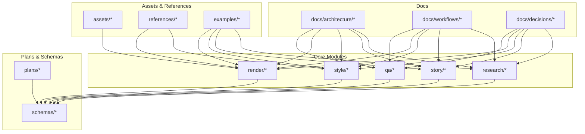
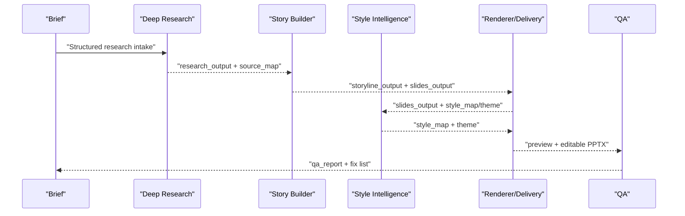
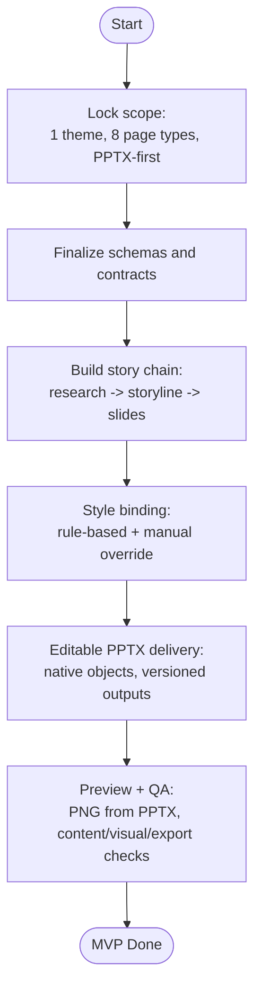
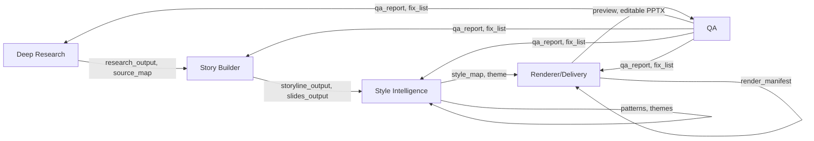

# Development Planning and Roadmap

<cite>
**Referenced Files in This Document**
- [mvp-roadmap.md](file://plans/mvp-roadmap.md)
- [PROJECT_BLUEPRINT.md](file://PROJECT_BLUEPRINT.md)
- [PROJECT_INIT.md](file://PROJECT_INIT.md)
- [market-gap.md](file://references/market-gap.md)
- [open-questions.md](file://references/open-questions.md)
- [fast-track-mvp.md](file://docs/workflows/fast-track-mvp.md)
- [mvp-scope.md](file://docs/workflows/mvp-scope.md)
- [deck-learning-system.md](file://docs/architecture/deck-learning-system.md)
- [module-boundaries.md](file://docs/architecture/module-boundaries.md)
- [ADR-0001-layered-pipeline.md](file://docs/decisions/ADR-0001-layered-pipeline.md)
- [ADR-0002-editable-pptx-strategy.md](file://docs/decisions/ADR-0002-editable-pptx-strategy.md)
- [ADR-0003-fast-track-mvp.md](file://docs/decisions/ADR-0003-fast-track-mvp.md)
- [skill-split.md](file://references/skill-split.md)
- [style-intelligence.md](file://references/style-intelligence.md)
- [quality-bar.md](file://references/quality-bar.md)
- [validated-slide-patterns.md](file://references/validated-slide-patterns.md)
</cite>

## Table of Contents
1. [Introduction](#introduction)
2. [Project Structure](#project-structure)
3. [Core Components](#core-components)
4. [Architecture Overview](#architecture-overview)
5. [Detailed Component Analysis](#detailed-component-analysis)
6. [Dependency Analysis](#dependency-analysis)
7. [Performance Considerations](#performance-considerations)
8. [Troubleshooting Guide](#troubleshooting-guide)
9. [Conclusion](#conclusion)
10. [Appendices](#appendices)

## Introduction
This document provides a comprehensive development plan for the Deck Learning System, mapping strategic direction to tactical execution across phases. It synthesizes the product goal, layered architecture, and decision records to define the MVP roadmap, phase-two expansion, and long-term vision. It explains how market gap analysis and open questions drive feature prioritization, and offers practical guidance for translating business requirements into development tasks while accounting for technical constraints, timelines, change management, risk, and adaptation strategies.

## Project Structure
The repository is organized around a layered pipeline with explicit module boundaries and a clear canonical data flow. The structure supports separation of concerns, reproducibility, and incremental evolution from MVP to advanced capabilities.

**Diagram sources**
- [module-boundaries.md:1-151](file://docs/architecture/module-boundaries.md#L1-L151)
- [PROJECT_BLUEPRINT.md:218-276](file://PROJECT_BLUEPRINT.md#L218-L276)

**Section sources**
- [module-boundaries.md:6-11](file://docs/architecture/module-boundaries.md#L6-L11)
- [PROJECT_BLUEPRINT.md:218-276](file://PROJECT_BLUEPRINT.md#L218-L276)

## Core Components
The system is composed of five core modules, each with defined responsibilities and boundaries. The canonical flow drives structured handoffs across modules, ensuring inspection, repeatability, and local rerenderability.

- Deep Research: Produces structured research outputs and source maps; owns facts, interpretations, risks, constraints, and open questions; does not own story, page-type selection, or rendering.
- Story Builder: Converts research into storyline and structured slide content; owns chapter logic, page claims, narrative roles, and evidence selection; does not own style or rendering.
- Style Intelligence: Provides reusable visual reasoning via theme tokens, pattern cards, and component libraries; binds page types semantically; does not own research or rendering.
- Renderer/Delivery: Produces preview and editable PPTX outputs; owns deterministic layout, native object mapping, and versioned outputs; does not own research, story, or style authoring.
- QA: Validates content, story, and export integrity; owns content/visual/export rules and fix lists; does not own content generation or style authoring.

Key deliverables and acceptance criteria are defined across phases, with QA acting as a gate to ensure quality before expanding style and scope.

**Section sources**
- [module-boundaries.md:12-151](file://docs/architecture/module-boundaries.md#L12-L151)
- [PROJECT_BLUEPRINT.md:49-217](file://PROJECT_BLUEPRINT.md#L49-L217)

## Architecture Overview
The layered pipeline enforces separation between judgment and execution. The canonical flow progresses from brief to research, storyline, slides, style, preview, editable PPTX, and QA. Decision records codify the rationale for editable-first delivery and layered separation.

**Diagram sources**
- [module-boundaries.md:6-11](file://docs/architecture/module-boundaries.md#L6-L11)
- [ADR-0001-layered-pipeline.md:9-23](file://docs/decisions/ADR-0001-layered-pipeline.md#L9-L23)

**Section sources**
- [module-boundaries.md:6-11](file://docs/architecture/module-boundaries.md#L6-L11)
- [ADR-0001-layered-pipeline.md:9-23](file://docs/decisions/ADR-0001-layered-pipeline.md#L9-L23)

## Detailed Component Analysis

### MVP Roadmap and Milestones
The MVP roadmap defines six phases with clear deliverables and exit criteria. It emphasizes a delivery-first path, editable PPTX as the primary output, and QA as a gating mechanism.

- Phase 0: Foundations (project structure, schemas, theme token format, page-type registry)
- Phase 1: Deep Research Input (research output schema, source map, research-to-story handoff)
- Phase 2: Story Builder (storyline generator, slide content generator, validation rules)
- Phase 3: Style Binding (fixed theme, controlled page types, rule-based binding)
- Phase 4: Editable PPT Renderer (native PPT mapping, editable PPTX, versioned outputs, local rerender)
- Phase 5: Preview and QA (PNG preview, content/visual/export checklists, export QA)
- Phase 6: Deck Learning System (reference ingestion, slide decomposition, pattern extraction, benchmark gallery)

Exit criteria emphasize narrative coherence, consistent rendering across page types, functional editable PPTX, local rerender capability, and QA coverage of common failures.

**Section sources**
- [mvp-roadmap.md:1-68](file://plans/mvp-roadmap.md#L1-L68)

### Fast-Track MVP Plan
The fast-track plan prescribes a delivery-first path to accelerate MVP shipping. It focuses on a single deck category, a single theme family, a small set of controlled page types, and deriving preview from PPTX. It defers multi-theme support, generalized style intelligence, and standalone preview until after MVP.

**Diagram sources**
- [fast-track-mvp.md:6-67](file://docs/workflows/fast-track-mvp.md#L6-L67)

**Section sources**
- [fast-track-mvp.md:1-75](file://docs/workflows/fast-track-mvp.md#L1-L75)

### MVP Scope and Acceptance Criteria
The MVP scope constrains layout aspect ratio, theme family, page types, and delivery mode to ensure rapid, high-quality results. Acceptance criteria tie back to validation of inputs, narrative quality, rendering consistency, editable delivery, preview derivation, and QA coverage.

- In scope: 16:9, dark enterprise tech theme, 8 priority page types, structured handoff, editable PPTX, preview PNG, local rerender, QA
- Priority page types include cover orbit, narrative map, trust terminal, bottleneck shift, layered architecture stack, scenario flow, risk split, chapter summary signal
- Out of scope: arbitrary styles, all industries, full automated research, image-only delivery, no-review one-click, standalone HTML preview, generalized component library

**Section sources**
- [mvp-scope.md:1-44](file://docs/workflows/mvp-scope.md#L1-L44)

### Deck Learning System (Phase Two)
The Deck Learning System transforms strong external decks into reusable page knowledge. Its minimal workflow includes ingestion, slide-by-slide extraction, merging repeated patterns into pattern cards, and feeding rules back into style intelligence and renderer upgrades.

- What it learns: page types, layout skeletons, alignment logic, weight centers, visual anchors, image usage, highlight grammar, anti-patterns
- First iteration scope: 1 benchmark deck, 3–5 representative slides, 3–5 pattern cards, focus on reusable executive page types
- Storage model: raw references in references/, extracted cards in style/reference_extractions/, reusable patterns in style/patterns/

**Section sources**
- [deck-learning-system.md:1-37](file://docs/architecture/deck-learning-system.md#L1-L37)

### Module Boundaries and Responsibilities
Module boundaries enforce separation of concerns and maintain testability and revisability. Each module must decide what is within its scope and must not decide outside its domain.

- Deep Research: decides facts, interpretations, risks, constraints, open questions; not page geometry or theme
- Story Builder: decides chapter logic, page claims, narrative roles; not style or rendering
- Style Intelligence: decides page-type binding, visual anchors, weight centers, density levels, components; not research or rendering
- Renderer: decides deterministic layout, object placement, overflow handling, versioned outputs; not research or story
- QA: decides acceptability, severity, ownership; not content/story generation or style authoring

**Section sources**
- [module-boundaries.md:12-151](file://docs/architecture/module-boundaries.md#L12-L151)

### Strategic Direction and Market Gap
Market gap analysis highlights that existing tools underperform because they optimize for speed rather than enterprise-grade expression quality. They often miss audience-specific editorial judgment, chapter-level logic, page-level expression choice, enterprise constraints, editable delivery, revision loops, and a true style memory system.

Product implication: the system should compete on better editorial judgment, page-type selection, stronger visual system, editable enterprise delivery, and repeatable QA.

**Section sources**
- [market-gap.md:1-29](file://references/market-gap.md#L1-L29)

### Open Questions and Feature Prioritization
Open questions guide prioritization and trade-offs across product, technical, workflow, and asset domains. These questions shape MVP scope and post-MVP evolution.

- Product: design freedom, controlled page types, editable PPTX as default
- Technical: native PPT renderer choice, text fitting rules, page-type selection method
- Workflow: review loops, mandatory reference extraction, QA methodology
- Assets: pattern card versioning, theme packaging, promoting high-quality references

Feature prioritization should align with:
- Business requirements: editable-first delivery, QA gate, local rerender, structured handoffs
- Technical constraints: shared contracts, native PPT object mapping, preview derived from PPTX
- Development timelines: phased delivery, QA before style expansion, delivery-first MVP

**Section sources**
- [open-questions.md:1-22](file://references/open-questions.md#L1-L22)

### Practical Guidance: From Strategy to Tactics
Translating strategic objectives into tactical tasks:
- Define schema contracts first to anchor all downstream modules
- Implement story builder with validation rules to ensure narrative quality
- Build style intelligence with a fixed theme and controlled page types to guarantee consistency
- Deliver editable PPTX early to meet enterprise constraints and enable local rerender
- Integrate QA as a mandatory gate to prevent regressions and ensure acceptance standards
- Post-MVP, introduce Deck Learning System to convert references into reusable patterns and benchmark galleries

Resource allocation criteria:
- MVP: prioritize contracts, story, style binding, editable PPTX, QA
- Phase Two: invest in Deck Learning System, pattern library, and renderer upgrades
- Long term: expand themes, generalize page-type selection, and automate parts of style intelligence

**Section sources**
- [PROJECT_BLUEPRINT.md:447-540](file://PROJECT_BLUEPRINT.md#L447-L540)
- [fast-track-mvp.md:19-67](file://docs/workflows/fast-track-mvp.md#L19-L67)

### Risk Assessment and Adaptation Strategies
Main risks:
- Style intelligence collapsing into template reuse if pattern cards are weak
- Preview/PPTX drift if page-type rules are not shared
- Story and rendering mixed if slides_output encodes visual geometry prematurely
- Editable PPT support being expensive for highly custom motifs
- QA remaining manual without concrete visual defect checks
- Deck learning degrading into screenshot collection if extraction is unstructured

Adaptation strategies:
- Enforce strict module boundaries and schema contracts
- Derive preview from PPTX to reduce divergence
- Keep style decisions at the style intelligence boundary
- Encode visual defect checks as concrete QA rules
- Store structured knowledge (why it works, what to reuse) rather than screenshots

**Section sources**
- [PROJECT_BLUEPRINT.md:592-609](file://PROJECT_BLUEPRINT.md#L592-L609)

### Quality Bar and Acceptance Standards
Quality bar defines acceptance criteria across content, story, visual, and export domains. Final acceptance requires a slide to be narratively necessary, visually intentional, factually defensible, and locally revisable.

Checklist areas:
- Content: clear claim, supported by facts/interpretations, audience-appropriate
- Story: concrete chapter questions, clean progression, no redundancy
- Visual: visual anchor, intentional weight center, premium feel, no generic layout
- Export: no overflow/cutoff, no encoding/footer collisions, PPTX opens correctly, page counts match expectations

**Section sources**
- [quality-bar.md:1-40](file://references/quality-bar.md#L1-L40)

### Style Intelligence and Pattern Library
Style intelligence serves as the system’s design memory, storing reference samples, pattern cards, themes, and components. It extracts reusable knowledge from strong reference slides and ensures premium expression without falling back to generic templates.

Pattern library highlights:
- Concrete page types with observed strengths (e.g., cover orbit, narrative map, trust terminal, bottleneck shift, layered architecture stack, scenario flow, risk split, chapter summary signal)
- Pattern cards capturing page type, topic fit, visual anchor, weight center, layout rules, and anti-patterns
- Themes as token sets (palette, typography, spacing, borders, shadows, background logic)

**Section sources**
- [style-intelligence.md:1-93](file://references/style-intelligence.md#L1-L93)
- [validated-slide-patterns.md:1-345](file://references/validated-slide-patterns.md#L1-L345)

## Dependency Analysis
The system’s dependencies are primarily data-driven and contract-based. Modules depend on stable schemas and manifests, while shared contracts ensure preview and delivery consistency.

**Diagram sources**
- [module-boundaries.md:6-11](file://docs/architecture/module-boundaries.md#L6-L11)
- [PROJECT_BLUEPRINT.md:46-47](file://PROJECT_BLUEPRINT.md#L46-L47)

**Section sources**
- [module-boundaries.md:6-11](file://docs/architecture/module-boundaries.md#L6-L11)
- [PROJECT_BLUEPRINT.md:46-47](file://PROJECT_BLUEPRINT.md#L46-L47)

## Performance Considerations
- Local rerender reduces rebuild scope and accelerates iteration
- Shared contracts between preview and delivery minimize divergence and regression risk
- Structured knowledge (schemas, pattern cards) improves cacheability and reduces reprocessing
- QA as a gate prevents accumulation of defects that would slow later phases

[No sources needed since this section provides general guidance]

## Troubleshooting Guide
Common issues and remedies:
- Narrative incoherence: revisit story builder validation rules and ensure each slide has one primary claim and chapters answer concrete questions
- Visual genericism: strengthen style intelligence with pattern cards and theme tokens; avoid copying literal visuals
- Editability problems: ensure native PPT object mapping for critical shapes and text; avoid full-slide rasterization
- QA bottlenecks: encode visual defects as concrete checks; maintain reproducible QA reports
- Style drift: share page-type rules across preview and delivery; enforce schema contracts

**Section sources**
- [quality-bar.md:3-40](file://references/quality-bar.md#L3-L40)
- [ADR-0002-editable-pptx-strategy.md:14-27](file://docs/decisions/ADR-0002-editable-pptx-strategy.md#L14-L27)

## Conclusion
The Deck Learning System’s development plan balances business requirements (editable-first delivery, QA gate, local rerender) with technical constraints (shared contracts, native PPT mapping, preview derived from PPTX). The phased roadmap—from foundations to story, style, delivery, preview, QA, and finally Deck Learning—ensures steady progress, manageability, and readiness for expansion. Open questions and risk assessments guide prioritization and adaptation, while quality bar and pattern library sustain high standards and reusable knowledge.

[No sources needed since this section summarizes without analyzing specific files]

## Appendices

### Appendix A: Decision Records and Architectural Rationale
- Layered pipeline decision: separates judgment from execution to enable local rerender, evolving style, and multiple deck variants
- Editable PPTX strategy: rejects HTML-to-PNG-only delivery to meet enterprise needs; allows SVG bridge only temporarily
- Fast-track MVP: delivery-first path accelerates value while preserving preview/delivery consistency

**Section sources**
- [ADR-0001-layered-pipeline.md:1-24](file://docs/decisions/ADR-0001-layered-pipeline.md#L1-L24)
- [ADR-0002-editable-pptx-strategy.md:1-28](file://docs/decisions/ADR-0002-editable-pptx-strategy.md#L1-L28)
- [ADR-0003-fast-track-mvp.md:1-29](file://docs/decisions/ADR-0003-fast-track-mvp.md#L1-L29)

### Appendix B: Skills and Asset Ownership
- Skills split: deep-research, ppt-story-builder, ppt-style-renderer, optional ppt-style-memory
- Assets: theme tokens, components, icons, backgrounds, reference screenshots with metadata, extracted layouts, benchmark crops, learned image-placement recipes

**Section sources**
- [skill-split.md:1-41](file://references/skill-split.md#L1-L41)
- [PROJECT_BLUEPRINT.md:375-409](file://PROJECT_BLUEPRINT.md#L375-L409)