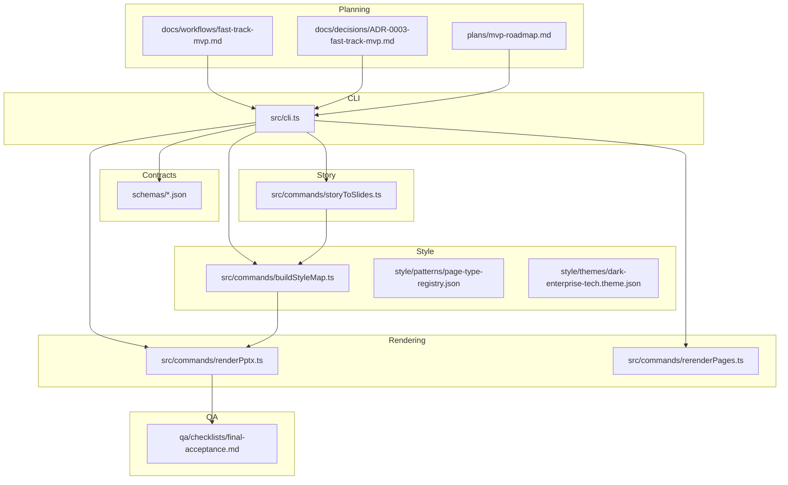
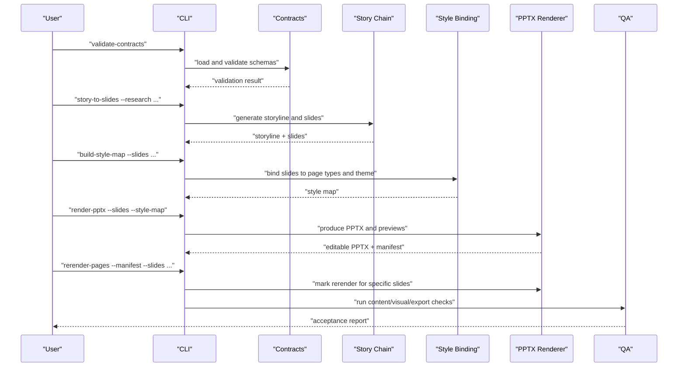
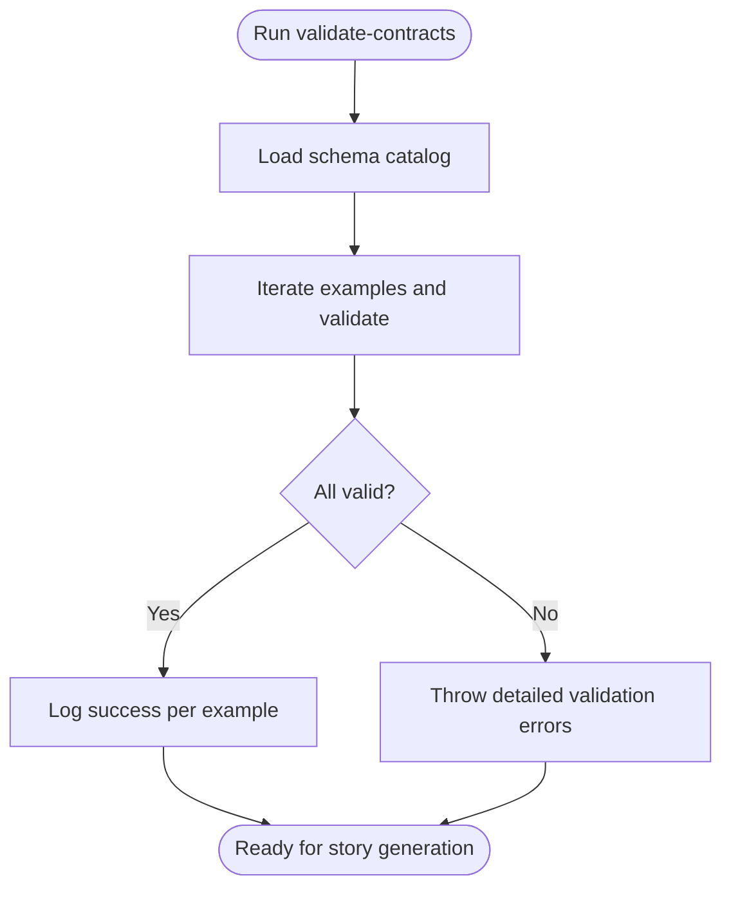
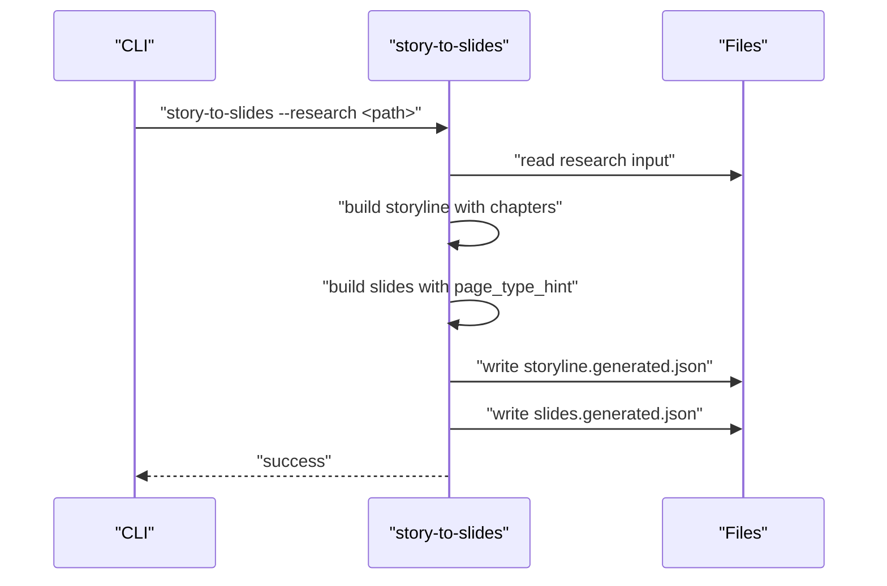
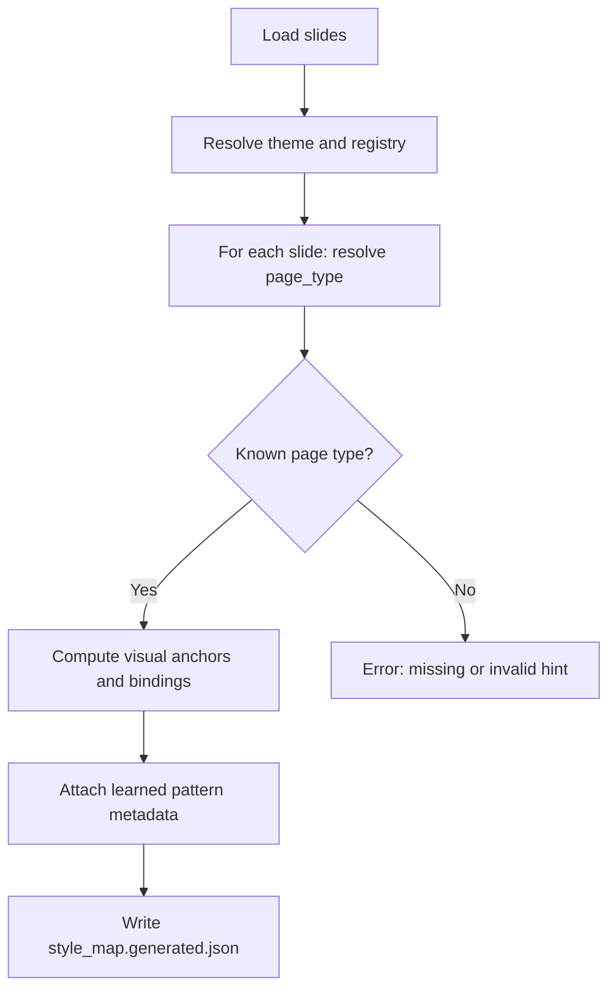
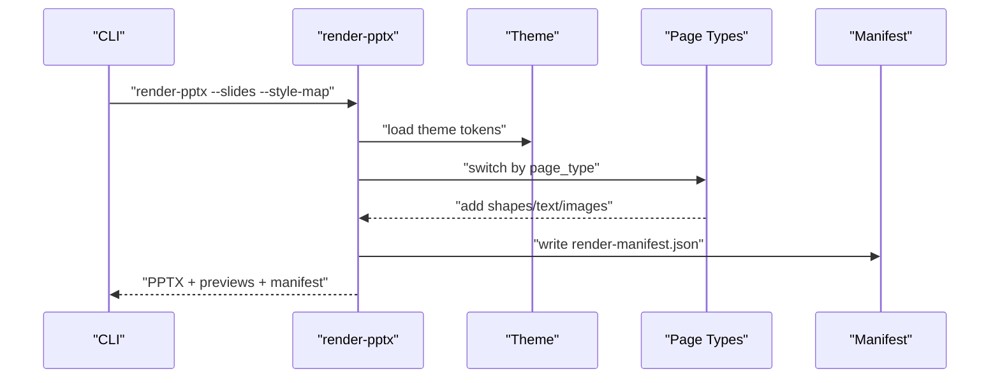
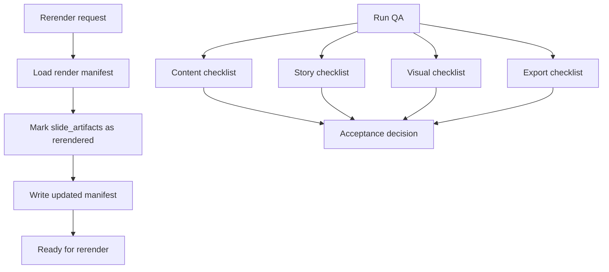
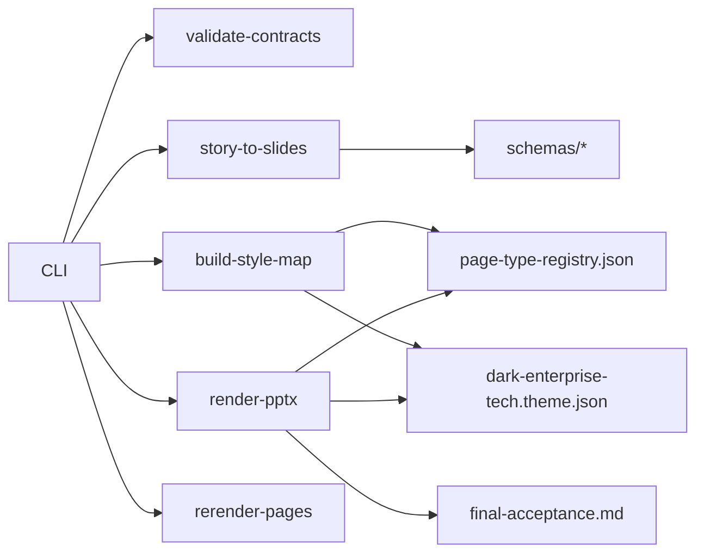

# MVP Development Workflow

<cite>
**Referenced Files in This Document**
- [fast-track-mvp.md](file://docs/workflows/fast-track-mvp.md)
- [ADR-0003-fast-track-mvp.md](file://docs/decisions/ADR-0003-fast-track-mvp.md)
- [mvp-roadmap.md](file://plans/mvp-roadmap.md)
- [cli.ts](file://src/cli.ts)
- [validateContracts.ts](file://src/commands/validateContracts.ts)
- [storyToSlides.ts](file://src/commands/storyToSlides.ts)
- [buildStyleMap.ts](file://src/commands/buildStyleMap.ts)
- [renderPptx.ts](file://src/commands/renderPptx.ts)
- [rerenderPages.ts](file://src/commands/rerenderPages.ts)
- [page-type-registry.json](file://style/patterns/page-type-registry.json)
- [dark-enterprise-tech.theme.json](file://style/themes/dark-enterprise-tech.theme.json)
- [final-acceptance.md](file://qa/checklists/final-acceptance.md)
</cite>

## Table of Contents
1. [Introduction](#introduction)
2. [Project Structure](#project-structure)
3. [Core Components](#core-components)
4. [Architecture Overview](#architecture-overview)
5. [Detailed Component Analysis](#detailed-component-analysis)
6. [Dependency Analysis](#dependency-analysis)
7. [Performance Considerations](#performance-considerations)
8. [Troubleshooting Guide](#troubleshooting-guide)
9. [Conclusion](#conclusion)
10. [Appendices](#appendices)

## Introduction
This document explains the Fast-Track MVP development workflow for delivering an editable, enterprise-grade PowerPoint deck rapidly. It documents the strategic single-deck, single-theme approach, the five-step build order from contracts to delivery rendering, required MVP page types, scope limitations, milestone tracking, and quality gates. It also explains the rationale for prioritizing PPTX-first rendering and how this ensures efficient development while preserving editability and quality.

## Project Structure
The repository organizes the MVP workflow across planning, schemas, story generation, style binding, rendering, QA, and CLI orchestration. The CLI exposes commands that implement each step of the workflow, while schemas and style catalogs stabilize contracts and page-type behavior.

**Diagram sources**
- [fast-track-mvp.md:1-75](file://docs/workflows/fast-track-mvp.md#L1-L75)
- [ADR-0003-fast-track-mvp.md:1-29](file://docs/decisions/ADR-0003-fast-track-mvp.md#L1-L29)
- [mvp-roadmap.md:1-68](file://plans/mvp-roadmap.md#L1-L68)
- [cli.ts:1-57](file://src/cli.ts#L1-L57)
- [validateContracts.ts:1-100](file://src/commands/validateContracts.ts#L1-L100)
- [storyToSlides.ts:1-166](file://src/commands/storyToSlides.ts#L1-L166)
- [buildStyleMap.ts:1-110](file://src/commands/buildStyleMap.ts#L1-L110)
- [renderPptx.ts:1-801](file://src/commands/renderPptx.ts#L1-L801)
- [rerenderPages.ts:1-40](file://src/commands/rerenderPages.ts#L1-L40)
- [page-type-registry.json:1-115](file://style/patterns/page-type-registry.json#L1-L115)
- [dark-enterprise-tech.theme.json:1-55](file://style/themes/dark-enterprise-tech.theme.json#L1-L55)
- [final-acceptance.md:1-28](file://qa/checklists/final-acceptance.md#L1-L28)

**Section sources**
- [fast-track-mvp.md:1-75](file://docs/workflows/fast-track-mvp.md#L1-L75)
- [ADR-0003-fast-track-mvp.md:1-29](file://docs/decisions/ADR-0003-fast-track-mvp.md#L1-L29)
- [mvp-roadmap.md:1-68](file://plans/mvp-roadmap.md#L1-L68)
- [cli.ts:1-57](file://src/cli.ts#L1-L57)

## Core Components
- CLI orchestrator: Provides commands for validating contracts, generating storylines and slides, building style maps, rendering PPTX, and marking rerenders.
- Contracts: JSON schemas and example outputs that stabilize research, storyline, slides, and style contracts.
- Story chain: Transforms structured research into a storyline and slide set with page-type hints.
- Style binding: Maps slides to a fixed theme and a controlled set of page types, with optional pattern-driven bindings.
- Rendering: Produces editable PPTX and SVG previews, with a versioned render manifest.
- QA: Enforces content, story, visual, and export quality gates via checklists.

**Section sources**
- [cli.ts:1-57](file://src/cli.ts#L1-L57)
- [validateContracts.ts:1-100](file://src/commands/validateContracts.ts#L1-L100)
- [storyToSlides.ts:1-166](file://src/commands/storyToSlides.ts#L1-L166)
- [buildStyleMap.ts:1-110](file://src/commands/buildStyleMap.ts#L1-L110)
- [renderPptx.ts:1-801](file://src/commands/renderPptx.ts#L1-L801)
- [final-acceptance.md:1-28](file://qa/checklists/final-acceptance.md#L1-L28)

## Architecture Overview
The workflow is delivery-first and layered. Contracts stabilize inputs and outputs; story generation produces structured slide content; style binding maps to page types and theme tokens; rendering emits editable PPTX and previews; QA validates adherence to quality gates.

**Diagram sources**
- [cli.ts:1-57](file://src/cli.ts#L1-L57)
- [validateContracts.ts:1-100](file://src/commands/validateContracts.ts#L1-L100)
- [storyToSlides.ts:1-166](file://src/commands/storyToSlides.ts#L1-L166)
- [buildStyleMap.ts:1-110](file://src/commands/buildStyleMap.ts#L1-L110)
- [renderPptx.ts:1-801](file://src/commands/renderPptx.ts#L1-L801)
- [rerenderPages.ts:1-40](file://src/commands/rerenderPages.ts#L1-L40)
- [final-acceptance.md:1-28](file://qa/checklists/final-acceptance.md#L1-L28)

## Detailed Component Analysis

### Contracts Stabilization
- Purpose: Lock schema contracts for research output, storyline output, slides output, style map, and theme to minimize iteration overhead.
- Implementation: The CLI exposes a validation command that loads the schema catalog and validates example datasets.
- Outcome: Early detection of contract drift prevents downstream rework.

**Diagram sources**
- [validateContracts.ts:1-100](file://src/commands/validateContracts.ts#L1-L100)

**Section sources**
- [validateContracts.ts:1-100](file://src/commands/validateContracts.ts#L1-L100)
- [fast-track-mvp.md:21-24](file://docs/workflows/fast-track-mvp.md#L21-L24)
- [mvp-roadmap.md:3-9](file://plans/mvp-roadmap.md#L3-L9)

### Story Chain Development
- Purpose: Convert structured research into a storyline and slide deck with page-type hints.
- Implementation: The CLI command reads a research input, constructs a narrative with chapters, and writes structured outputs for storyline and slides.
- Outcome: Consistent slide scaffolding with hints that drive style binding.

**Diagram sources**
- [storyToSlides.ts:1-166](file://src/commands/storyToSlides.ts#L1-L166)

**Section sources**
- [storyToSlides.ts:1-166](file://src/commands/storyToSlides.ts#L1-L166)
- [fast-track-mvp.md:25-29](file://docs/workflows/fast-track-mvp.md#L25-L29)
- [mvp-roadmap.md:16-21](file://plans/mvp-roadmap.md#L16-L21)

### Style Binding
- Purpose: Bind slides to a fixed theme and a controlled set of page types, enabling predictable rendering and manual overrides when hints are weak.
- Implementation: The CLI command loads the page-type registry, theme, and slide set, then builds a style map with component bindings and editable targets.
- Outcome: A deterministic mapping from slide content to page-type visuals and theme tokens.

**Diagram sources**
- [buildStyleMap.ts:1-110](file://src/commands/buildStyleMap.ts#L1-L110)
- [page-type-registry.json:1-115](file://style/patterns/page-type-registry.json#L1-L115)
- [dark-enterprise-tech.theme.json:1-55](file://style/themes/dark-enterprise-tech.theme.json#L1-L55)

**Section sources**
- [buildStyleMap.ts:1-110](file://src/commands/buildStyleMap.ts#L1-L110)
- [page-type-registry.json:1-115](file://style/patterns/page-type-registry.json#L1-L115)
- [dark-enterprise-tech.theme.json:1-55](file://style/themes/dark-enterprise-tech.theme.json#L1-L55)
- [fast-track-mvp.md:30-34](file://docs/workflows/fast-track-mvp.md#L30-L34)
- [mvp-roadmap.md:22-27](file://plans/mvp-roadmap.md#L22-L27)

### Delivery Rendering (PPTX-first)
- Purpose: Prioritize editable PPTX output, deriving previews from the same source to reduce drift and preserve editability.
- Implementation: The CLI command renders slides to PPTX using a theme and page-type-specific renderers, writes a versioned manifest, and generates SVG previews.
- Outcome: An editable deck plus reproducible previews for review and QA.

**Diagram sources**
- [renderPptx.ts:1-801](file://src/commands/renderPptx.ts#L1-L801)
- [dark-enterprise-tech.theme.json:1-55](file://style/themes/dark-enterprise-tech.theme.json#L1-L55)
- [page-type-registry.json:1-115](file://style/patterns/page-type-registry.json#L1-L115)

**Section sources**
- [renderPptx.ts:1-801](file://src/commands/renderPptx.ts#L1-L801)
- [fast-track-mvp.md:35-39](file://docs/workflows/fast-track-mvp.md#L35-L39)
- [mvp-roadmap.md:28-34](file://plans/mvp-roadmap.md#L28-L34)

### Preview and QA
- Purpose: Validate content coherence, story progression, visual intentionality, and export correctness.
- Implementation: The CLI supports rerendering specific slides via a manifest, while QA checklists enforce acceptance criteria.
- Outcome: A robust quality gate that catches common failures early.

**Diagram sources**
- [rerenderPages.ts:1-40](file://src/commands/rerenderPages.ts#L1-L40)
- [final-acceptance.md:1-28](file://qa/checklists/final-acceptance.md#L1-L28)

**Section sources**
- [rerenderPages.ts:1-40](file://src/commands/rerenderPages.ts#L1-L40)
- [final-acceptance.md:1-28](file://qa/checklists/final-acceptance.md#L1-L28)
- [fast-track-mvp.md:40-44](file://docs/workflows/fast-track-mvp.md#L40-L44)
- [mvp-roadmap.md:35-41](file://plans/mvp-roadmap.md#L35-L41)

### Required MVP Page Types and Scope Limitations
- MVP page types: Eight priority page types are defined in the registry and used in the rendering pipeline.
- Scope limitations: Deferred items include new theme families, style-memory automation, complex cross-page systems, standalone HTML preview renderer, and generalized style intelligence beyond the MVP set.

**Section sources**
- [page-type-registry.json:1-115](file://style/patterns/page-type-registry.json#L1-L115)
- [fast-track-mvp.md:45-62](file://docs/workflows/fast-track-mvp.md#L45-L62)
- [mvp-roadmap.md:50-58](file://plans/mvp-roadmap.md#L50-L58)

### Practical Workflow Execution Examples
- Contract validation: Run the validation command to ensure schemas and examples conform before proceeding.
- Story generation: Provide a research input and generate both storyline and slides outputs.
- Style mapping: Build a style map from the slides output using the fixed theme and page-type registry.
- Rendering: Produce an editable PPTX and previews; inspect the render manifest for outputs.
- Rerendering: Request local rerenders for specific slides by updating the manifest.
- QA: Complete content, story, visual, and export checklists to approve the deck.

**Section sources**
- [cli.ts:1-57](file://src/cli.ts#L1-L57)
- [validateContracts.ts:1-100](file://src/commands/validateContracts.ts#L1-L100)
- [storyToSlides.ts:1-166](file://src/commands/storyToSlides.ts#L1-L166)
- [buildStyleMap.ts:1-110](file://src/commands/buildStyleMap.ts#L1-L110)
- [renderPptx.ts:1-801](file://src/commands/renderPptx.ts#L1-L801)
- [rerenderPages.ts:1-40](file://src/commands/rerenderPages.ts#L1-L40)
- [final-acceptance.md:1-28](file://qa/checklists/final-acceptance.md#L1-L28)

### Milestone Tracking and Quality Gates
- Phased milestones: Foundations, Deep Research Input, Story Builder, Style Binding, Editable PPT Renderer, Preview and QA, and Deck Learning System.
- Exit criteria: Narratively coherent deck, consistent rendering across eight page types, working editable PPTX, local rerender capability, and QA coverage.
- Quality gates: Final acceptance checklist covering content, story, visual, and export domains.

**Section sources**
- [mvp-roadmap.md:1-68](file://plans/mvp-roadmap.md#L1-L68)
- [final-acceptance.md:1-28](file://qa/checklists/final-acceptance.md#L1-L28)

### Rationale for PPTX-first Rendering
- Delivery-first path reduces preview-delivery drift and ensures editable output is the canonical source.
- Deriving previews from PPTX maintains fidelity and avoids divergent rendering stacks.
- Local rerendering by slide ID enables targeted fixes without full-deck rebuilds.

**Section sources**
- [ADR-0003-fast-track-mvp.md:9-17](file://docs/decisions/ADR-0003-fast-track-mvp.md#L9-L17)
- [fast-track-mvp.md:10-12](file://docs/workflows/fast-track-mvp.md#L10-L12)
- [renderPptx.ts:1-801](file://src/commands/renderPptx.ts#L1-L801)

## Dependency Analysis
The workflow exhibits tight coupling between CLI commands and their underlying modules, with clear data dependencies flowing from contracts to story, style, and rendering.

**Diagram sources**
- [cli.ts:1-57](file://src/cli.ts#L1-L57)
- [validateContracts.ts:1-100](file://src/commands/validateContracts.ts#L1-L100)
- [storyToSlides.ts:1-166](file://src/commands/storyToSlides.ts#L1-L166)
- [buildStyleMap.ts:1-110](file://src/commands/buildStyleMap.ts#L1-L110)
- [renderPptx.ts:1-801](file://src/commands/renderPptx.ts#L1-L801)
- [rerenderPages.ts:1-40](file://src/commands/rerenderPages.ts#L1-L40)
- [page-type-registry.json:1-115](file://style/patterns/page-type-registry.json#L1-L115)
- [dark-enterprise-tech.theme.json:1-55](file://style/themes/dark-enterprise-tech.theme.json#L1-L55)
- [final-acceptance.md:1-28](file://qa/checklists/final-acceptance.md#L1-L28)

**Section sources**
- [cli.ts:1-57](file://src/cli.ts#L1-L57)
- [page-type-registry.json:1-115](file://style/patterns/page-type-registry.json#L1-L115)
- [dark-enterprise-tech.theme.json:1-55](file://style/themes/dark-enterprise-tech.theme.json#L1-L55)

## Performance Considerations
- Single-deck scope minimizes rendering overhead and accelerates feedback loops.
- Fixed theme and page-type set reduce branching complexity in the renderer.
- Local rerendering avoids full-deck recomposition, improving turnaround for targeted fixes.
- Preview derived from PPTX eliminates redundant rendering and reduces maintenance cost.

[No sources needed since this section provides general guidance]

## Troubleshooting Guide
- Contract validation failures: Review the detailed error messages and ensure example files match schema definitions.
- Missing page-type hints: Add or correct page_type_hint on slides; style binding requires either page_type or page_type_hint.
- Unknown page types: Confirm the page type exists in the registry and matches the registry id.
- Render mismatches: Verify the number of slides equals the style map length and that the theme id matches the style map.
- QA rejections: Address checklist items under content, story, visual, and export domains before final approval.

**Section sources**
- [validateContracts.ts:85-98](file://src/commands/validateContracts.ts#L85-L98)
- [buildStyleMap.ts:66-74](file://src/commands/buildStyleMap.ts#L66-L74)
- [renderPptx.ts:111-113](file://src/commands/renderPptx.ts#L111-L113)
- [final-acceptance.md:1-28](file://qa/checklists/final-acceptance.md#L1-L28)

## Conclusion
The Fast-Track MVP workflow trades breadth for speed by focusing on a single deck, a single theme family, and eight priority page types. The five-step build order—contracts, story chain, style binding, delivery rendering, and preview/QA—ensures rapid, reliable delivery of an editable, reviewable deck. The PPTX-first approach optimizes development efficiency while preserving editability and quality, setting the stage for future expansion with a Deck Learning System.

[No sources needed since this section summarizes without analyzing specific files]

## Appendices

### Five-Step Build Order Summary
- Contracts: Finalize and validate schemas and examples.
- Story Chain: Produce structured storyline and slides with page-type hints.
- Style Binding: Map slides to the fixed theme and page types.
- Delivery Rendering: Render editable PPTX and previews; write a versioned manifest.
- Preview and QA: Run content, story, visual, and export checklists; mark rerenders as needed.

**Section sources**
- [fast-track-mvp.md:19-44](file://docs/workflows/fast-track-mvp.md#L19-L44)
- [mvp-roadmap.md:10-41](file://plans/mvp-roadmap.md#L10-L41)